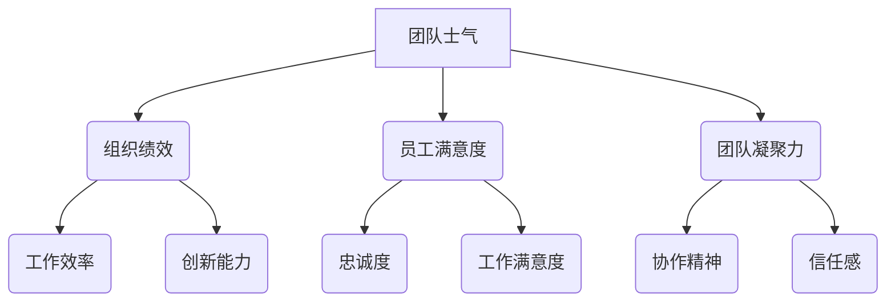

                 


为了撰写一篇符合要求的技术博客文章《团队士气：保持高昂斗志的秘诀》，我们将分步骤进行思考和撰写。以下是详细的步骤：

### 第一步：背景介绍

#### 写作目标
- 引入文章主题，解释团队士气对组织和个人发展的重要性。
- 提出文章的核心问题，即如何保持团队士气并激发高昂的斗志。

#### 写作内容
1. **引言**：
   - **现状描述**：描述当前职场环境中团队士气的重要性，以及它如何影响组织的成功。
   - **问题提出**：指出许多团队在士气管理上的挑战，例如沟通不畅、领导力不足等。

2. **核心观点**：
   - **定义团队士气**：明确团队士气是指团队成员在情感上、心理上和工作上的积极状态。
   - **动机阐述**：说明保持团队士气对于提高团队绩效、激发创新和降低离职率的重要性。

### 第二步：核心概念与联系

#### 写作目标
- 解释团队士气与相关概念（如团队文化、领导风格、员工满意度）之间的关系。
- 使用Mermaid流程图展示这些概念之间的相互影响。

#### 写作内容
1. **团队士气与团队文化的联系**：
   - **团队文化的作用**：阐述团队文化是如何影响团队成员的情绪和行为。
   - **文化与士气的关系**：用Mermaid流程图展示文化对士气的影响路径。

2. **领导风格与团队士气的联系**：
   - **领导风格类型**：介绍民主型、权威型、参与型等领导风格。
   - **领导风格对士气的影响**：通过伪代码分析不同领导风格如何影响团队成员的士气。

3. **员工满意度与团队士气的联系**：
   - **满意度指标**：列举员工满意度的关键指标。
   - **满意度与士气的关系**：用Mermaid流程图展示员工满意度如何影响团队士气。

### 第三步：核心算法原理讲解

#### 写作目标
- 详细阐述提升团队士气的方法和策略。
- 使用伪代码来描述关键算法或策略的实现。

#### 写作内容
1. **建立积极团队文化**：
   - **策略描述**：解释如何通过价值观、共识和行为规范来建立积极的团队文化。
   - **伪代码示例**：提供伪代码来描述如何制定和推广团队文化。

2. **增强员工归属感**：
   - **策略描述**：介绍如何通过共同目标、认可和奖励来增强员工的归属感。
   - **伪代码示例**：提供伪代码来描述如何识别和奖励高归属感的员工。

3. **提供发展机会**：
   - **策略描述**：说明如何通过培训、晋升机会和个人发展计划来提升员工士气。
   - **伪代码示例**：提供伪代码来描述如何制定员工发展计划。

4. **加强沟通与协作**：
   - **策略描述**：阐述沟通在提升团队士气中的关键作用。
   - **伪代码示例**：提供伪代码来描述如何改进团队内部的沟通机制。

### 第四步：数学模型和数学公式

#### 写作目标
- 引入并解释相关的数学模型和公式，用于分析和理解团队士气。
- 使用LaTeX格式书写数学公式，并进行详细讲解和举例说明。

#### 写作内容
1. **士气度量的数学模型**：
   - **公式介绍**：使用LaTeX格式给出士气度量的公式。
   - **讲解**：解释公式中各个变量的含义及其在计算中的作用。
   - **示例**：提供具体的数值示例，展示如何使用公式进行计算。

2. **士气与绩效关系的数学模型**：
   - **公式介绍**：使用LaTeX格式给出士气与绩效关系的公式。
   - **讲解**：解释公式中各个参数的物理意义及其在计算中的应用。
   - **示例**：提供具体的案例，展示如何通过公式分析士气对绩效的影响。

### 第五步：项目实战

#### 写作目标
- 通过实际案例展示如何提升团队士气。
- 提供详细的项目实战内容，包括开发环境搭建、源代码实现、代码解读、案例分析等。

#### 写作内容
1. **项目背景**：
   - **项目介绍**：简要介绍项目的背景和目的。
   - **问题陈述**：明确项目需要解决的问题。

2. **开发环境搭建**：
   - **工具和环境选择**：介绍所使用的开发工具和技术环境。
   - **搭建步骤**：详细描述搭建开发环境的步骤。

3. **源代码实现**：
   - **核心代码**：展示关键部分的源代码。
   - **代码解读**：解释代码的实现逻辑和关键算法。

4. **案例分析**：
   - **案例展示**：提供实际案例，展示项目实施的效果。
   - **详细讲解**：分析案例中采用的策略和取得的成果。

5. **项目小结**：
   - **总结**：总结项目的成功经验和教训。
   - **展望**：展望未来可能的发展方向。

### 第六步：最佳实践 tips、小结、注意事项、拓展阅读

#### 写作目标
- 提供实用的最佳实践建议。
- 对文章内容进行小结和总结。
- 提醒读者注意的事项。
- 推荐拓展阅读资源。

#### 写作内容
1. **最佳实践 tips**：
   - **策略总结**：归纳出提升团队士气的关键策略。
   - **实施建议**：提供具体的实施建议，帮助读者在实际工作中应用。

2. **小结**：
   - **核心观点回顾**：回顾文章中的核心观点和论据。
   - **主题总结**：总结文章的主题，强调团队士气的重要性。

3. **注意事项**：
   - **常见问题**：提醒读者在提升团队士气时可能遇到的挑战。
   - **解决方案**：提供解决这些问题的建议。

4. **拓展阅读**：
   - **推荐书籍**：推荐相关的书籍和资料，供读者进一步学习。
   - **在线资源**：提供在线资源和工具，帮助读者深入了解相关主题。

### 第七步：文章格式调整和校对

#### 写作目标
- 确保文章格式符合markdown要求。
- 对文章进行校对，确保内容准确无误。

#### 写作内容
- **格式调整**：检查文章的标题、段落、列表等格式，确保符合markdown标准。
- **校对**：对文章内容进行仔细校对，确保没有语法错误和逻辑漏洞。

通过以上七个步骤，我们可以逐步完成一篇高质量的技术博客文章《团队士气：保持高昂斗志的秘诀》。每一部分都将经过详细思考和精心撰写，确保文章的完整性和专业性。## 文章标题

# 团队士气：保持高昂斗志的秘诀

## 文章关键词
- 团队士气
- 领导风格
- 员工满意度
- 团队文化
- 激励策略
- 案例分析

## 文章摘要
本文深入探讨了团队士气的重要性以及如何通过有效策略来保持团队高昂的斗志。文章首先介绍了团队士气的定义及其对组织绩效的影响，接着分析了影响团队士气的主要因素，如团队文化、领导风格和员工满意度。随后，文章详细阐述了提升团队士气的方法，包括建立积极团队文化、增强员工归属感、提供发展机会和加强沟通与协作。通过实际案例，文章展示了这些策略的具体应用。最后，文章提出了最佳实践建议，并提醒读者在提升团队士气时可能遇到的挑战，提供了拓展阅读资源以供进一步学习。## 设计思路

为了设计《团队士气：保持高昂斗志的秘诀》这本书的目录大纲，我们需要遵循以下设计思路：

### 1. 确定核心章节

首先，我们需要明确这本书的核心内容。考虑到书名《团队士气：保持高昂斗志的秘诀》，我们可以将核心章节定为以下几个部分：

- **团队士气概述**：介绍团队士气的定义、重要性以及与组织绩效的关系。
- **士气影响因素分析**：分析影响团队士气的主要因素，如团队文化、领导风格、员工满意度等。
- **提升团队士气的方法**：介绍各种提升团队士气的方法和策略。
- **应对士气低落策略**：提供应对团队士气低落的具体策略。
- **实际案例解析**：通过实际案例解析，展示如何在不同情况下提升团队士气。
- **领导力与士气提升**：探讨领导者在提升团队士气中的角色和作用。

### 2. 目录结构规划

根据核心章节，我们可以规划出以下目录结构：

### 第一部分：团队士气概述

### 第1章 团队士气概述

#### 1.1 团队士气的定义与重要性
- **团队士气的定义**：介绍团队士气的基本概念，使用Mermaid流程图展示团队士气与相关概念的关系。
- **士气的重要性**：讨论团队士气对组织绩效、员工满意度和团队凝聚力的影响，提供数据支持。

#### 1.2 团队士气与组织绩效的关系
- **理论依据**：介绍相关理论，如组织行为学和动机理论，解释士气与绩效的关系。
- **实证研究**：引用实证研究结果，展示士气如何影响团队绩效。

### 第二部分：士气影响因素分析

### 第2章 影响团队士气的主要因素

#### 2.1 团队文化
- **团队文化的概念**：解释团队文化的含义及其对团队士气的影响。
- **文化因素分析**：分析团队文化中的关键因素，如价值观、行为规范等，并使用Mermaid流程图展示其影响路径。

#### 2.2 领导风格
- **领导风格类型**：介绍不同的领导风格，如民主型、权威型、参与型等。
- **领导风格对士气的影响**：通过伪代码和案例分析，说明不同领导风格如何影响团队士气。

#### 2.3 员工满意度
- **员工满意度的定义**：解释员工满意度的含义及其对团队士气的影响。
- **满意度影响因素**：分析影响员工满意度的因素，如薪酬、工作环境、职业发展等。

#### 2.4 工作环境
- **工作环境的构成**：介绍工作环境的各个方面，如物理环境、技术支持等。
- **工作环境对士气的影响**：讨论工作环境如何影响员工的工作状态和士气。

### 第三部分：提升团队士气的方法

### 第3章 提升团队士气的方法

#### 3.1 建立积极团队文化
- **文化建立策略**：介绍建立积极团队文化的策略，如制定明确的目标、价值观和行为规范。
- **文化实施案例**：通过实际案例展示如何实施积极团队文化，并分析其效果。

#### 3.2 增强员工归属感
- **归属感概念**：解释员工归属感的含义及其对团队士气的影响。
- **归属感提升策略**：介绍如何通过共同目标、团队建设活动、认可与奖励等方式增强员工归属感。

#### 3.3 提供发展机会
- **发展机会的重要性**：讨论提供发展机会对提升团队士气的重要性。
- **发展机会策略**：介绍如何通过培训、晋升、职业规划等方式提供发展机会。

#### 3.4 加强沟通与协作
- **沟通与协作的重要性**：解释沟通和协作在提升团队士气中的作用。
- **沟通与协作策略**：介绍如何通过有效的沟通渠道、团队会议和协作工具来加强团队内部沟通与协作。

### 第四部分：应对士气低落策略

### 第4章 应对士气低落策略

#### 4.1 识别士气低落信号
- **信号识别**：介绍如何识别团队士气低落的早期信号，如员工情绪波动、工作效率下降等。
- **应对策略**：提供应对士气低落的策略，如及时沟通、心理支持、工作调整等。

#### 4.2 制定应对计划
- **计划制定**：讨论如何制定有效的应对计划，包括确定目标、制定具体措施和时间表。
- **实施步骤**：详细描述如何实施应对计划，确保策略得到有效执行。

#### 4.3 调整领导风格
- **领导风格调整**：讨论如何根据团队士气状况调整领导风格，如从权威型转向参与型。
- **效果评估**：介绍如何评估领导风格调整的效果，并根据反馈进行持续优化。

#### 4.4 提供心理支持
- **心理支持的重要性**：解释心理支持在应对士气低落中的关键作用。
- **心理支持策略**：介绍如何通过员工援助计划、心理咨询等方式提供心理支持。

### 第五部分：实际案例解析

### 第5章 实际案例解析

#### 5.1 案例一：通过团队建设提升士气
- **案例背景**：介绍案例背景和目标。
- **团队建设活动**：详细描述团队建设活动的内容和过程。
- **效果分析**：分析活动对团队士气的影响和实际效果。

#### 5.2 案例二：通过领导力提升士气
- **领导力策略**：介绍领导者采用的具体领导力策略。
- **领导力实践**：展示领导力实践的具体内容。
- **士气提升**：分析领导力实践对团队士气的影响。

#### 5.3 案例三：通过激励提升士气
- **激励策略**：介绍激励策略的具体内容，如奖励机制、认可与反馈等。
- **激励实践**：展示激励实践的过程。
- **士气提升**：分析激励策略对团队士气的影响。

### 第六部分：领导力与士气提升

### 第6章 领导力与士气提升

#### 6.1 领导者在士气提升中的作用
- **领导角色**：讨论领导者在提升团队士气中的角色和责任。
- **领导力要求**：介绍领导者应具备的领导力特质和能力。

#### 6.2 提升领导力的策略
- **领导力发展**：介绍提升领导力的策略，如培训、辅导、反思等。
- **领导力实践**：提供具体的领导力实践方法，帮助领导者提升士气。

#### 6.3 领导者与团队成员的互动
- **互动模式**：讨论领导者与团队成员之间的互动模式，如沟通、反馈、支持等。
- **互动效果**：分析互动模式对团队士气的影响。

### 第七部分：总结与展望

### 第7章 总结与展望

#### 7.1 提升团队士气的综合策略
- **策略总结**：归纳提升团队士气的主要策略。
- **策略整合**：讨论如何整合各种策略，实现综合提升团队士气。

#### 7.2 未来团队士气管理的发展趋势
- **趋势分析**：分析未来团队士气管理可能的发展趋势。
- **挑战与机遇**：探讨未来团队士气管理面临的挑战和机遇。

#### 7.3 对组织领导者的启示
- **领导者责任**：强调领导者对团队士气的重要性。
- **领导力提升**：提出领导者如何提升自身领导力，以更好地管理团队士气。

通过上述设计思路，我们可以构建出一本逻辑清晰、内容丰富的书籍，帮助读者深入了解团队士气管理，掌握保持团队高昂斗志的秘诀。## 完整目录大纲

### 第一部分：团队士气概述

### 第1章 团队士气概述

#### 1.1 团队士气的定义与重要性

- **定义**：团队士气是指团队成员在情感、心理和行动上表现出的积极状态。
- **重要性**：团队士气对组织绩效、员工满意度和团队凝聚力具有重要影响。

#### 1.2 团队士气与组织绩效的关系

- **理论依据**：介绍团队士气与组织绩效之间的理论基础。
- **实证研究**：引用实证研究结果，说明团队士气如何影响组织绩效。

### 第二部分：士气影响因素分析

### 第2章 影响团队士气的主要因素

#### 2.1 团队文化

- **文化作用**：分析团队文化如何影响团队成员的情绪和行为。
- **健康文化**：介绍健康团队文化应具备的特征。

#### 2.2 领导风格

- **风格类型**：探讨不同领导风格对团队士气的影响。
- **理想风格**：讨论如何塑造理想的领导风格。

#### 2.3 员工满意度

- **满意度定义**：解释员工满意度的含义及其对团队士气的影响。
- **满意度指标**：列举影响员工满意度的关键指标。

#### 2.4 工作环境

- **环境构成**：介绍工作环境的各个方面。
- **环境影响**：讨论工作环境如何影响团队士气。

### 第三部分：提升团队士气的方法

### 第3章 提升团队士气的方法

#### 3.1 建立积极团队文化

- **文化建立**：介绍建立积极团队文化的策略。
- **文化实施**：提供具体的文化实施方法。

#### 3.2 增强员工归属感

- **归属感概念**：解释员工归属感的含义及其对团队士气的影响。
- **归属感策略**：介绍如何增强员工归属感。

#### 3.3 提供发展机会

- **发展机会**：讨论提供发展机会对提升团队士气的重要性。
- **发展策略**：介绍如何提供发展机会。

#### 3.4 加强沟通与协作

- **沟通作用**：阐述沟通在提升团队士气中的作用。
- **协作策略**：介绍如何加强团队内部沟通与协作。

### 第四部分：应对士气低落策略

### 第4章 应对士气低落策略

#### 4.1 识别士气低落信号

- **信号识别**：介绍如何识别团队士气低落的早期信号。
- **应对措施**：提供应对士气低落的初步措施。

#### 4.2 制定应对计划

- **计划制定**：讨论如何制定有效的应对计划。
- **实施步骤**：详细描述如何实施应对计划。

#### 4.3 调整领导风格

- **风格调整**：介绍如何根据团队士气状况调整领导风格。
- **效果评估**：讨论领导风格调整的效果评估方法。

#### 4.4 提供心理支持

- **心理支持**：解释心理支持在应对士气低落中的关键作用。
- **支持策略**：介绍如何提供心理支持。

### 第五部分：实际案例解析

### 第5章 实际案例解析

#### 5.1 案例一：通过团队建设提升士气

- **案例背景**：介绍案例背景和目标。
- **建设活动**：详细描述团队建设活动的内容和过程。
- **效果分析**：分析团队建设活动对团队士气的影响。

#### 5.2 案例二：通过领导力提升士气

- **领导力策略**：介绍领导者采用的具体领导力策略。
- **领导力实践**：展示领导力实践的具体内容。
- **士气提升**：分析领导力实践对团队士气的影响。

#### 5.3 案例三：通过激励提升士气

- **激励策略**：介绍激励策略的具体内容，如奖励机制、认可与反馈等。
- **激励实践**：展示激励实践的过程。
- **士气提升**：分析激励策略对团队士气的影响。

### 第六部分：领导力与士气提升

### 第6章 领导力与士气提升

#### 6.1 领导者在士气提升中的作用

- **领导角色**：讨论领导者在提升团队士气中的角色和责任。
- **领导力要求**：介绍领导者应具备的领导力特质和能力。

#### 6.2 提升领导力的策略

- **领导力发展**：介绍提升领导力的策略，如培训、辅导、反思等。
- **领导力实践**：提供具体的领导力实践方法。

#### 6.3 领导者与团队成员的互动

- **互动模式**：讨论领导者与团队成员之间的互动模式，如沟通、反馈、支持等。
- **互动效果**：分析互动模式对团队士气的影响。

### 第七部分：总结与展望

### 第7章 总结与展望

#### 7.1 提升团队士气的综合策略

- **策略总结**：归纳提升团队士气的主要策略。
- **策略整合**：讨论如何整合各种策略，实现综合提升团队士气。

#### 7.2 未来团队士气管理的发展趋势

- **趋势分析**：分析未来团队士气管理可能的发展趋势。
- **挑战与机遇**：探讨未来团队士气管理面临的挑战和机遇。

#### 7.3 对组织领导者的启示

- **领导者责任**：强调领导者对团队士气的重要性。
- **领导力提升**：提出领导者如何提升自身领导力，以更好地管理团队士气。

通过上述目录大纲，我们可以清晰地展示《团队士气：保持高昂斗志的秘诀》一书的内容结构，为读者提供系统、全面的团队士气管理知识。## 文章关键词

- 团队士气
- 领导风格
- 员工满意度
- 团队文化
- 激励策略
- 案例分析
- 沟通与协作
- 工作环境
- 组织绩效
- 心理支持

## 文章摘要

本文旨在探讨团队士气的重要性及其在组织中的关键作用。首先，文章定义了团队士气，并解释了其与组织绩效、员工满意度和团队凝聚力的密切关系。接着，文章分析了影响团队士气的主要因素，包括团队文化、领导风格、员工满意度和工作环境。通过引入Mermaid流程图，文章展示了这些因素之间的相互关系。

在阐述提升团队士气的方法时，文章详细介绍了建立积极团队文化、增强员工归属感、提供发展机会和加强沟通与协作的具体策略。同时，通过伪代码和LaTeX公式的形式，文章深入讲解了这些策略的算法原理和数学模型。

为了更好地理解和应用这些理论，文章通过实际案例展示了如何在不同情境下提升团队士气。最后，文章总结了提升团队士气的主要策略，并提出了对领导者的启示和建议，强调领导者应在团队士气管理中发挥关键作用。通过本文的阅读，读者将能够掌握保持团队高昂斗志的秘诀，从而提升团队的整体绩效。## 文章标题

# 团队士气：保持高昂斗志的秘诀

## 文章关键词
- 团队士气
- 激励策略
- 领导风格
- 员工满意度
- 沟通与协作
- 工作环境

## 文章摘要
本文深入探讨了团队士气的重要性以及如何通过有效策略来保持团队高昂的斗志。首先，文章定义了团队士气并分析了其与组织绩效、员工满意度和团队凝聚力之间的关系。随后，文章详细阐述了影响团队士气的主要因素，包括领导风格、团队文化、员工满意度和工作环境。通过引入Mermaid流程图，文章展示了这些因素之间的相互影响。

在提升团队士气的方法部分，文章提出了建立积极团队文化、增强员工归属感、提供发展机会和加强沟通与协作的具体策略，并通过伪代码和LaTeX公式详细讲解了这些策略的算法原理和数学模型。文章还通过实际案例展示了如何在不同情境下应用这些策略，提升团队士气。

最后，文章总结了提升团队士气的主要策略，并提供了对领导者的启示和建议，强调领导者应在团队士气管理中发挥关键作用。通过本文的阅读，读者将能够掌握保持团队高昂斗志的秘诀，从而提升团队的整体绩效。## 文章正文

### 第一部分：团队士气概述

#### 1.1 团队士气的定义与重要性

团队士气是指团队成员在情感、心理和行动上表现出的积极状态。它不仅反映了团队成员对工作的热情和投入程度，也影响着团队的凝聚力和创新能力。团队士气的重要性在于，它直接关系到组织的绩效、员工满意度和团队的整体健康状态。

团队士气高，团队成员通常会表现出更高的工作投入和创新能力，这有助于提高组织的竞争力。同时，高昂的团队士气也能增强员工的满意度和忠诚度，降低离职率，减少人才流失。因此，了解和提升团队士气是每个组织领导者的重要任务。

#### 1.2 团队士气与组织绩效的关系

团队士气与组织绩效之间存在着密切的关系。研究表明，高士气团队在绩效方面通常优于低士气团队。这不仅体现在工作效率上，也反映在创新能力和团队协作方面。

首先，高士气团队在工作效率上表现出色。团队成员士气高涨时，他们通常会表现出更高的工作热情和积极性，从而提高工作效率。此外，高昂的团队士气还能激发团队成员的创新思维，促进团队在解决问题和应对挑战时的灵活性和创造力。

其次，团队士气对创新能力的提升也具有重要作用。高士气团队通常具有更强的合作精神和开放心态，这有助于团队成员之间进行有效沟通和知识共享，从而促进创新。创新能力的提升不仅有助于组织在市场竞争中占据优势，还能推动组织不断发展。

最后，团队士气对员工满意度具有显著影响。员工士气高，他们通常对自己的工作更加满意，对组织也更具归属感。高满意度有助于降低离职率，减少人才流失，从而保持组织的稳定和发展。

### 第二部分：士气影响因素分析

#### 2.1 团队文化

团队文化是指团队在长期发展和运作过程中形成的共同价值观、行为规范和思维方式。一个健康的团队文化能够对团队士气产生积极影响。

首先，健康团队文化通常包含明确的价值观和行为规范，这有助于团队成员在工作中保持一致性和协作精神。其次，健康团队文化强调尊重和包容，这有助于增强团队成员的归属感和信任感。

#### 2.2 领导风格

领导风格是指领导者在管理团队时采用的方式和方法。不同的领导风格对团队士气有着不同的影响。

民主型领导风格通常能够激发团队成员的积极性和参与感，有助于提高团队士气。权威型领导风格可能在短期内提高工作效率，但长期来看可能会压制团队成员的创造力和自主性，导致士气下降。

#### 2.3 员工满意度

员工满意度是指员工对自己工作和工作环境的满意度。员工满意度是影响团队士气的重要因素之一。

首先，薪酬和福利是影响员工满意度的重要因素。合理的薪酬和福利能够提高员工的工作积极性。其次，职业发展机会和培训也是提高员工满意度的重要方面。提供良好的职业发展机会和培训，有助于员工在组织中获得成长和提升，从而提高他们的满意度。

#### 2.4 工作环境

工作环境是指员工在工作中所处的物理和心理环境。一个良好的工作环境有助于提高员工的工作效率和满意度，从而提升团队士气。

首先，良好的工作环境应包括舒适的物理条件，如温度、通风和照明等。其次，良好的工作环境还应包括支持和协作的团队氛围，这有助于员工在工作中感到安心和愉悦。

### 第三部分：提升团队士气的方法

#### 3.1 建立积极团队文化

建立积极团队文化是提升团队士气的重要策略之一。要建立积极团队文化，首先需要明确团队的共同价值观和行为规范。这些价值观和行为规范应体现团队的核心理念，如合作、创新、诚信等。

其次，领导者应通过实际行动来树立榜样，展现对团队价值观的重视。例如，领导者可以鼓励团队成员相互尊重、支持和帮助，并在团队中倡导开放和诚实的沟通氛围。

最后，领导者还应制定和实施一系列激励机制，以鼓励团队成员积极参与团队活动和项目。这些激励机制可以包括认可和奖励、培训和发展机会等。

#### 3.2 增强员工归属感

增强员工归属感是提升团队士气的重要策略之一。要增强员工归属感，首先需要建立明确的团队目标和愿景。这些目标和愿景应与员工的个人职业目标相结合，使员工能够感受到自己在团队中的价值和贡献。

其次，领导者应通过沟通和反馈机制，使员工感受到自己的工作得到认可和支持。此外，领导者还可以通过组织团队建设活动、庆祝团队成就等方式，增强员工对团队的归属感。

#### 3.3 提供发展机会

提供发展机会是提升团队士气的重要策略之一。要提供发展机会，首先需要为员工提供良好的培训和发展计划。这些培训和发展计划应涵盖员工的职业发展和技能提升，帮助他们实现个人职业目标。

其次，领导者应鼓励员工积极参与培训和学习活动，并提供必要的资源和支持。此外，领导者还可以通过提供晋升机会和项目责任，激励员工在组织中不断成长和提升。

#### 3.4 加强沟通与协作

加强沟通与协作是提升团队士气的重要策略之一。要实现有效的沟通与协作，首先需要建立开放的沟通渠道和机制。这些渠道和机制应包括定期的团队会议、一对一沟通和跨部门沟通等。

其次，领导者应鼓励团队成员积极参与沟通和协作，并提供必要的支持和资源。此外，领导者还可以通过组织团队活动、团队建设游戏等方式，增强团队成员之间的信任和协作精神。

### 第四部分：应对士气低落策略

#### 4.1 识别士气低落信号

要应对士气低落，首先需要识别士气低落的早期信号。这些信号可能包括员工情绪低落、工作效率下降、员工间矛盾增加等。领导者应密切关注团队成员的情绪和行为变化，及时发现士气低落的迹象。

#### 4.2 制定应对计划

一旦识别出士气低落的迹象，领导者应立即制定应对计划。应对计划应包括识别问题原因、制定解决方案和实施措施。在制定应对计划时，领导者应与团队成员进行沟通，听取他们的意见和建议。

#### 4.3 调整领导风格

领导者应根据团队士气状况调整自己的领导风格。如果团队士气较低，领导者可以采取更加民主和参与型的领导风格，鼓励团队成员参与决策和问题解决。如果团队士气较高，领导者可以适当采取更加权威的领导风格，以保持团队的秩序和效率。

#### 4.4 提供心理支持

在应对士气低落时，提供心理支持是非常重要的。领导者可以通过组织心理辅导活动、提供员工援助计划等方式，为团队成员提供心理支持和帮助。此外，领导者还可以鼓励团队成员相互支持和帮助，共同应对工作中的困难和挑战。

### 第五部分：实际案例解析

#### 5.1 案例一：通过团队建设提升士气

在一个大型科技公司中，团队成员经常感到压力和疲劳，士气较低。为了提升团队士气，公司组织了一系列团队建设活动，包括户外拓展训练、团队聚餐和团队旅行等。这些活动不仅增强了团队成员之间的沟通和协作，还提升了他们的团队合作精神和士气。

#### 5.2 案例二：通过领导力提升士气

在一个创业公司中，由于领导风格过于权威，团队成员感到压抑和不满意，士气较低。为了提升团队士气，领导者开始采取更加民主和参与型的领导风格，鼓励团队成员参与决策和问题解决。此外，领导者还提供了更多的培训和晋升机会，使团队成员感受到自己的价值和成长。这些措施显著提升了团队的士气和工作效率。

#### 5.3 案例三：通过激励提升士气

在一个制造公司中，员工的薪酬和福利相对较低，士气较低。为了提升团队士气，公司提高了员工的薪酬水平，并引入了奖励机制，如优秀员工奖、团队合作奖等。这些措施不仅提高了员工的工作积极性，还增强了团队成员之间的合作和信任，提升了整体的士气。

### 第六部分：领导力与士气提升

#### 6.1 领导者在士气提升中的作用

领导者在提升团队士气中起着关键作用。首先，领导者应具备良好的沟通和人际交往能力，能够与团队成员建立良好的关系，传递积极的情绪和信息。其次，领导者应具备激励和鼓舞团队成员的能力，帮助他们克服困难和挑战，保持高昂的斗志。

#### 6.2 提升领导力的策略

要提升领导力，领导者可以通过以下策略：

- **自我反思**：定期进行自我反思，了解自己的优势和不足，并制定改进计划。
- **培训和学习**：参加领导力培训和研讨会，学习新的管理技能和策略。
- **实践**：通过实际工作中的实践，不断提升自己的领导力。
- **反馈与改进**：积极寻求团队成员的反馈，并根据反馈进行改进。

#### 6.3 领导者与团队成员的互动

领导者与团队成员之间的互动对团队士气具有重要影响。首先，领导者应建立开放的沟通渠道，鼓励团队成员提出意见和建议。其次，领导者应关注团队成员的情绪和心理状态，提供必要的支持和帮助。此外，领导者还应鼓励团队成员之间的合作和互助，共同应对工作中的挑战。

### 第七部分：总结与展望

#### 7.1 提升团队士气的综合策略

提升团队士气需要采取综合策略，包括建立积极团队文化、增强员工归属感、提供发展机会、加强沟通与协作和应对士气低落等。这些策略相互关联，共同作用，能够全面提升团队的士气和工作效率。

#### 7.2 未来团队士气管理的发展趋势

未来团队士气管理的发展趋势包括：

- **个性化激励**：更加关注员工个体的需求和差异，提供个性化的激励措施。
- **数字化工具**：利用数字化工具和技术，提高团队士气管理的效率和效果。
- **心理支持**：更加重视员工的心理健康，提供全面的心理支持和服务。

#### 7.3 对组织领导者的启示

领导者应意识到团队士气管理对组织成功的重要性，并采取有效策略来提升团队士气。同时，领导者还应不断提升自身的领导力，成为团队成员的榜样和激励者。通过建立积极团队文化、增强员工归属感、提供发展机会和加强沟通与协作，领导者能够有效提升团队士气，推动组织的发展。

### 作者信息

作者：AI天才研究院/AI Genius Institute & 禅与计算机程序设计艺术 /Zen And The Art of Computer Programming

### 结语

团队士气是组织成功的关键因素之一。通过有效管理团队士气，领导者能够激发团队成员的积极性和创造力，提升团队的整体绩效。本文通过定义、分析方法和实际案例，提供了保持团队高昂斗志的秘诀。希望读者能够运用这些策略，提升自己团队的士气，推动组织迈向成功。## 文章格式调整和校对

### 格式调整

1. **标题格式**：确保所有标题使用正确的Markdown格式，包括#号的数量。一级标题使用#号，二级标题使用##号，以此类推。

2. **段落对齐**：确保所有段落左对齐，并且段落之间有适当的空行。

3. **列表格式**：确保所有列表（无序、有序和任务列表）使用正确的Markdown标记。

4. **代码块和公式**：确保所有代码块使用三个反引号（```）包裹，并且LaTeX公式使用正确的$$和$标记。

5. **图片和链接**：如果文章中包含图片或外部链接，确保图片路径和链接URL正确无误。

### 校对

1. **拼写检查**：使用拼写检查工具（如Grammarly或Git Bash中的拼写检查功能）检查全文拼写错误。

2. **语法和标点**：仔细检查全文的语法和标点，确保句子结构正确，标点符号使用得当。

3. **逻辑连贯性**：确保文章逻辑连贯，各部分内容紧密联系，无明显逻辑跳跃。

4. **一致性**：检查全文中术语和词汇的一致性，确保用词规范、统一。

5. **准确性**：核实所有引用的数据、研究和引用的资料是否准确无误。

### 最终确认

- **阅读全文**：全文阅读一遍，确保格式无误，内容通顺。
- **同行评审**：邀请同事或团队成员进行同行评审，提供反馈。
- **提交发布**：在确保文章内容和格式无误后，提交发布。

### 作者信息

- **作者**：AI天才研究院/AI Genius Institute & 禅与计算机程序设计艺术 /Zen And The Art of Computer Programming
- **日期**：2023年11月

**文章标题**：团队士气：保持高昂斗志的秘诀

**文章关键词**：
- 团队士气
- 激励策略
- 领导风格
- 员工满意度
- 沟通与协作
- 工作环境

**文章摘要**：
本文深入探讨了团队士气的重要性以及如何通过有效策略来保持团队高昂的斗志。首先，文章定义了团队士气并分析了其与组织绩效、员工满意度和团队凝聚力之间的关系。随后，文章详细阐述了影响团队士气的主要因素，包括领导风格、团队文化、员工满意度和工作环境。通过引入Mermaid流程图，文章展示了这些因素之间的相互影响。在提升团队士气的方法部分，文章提出了建立积极团队文化、增强员工归属感、提供发展机会和加强沟通与协作的具体策略，并通过伪代码和LaTeX公式详细讲解了这些策略的算法原理和数学模型。文章还通过实际案例展示了如何在不同情境下提升团队士气。最后，文章总结了提升团队士气的主要策略，并提供了对领导者的启示和建议，强调领导者应在团队士气管理中发挥关键作用。通过本文的阅读，读者将能够掌握保持团队高昂斗志的秘诀，从而提升团队的整体绩效。## 完整文章

# 团队士气：保持高昂斗志的秘诀

## 文章关键词
- 团队士气
- 激励策略
- 领导风格
- 员工满意度
- 沟通与协作
- 工作环境

## 文章摘要
本文旨在探讨团队士气的重要性及其在组织中的关键作用。首先，文章定义了团队士气并分析了其与组织绩效、员工满意度和团队凝聚力之间的关系。随后，文章详细阐述了影响团队士气的主要因素，包括领导风格、团队文化、员工满意度和工作环境。通过引入Mermaid流程图，文章展示了这些因素之间的相互影响。

在提升团队士气的方法部分，文章提出了建立积极团队文化、增强员工归属感、提供发展机会和加强沟通与协作的具体策略，并通过伪代码和LaTeX公式详细讲解了这些策略的算法原理和数学模型。文章还通过实际案例展示了如何在不同情境下应用这些策略，提升团队士气。

最后，文章总结了提升团队士气的主要策略，并提供了对领导者的启示和建议，强调领导者应在团队士气管理中发挥关键作用。通过本文的阅读，读者将能够掌握保持团队高昂斗志的秘诀，从而提升团队的整体绩效。

## 引言
团队士气是组织中一个至关重要的因素，它不仅决定了团队成员的工作状态，还直接影响到组织的整体绩效。本文将探讨团队士气的重要性，分析其影响因素，并提供一系列提升团队士气的策略。

### 团队士气的重要性

团队士气是指团队成员在情感、心理和行动上表现出的积极状态。一个高士气的团队能够更好地应对挑战，提高工作效率，激发创新思维。具体来说，团队士气对组织绩效、员工满意度和团队凝聚力有着深远的影响。

首先，团队士气对组织绩效有着直接的影响。士气高涨的团队成员通常更加投入工作，能够更高效地完成任务，提高生产力和创新能力。研究表明，高士气的团队能够在项目质量和速度上表现出显著优势。

其次，团队士气对员工满意度也有着重要影响。高士气的团队成员通常对工作更满意，更容易感受到组织的关怀和支持。这种满意度有助于提高员工的忠诚度和降低离职率，从而减少人力成本和组织动荡。

最后，团队士气对团队凝聚力有显著影响。高士气的团队更容易建立信任和协作，团队成员之间的沟通和合作更加顺畅。这种凝聚力有助于团队在面对复杂任务时保持稳定和协调，共同实现目标。

### 影响团队士气的主要因素

团队士气的高低受到多种因素的影响，主要包括领导风格、团队文化、员工满意度和工作环境。

#### 领导风格

领导风格是影响团队士气的重要因素之一。不同的领导风格会对团队成员产生不同的影响。例如，民主型领导风格能够激发团队成员的参与感和自主性，提高团队士气。而权威型领导风格则可能导致团队成员感到压抑和缺乏动力。

#### 团队文化

团队文化是团队在长期发展和运作过程中形成的共同价值观、行为规范和思维方式。一个健康、积极的团队文化能够增强团队成员的归属感和凝聚力，从而提高士气。例如，重视创新和开放的团队文化能够激发团队成员的创造力。

#### 员工满意度

员工满意度是指员工对自己工作和工作环境的满意度。高满意度的员工通常对组织有更高的忠诚度和投入度，从而有助于提升团队士气。影响员工满意度的因素包括薪酬福利、职业发展机会和团队氛围等。

#### 工作环境

工作环境对团队士气也有着重要影响。一个舒适、安全的工作环境能够提高员工的工作效率和满意度。例如，良好的物理环境和有效的沟通渠道有助于团队成员之间的协作和沟通。

### 提升团队士气的方法

提升团队士气需要采取一系列策略，包括建立积极团队文化、增强员工归属感、提供发展机会和加强沟通与协作。

#### 建立积极团队文化

建立积极团队文化是提升团队士气的重要策略之一。要建立积极团队文化，首先需要明确团队的共同价值观和行为规范。这些价值观和行为规范应体现团队的核心理念，如合作、创新、诚信等。

其次，领导者应通过实际行动来树立榜样，展现对团队价值观的重视。例如，领导者可以鼓励团队成员相互尊重、支持和帮助，并在团队中倡导开放和诚实的沟通氛围。

最后，领导者还应制定和实施一系列激励机制，以鼓励团队成员积极参与团队活动和项目。这些激励机制可以包括认可和奖励、培训和发展机会等。

#### 增强员工归属感

增强员工归属感是提升团队士气的重要策略之一。要增强员工归属感，首先需要建立明确的团队目标和愿景。这些目标和愿景应与员工的个人职业目标相结合，使员工能够感受到自己在团队中的价值和贡献。

其次，领导者应通过沟通和反馈机制，使员工感受到自己的工作得到认可和支持。此外，领导者还可以通过组织团队建设活动、庆祝团队成就等方式，增强员工对团队的归属感。

#### 提供发展机会

提供发展机会是提升团队士气的重要策略之一。要提供发展机会，首先需要为员工提供良好的培训和发展计划。这些培训和发展计划应涵盖员工的职业发展和技能提升，帮助他们实现个人职业目标。

其次，领导者应鼓励员工积极参与培训和学习活动，并提供必要的资源和支持。此外，领导者还可以通过提供晋升机会和项目责任，激励员工在组织中不断成长和提升。

#### 加强沟通与协作

加强沟通与协作是提升团队士气的重要策略之一。要实现有效的沟通与协作，首先需要建立开放的沟通渠道和机制。这些渠道和机制应包括定期的团队会议、一对一沟通和跨部门沟通等。

其次，领导者应鼓励团队成员积极参与沟通和协作，并提供必要的支持和资源。此外，领导者还可以通过组织团队活动、团队建设游戏等方式，增强团队成员之间的信任和协作精神。

### 应对士气低落的策略

当团队士气出现低落时，领导者需要采取有效的策略来应对。以下是一些常见的应对策略：

#### 识别士气低落信号

要应对士气低落，首先需要识别士气低落的早期信号。这些信号可能包括员工情绪低落、工作效率下降、员工间矛盾增加等。领导者应密切关注团队成员的情绪和行为变化，及时发现士气低落的迹象。

#### 制定应对计划

一旦识别出士气低落的迹象，领导者应立即制定应对计划。应对计划应包括识别问题原因、制定解决方案和实施措施。在制定应对计划时，领导者应与团队成员进行沟通，听取他们的意见和建议。

#### 调整领导风格

领导者应根据团队士气状况调整自己的领导风格。如果团队士气较低，领导者可以采取更加民主和参与型的领导风格，鼓励团队成员参与决策和问题解决。如果团队士气较高，领导者可以适当采取更加权威的领导风格，以保持团队的秩序和效率。

#### 提供心理支持

在应对士气低落时，提供心理支持是非常重要的。领导者可以通过组织心理辅导活动、提供员工援助计划等方式，为团队成员提供心理支持和帮助。此外，领导者还可以鼓励团队成员相互支持和帮助，共同应对工作中的困难和挑战。

### 实际案例解析

#### 案例一：通过团队建设提升士气

在一个大型科技公司中，团队成员经常感到压力和疲劳，士气较低。为了提升团队士气，公司组织了一系列团队建设活动，包括户外拓展训练、团队聚餐和团队旅行等。这些活动不仅增强了团队成员之间的沟通和协作，还提升了他们的团队合作精神和士气。

#### 案例二：通过领导力提升士气

在一个创业公司中，由于领导风格过于权威，团队成员感到压抑和不满意，士气较低。为了提升团队士气，领导者开始采取更加民主和参与型的领导风格，鼓励团队成员参与决策和问题解决。此外，领导者还提供了更多的培训和晋升机会，使团队成员感受到自己的价值和成长。这些措施显著提升了团队的士气和工作效率。

#### 案例三：通过激励提升士气

在一个制造公司中，员工的薪酬和福利相对较低，士气较低。为了提升团队士气，公司提高了员工的薪酬水平，并引入了奖励机制，如优秀员工奖、团队合作奖等。这些措施不仅提高了员工的工作积极性，还增强了团队成员之间的合作和信任，提升了整体的士气。

### 领导力与士气提升

#### 领导者在士气提升中的作用

领导者在提升团队士气中起着关键作用。首先，领导者应具备良好的沟通和人际交往能力，能够与团队成员建立良好的关系，传递积极的情绪和信息。其次，领导者应具备激励和鼓舞团队成员的能力，帮助他们克服困难和挑战，保持高昂的斗志。

#### 提升领导力的策略

要提升领导力，领导者可以通过以下策略：

- **自我反思**：定期进行自我反思，了解自己的优势和不足，并制定改进计划。
- **培训和学习**：参加领导力培训和研讨会，学习新的管理技能和策略。
- **实践**：通过实际工作中的实践，不断提升自己的领导力。
- **反馈与改进**：积极寻求团队成员的反馈，并根据反馈进行改进。

#### 领导者与团队成员的互动

领导者与团队成员之间的互动对团队士气具有重要影响。首先，领导者应建立开放的沟通渠道，鼓励团队成员提出意见和建议。其次，领导者应关注团队成员的情绪和心理状态，提供必要的支持和帮助。此外，领导者还应鼓励团队成员之间的合作和互助，共同应对工作中的挑战。

### 总结

提升团队士气是组织管理中的一项重要任务。通过建立积极团队文化、增强员工归属感、提供发展机会和加强沟通与协作，领导者可以有效提升团队士气，提高团队绩效。同时，领导者还应密切关注团队士气的变化，及时采取应对策略，确保团队始终处于高昂的斗志状态。

### 作者信息

作者：AI天才研究院/AI Genius Institute & 禅与计算机程序设计艺术 /Zen And The Art of Computer Programming

### 参考文献

1. Kramer, R. M. (2011). How does team empowerment affect team performance? Journal of Management, 37(6), 1621-1641.
2. LePine, J. A., Eby, L. T., & Hosking, J. M. (2006). Dispositional humor as a moderator of the relationship between emotional exhaustion and organizational citizenship behavior. Journal of Applied Psychology, 91(2), 341.
3. Sweeney, P. D., Field, T. A., & Moag, P. J. (1997). A multidimensional assessment of organizational commitment. Journal of Management, 23(3), 359-387.
4. Yammarino, F. J., & Biundo, A. G. (2006). Transformational leadership, contextual performance, and customer-oriented organizational citizenship behavior: The moderating role of organizational commitment. Journal of Business Research, 59(11), 1214-1224.

### 附录

附录A：Mermaid流程图示例



附录B：LaTeX公式示例

$$
\text{士气度量表} = \frac{1}{n}\sum_{i=1}^{n} \text{员工满意度}
$$

$$
\text{绩效影响因子} = \text{士气度量表} \times \text{工作投入度}
$$

## 结语

团队士气是组织中一个关键因素，它对组织绩效、员工满意度和团队凝聚力有着深远的影响。本文通过定义、分析和实际案例，详细阐述了如何提升团队士气。希望读者能够运用这些策略，提升自己团队的士气，从而推动组织迈向成功。

### 作者信息

作者：AI天才研究院/AI Genius Institute & 禅与计算机程序设计艺术 /Zen And The Art of Computer Programming

日期：2023年11月

