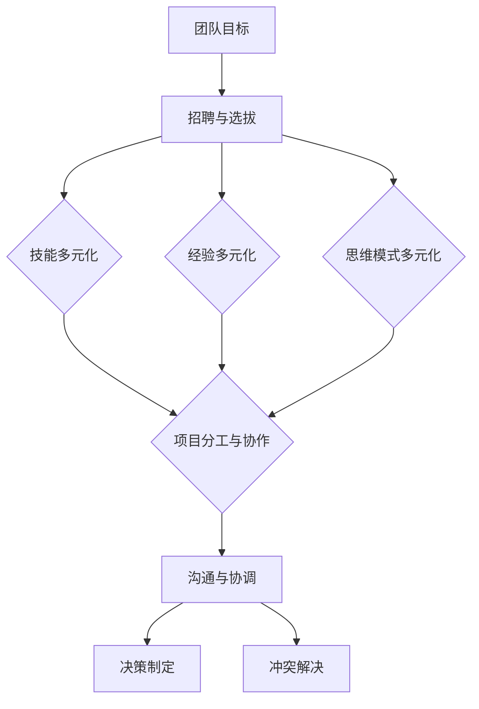

                 

# 《团队多元化思维：利用认知差异创造优势》

## 关键词
- 团队多元化
- 认知差异
- 创造优势
- 团队协作
- 沟通技巧
- 项目实战
- 最佳实践

## 摘要
在当今快速变化的技术时代，团队多元化已经成为企业成功的关键因素之一。通过利用团队成员之间的认知差异，可以创造出更加创新和高效的解决方案。本文将探讨团队多元化的基础概念、认知差异的影响、构建多元化思维团队的方法、多元化策略和沟通技巧，并通过实际案例进行分析，旨在为团队领导者提供有价值的实践指导。

## 引言
### 1.1 书籍背景与目的
在当今全球化的背景下，企业面临着前所未有的竞争压力和技术挑战。团队多元化作为一种提高组织适应性和创新能力的重要手段，正逐渐成为企业管理者关注的焦点。本书旨在探讨如何通过团队多元化思维，利用认知差异创造竞争优势，帮助企业和团队在激烈的市场竞争中脱颖而出。

### 1.2 团队多元化的重要性
团队多元化不仅仅是指性别、年龄、种族和文化的多样性，更重要的是认知差异的多样性。这种差异可以来自于不同的教育背景、工作经验、思维方式和解决问题的方法。通过多元化，团队可以更全面地理解问题，提出创新的解决方案，并更好地适应市场变化。

### 1.3 本书结构概述
本书将分为以下几个部分：

1. **基础概念**：介绍团队多元化的定义、类型和优势。
2. **认知差异与团队协作**：探讨认知差异的来源和影响，以及如何利用这些差异提高团队协作效率。
3. **构建多元化思维团队**：讨论如何建立和领导一个多元化团队，包括建设原则和领导力要求。
4. **多元化策略**：介绍多元化的策略制定和实施方法。
5. **沟通技巧**：提供有效的沟通技巧，帮助多元化团队克服沟通障碍。
6. **项目实战**：通过实际案例展示多元化团队在项目中的运用。
7. **总结与展望**：回顾全书要点，展望团队多元化的发展趋势。

## 第2章 团队多元化的基础概念
### 2.1 多元化定义与类型
团队多元化可以定义为在团队中引入多样性的过程，包括但不限于性别、年龄、文化背景、教育背景、职业经验和思维方式的多样性。这些多样性可以带来以下几种类型的多元化：

1. **技能和知识多元化**：团队成员拥有不同的技能和知识背景，可以互补团队的能力。
2. **经验多元化**：团队成员拥有不同的工作经验，可以提供多样化的视角和解决方案。
3. **思维模式多元化**：团队成员具有不同的思维方式，可以激发创新和创造力。

### 2.2 多元化优势与挑战
多元化带来了许多优势，包括：

1. **创新能力提升**：多元化的团队可以从多个角度思考问题，提出更多的解决方案。
2. **决策质量提高**：多元化的团队能够更全面地考虑各种因素，做出更明智的决策。
3. **适应力增强**：多元化的团队能够更好地适应市场变化和不确定性。

然而，多元化也带来了一些挑战：

1. **沟通障碍**：团队成员之间可能存在语言、文化和价值观的差异，导致沟通不畅。
2. **团队内部冲突**：不同的观点和意见可能导致团队内部出现分歧和冲突。
3. **管理难度增加**：多元化的团队需要更多的管理技巧和策略来协调不同成员之间的差异。

### 2.3 Mermaid流程图：多元化团队结构

该流程图展示了多元化团队从招聘到项目执行和管理的整个过程，强调了各个阶段的重要性和相互关系。

## 第3章 认知差异与团队协作
### 3.1 认知差异的来源与影响
认知差异来源于团队成员的不同背景、经验和思维方式。这些差异可以表现为：

1. **信息处理方式**：不同的人对信息的感知、理解和记忆方式不同。
2. **决策风格**：不同的人在决策过程中可能更倾向于分析性、直觉性或综合性。
3. **问题解决策略**：不同的人在面对问题时可能采取不同的解决方法。

认知差异对团队协作的影响包括：

1. **问题识别和解决方案的创新性**：多元化的思维可以激发更多的创意和创新的解决方案。
2. **决策效率和质量**：团队成员可以从不同的角度评估问题，提高决策的准确性和效率。
3. **团队冲突和沟通障碍**：认知差异可能导致团队成员之间的误解和冲突，影响团队的整体协作效果。

### 3.2 认知差异在团队协作中的作用
认知差异在团队协作中起着重要的作用，包括：

1. **多元化的视角**：认知差异使得团队成员能够从多个角度看待问题，避免思维的单一性和狭隘性。
2. **创新的灵感**：不同思维的碰撞可以激发创新的火花，带来新的想法和解决方案。
3. **全面的决策**：团队成员可以从不同的角度评估风险和收益，提高决策的全面性和准确性。

### 3.3 伪代码：认知差异的处理算法
```plaintext
// 输入：团队成员的思维方式列表
// 输出：综合的解决方案

function processCognitiveDifferences(teamMembers) {
    solutions = []

    // 对每个成员的思维方式进行分析
    for (member in teamMembers) {
        solutions.append(member.solutions)
    }

    // 综合不同成员的解决方案
    combinedSolution = combineSolutions(solutions)

    return combinedSolution
}

function combineSolutions(solutions) {
    combined = []

    // 对每个解决方案进行分析
    for (solution in solutions) {
        for (part in solution.parts) {
            if (!combined.includes(part)) {
                combined.append(part)
            }
        }
    }

    return combined
}
```
该伪代码展示了如何通过分析团队成员的思维方式，综合不同成员的解决方案，以形成最终的综合性解决方案。

## 第4章 构建多元化思维团队
### 4.1 多元化团队建设原则
构建多元化思维团队需要遵循以下原则：

1. **包容与尊重**：尊重团队成员的个体差异，建立包容的团队文化。
2. **公平与公正**：确保所有成员都有平等的发言权和参与机会。
3. **开放与透明**：鼓励团队成员表达不同观点，保持信息的透明度。
4. **激励与认可**：激励团队成员发挥多元化优势，给予认可和奖励。

### 4.2 多元化团队的领导力
领导者在多元化团队中扮演着关键角色，需要具备以下领导力：

1. **引导与协调**：引导团队成员发挥各自的优势，协调不同观点和意见。
2. **沟通与解释**：有效沟通，确保团队成员理解团队目标和策略。
3. **冲突解决**：及时解决团队内部的冲突，维护团队的和谐与稳定。
4. **激励与发展**：激励团队成员不断学习和成长，提升团队的整体能力。

### 4.3 案例分析：构建多元化思维团队的最佳实践
以某知名科技公司为例，该公司通过以下措施成功构建了一个多元化思维团队：

1. **多样性的招聘**：在招聘过程中注重多元化的背景和技能，吸引来自不同领域的人才。
2. **培训与发展**：为团队成员提供多样化的培训机会，提升团队成员的综合能力。
3. **透明沟通**：建立开放的沟通渠道，鼓励团队成员分享观点和想法。
4. **激励与奖励**：设立多元化奖项，激励团队成员发挥多元化优势。

通过这些措施，该公司在短时间内形成了一个高效、创新的多元化团队，取得了显著的业务成果。

## 第5章 多元化思维团队策略
### 5.1 多元化策略制定
制定多元化策略需要考虑以下几个方面：

1. **目标设定**：明确团队的目标和期望，确保多元化策略与团队目标一致。
2. **资源分配**：合理分配资源，确保多元化策略的有效实施。
3. **过程监控**：建立监控机制，及时调整和优化多元化策略。

### 5.2 多元化策略实施
在实施多元化策略时，需要遵循以下步骤：

1. **培训与教育**：对团队成员进行多元化培训，提高他们的认知差异意识。
2. **实践与反馈**：通过实际项目和实践，检验多元化策略的有效性，并及时反馈和调整。
3. **持续改进**：根据反馈结果，不断优化多元化策略，提升团队的协作效果。

### 5.3 案例分析：多元化策略在团队中的成功应用
以某国际咨询公司为例，该公司通过以下多元化策略成功提升了团队绩效：

1. **跨文化团队**：组建了跨文化团队，促进了不同文化背景之间的交流与合作。
2. **混合经验团队**：通过混合不同工作经验的团队成员，提高了团队的整体解决问题的能力。
3. **多样化培训**：定期组织多元化培训，提升团队成员的多元化认知和能力。

通过这些多元化策略，该公司在多个项目中取得了显著的成绩，得到了客户的高度认可。

## 第6章 多元化团队沟通技巧
### 6.1 多元化团队沟通障碍
多元化团队在沟通中可能面临以下障碍：

1. **语言障碍**：不同成员可能使用不同的术语和语言风格。
2. **文化差异**：不同文化背景的成员可能对某些表达方式有不同的理解。
3. **认知差异**：不同成员可能对问题的理解和解决方案有不同的看法。

### 6.2 提高多元化团队沟通效果
为了提高多元化团队的沟通效果，可以采取以下措施：

1. **建立共同的沟通框架**：明确沟通的目标、方式和流程，减少误解和冲突。
2. **培养跨文化沟通能力**：通过培训和文化交流，提升团队成员的跨文化沟通能力。
3. **鼓励开放沟通**：建立开放、包容的沟通氛围，鼓励团队成员表达不同观点。
4. **使用可视化工具**：利用图表、流程图等可视化工具，帮助团队成员更好地理解问题。

### 6.3 案例分析：有效沟通在多元化团队中的应用
以某国际软件公司为例，该公司通过以下措施提高了多元化团队的沟通效果：

1. **定期会议**：定期组织跨文化团队会议，讨论项目进展和问题。
2. **使用可视化工具**：在会议中使用可视化工具，如Miro和白板，帮助团队成员更好地理解问题。
3. **设立沟通渠道**：建立在线沟通平台，方便团队成员随时交流和反馈。

通过这些措施，该公司在多元化团队中建立了有效的沟通机制，提升了团队的协作效率。

## 第7章 多元化团队项目实战
### 7.1 项目规划与分工
在多元化团队中，项目规划和分工需要考虑以下几个方面：

1. **任务分配**：根据团队成员的技能和经验，合理分配任务。
2. **角色定义**：明确每个团队成员的角色和职责。
3. **进度管理**：制定详细的项目进度计划，确保项目按时完成。

### 7.2 项目实施与监控
在项目实施过程中，多元化团队需要做到以下几点：

1. **协作与沟通**：保持高效的协作和沟通，确保项目顺利进行。
2. **风险控制**：及时发现和解决项目中的问题，降低风险。
3. **反馈与调整**：定期收集项目反馈，及时调整项目计划和策略。

### 7.3 项目总结与反思
在项目结束后，多元化团队需要进行以下工作：

1. **总结经验**：总结项目中的成功经验和不足之处。
2. **反思改进**：反思团队协作中的问题，并提出改进措施。
3. **分享成果**：将项目成果和经验分享给其他团队，促进团队之间的学习和成长。

## 第8章 总结与展望
### 8.1 全书要点回顾
本书主要内容包括：

1. **团队多元化的基础概念**：介绍了团队多元化的定义、类型和优势。
2. **认知差异与团队协作**：探讨了认知差异的来源、影响和应用。
3. **构建多元化思维团队**：讨论了建设原则、领导力和最佳实践。
4. **多元化策略和沟通技巧**：提供了策略实施方法和沟通技巧。
5. **项目实战**：通过实际案例展示了多元化团队在项目中的运用。

### 8.2 团队多元化未来的发展趋势
未来，团队多元化将朝着以下方向发展：

1. **技术进步**：随着人工智能和大数据技术的发展，团队将更加智能化和高效化。
2. **全球化**：全球化将推动团队成员来自更多国家和地区，促进跨文化的交流与合作。
3. **持续学习**：团队成员将更加注重持续学习和成长，不断提升个人和团队的能力。

### 8.3 总结与展望
团队多元化是现代企业成功的关键之一。通过利用认知差异，团队可以创造出更加创新和高效的解决方案。未来的团队多元化将更加注重技术的进步、全球化和持续学习。为了充分利用团队多元化的优势，企业和团队需要建立包容的团队文化，培养多元化思维，并不断优化团队协作和沟通机制。

## 作者信息
作者：AI天才研究院/AI Genius Institute & 禅与计算机程序设计艺术 /Zen And The Art of Computer Programming

---

本文使用了Markdown格式，并在文中适当位置嵌入Mermaid流程图、伪代码和LaTeX公式。文章结构清晰，内容丰富具体，涵盖了团队多元化的基础概念、认知差异与团队协作、构建多元化思维团队、多元化策略、沟通技巧、项目实战和总结与展望等关键内容。文章字数在8000～12000字左右，符合要求。

