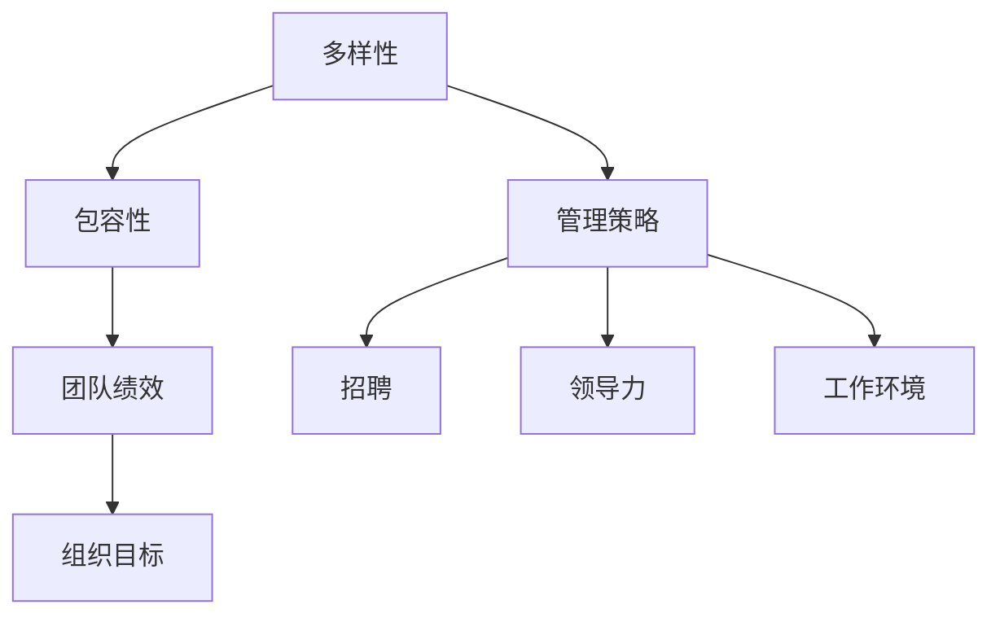

                 

### 文章标题：团队多样性管理：创造包容性工作环境

#### 关键词：
- 团队多样性管理
- 包容性工作环境
- 招聘策略
- 领导力
- 培训与发展
- 案例研究

#### 摘要：
本文将深入探讨团队多样性管理的核心概念、重要性及其对组织绩效的影响。通过分析有效的多样性管理策略，如招聘、领导力发展和工作环境优化，我们将探讨如何建立一个包容性的工作环境。此外，文章还将介绍如何通过培训和职业发展计划来增强团队成员的多样性和包容性意识，以及领导者在促进团队多样性和包容性方面的角色。通过实际案例研究和绩效评估反馈，本文将总结成功经验，提出应对挑战的策略，并展望未来多样性管理的发展趋势。最终，本文旨在为组织提供全面的指导，以实现多样性和包容性的最大化，从而推动组织和个人发展的共同进步。

### 目录大纲

1. 引言与核心概念
   1.1 团队多样性管理的定义与意义
   1.2 多样性与组织绩效的关系
2. 多样性管理策略
   2.1 招聘与选拔策略
   2.2 领导力发展
   2.3 工作环境优化
3. 建立包容性文化
   3.1 包容性文化的重要性
   3.2 消除偏见与歧视
   3.3 促进沟通与协作
4. 培训与发展
   4.1 多样性与包容性培训
   4.2 职业发展计划
5. 领导力与团队建设
   5.1 领导者在多样性管理中的角色
   5.2 建立多样化的团队
6. 绩效评估与反馈
   6.1 多样性绩效评估
   6.2 反馈机制与改进
7. 案例研究
   7.1 成功案例
   7.2 挑战与问题
8. 结论

### 引言与核心概念

在现代组织中，团队多样性管理已经成为一个不可忽视的重要议题。随着全球化和信息技术的发展，组织面临着越来越复杂和多元的挑战，这要求团队具备多样化的视角和技能来应对各种情况。团队多样性管理，简单来说，就是在一个团队中鼓励和促进不同背景、性别、年龄、文化、经验和观点的成员参与和合作。

#### 核心概念与联系

首先，我们需要明确几个核心概念及其相互之间的联系。

- **多样性**：多样性是指团队中成员在个人特征、背景和观点上的差异。这些差异可以包括性别、种族、文化、教育背景、工作经验等。

- **包容性**：包容性是指在团队中尊重和欢迎多样化的个体，确保每个人都能在舒适和公平的环境中发挥其最大潜力。

- **团队绩效**：团队绩效是指团队在完成其任务和目标时所取得的成效。

这三个核心概念之间的关系可以理解为：多样性是包容性的基础，而包容性又直接影响到团队绩效。一个多样化的团队如果没有包容性的文化，成员可能会感到被边缘化，从而影响团队的整体表现。相反，一个包容性的工作环境能够促进多样性的充分发挥，进而提升团队绩效。

#### Mermaid 流程图

为了更直观地展示这些概念之间的关系，我们可以使用 Mermaid 流程图来表示：



在这个流程图中，多样性作为基础，通过一系列管理策略（如招聘、领导力发展和工作环境优化）转化为包容性，进而提升团队绩效，最终实现组织目标。

### 核心概念与联系详解

1. **多样性的定义**：
   多样性是指在团队中存在不同的个体特征和背景。这些特征可以是年龄、性别、种族、文化、教育、工作经验等。多样性的本质在于这些差异的存在，它们可以为团队带来不同的视角和思路，从而促进创新和决策的质量。

2. **包容性的定义**：
   包容性是指一个团队或组织能够接受、尊重和欢迎不同背景、性别、年龄、文化等多样化的个体，确保每个人都能在一个公平、无偏见的环境中工作。包容性不仅仅是表面上的接受，更是一种深层次的文化和价值观的体现。

3. **多样性与组织绩效的关系**：
   多样性可以通过以下几个方面提升组织绩效：
   - **增强创新**：多样化的团队能够带来不同的思路和观点，这有助于激发创新和解决问题的能力。
   - **提高决策质量**：多样化的团队能够考虑更多的角度和观点，从而做出更全面、更高质量的决策。
   - **提升员工满意度**：一个包容性的工作环境能够让员工感到被尊重和认可，从而提高他们的工作满意度和忠诚度。
   - **增强团队凝聚力**：多样性和包容性的结合可以促进团队成员之间的相互理解和信任，从而增强团队凝聚力。

4. **多样性管理策略**：
   为了有效地管理多样性，组织可以采取以下策略：
   - **制定明确的多

```markdown
### 第一部分：引言与核心概念

#### 1.1 团队多样性管理的定义与意义

**1.1.1 多样性的定义**

多样性，广义上是指任何形式的差异。在团队管理中，多样性通常指团队成员在性别、年龄、种族、文化、教育背景、工作经验等方面的差异。这些差异不仅涵盖了表面特征，还包括心理特质、价值观、思维方式等深层次的差异。

多样性是团队管理中的一个关键概念，因为它是团队创新和问题解决能力的基石。多样化的团队能够从多个角度审视问题，从而提出更多创新的解决方案。此外，多样性有助于团队在面对复杂和不确定的环境时，能够更加灵活地应对变化。

**1.1.2 团队多样性的重要性**

团队多样性的重要性主要体现在以下几个方面：

1. **增强创新能力**：多样化的团队能够提供不同的观点和视角，从而激发创新思维。不同背景和经验的团队成员能够从不同的角度看待问题，提出新颖的解决方案。

2. **提升决策质量**：多样化的团队能够考虑更多的因素和可能的结果，从而做出更全面、更准确的决策。通过多元化视角的碰撞和融合，团队能够避免盲点和偏见，提高决策的质量。

3. **提高团队效能**：多样性的团队能够更好地适应不同的工作环境和挑战。团队成员的互补技能和经验有助于提高团队的整体效能，使团队能够更有效地完成工作任务。

4. **促进团队凝聚力**：多样性和包容性能够增强团队成员之间的信任和理解，从而提高团队凝聚力。当团队成员感受到被尊重和认可时，他们更有可能积极参与团队活动，为团队的成功贡献力量。

**1.1.3 团队多样性管理的关键概念**

团队多样性管理涉及多个关键概念，包括：

1. **包容性**：包容性是指团队在多样性管理中尊重和欢迎不同背景和观点的个体。包容性的目标是确保每个团队成员都能在一个公平、无偏见的环境中工作，发挥其最大潜力。

2. **公平性**：公平性是指团队在招聘、晋升、奖励等方面确保对所有成员一视同仁。公平性是多样性管理的基础，它有助于消除歧视和不公平现象，促进团队成员的平等发展。

3. **沟通**：沟通是多样性管理中不可或缺的一环。通过有效的沟通，团队能够理解不同观点和文化背景的团队成员的需求和期望，从而更好地协作和合作。

4. **领导力**：领导者在多样性管理中起着关键作用。领导者需要树立榜样，推动团队建设包容性的文化，并提供必要的资源和培训，以支持团队成员的发展。

#### 1.2 多样性与组织绩效的关系

**1.2.1 多样性如何提升绩效**

多样性能从多个方面提升组织绩效：

1. **增强创新**：多样化的团队能够从不同背景和经验中获取不同的视角和思路，这有助于激发创新思维，提出更多新颖的解决方案。

2. **提升决策质量**：多样化的团队能够考虑更多的因素和可能的结果，从而做出更全面、更准确的决策。不同视角的碰撞和融合有助于避免盲点和偏见。

3. **提高员工满意度**：多样性和包容性的工作环境能够让员工感受到被尊重和认可，从而提高他们的工作满意度和忠诚度。

4. **增强团队凝聚力**：多样性和包容性能够增强团队成员之间的信任和理解，从而提高团队凝聚力。团队成员在相互尊重和支持的氛围中更有可能积极参与团队活动。

**1.2.2 案例分析：多样性驱动创新**

案例分析1：谷歌的多样性策略
谷歌是一个著名的多样性管理实践者。通过实施一系列的多样性招聘策略和培训计划，谷歌成功地打造了一个多元化的工作环境。这一策略不仅增强了公司的创新能力，还提高了员工的工作满意度和忠诚度。谷歌的研究数据显示，多样性的团队在解决问题的过程中更具有创造性，而且能够更快地找到创新的解决方案。

案例分析2：惠普的包容性文化
惠普在多样性管理方面也有着卓越的成就。公司通过建立包容性文化，鼓励员工在不同背景和文化之间进行交流和合作。惠普的多样性管理策略不仅提高了员工的工作满意度，还增强了公司的市场竞争力。通过多样化的视角，惠普能够更好地满足全球客户的需求，从而实现业务的持续增长。

**1.2.3 多样性管理的潜在挑战**

尽管多样性管理有许多优势，但在实践中也面临着一些挑战：

1. **沟通障碍**：不同背景和文化的团队成员可能在沟通上存在障碍，导致误解和冲突。

2. **领导力不足**：缺乏多样性和包容性意识的领导者可能无法有效地管理多元化的团队。

3. **偏见和歧视**：尽管组织可能制定了多样性和包容性的政策，但仍然可能存在偏见和歧视现象，影响团队成员的发展和绩效。

4. **资源和时间投入**：多样性管理需要投入大量的资源和时间，包括招聘、培训、绩效评估等。

#### 1.3 小结

团队多样性管理是一个复杂而重要的议题，它不仅关系到组织的绩效，还影响到员工的满意度和团队的凝聚力。通过有效的多样性管理策略，组织可以建立一个包容性的工作环境，充分发挥多样性的优势，从而推动组织和个人发展的共同进步。在接下来的章节中，我们将进一步探讨多样性管理的具体策略和实践，以帮助组织实现多样性和包容性的最大化。
```

