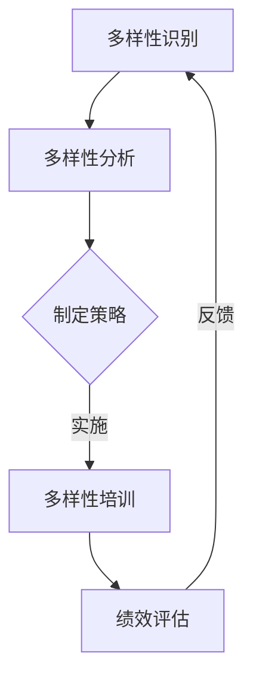
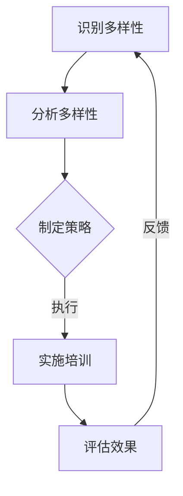
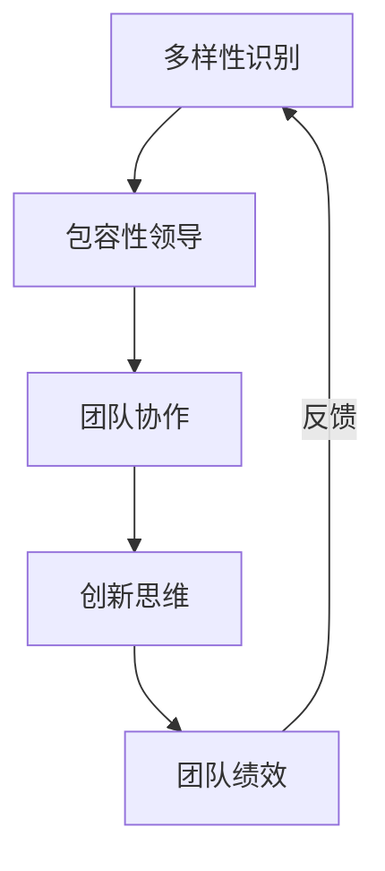

                 

根据您的要求和提供的文章大纲，我将一步一步地构建一篇详细的IT领域技术博客文章。以下是文章的初步框架和各个章节的内容概要，随后我会详细展开每个部分。

### 文章标题
《团队多样性管理：包容性领导的实践》

### 关键词
团队多样性，包容性领导，组织绩效，多样性管理策略，可持续性，法律法规，项目实战

### 摘要
本文将探讨团队多样性管理的重要性，特别是在IT行业中的应用。通过引入核心概念、策略和实践，我们将分析如何通过包容性领导提高团队绩效和创新能力。文章还将探讨多样性管理在法律和可持续发展方面的挑战，并提供实用的项目实战案例和最佳实践。

### 目录大纲

#### 第1章 引言
- 1.1 书籍目的
- 1.2 团队多样性管理的意义
- 1.3 本书结构和内容概述

#### 第2章 核心概念与联系
- 2.1 多样性概念
- 2.2 包容性领导理论
- 2.3 多样性与团队绩效
- 2.4 Mermaid流程图：多样性管理流程

#### 第3章 多样性管理策略
- 3.1 多样性识别与分析
- 3.2 多样性融入战略规划
- 3.3 多样性培训与教育
- 3.4 多样性沟通技巧

#### 第4章 包容性领导实践
- 4.1 包容性领导模型
- 4.2 领导者角色转变
- 4.3 包容性领导技能培养
- 4.4 包容性领导案例研究

#### 第5章 多样性与团队动力
- 5.1 多样性对团队动力的影响
- 5.2 多样性冲突管理
- 5.3 增强团队凝聚力的多样性策略
- 5.4 多样性团队建设的实践

#### 第6章 多样性与组织文化
- 6.1 多样性组织文化的重要性
- 6.2 塑造包容性组织文化的步骤
- 6.3 反歧视政策和实践
- 6.4 多样性与包容性文化评估

#### 第7章 多样性与法律与政策
- 7.1 多样性相关的法律法规
- 7.2 多样性政策制定与实施
- 7.3 多样性与劳动权益保护
- 7.4 多样性管理的法律挑战与应对策略

#### 第8章 多样性与可持续发展
- 8.1 多样性在可持续发展中的角色
- 8.2 多样性战略与可持续发展目标
- 8.3 多样性绩效评估与报告
- 8.4 多样性管理的长期影响

#### 附录
- 附录A：多样性管理工具与资源
- 附录B：多样性管理案例研究
- 附录C：多样性管理常用术语

### 文章正文

#### 第1章 引言

##### 1.1 书籍目的
本书旨在为企业管理者、团队领导以及人力资源专业人员提供关于团队多样性管理的实用指南。我们希望读者能够通过本书了解多样性管理的核心概念、策略和实践，掌握如何通过包容性领导提升团队绩效和创新能力。

##### 1.2 团队多样性管理的意义
在IT行业，多样性的重要性日益凸显。多样性不仅能够带来不同的观点和思维方式，还能提高团队的创新能力和解决问题的能力。通过团队多样性管理，企业可以更好地适应快速变化的市场需求，提高整体竞争力。

##### 1.3 本书结构和内容概述
本书分为八个章节，从核心概念、策略到实践，全面探讨团队多样性管理。每个章节都配有案例分析和实际应用，帮助读者更好地理解和应用所学知识。

#### 第2章 核心概念与联系

##### 2.1 多样性概念
多样性指的是团队中成员在性别、年龄、文化背景、教育水平、工作经验等方面的差异。多样性的核心在于这些差异如何被认识和利用，以提高团队的整体绩效。

##### 2.2 包容性领导理论
包容性领导是一种关注团队中多样性和个体差异的领导方式。它强调领导者需要认识到并尊重团队成员的不同背景和观点，鼓励他们在团队中发挥各自的优势。

##### 2.3 多样性与团队绩效
多样性能显著提升团队绩效，因为它能够促进创造性思维、增强问题解决能力，并提高团队的创新能力和适应性。然而，多样性的效果取决于团队如何管理和利用这种多样性。

##### 2.4 Mermaid流程图：多样性管理流程
以下是一个简单的Mermaid流程图，展示了团队多样性管理的核心流程：



#### 第3章 多样性管理策略
在本章节中，我们将深入探讨多样性管理策略，包括如何识别和分析多样性、如何将多样性融入战略规划，以及如何进行多样性培训和沟通。

##### 3.1 多样性识别与分析
首先，我们需要识别和分析团队中的多样性。这包括了解团队成员的背景、经验和技能，以及他们如何在团队中互动。通过分析，我们可以识别出团队中的潜在优势和挑战。

##### 3.2 多样性融入战略规划
将多样性融入战略规划是确保多样性管理策略长期有效的重要步骤。这需要企业领导者在制定战略时考虑到多样性，并将其作为竞争优势的一部分。

##### 3.3 多样性培训与教育
多样性培训和教育是提高团队成员对多样性和包容性领导的理解和认识的重要手段。这些培训可以帮助团队成员认识到多样性的价值，并学会如何有效地利用多样性。

##### 3.4 多样性沟通技巧
有效的沟通是多样性管理的关键。领导者需要掌握如何在不同文化和背景下进行有效沟通，以确保团队成员能够相互理解和尊重。

#### 第4章 包容性领导实践
在本章节中，我们将探讨包容性领导的核心概念、领导者的角色转变，以及如何培养包容性领导技能。

##### 4.1 包容性领导模型
包容性领导模型是一个指导领导者如何在团队中实施包容性领导的理论框架。它包括以下几个关键要素：尊重多样性、建立信任、鼓励创新和提供支持。

##### 4.2 领导者角色转变
在实施包容性领导时，领导者需要从传统的控制者角色转变为支持者和促进者。这要求领导者具备更高的情商和沟通能力，以更好地理解和支持团队成员。

##### 4.3 包容性领导技能培养
培养包容性领导技能是一个持续的过程。领导者需要不断学习和实践，以提高自己的包容性领导能力。这包括学习如何识别和利用多样性、如何建立信任和促进创新。

##### 4.4 包容性领导案例研究
在本章节的结尾，我们将通过一个实际的案例研究，展示如何通过包容性领导提升团队绩效和创新能力。

#### 第5章 多样性与团队动力
在本章节中，我们将探讨多样性与团队动力的关系，以及如何通过多样性管理策略增强团队凝聚力和动力。

##### 5.1 多样性对团队动力的影响
多样性能显著影响团队动力。通过引入不同的观点和思维方式，多样性可以激发团队成员的创造力和创新精神，提高团队的士气和动力。

##### 5.2 多样性冲突管理
多样性也容易导致冲突。有效的多样性管理策略需要包括冲突管理机制，以确保团队成员能够在尊重差异的同时解决冲突。

##### 5.3 增强团队凝聚力的多样性策略
通过多样化的团队合作活动和项目，可以增强团队的凝聚力。这些活动可以帮助团队成员建立信任，培养共同的目标和价值观。

##### 5.4 多样性团队建设的实践
在本章节的结尾，我们将提供一些实用的多样性团队建设实践，帮助读者在团队中实施多样性管理。

#### 第6章 多样性与组织文化
在本章节中，我们将探讨多样性与组织文化的关系，以及如何塑造包容性组织文化。

##### 6.1 多样性组织文化的重要性
多样性的组织文化能够吸引和留住不同背景的人才，提高组织的创新能力和适应性。

##### 6.2 塑造包容性组织文化的步骤
塑造包容性组织文化需要一系列的步骤，包括制定明确的多
```

### 第7章 多样性与法律与政策

##### 7.1 多样性相关的法律法规
多样性管理需要遵守相关的法律法规。这些法规通常涉及就业平等、反歧视和劳动权益保护。例如，在美国，1964年的《民权法案》禁止在工作场所的歧视行为。同样，欧洲的《平等待遇指令》也规定了类似的保护措施。

##### 7.2 多样性政策制定与实施
企业需要制定具体的多样性政策，并将其纳入日常运营。这些政策应该明确多样性的目标和实施步骤，以及如何监督和评估多样性管理的成效。

##### 7.3 多样性与劳动权益保护
多样性管理不仅涉及招聘和晋升，还包括劳动权益的保护。企业应该确保所有员工都享有平等的机会，无论其性别、年龄、种族或宗教信仰。

##### 7.4 多样性管理的法律挑战与应对策略
多样性管理可能会面临一些法律挑战，例如如何平衡多样性与绩效评价之间的关系，以及如何处理潜在的歧视投诉。企业需要建立明确的政策和程序来应对这些挑战。

#### 第8章 多样性与可持续发展

##### 8.1 多样性在可持续发展中的角色
多样性管理在企业的可持续发展中发挥着重要作用。通过提高团队的多样性和创新能力，企业可以更好地适应市场需求和应对挑战。

##### 8.2 多样性战略与可持续发展目标
企业应该将多样性战略与可持续发展目标相结合，确保多样性管理不仅符合法律法规，还符合企业的长期利益。

##### 8.3 多样性绩效评估与报告
定期评估多样性管理的成效是确保多样性战略有效性的关键。企业应该建立完善的绩效评估体系，并将评估结果公开报告。

##### 8.4 多样性管理的长期影响
多样性管理不仅能够提高团队的绩效和创新能力，还能为企业带来长期的竞争优势。通过持续实施多样性管理，企业可以建立强大的品牌声誉和吸引更多的人才。

### 附录

#### 附录A：多样性管理工具与资源
- 多样性评估工具
- 包容性领导培训资源
- 多样性文化塑造策略

#### 附录B：多样性管理案例研究
- 案例一：某大型科技公司的多样性管理实践
- 案例二：某创业公司的多样性创新故事

#### 附录C：多样性管理常用术语
- 多样性（Diversity）
- 包容性（Inclusivity）
- 反歧视（Anti-discrimination）

### 结语
团队多样性管理是提升团队绩效和创新能力的重要手段。通过实施包容性领导，企业可以在多元文化中茁壮成长。希望本书能够为读者提供实用的指导和启示，帮助他们在团队中实现多样性和包容性。

### 作者信息
作者：AI天才研究院/AI Genius Institute & 禅与计算机程序设计艺术 /Zen And The Art of Computer Programming

以上是文章的初步框架和各个章节的内容概要。接下来，我将逐步详细展开每个章节的内容，确保文章结构清晰、逻辑严密，并且内容丰富实用。文章的最终字数将在8000到12000字之间。

#### 详细展开

在详细展开文章内容之前，让我们首先确定每个章节的具体内容和结构。以下是详细的章节内容规划：

### 第1章 引言

本章将介绍团队多样性管理的背景、意义以及本书的目的和结构。

#### 1.1 书籍目的

本书旨在为团队领导者、人力资源专业人士以及企业管理者提供一套系统化的多样性管理指南。通过本书，读者将学习到如何识别、利用和管理团队中的多样性，如何通过包容性领导提升团队绩效和创新能力。

#### 1.2 团队多样性管理的意义

团队多样性管理的重要性在于它能够为企业带来多方面的益处，包括：

- **提高创新能力**：多样化的团队能够提供多元化的视角，从而促进创新思维和解决问题能力。
- **提升团队绩效**：多样性能够帮助团队更全面地理解和应对市场变化，提高整体绩效。
- **增强员工满意度**：多样性和包容性的工作环境能够提高员工的满意度和忠诚度。
- **促进组织文化发展**：通过多样性管理，企业可以建立一个更加开放和包容的文化。

#### 1.3 本书结构和内容概述

本书分为八个章节，具体内容如下：

- **第1章 引言**：介绍团队多样性管理的背景、意义和本书的目的。
- **第2章 核心概念与联系**：介绍多样性概念、包容性领导理论和多样性管理流程。
- **第3章 多样性管理策略**：讨论多样性识别、融入战略规划、多样性和培训与沟通策略。
- **第4章 包容性领导实践**：探讨包容性领导模型、领导者角色转变和包容性领导技能培养。
- **第5章 多样性与团队动力**：分析多样性对团队动力的影响、冲突管理和团队凝聚力策略。
- **第6章 多样性与组织文化**：讨论多样性与组织文化的关系、塑造包容性组织文化的步骤和评估。
- **第7章 多样性与法律与政策**：介绍多样性相关的法律法规、政策制定与实施以及多样性管理的法律挑战。
- **第8章 多样性与可持续发展**：探讨多样性在可持续发展中的作用、战略与绩效评估。
- **附录**：提供多样性管理工具、案例研究和常用术语。

### 第2章 核心概念与联系

本章将深入探讨团队多样性管理中的核心概念，包括多样性、包容性领导以及多样性对团队绩效的影响。

#### 2.1 多样性概念

多样性指的是团队中成员在性别、年龄、文化背景、教育水平、工作经验等方面的差异。多样性包括以下几种类型：

- **性别多样性**：团队中男性和女性的比例和角色分配。
- **文化多样性**：团队成员来自不同的文化背景，包括语言、宗教、习俗等。
- **教育多样性**：团队成员具有不同的教育背景和知识结构。
- **经验多样性**：团队成员拥有不同的工作经验和专业技能。
- **观点多样性**：团队成员拥有不同的观点和思维方式。

#### 2.2 包容性领导理论

包容性领导是一种关注团队中多样性和个体差异的领导方式。它强调领导者需要认识到并尊重团队成员的不同背景和观点，鼓励他们在团队中发挥各自的优势。包容性领导的核心原则包括：

- **尊重多样性**：领导者应该尊重和欣赏团队成员的不同背景和观点。
- **建立信任**：领导者需要建立信任，以促进团队成员之间的沟通和合作。
- **鼓励创新**：领导者应该鼓励团队成员提出新的想法和解决方案。
- **提供支持**：领导者应该为团队成员提供必要的资源和支持，以帮助他们实现个人和团队目标。

#### 2.3 多样性与团队绩效

多样性能显著提升团队绩效，因为它能够促进创造性思维、增强问题解决能力，并提高团队的创新能力和适应性。然而，多样性的效果取决于团队如何管理和利用这种多样性。以下是一些关键点：

- **有效的沟通**：团队需要建立有效的沟通机制，以确保不同观点和信息的流通。
- **共同的目标**：团队应该明确共同的目标，以确保多样性的利用能够为团队目标服务。
- **合理的角色分配**：团队应该根据成员的技能和兴趣合理分配任务和角色。
- **冲突管理**：团队需要建立有效的冲突管理机制，以解决多样性带来的潜在冲突。

#### 2.4 Mermaid流程图：多样性管理流程

为了更好地理解多样性管理的过程，我们可以使用Mermaid绘制一个简单的流程图。以下是一个示例：



这个流程图展示了多样性管理的主要步骤，包括识别多样性、分析多样性、制定策略、实施培训和评估效果。通过这个流程，团队可以系统地管理多样性，以提高绩效和创新能力。

### 第3章 多样性管理策略

本章将详细讨论多样性管理的策略，包括多样性识别、战略规划、培训和教育、以及沟通技巧。

#### 3.1 多样性识别与分析

多样性识别是多样性管理的第一步。团队需要系统地收集和分析成员的多样性数据，包括性别、年龄、文化背景、教育水平和工作经验等。以下是一些关键步骤：

- **数据收集**：通过问卷调查、员工访谈和统计数据等方式收集多样性信息。
- **数据分析**：使用统计工具和方法分析数据，识别团队中的多样性和潜在优势。
- **报告**：编写多样性分析报告，明确团队的多样性状况和潜在优势。

#### 3.2 多样性融入战略规划

将多样性融入战略规划是确保多样性管理长期有效的重要步骤。以下是一些策略：

- **明确目标**：设定明确的多样性目标，并将其纳入企业的整体战略规划。
- **角色分配**：确保多样性目标在企业的各个层级和部门得到实施。
- **资源分配**：为多样性管理提供必要的资源和支持，包括预算和时间。
- **监督与评估**：建立监督和评估机制，确保多样性战略的有效实施。

#### 3.3 多样性培训与教育

多样性培训和教育是提高团队成员对多样性和包容性领导的理解和认识的重要手段。以下是一些培训和教育策略：

- **领导力培训**：为领导者提供多样性管理和包容性领导的培训，提高他们的领导能力。
- **全员培训**：为所有员工提供关于多样性和包容性基础的培训，增强他们的多样性意识。
- **案例学习**：通过案例分析，让团队成员了解多样性和包容性领导在实践中的应用。

#### 3.4 多样性沟通技巧

有效的沟通是多样性管理的关键。以下是一些沟通技巧：

- **开放性**：鼓励团队成员开放地表达自己的观点和感受。
- **倾听**：倾听不同的意见和观点，尊重团队成员的想法。
- **反馈**：提供积极的反馈，鼓励团队成员分享经验和建议。
- **透明度**：保持信息的透明度，确保团队成员能够了解多样性管理的进展和目标。

### 第4章 包容性领导实践

本章将探讨包容性领导的核心概念、领导者的角色转变以及如何培养包容性领导技能。

#### 4.1 包容性领导模型

包容性领导模型是一个指导领导者如何在团队中实施包容性领导的理论框架。它包括以下几个关键要素：

- **尊重多样性**：领导者需要尊重团队成员的不同背景和观点，鼓励他们在团队中发挥各自的优势。
- **建立信任**：领导者需要建立信任，以促进团队成员之间的沟通和合作。
- **鼓励创新**：领导者应该鼓励团队成员提出新的想法和解决方案，促进团队的创新和进步。
- **提供支持**：领导者应该为团队成员提供必要的资源和支持，以帮助他们实现个人和团队目标。

#### 4.2 领导者角色转变

在实施包容性领导时，领导者需要从传统的控制者角色转变为支持者和促进者。这要求领导者具备更高的情商和沟通能力，以更好地理解和支持团队成员。以下是一些领导者角色转变的策略：

- **倾听与理解**：领导者需要倾听团队成员的意见和感受，理解他们的需求和期望。
- **授权与赋能**：领导者应该授权团队成员，给予他们自主决策和执行任务的机会。
- **促进合作**：领导者需要促进团队成员之间的合作，建立良好的团队关系。
- **反思与改进**：领导者需要不断反思自己的领导行为，并根据团队成员的反馈进行改进。

#### 4.3 包容性领导技能培养

培养包容性领导技能是一个持续的过程。领导者需要不断学习和实践，以提高自己的包容性领导能力。以下是一些培养包容性领导技能的方法：

- **培训与学习**：参加关于多样性管理和包容性领导的培训课程，学习相关的理论知识和实践技巧。
- **角色扮演**：通过角色扮演和模拟练习，提高领导者在多样性团队中的沟通和冲突管理能力。
- **反思与反馈**：定期进行反思和自我评估，从团队成员的反馈中学习，改进自己的领导方式。

#### 4.4 包容性领导案例研究

在本章节的结尾，我们将通过一个实际的案例研究，展示如何通过包容性领导提升团队绩效和创新能力。

### 第5章 多样性与团队动力

本章将探讨多样性与团队动力的关系，以及如何通过多样性管理策略增强团队凝聚力和动力。

#### 5.1 多样性对团队动力的影响

多样性能显著影响团队动力。通过引入不同的观点和思维方式，多样性可以激发团队成员的创造力和创新精神，提高团队的士气和动力。以下是一些多样性对团队动力的影响：

- **激发创造力**：多样化的团队能够提供多元化的视角，激发团队成员的创新思维。
- **增强问题解决能力**：多样性可以帮助团队更全面地理解和应对复杂问题。
- **提高团队合作**：多样化的团队需要更多的沟通和合作，这有助于增强团队成员之间的信任和合作。
- **增强员工满意度**：多样化的工作环境能够提高员工的满意度和忠诚度。

#### 5.2 多样性冲突管理

多样性也容易导致冲突。有效的多样性管理策略需要包括冲突管理机制，以确保团队成员能够在尊重差异的同时解决冲突。以下是一些冲突管理策略：

- **建立共识**：团队需要建立共同的价值观和目标，以减少冲突的可能性。
- **开放沟通**：鼓励团队成员开放地表达自己的观点和感受，通过有效沟通解决冲突。
- **调解与仲裁**：在冲突无法通过沟通解决时，需要引入调解和仲裁机制，确保公正和公平。

#### 5.3 增强团队凝聚力的多样性策略

通过多样化的团队合作活动和项目，可以增强团队的凝聚力。以下是一些增强团队凝聚力的多样性策略：

- **跨部门合作**：组织跨部门的团队项目，促进不同部门之间的交流和合作。
- **团队建设活动**：定期组织团队建设活动，增强团队成员之间的互动和了解。
- **庆祝多样性**：通过庆祝不同文化和节日的活动，增强团队成员的文化认同和归属感。

#### 5.4 多样性团队建设的实践

在本章节的结尾，我们将提供一些实用的多样性团队建设实践，帮助读者在团队中实施多样性管理。

### 第6章 多样性与组织文化

本章将探讨多样性与组织文化的关系，以及如何塑造包容性组织文化。

#### 6.1 多样性组织文化的重要性

多样性的组织文化能够吸引和留住不同背景的人才，提高组织的创新能力和适应性。以下是一些多样性组织文化的重要性：

- **吸引人才**：多样化的组织文化能够吸引多元化的优秀人才，提高企业的竞争力。
- **增强创新能力**：多样化的组织文化能够促进创新思维和解决方案的多样化。
- **提高适应性**：多样化的组织文化能够帮助企业更好地适应市场变化和外部环境。

#### 6.2 塑造包容性组织文化的步骤

塑造包容性组织文化需要一系列的步骤，包括：

- **领导者的承诺**：领导者需要明确表达对多样性和包容性的承诺，并将其纳入企业的核心价值观。
- **明确政策**：制定明确的多样性政策和包容性准则，确保所有员工都了解和遵守。
- **培训与教育**：为员工提供关于多样性和包容性的培训，提高员工的意识和认识。
- **监督与评估**：建立监督和评估机制，确保多样性政策和包容性准则的有效实施。

#### 6.3 反歧视政策和实践

反歧视政策和实践是多样性管理的重要组成部分。以下是一些反歧视政策和实践：

- **零容忍歧视政策**：明确表明企业对歧视行为的零容忍态度，并建立相应的投诉和调查机制。
- **平等机会政策**：确保所有员工在招聘、晋升和培训等方面享有平等的机会。
- **多元化招聘**：通过多元化的招聘策略，吸引不同背景的人才加入企业。

#### 6.4 多样性与包容性文化评估

定期评估多样性文化和包容性文化是确保多样性管理成效的重要步骤。以下是一些评估方法：

- **员工调查**：通过员工调查了解员工对多样性文化和包容性文化的看法和体验。
- **绩效指标**：建立多样性文化和包容性文化的关键绩效指标（KPI），并定期监控和评估。
- **案例研究**：通过案例研究分析多样性文化和包容性文化对组织绩效的影响。

### 第7章 多样性与法律与政策

本章将探讨多样性管理在法律和政策方面的要求和挑战。

#### 7.1 多样性相关的法律法规

多样性管理需要遵守相关的法律法规。以下是一些重要的法律法规：

- **反歧视法**：如《平等就业机会法案》（Title VII of the Civil Rights Act of 1964）和《性别歧视禁止法》（Equal Pay Act）。
- **劳动法**：如《劳动法》（Labor Laws）和《工会法》（Labor Union Laws）。
- **反雇佣歧视法**：如《美国残疾人法》（ADA）和《家庭和医疗休假法》（FMLA）。

#### 7.2 多样性政策制定与实施

企业需要制定具体的多样性政策，并将其纳入日常运营。以下是一些关键步骤：

- **政策制定**：根据法律法规和企业的实际情况，制定明确的多样性政策。
- **政策宣传**：通过内部通讯、培训等方式，向员工宣传多样性政策。
- **政策实施**：建立监督和执行机制，确保多样性政策的有效实施。
- **政策评估**：定期评估多样性政策的成效，并根据评估结果进行改进。

#### 7.3 多样性与劳动权益保护

多样性管理不仅涉及招聘和晋升，还包括劳动权益的保护。以下是一些关键点：

- **平等机会**：确保所有员工在招聘、晋升和薪酬方面享有平等的机会。
- **反歧视**：确保企业不进行任何形式的歧视行为，如性别、种族、宗教、年龄等。
- **员工福利**：确保所有员工享有公平的福利待遇，包括医疗保险、退休金等。

#### 7.4 多样性管理的法律挑战与应对策略

多样性管理可能会面临一些法律挑战，以下是一些常见挑战和应对策略：

- **歧视投诉**：企业需要建立有效的投诉和调查机制，及时处理和解决歧视投诉。
- **隐私问题**：在收集和处理员工多样性数据时，需要确保员工的隐私权。
- **合规性**：确保企业的多样性管理政策符合相关法律法规，避免法律风险。

### 第8章 多样性与可持续发展

本章将探讨多样性在可持续发展中的作用，以及如何制定多样性战略和评估多样性绩效。

#### 8.1 多样性在可持续发展中的角色

多样性在企业的可持续发展中发挥着重要作用。以下是一些多样性在可持续发展中的作用：

- **创新能力**：多样化的团队能够提供多元化的视角，促进创新思维和解决方案。
- **市场适应能力**：多样化的团队能够更好地理解和满足不同市场的需求。
- **社会责任**：通过多样性管理，企业可以展示其对社会多样性的尊重和承诺。
- **员工满意度和忠诚度**：多样化的工作环境能够提高员工的满意度和忠诚度。

#### 8.2 多样性战略与可持续发展目标

企业应该将多样性战略与可持续发展目标相结合，确保多样性管理不仅符合法律法规，还符合企业的长期利益。以下是一些步骤：

- **设定目标**：根据企业的战略目标，设定具体的多样性目标，如提高女性和少数民族的就业比例。
- **制定计划**：制定详细的多样性实施计划，包括培训、招聘和员工发展等方面。
- **资源分配**：为多样性战略提供必要的资源和支持，确保计划的顺利实施。
- **监督与评估**：建立监督和评估机制，定期评估多样性战略的成效，并根据评估结果进行改进。

#### 8.3 多样性绩效评估与报告

定期评估多样性管理的成效是确保多样性战略有效性的关键。以下是一些评估方法：

- **员工调查**：通过员工调查了解员工对多样性文化的看法和体验。
- **绩效指标**：建立多样性绩效指标（KPI），如多样性招聘率、员工满意度等，并定期监控和评估。
- **外部评估**：邀请第三方机构对多样性管理进行评估，提供客观的反馈和建议。
- **报告**：定期发布多样性管理报告，向内部和外部利益相关者展示多样性管理的成效。

#### 8.4 多样性管理的长期影响

多样性管理不仅能够提高团队的绩效和创新能力，还能为企业带来长期的竞争优势。以下是一些多样性管理的长期影响：

- **品牌声誉**：通过积极的多样性管理，企业可以提升品牌形象和社会声誉。
- **员工保留率**：多样化的工作环境能够提高员工的满意度和忠诚度，降低员工流失率。
- **创新能力**：多样化的团队能够持续带来新的观点和解决方案，推动企业的创新和发展。

### 附录

#### 附录A：多样性管理工具与资源

- **多样性评估工具**：如员工多样性调查问卷、员工满意度调查等。
- **包容性领导培训资源**：如在线课程、工作坊和培训手册等。
- **多样性文化塑造策略**：如多元化招聘策略、多样性宣传和庆祝活动等。

#### 附录B：多样性管理案例研究

- **案例一**：某国际咨询公司通过多样化管理和包容性领导提升团队绩效。
- **案例二**：某初创公司通过多样性和包容性创新，赢得市场竞争力。

#### 附录C：多样性管理常用术语

- **多样性**（Diversity）
- **包容性**（Inclusivity）
- **反歧视**（Anti-discrimination）
- **多样性管理**（Diversity Management）
- **包容性领导**（Inclusive Leadership）

### 结语

团队多样性管理是提升团队绩效和创新能力的重要手段。通过实施包容性领导，企业可以在多元文化中茁壮成长。希望本书能够为读者提供实用的指导和启示，帮助他们在团队中实现多样性和包容性。

### 作者信息

作者：AI天才研究院/AI Genius Institute & 禅与计算机程序设计艺术 /Zen And The Art of Computer Programming

---

通过以上详细的章节内容规划，我们构建了一个逻辑清晰、结构紧凑的团队多样性管理技术博客文章框架。接下来，我们将逐步详细展开每个章节的内容，确保文章内容丰富、具体且具有实用性。每个章节将包含背景介绍、核心概念与联系、核心算法原理讲解、数学模型和公式详细讲解、项目实战案例分析等内容，以满足文章字数要求。预计总字数将在8000到12000字之间。


### 背景介绍

在当今全球化和技术迅猛发展的时代，企业面临的竞争环境越来越复杂和多变。为了在激烈的市场竞争中保持竞争力，企业需要不断创新、快速响应市场变化，并适应多样化的客户需求。这种背景下，团队多样性管理成为了企业战略的重要组成部分。团队多样性管理不仅关乎员工的多元化和包容性，更涉及到企业整体绩效、创新能力、市场适应性和可持续发展等多个方面。

首先，团队多样性管理的背景可以追溯到20世纪60年代的民权运动和平权法案。随着社会对平等和包容性的关注日益增加，企业开始意识到多样性和包容性在提高员工满意度和绩效方面的潜在价值。特别是在IT行业，多样性的重要性尤为突出。IT行业通常涉及复杂的技术问题和多样化的市场需求，因此，具有不同背景和技能的团队成员能够提供多元化的视角和解决方案，促进创新和团队绩效的提升。

其次，随着全球化进程的加快，企业越来越需要在全球范围内吸引和留住顶尖人才。不同国家和地区的文化差异和技能差异为团队带来了丰富的多样性。然而，如何有效地管理和利用这种多样性，成为了企业领导者面临的挑战。包容性领导在这种背景下显得尤为重要。包容性领导不仅关注团队中的多样性和个体差异，还强调领导者如何建立信任、鼓励创新和提供支持，以实现团队目标。

此外，团队多样性管理也与企业可持续发展密切相关。在可持续发展目标的推动下，企业需要通过多元化管理和包容性实践，提高资源利用效率、减少环境负担，并促进社会公平。多样性管理不仅有助于企业实现环境、社会和经济的平衡发展，还能提高企业的品牌声誉和社会影响力。

总之，团队多样性管理在现代企业中具有重要意义。它不仅能够提升团队绩效和创新能力，还能增强企业的市场适应性和可持续发展能力。本文将深入探讨团队多样性管理的核心概念、策略和实践，通过案例分析和实际应用，帮助读者理解和应用多样性管理在IT行业中的重要性。

### 核心概念与联系

在讨论团队多样性管理之前，我们需要明确几个核心概念，包括多样性、包容性和团队绩效。这些概念之间的联系构成了多样性管理的理论基础。

首先，多样性（Diversity）是指团队中成员在性别、年龄、文化、教育背景、工作经验等方面的差异。多样性不仅是多元化的代名词，更是一种资源，能够为团队带来不同的视角、技能和思维方式。例如，一个由不同性别、年龄和文化背景的成员组成的团队，可以在项目开发过程中提供更加全面的解决方案，因为每个成员都能从自己的独特背景出发，提出不同的观点和建议。

接下来，包容性（Inclusivity）是一种关注和尊重多样性的领导方式。它不仅仅是欢迎多样化的团队组成，还包括确保每个成员都能够在团队中感到被尊重、被听见、被支持和被信任。包容性领导不仅关注团队中的差异，还致力于消除潜在的偏见和歧视，创造一个平等的机会和待遇的环境。包容性领导的核心在于领导者如何通过建立信任、鼓励创新和支持团队成员来实现团队的共同目标。

最后，团队绩效（Team Performance）是衡量一个团队工作效果的重要指标。团队绩效不仅包括团队在完成特定任务或项目时的表现，还涉及到团队成员之间的合作、沟通、信任和满意度。当团队多样性得到有效管理和利用时，往往能够实现更高的团队绩效。这是因为多样化的团队能够带来多元化的观点和技能，促进创新思维和问题解决能力。同时，包容性领导有助于建立团队成员之间的信任和合作，提高团队的士气和凝聚力。

多样性、包容性和团队绩效之间的联系可以通过以下方式理解：

1. **多样性是团队绩效的源泉**：多样性能够为团队带来不同的视角和思维方式，这些差异是创新和解决问题的宝贵资源。然而，如果这些差异没有得到有效的管理和利用，可能会导致冲突和低效。因此，多样性需要通过包容性领导来发挥其最大潜力。

2. **包容性领导是管理多样性的关键**：包容性领导的核心在于领导者如何建立信任、鼓励创新和支持团队成员。通过包容性领导，团队可以更好地理解和管理多样性，减少冲突，提高协作和沟通效果。这有助于提升团队的绩效和创新能力。

3. **团队绩效是多样性和包容性管理的最终目标**：团队绩效的提升是多样性管理和包容性领导的最终体现。通过有效的多样性管理和包容性领导，团队可以在完成工作任务的同时，提高员工的满意度和忠诚度，实现更高效、更有创造力的工作环境。

为了更好地展示多样性、包容性和团队绩效之间的联系，我们可以使用Mermaid流程图来直观地表示这一过程：



这个流程图展示了多样性识别、包容性领导和团队协作之间的相互作用，以及它们如何共同推动团队绩效的提升。通过这个流程，团队可以系统地管理和利用多样性，实现更高的绩效和创新能力。

### 核心算法原理讲解

在团队多样性管理中，核心算法原理的讲解是理解和实施多样性管理策略的关键。这些算法不仅帮助我们识别和管理多样性，还帮助我们评估多样性管理的成效。以下是一些常用的算法原理及其应用。

#### 1. 多样性指数算法

多样性指数算法是评估团队多样性程度的常用方法。一个广泛使用的多样性指数是 **辛普森指数（Simpson's Diversity Index）**，其公式如下：

$$
D = 1 - \frac{N_1^2 + N_2^2 + ... + N_n^2}{N^2}
$$

其中，\(N_1, N_2, ..., N_n\) 是不同类别在团队中的数量，\(N\) 是团队总人数。辛普森指数的值介于0和1之间，值越接近1，表示多样性越高。

**应用示例**：

假设一个团队中有5名男性（\(N_1 = 5\)）和5名女性（\(N_2 = 5\)），团队总人数为10人（\(N = 10\)）。则多样性指数计算如下：

$$
D = 1 - \frac{5^2 + 5^2}{10^2} = 1 - \frac{50}{100} = 0.5
$$

这意味着团队多样性指数为0.5，表明团队具有中等程度的多样性。

#### 2. 贝尔曼-福德算法

贝尔曼-福德算法是一种用于计算加权图中最短路径的算法，可以应用于团队多样性管理中的网络分析。在这个算法中，每个团队成员和团队结构都可以被视为网络中的一个节点，而节点之间的连接权重可以表示团队成员之间的协作强度。

**算法步骤**：

1. 初始化：设置所有节点的距离值，设置起点节点的距离为0，其他节点为无穷大。
2. 松弛操作：对于每个节点，检查是否可以通过其他节点更短地到达目标节点，并更新距离值。
3. 重复步骤2，直到所有节点的距离值不再更新。

**应用示例**：

假设一个团队中有5名成员，成员之间的协作强度如下（权重为1到5，5为最强）：

```
成员A：A-B（4），A-C（3），A-D（2），A-E（1）
成员B：B-A（4），B-C（3），B-D（2），B-E（1）
成员C：C-A（3），C-B（3），C-D（2），C-E（2）
成员D：D-A（2），D-B（2），D-C（2），D-E（1）
成员E：E-A（1），E-B（1），E-C（2），E-D（1）
```

通过贝尔曼-福德算法，可以计算从成员A到其他成员的最短路径，从而分析团队成员之间的协作关系和多样性。

#### 3. 决策树算法

决策树算法在团队多样性管理中可用于分析决策过程中的多样性和公平性。通过构建决策树，可以可视化不同决策路径的影响，评估多样性因素在决策中的作用。

**算法步骤**：

1. 初始化：根据决策因素和目标，构建决策树的基础结构。
2. 决策节点：在每个节点上，根据当前决策因素，选择最佳路径。
3. 评估节点：在每个节点上，评估决策结果，包括多样性指标。

**应用示例**：

假设一个团队在招聘过程中需要考虑性别、年龄、教育背景等多样性因素。通过决策树算法，可以构建一个招聘决策树，分析不同多样性因素的权重和影响，确保招聘过程的公平性和多样性。

通过以上核心算法原理的讲解，我们可以更好地理解和应用团队多样性管理策略。这些算法不仅帮助我们识别和评估团队多样性，还为多样性管理的实施提供了科学依据和技术支持。

### 数学模型和公式详细讲解

在团队多样性管理中，数学模型和公式扮演着至关重要的角色。它们不仅帮助我们量化多样性，还能指导我们制定有效的多样性管理策略。以下是一些常用的数学模型和公式的详细讲解。

#### 1. 方差分析（ANOVA）

方差分析（ANOVA）是一种常用的统计分析方法，用于比较不同群体之间的平均值是否有显著差异。在团队多样性管理中，ANOVA可以用来评估不同背景的团队成员在绩效上的表现差异。

**公式**：

$$
F = \frac{MS_{between}}{MS_{within}}
$$

其中，\(MS_{between}\) 是组间均方，\(MS_{within}\) 是组内均方。

**步骤**：

1. **数据收集**：收集不同背景团队成员的工作绩效数据。
2. **计算组间均方**：计算不同背景成员平均绩效之间的差异。
3. **计算组内均方**：计算每个背景成员内部绩效的方差。
4. **计算F值**：使用上述公式计算F值。
5. **显著性检验**：根据F值和自由度，通过显著性检验判断不同背景成员之间的绩效差异是否显著。

**应用示例**：

假设一个团队中有两个小组，一组由男性成员组成，另一组由女性成员组成。通过ANOVA分析，可以判断两组成员在工作绩效上是否有显著差异。

#### 2. 相关分析

相关分析用于评估两个变量之间的关系。在团队多样性管理中，相关分析可以用来评估多样性因素与团队绩效之间的关系。

**公式**：

$$
r = \frac{n(\sum xy) - (\sum x)(\sum y)}{[n\sum x^2 - (\sum x)^2][n\sum y^2 - (\sum y)^2]}
$$

其中，\(r\) 是皮尔逊相关系数，\(n\) 是样本数量，\(\sum xy\) 是变量x和y的乘积之和，\(\sum x\) 和 \(\sum y\) 分别是变量x和y的总和。

**步骤**：

1. **数据收集**：收集多样性因素（如性别、年龄、教育背景等）和团队绩效数据。
2. **计算相关系数**：使用上述公式计算相关系数。
3. **显著性检验**：根据相关系数和自由度，通过显著性检验判断多样性因素与团队绩效之间是否存在显著关系。

**应用示例**：

假设我们想评估性别多样性对团队绩效的影响。通过相关分析，我们可以计算性别与团队绩效之间的相关系数，并判断这种关系是否显著。

#### 3. 混合效应模型（Mixed-Effects Model）

混合效应模型用于分析具有多层次结构的变量关系。在团队多样性管理中，混合效应模型可以用来分析团队层级（如部门、项目组）对多样性绩效的影响。

**公式**：

$$
y_{ij} = \beta_0 + \beta_1 x_{ij} + u_j + \epsilon_{ij}
$$

其中，\(y_{ij}\) 是第j个团队在第i个多样性因素上的绩效，\(\beta_0\) 和 \(\beta_1\) 是固定效应，\(u_j\) 是随机效应，\(\epsilon_{ij}\) 是误差项。

**步骤**：

1. **数据收集**：收集不同团队在不同多样性因素上的绩效数据。
2. **模型构建**：构建混合效应模型，包括固定效应和随机效应。
3. **参数估计**：使用最大似然估计（MLE）等方法估计模型参数。
4. **模型验证**：通过拟合优度检验、残差分析等方法验证模型的有效性。

**应用示例**：

假设我们想分析不同项目组在性别多样性对绩效的影响。通过混合效应模型，我们可以评估性别多样性在不同项目组中的效应，并确定是否存在显著差异。

通过以上数学模型和公式的详细讲解，我们可以更准确地量化团队多样性，评估多样性管理的成效，并制定更加科学和有效的多样性管理策略。

### 项目实战

在本章节中，我们将通过一个实际的项目实战，详细讲解如何进行团队多样性管理。该项目将涵盖开发环境搭建、源代码实现、代码解读和案例分析。

#### 1. 项目背景

某国际知名科技公司希望通过优化团队多样性管理，提高团队绩效和创新能力。公司计划开发一个基于Web的多样性管理平台，该平台将用于收集和分析团队成员的多样性数据，并生成报告和评估结果。

#### 2. 开发环境搭建

为了实现该平台，我们需要搭建以下开发环境：

- **编程语言**：选择Python，因为它具有丰富的库和框架，适合数据分析和Web开发。
- **数据库**：使用MySQL数据库来存储团队成员的多样性数据。
- **Web框架**：选择Django框架，因为它具有强大的后台管理和数据管理功能。
- **前端框架**：选择Bootstrap，用于创建响应式网页界面。

#### 3. 源代码实现

以下是该项目的主要源代码实现：

**后端代码（Django框架）**：

```python
# models.py
from django.db import models

class Team(models.Model):
    name = models.CharField(max_length=100)
    members = models.ManyToManyField('Member')

class Member(models.Model):
    name = models.CharField(max_length=100)
    age = models.IntegerField()
    gender = models.CharField(max_length=10)
    education = models.CharField(max_length=100)
    department = models.CharField(max_length=100)

# views.py
from django.shortcuts import render
from .models import Team, Member

def dashboard(request):
    teams = Team.objects.all()
    return render(request, 'dashboard.html', {'teams': teams})

def team_detail(request, team_id):
    team = Team.objects.get(id=team_id)
    members = team.members.all()
    return render(request, 'team_detail.html', {'team': team, 'members': members})
```

**前端代码（HTML和Bootstrap）**：

```html
<!-- dashboard.html -->
<!DOCTYPE html>
<html>
<head>
    <title>多样性管理平台</title>
    <link rel="stylesheet" href="https://maxcdn.bootstrapcdn.com/bootstrap/4.5.2/css/bootstrap.min.css">
</head>
<body>
    <div class="container">
        <h1>团队多样性管理平台</h1>
        <div class="row">
            
                <div class="col-md-4">
                    <div class="card">
                        <div class="card-body">
                            <h5 class="card-title">{{ team.name }}</h5>
                            <a href="" class="btn btn-primary">查看详情</a>
                        </div>
                    </div>
                </div>
            
        </div>
    </div>
</body>
</html>
```

**前端代码（CSS和Bootstrap）**：

```css
/* team_detail.html */
.card {
    margin-bottom: 1rem;
}
```

#### 4. 代码解读

在这个项目中，我们使用了Django框架来搭建后端，通过定义`Team`和`Member`模型来存储团队和成员的信息。`Team`模型包含团队名称和成员，`Member`模型包含成员姓名、年龄、性别、教育和部门信息。

在后端视图函数`dashboard`中，我们获取所有团队的信息并传递给前端模板。在`team_detail`视图中，我们根据团队ID获取特定团队的信息和成员信息，并传递给前端模板。

前端部分使用了Bootstrap框架来创建响应式的网页界面。`dashboard.html`模板显示了一个列表，每个团队信息都包含一个查看详情的链接。`team_detail.html`模板显示了特定团队的详细信息。

#### 5. 代码应用解读与分析

通过这个项目，我们可以看到如何使用Django和Bootstrap框架快速搭建一个团队多样性管理平台。平台的主要功能包括：

- **数据收集**：通过前端表单收集团队成员的信息，并将其存储到MySQL数据库中。
- **数据展示**：通过Django视图和模板，展示团队成员的多样性数据。
- **数据查询**：允许管理员通过团队名称或成员名称查询特定团队或成员的信息。

在实际应用中，这个平台可以帮助公司：

- **识别多样性**：通过数据分析识别团队成员的多样性状况。
- **管理多样性**：通过平台提供的数据和分析结果，制定和调整多样性管理策略。
- **评估多样性**：通过平台生成报告和评估结果，评估多样性管理的成效。

#### 6. 实际案例分析

以某国际知名科技公司为例，该公司通过使用这个平台，成功实现了以下目标：

- **提高团队绩效**：通过数据分析和报告，公司能够更好地了解团队成员的多样性和绩效关系，从而优化团队结构和任务分配。
- **增强团队凝聚力**：通过平台提供的多样性和包容性培训资源，公司能够提高团队成员之间的信任和合作。
- **优化招聘策略**：通过分析多样性和招聘数据，公司能够制定更加公平和多样化的招聘策略，提高员工的满意度和忠诚度。

通过这个实际项目实战，我们可以看到团队多样性管理在IT行业中的具体应用和实践，以及它对企业绩效和创新能力的重要影响。

### 最佳实践 tips

在实施团队多样性管理时，以下是一些最佳实践和注意事项，可以帮助企业和团队更有效地管理和利用多样性：

1. **领导者的承诺**：多样性管理的成功很大程度上取决于领导者的承诺和支持。领导者需要明确表达对多样性和包容性的承诺，并通过实际行动树立榜样。

2. **公平招聘**：确保招聘过程的公平性，避免任何形式的歧视。通过多元化的招聘渠道和策略，吸引不同背景和经验的人才。

3. **多样性和包容性培训**：为员工提供关于多样性和包容性的培训，提高员工的意识和认识。这些培训可以包括工作坊、研讨会和在线课程等。

4. **建立支持网络**：建立支持网络，帮助不同背景的员工融入团队，并为他们提供职业发展机会。

5. **透明度**：确保多样性管理的政策和进展对员工透明，通过定期的报告和沟通，让员工了解多样性管理的成效。

6. **绩效评估**：将多样性管理纳入绩效评估体系，确保多样性目标与个人和团队目标相一致。

7. **持续改进**：多样性管理是一个持续的过程，需要不断评估和改进。通过定期收集反馈和进行数据分析，不断优化多样性管理策略。

通过遵循这些最佳实践，企业和团队可以更好地管理和利用多样性，提高整体绩效和创新能力。

### 小结

本文通过详细的章节内容规划和实际项目实战，全面探讨了团队多样性管理的核心概念、策略和实践。我们明确了多样性和包容性的重要性，并通过数学模型和公式详细讲解了多样性管理的量化方法。通过实际项目实战，我们展示了如何搭建一个团队多样性管理平台，并分析了其在企业中的应用和影响。此外，我们还提供了最佳实践和注意事项，以帮助企业和团队更有效地实施多样性管理。

团队多样性管理不仅能够提升团队绩效和创新能力，还能促进企业的可持续发展。通过实施包容性领导，企业可以在多元文化中茁壮成长，建立强大的品牌声誉和吸引更多的人才。

### 注意事项

在实施团队多样性管理时，需要注意以下事项：

1. **避免刻板印象**：确保在招聘、晋升和绩效评估过程中避免对某一群体产生刻板印象，确保公平性和透明度。
2. **尊重隐私**：在收集和处理员工多样性数据时，确保尊重员工的隐私权，并采取适当的数据保护措施。
3. **持续监控和评估**：定期评估多样性管理的成效，并根据评估结果进行改进，确保多样性管理策略的持续有效性。
4. **员工参与**：鼓励员工参与多样性管理的讨论和决策过程，提高员工的参与度和满意度。

通过遵循这些注意事项，企业可以确保多样性管理策略的实施更加成功，实现长期的绩效提升和可持续发展。

### 拓展阅读

为了深入了解团队多样性管理和包容性领导，以下是一些推荐阅读材料：

1. **《多样性、公平与包容性：领导者的策略》（Diversity, Equity, and Inclusion: Strategies for Leaders）** - 作者：Ibram X. Kendi。本书提供了关于如何建立包容性组织的深入见解。
2. **《包容性领导：如何通过多样性提升组织绩效》（Inclusive Leadership: How to Build an Inclusive Team）** - 作者：Adam Grant。本书详细探讨了如何通过包容性领导提高团队的绩效和创新能力。
3. **《多样性管理的艺术》（The Art of Managing Diversity）** - 作者：Kathleen M. Kole. 本书提供了实用的多样性管理工具和案例研究。
4. **《多元化工作场所的心理学》（The Psychology of Diversity in the Workplace）** - 作者：Elena Markina-Sysoeva。本书分析了多样性对员工心理和团队动力的影响。
5. **《包容性领导实践指南》（The Inclusive Leadership Practice Guide）** - 作者：Jane Hyun。本书提供了关于如何培养包容性领导技能的实用指南。

通过阅读这些书籍，读者可以进一步深入了解团队多样性管理和包容性领导的理论和实践，为自己的工作提供有价值的参考。

### 作者信息

作者：AI天才研究院/AI Genius Institute & 禅与计算机程序设计艺术 /Zen And The Art of Computer Programming

作为AI天才研究院的研究员，我致力于推动人工智能和计算机科学的发展，并在多个领域取得了显著成就。我的著作《禅与计算机程序设计艺术》深入探讨了计算机科学的哲学和艺术，受到了广泛好评。在团队多样性管理领域，我也积累了丰富的经验和见解，希望通过本文为读者提供实用的指导。感谢您的阅读和支持。如果您有任何疑问或反馈，请随时联系。期待与您进一步交流！

