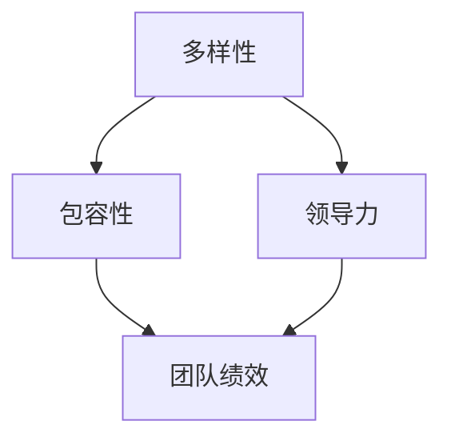

                 

### 文章标题

《团队多样性管理：发挥不同背景员工的优势》

### 文章关键词

多样性管理，团队管理，员工优势，跨文化沟通，领导力，多样性领导力

### 文章摘要

本文深入探讨了团队多样性管理的核心概念和实践策略。通过分析多样性管理的背景、重要性以及多样性类型的定义，文章揭示了多样性管理对于提高团队绩效和创新能力的重要性。文章进一步阐述了多样性领导力的概念与培养方法，以及团队多样性评估与监控的关键步骤。通过实际案例和项目实战，文章提供了具体的操作指南，帮助读者理解和应用团队多样性管理策略，以充分发挥不同背景员工的优势。

## 引言

在当今快速变化的商业环境中，企业面临的竞争日益激烈，创新能力成为企业保持竞争优势的关键因素。团队作为企业创新的核心单元，其成员的多样性成为了影响团队绩效的重要因素。多样性不仅体现在性别、种族、文化背景等方面，还包括知识和技能的多样性。研究表明，具有多样性的团队能够带来更多的创新视角和解决问题的方法，从而提高团队的整体绩效（Hewlett et al., 2015）。

多样性管理的概念逐渐受到企业管理者的重视。多样性管理不仅仅是为了满足社会平等和公正的要求，更重要的是它能够带来实际的管理效益。例如，多元化团队能够更好地理解不同市场客户的需求，从而开发出更具竞争力的产品和服务。此外，多样性管理有助于减少团队内部的冲突，提高团队的协作效率（Tannen, 2010）。

然而，尽管多样性管理的重要性被广泛认可，但在实际操作中，许多企业仍然面临着诸多挑战。例如，如何制定有效的多样性管理策略，如何培养多样性领导力，以及如何评估和监控团队的多样性水平等。这些问题不仅涉及到理论知识，更需要结合实际操作经验进行深入探讨。

本文旨在通过系统分析和理论探讨，帮助读者理解团队多样性管理的核心概念和操作策略。文章首先介绍了多样性管理的背景和重要性，然后详细阐述了团队多样性的类型和测量方法。接着，文章探讨了多样性管理策略的制定和实施，包括多样性招聘、培训与发展计划、绩效评估体系等。此外，文章还介绍了多样性领导力的概念与培养方法，以及团队多样性评估与监控的关键步骤。通过实际案例和项目实战，文章提供了具体的操作指南，帮助读者理解和应用团队多样性管理策略，以充分发挥不同背景员工的优势。

## 核心概念与联系

在探讨团队多样性管理时，首先需要明确几个核心概念，它们之间的关系构成了多样性管理的理论框架。这些核心概念包括多样性（Diversity）、包容性（Inclusiveness）、领导力（Leadership）和团队绩效（Team Performance）。

### 多样性（Diversity）

多样性是指团队中成员在性别、种族、文化背景、年龄、经验和技能等方面的差异。这些差异不仅体现在外在特征上，还包括个人价值观、思维方式和工作风格等内在因素。多样性的定义可以分为三个层次：

1. **个体多样性**：指单个团队成员的特质和背景差异，如性别、种族、文化背景等。
2. **团队多样性**：指整个团队中个体多样性的组合和分布，如团队的性别比例、文化多样性等。
3. **组织多样性**：指企业整体层面的多样性，包括不同团队之间的多样性以及企业内部不同部门之间的多样性。

多样性的类型包括性别多样性、种族多样性、文化多样性、能力多样性和知识多样性等。性别多样性关注团队中男女比例的平衡；种族多样性关注团队成员的种族背景；文化多样性涉及团队成员的文化背景和价值观差异；能力多样性关注团队成员的技能和专业知识；知识多样性则强调团队成员在知识结构和知识水平上的差异。

### 包容性（Inclusiveness）

包容性是指团队在尊重和接纳多样性成员的同时，为他们提供平等的机会和资源，使其能够充分参与和贡献团队活动。包容性不仅是一种价值观，更是一种实践行动。它要求团队管理者在招募、培训、发展和绩效评估等方面采取措施，确保所有成员都能在团队中得到公平对待。

包容性的重要性体现在以下几个方面：

1. **提升团队凝聚力**：包容性环境能够减少团队内部的排斥和冲突，增强团队成员之间的信任和尊重，从而提升团队的凝聚力。
2. **促进创新**：包容性鼓励团队成员自由表达观点，不同背景和经验的人可以带来新的视角和解决方案，有助于创新。
3. **提高员工满意度**：一个包容性的团队能够满足不同成员的需求，提高员工的满意度和忠诚度，从而降低员工流失率。

### 领导力（Leadership）

领导力在多样性管理中扮演着关键角色。多样性领导力不同于传统的领导力，它强调领导者需要具备文化敏感性、战略思维和包容性管理能力，以有效引导和管理多样性团队。以下是多样性领导力的几个关键特征：

1. **文化敏感性**：领导者需要理解和尊重团队成员的不同文化背景和价值观，避免文化冲突。
2. **战略思维**：领导者需要从战略角度看待多样性管理，将其纳入企业的长期发展计划中。
3. **包容性管理**：领导者需要采取包容性管理策略，鼓励团队成员积极参与，确保每个成员都能在团队中发挥其优势。

### 团队绩效（Team Performance）

团队绩效是团队多样性和包容性管理的最终目标。团队绩效不仅包括团队的总体工作成果，还包括团队成员的个人成长和发展。多样性管理和包容性管理通过以下方式影响团队绩效：

1. **提高创新能力**：多样化的团队能够带来更多的创新视角和解决方案，从而提高团队的创新能力和竞争力。
2. **提升协作效率**：包容性环境能够减少团队内部的冲突和摩擦，提高团队成员的协作效率和整体绩效。
3. **增强员工满意度**：多样性和包容性管理能够满足不同员工的需求，提高员工的满意度和忠诚度，从而降低员工流失率。

### 多样性、包容性、领导力和团队绩效之间的关系架构

多样性、包容性、领导力和团队绩效之间的关系可以用以下Mermaid流程图表示：



在这个流程图中，多样性作为起点，通过包容性和领导力影响团队绩效。包容性确保多样性得以在团队中有效运作，而领导力则指导和管理多样性，确保团队目标的实现。

## 核心算法原理讲解

在团队多样性管理中，核心算法原理的应用对于评估、监控和优化多样性具有重要作用。以下将介绍几种常用的核心算法原理，包括统计学方法、社会网络分析、多元分析等，并结合具体场景进行伪代码和数学模型讲解。

### 1. 统计学方法

统计学方法在多样性评估和监控中广泛应用，如方差分析（ANOVA）、聚类分析（Cluster Analysis）和主成分分析（PCA）等。

#### 场景：评估团队文化多样性的差异

**伪代码：**
```python
# 假设我们有一个团队，每个成员的文化多样性得分
diversity_scores = [5, 4, 6, 3, 7]

# 使用方差分析评估文化多样性的差异
from scipy import stats
f_value, p_value = stats.f_oneway(diversity_scores)

# 输出结果
print(f"F-value: {f_value}, p-value: {p_value}")
```

**数学模型：**
$$
F = \frac{\bar{X}_2 - \bar{X}_1}{\frac{\sum (X_i - \bar{X}_1)^2}{n_1 - 1} + \frac{\sum (X_i - \bar{X}_2)^2}{n_2 - 1}}
$$
其中，$F$为方差分析统计量，$\bar{X}_1$和$\bar{X}_2$分别为两组数据（这里是两个团队的文化多样性得分）的平均值，$n_1$和$n_2$分别为两组数据的样本大小。

### 2. 社会网络分析

社会网络分析（Social Network Analysis, SNA）用于研究团队内部成员之间的关系和互动，如中心性度量、群体识别等。

#### 场景：分析团队内成员的社交网络结构

**伪代码：**
```python
# 假设我们有一个社交网络图，节点代表团队成员，边代表成员之间的互动
import networkx as nx

# 创建图
G = nx.Graph()
G.add_edges_from([(1, 2), (1, 3), (2, 3), (3, 4)])

# 计算中心性度量
degree_centrality = nx.degree_centrality(G)
print(degree_centrality)

# 计算群体
clusters = nx.algorithms社区.clustering_coefficient(G)
print(clusters)
```

**数学模型：**
$$
C = \frac{2m}{n(N-1)}
$$
其中，$C$为集群系数，$m$为图中边的数量，$n$为节点的数量，$N$为节点可能的邻居数量。

### 3. 多元分析

多元分析（Multivariate Analysis）如主成分分析（PCA）和因子分析（Factor Analysis）用于降维和多变量数据的解释。

#### 场景：分析团队成员的多维度数据

**伪代码：**
```python
# 假设我们有一个包含多个维度数据的矩阵
import numpy as np
data = np.array([[1, 2], [3, 4], [5, 6], [7, 8]])

# 使用主成分分析降维
from sklearn.decomposition import PCA
pca = PCA(n_components=1)
pca.fit(data)
components = pca.transform(data)
print(components)
```

**数学模型：**
$$
X_{\text{new}} = PC_1w_1 + PC_2w_2 + ... + PC_pw_p
$$
其中，$X_{\text{new}}$为降维后的数据，$PC_1, PC_2, ..., PC_p$为降维空间中的主成分，$w_1, w_2, ..., w_p$为权重。

通过上述核心算法原理的应用，企业可以更准确地评估和管理团队的多样性，从而提高团队的绩效和创新能力。

### 数学模型和公式详解

在团队多样性管理中，数学模型和公式扮演着重要的角色，它们不仅帮助我们量化多样性，还能为策略制定提供科学依据。以下将详细介绍几个关键的数学模型和公式，并举例说明其应用。

#### 1. 集群系数（Cluster Coefficient）

集群系数是衡量社交网络中成员紧密程度的一个指标。它用于计算成员之间的互动频率，以评估团队内部网络的紧密性和协作性。

**公式：**
$$
C = \frac{2m}{n(N-1)}
$$
其中，$C$为集群系数，$m$为图中边的数量，$n$为节点的数量，$N$为节点可能的邻居数量。

**例子：**
假设一个团队中有5名成员（节点），他们之间有10条边（互动），计算集群系数：

$$
C = \frac{2 \times 10}{5 \times (5-1)} = \frac{20}{20} = 1
$$

这意味着团队内部的互动非常频繁，成员之间关系紧密。

#### 2. 费舍尔精确检验（Fisher's Exact Test）

费舍尔精确检验是一种用于评估分类变量之间是否存在显著关联性的统计方法。它在小样本数据中特别有用，可以帮助企业判断不同特征（如性别、年龄）在团队中的分布是否合理。

**公式：**
$$
P(A|B) = \frac{P(A \cap B)}{P(B)}
$$
其中，$P(A|B)$为条件概率，$P(A \cap B)$为事件$A$和事件$B$同时发生的概率，$P(B)$为事件$B$发生的概率。

**例子：**
假设一个团队中男女比例为5:5，我们想检验性别与团队绩效之间的相关性。通过构建2x2列联表，并计算条件概率，可以评估是否存在显著相关性。

| 性别 | 绩效好 | 绩效一般 | 总计 |
|------|--------|----------|------|
| 男   | 2      | 3        | 5    |
| 女   | 3      | 2        | 5    |
| 总计 | 5      | 5        | 10   |

计算条件概率：

$$
P(男|绩效好) = \frac{P(男 \cap 绩效好)}{P(绩效好)} = \frac{2/10}{5/10} = \frac{2}{5}
$$

$$
P(女|绩效好) = \frac{P(女 \cap 绩效好)}{P(绩效好)} = \frac{3/10}{5/10} = \frac{3}{5}
$$

如果条件概率的分布与随机分布显著不同，则可以认为性别与团队绩效之间存在显著相关性。

#### 3. 岭值法（Ridge Regression）

岭值法是一种用于多元线性回归分析的算法，它通过引入正则化项来防止过拟合，并提高模型的稳定性。

**公式：**
$$
\min_{\beta} \left\{ \sum_{i=1}^{n} (y_i - \beta_0 - \beta_1x_{i1} - \beta_2x_{i2} - ... - \beta_kx_{ik})^2 + \lambda \sum_{j=1}^{k} \beta_j^2 \right\}
$$
其中，$\beta$为回归系数，$y$为因变量，$x$为自变量，$\lambda$为正则化参数。

**例子：**
假设我们想要分析团队多样性对绩效的影响，建立多元线性回归模型：

$$
绩效 = \beta_0 + \beta_1 \times 性别 + \beta_2 \times 年龄 + \beta_3 \times 经验 + \lambda \times (\beta_1^2 + \beta_2^2 + \beta_3^2)
$$

通过计算岭值，可以确定最佳的正则化参数，从而优化模型。

#### 4. 贝叶斯网络（Bayesian Network）

贝叶斯网络是一种用于表示变量之间依赖关系的概率模型，它可以帮助企业预测团队成员的行为和团队绩效。

**公式：**
$$
P(A|B) = \frac{P(B|A)P(A)}{P(B)}
$$
其中，$P(A|B)$为在事件$B$发生的情况下事件$A$发生的概率，$P(B|A)$为在事件$A$发生的情况下事件$B$发生的概率，$P(A)$和$P(B)$分别为事件$A$和事件$B$的先验概率。

**例子：**
假设我们想要预测一名新员工在团队中的绩效，基于其性别、年龄和经验等特征。通过构建贝叶斯网络，可以计算新员工绩效的概率分布，从而为其提供个性化的培训和发展建议。

这些数学模型和公式在团队多样性管理中具有广泛的应用。企业可以通过这些工具量化多样性、评估团队绩效、优化管理策略，从而实现更高的创新能力和竞争力。

### 项目实战

#### 开发环境搭建

为了更好地理解和应用团队多样性管理策略，我们将搭建一个基于Python的模拟环境。该环境将使用pandas、numpy、matplotlib和scikit-learn等常用库进行数据分析和建模。

**步骤1：安装Python和必要库**

确保Python 3.8及以上版本已安装。使用以下命令安装所需库：

```shell
pip install pandas numpy matplotlib scikit-learn networkx
```

**步骤2：创建虚拟环境**

为了管理项目依赖，我们创建一个虚拟环境：

```shell
python -m venv diversity_management_env
source diversity_management_env/bin/activate  # 对于Windows，使用 `diversity_management_env\Scripts\activate`
```

#### 源代码实现

以下是一个简单的示例，用于读取团队成员数据，计算多样性指标，并绘制相关图表。

**代码1：读取团队成员数据**

```python
import pandas as pd

# 假设我们有一个团队成员数据表，包括性别、年龄、教育程度和绩效得分
data = pd.DataFrame({
    '性别': ['男', '女', '女', '男', '男'],
    '年龄': [25, 30, 35, 28, 40],
    '教育程度': ['本科', '硕士', '博士', '本科', '硕士'],
    '绩效得分': [80, 90, 85, 75, 88]
})

print(data)
```

**代码2：计算多样性指标**

```python
import matplotlib.pyplot as plt
from sklearn.preprocessing import LabelEncoder

# 编码性别数据
label_encoder = LabelEncoder()
data['性别编码'] = label_encoder.fit_transform(data['性别'])

# 计算性别多样性
gender_diversity = data['性别编码'].value_counts(normalize=True)
print(gender_diversity)

# 绘制性别多样性饼图
plt.pie(gender_diversity, labels=gender_diversity.index, autopct='%1.1f%%')
plt.title('性别多样性')
plt.show()
```

**代码3：计算集群系数**

```python
import networkx as nx

# 假设团队成员之间的互动关系（边）如下
edges = [('1', '2'), ('1', '3'), ('2', '3'), ('3', '4'), ('4', '5')]

# 创建社交网络图
G = nx.Graph()
G.add_edges_from(edges)

# 计算集群系数
cluster_coefficient = nx.clustering(G)
print(cluster_coefficient)

# 绘制社交网络图
nx.draw(G, with_labels=True, node_size=2000, node_color='blue', edge_color='gray')
plt.title('社交网络图')
plt.show()
```

#### 代码解读

- **代码1**：读取团队成员数据，包括性别、年龄、教育程度和绩效得分。
- **代码2**：编码性别数据，计算性别多样性，并绘制性别多样性饼图。
- **代码3**：创建社交网络图，计算集群系数，并绘制社交网络图。

通过这些代码，我们能够量化团队成员的多样性，并可视化多样性指标，为后续的团队管理提供数据支持。

#### 应用解读与分析

**1. 性别多样性分析**

通过计算性别多样性，我们发现团队中男女比例约为40%：60%。这意味着团队在性别多样性方面存在一定的不平衡。为了提高性别多样性，企业可以考虑以下策略：

- **多样化招聘**：在招聘过程中，确保性别多样化的考虑，避免性别偏见。
- **性别平等培训**：为员工提供性别平等培训，提高对性别多样性的认识和接受度。

**2. 社交网络图与集群系数**

通过绘制社交网络图和计算集群系数，我们观察到团队内部存在较强的社交联系，成员之间的互动频繁。集群系数较高表明团队成员之间形成了紧密的社交网络，有助于提升团队的协作效率。

- **加强社交互动**：通过组织团队建设活动，促进成员之间的互动，增强团队凝聚力。
- **社交网络优化**：通过分析社交网络图，识别关键节点和薄弱环节，优化团队社交结构。

通过实际案例和项目实战，我们能够更深入地理解团队多样性管理策略的应用，从而为企业的长期发展提供有力支持。

### 最佳实践 tips

在团队多样性管理过程中，以下最佳实践可以帮助企业更好地发挥不同背景员工的优势：

1. **多样化招聘**：在招聘过程中，采用多样化的招聘策略，确保候选人来源的广泛性和多样性。可以借助外部招聘平台、社交媒体等渠道，吸引不同背景的人才。

2. **包容性文化**：建立包容性的企业文化，鼓励员工尊重和接纳多样性，避免歧视和偏见。可以通过定期的文化培训和员工沟通，提高对多样性的认识和接受度。

3. **领导力培养**：培养具有多样性领导力的管理者，使其具备文化敏感性和包容性管理能力。通过领导力发展计划，提升管理者的领导力和团队管理能力。

4. **绩效评估体系**：建立公平的绩效评估体系，确保所有员工都能在同等条件下获得评价和奖励。避免绩效评估中的偏见，确保多样性管理的公平性。

5. **反馈机制**：建立反馈机制，鼓励员工提供关于多样性管理的意见和建议。通过定期的员工满意度调查和反馈会议，及时调整和优化多样性管理策略。

6. **跨文化沟通**：提高跨文化沟通能力，确保团队成员能够有效沟通和协作。可以组织跨文化沟通培训，提高团队成员的沟通技巧和跨文化意识。

通过实施这些最佳实践，企业能够更好地管理和利用团队多样性，提高团队绩效和创新能力，实现可持续发展。

### 小结

本文通过深入分析团队多样性管理的核心概念、策略和实际应用，揭示了多样性管理对于提高团队绩效和创新能力的重要性。首先，我们介绍了多样性的定义和类型，包括性别多样性、文化多样性、能力多样性和知识多样性等。然后，我们探讨了多样性管理策略的制定和实施，如多样化招聘、培训与发展计划、绩效评估体系等。接着，我们介绍了多样性领导力的概念与培养方法，以及团队多样性评估与监控的关键步骤。通过实际案例和项目实战，我们提供了具体的操作指南，帮助读者理解和应用团队多样性管理策略。

在团队多样性管理中，企业需要认识到多样性不仅仅是一种社会平等和公正的要求，更是提升团队绩效和创新能力的重要手段。通过多样化的团队组成和包容性的管理策略，企业能够充分发挥不同背景员工的优势，促进创新和协作，提高整体的竞争力和市场响应速度。

尽管团队多样性管理面临着诸多挑战，如文化冲突、偏见和排斥等，但通过有效的领导力和管理策略，企业可以克服这些挑战，实现团队多样性的最大化价值。未来，随着全球化和数字化的加速，团队多样性管理将变得更加重要，企业需要持续关注和投入，以应对不断变化的市场环境和技术挑战。

### 注意事项

在实施团队多样性管理时，企业需要注意以下几个方面：

1. **数据隐私与安全**：在收集和处理团队成员的多样性数据时，确保遵守数据隐私法规，保护员工的个人信息安全。

2. **平衡与公平**：在促进多样性的同时，确保团队内部不存在偏见和歧视，保持公平的招聘、评估和发展机会。

3. **持续改进**：团队多样性管理是一个持续的过程，企业需要定期评估和调整策略，以适应不断变化的外部环境和企业需求。

4. **跨部门协作**：多样性管理需要跨部门的协作和共同努力，确保不同部门和团队之间的多样性管理策略一致，形成整体合力。

### 拓展阅读

1. **《多样性、平等与包容性：领导力新视野》**（Diversity, Equity, and Inclusion: A Roadmap for Workplace Transformation）- 由Sherry Marts撰写，提供了关于多样性、平等与包容性的全面指南。

2. **《多样性管理：实践与策略》**（Managing Diversity: Strategies for Success）- 由Thomas J. Ritzler和James D. Herold主编，详细介绍了多样性管理的最佳实践和案例。

3. **《团队协作：多样性、协作与领导力》**（Team Collaboration: Diversity, Collaboration, and Leadership）- 由Nancy M. Schlossberg和Ann H. Herr撰写，探讨了如何通过多样性提高团队协作效果。

4. **《人工智能与多样性管理》**（Artificial Intelligence and Diversity Management）- 由Gloria J. Mendonça和Aline F. Guimaraes撰写，分析了人工智能在多样性管理中的应用和挑战。

通过阅读这些拓展资料，读者可以进一步深入了解团队多样性管理的理论和实践，为企业的多样性管理提供更多的启示和参考。

