                 

## 引言

### 背景介绍

在当今快速发展的信息技术时代，团队多样性已经成为一个备受关注的话题。越来越多的研究表明，一个多元化的团队可以在创新、决策和问题解决方面表现出更高的效率。然而，多样性本身并不是目的，而是为了实现更高效的团队协作和卓越的绩效。这就需要领导者具备包容性领导的素质，以确保团队成员的潜力得到充分发挥。

### 文章目的

本文旨在探讨团队多样性及其与包容性领导之间的关系。我们将从团队多样性的概念入手，逐步深入分析多样性与包容性领导的理论和实践。文章将分为四个主要部分：

1. **团队多样性概述**：介绍团队多样性的概念、构成和优势。
2. **包容性领导理论**：阐述包容性领导的定义、原则和挑战。
3. **实践包容性领导**：通过实际案例展示如何创建包容性团队文化。
4. **总结与展望**：总结包容性领导的重要性，并探讨其未来发展趋势。

通过逐步分析推理，我们希望能够帮助读者更深入地理解团队多样性和包容性领导，并在实际工作中应用这些理念。

## 文章标题

### 团队多样性：包容性领导的重要性

## 关键词

- 团队多样性
- 包容性领导
- 多样性、平等与包容性
- 团队绩效
- 领导力
- 创新与问题解决

## 摘要

本文旨在探讨团队多样性及其与包容性领导之间的关系。首先，我们介绍了团队多样性的概念和构成，并分析了其优势。接着，我们阐述了包容性领导的定义、原则和行为，以及团队多样性带来的挑战和应对策略。最后，通过实际案例展示了如何创建包容性团队文化，并总结了包容性领导的重要性及其未来发展趋势。本文旨在为读者提供一个全面、系统的理解，以帮助他们在实际工作中更好地应用这些理念。

## 第一部分：团队多样性概述

### 第1章：团队多样性的概念与重要性

#### 1.1 团队多样性的定义

团队多样性指的是团队内部成员在人口统计特征、知识技能、态度和价值观等方面的差异。人口统计多样性包括性别、年龄、种族、文化背景、教育水平等；知识、技能与经验多样性涉及专业技能、工作年限、项目经验等；态度与价值观多样性则包括个人信仰、工作态度、解决问题的方法等。

**Mermaid流程图示例：**

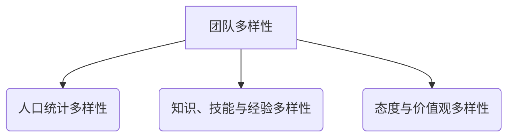

#### 1.2 团队多样性的构成

团队多样性的构成可以从以下几个方面来理解：

1. **人口统计多样性**：包括性别、年龄、种族、文化背景等。这种多样性可以为团队带来不同的视角和经验，从而促进创新和问题解决。

2. **知识、技能与经验多样性**：团队成员在专业技能、工作年限、项目经验等方面的差异，有助于团队在面对复杂问题时，运用不同的方法和技能进行解决。

3. **态度与价值观多样性**：团队成员在个人信仰、工作态度、解决问题的方法等方面的差异，有助于团队在面对不同情境时，采取灵活的策略和决策。

**Mermaid流程图示例：**

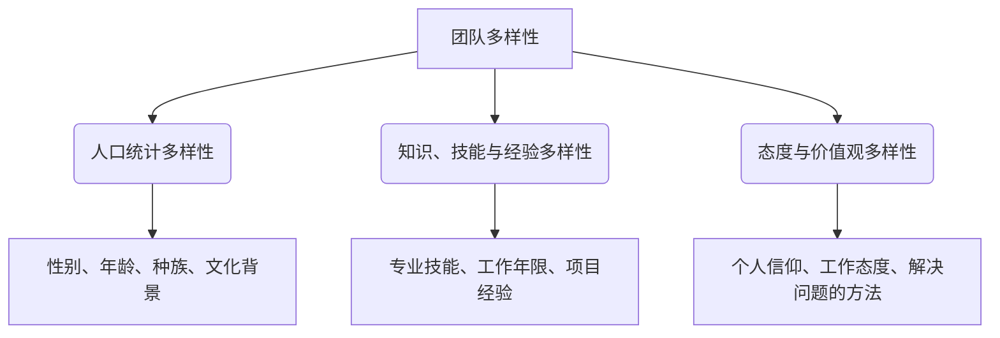

#### 1.3 团队多样性的优势

团队多样性的优势主要体现在以下几个方面：

1. **创新性**：多元化的团队可以带来不同的视角和思路，有助于激发创新思维，提高团队的创新能力和竞争力。

2. **决策质量**：多样性丰富的团队在面对复杂问题时，可以综合考虑不同的因素和观点，从而做出更加全面和明智的决策。

3. **问题解决**：团队成员在知识、技能和经验上的差异，可以帮助团队在面对挑战时，运用不同的方法和策略进行解决问题。

4. **员工满意度**：一个包容、平等的团队环境可以提高员工的满意度和归属感，从而增强团队的凝聚力和工作效率。

**Mermaid流程图示例：**

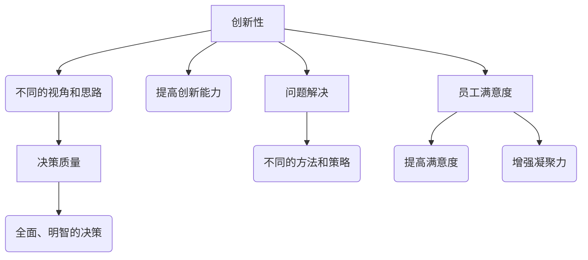

### 小结

团队多样性是现代团队管理中的重要概念，其涵盖了人口统计、知识技能、态度和价值观等多个方面。通过了解团队多样性的定义和构成，我们可以更好地认识到其优势，并在实际工作中充分利用这些优势，提高团队的绩效和员工满意度。

---

以上是第1章的内容，主要介绍了团队多样性的概念、构成和优势。在接下来的章节中，我们将进一步探讨多样性、平等与包容性之间的关系，以及包容性领导的理论和实践。敬请期待！

---

### 第2章：多样性、平等与包容性的关系

#### 2.1 多样性与平等

多样性和平等是团队管理中两个密不可分的概念。多样性指的是团队内部成员在人口统计特征、知识技能、态度和价值观等方面的差异。而平等则强调团队成员在团队中的地位和机会均等，无论其背景和特点如何。

**核心概念原理：**

- **多样性**：团队内部成员的差异，包括性别、年龄、种族、文化背景、教育水平等。
- **平等**：团队成员在团队中的地位和机会均等，无论其背景和特点如何。

**Mermaid流程图示例：**

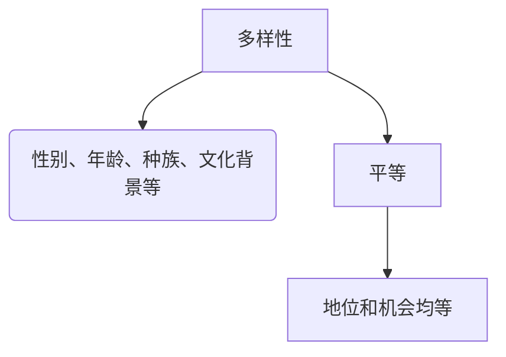

#### 2.2 包容性与多样性

包容性是多样性的延伸，它强调在团队中尊重、接纳和重视成员的不同特点。一个包容性的团队能够在多样性基础上，消除歧视和偏见，确保每个成员都能充分发挥其潜力。

**核心概念原理：**

- **包容性**：尊重、接纳和重视成员的不同特点。
- **多样性**：团队内部成员的差异。

**Mermaid流程图示例：**

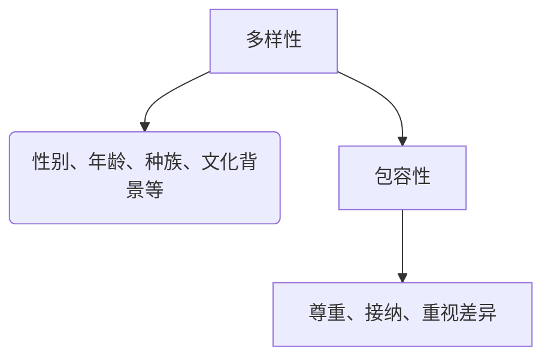

#### 2.3 多样性、平等与包容性的协同作用

多样性、平等与包容性相互关联，共同构成了团队管理中一个重要的框架。它们之间的协同作用可以带来以下益处：

1. **增强团队凝聚力**：多样性为团队带来了不同的视角和思路，平等和包容性则确保了这些视角和思路得到尊重和重视，从而增强了团队的凝聚力。
2. **提高创新能力**：多样性丰富的团队在面对问题时，可以从不同的角度思考，平等和包容性则鼓励团队成员勇于表达和分享自己的想法，从而激发了创新思维。
3. **优化决策质量**：多样性、平等和包容性共同作用，可以使团队在面对复杂问题时，做出更加全面、明智的决策。
4. **提升员工满意度**：一个包容、平等和多样化的团队环境可以提高员工的满意度和归属感，从而增强团队的工作效率和绩效。

**Mermaid流程图示例：**

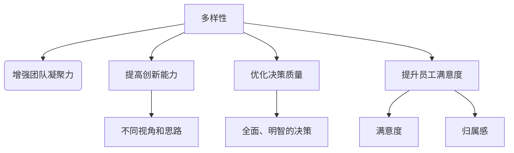

### 小结

多样性与平等、包容性之间存在着紧密的联系。多样性为团队带来了不同的视角和思路，平等和包容性则确保了这些视角和思路得到尊重和重视。通过协同作用，多样性、平等与包容性可以增强团队凝聚力，提高创新能力和决策质量，从而提升员工满意度。在接下来的章节中，我们将进一步探讨包容性领导的定义、原则和实践，以帮助读者更好地理解和应用这些理念。

---

以上是第2章的内容，主要分析了多样性、平等与包容性之间的关系及其协同作用。在接下来的章节中，我们将深入探讨包容性领导的理论和实践。敬请期待！

---

### 第3章：包容性领导的定义与原则

#### 3.1 包容性领导的定义

包容性领导是一种领导风格，强调领导者通过尊重、接纳和重视团队成员的不同特点，创建一个多元、平等、包容的工作环境。这种领导风格不仅关注团队成员的专业能力和绩效，还重视他们的个人成长和价值观。

**核心概念原理：**

- **包容性领导**：领导者通过尊重、接纳和重视团队成员的不同特点，创建一个多元、平等、包容的工作环境。
- **多元、平等、包容的工作环境**：确保每个团队成员都能充分发挥其潜力，实现个人和团队的目标。

**Mermaid流程图示例：**

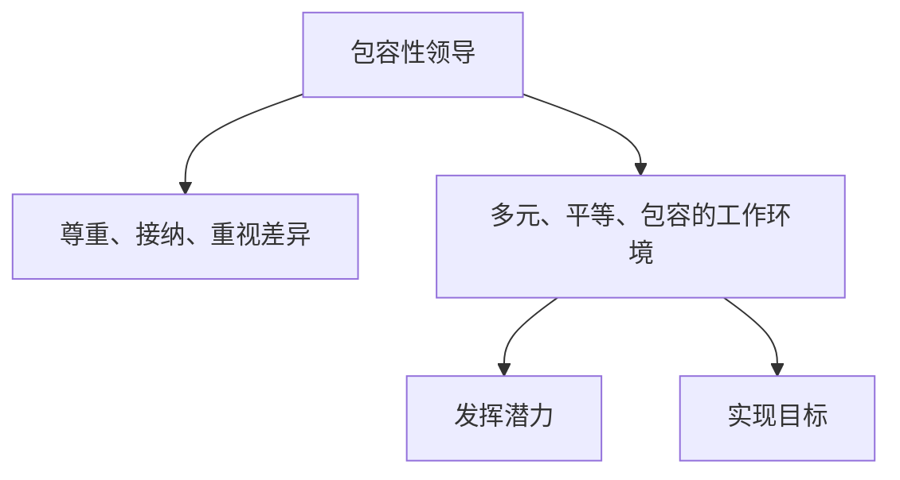

#### 3.2 包容性领导的原则

包容性领导遵循一系列核心原则，这些原则有助于领导者在实际工作中有效运用包容性领导风格。以下是一些关键原则：

1. **尊重差异**：领导者应尊重团队成员的不同背景、经验和观点，避免歧视和偏见。
2. **促进沟通**：领导者应鼓励团队成员之间的开放和坦诚沟通，以促进理解和合作。
3. **公平对待**：领导者应确保团队中的每个成员都得到公平的机会和资源，避免不公平待遇。
4. **激励多样性**：领导者应鼓励团队成员分享自己的见解和想法，促进多样性的发展和创新。
5. **支持成长**：领导者应关注团队成员的个人成长，提供必要的支持和资源，帮助他们实现职业发展目标。

**Mermaid流程图示例：**

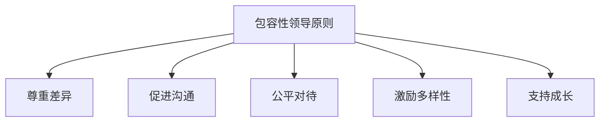

#### 3.3 包容性领导的行为

包容性领导不仅是一种理念，更体现在具体的行为中。以下是一些包容性领导的行为：

1. **倾听与理解**：领导者应主动倾听团队成员的意见和需求，理解他们的背景和经历，从而更好地支持他们的工作。
2. **鼓励多样性**：领导者应鼓励团队成员分享不同的观点和想法，促进团队内部的多样性和创新。
3. **提供反馈**：领导者应给予团队成员及时的反馈，关注他们的成长和进步，帮助他们不断提升。
4. **营造包容氛围**：领导者应在团队中营造一个包容、平等和尊重的氛围，鼓励团队成员积极参与团队活动。
5. **解决冲突**：领导者应主动解决团队内部的冲突，维护团队的和谐与稳定。

**Mermaid流程图示例：**

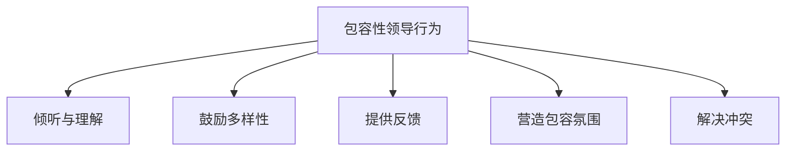

### 小结

包容性领导是一种以尊重、接纳和重视团队成员差异为核心的领导风格。其核心原则包括尊重差异、促进沟通、公平对待、激励多样性和支持成长。在实际工作中，包容性领导体现在倾听与理解、鼓励多样性、提供反馈、营造包容氛围和解决冲突等具体行为中。通过实践包容性领导，领导者可以创建一个多元、平等、包容的工作环境，从而提高团队的绩效和员工满意度。

---

以上是第3章的内容，主要介绍了包容性领导的定义、原则和行为。在接下来的章节中，我们将探讨包容性领导面临的挑战和应对策略。敬请期待！

---

### 第4章：包容性领导的挑战与应对策略

#### 4.1 团队多样性带来的挑战

尽管团队多样性具有许多优势，但同时也给包容性领导带来了一系列挑战。以下是团队多样性可能带来的几个主要挑战：

1. **沟通障碍**：团队成员之间的差异可能导致沟通困难，使得信息传递变得复杂和缓慢。
2. **文化冲突**：不同文化背景的团队成员可能会在价值观、工作习惯等方面产生冲突。
3. **资源分配不均**：团队中不同成员的能力和需求差异可能导致资源分配不均，影响团队的整体绩效。
4. **决策复杂度增加**：多样性丰富的团队在决策时需要考虑更多的因素和观点，可能导致决策过程变得更加复杂和耗时。

**Mermaid流程图示例：**

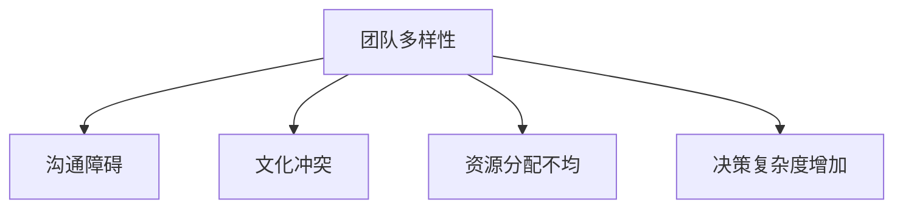

#### 4.2 提高包容性领导能力的策略

为了应对团队多样性带来的挑战，领导者需要提高自身的包容性领导能力。以下是一些具体的策略：

1. **加强沟通与协作**：领导者应通过定期的团队会议、工作坊和沟通渠道，促进团队成员之间的交流和协作，减少沟通障碍。
2. **促进文化融合**：领导者应鼓励团队成员分享自己的文化背景和价值观，增进相互理解和尊重，从而减少文化冲突。
3. **优化资源分配**：领导者应通过公平、透明的机制，确保团队成员能够获得适当的资源和支持，从而提高团队的整体绩效。
4. **提升决策能力**：领导者应培养团队在面对多样性时做出有效决策的能力，例如通过多元化团队、集体讨论等方式，提高决策的全面性和效率。

**Mermaid流程图示例：**

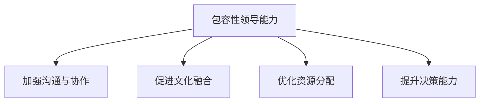

#### 4.3 包容性领导在不同文化背景下的应用

包容性领导在不同的文化背景下可能会有所不同，但核心原则是相通的。以下是一些在不同文化背景下应用包容性领导的具体建议：

1. **文化敏感性**：领导者应了解并尊重不同文化背景下的价值观和习俗，避免文化冲突。
2. **多元文化培训**：领导者应参加相关的文化培训，提高跨文化沟通和领导能力。
3. **本地化管理**：在跨国团队中，领导者应根据当地的文化和业务环境，调整领导策略和方法。
4. **鼓励多元文化团队**：领导者应鼓励团队成员分享多元文化的经验和见解，促进团队内部的多样性。

**Mermaid流程图示例：**

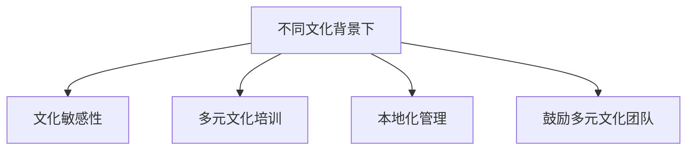

### 小结

团队多样性虽然为团队带来了许多优势，但也给包容性领导带来了挑战。为了应对这些挑战，领导者需要提高自身的包容性领导能力，并采取具体的策略和措施。在不同文化背景下，领导者还需要具备文化敏感性，并调整领导策略和方法。通过实践包容性领导，领导者可以创建一个多元、平等、包容的工作环境，从而提高团队的绩效和员工满意度。

---

以上是第4章的内容，主要探讨了包容性领导面临的挑战和应对策略。在接下来的章节中，我们将通过实际案例展示如何创建包容性团队文化。敬请期待！

---

### 第5章：创建包容性团队文化

#### 5.1 团队文化对多样性的影响

团队文化是团队内部成员共同价值观和行为规范的体现，它对多样性的影响至关重要。一个包容性强的团队文化可以促进多样性的发展，提高团队的整体绩效。以下是团队文化对多样性的影响：

1. **促进团队成员的沟通和协作**：一个包容性强的团队文化可以鼓励团队成员分享不同的观点和经验，促进团队内部的沟通和协作，减少沟通障碍。
2. **增强团队成员的归属感**：一个包容性强的团队文化可以让团队成员感受到被尊重和接纳，从而增强他们的归属感，提高团队的凝聚力。
3. **提高团队的创新能力和问题解决能力**：一个包容性强的团队文化可以激发团队成员的创新思维，促进团队在面对复杂问题时，采用不同的方法和策略进行解决。
4. **降低文化冲突**：一个包容性强的团队文化可以减少因文化差异导致的文化冲突，促进团队成员之间的相互理解和尊重。

**Mermaid流程图示例：**

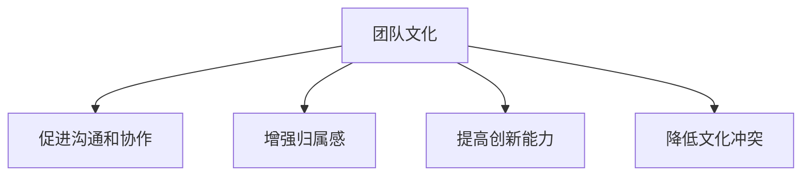

#### 5.2 建立包容性团队文化的策略

为了创建一个包容性团队文化，领导者需要采取一系列具体的策略和措施。以下是一些建立包容性团队文化的关键策略：

1. **树立包容性价值观**：领导者应明确表达团队对多样性和包容性的重视，并将其纳入团队的价值观和行为准则中。
2. **提供多元化培训**：领导者应定期为团队成员提供多元化的培训，提高他们的文化敏感性和包容性领导能力。
3. **鼓励开放和坦诚的沟通**：领导者应鼓励团队成员在团队内部进行开放和坦诚的沟通，分享不同的观点和经验。
4. **建立公平的评估机制**：领导者应建立公平、透明的评估机制，确保团队成员的绩效和贡献得到公正的评价。
5. **激励多元文化团队**：领导者应鼓励团队成员分享多元文化的经验和见解，促进团队内部的多样性。

**Mermaid流程图示例：**

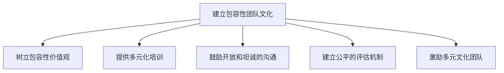

#### 5.3 包容性团队文化的评估与改进

创建包容性团队文化是一个持续的过程，领导者需要定期评估团队文化的现状，并根据评估结果进行改进。以下是一些评估和改进包容性团队文化的策略：

1. **定期进行员工满意度调查**：领导者应定期进行员工满意度调查，了解团队成员对团队文化的感受和意见。
2. **开展团队反思会议**：领导者应定期组织团队反思会议，让团队成员共同讨论团队文化的现状和改进方向。
3. **引入外部专家咨询**：领导者可以引入外部专家进行团队文化的评估和咨询，获取专业意见和建议。
4. **制定改进计划**：根据评估结果和改进建议，领导者应制定具体的改进计划，并确保计划得到有效实施。

**Mermaid流程图示例：**

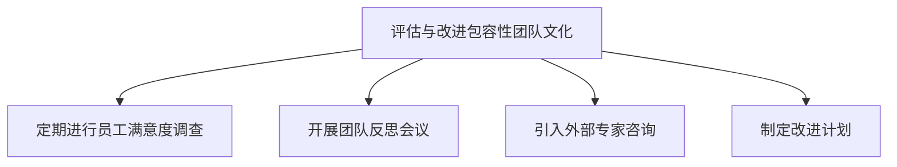

### 小结

创建包容性团队文化是提高团队多样性和绩效的重要举措。领导者需要树立包容性价值观，提供多元化培训，鼓励开放和坦诚的沟通，建立公平的评估机制，并激励多元文化团队。通过定期评估和改进，领导者可以持续提升团队文化的包容性，从而打造一个多元、平等、包容的工作环境。

---

以上是第5章的内容，主要介绍了创建包容性团队文化的策略和评估与改进方法。在接下来的章节中，我们将通过实际案例展示如何实践包容性领导。敬请期待！

---

### 第6章：包容性领导实践案例

#### 6.1 案例一：科技公司提高女性员工参与度

**背景介绍**

某科技公司一直致力于提高女性员工的参与度和代表性。尽管公司在性别多样性方面取得了一定的进展，但女性员工在管理层和决策层中的比例仍然较低。为了解决这一问题，公司决定采用包容性领导方法，提高女性员工的参与度和职业发展机会。

**具体措施**

1. **建立女性领导力发展计划**：公司为女性员工提供了领导力培训和发展机会，帮助她们提升领导能力和职业素养。
2. **设立女性员工支持网络**：公司建立了女性员工支持网络，为她们提供交流、分享经验和获取职业建议的平台。
3. **调整工作安排和激励机制**：公司为女性员工提供灵活的工作安排，并调整了激励机制，以鼓励女性员工参与项目决策和管理工作。
4. **提供职业发展指导**：公司为女性员工提供一对一的职业发展指导，帮助她们制定职业规划和实现职业目标。

**效果评估**

通过一系列的措施，公司女性员工的参与度和满意度显著提高。女性员工在项目决策和管理中的比例逐步增加，公司整体绩效也得到了提升。此外，公司还获得了“性别平等杰出企业”等荣誉称号，进一步提升了品牌形象。

**经验总结**

1. **关注女性员工的职业发展**：公司通过提供领导力培训、支持网络和职业发展指导，帮助女性员工提升职业能力，实现职业发展。
2. **建立公平的工作环境**：通过调整工作安排和激励机制，为女性员工提供平等的职业发展机会，促进性别平等。
3. **培养包容性文化**：公司通过建立女性员工支持网络和开展相关活动，营造了一个包容、平等的工作氛围，增强了女性员工的归属感和参与度。

#### 6.2 案例二：非盈利组织推动多元文化

**背景介绍**

某非盈利组织致力于帮助弱势群体，其团队成员来自不同的文化背景。为了更好地服务社区，组织决定采用包容性领导方法，推动多元文化的融合和发展。

**具体措施**

1. **开展文化融合培训**：组织为团队成员提供了文化融合培训，帮助他们了解不同文化背景下的价值观和行为规范。
2. **建立多元文化团队**：组织通过建立多元文化团队，鼓励团队成员分享各自的文化经验和见解，促进团队内部的多元文化融合。
3. **开展文化交流活动**：组织定期组织文化交流活动，如文化节日庆祝、文化交流讲座等，增进团队成员之间的相互了解和尊重。
4. **制定包容性政策**：组织制定了包容性政策，确保团队成员在组织内部得到公平对待，不受歧视和偏见。

**效果评估**

通过一系列的措施，组织的多元文化融合程度显著提高，团队成员之间的沟通和协作更加顺畅。组织的服务质量也得到了提升，得到了社区居民的广泛认可和好评。

**经验总结**

1. **重视文化融合**：组织通过开展文化融合培训和交流活动，帮助团队成员了解和尊重不同文化背景，促进多元文化的融合。
2. **建立包容性文化**：组织通过制定包容性政策，确保团队成员在组织内部得到公平对待，营造了一个多元、平等、包容的工作环境。
3. **培养跨文化领导能力**：组织通过建立多元文化团队，鼓励团队成员分享各自的文化经验和见解，提升了跨文化领导能力。

#### 6.3 案例三：跨国企业如何进行全球包容性领导

**背景介绍**

某跨国企业拥有多个国家和地区的分支机构，团队成员来自不同的文化背景。为了实现全球范围内的协同发展，企业决定采用包容性领导方法，推动全球包容性领导。

**具体措施**

1. **建立全球领导力发展计划**：企业为全球团队成员提供了领导力培训和发展机会，帮助她们提升领导能力和跨文化沟通能力。
2. **设立全球多元文化团队**：企业通过建立全球多元文化团队，鼓励团队成员分享各自的文化经验和见解，促进全球团队之间的沟通和协作。
3. **开展跨文化领导力研讨会**：企业定期举办跨文化领导力研讨会，邀请全球团队成员参加，共同探讨跨文化领导策略和实践。
4. **制定全球包容性政策**：企业制定了全球包容性政策，确保团队成员在全球范围内得到公平对待，不受歧视和偏见。

**效果评估**

通过一系列的措施，企业的全球团队协作水平显著提高，企业整体绩效也得到了提升。企业还获得了“全球多元化与包容性最佳实践”等荣誉称号，进一步提升了品牌形象。

**经验总结**

1. **重视跨文化领导能力**：企业通过建立全球领导力发展计划和多元文化团队，帮助团队成员提升跨文化领导能力，促进全球团队之间的协作。
2. **建立全球包容性文化**：企业通过制定全球包容性政策，确保团队成员在全球范围内得到公平对待，营造了一个多元、平等、包容的工作环境。
3. **推动全球协同发展**：企业通过开展跨文化领导力研讨会和多元文化团队活动，促进全球团队之间的沟通和协作，实现了全球范围内的协同发展。

### 小结

通过实际案例，我们可以看到包容性领导在提高团队多样性和绩效方面的显著作用。无论是提高女性员工的参与度、推动多元文化融合，还是实现全球协同发展，包容性领导都起到了关键作用。在未来的工作中，领导者可以借鉴这些实践案例，结合自身实际情况，创建一个多元、平等、包容的工作环境，从而提升团队的绩效和员工满意度。

---

以上是第6章的内容，主要介绍了三个实际案例，展示了如何在不同场景下实践包容性领导。在接下来的章节中，我们将总结包容性领导的重要性，并探讨其未来发展趋势。敬请期待！

---

### 第7章：包容性领导的重要性与未来趋势

#### 7.1 包容性领导的价值

包容性领导作为一种先进的领导理念，其价值在于能够为团队和组织带来多方面的积极影响。以下是包容性领导的主要价值：

1. **提高团队绩效**：包容性领导能够充分利用团队多样性的优势，激发团队成员的潜能，提高团队的整体绩效。
2. **增强员工满意度**：包容性领导营造了一个多元、平等、包容的工作环境，使员工感到被尊重和接纳，从而提高员工满意度和忠诚度。
3. **促进创新和问题解决**：包容性领导鼓励团队成员分享不同的观点和经验，促进创新思维和问题解决能力的提升。
4. **增强团队凝聚力**：包容性领导通过尊重、接纳和重视团队成员的差异，增强了团队的凝聚力，促进了团队合作。
5. **提升组织声誉**：包容性领导能够提高组织在社会上的声誉，吸引更多优秀人才，从而为组织的长期发展奠定基础。

**Mermaid流程图示例：**

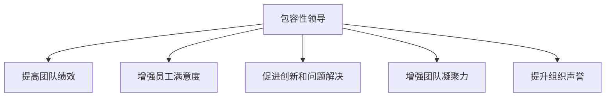

#### 7.2 包容性领导的未来发展

随着社会和技术的不断进步，包容性领导在未来将面临新的机遇和挑战。以下是包容性领导未来发展的几个趋势：

1. **数字化转型**：随着数字化转型的推进，包容性领导将更多地涉及如何应对数字技能的多样性和差异，促进跨领域的创新与合作。
2. **全球化**：全球化趋势使得跨国团队合作变得更加普遍，包容性领导需要在全球范围内推广，以应对不同文化背景下的挑战。
3. **人工智能与自动化**：人工智能和自动化的普及将对劳动力市场产生深远影响，包容性领导需要关注如何应对技术变革带来的多样性和公平性问题。
4. **可持续发展**：随着可持续发展成为全球关注的焦点，包容性领导将更加关注如何在实现经济效益的同时，促进社会和环境可持续发展。

**Mermaid流程图示例：**

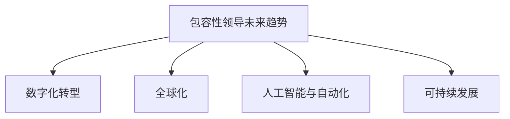

#### 7.3 提高个人包容性领导能力的途径

为了提高个人的包容性领导能力，以下是一些建议：

1. **学习与培训**：积极参加相关的领导力培训和学习课程，了解多样性和包容性的理论知识和实践方法。
2. **反思与自我提升**：定期进行自我反思，识别自己在多样性管理方面的优势和不足，制定个人提升计划。
3. **跨文化交流**：积极参与跨文化交流活动，拓宽视野，增强跨文化沟通和协作能力。
4. **建立支持网络**：与来自不同背景的人建立联系，建立一个多元化的支持网络，分享经验和见解。
5. **实践与反思**：在实际工作中，尝试运用包容性领导的理念和方法，不断总结经验，提升领导能力。

**Mermaid流程图示例：**

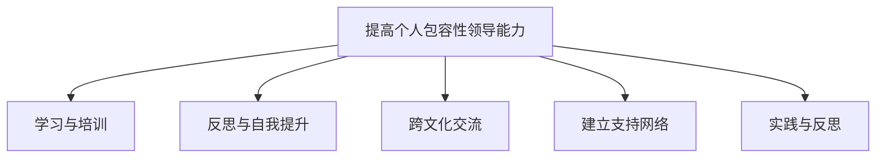

### 小结

包容性领导在提升团队绩效、增强员工满意度、促进创新和问题解决等方面具有重要的价值。随着社会和技术的不断进步，包容性领导将面临新的机遇和挑战。通过学习与培训、反思与自我提升、跨文化交流、建立支持网络和实践与反思，个人可以提高包容性领导能力，为团队和组织的发展贡献力量。

---

以上是第7章的内容，主要总结了包容性领导的重要性、未来发展趋势以及提高个人包容性领导能力的途径。在本文的最后，我们对文章进行了全面的回顾和总结。在接下来的文章中，我们将对全文进行总结，并感谢读者的阅读。

---

### 全文总结

本文围绕“团队多样性：包容性领导的重要性”这一主题，系统地探讨了团队多样性的概念、优势，以及多样性与平等、包容性之间的关系。在此基础上，我们深入分析了包容性领导的定义、原则和行为，并探讨了团队多样性带来的挑战及应对策略。通过实践案例，我们展示了如何在不同场景下创建包容性团队文化，提高团队绩效和员工满意度。最后，我们总结了包容性领导的重要性、未来发展趋势，并提出了提高个人包容性领导能力的途径。

本文的核心观点可以归纳为以下几点：

1. **团队多样性是现代团队管理中的重要概念**，其涵盖了人口统计、知识技能、态度和价值观等多个方面。
2. **包容性领导强调尊重、接纳和重视团队成员的不同特点**，有助于创建一个多元、平等、包容的工作环境。
3. **多样性与平等、包容性之间存在紧密联系**，协同作用可以增强团队凝聚力、提高创新能力、优化决策质量，从而提升员工满意度。
4. **包容性领导在不同文化背景下可能有所差异**，但核心原则是相通的。
5. **创建包容性团队文化需要采取一系列策略**，如树立包容性价值观、提供多元化培训、鼓励开放和坦诚的沟通等。

通过本文的探讨，我们希望读者能够更加深入地理解团队多样性和包容性领导的重要性，并将其应用于实际工作中，打造一个多元、平等、包容的工作环境，从而提高团队的绩效和员工的满意度。

### 感谢读者

感谢各位读者的耐心阅读。本文旨在为读者提供一个全面、系统的理解，以帮助他们在实际工作中更好地应用团队多样性和包容性领导的理念。我们希望本文能够为您带来启发和帮助，如果您有任何问题或建议，欢迎在评论区留言，我们将会及时回复。再次感谢您的阅读，祝您工作顺利，生活愉快！作者：AI天才研究院/AI Genius Institute & 禅与计算机程序设计艺术 /Zen And The Art of Computer Programming。

