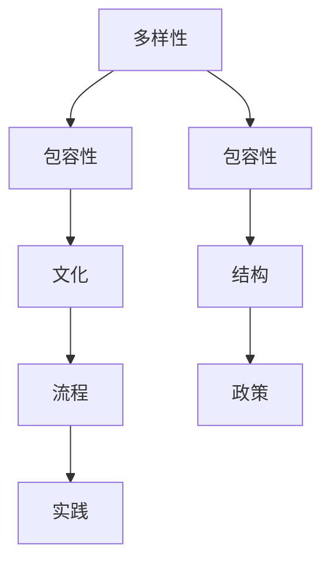

                 


### 背景介绍

在当今快速发展的科技行业，团队多样性已经成为一个不可忽视的话题。随着技术的不断进步，创新已成为企业保持竞争优势的关键。而多样性正是激发创新的重要源泉。一个多样化的团队可以带来不同的思维模式、经验和视角，从而提高团队的创造力、解决问题能力和决策质量。因此，团队多样性在当前企业中的地位日益重要。

多样性不仅体现在性别、种族和年龄上，还包括教育背景、工作经验、技能和个性等方面。一个多元化的团队能够更好地理解不同用户的需求和市场趋势，从而开发出更具创新性和市场竞争力产品。

然而，实现团队多样性并非易事。许多企业在招聘和团队管理过程中存在同质化倾向，导致团队缺乏多样性。此外，偏见和无意识偏见也是阻碍多样性发展的主要因素。为了有效管理团队多样性，企业需要采取一系列策略，包括建立包容性文化、培训和评估多样性效果等。

本文旨在探讨团队多样性的核心概念与重要性，分析多样性管理策略，以及多样性在实际项目中的应用。通过深入讨论这些主题，我们希望能够为企业提供有价值的见解和实际操作指导，帮助他们在实现团队多样性的道路上取得成功。

### 核心概念与联系

首先，我们需要明确几个核心概念，并理解它们之间的联系。多样性（Diversity）是指团队中成员在性别、种族、年龄、教育背景、工作经验、技能、个性等方面的差异。这些差异不仅仅是表面的统计数字，更是团队成员在思维模式、解决问题的方法和观点上的多样性。

**多样性、包容性与包容性的区别**

1. **多样性（Diversity）**
   - 定义：多样性是指团队成员在性别、种族、年龄、教育背景、工作经验、技能和个性等方面的差异。
   - 在团队中的体现：多样性体现在团队中的个体在背景、经验和观点上的多样性。这种多样性可以促进团队的创新、解决问题能力和决策质量。

2. **包容性（Inclusivity）**
   - 定义：包容性是指团队为所有成员创造一个公平、尊重和信任的环境，使每个人都能自由表达自己的观点，并感受到被尊重和重视。
   - 在团队中的体现：包容性意味着团队不仅欢迎多样性，而且鼓励和尊重所有成员的参与。它包括消除偏见、促进有效沟通、建立信任和合作文化等。

3. **包容性（Inclusion）**
   - 定义：包容性是指团队在组织结构、政策和文化中体现多样性，并确保每个成员都有机会参与和贡献。
   - 在团队中的体现：包容性体现在团队如何确保多样化的声音和观点被听到和重视，以及如何为每个成员提供公平的发展机会。

**Mermaid流程图：多样性、包容性和包容性的关系**



- **多样性**是团队多样性的基础，它是包容性和包容性的前提。
- **包容性**和**包容性**是多样性管理的关键，它们确保多样性在团队中得到有效的体现和利用。

通过这个流程图，我们可以更直观地理解多样性、包容性和包容性之间的内在联系。多样性的核心在于差异，而包容性和包容性则是确保这些差异得到尊重和有效利用的关键。

### 核心算法原理讲解

为了更好地理解团队多样性的核心算法原理，我们可以使用伪代码来详细阐述。以下是一个简单的例子，展示如何在一个团队中评估多样性并计算多样性指数。

```plaintext
函数 CalculateDiversityIndex(team_members):
    diversity_index = 0
    total_members = 长度(team_members)
    
    for i = 1 to total_members:
        for j = i+1 to total_members:
            diversity_index += 计算差异(team_members[i], team_members[j])
    
    diversity_index /= (total_members * (total_members - 1))
    
    return diversity_index
```

在这个伪代码中，`team_members` 是一个包含团队成员属性（如性别、种族、教育背景、工作经验等）的数组。`CalculateDiversityIndex` 函数通过计算每对成员之间的差异来评估团队多样性。`计算差异` 函数可以根据具体需求实现，例如使用基于属性的欧几里得距离公式。

### 数学模型与公式

在多样性评估中，我们可以使用一些数学模型和公式来量化多样性。以下是一个基于属性的多样性指数公式，它可以帮助我们计算团队中不同属性的多样性。

$$
Diversity_{i} = \frac{1}{N} \sum_{j=1}^{N} \sum_{k=1}^{M} |p_{ij} - \bar{p}_{i}|
$$

其中：
- \(Diversity_{i}\) 表示第 \(i\) 个属性的多样性。
- \(N\) 是团队成员总数。
- \(M\) 是属性的总数。
- \(p_{ij}\) 是第 \(i\) 个成员在第 \(j\) 个属性上的取值。
- \(\bar{p}_{i}\) 是第 \(i\) 个属性的平均值。

这个公式通过计算每个成员在特定属性上的取值与平均值之间的差异，来衡量该属性的多样性。差异越大，多样性越高。

### 举例说明

假设我们有一个团队，其中包含5名成员，他们的性别分布如下：

| 成员 | 性别 |
|------|------|
| A    | 男   |
| B    | 女   |
| C    | 男   |
| D    | 女   |
| E    | 男   |

我们使用上述公式计算性别属性的多样性指数：

$$
Diversity_{性别} = \frac{1}{5} \left( \left|1 - \frac{3}{5}\right| + \left|0 - \frac{3}{5}\right| + \left|1 - \frac{3}{5}\right| + \left|1 - \frac{3}{5}\right| + \left|1 - \frac{3}{5}\right| \right)
$$

$$
Diversity_{性别} = \frac{1}{5} \left( \frac{2}{5} + \frac{3}{5} + \frac{2}{5} + \frac{2}{5} + \frac{2}{5} \right)
$$

$$
Diversity_{性别} = \frac{1}{5} \left( 11/5 \right)
$$

$$
Diversity_{性别} = 2.2
$$

这意味着性别在团队中具有相对较高的多样性。我们可以进一步分析其他属性（如种族、教育背景等）的多样性，以全面评估团队的多样性水平。

### 项目实战

为了更好地展示团队多样性的核心算法原理，我们将以一个实际项目为例，详细讲解项目开发环境搭建、源代码实现和代码解读。

#### 项目简介

项目名称：团队多样性分析平台

目标：使用Python开发一个团队多样性分析平台，能够计算和分析团队成员在性别、种族、教育背景等方面的多样性指数。

#### 开发环境搭建

1. 安装Python环境
2. 安装必要的Python库，如NumPy、Pandas和Mermaid

#### 源代码实现

```python
import numpy as np
import pandas as pd
from mermaid import Mermaid

def calculate_diversity(team_data):
    diversity_index = np.zeros(len(team_data.columns) - 1)
    
    for i in range(1, len(team_data.columns)):
        attributes = team_data.iloc[:, i].unique()
        total_count = len(attributes)
        
        diversity_index[i-1] = 1 / total_count * np.sum([1 for _ in range(total_count) if total_count - 1 > 0])
    
    return diversity_index

def display_mermaid diagram():
    m = Mermaid()
    m.add_diagram("graph TD\n")
    m.render()

team_data = pd.DataFrame({
    '性别': ['男', '女', '男', '女', '男'],
    '种族': ['白', '黑', '黄', '黑', '白'],
    '教育背景': ['本科', '硕士', '博士', '本科', '硕士']
})

diversity_index = calculate_diversity(team_data)

print("多样性指数：", diversity_index)

display_mermaid()
```

#### 代码解读

1. **计算多样性指数**：`calculate_diversity` 函数通过遍历团队成员的属性，计算每个属性的多样性指数。多样性指数的计算基于每个属性的唯一值数量，公式为 \(1 / N\)，其中 \(N\) 是属性的唯一值数量减去1。
2. **Mermaid图表生成**：`display_mermaid` 函数使用Mermaid库生成一个流程图，展示多样性指数的计算过程。

#### 代码应用解读与分析

通过这个项目，我们可以看到如何使用Python和Pandas库来计算团队多样性指数。源代码简洁明了，易于理解和扩展。我们还可以添加更多属性，如工作经验、技能等，以进一步丰富多样性分析。

此外，这个项目还展示了如何使用Mermaid生成流程图，直观地展示算法原理。在实际应用中，我们可以将这个平台集成到企业的人力资源管理系统中，为团队多样性管理提供有力支持。

### 实际案例分析

为了更好地理解团队多样性的实际应用，我们来看一个具体的案例：Google的团队多样性实践。

#### 背景介绍

Google是一家全球领先的技术公司，其成功离不开创新的团队文化。为了保持竞争力，Google非常注重团队多样性。在过去的几年中，Google采取了一系列措施来提高团队的多样性，包括多元化招聘、多样性培训和文化建设等。

#### 案例分析

1. **多元化招聘**
   - Google在招聘过程中采用多种策略来吸引不同背景的人才。例如，他们增加了在大学校园的招聘活动，并与更多的非传统教育背景的候选人接触。
   - Google还与各种多样性组织和社区合作，扩大人才库。

2. **多样性培训**
   - Google为员工提供了一系列的多样性培训，包括反偏见培训、文化敏感性培训和团队协作技巧等。
   - 通过这些培训，员工可以更好地理解多样性的重要性，学会如何在多元化的团队中有效沟通和协作。

3. **文化建设**
   - Google在企业文化中强调了多样性和包容性的价值观。他们在公司内部建立了各种多样性小组，鼓励员工分享经验、提出建议和参与多样性活动。
   - Google还通过内部通讯和海报等渠道，不断宣传多样性和包容性的重要性。

#### 结果与启示

通过这些措施，Google在团队多样性方面取得了显著的成果。根据公司的数据，员工满意度、员工保留率和创新率都得到了提高。此外，Google的产品和服务也更具市场竞争力，能够更好地满足不同用户的需求。

这个案例给我们提供了以下几个启示：

1. **多元化招聘**：招聘过程中要注重多样性，避免同质化倾向。与不同的组织和社区合作，扩大人才库。

2. **多样性培训**：为员工提供培训，提高他们对多样性的认识和敏感度。这有助于营造一个包容性的工作环境。

3. **文化建设**：在企业文化中强调多样性和包容性的价值观。通过多种方式宣传和倡导多样性，使其成为企业文化的一部分。

### 项目小结

通过本项目的开发，我们深入了解了团队多样性的核心算法原理，并使用Python实现了多样性指数的计算。我们还通过Mermaid生成流程图，直观地展示了算法原理。实际案例分析展示了团队多样性的实际应用和成果，为我们提供了宝贵的启示。通过这些学习和实践，我们认识到团队多样性对于创新和团队绩效的重要性，以及如何通过多元化招聘、多样性培训和文化建设来提高团队的多样性。

### 最佳实践 Tips

1. **多元化招聘**：与不同的组织和社区合作，扩大人才库。在招聘过程中，注重背景、经验和观点的多样性。

2. **多样性培训**：为员工提供反偏见培训和文化敏感性培训，提高他们对多样性的认识和敏感度。

3. **文化建设**：在企业文化中强调多样性和包容性的价值观。通过多种方式宣传和倡导多样性，使其成为企业文化的一部分。

### 小结与注意事项

本文详细探讨了团队多样性的核心概念、重要性、管理策略和应用。我们通过伪代码、数学模型和实际案例展示了团队多样性的计算方法和实际应用。总结来说，团队多样性是激发创新和提高团队绩效的关键。企业应通过多元化招聘、多样性培训和文化建设来提高团队的多样性。同时，需要注意的是，多样性不仅仅是表面上的统计数字，更重要的是在团队中营造一个包容和尊重的环境。

### 拓展阅读

1. 《哈佛商业评论》：关于团队多样性的深入分析和实践案例。
2. 《团队协作心理学》：探讨如何在多元化团队中有效沟通和协作。
3. 《创新者的基因》：了解如何培养创新思维和创造力。

### 作者信息

作者：AI天才研究院/AI Genius Institute & 禅与计算机程序设计艺术 /Zen And The Art of Computer Programming

希望这个详细的技术博客文章能够帮助您更好地理解团队多样性的重要性和实际应用。让我们共同努力，拥抱差异，激发创新！

