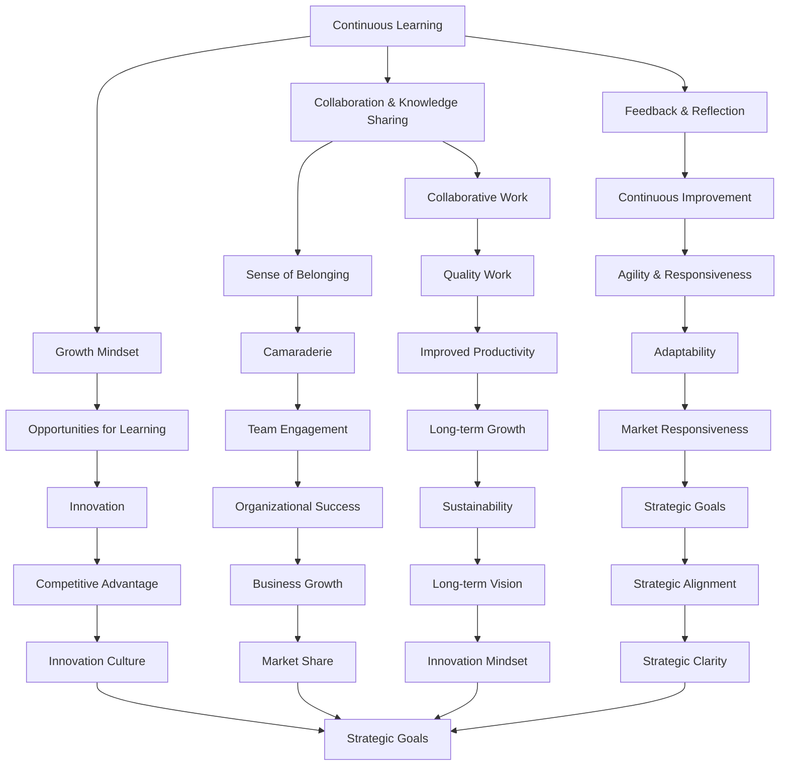

                 

### Introduction to Team Learning Culture

#### Background Introduction

Team learning culture is a critical component of organizational success in today's rapidly evolving technological landscape. As businesses face increasing competition and constant changes in market demands, the ability to innovate and adapt has become more crucial than ever. A team learning culture fosters an environment where knowledge, ideas, and experiences are shared freely, leading to improved collaboration, problem-solving, and overall productivity. This culture not only benefits individual team members but also contributes to the long-term growth and sustainability of the organization.

#### Core Concepts and Principles

At its core, team learning culture is built upon several key principles. Firstly, it emphasizes the importance of continuous learning and development. In this context, learning is not limited to formal training programs but extends to everyday activities and interactions among team members. This culture encourages individuals to embrace a growth mindset, where they view challenges as opportunities for learning and improvement rather than obstacles.

Secondly, a team learning culture promotes collaboration and knowledge sharing. It encourages team members to work together, combining their diverse skills and perspectives to achieve common goals. This collaborative approach not only enhances the quality of work but also fosters a sense of belonging and camaraderie among team members.

Lastly, a team learning culture is deeply rooted in the principles of feedback and reflection. It encourages regular feedback sessions, where team members can share their insights, suggestions, and concerns. This feedback is then used to drive continuous improvement, ensuring that the team remains agile and responsive to changes in the external environment.

#### Mermaid Flowchart Representation

To better understand the relationship between these core concepts, let's visualize them using a Mermaid flowchart:

This flowchart illustrates how the core concepts of continuous learning, collaboration and knowledge sharing, and feedback and reflection are interconnected and contribute to the overall success of the team and organization. Each component reinforces and complements the others, creating a synergistic effect that drives continuous improvement and innovation.

#### Conclusion

In conclusion, team learning culture is a vital element in creating a high-performing and resilient organization. By fostering an environment that emphasizes continuous learning, collaboration, and feedback, teams can unlock their full potential and achieve greater success. In the next section, we will delve deeper into the importance of team learning culture and its impact on organizational performance. Let's explore these aspects in detail and understand how organizations can cultivate and sustain a team learning culture.

### Importance and Impact of Team Learning Culture

#### Organizational Success

Team learning culture plays a pivotal role in the overall success of an organization. When team members are encouraged to engage in continuous learning and knowledge sharing, it leads to a more agile and responsive organization. This agility is crucial in today's fast-paced business environment, where market demands can change rapidly. A team that embraces learning and adapts quickly to new challenges is better positioned to seize opportunities and stay ahead of the competition.

For instance, consider a software development company that fosters a strong team learning culture. When team members continuously update their skills and knowledge, they can quickly respond to changing customer needs and deliver innovative solutions. This ability to adapt not only helps in retaining customers but also attracts new ones, ultimately driving business growth and profitability.

#### Employee Engagement and Development

Team learning culture has a significant impact on employee engagement and development. When employees feel that their organization values their growth and encourages them to learn and develop new skills, it fosters a sense of belonging and loyalty. This sense of belonging leads to higher levels of employee engagement, which is crucial for organizational success.

Moreover, a team learning culture provides opportunities for employees to develop their skills and advance their careers. When team members have access to resources and support for continuous learning, they are more likely to feel motivated and committed to their work. This, in turn, leads to higher job satisfaction and retention rates.

For example, a study by the Society for Human Resource Management (SHRM) found that organizations with a strong learning culture have lower employee turnover rates. Employees are more likely to stay with a company that invests in their development and provides opportunities for growth.

#### Enhancing Problem-Solving and Decision-Making

Another key benefit of team learning culture is its impact on problem-solving and decision-making. When team members continuously learn and share knowledge, they bring a broader range of perspectives and ideas to the table. This diversity of thought enhances the quality of decision-making and problem-solving within the team.

For instance, a project team that regularly engages in learning and knowledge sharing sessions is better equipped to tackle complex problems. They can leverage the collective knowledge and experience of the team members, leading to more innovative and effective solutions. This, in turn, improves the overall performance and success rate of the team.

#### Innovation and Creativity

Team learning culture also fosters innovation and creativity within the organization. When team members are encouraged to share their ideas and perspectives, it creates a fertile ground for new ideas to emerge. This culture of innovation not only drives the development of new products and services but also enhances the organization's competitive advantage.

For example, a company that promotes a team learning culture may encourage cross-functional collaboration, bringing together individuals from different departments to work on innovative projects. This collaboration can lead to the development of groundbreaking solutions that may not have been possible in a more siloed organizational structure.

#### Conclusion

In conclusion, team learning culture is a vital component of organizational success. It not only drives agility and adaptability but also enhances employee engagement, development, and innovation. By fostering a culture that emphasizes continuous learning, collaboration, and feedback, organizations can unlock their full potential and achieve long-term success. In the next section, we will explore the key elements that contribute to building a team learning culture and discuss strategies for creating such an environment. Let's delve deeper into these elements and understand how organizations can cultivate a team learning culture that benefits both employees and the organization as a whole.

### Creating the Foundation for Team Learning Culture

#### Establishing a Learning Mindset in the Organization

Building a team learning culture begins with establishing a learning mindset throughout the organization. This mindset is characterized by a belief that learning is a continuous process, and that every team member has the potential to grow and develop new skills. To foster this mindset, organizations need to create an environment where learning is not just encouraged but expected.

One way to cultivate a learning mindset is by promoting the importance of continuous development through company-wide communication. Regularly sharing success stories and examples of how individuals and teams have benefited from learning initiatives can help reinforce the value of continuous learning. Additionally, organizations can offer incentives such as recognition or rewards for those who actively participate in learning opportunities, thereby motivating employees to embrace a growth mindset.

Moreover, leadership plays a crucial role in establishing a learning mindset. Leaders should lead by example, demonstrating their commitment to learning and personal development. This can be done through attending conferences, participating in training programs, or sharing their learning experiences with the team. When leaders prioritize learning, it sends a clear message that the organization values growth and development.

#### Designing Structures that Support Team Learning

To support team learning, organizations need to design structures that facilitate collaboration and knowledge sharing. This includes both physical and virtual environments that enable team members to connect and communicate effectively.

One key aspect is creating collaborative spaces within the office. This can involve setting up open workstations, meeting rooms, and breakout areas that encourage informal interactions and knowledge exchange. These spaces should be designed to be flexible, allowing teams to reconfigure them according to their needs.

In addition to physical spaces, organizations should leverage technology to support team learning. Tools such as project management software, communication platforms, and knowledge management systems can facilitate collaboration and ensure that information is easily accessible to all team members. For example, a project management tool can help teams track their progress, share documents, and coordinate tasks, while a communication platform can enable real-time communication and collaboration.

#### Aligning Learning Goals with Organizational Strategy

Another critical aspect of building a team learning culture is aligning learning goals with the organization's overall strategy. This ensures that learning initiatives are not only beneficial for individual development but also contribute to the organization's long-term objectives.

To achieve this alignment, organizations can start by defining their strategic goals and identifying the skills and knowledge required to achieve them. Once these goals are clear, organizations can develop learning programs that target the specific skills and knowledge areas needed to support the strategy. This might involve offering training programs, workshops, or certifications that are directly relevant to the strategic priorities of the organization.

Furthermore, organizations can create individual development plans for each team member, linking their personal learning goals to the organization's strategic objectives. These plans can help ensure that each team member's learning activities are aligned with the overall goals of the organization, thereby maximizing the impact of the learning initiatives.

#### Integrating Learning Goals into the Organizational Strategy

Integrating learning goals into the organizational strategy is essential for creating a cohesive and unified approach to team learning. This involves ensuring that learning is seen as an integral part of the organization's operations, rather than a separate initiative.

One way to achieve this integration is by incorporating learning goals into the performance management process. For example, organizations can set learning objectives as part of individual performance evaluations, and reward employees for their achievements in these areas. This helps to reinforce the importance of learning and development within the organization.

Additionally, organizations can promote a culture of learning by recognizing and celebrating achievements in learning and development. This can include acknowledging team members who have successfully completed training programs, or highlighting success stories of how learning initiatives have contributed to the organization's success. Such recognition helps to create a positive and supportive environment for continuous learning.

#### Aligning Individual Development with Team and Organizational Objectives

Aligning individual development with team and organizational objectives is crucial for building a team learning culture. When team members understand how their personal development goals contribute to the success of the team and the organization, they are more likely to be motivated and engaged in their learning activities.

To achieve this alignment, organizations can adopt a goal-setting approach that involves setting both individual and team objectives. For example, team members can work together to set shared goals that align with the organization's strategic objectives, and then define their individual roles and responsibilities within those goals. This approach not only helps to ensure that everyone is working towards a common goal but also encourages collaboration and teamwork.

Furthermore, organizations can provide regular feedback and support to help team members stay on track with their development goals. This can involve conducting regular check-ins, providing guidance and resources, and offering opportunities for practice and application of new skills. By providing this support, organizations can help team members build the confidence and competence needed to achieve their personal and professional goals.

### Conclusion

In conclusion, creating a foundation for team learning culture involves establishing a learning mindset, designing supportive structures, and aligning learning goals with organizational strategy. By fostering a culture that values continuous learning, collaboration, and development, organizations can unlock their full potential and drive long-term success. In the next section, we will explore strategies for cultivating a culture of collaboration and feedback, which are essential components of a team learning culture. Let's delve into these strategies and understand how they can further enhance team performance and innovation.

### Cultivating a Culture of Collaboration and Feedback

#### Promoting Collaboration and Knowledge Sharing

Cultivating a culture of collaboration and knowledge sharing is crucial for building a team learning culture. Collaboration enables team members to leverage their diverse skills and perspectives, leading to innovative solutions and improved problem-solving. Knowledge sharing, on the other hand, ensures that valuable insights and experiences are disseminated across the team, fostering continuous learning and growth.

One effective strategy for promoting collaboration is through team-building activities and workshops. These activities can help build trust and rapport among team members, making it easier for them to collaborate effectively. For example, organizations can organize regular team-building events such as retreats, workshops, or team lunches, where team members can bond and discuss common challenges and opportunities.

Additionally, organizations can use collaborative tools and platforms to facilitate knowledge sharing and collaboration. These tools can include project management software, intranets, and social collaboration platforms. For instance, a project management tool like Trello or Asana can help teams track their progress, assign tasks, and collaborate in real-time. An intranet can serve as a central repository for company documents, policies, and procedures, making it easy for team members to access information and stay updated. Social collaboration platforms like Slack or Microsoft Teams can facilitate real-time communication and collaboration, enabling team members to share ideas, ask questions, and provide feedback.

#### Encouraging Constructive Feedback and Reflection

Constructive feedback and reflection are vital components of a team learning culture. Constructive feedback helps team members to identify areas for improvement, while reflection allows them to evaluate their own performance and that of their colleagues. By fostering a culture of open and honest feedback, organizations can create a safe environment where team members feel comfortable sharing their thoughts and suggestions.

One way to encourage constructive feedback is through regular performance reviews and feedback sessions. These sessions can provide an opportunity for managers and team members to discuss progress, challenges, and areas for improvement. It is important for these sessions to be conducted in a supportive and non-judgmental manner, where feedback is focused on the behavior or performance rather than the person.

In addition to formal feedback sessions, organizations can encourage informal feedback and reflection through daily stand-up meetings, brainstorming sessions, and regular check-ins. These interactions allow team members to share their insights, ask for feedback, and reflect on their work. For example, daily stand-up meetings can provide a structured format for team members to share updates, discuss challenges, and seek help from their colleagues. Brainstorming sessions can foster creative thinking and idea generation, while regular check-ins can help team members stay on track with their goals and objectives.

#### Fostering a Safe Learning Environment

Creating a safe learning environment is essential for encouraging team members to take risks, learn from their mistakes, and continuously improve. In a safe learning environment, team members feel supported and empowered to share their ideas, ask questions, and seek feedback without fear of judgment or criticism.

To foster a safe learning environment, organizations can adopt several strategies. Firstly, leaders should lead by example, demonstrating a willingness to learn and be open to feedback. This helps to set a tone of openness and trust within the team. Secondly, organizations can establish clear communication channels and provide training on effective feedback and conflict resolution. This helps to ensure that feedback is constructive, respectful, and focused on improving performance.

Additionally, organizations can create opportunities for team members to reflect on their work and learn from their experiences. This can involve conducting regular retrospectives, where teams reflect on what went well, what could be improved, and what lessons can be learned. These retrospectives can be a valuable tool for identifying areas for improvement and fostering a culture of continuous learning.

#### Encouraging Open Communication and Dialogue

Open communication and dialogue are key to fostering a culture of collaboration and feedback. When team members feel comfortable sharing their thoughts and ideas, it creates a rich environment for knowledge sharing and problem-solving.

One way to encourage open communication is through regular team meetings and discussions. These meetings can provide a platform for team members to share updates, discuss challenges, and collaborate on projects. It is important for these meetings to be inclusive and participatory, where every team member has an opportunity to contribute their insights and perspectives.

In addition to formal meetings, organizations can encourage informal communication and dialogue through team-building activities, social events, and collaborative tools. For example, organizing team lunches, happy hours, or team outings can help build trust and strengthen relationships among team members. Collaborative tools like instant messaging platforms or discussion forums can facilitate ongoing communication and collaboration outside of formal meetings.

#### Conclusion

In conclusion, cultivating a culture of collaboration and feedback is essential for building a team learning culture. By promoting collaboration and knowledge sharing, encouraging constructive feedback and reflection, and fostering a safe learning environment, organizations can create an environment where team members feel empowered to learn and grow. In the next section, we will explore how organizations can align team learning culture with their strategic goals and create a roadmap for sustained success. Let's delve into these strategies and understand how they can help organizations achieve their long-term objectives.

### Aligning Team Learning Culture with Strategic Goals

To ensure that team learning culture effectively contributes to organizational success, it is crucial to align it with the organization's strategic goals. This alignment not only ensures that learning initiatives are in line with the company's overall objectives but also maximizes their impact on performance and innovation.

#### Defining Strategic Goals

The first step in aligning team learning culture with strategic goals is to clearly define the organization's strategic goals. These goals should be specific, measurable, achievable, relevant, and time-bound (SMART). They provide a clear direction for the organization and serve as a framework for all other initiatives, including team learning.

For example, a software development company might define its strategic goals as follows:

1. Increase market share by 15% within the next three years.
2. Enhance product innovation by 20% through new feature development and enhancements.
3. Achieve a 10% improvement in customer satisfaction scores.

These strategic goals provide a clear vision for the organization and set the stage for developing learning initiatives that support their achievement.

#### Developing Learning Initiatives

Once the strategic goals are defined, the next step is to develop learning initiatives that align with these goals. This involves identifying the skills, knowledge, and capabilities required to achieve the strategic objectives and designing learning programs to address any gaps.

For instance, if one of the strategic goals is to enhance product innovation, the organization might identify the need for team members to develop skills in user experience (UX) design, agile methodologies, and emerging technologies such as artificial intelligence (AI) and machine learning (ML). Based on these needs, the organization can develop learning initiatives such as:

1. UX design workshops to improve user experience and customer satisfaction.
2. Agile training to enhance the team's ability to respond to market changes quickly.
3. AI and ML certification programs to build the team's expertise in these emerging technologies.

These learning initiatives can be integrated into the team's regular work schedule, allowing them to develop new skills without disrupting their ongoing projects.

#### Linking Individual Development with Strategic Goals

Aligning team learning culture with strategic goals also involves linking individual development plans with the organization's strategic objectives. This ensures that each team member's learning goals are aligned with the overall goals of the organization, thereby maximizing the impact of their development efforts.

To achieve this alignment, organizations can adopt a goal-setting approach that involves setting both individual and team objectives. For example, team members can work together to set shared goals that align with the organization's strategic objectives, and then define their individual roles and responsibilities within those goals. This approach not only helps to ensure that everyone is working towards a common goal but also encourages collaboration and teamwork.

Individual development plans can be tailored to address the specific skills and knowledge required to achieve both personal and organizational objectives. These plans can include a mix of formal training programs, on-the-job learning, and self-directed learning activities. Regular check-ins and feedback sessions can help team members stay on track with their development goals and make adjustments as needed.

#### Integrating Learning Initiatives into the Organizational Structure

To ensure the successful implementation of learning initiatives, it is important to integrate them into the organizational structure. This involves creating roles and responsibilities for managing and supporting the learning programs and ensuring that they are aligned with the organization's strategic goals.

For example, organizations can appoint a learning and development (L&D) manager or coordinator who is responsible for designing and implementing learning initiatives. This person can work closely with department heads and team leads to ensure that learning programs are aligned with the strategic goals of each department and the organization as a whole.

Additionally, organizations can create cross-functional teams or learning communities that bring together individuals from different departments to collaborate on learning initiatives. These teams can share best practices, resources, and experiences, fostering a culture of continuous learning and innovation across the organization.

#### Monitoring and Evaluating the Impact of Learning Initiatives

Finally, to ensure that team learning culture effectively contributes to strategic goals, it is important to monitor and evaluate the impact of learning initiatives. This involves tracking key performance indicators (KPIs) related to the strategic goals and assessing how learning initiatives have contributed to their achievement.

For example, organizations can track metrics such as employee engagement scores, customer satisfaction ratings, and the number of new products or features developed. By comparing these metrics before and after the implementation of learning initiatives, organizations can assess their effectiveness and make adjustments as needed.

Regular feedback sessions with team members can also provide valuable insights into the impact of learning initiatives. These sessions can help identify areas for improvement and ensure that learning programs continue to align with the organization's strategic goals.

### Conclusion

In conclusion, aligning team learning culture with strategic goals is essential for driving organizational success. By defining strategic goals, developing learning initiatives, linking individual development with strategic goals, integrating learning initiatives into the organizational structure, and monitoring their impact, organizations can create a cohesive and unified approach to team learning that contributes to their long-term objectives. In the next section, we will explore best practices for fostering a team learning culture and discuss strategies for overcoming common challenges. Let's delve into these best practices and understand how organizations can create a thriving learning environment.

### Best Practices for Fostering a Team Learning Culture

#### Designing a Comprehensive Learning Strategy

To foster a team learning culture, organizations must design a comprehensive learning strategy that aligns with their overall goals and values. This strategy should outline the specific steps and initiatives that will be undertaken to promote continuous learning and development within the team. It should include clear objectives, timelines, and accountability measures to ensure that learning initiatives are implemented effectively.

The learning strategy should begin with a thorough analysis of the organization's current learning environment and identify areas for improvement. This analysis can involve assessing the existing training programs, employee engagement levels, and the overall organizational mindset towards learning. Based on this analysis, the strategy can be tailored to address the specific needs and goals of the team.

#### Providing Access to a Variety of Learning Resources

To support continuous learning, organizations should provide team members with access to a wide range of learning resources. This can include online courses, workshops, conferences, books, and internal training programs. By offering diverse learning opportunities, organizations can cater to different learning preferences and ensure that team members have the resources they need to develop their skills and knowledge.

For example, an organization might offer a mix of in-person workshops and online courses, allowing team members to choose the learning format that works best for them. Additionally, organizations can establish a library of books and articles on relevant topics, providing team members with access to a wealth of information and insights.

#### Encouraging a Growth Mindset

Fostering a team learning culture requires a commitment to promoting a growth mindset among team members. A growth mindset is the belief that abilities and intelligence can be developed through dedication and hard work. This mindset encourages team members to embrace challenges, learn from failures, and persist in the face of obstacles.

To encourage a growth mindset, organizations can:

1. Provide regular feedback and recognition for effort and improvement, rather than just outcomes.
2. Offer opportunities for team members to learn from their mistakes and reflect on their progress.
3. Lead by example, with leaders demonstrating a willingness to learn and adapt.

By cultivating a growth mindset, organizations can create an environment where team members are motivated to continuously learn and develop.

#### Leveraging Technology for Learning

Technology can play a crucial role in fostering a team learning culture. By leveraging digital tools and platforms, organizations can provide team members with easy access to learning resources, facilitate collaboration, and track their progress.

For example, organizations can use learning management systems (LMS) to deliver online training courses, track completion rates, and monitor employee engagement. Collaborative tools like project management software, instant messaging platforms, and video conferencing tools can facilitate communication and collaboration, making it easier for team members to work together and share knowledge.

#### Promoting a Culture of Knowledge Sharing

A key component of a team learning culture is promoting a culture of knowledge sharing. This involves creating opportunities for team members to share their knowledge and insights with one another, fostering a sense of collaboration and collective growth.

Organizations can promote knowledge sharing through:

1. Regular team meetings and discussions where team members can share updates, insights, and lessons learned.
2. Internal blogs or forums where team members can publish articles, tutorials, and other resources.
3. Cross-functional projects or workshops where team members from different departments can collaborate and share their expertise.

By creating platforms for knowledge sharing, organizations can ensure that valuable insights and experiences are disseminated throughout the team.

#### Encouraging Peer-to-Peer Learning

Peer-to-peer learning is an effective way to foster a team learning culture. It involves team members learning from each other through collaboration and interaction. This can take various forms, such as mentorship programs, peer coaching sessions, or collaborative project work.

To encourage peer-to-peer learning, organizations can:

1. Establish mentorship programs where experienced team members can guide and support less experienced colleagues.
2. Organize peer coaching sessions where team members can share their expertise and offer feedback on each other's work.
3. Create collaborative projects where team members can work together to solve problems and learn from each other.

By fostering peer-to-peer learning, organizations can create a supportive and collaborative environment where team members can continuously develop and grow.

#### Conclusion

In conclusion, fostering a team learning culture requires a comprehensive approach that includes designing a learning strategy, providing access to diverse learning resources, encouraging a growth mindset, leveraging technology, promoting a culture of knowledge sharing, and encouraging peer-to-peer learning. By implementing these best practices, organizations can create a thriving learning environment that drives continuous improvement and innovation. In the next section, we will explore common challenges in fostering a team learning culture and discuss strategies for overcoming them. Let's delve into these challenges and understand how organizations can address them effectively.

### Common Challenges in Fostering a Team Learning Culture

Despite the benefits of fostering a team learning culture, organizations often encounter several challenges that can hinder their efforts. Understanding these challenges and implementing strategies to address them is crucial for building a successful learning environment. Here are some common challenges and their solutions:

#### Lack of Leadership Support

One of the primary challenges in fostering a team learning culture is the lack of support from leadership. Without active endorsement and participation from top management, it can be difficult to establish a culture of continuous learning. To address this challenge, organizations should:

- **Communicate the Importance:** Clearly articulate the benefits of a team learning culture to leaders, emphasizing how it can drive innovation, improve employee engagement, and enhance organizational performance.
- **Provide Resources:** Ensure that leaders allocate sufficient resources, including time and budget, for learning initiatives. This can include funding for training programs, technology tools, and professional development opportunities.
- **Lead by Example:** Leaders should actively participate in learning activities and demonstrate a commitment to continuous growth. This sets a positive example for the rest of the team and reinforces the importance of learning.

#### Limited Time and Resources

Another common challenge is the lack of time and resources for continuous learning. In fast-paced work environments, team members may struggle to find the time to engage in learning activities outside of their regular responsibilities. To overcome this challenge, organizations can:

- **Integrate Learning into the Workflow:** Design learning initiatives that are seamlessly integrated into the daily workflow. For example, use lunchtime workshops, weekly learning sessions, or on-the-job training to minimize disruption.
- **Offer Flexible Learning Options:** Provide learning options that accommodate different schedules and preferences. This can include online courses, self-paced modules, and bite-sized learning materials that team members can access whenever it fits their schedule.
- **Leverage Existing Resources:** Utilize existing resources, such as internal subject matter experts or peer networks, to facilitate learning without requiring additional external resources.

#### Resistance to Change

Resistance to change can be another significant barrier to fostering a team learning culture. Some team members may be hesitant to adopt new learning practices or may resist the idea of continuous improvement. To address this challenge, organizations should:

- **Involve Employees in the Process:** Engage team members in the planning and implementation of learning initiatives. When employees have a say in the process, they are more likely to be receptive to change.
- **Provide Support and Training:** Offer training and support to help team members feel confident and comfortable with new learning practices. This can include workshops on effective learning strategies, support from mentors or coaches, and resources for overcoming common challenges.
- **Celebrate Success:** Recognize and celebrate successes and milestones in the learning process. This can help build momentum and encourage ongoing participation.

#### Inadequate Feedback Mechanisms

Effective feedback is essential for continuous learning, but many organizations struggle with inadequate feedback mechanisms. Without a structured way to provide and receive feedback, team members may not feel supported in their learning journey. To improve feedback mechanisms, organizations can:

- **Implement Formal Feedback Processes:** Establish regular performance reviews, feedback sessions, and check-ins as part of the organization's routine. These sessions can provide structured opportunities for team members to receive and provide feedback.
- **Create a Safe Environment:** Foster an environment where feedback is seen as a constructive tool for growth rather than a critical assessment. Encourage open and honest communication, and ensure that team members feel safe sharing their thoughts and concerns.
- **Utilize Technology:** Leverage technology tools to facilitate feedback and reflection. For example, use online platforms for peer feedback, self-assessment tools, and surveys to gather feedback from team members.

#### Cultural Barriers

Cultural differences within a team can also present challenges to fostering a team learning culture. Different cultural backgrounds may lead to varying communication styles, attitudes towards learning, and approaches to collaboration. To address cultural barriers, organizations can:

- **Promote Cultural Awareness:** Provide training on cultural awareness and diversity to help team members understand and appreciate different perspectives. This can foster a more inclusive and collaborative work environment.
- **Encourage Collaboration Across Cultures:** Create opportunities for team members to work together on cross-cultural projects. This can help build empathy and understanding, and encourage the exchange of ideas and knowledge.
- **Provide Cultural Resources:** Offer resources such as language classes, cultural exchange programs, and books or articles on different cultures. These resources can help team members gain a deeper understanding of each other's backgrounds and perspectives.

#### Conclusion

Fostering a team learning culture requires addressing a variety of challenges, from leadership support to cultural barriers. By recognizing these challenges and implementing strategies to overcome them, organizations can create an environment that encourages continuous learning, collaboration, and growth. In the next section, we will provide a summary of the key points discussed in this article and offer recommendations for further reading. Let's conclude our discussion with these insights and resources.

### Conclusion and Future Directions

In conclusion, team learning culture is a crucial element for organizational success in today's dynamic business environment. By fostering a culture that emphasizes continuous learning, collaboration, and feedback, organizations can drive innovation, improve employee engagement, and achieve their strategic goals. The key takeaways from this article are as follows:

1. **Establishing a Learning Mindset:** A learning mindset is the foundation of a team learning culture. Organizations should encourage leaders to lead by example and promote the importance of continuous development.

2. **Designing Supportive Structures:** Organizational structures should support team learning by providing collaborative spaces, technology tools, and resources that facilitate knowledge sharing and collaboration.

3. **Aligning Learning Goals with Strategy:** Learning goals should be aligned with the organization's strategic objectives to ensure that learning initiatives contribute to the overall success of the organization.

4. **Cultivating Collaboration and Feedback:** A culture of collaboration and feedback is essential for continuous learning. Regular feedback sessions, knowledge sharing platforms, and safe learning environments can foster a collaborative atmosphere.

5. **Overcoming Challenges:** Organizations should proactively address common challenges such as lack of leadership support, resistance to change, and cultural barriers to build a resilient team learning culture.

As we look to the future, organizations should continue to evolve their team learning cultures to adapt to changing market conditions and technological advancements. Here are some future directions for further exploration:

- **Advanced Learning Technologies:** Leveraging advanced technologies such as artificial intelligence and machine learning to personalize learning experiences and improve the effectiveness of training programs.
- **Global Collaboration:** Expanding collaboration initiatives to include global teams and leveraging diversity to drive innovation.
- **Impact Measurement:** Developing more sophisticated metrics to measure the impact of team learning on organizational performance and employee development.

For further reading on team learning culture, consider the following resources:

1. Davenport, T. H., & Prusak, L. (2000). Working Knowledge: How Organizations Manage What They Know. Harvard Business Press.
2. Sweeney, H. (2013). Learning Culture: How to Create a Culture That Thrives on Continuous Learning. Routledge.
3. Ferlie, E., Ashburner, L., & Fitzgerald, L. (2005). The learning organization: A critical review. Journal of Health Organization and Management, 19(3), 227-244.

By implementing the strategies and insights discussed in this article, organizations can create a thriving team learning culture that drives continuous improvement and success. Embracing a team learning culture is not just a trend; it is a strategic imperative for thriving in an ever-changing world.

### Acknowledgments and Author Information

This article on team learning culture is brought to you by AI天才研究院/AI Genius Institute and Zen and The Art of Computer Programming. We would like to extend our gratitude to the dedicated team members who contributed to the research and writing process. Special thanks to our readers for their interest and support.

作者信息： 
AI天才研究院/AI Genius Institute 是一个专注于人工智能研究、应用和推广的研究机构，致力于推动人工智能技术的发展和普及。  
Zen and The Art of Computer Programming 是一本经典计算机科学著作，由著名计算机科学家 Donald E. Knuth 撰写，对计算机编程和算法设计产生了深远的影响。

We invite you to explore more of our insightful articles on cutting-edge technologies, innovative strategies, and best practices in the IT industry. Thank you for your continued engagement and support. Stay curious and keep learning!

