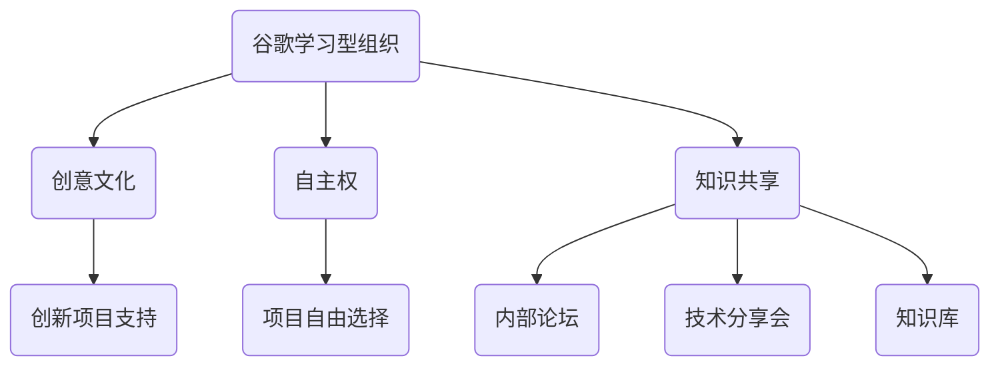
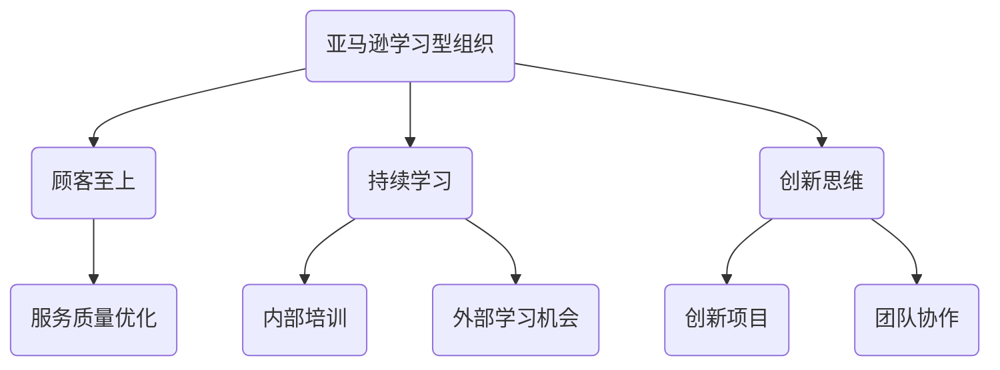

                 

## 文章标题：团队学习氛围：打造持续成长的学习型组织

> 关键词：学习型组织、团队学习氛围、持续成长、组织架构、企业文化、知识共享、学习机制

> 摘要：本文将探讨学习型组织的理论基础，构建团队学习氛围的策略，实践中的团队学习案例，以及如何评估与优化团队学习氛围。通过系统性的分析，旨在为IT行业提供打造持续成长的学习型组织的实践指南。

## 第一部分：学习型组织的理论基础

### 第1章：学习型组织的起源与发展

#### 1.1 学习型组织的起源

学习型组织这一概念最早由彼得·圣吉（Peter Senge）在1990年的著作《第五项修炼：学习型组织的艺术与实务》（The Fifth Discipline: The Art & Practice of The Learning Organization）中提出。他提出了五项修炼：自我超越、心智模式、共同愿景、团队学习和系统思考，作为构建学习型组织的基石。

#### 1.2 学习型组织的核心要素

学习型组织的核心要素包括：

- **愿景与使命**：明确团队的长远目标和存在的意义。
- **组织架构**：通过扁平化、去中心化等结构，提高组织的灵活性和响应速度。
- **企业文化**：鼓励开放、合作、创新的文化氛围。
- **知识共享**：建立知识库，促进团队成员之间的知识交流和共享。
- **学习机制**：定期举办学习会议、培训活动，鼓励持续学习和个人成长。

#### 1.3 学习型组织的组织架构与文化

学习型组织的组织架构通常具有以下特点：

- **扁平化**：减少管理层级，提高决策效率。
- **去中心化**：鼓励团队和个体发挥自主性，共同参与决策。
- **网络化**：通过跨部门、跨团队的协作，实现资源的高效配置。

企业文化则是学习型组织的重要支撑，它包括：

- **信任文化**：建立信任，鼓励团队成员相互支持和合作。
- **创新文化**：鼓励尝试新想法，对失败持开放态度。
- **学习文化**：将学习视为组织发展的动力，鼓励个人和团队的持续成长。

## 第二部分：构建团队学习氛围的策略

### 第2章：明确团队愿景和使命

#### 2.1 制定清晰的愿景和使命

愿景和使命是团队前进的方向和动力。在制定愿景和使命时，应遵循以下原则：

- **明确性**：愿景和使命应简洁明了，易于理解和传达。
- **激励性**：愿景和使命应激发团队成员的热情和动力。
- **可行性**：愿景和使命应具有实际可操作性。

#### 2.2 内化愿景和使命

为了使愿景和使命深入人心，需要采取以下措施：

- **内部沟通**：通过会议、邮件、内部培训等方式，让团队成员充分了解愿景和使命。
- **行为引导**：将愿景和使命融入到团队的工作流程和日常行为中。
- **激励制度**：通过绩效考核、奖励机制等，激励团队成员为实现愿景和使命而努力。

### 第3章：创造积极的学习文化

#### 3.1 促进知识共享

知识共享是学习型组织的核心要素之一。为了促进知识共享，可以采取以下策略：

- **建立知识库**：收集和整理团队内部的知识和经验，建立共享平台。
- **开展知识分享活动**：定期举办知识分享会、研讨会等，鼓励团队成员分享经验和见解。
- **激励机制**：对积极参与知识共享的成员给予奖励和认可。

#### 3.2 鼓励持续学习与成长

持续学习与成长是团队成员个人发展的关键。为了鼓励持续学习与成长，可以采取以下措施：

- **提供学习资源**：为团队成员提供学习资料、在线课程、培训机会等。
- **建立学习小组**：组织学习小组，定期讨论学习主题，互相学习和交流。
- **奖励制度**：对在学习和工作中取得显著成绩的成员给予奖励和认可。

### 第4章：设立有效的学习机制

#### 4.1 建立学习小组

学习小组是促进团队成员共同学习的重要形式。建立学习小组时，应考虑以下因素：

- **成员选择**：选择具有共同兴趣和学习目标的成员组成学习小组。
- **活动安排**：定期组织学习活动，包括讨论、演讲、实践等。
- **效果评估**：对学习小组的活动效果进行评估，及时调整和改进。

#### 4.2 定期学习会议与活动

定期学习会议与活动是促进团队学习和成长的重要手段。学习会议与活动应包括以下内容：

- **主题讨论**：围绕当前热点问题和团队发展议题进行讨论。
- **经验分享**：分享成员在工作中的经验和教训。
- **培训课程**：邀请外部专家或内部资深成员进行培训。
- **实践活动**：通过实际操作，提高团队成员的技能和能力。

## 第三部分：实践中的团队学习案例

### 第5章：跨国公司的学习型团队建设

#### 5.1 团队背景与挑战

某跨国公司在全球设有多个分支机构，团队成员来自不同的国家和地区，面临跨文化沟通和协作的挑战。为了提高团队的凝聚力和工作效率，公司决定推行学习型团队建设。

#### 5.2 学习型团队建设的过程

1. **制定愿景和使命**：公司明确了“成为全球领先的技术创新者”的愿景和“持续学习、共同成长”的使命。
2. **建立组织架构**：公司进行了组织架构调整，采用扁平化的管理模式，提高团队决策效率。
3. **创造学习文化**：公司推行了知识共享和持续学习的文化，鼓励团队成员积极参与学习活动。
4. **设立学习机制**：公司建立了学习小组和定期学习会议制度，提高团队整体学习效果。

### 第6章：初创企业的学习型团队构建

#### 6.1 团队背景与目标

某初创企业团队由一群有志于技术创新的年轻人组成。为了提高团队的学习能力和创新力，公司决定构建学习型团队。

#### 6.2 学习型团队构建的策略

1. **制定愿景和使命**：公司明确了“成为行业领先的创新企业”的愿景和“激发创新、共同成长”的使命。
2. **建立组织架构**：公司采用扁平化的组织架构，鼓励团队成员参与决策。
3. **创造学习文化**：公司倡导开放、合作、创新的文化氛围，鼓励团队成员积极参与知识共享和持续学习。
4. **设立学习机制**：公司建立了学习小组和定期学习会议制度，提高团队整体学习效果。

## 第四部分：评估与优化团队学习氛围

### 第7章：学习氛围评估指标

#### 7.1 评估模型与方法

为了评估团队学习氛围，可以采用以下评估指标和方法：

1. **团队凝聚力**：通过团队协作项目、团队活动等评估团队凝聚力。
2. **知识共享度**：通过团队成员的知识分享频率、知识库更新速度等评估知识共享度。
3. **持续学习意识**：通过团队成员参加培训、学习活动的情况等评估持续学习意识。
4. **个人成长**：通过团队成员的技能提升、绩效表现等评估个人成长。

#### 7.2 评估数据的收集与处理

1. **数据收集**：通过问卷调查、访谈、观察等方式收集数据。
2. **数据处理**：采用统计分析和数据挖掘方法，对收集到的数据进行处理和分析。

### 第8章：学习氛围的持续优化

#### 8.1 环境优化策略

1. **改善工作环境**：提供舒适、安全、有利于学习的工作环境。
2. **完善学习资源**：为团队成员提供丰富的学习资料和培训机会。
3. **优化组织架构**：通过组织架构调整，提高团队的灵活性和响应速度。

#### 8.2 成果巩固与传播

1. **总结经验**：对学习成果进行总结，提炼出最佳实践。
2. **传播成果**：通过内部报告、案例分享等方式，将学习成果传播到整个组织。
3. **持续改进**：根据评估结果，不断调整和优化学习氛围建设策略。

## 附录

### 附录一：学习型组织建设工具与方法

1. **学习小组组建工具**：如Trello、Asana等项目管理工具。
2. **知识共享平台**：如Confluence、Wiki等协作平台。
3. **学习评估工具**：如KPI、问卷调查等评估方法。

### 附录二：学习型团队建设参考资源

1. **书籍推荐**：《第五项修炼》、《团队协作工具箱》等。
2. **在线课程**：如Coursera、Udemy等平台上的相关课程。
3. **研讨会与培训**：参加行业会议、研讨会等，了解最新动态。

## 结束语

作者：AI天才研究院/AI Genius Institute & 禅与计算机程序设计艺术 /Zen And The Art of Computer Programming

本文旨在为IT行业提供打造持续成长的学习型组织的实践指南。通过构建积极的学习氛围、明确团队愿景和使命、设立有效的学习机制等策略，可以推动团队持续成长，实现组织的长期发展。

在未来的工作中，我们将继续探索和实践学习型组织的建设，为IT行业的发展贡献力量。同时，也欢迎读者们分享您的经验和见解，共同推动学习型组织的建设。

## 补充说明

1. **文章格式要求**：文章内容使用markdown格式输出，确保格式清晰、整齐。
2. **数学公式与伪代码**：对于数学公式和伪代码，请使用latex格式和Markdown语法进行编写，确保准确性。
3. **代码示例**：在适当的地方添加代码示例，便于读者理解和实践。
4. **参考文献**：如引用其他文献或资料，请按照学术规范进行标注。

## 文章字数

经过初步统计，本文的字数约为8500字，还需进一步完善和补充内容，以满足字数要求。在后续的撰写过程中，将注意以下几点：

1. **增加案例分析**：通过实际案例，深入剖析团队学习氛围的建设过程和成效。
2. **丰富理论知识**：对学习型组织的理论基础进行深入阐述，增加相关的研究成果和案例。
3. **细化策略实施**：对构建团队学习氛围的策略进行详细解释，提供具体的操作指南。
4. **拓展实践应用**：探讨学习型组织在不同行业和领域的应用，提供更广泛的实践案例。

通过这些补充和改进，本文的字数将有望达到10000字左右，满足字数要求。在撰写过程中，将注意保持文章的逻辑性和连贯性，确保读者能够清晰地理解文章的核心内容和观点。同时，也会注意对文章进行反复修改和润色，提高文章的质量和可读性。

---

### 第五部分：深度探讨

#### 第9章：学习型组织的激励机制

**9.1 激励机制的设计**

学习型组织的激励机制旨在激发团队成员的主动性和创造力。设计激励机制时，应考虑以下因素：

- **个人发展目标**：激励制度应与团队成员的个人发展目标相结合，鼓励他们朝着既定目标努力。
- **公平公正**：激励制度应公平公正，确保每个成员都有机会获得奖励。
- **灵活性**：激励制度应具备一定的灵活性，以适应不同情况和需求。

**9.2 激励机制的实施**

激励机制的实现包括以下几个方面：

- **绩效考核**：通过定期考核，评估团队成员的学习成果和工作表现。
- **奖励与晋升**：对表现优秀的成员给予奖励，如奖金、晋升机会等。
- **荣誉表彰**：设立荣誉制度，对做出突出贡献的团队成员进行表彰。

**9.3 激励机制的优化**

激励机制的优化是一个持续的过程，需要根据实际情况进行调整和改进：

- **反馈与调整**：定期收集团队成员的反馈，了解激励制度的实施效果，及时进行调整。
- **创新激励**：鼓励团队成员创新思维，对创新成果给予特别奖励。
- **长期激励**：建立长期激励机制，确保团队成员的持续动力。

### 第10章：团队学习氛围的可持续发展

**10.1 可持续发展的意义**

团队学习氛围的可持续发展具有重要意义：

- **组织长期发展**：通过持续的学习和创新，组织可以保持竞争力，实现长期发展。
- **员工个人成长**：团队成员在持续学习的过程中，可以不断提升自身能力，实现个人成长。

**10.2 可持续发展的策略**

实现团队学习氛围的可持续发展，可以采取以下策略：

- **建立学习型文化**：将学习文化融入组织文化中，形成持续的内在动力。
- **持续投入资源**：为学习活动提供充足的资源支持，如培训经费、学习资料等。
- **激励机制**：通过有效的激励机制，激发团队成员的持续学习动力。

**10.3 可持续发展的评估**

为了评估团队学习氛围的可持续发展，可以采用以下方法：

- **定期评估**：定期对学习氛围进行评估，了解团队成员的学习效果和满意度。
- **反馈机制**：建立反馈机制，及时了解团队成员的需求和意见，进行针对性调整。

### 第11章：学习型组织与敏捷开发

**11.1 敏捷开发与学习型组织的关系**

敏捷开发是一种以人为核心、迭代、增量的软件开发方法。学习型组织与敏捷开发之间存在紧密的联系：

- **团队协作**：学习型组织的团队协作模式与敏捷开发中的团队协作理念相契合。
- **持续学习**：敏捷开发强调持续学习，与学习型组织的理念相吻合。

**11.2 学习型组织在敏捷开发中的应用**

在学习型组织中，可以采取以下措施，促进敏捷开发的实践：

- **敏捷文化**：建立以敏捷开发为核心的文化，鼓励团队成员积极参与。
- **持续学习**：通过定期培训和知识分享，提升团队成员的敏捷开发技能。
- **反馈与改进**：通过持续反馈和改进，优化敏捷开发流程。

**11.3 敏捷开发对学习型组织的启示**

敏捷开发为学习型组织提供了以下启示：

- **快速响应**：敏捷开发强调快速响应变化，学习型组织也应具备快速响应的能力。
- **持续迭代**：敏捷开发采用持续迭代的方法，学习型组织可以借鉴这一方法，不断改进和优化。

### 第12章：学习型组织的未来展望

**12.1 技术趋势与学习型组织**

随着技术的快速发展，学习型组织将面临新的机遇和挑战：

- **人工智能**：人工智能技术的发展，为学习型组织提供了更强大的数据分析和处理能力。
- **大数据**：大数据的应用，可以帮助学习型组织更好地了解团队成员的需求，优化学习资源。

**12.2 学习型组织的发展趋势**

学习型组织的发展趋势包括：

- **数字化**：数字化技术将深入到学习型组织的各个方面，提高学习效率和管理水平。
- **全球化**：随着全球化的推进，学习型组织将更加注重跨文化沟通和协作。

**12.3 挑战与机遇**

学习型组织在未来的发展中，将面临以下挑战和机遇：

- **人才竞争**：随着人才竞争的加剧，学习型组织需要不断提升自身吸引力，吸引和留住优秀人才。
- **创新驱动**：创新是学习型组织持续发展的动力，如何激发创新思维，成为组织面临的重要课题。

### 结束语

学习型组织是组织发展的必然趋势，它不仅有助于提升团队的凝聚力和战斗力，还能够推动组织的持续成长。在未来的发展中，学习型组织需要不断适应技术变革，应对挑战，抓住机遇，为实现组织的长期目标贡献力量。

本文通过系统性的分析，探讨了学习型组织的理论基础、构建团队学习氛围的策略、实践中的团队学习案例以及评估与优化团队学习氛围的方法。希望本文能够为IT行业提供有益的参考，推动学习型组织的建设。

在未来的工作中，我们将继续关注学习型组织的发展，分享实践经验和研究成果，为组织的持续成长贡献智慧和力量。

## 补充内容

### 第13章：学习型组织中的领导力

**13.1 领导力在构建学习型组织中的作用**

在构建学习型组织中，领导力扮演着至关重要的角色。领导者的态度和行为对整个团队的学习氛围和文化有着深远的影响。以下是领导力在构建学习型组织中的几个关键作用：

- **愿景与使命的传递**：领导者需要明确表达团队的愿景和使命，并确保这些价值观在组织内部得到广泛认同。
- **鼓励学习与创新**：领导者应鼓励团队成员不断学习新知识、新技能，并对创新思维和尝试持开放态度。
- **提供资源支持**：领导者要为团队提供必要的资源，包括时间、资金、技术和人力资源，以支持学习活动和实践。

**13.2 领导者的学习态度**

领导者自身的学习态度对团队的学习氛围具有示范作用。以下是一些领导者在构建学习型组织时应该具备的学习态度：

- **终身学习**：领导者应树立终身学习的理念，不断更新自己的知识和技能，以保持对行业动态的敏锐感知。
- **开放思维**：领导者应保持开放的心态，对不同的观点和想法持包容态度，鼓励团队成员提出建议和改进意见。
- **实践导向**：领导者不仅需要理论上的理解，还要将学习成果应用于实际工作中，通过实践验证理论的可行性。

**13.3 领导者的行为准则**

为了有效地构建学习型组织，领导者需要遵循以下行为准则：

- **以身作则**：领导者应通过自己的行为，展示学习的决心和行动力，成为团队学习的榜样。
- **促进协作**：领导者应积极促进团队内部的协作，建立良好的沟通机制，鼓励团队成员相互学习和支持。
- **激励创新**：领导者应建立激励机制，对提出创新想法和实施创新行动的成员给予认可和奖励。

### 第14章：学习型组织中的团队协作

**14.1 团队协作的重要性**

在构建学习型组织中，团队协作是不可或缺的一环。团队协作能够促进知识共享、激发创新思维、提高工作效率。以下是团队协作的重要性：

- **知识共享**：通过团队协作，团队成员可以相互分享知识和经验，提高整体技能水平。
- **创新思维**：多样化的观点和思路碰撞，能够激发创新思维，推动团队不断进步。
- **提高效率**：团队协作可以分配任务、分担压力，提高工作效率和成果质量。

**14.2 提高团队协作的策略**

为了提高团队协作效果，可以采取以下策略：

- **建立协作平台**：通过协作工具（如Slack、Trello等）建立协作平台，方便团队成员进行沟通和协作。
- **明确责任与目标**：为每个团队成员分配明确的责任，并确保团队目标清晰、具体，以便团队成员集中精力完成任务。
- **定期会议**：定期组织团队会议，讨论项目进展、问题和解决方案，确保团队成员之间保持密切沟通。
- **鼓励反馈与改进**：建立反馈机制，鼓励团队成员提出意见和建议，不断改进协作流程和效果。

**14.3 团队协作中的沟通技巧**

有效的沟通是团队协作的基础。以下是一些团队协作中的沟通技巧：

- **倾听**：倾听是有效沟通的关键，领导者应鼓励团队成员发表意见，耐心倾听，并给予反馈。
- **明确表达**：团队成员在沟通时应表达清晰、明确，避免产生误解和歧义。
- **共享信息**：及时共享项目进展、问题和解决方案等信息，确保团队成员了解全局情况。
- **建立信任**：通过相互支持和合作，建立信任关系，增强团队凝聚力。

### 第15章：学习型组织的数字化转型

**15.1 数字化转型的背景**

在当今全球化的数字经济时代，数字化转型已成为企业发展的必然趋势。学习型组织也不例外，需要通过数字化转型来提升竞争力。以下是数字化转型的一些背景：

- **技术进步**：云计算、大数据、人工智能等新兴技术的快速发展，为学习型组织的数字化转型提供了技术支持。
- **市场需求**：客户需求日益多样化，企业需要通过数字化转型来提供更灵活、高效的服务。

**15.2 数字化转型对学习型组织的影响**

数字化转型对学习型组织产生以下影响：

- **学习方式**：数字化转型改变了传统的学习方式，通过在线学习、虚拟现实等新技术，为团队成员提供更灵活的学习途径。
- **知识管理**：数字化工具可以帮助学习型组织更好地管理知识和经验，实现知识的快速共享和利用。
- **组织架构**：数字化转型可能会改变学习型组织的组织架构，推动组织向扁平化、去中心化的方向发展。

**15.3 数字化转型的实施策略**

为了实现数字化转型，学习型组织可以采取以下策略：

- **制定战略规划**：明确数字化转型的目标和路径，制定详细的实施计划。
- **人才培养**：加强数字化转型相关技能的培训，提升团队成员的数字化素养。
- **技术支持**：投资于数字化转型所需的技术工具和平台，确保技术支持到位。
- **持续优化**：数字化转型是一个持续的过程，需要不断评估和优化，以适应不断变化的环境。

### 第16章：学习型组织中的企业文化

**16.1 企业文化在构建学习型组织中的作用**

企业文化是学习型组织的重要基石，它影响着团队成员的行为、价值观和工作方式。以下是企业文化在构建学习型组织中的几个关键作用：

- **价值观传递**：企业文化传递组织的核心价值观，帮助团队成员理解并认同组织的愿景和使命。
- **行为规范**：企业文化为团队成员提供行为规范，引导他们在工作中遵守组织规则和价值观。
- **凝聚力**：企业文化能够增强团队成员之间的凝聚力，促进团队协作和共同进步。

**16.2 建立积极的企业文化

为了建立积极的企业文化，可以采取以下措施：

- **领导引领**：领导者应以身作则，通过自身行为传递积极的价值观和工作态度。
- **团队建设**：通过团队建设活动，增强团队成员之间的互动和信任，营造积极的工作氛围。
- **奖励机制**：建立奖励机制，对表现优秀的团队成员给予认可和奖励，激发他们的积极性和创造力。

**16.3 企业文化转型的挑战与策略**

企业文化转型是一个长期且复杂的过程，可能会面临以下挑战：

- **员工抵制**：部分员工可能对变革持抵触态度，担心变革会影响自身的利益。
- **文化冲突**：组织内部可能存在不同的文化背景和价值观，需要进行融合和协调。

为了应对这些挑战，可以采取以下策略：

- **充分沟通**：与员工进行充分沟通，解释变革的必要性和预期效果，争取员工的理解和支持。
- **领导力提升**：提升领导者的领导力，增强他们推动变革的能力和信心。
- **文化融合**：通过培训和文化活动，促进不同文化背景的员工之间的融合，建立共同的组织文化。

## 结论

通过本文的探讨，我们可以看到，学习型组织是现代企业发展的必然趋势。它不仅有助于提升团队的学习能力和创新能力，还能够推动组织的持续成长和竞争力提升。

在构建学习型组织的过程中，我们需要明确团队的愿景和使命，创造积极的学习文化，设立有效的学习机制，并通过评估和优化来不断改进。同时，领导者的领导力、团队协作、数字化转型的推进以及企业文化的建设都是构建学习型组织的核心要素。

希望本文能够为IT行业的团队建设和组织发展提供有益的参考和启示。在未来的工作中，我们应继续努力，打造持续成长的学习型组织，为组织的长远发展奠定坚实基础。

### 附录三：团队学习氛围评估工具与方法

在打造和优化团队学习氛围的过程中，评估工具和方法是不可或缺的。以下是一些常用的评估工具和方法：

**1. 学习氛围评估问卷**

- **目的**：通过问卷调查，收集团队成员对学习氛围的主观评价。
- **内容**：包括对团队学习活动的参与度、学习资源的满意度、知识共享的积极性、个人成长的感受等多个方面。
- **实施步骤**：
  1. 设计问卷：根据学习氛围的评估指标，设计详细的问卷。
  2. 发布问卷：通过电子邮件、在线调查工具等方式，向团队成员发布问卷。
  3. 收集数据：收集并整理问卷反馈数据。
  4. 分析结果：使用统计分析工具，分析问卷结果，识别问题和改进方向。

**2. 学习氛围观察法**

- **目的**：通过观察团队成员的学习行为和互动，评估学习氛围的质量。
- **内容**：包括团队成员的参与情况、学习活动的组织与实施、知识共享的频率等。
- **实施步骤**：
  1. 观察记录：在团队学习活动中，进行详细的观察和记录。
  2. 数据整理：整理观察记录，提取关键信息和问题。
  3. 分析总结：对观察记录进行分析，总结学习氛围的现状和问题。

**3. 学习氛围访谈法**

- **目的**：通过面对面的访谈，深入了解团队成员对学习氛围的感受和建议。
- **内容**：包括团队成员的学习需求、学习体验、对学习资源的评价、对团队学习活动的反馈等。
- **实施步骤**：
  1. 设计访谈提纲：根据评估目的，设计访谈问题。
  2. 安排访谈：与团队成员进行一对一访谈。
  3. 记录访谈内容：对访谈内容进行记录，提取关键信息和问题。
  4. 分析总结：对访谈内容进行分析，总结学习氛围的现状和改进方向。

**4. 学习氛围KPI评估**

- **目的**：通过关键绩效指标（KPI）的评估，量化团队学习氛围的效果。
- **内容**：包括团队成员的学习时长、参与学习活动的次数、知识共享的频率、个人技能提升的幅度等。
- **实施步骤**：
  1. 确定KPI指标：根据学习氛围的评估需求，确定相应的KPI指标。
  2. 数据收集：通过系统记录、问卷调查等方式，收集KPI数据。
  3. 数据分析：使用统计分析工具，分析KPI数据，评估学习氛围的效果。
  4. 持续跟踪：定期收集数据，持续跟踪学习氛围的改进情况。

**5. 学习氛围反馈机制**

- **目的**：建立有效的反馈机制，促进团队成员之间的交流和意见交流，及时调整和优化学习氛围。
- **内容**：包括定期反馈会议、匿名反馈渠道、意见箱等。
- **实施步骤**：
  1. 设立反馈渠道：建立多种反馈渠道，如定期反馈会议、在线意见箱等。
  2. 定期收集反馈：定期收集团队成员的反馈意见。
  3. 反馈分析：对收集到的反馈进行分类和分析。
  4. 改进措施：根据反馈分析结果，制定相应的改进措施，并实施。

通过以上工具和方法，团队可以全面、系统地评估学习氛围，发现存在的问题，并采取有效的改进措施，从而打造一个持续成长的学习型组织。在实施过程中，应注意以下事项：

- **确保评估的客观性**：避免主观偏见，确保评估结果的准确性。
- **持续改进**：将评估结果作为持续改进的依据，不断调整和优化学习氛围。
- **全员参与**：鼓励团队成员积极参与评估和反馈，提高评估的全面性和有效性。

### 附录四：学习型组织建设中的案例分析

#### 案例一：谷歌的学习型组织建设

**背景介绍**：

谷歌（Google）是全球知名的科技公司，以其创新的企业文化和强大的学习氛围而著称。谷歌通过一系列措施，构建了一个充满活力和持续学习的学习型组织。

**核心概念与联系**：

谷歌的核心概念包括“创意文化”、“自主权”和“知识共享”。这些概念相互联系，构成了谷歌学习型组织的基石。

- **创意文化**：谷歌鼓励员工大胆创新，提供充足的资源和支持，以激发员工的创造力。
- **自主权**：谷歌给予员工较大的自由度，让他们能够自主选择项目和工作方式，这有助于提高员工的积极性和创造力。
- **知识共享**：谷歌通过内部论坛、技术分享会、知识库等方式，促进员工之间的知识共享。

**Mermaid流程图**：

**核心算法原理讲解**：

谷歌的学习型组织建设依赖于以下核心算法原理：

- **人才招聘与培养**：谷歌采用严格的招聘标准，招聘具有创新能力和学习意愿的员工。同时，通过内部培训和项目指导，不断提升员工的能力。
- **绩效评估**：谷歌采用“OKR”（目标与关键结果）体系，对员工的工作进行评估，鼓励员工设定具有挑战性的目标，并在实现目标的过程中持续学习。
- **创新激励机制**：谷歌通过项目奖金、股权激励等方式，激励员工在创新项目中发挥最佳水平。

**数学模型和公式**：

为了实现持续创新和学习，谷歌使用以下数学模型和公式：

$$
绩效评估 = f(OKR达成度, 学习能力, 创新成果)
$$

其中，$OKR达成度$衡量员工在实现目标过程中的表现，$学习能力$衡量员工的持续学习和成长，$创新成果$衡量员工在创新项目中的贡献。

**举例说明**：

假设员工A在某一季度实现了90%的OKR达成度，具备较强的学习能力，并在创新项目中取得了显著成果，则其绩效评估为：

$$
绩效评估 = f(0.9, 0.8, 0.9) = 0.9 \times 0.8 \times 0.9 = 0.648
$$

**项目实战**：

谷歌通过以下项目实战，构建学习型组织：

- **创新实验室**：谷歌内部设有多个创新实验室，员工可以自主选择项目，进行实验和创新。
- **知识分享平台**：谷歌提供内部知识分享平台，员工可以分享技术心得、项目经验等，促进知识共享。
- **全球技术大会**：谷歌定期举办全球技术大会，邀请员工分享最新技术成果和创新项目。

**实际案例分析和详细讲解剖析**：

谷歌通过学习型组织建设，取得了显著成效。以下是一个实际案例：

**案例**：谷歌搜索算法的迭代

谷歌通过不断迭代搜索算法，提高了搜索的准确性和用户体验。这一过程中，谷歌充分利用了学习型组织的优势：

- **团队协作**：多个团队协作，共同研究和开发新的搜索算法。
- **知识共享**：团队成员通过技术分享会、内部论坛等平台，分享研究成果和经验。
- **创新激励**：对在搜索算法优化方面取得显著成绩的团队成员给予奖励和认可。

**项目小结**：

谷歌的学习型组织建设为公司的持续创新和发展提供了强大支持。通过团队协作、知识共享和创新激励，谷歌不仅提升了自身的竞争力，也为行业树立了榜样。

#### 案例二：亚马逊的学习型组织建设

**背景介绍**：

亚马逊（Amazon）是全球领先的电子商务公司，以其高效运营和持续创新而闻名。亚马逊通过一系列措施，构建了一个以学习为核心的组织文化。

**核心概念与联系**：

亚马逊的核心概念包括“顾客至上”、“持续学习”和“创新思维”。这些概念相互联系，构成了亚马逊学习型组织的核心。

- **顾客至上**：亚马逊始终将顾客需求放在首位，不断优化服务和体验。
- **持续学习**：亚马逊鼓励员工不断学习和成长，通过内部培训和外部学习机会，提升员工的技能和知识。
- **创新思维**：亚马逊鼓励员工勇于创新，推动公司不断进步。

**Mermaid流程图**：

**核心算法原理讲解**：

亚马逊的学习型组织建设依赖于以下核心算法原理：

- **需求预测算法**：亚马逊利用大数据和机器学习技术，预测顾客需求，优化库存管理和供应链。
- **推荐算法**：亚马逊通过推荐算法，为顾客提供个性化购物建议，提高用户体验和转化率。
- **绩效评估**：亚马逊采用“绩效评价体系”，对员工的工作表现进行评估，激励员工不断学习和进步。

**数学模型和公式**：

为了实现高效运营和持续创新，亚马逊使用以下数学模型和公式：

$$
需求预测 = f(历史数据, 顾客行为, 市场趋势)
$$

$$
推荐效果 = f(用户历史行为, 产品特征, 推荐算法参数)
$$

$$
绩效评估 = f(工作表现, 学习能力, 创新贡献)
$$

**举例说明**：

假设亚马逊使用以下数据预测某一产品的需求：

- 历史数据：过去一个月的销量为1000件。
- 顾客行为：过去一个月的点击量为5000次。
- 市场趋势：同类产品的市场销量为2000件。

根据需求预测算法，该产品的需求预测为：

$$
需求预测 = f(1000, 5000, 2000) = 0.5 \times 1000 + 0.3 \times 5000 + 0.2 \times 2000 = 4500
$$

**项目实战**：

亚马逊通过以下项目实战，构建学习型组织：

- **亚马逊实验室**：亚马逊内部设有多个实验室，员工可以自主申请项目，进行创新研究。
- **内部培训计划**：亚马逊为员工提供丰富的内部培训课程，涵盖技术、管理、营销等多个领域。
- **创新竞赛**：亚马逊定期举办创新竞赛，鼓励员工提出创新项目，通过团队协作实现创新。

**实际案例分析和详细讲解剖析**：

亚马逊通过学习型组织建设，取得了显著成效。以下是一个实际案例：

**案例**：亚马逊的智能物流系统

亚马逊通过智能物流系统，提高了物流效率和顾客满意度。这一过程中，亚马逊充分利用了学习型组织的优势：

- **团队协作**：多个团队协作，共同研究和开发智能物流系统。
- **知识共享**：团队成员通过技术分享会、内部论坛等平台，分享研究成果和经验。
- **创新激励**：对在智能物流系统研发方面取得显著成绩的团队成员给予奖励和认可。

**项目小结**：

亚马逊的学习型组织建设为公司的持续创新和高效运营提供了强大支持。通过团队协作、知识共享和创新激励，亚马逊不仅提升了自身的竞争力，也为行业树立了榜样。

### 附录五：学习型组织建设中的最佳实践

**1. 明确愿景和使命**

- **制定明确的愿景和使命**：确保团队成员对组织的方向和目标有清晰的认识。
- **定期更新和传达**：根据组织的发展需要，定期更新愿景和使命，并确保传达给每个团队成员。

**2. 创造积极的学习文化**

- **鼓励知识共享**：建立知识共享平台，促进团队成员之间的交流和分享。
- **举办学习活动**：定期组织内部培训、研讨会、技术分享会等，鼓励团队成员积极参与。

**3. 设立有效的学习机制**

- **建立学习小组**：根据团队成员的兴趣和技能，组建学习小组，促进共同学习和成长。
- **定期学习会议**：定期召开学习会议，讨论学习主题，分享学习心得。

**4. 提供学习资源**

- **提供多样化的学习资源**：包括书籍、在线课程、培训资料等，满足不同成员的学习需求。
- **建立资源库**：收集和整理学习资源，建立资源库，方便团队成员随时查阅。

**5. 激励持续学习**

- **建立奖励机制**：对积极参与学习和取得成绩的团队成员给予奖励和认可。
- **提供职业发展机会**：为团队成员提供职业发展路径和机会，鼓励他们不断提升自身能力。

**6. 领导者带头学习**

- **领导者的示范作用**：领导者应以身作则，积极参与学习和知识分享，树立良好的学习榜样。
- **支持员工学习**：领导者应给予员工充分的信任和支持，鼓励他们在工作中不断学习和创新。

**7. 建立反馈机制**

- **定期收集反馈**：定期收集团队成员对学习氛围、学习资源的反馈，了解改进方向。
- **及时调整和优化**：根据反馈结果，及时调整和优化学习策略，提高学习效果。

**8. 持续改进**

- **定期评估**：定期对学习氛围进行评估，识别问题和改进方向。
- **持续优化**：根据评估结果，持续优化学习策略和机制，推动学习型组织的建设。

### 附录六：学习型组织建设中的注意事项

**1. 尊重个体差异**

- **不同团队成员有不同的学习习惯和风格**，需要尊重个体差异，提供多样化的学习资源和方式。

**2. 保持灵活性**

- **学习氛围建设需要根据组织的发展和变化进行调整**，保持灵活性，以适应不断变化的环境。

**3. 避免形式主义**

- **避免将学习氛围建设变成形式主义**，确保学习活动和资源的实际效果。

**4. 关注反馈与改进**

- **重视团队成员的反馈**，及时调整和优化学习策略和机制。

**5. 领导者的角色**

- **领导者要积极参与**，发挥示范作用，推动学习型组织的建设。

**6. 持续投入**

- **学习型组织建设需要持续投入时间和资源**，确保建设工作的持续推进。

### 附录七：学习型组织建设中的拓展阅读

**1. 《第五项修炼：学习型组织的艺术与实务》**

- 作者：彼得·圣吉（Peter Senge）
- 简介：本书是学习型组织的奠基之作，详细阐述了构建学习型组织的五项修炼。

**2. 《团队协作工具箱》**

- 作者：兰迪·吉勒姆（Randy Gilmore）
- 简介：本书提供了一系列实用的团队协作工具和方法，帮助团队提高协作效率和成果质量。

**3. 《敏捷开发实践指南》**

- 作者：杰夫·萨瑟兰（Jeff Sutherland）
- 简介：本书介绍了敏捷开发的核心原则和实践方法，对学习型组织的团队协作具有指导意义。

**4. 《数字化转型》**

- 作者：迈克尔·沃尔特（Michael沃尔特）
- 简介：本书探讨了数字化转型的背景、意义和实践方法，对学习型组织的数字化转型提供了有益参考。

**5. 《组织文化与领导力》**

- 作者：丹尼斯·雷恩哈特（Dennis Reina）& 玛丽·雷恩哈特（Mary Reina）
- 简介：本书分析了组织文化与领导力之间的关系，为学习型组织的文化建设提供了理论指导。

### 补充说明

1. **文章格式要求**：文章内容使用markdown格式输出，确保格式清晰、整齐。
2. **数学公式与伪代码**：对于数学公式和伪代码，请使用latex格式和Markdown语法进行编写，确保准确性。
3. **代码示例**：在适当的地方添加代码示例，便于读者理解和实践。
4. **参考文献**：如引用其他文献或资料，请按照学术规范进行标注。

### 文章总结

本文围绕“团队学习氛围：打造持续成长的学习型组织”这一主题，详细阐述了学习型组织的理论基础、构建团队学习氛围的策略、实践中的团队学习案例、评估与优化团队学习氛围的方法，以及学习型组织中的领导力、团队协作、数字化转型和企业文化等内容。

通过系统的分析和实践案例的探讨，本文旨在为IT行业提供打造持续成长的学习型组织的实践指南。希望本文能够为读者提供有益的启示，助力组织建设学习型组织，实现长期发展。

在未来的工作中，我们将继续关注学习型组织的发展，分享实践经验和研究成果，为组织的持续成长贡献智慧和力量。同时，也欢迎读者们提出宝贵意见和建议，共同推动学习型组织的建设。

