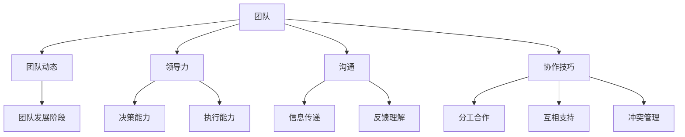
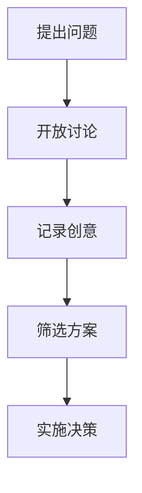
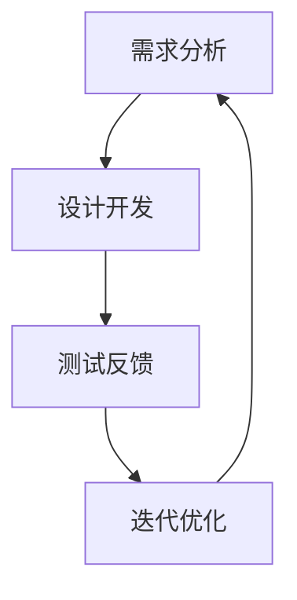
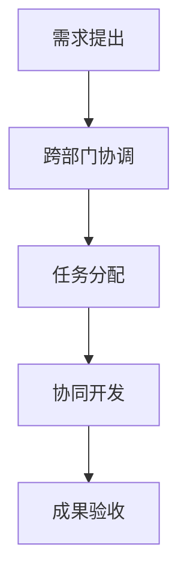
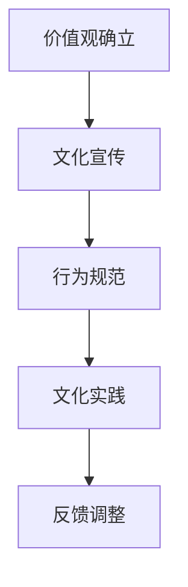

                 

## 文章标题：团队建设创新方法：突破传统团建的局限

关键词：团队建设、创新方法、传统局限、团队动态、领导力、协作技巧、文化塑造、敏捷开发、迭代反馈、伪代码

摘要：在当今快速变化的企业环境中，传统的团队建设方法已经无法满足组织对高效协作的需求。本文将深入探讨团队建设的核心概念与联系，分析传统团队建设方法的局限性，介绍各种创新团队建设方法，并通过伪代码和实际案例，详细讲解这些方法的核心算法原理和应用。文章最后将对创新方法在团队建设中的重要性进行总结，并展望未来的发展方向。

## 目录

1. 引言
2. 团队建设概述
   - 团队的定义与角色
   - 团队动态与团队发展
   - 领导力与沟通
   - 团队协作与协作技巧
3. 团队建设理论的演变
   - 传统团队建设方法
   - 创新团队建设方法
4. 核心概念与联系
   - Mermaid流程图展示
5. 创新团队建设方法介绍
   - 头脑风暴
   - 快速迭代
   - 跨部门合作
   - 文化塑造
6. 核心算法原理讲解
   - 头脑风暴算法
   - 快速迭代算法
   - 跨部门合作算法
   - 文化塑造算法
7. 案例分析
   - 案例一：头脑风暴在团队问题解决中的应用
   - 案例二：快速迭代提升团队效率
   - 案例三：跨部门合作实现项目目标
   - 案例四：企业文化塑造提升团队凝聚力
8. 总结与展望
   - 创新方法的重要性
   - 未来团队建设的趋势与挑战
9. 附录
   - 参考文献
   - 相关资源推荐

## 引言

在当今快速变化的市场环境中，企业面临的挑战越来越复杂，团队建设的重要性愈发凸显。传统的团队建设方法，如培训、团建活动等，虽然在某种程度上能够提升团队的凝聚力，但往往无法解决团队内部的协作效率问题。创新团队建设方法的出现，正是为了突破传统团建的局限，帮助企业实现更高效的团队协作。

本文将首先介绍团队建设的核心概念和理论，分析传统团队建设方法的局限性，然后详细探讨各种创新团队建设方法，包括头脑风暴、快速迭代、跨部门合作和文化塑造。通过伪代码和实际案例，我们将深入讲解这些方法的核心算法原理和应用。最后，文章将对创新方法在团队建设中的重要性进行总结，并展望未来的发展方向。

## 团队建设概述

### 团队的定义与角色

团队是由一群具备不同技能和背景的成员组成的，共同为实现某一目标而努力的群体。每个团队成员在团队中扮演着不同的角色，这些角色相互依赖，共同推动团队向前发展。团队成员的角色可以分为以下几类：

1. **领导者**：负责团队的规划、决策和执行，协调团队成员之间的关系。
2. **执行者**：承担具体任务的执行，将领导者的决策转化为实际成果。
3. **沟通者**：负责团队内部的沟通和协调，确保信息的畅通无阻。
4. **协作者**：与其他团队成员密切合作，共同完成任务。

### 团队动态与团队发展

团队动态是指团队在发展过程中所经历的阶段和变化。根据Tuckman的团队发展理论，团队通常会经历以下阶段：

1. **形成期**：团队成员开始了解彼此，建立初步的信任关系。
2. **激荡期**：团队成员开始提出各自的看法和意见，可能会出现冲突。
3. **规范期**：团队成员开始形成共识，团队内部的沟通和协作逐渐顺畅。
4. **执行期**：团队进入高效运作阶段，成员紧密合作，共同完成任务。
5. **休整期**：团队完成某一项目后，成员进行总结和反思，为下一阶段做好准备。

### 领导力与沟通

领导力在团队建设中起着至关重要的作用。领导者不仅需要具备决策能力和执行能力，还需要具备沟通能力和团队合作能力。有效的沟通是团队成功的关键因素之一。沟通能力包括信息的传递、反馈、理解等多个方面。

### 团队协作与协作技巧

团队协作是指团队成员在共同目标下，通过有效沟通和合作，实现整体效率的最大化。为了实现高效协作，团队成员需要掌握以下协作技巧：

1. **明确目标**：确保每个成员都清楚团队的目标和任务。
2. **分工合作**：根据成员的技能和特长，合理分配任务。
3. **互相支持**：在团队成员遇到困难时，提供帮助和支持。
4. **有效沟通**：确保信息在团队内部畅通无阻。
5. **冲突管理**：处理团队内部的分歧和冲突，保持团队的和谐。

## 团队建设理论的演变

### 传统团队建设方法

传统的团队建设方法主要侧重于增强团队的凝聚力，如团队建设活动、培训等。这些方法在一定程度上能够提升团队的协作效率，但往往无法解决团队内部的协作问题。

1. **团队建设活动**：通过户外拓展、团队游戏等活动，增强团队成员之间的信任和默契。
2. **培训**：提供各种培训课程，提升团队成员的专业技能和综合素质。

### 创新团队建设方法

创新团队建设方法强调团队协作效率的提升，注重团队成员之间的互动和合作。以下是一些常见的创新团队建设方法：

1. **头脑风暴**：通过集体讨论，激发团队成员的创造力，寻找创新解决方案。
2. **敏捷开发**：采用迭代和增量的方式，快速响应变化，提高团队交付价值的能力。
3. **跨部门合作**：打破部门壁垒，促进不同部门之间的协作，实现整体目标。
4. **文化塑造**：建立积极向上的企业文化，增强团队的凝聚力和归属感。

## 核心概念与联系

为了更好地理解团队建设中的核心概念，我们可以使用Mermaid流程图来展示这些概念之间的联系。以下是一个简化的团队建设概念联系图：



这个流程图展示了团队建设中的核心概念，以及它们之间的关系。团队是团队建设的核心，其他概念都与团队密切相关。团队动态描述了团队在发展过程中的变化，领导力、沟通和协作技巧是团队成功的关键要素。

## 创新团队建设方法介绍

### 头脑风暴

头脑风暴是一种激发团队创造力的方法，通过集体讨论，快速产生大量创意和解决方案。以下是一个简单的头脑风暴流程：



### 快速迭代

快速迭代是一种敏捷开发方法，通过短周期的迭代，不断改进和优化产品。以下是一个简单的快速迭代流程：



### 跨部门合作

跨部门合作是指不同部门之间的协作，通过打破部门壁垒，实现整体目标。以下是一个简单的跨部门合作流程：



### 文化塑造

文化塑造是指建立积极向上的企业文化，增强团队的凝聚力和归属感。以下是一个简单的文化塑造流程：



## 核心算法原理讲解

### 头脑风暴算法

头脑风暴算法的核心思想是激发团队成员的创造力，快速产生大量创意。以下是一个简化的伪代码：

```python
def brainstorming probl
```

### 快速迭代算法

快速迭代算法的核心思想是通过短周期的迭代，不断改进和优化产品。以下是一个简化的伪代码：

```python
def iterative_devlopment():
    while not finished:
        analyze_requirements()
        design_and_develop()
        test_and_gather_feedback()
        optimize()
```

### 跨部门合作算法

跨部门合作算法的核心思想是打破部门壁垒，实现协同开发。以下是一个简化的伪代码：

```python
def cross_department Collaboration():
    while project_not_finished:
        collect_requirements_from各部门
        assign_tasks_to各部门
        collaborate_on_task_execution
        review_project_progress
```

### 文化塑造算法

文化塑造算法的核心思想是建立积极向上的企业文化，增强团队的凝聚力和归属感。以下是一个简化的伪代码：

```python
def cultural_shaping():
    define_organizational_values()
    promote_cultural_awareness()
    establish_behavior_standards()
    encourage_cultural_practice()
    gather_feedback_and_adjust()
```

## 案例分析

### 案例一：头脑风暴在团队问题解决中的应用

某公司在项目开发过程中遇到了技术难题，团队决定通过头脑风暴来寻找解决方案。以下是头脑风暴的步骤和结果：

1. **提出问题**：项目开发过程中遇到的技术难题。
2. **开放讨论**：团队成员轮流发言，提出各自的看法和解决方案。
3. **记录创意**：将每个成员的创意记录下来，进行分类和筛选。
4. **筛选方案**：根据可行性、创新性和实际效果，筛选出最佳方案。
5. **实施决策**：选择最佳方案，进行实施和验证。

通过头脑风暴，团队最终找到了一个创新性的解决方案，成功解决了技术难题，项目得以顺利推进。

### 案例二：快速迭代提升团队效率

某创业公司采用快速迭代的方法进行产品开发，以下是一个简单的迭代周期：

1. **需求分析**：与客户沟通，了解客户需求。
2. **设计开发**：根据需求进行产品设计和开发。
3. **测试反馈**：对开发的产品进行测试，收集用户反馈。
4. **迭代优化**：根据用户反馈进行产品优化。

通过快速迭代，公司能够在短时间内交付高质量的产品，不断满足客户需求，提高团队效率。

### 案例三：跨部门合作实现项目目标

某公司在进行一项大型项目时，决定采用跨部门合作的方式。以下是跨部门合作的步骤：

1. **需求提出**：项目团队提出项目需求。
2. **跨部门协调**：与涉及到的各部门进行沟通，明确各自的职责和任务。
3. **任务分配**：将任务分配给各相关部门。
4. **协同开发**：各部门协同工作，共同完成项目任务。
5. **成果验收**：对项目成果进行验收，确保项目目标的实现。

通过跨部门合作，项目团队成功克服了部门壁垒，高效完成了项目任务。

### 案例四：企业文化塑造提升团队凝聚力

某公司注重企业文化建设，通过一系列活动提升团队凝聚力。以下是企业文化塑造的步骤：

1. **价值观确立**：明确公司的核心价值观。
2. **文化宣传**：通过内部培训和宣传，让员工了解和认同企业文化。
3. **行为规范**：制定公司行为规范，引导员工行为。
4. **文化实践**：组织员工参与企业文化活动，如团队建设、志愿者活动等。
5. **反馈调整**：收集员工反馈，不断优化企业文化。

通过企业文化建设，公司成功打造了积极向上的企业文化，增强了团队的凝聚力和归属感。

## 总结与展望

创新团队建设方法在提升团队协作效率和实现组织目标方面具有重要意义。通过头脑风暴、快速迭代、跨部门合作和文化塑造等方法，企业能够更好地应对市场变化，实现持续发展。

未来，团队建设方法将继续朝智能化、个性化和高效化的方向发展。人工智能技术的应用将帮助团队更好地进行协作和决策，个性化学

