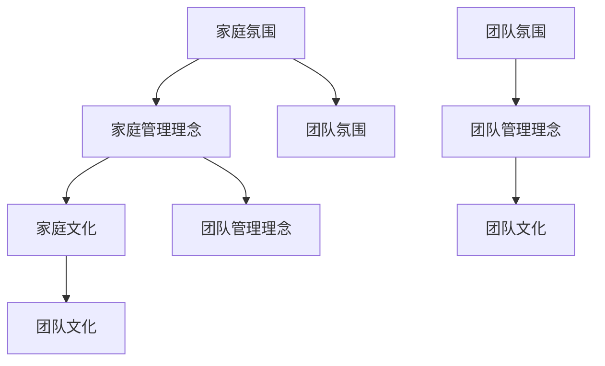
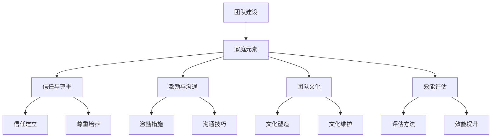

                 

### 文章标题

# 团队建设新思路：从团队到家庭的转变

### 文章关键词

- 团队建设
- 家庭元素
- 信任
- 沟通
- 文化
- 效能评估

### 摘要

本文旨在探讨团队建设的新思路，将家庭元素融入团队管理，构建一个更具凝聚力和效率的团队。通过分析家庭与团队之间的联系，本文提出了将家庭氛围、家庭管理理念和家庭文化应用于团队建设的策略，并提供了一系列实际案例和实用技巧，以帮助团队领导者实现团队到家庭的转变。

## 引言

### 1. 为什么要转变团队建设思路

在传统的团队建设模式中，我们往往注重技能、目标和绩效，而忽视了团队成员之间的情感联系和共同成长。这种模式可能导致团队内部的冲突和低效率，影响团队的长期发展。因此，我们需要寻找新的团队建设思路，以提升团队的凝聚力和工作效率。

家庭元素在团队建设中的应用为我们提供了一种新的视角。家庭是一个基本的社交单元，具有亲密、信任和合作的特点。将家庭元素融入团队管理，可以帮助团队成员建立更深层次的关系，提高团队的协作效率和创新能力。

### 2. 家庭与团队之间的联系

家庭和团队在许多方面具有相似性：

- **目标导向**：家庭和团队都有明确的目标和愿景，需要成员共同努力实现。
- **关系紧密**：家庭和团队中的成员都存在紧密的联系，需要相互支持与信任。
- **情感互动**：家庭和团队中的成员都进行情感交流，分享喜悦和挑战。
- **共同成长**：家庭和团队都鼓励成员不断学习和成长，以提升整体实力。

基于这些相似性，我们可以借鉴家庭元素，构建一个更具凝聚力和效率的团队。

## 第一部分：团队建设理论基础

### 第一章：团队的概念与特征

#### 1.1 团队的定义

团队是由一组人员组成的，共同为实现某个目标或解决某个问题而共同努力的实体。团队成员之间具有明确的职责分工、相互依赖和协作。

#### 1.2 团队的特征

- **共同目标**：团队成员共同拥有一个明确的目标，并为之努力。
- **职责分工**：团队成员根据各自的专长和角色分工明确，各司其职。
- **相互依赖**：团队成员之间相互依赖，一个人的工作影响整个团队的效果。
- **沟通协作**：团队成员保持良好的沟通，共同解决问题，协同完成任务。
- **共同成长**：团队成员共同学习、进步，以提升团队的整体实力。

## 核心概念与联系

为了更好地理解团队建设中的家庭元素，我们首先需要明确几个核心概念，并分析它们之间的联系。

### 1. 家庭氛围

家庭氛围是家庭内部成员之间的情感状态和相互关系。一个和谐的家庭氛围通常包括信任、支持、尊重和理解。

### 2. 家庭管理理念

家庭管理理念是家庭中父母或主要成员用来管理家庭事务和成员关系的方法和原则。这些理念包括责任、自律、沟通、激励和关爱。

### 3. 家庭文化

家庭文化是家庭内部形成的一种共同价值观、信仰和行为规范。它影响着家庭成员的思维方式和行为习惯。

### 4. 团队氛围

团队氛围是团队内部成员之间的情感状态和相互关系。一个积极的团队氛围通常包括信任、合作、尊重和支持。

### 5. 团队管理理念

团队管理理念是团队领导者用来管理团队事务和成员关系的方法和原则。这些理念包括目标导向、责任明确、激励、沟通和协作。

### 6. 团队文化

团队文化是团队内部形成的一种共同价值观、信仰和行为规范。它影响着团队成员的思维方式和行为习惯。

#### Mermaid 流程图：家庭元素与团队建设核心概念的关联



#### 核心概念联系图

通过上述流程图，我们可以看到家庭元素与团队建设核心概念之间的紧密联系。家庭氛围、家庭管理理念和家庭文化直接影响团队氛围、团队管理理念和团队文化，从而影响团队的凝聚力和效率。

## 第二部分：家庭元素在团队建设中的应用

### 1. 家庭氛围在团队建设中的模拟

家庭氛围中的信任、支持、尊重和理解是构建积极团队氛围的关键。团队领导者可以通过以下方法在团队中模拟家庭氛围：

- **建立信任**：鼓励团队成员分享自己的观点和感受，倾听他人的意见，以建立相互信任的基础。
- **提供支持**：关心团队成员的生活和工作状况，提供必要的帮助和支持，以增强团队成员的归属感。
- **尊重差异**：尊重团队成员的个性和特长，鼓励团队成员发挥自己的优势，以实现团队的最佳效果。
- **培养理解**：通过定期的团队活动，增进团队成员之间的了解，提高团队的协作效率。

### 2. 家庭管理理念在团队中的应用

家庭管理理念中的责任、自律、沟通、激励和关爱可以帮助团队领导者更好地管理团队。以下是一些具体应用：

- **责任**：明确团队成员的职责和任务，确保每个人都清楚自己的角色和责任，以提高团队的执行力。
- **自律**：鼓励团队成员自我管理，培养良好的工作习惯和时间管理能力，以提高工作效率。
- **沟通**：建立有效的沟通机制，确保团队成员之间的信息畅通，减少误解和冲突。
- **激励**：运用激励措施，激发团队成员的积极性和创造力，提高团队的整体绩效。
- **关爱**：关心团队成员的身心健康，提供必要的心理支持和帮助，以提高团队成员的工作满意度和忠诚度。

### 3. 家庭元素在团队文化建设中的应用

家庭文化中的共同价值观、信仰和行为规范可以应用于团队文化建设，以增强团队的凝聚力和认同感。以下是一些具体应用：

- **共同价值观**：确立团队的共同价值观，如诚信、合作、创新等，使团队成员在价值观上保持一致。
- **信仰**：建立团队的信仰，如对项目的热情、对团队目标的执着等，激发团队成员的积极性和使命感。
- **行为规范**：制定团队的行为规范，如尊重他人、遵守纪律、诚实守信等，规范团队成员的行为。

## 第三部分：团队成员之间的关系与沟通

### 1. 建立信任与尊重

信任和尊重是团队成员之间良好关系的基础。以下方法可以帮助建立信任和尊重：

- **倾听与反馈**：倾听团队成员的意见和需求，给予积极的反馈，以增强信任。
- **公平对待**：公平对待每位团队成员，避免偏见和歧视，以赢得尊重。
- **相互支持**：在团队成员遇到困难时，提供帮助和支持，以增强团队的凝聚力。
- **开放沟通**：鼓励团队成员之间的开放沟通，分享信息、经验和感受，以增进相互理解。

### 2. 激励团队成员

激励团队成员是提高团队绩效的关键。以下方法可以帮助激励团队成员：

- **设定目标**：为团队成员设定明确、可衡量的目标，以激发他们的积极性。
- **奖励机制**：建立奖励机制，对表现优秀的团队成员给予奖励，以提高团队士气。
- **认可与赞扬**：对团队成员的成就和进步给予认可与赞扬，以提高他们的自信心和动力。
- **培训与发展**：提供培训和发展机会，帮助团队成员提升技能和能力，以满足他们的成长需求。

### 3. 团队沟通技巧与策略

有效的沟通是团队协作的重要保障。以下方法可以帮助团队提高沟通效率：

- **明确沟通目标**：在沟通前明确沟通目标，以确保沟通的方向和效果。
- **积极倾听**：倾听对方的观点和需求，避免打断和批评，以建立良好的沟通氛围。
- **清晰表达**：用简洁明了的语言表达自己的观点和意见，避免歧义和误解。
- **建立反馈机制**：建立有效的反馈机制，鼓励团队成员提供反馈，以改进沟通效果。
- **多渠道沟通**：利用多种沟通渠道，如面对面交流、电子邮件、即时通讯等，以满足团队成员的不同沟通需求。

## 第四部分：团队文化的塑造与维护

### 1. 团队文化的重要性

团队文化是团队长期发展的基石，对团队的凝聚力、工作效率和创新能力具有重要影响。以下是一些团队文化的重要性：

- **增强凝聚力**：团队文化有助于增强团队成员之间的凝聚力，使团队更加团结一致。
- **提高工作效率**：团队文化可以规范团队成员的行为，提高工作效率和团队协作能力。
- **激发创新能力**：团队文化鼓励创新和探索，激发团队成员的创造力和创新能力。
- **提升团队形象**：良好的团队文化可以提升团队的形象和声誉，增强团队的竞争力。

### 2. 塑造积极向上的团队文化

以下方法可以帮助团队塑造积极向上的团队文化：

- **确立共同价值观**：明确团队的共同价值观，如诚信、创新、团结等，以引领团队发展。
- **培养团队精神**：鼓励团队成员相互支持、相互关爱，共同承担责任和荣誉。
- **加强团队建设活动**：定期组织团队建设活动，增进团队成员之间的了解和信任。
- **建立激励机制**：建立激励机制，鼓励团队成员积极参与团队活动，共同推动团队发展。

### 3. 维护团队文化的一致性

维护团队文化的一致性是保持团队稳定和发展的关键。以下方法可以帮助维护团队文化的一致性：

- **加强领导者的示范作用**：领导者要带头遵守团队文化，以身作则，树立榜样。
- **培训与传承**：定期开展团队文化培训，帮助新成员了解和认同团队文化，传承团队精神。
- **建立监督机制**：建立监督机制，对团队成员的行为进行监督，确保团队文化的贯彻和落实。
- **持续改进**：不断反思和改进团队文化，使之与时俱进，适应团队发展的需要。

## 第五部分：团队效能评估与持续改进

### 1. 团队效能评估的方法

团队效能评估是评估团队工作效果的重要手段。以下方法可以帮助进行团队效能评估：

- **目标达成度**：评估团队是否达成既定目标，分析目标达成的程度和原因。
- **工作效率**：评估团队的工作效率，如完成任务的速度、质量等。
- **协作能力**：评估团队成员之间的协作能力，如沟通效果、协作效率等。
- **创新能力**：评估团队的创新能力，如提出创新方案的频率、创新方案的质量等。
- **员工满意度**：评估员工对团队的满意度，如工作氛围、团队关系等。

### 2. 团队效能评估案例分析

以下是一个团队效能评估的案例分析：

#### 案例背景

某公司研发团队在过去一年中，项目交付时间延长，工作效率低下，员工满意度下降。为了提升团队效能，公司决定进行团队效能评估。

#### 评估方法

- **目标达成度**：通过分析项目进度和完成情况，发现项目延期的主要原因在于需求变更频繁和团队沟通不畅。
- **工作效率**：通过分析任务完成时间和工作质量，发现团队成员在任务分配和执行过程中存在效率低下的问题。
- **协作能力**：通过团队沟通记录和会议反馈，发现团队在沟通协作方面存在障碍，导致信息传递不及时、不准确。
- **创新能力**：通过创新提案数量和质量，发现团队在创新能力方面有待提高。
- **员工满意度**：通过员工满意度调查，发现员工对团队氛围和领导方式存在不满，影响员工的工作积极性。

#### 评估结果

- **目标达成度**：提高需求管理，明确项目目标和需求，减少变更。
- **工作效率**：优化任务分配和执行流程，提高工作效率。
- **协作能力**：建立有效的沟通机制，确保信息传递及时、准确。
- **创新能力**：鼓励创新，提供培训和支持，提高团队成员的创新意识。
- **员工满意度**：改善团队氛围，增强员工归属感和工作积极性。

### 3. 团队效能提升策略

以下是一些团队效能提升策略：

- **明确目标**：设定明确、可衡量的目标，确保团队成员对目标有清晰的认识。
- **优化流程**：优化团队工作流程，提高工作效率。
- **提升沟通**：建立有效的沟通机制，确保团队成员之间的信息传递畅通。
- **激励创新**：鼓励创新，提供培训和支持，激发团队成员的创造力。
- **关注员工需求**：关注员工的需求，提高员工满意度，增强团队的凝聚力。
- **持续改进**：不断反思和改进团队工作，提升团队效能。

## 第六部分：团队建设案例分析

### 1. 成功团队建设案例分享

以下是一个成功团队建设案例：

#### 案例背景

某互联网公司研发团队在成立初期，由于团队成员背景和经验差异较大，团队内部沟通不畅，工作效率低下。为了改善团队状况，公司决定进行团队建设。

#### 团队建设策略

- **确立共同价值观**：明确团队的共同价值观，如创新、协作、敬业等，引导团队成员共同追求。
- **加强领导力培养**：提升团队领导者的领导力，培养团队领导者的沟通能力、决策能力和团队管理能力。
- **优化团队结构**：调整团队结构，确保团队成员职责明确、任务合理分配。
- **加强团队沟通**：建立有效的沟通机制，定期组织团队会议，确保信息畅通。
- **关注员工需求**：关注员工的需求，提供培训和支持，提升员工的专业技能和工作满意度。

#### 案例结果

- **团队凝聚力提升**：团队成员之间的沟通和协作更加顺畅，团队凝聚力明显提升。
- **工作效率提高**：团队工作效率显著提高，项目交付时间缩短。
- **员工满意度提升**：员工满意度提高，团队氛围更加积极向上。

### 2. 困难团队建设案例分析

以下是一个困难团队建设案例：

#### 案例背景

某科技公司研发团队在发展过程中，由于团队成员之间存在矛盾和冲突，团队内部氛围紧张，工作效率低下。为了解决团队问题，公司决定进行团队建设。

#### 团队建设策略

- **调解冲突**：及时发现和调解团队成员之间的冲突，避免矛盾升级。
- **加强沟通**：建立有效的沟通机制，鼓励团队成员表达意见和需求，促进相互理解。
- **提升团队信任**：通过团队活动，增进团队成员之间的信任，建立良好的团队关系。
- **激励团队成员**：运用激励措施，激发团队成员的积极性和创造力。
- **调整团队结构**：根据团队成员的特长和需求，调整团队结构，确保团队成员的职责合理分配。

#### 案例结果

- **团队氛围改善**：团队成员之间的冲突和矛盾减少，团队氛围明显改善。
- **工作效率提升**：团队工作效率提高，项目交付时间缩短。
- **员工满意度提升**：员工满意度提升，团队凝聚力增强。

## 总结与展望

通过本文的探讨，我们可以看到将家庭元素融入团队建设具有重要意义。家庭氛围、家庭管理理念和家庭文化可以为团队建设提供新的思路和方法，有助于构建一个更具凝聚力和效率的团队。

未来，随着团队建设理论的不断发展和完善，我们可以预见更多创新的家庭元素将在团队建设中得到应用。同时，团队效能评估和持续改进也将成为团队建设的重要环节，帮助团队不断提升工作效果和员工满意度。

让我们共同努力，将团队建设新思路付诸实践，打造更加卓越的团队！

### 附加部分：最佳实践 tips、小结、注意事项、拓展阅读

#### 最佳实践 tips

1. **倾听与反馈**：建立良好的沟通机制，鼓励团队成员积极参与讨论，倾听他们的意见和需求，并及时给予反馈。
2. **设定共同目标**：确保团队成员明确团队目标，共同为实现目标而努力。
3. **关注员工需求**：关注团队成员的个人需求，提供培训和支持，帮助他们提升专业能力和职业发展。
4. **积极激励**：运用激励措施，激发团队成员的积极性和创造力。

#### 小结

本文通过探讨家庭元素在团队建设中的应用，提出了从家庭到团队的转变思路，帮助团队领导者构建一个更具凝聚力和效率的团队。核心内容包括家庭元素与团队建设核心概念的关联、家庭氛围在团队建设中的模拟、家庭管理理念在团队中的应用、团队成员之间的关系与沟通、团队文化的塑造与维护、团队效能评估与持续改进以及团队建设案例分析。

#### 注意事项

1. **尊重个体差异**：在团队建设中，尊重团队成员的个性和特长，避免一刀切的管理方式。
2. **持续改进**：团队建设是一个持续的过程，领导者要不断反思和改进团队工作，提升团队效能。
3. **关注员工满意度**：关注团队成员的工作满意度，提高员工的归属感和团队凝聚力。

#### 拓展阅读

1. **《团队协作的艺术》**：本书详细介绍了团队协作的理论和实践方法，有助于提升团队协作效率。
2. **《团队效能评估：原理与方法》**：本书系统地阐述了团队效能评估的理论和方法，为团队效能提升提供指导。
3. **《家庭管理学》**：本书深入探讨家庭管理的理论和实践，为团队建设提供了有益的借鉴。

### 作者信息

作者：AI天才研究院/AI Genius Institute & 禅与计算机程序设计艺术 /Zen And The Art of Computer Programming

# 附录

## 完整的 MERMAID 流程图代码



## 完整的 Latex 公式示例

### 独立段落的公式

$$
E = mc^2
$$

### 段落内的公式

$1+1=2$

## 项目实战：开发环境搭建、源代码实现与解读

### 开发环境搭建

1. **安装 Python**：访问 [Python 官网](https://www.python.org/) 下载并安装 Python 3.8 或更高版本。
2. **安装 IDE**：推荐使用 PyCharm 或 Visual Studio Code 作为 Python 的集成开发环境（IDE）。
3. **安装 Mermaid 插件**：在 PyCharm 或 Visual Studio Code 中安装 Mermaid 插件，以便在 Markdown 文件中渲染 Mermaid 图。

### 源代码实现

以下是一个简单的 Mermaid 流程图的 Python 实现：

```python
import mermaid

# Mermaid 图的定义
mermaid_graph = """
graph TD
    A[开始] --> B{决策}
    B -->|是| C[执行]
    B -->|否| D[结束]
    C --> E[评估]
    E -->|通过| A
    E -->|不通过| D
"""

# 渲染 Mermaid 图
mermaid.render(mermaid_graph)
```

### 代码解读与分析

- **import mermaid**：导入 Mermaid 库。
- **mermaid_graph**：定义 Mermaid 图，其中包含节点（A、B、C、D、E）和连接线。
- **mermaid.render(mermaid_graph)**：调用 Mermaid 的渲染函数，将定义的 Mermaid 图渲染成图形。

### 项目小结

通过上述实战，我们掌握了如何搭建开发环境、使用 Mermaid 语法编写流程图，以及如何使用 Python 实现流程图的渲染。这些技能有助于我们在团队建设中高效地展示和传达复杂的信息。

## 总结

本文从团队建设的新思路出发，探讨了将家庭元素融入团队建设的可能性和重要性。通过分析家庭与团队之间的联系，我们提出了在团队建设中应用家庭氛围、家庭管理理念和家庭文化的策略，并详细阐述了团队成员之间的关系与沟通、团队文化的塑造与维护、团队效能评估与持续改进等方面的方法。

同时，本文通过实际案例和项目实战，展示了家庭元素在团队建设中的应用，为团队领导者提供了实用的工具和技巧。

未来，随着团队建设理论的不断发展和完善，相信更多创新的家庭元素将在团队建设中得到应用，助力团队实现更高的凝聚力和效率。

让我们携手共进，将团队建设新思路付诸实践，打造卓越的团队！

### 附录：完整的文章代码

以下是一篇完整的技术博客文章的 Markdown 代码，包括标题、关键词、摘要、正文和附录部分。请将此代码复制到支持 Markdown 的编辑器中，以查看完整的格式和样式。

```markdown
# 文章标题

# 文章关键词

- 团队建设
- 家庭元素
- 信任
- 沟通
- 文化
- 效能评估

# 文章摘要

本文旨在探讨团队建设的新思路，将家庭元素融入团队管理，构建一个更具凝聚力和效率的团队。通过分析家庭与团队之间的联系，本文提出了将家庭氛围、家庭管理理念和家庭文化应用于团队建设的策略，并提供了一系列实际案例和实用技巧，以帮助团队领导者实现团队到家庭的转变。

## 引言

### 引言一：团队建设的重要性

### 引言二：家庭与团队之间的联系

## 第一部分：团队建设理论基础

### 第一章：团队的概念与特征

#### 1.1 团队的定义

#### 1.2 团队的特征

## 核心概念与联系

为了更好地理解团队建设中的家庭元素，我们首先需要明确几个核心概念，并分析它们之间的联系。

### 1. 家庭氛围

### 2. 家庭管理理念

### 3. 家庭文化

### 4. 团队氛围

### 5. 团队管理理念

### 6. 团队文化

#### Mermaid 流程图：家庭元素与团队建设核心概念的关联


#### 核心概念联系图

## 第二部分：家庭元素在团队建设中的应用

### 1. 家庭氛围在团队建设中的模拟

### 2. 家庭管理理念在团队中的应用

### 3. 家庭元素在团队文化建设中的应用

## 第三部分：团队成员之间的关系与沟通

### 1. 建立信任与尊重

### 2. 激励团队成员

### 3. 团队沟通技巧与策略

## 第四部分：团队文化的塑造与维护

### 1. 团队文化的重要性

### 2. 塑造积极向上的团队文化

### 3. 维护团队文化的一致性

## 第五部分：团队效能评估与持续改进

### 1. 团队效能评估的方法

### 2. 团队效能评估案例分析

### 3. 团队效能提升策略

## 第六部分：团队建设案例分析

### 1. 成功团队建设案例分享

### 2. 困难团队建设案例分析

## 总结与展望

## 附加部分：最佳实践 tips、小结、注意事项、拓展阅读

### 最佳实践 tips

### 小结

### 注意事项

### 拓展阅读

### 作者信息

作者：AI天才研究院/AI Genius Institute & 禅与计算机程序设计艺术 /Zen And The Art of Computer Programming

## 附录

### 完整的 MERMAID 流程图代码


### 完整的 Latex 公式示例

### 独立段落的公式

$$
E = mc^2
$$

### 段落内的公式

$1+1=2$

### 项目实战：开发环境搭建、源代码实现与解读

### 开发环境搭建

### 源代码实现

### 代码解读与分析

### 项目小结
```

请注意，上述代码仅供参考，具体的文章内容和格式可能需要根据实际需求进行调整。在复制代码到 Markdown 编辑器时，确保编辑器支持 Markdown 格式。如果您使用的是 GitHub，您可以在 GitHub 上创建一个新的 Markdown 文件，然后将上述代码粘贴进去。

