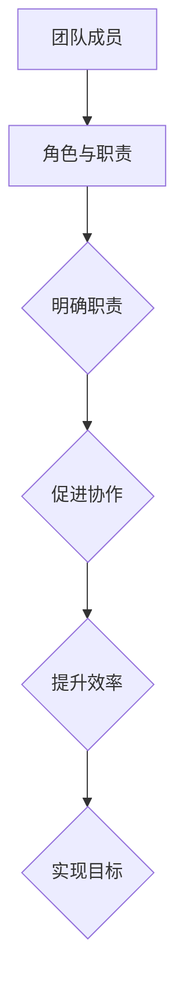
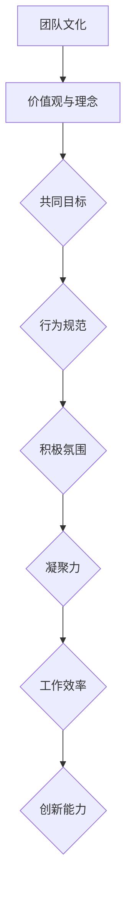
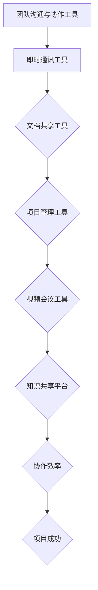

                 

### 引言

在现代企业和组织中，团队建设的重要性不容忽视。团队是组织完成目标的基本单位，其效能直接影响着企业的竞争力与发展速度。然而，在快速变化的市场环境中，团队建设面临着诸多挑战，如成员之间的陌生感、沟通不畅、目标不明确等。这些因素往往导致团队效率低下，甚至出现团队分裂的现象。

团队建设不仅仅是简单的成员组合，更是一个系统化的过程。它涉及到成员的角色定位、文化塑造、沟通与协作等多个方面。如何从陌生到默契，实现团队的高效协作，是每个领导者都需要思考的问题。

本文旨在探讨团队建设的核心思路和方法，通过系统化的分析和实践，帮助团队从陌生阶段走向高效协作的默契状态。我们将从背景介绍、核心概念与联系、方法与实践、案例分析以及总结与展望等多个方面，逐步展开讨论。

通过本文的阅读，读者可以了解到：

1. **团队建设的重要性**：明确团队建设对企业发展的关键作用。
2. **团队建设的挑战**：识别团队建设过程中常见的问题和难点。
3. **核心概念与联系**：理解团队建设中的关键要素及其相互关系。
4. **方法与实践**：掌握有效的团队建设策略和沟通协作技巧。
5. **案例分析**：通过实际案例学习团队建设的成功经验。
6. **总结与展望**：对团队建设的新思路进行总结，并对未来趋势进行展望。

### 团队建设的重要性

在当今复杂多变的市场环境中，团队建设的重要性愈发凸显。一个高效的团队不仅能够提高工作效率，还能促进创新和竞争力的提升。具体来说，团队建设对于企业有以下几方面的重要作用：

首先，团队建设能够提升工作效率。团队成员在共同的目标和明确的职责下，能够更好地协同工作，减少重复劳动和资源浪费。通过优化流程和分工，团队可以更快速地响应市场需求，提高项目的交付质量。

其次，团队建设有助于培养员工的协作精神和团队意识。在一个良好的团队氛围中，员工能够感受到归属感和责任感，更加愿意为团队的成功而努力。这种协作精神有助于形成积极向上的团队文化，增强企业的凝聚力。

再者，团队建设能够促进创新。在一个开放、包容的团队环境中，成员之间的沟通和交流更加频繁，有助于激发新的创意和点子。通过团队合作，可以集合不同领域的专业知识，形成跨学科的创新解决方案，提升企业的竞争力。

此外，团队建设对于员工个人成长也具有重要意义。通过团队项目，员工可以学习到更多的工作技能和知识，提升自己的职业素养。同时，团队中的反馈和指导也有助于员工及时发现和改进自己的不足，实现个人能力的提升。

总之，团队建设是企业发展不可或缺的一环。它不仅能够提高工作效率和创新能力，还能增强企业的竞争力，促进员工的个人成长。因此，企业领导者需要高度重视团队建设，采取有效的措施，推动团队从陌生阶段走向默契高效的状态。

### 团队建设的挑战

尽管团队建设具有诸多益处，但实际操作过程中也面临着诸多挑战。首先，团队成员的陌生感是一个常见问题。新成员进入团队时，往往需要一定时间来熟悉团队文化和工作流程，这期间可能因为不了解彼此的工作风格和期望，导致沟通不畅和合作效率低下。

其次，沟通不畅是团队建设中的另一大难题。团队成员在沟通时，可能会因为语言、文化背景、沟通技巧等因素的差异，导致误解和信息不对称。这种沟通障碍不仅会影响团队的协作效率，还可能引发团队成员之间的矛盾和不满。

此外，目标不明确也是团队建设的一大挑战。在一个团队中，如果没有清晰明确的目标，成员就可能感到迷茫，不知道自己的工作方向和努力的目标。这种目标不明确的情况，往往会导致团队资源浪费和工作效率低下。

还有，团队内部的管理和激励机制也需要考虑。如果团队缺乏有效的管理和激励机制，成员可能缺乏工作动力，导致团队凝聚力下降，工作效率降低。

最后，外部环境的变化也是团队建设中的一个重要挑战。市场环境、政策法规等外部因素的变化，可能会对团队的运作产生影响，需要团队及时调整策略和应对措施。

总的来说，团队建设过程中面临的挑战多种多样，需要领导者具备敏锐的洞察力和灵活的应变能力，采取有效的策略和措施，逐步克服这些障碍，推动团队发展。

### 核心概念与联系

要深入探讨团队建设，我们首先需要明确其中的核心概念，并分析它们之间的相互关系。这些核心概念包括团队成员的角色与职责、团队文化的塑造、团队沟通与协作工具等。下面我们将通过Mermaid流程图来展示这些概念及其关系。

#### 1.1.1 团队成员的角色与职责

团队成员的角色与职责是团队建设的基础。每个成员在团队中扮演不同的角色，承担不同的职责。以下是一个简单的Mermaid流程图，展示了团队成员角色与职责的关系：

- **明确职责**：通过明确每个成员的职责，可以确保团队成员的工作目标一致，避免职责重叠和空白，从而提高团队工作效率。
- **促进协作**：团队成员之间通过明确职责，可以更好地协同工作，促进信息共享和资源优化，提升整体协作效率。
- **提升效率**：明确职责和促进协作，有助于减少工作中的摩擦和误解，提高工作效率。
- **实现目标**：通过明确职责和高效协作，团队可以更加精准地实现既定目标。

#### 1.1.2 团队文化的塑造

团队文化的塑造是团队建设中的关键环节。一个积极的团队文化能够增强团队成员的归属感和凝聚力，提高团队的工作效率。以下是一个Mermaid流程图，展示了团队文化塑造的过程及其核心概念：

- **价值观与理念**：团队文化的基础在于共同的价值观和理念。这些共同的信念有助于团队成员形成一致的价值观和行为准则。
- **共同目标**：明确的共同目标是团队文化的核心。团队成员在共同目标的引领下，能够更好地协调行动，提高工作效率。
- **行为规范**：通过制定明确的行为规范，可以引导团队成员遵循一致的价值观和理念，形成积极的团队氛围。
- **积极氛围**：积极的工作氛围有助于提升团队成员的满意度和积极性，增强团队凝聚力。
- **凝聚力**：良好的团队文化能够增强团队成员之间的联系，提高团队的凝聚力。
- **工作效率**：团队凝聚力有助于提升团队成员的协作效率，减少冲突和误解，从而提高整体工作效率。
- **创新能力**：积极的团队文化能够鼓励创新思维和尝试新方法，提高团队的创新能力。

#### 1.1.3 团队沟通与协作工具

有效的沟通与协作是团队高效运作的重要保障。现代团队往往依赖于各种工具和技术来支持沟通与协作。以下是一个Mermaid流程图，展示了团队沟通与协作工具的关键概念及其关系：

- **即时通讯工具**：即时通讯工具如Slack、Telegram等，能够实时交流，提高信息传递速度和沟通效率。
- **文档共享工具**：如Google Drive、Dropbox等，能够方便团队成员共享文档，确保信息的一致性和更新速度。
- **项目管理工具**：如Trello、JIRA等，能够帮助团队管理和跟踪项目进度，确保项目按时交付。
- **视频会议工具**：如Zoom、Microsoft Teams等，能够支持远程团队成员进行面对面的交流和讨论，增强沟通效果。
- **知识共享平台**：如Confluence、Notion等，能够帮助团队成员共享知识和经验，提升团队的智慧和创新能力。
- **协作效率**：有效的沟通与协作工具能够提高团队成员之间的协作效率，减少沟通障碍和误解。
- **项目成功**：高效的协作和沟通有助于团队顺利完成项目，提高项目的成功率和客户满意度。

通过上述Mermaid流程图的展示，我们可以清晰地看到团队成员的角色与职责、团队文化的塑造以及团队沟通与协作工具之间的相互关系。这些核心概念和关系构成了团队建设的基础，为团队的高效运作提供了保障。

### 团队成员的角色与职责

在团队建设过程中，明确团队成员的角色与职责是至关重要的。这不仅是提高工作效率的基础，也是确保团队协作顺畅的重要保障。以下将详细探讨团队成员的角色与职责，以及如何合理分配这些角色和职责。

#### 2.1.1 团队成员的角色

团队成员的角色可以分为以下几类：

1. **领导者**：领导者是团队的核心，负责制定团队的目标、规划工作流程，以及协调成员之间的合作。领导者不仅要具备决策能力，还需要具备良好的沟通技巧和团队管理能力。

2. **技术专家**：技术专家是团队的技术支柱，负责解决项目中遇到的技术难题，为团队提供技术支持。技术专家通常具备丰富的专业知识，能够对项目的技术方向做出合理的判断。

3. **设计师**：设计师在团队中负责产品的视觉和用户体验设计，确保产品的美观性和用户友好性。设计师需要具备艺术感和用户心理学知识，能够根据用户需求设计出符合市场趋势的产品界面。

4. **开发人员**：开发人员是团队的执行者，负责将设计师和产品经理的需求转化为具体的代码和产品功能。开发人员需要具备编程技能，能够快速适应不同项目需求，确保项目按时交付。

5. **测试工程师**：测试工程师负责对项目进行质量检查，确保产品的稳定性和可靠性。测试工程师需要具备系统思维和逻辑分析能力，能够发现和修复潜在的问题。

6. **产品经理**：产品经理负责项目的整体规划和需求管理，确保项目能够满足市场和用户需求。产品经理需要具备市场洞察力和项目管理能力，能够协调不同团队成员的工作，确保项目按时上线。

#### 2.1.2 团队成员的职责

在明确团队成员的角色后，接下来是分配具体的职责。以下是对每个角色的具体职责描述：

1. **领导者**：负责制定团队的工作计划，分配任务，监督项目进度，以及解决团队内部的问题。领导者还需要定期与团队成员进行沟通，确保团队成员的工作方向一致，及时调整工作计划。

2. **技术专家**：负责解决项目中遇到的技术难题，为团队成员提供技术指导和支持。技术专家还需要参与技术评审，确保项目的技术方案和代码质量。

3. **设计师**：负责产品的界面设计、用户界面（UI）和用户体验（UX）设计。设计师需要与产品经理和开发人员紧密合作，确保设计能够被实现，并满足用户需求。

4. **开发人员**：负责实现设计和技术专家提供的技术方案，编写高质量的代码，并进行代码评审。开发人员还需要参与单元测试和集成测试，确保代码的稳定性和可靠性。

5. **测试工程师**：负责制定测试计划，执行测试用例，发现和报告问题。测试工程师还需要参与缺陷修复的验证，确保修复后的代码能够正常运行。

6. **产品经理**：负责收集用户需求，制定产品规格说明书，协调不同团队成员的工作。产品经理还需要跟踪项目进度，确保项目按时交付，并对市场反馈进行评估和调整。

#### 2.1.3 角色分配的原则

在分配团队成员的角色与职责时，应遵循以下原则：

1. **能力匹配**：确保团队成员的能力与其承担的角色和职责相匹配。技术专家应具备相应的技术能力，设计师应具备艺术感和用户心理学知识。

2. **职责明确**：明确每个角色的职责，避免职责重叠或空白。这样可以减少团队成员之间的误解和冲突，提高工作效率。

3. **动态调整**：团队角色和职责可能需要根据项目进展和团队需求进行动态调整。领导者应具备灵活的应变能力，根据实际情况调整团队成员的角色和职责。

4. **公平公正**：在分配角色和职责时，应确保公平公正，避免偏袒或歧视。这样可以增强团队成员的信任感和团队凝聚力。

通过明确团队成员的角色与职责，并遵循合理的分配原则，可以确保团队的高效运作，提升项目的成功率和团队的凝聚力。这是团队建设不可或缺的一环，需要领导者和团队成员共同努力。

### 团队文化的塑造

团队文化是团队内部共同的价值观、行为规范和理念的综合体现，它对团队的凝聚力和工作效率有着深远的影响。一个积极向上的团队文化能够增强团队成员的归属感和工作热情，从而促进团队的整体发展。以下将详细探讨团队文化的塑造过程，包括价值观与理念的建立、共同目标的设定、行为规范的制定以及积极氛围的营造。

#### 3.1.1 价值观与理念的建立

价值观与理念是团队文化的基石。一个团队要想建立起强大的文化，首先需要明确和传播其核心价值观和理念。以下步骤有助于建立团队的核心价值观与理念：

1. **确定核心价值观**：团队领导者需要与核心成员共同探讨并确定团队的核心价值观。这些价值观应反映团队的目标、使命和愿景，并具备普遍性和指导性。例如，诚信、创新、客户至上、团队合作等。

2. **宣传和传播**：通过团队会议、内部培训、企业文化建设活动等多种途径，向全体团队成员宣传和传播核心价值观和理念。确保每位成员都深入了解并认同这些价值观和理念。

3. **实践和践行**：在团队工作中，领导者应以身作则，积极践行核心价值观和理念。通过实际行动示范，树立良好的榜样，引导团队成员共同遵循和践行。

#### 3.1.2 共同目标的设定

共同目标是团队团结一致、齐心协力的重要动力。设定明确、具体且可行的共同目标，有助于激发团队成员的积极性和创造力。以下步骤有助于设定共同目标：

1. **明确目标**：团队领导者应与团队成员共同讨论并明确团队的目标。目标应具有明确的方向和量化指标，以便团队成员了解自己的工作方向和努力目标。

2. **分解目标**：将共同目标分解为具体的任务和里程碑，确保每个成员都有明确的任务和责任。通过分解目标，可以更好地管理项目进度和资源分配。

3. **定期回顾**：定期组织团队会议，回顾目标完成情况，评估团队成员的表现，并根据实际情况调整目标和策略。这有助于确保团队目标的实现和及时调整方向。

#### 3.1.3 行为规范的制定

行为规范是团队文化的重要组成部分，它规范了团队成员在工作和日常交往中的行为准则。制定合理的行为规范，有助于营造一个公平、和谐的工作环境。以下步骤有助于制定行为规范：

1. **收集建议**：通过内部调查、访谈等方式，收集团队成员对行为规范的建议和意见。这有助于确保行为规范能够反映团队成员的实际需求和期望。

2. **明确规范**：根据收集到的建议，明确和制定具体的行动规范。这些规范应涵盖工作态度、团队合作、沟通方式、职业素养等多个方面。

3. **公示和培训**：将行为规范进行公示，确保每位成员都了解并遵守。同时，通过内部培训，强化团队成员对行为规范的认识和执行。

#### 3.1.4 积极氛围的营造

积极氛围是团队文化的核心要素，它能够激发团队成员的工作热情和创新能力。以下措施有助于营造积极的工作氛围：

1. **鼓励表扬**：定期对团队成员的出色表现进行表扬和奖励，激励团队成员保持积极的工作态度。通过表彰优秀员工，可以树立榜样，激发其他成员的积极性。

2. **开放沟通**：建立一个开放、坦诚的沟通环境，鼓励团队成员表达自己的想法和意见。通过开放沟通，可以增强团队成员之间的信任和理解，减少误解和冲突。

3. **团队活动**：组织各类团队活动，如团队建设培训、团建活动等，增强团队成员之间的互动和合作。团队活动不仅能够缓解工作压力，还能增强团队的凝聚力。

4. **激励与支持**：为团队成员提供必要的支持和资源，鼓励他们不断学习和成长。通过职业发展计划、培训机会等，帮助团队成员实现个人和团队的共同发展。

通过以上步骤，团队可以逐步塑造出积极向上的文化氛围，增强团队成员的归属感和凝聚力，提高团队的整体工作效率和创新能力。团队文化不仅仅是团队建设的工具，更是团队持续发展的动力源泉。

### 团队沟通与协作工具

在团队建设过程中，有效的沟通与协作是确保项目顺利进行的关键。随着团队成员可能分布在不同的地理位置，使用合适的工具来支持沟通与协作变得尤为重要。以下将详细介绍几种常见的团队沟通与协作工具，包括即时通讯工具、文档共享工具、项目管理工具、视频会议工具和知识共享平台，并探讨如何选择和合理应用这些工具。

#### 4.1 即时通讯工具

即时通讯工具如Slack、Telegram等，是团队内部实时沟通和协作的常用工具。这些工具提供了文字、图片、文件传输以及语音和视频通话等功能，支持团队成员之间的即时交流。

1. **Slack**：Slack具有强大的消息传递功能，可以创建多个工作群组，每个群组又可以细分为不同的子频道，方便团队成员围绕特定项目或话题进行讨论。Slack还支持集成第三方服务，如GitHub、Google Drive等，使得团队成员可以方便地共享和同步文件。

2. **Telegram**：Telegram提供了一个简单但功能强大的即时通讯平台，支持发送文本、图片、视频和音频消息，还提供了群组和频道功能，适合大型团队和社区管理。

**选择与使用建议**：选择即时通讯工具时，应考虑团队规模、通信频率和功能需求。对于小型团队，Slack的丰富功能和集成服务可能更为适合；而对于需要大规模沟通和管理的团队，Telegram的群组功能可能更为实用。

#### 4.2 文档共享工具

文档共享工具如Google Drive、Dropbox等，能够帮助团队成员方便地共享和编辑文档，确保信息的实时更新和一致性。

1. **Google Drive**：Google Drive提供了强大的文档编辑功能，支持多人实时协作，团队成员可以在同一个文档中进行编辑，并实时看到他人的修改。此外，Google Drive还提供了版本控制功能，方便团队成员追踪文档的历史版本。

2. **Dropbox**：Dropbox是一个经典的文档共享和同步工具，支持将文件同步到云端，确保团队成员在任何设备上都能访问最新的文档。Dropbox还提供了共享文件夹功能，方便团队成员共享和协作。

**选择与使用建议**：选择文档共享工具时，应考虑团队的文件管理和同步需求。对于需要实时协作和版本控制的团队，Google Drive可能是更佳选择；而对于只需要文件同步的团队，Dropbox则可能更为适合。

#### 4.3 项目管理工具

项目管理工具如Trello、JIRA等，能够帮助团队高效地管理项目进度、任务分配和协作。

1. **Trello**：Trello提供了一个直观的看板界面，通过卡片和列表，团队可以清晰地追踪项目的各个阶段。Trello支持添加任务描述、截止日期、成员和标签，方便团队成员了解任务状态和责任。

2. **JIRA**：JIRA是一个功能强大的项目管理工具，支持敏捷开发方法，提供了任务追踪、问题报告、迭代计划和代码库集成等功能。JIRA能够帮助团队更好地管理软件开发项目，确保项目按时交付。

**选择与使用建议**：选择项目管理工具时，应考虑团队的项目管理和开发方法。对于使用敏捷开发的团队，JIRA可能更为适合；而对于需要简单任务管理的团队，Trello的直观界面可能更为实用。

#### 4.4 视频会议工具

视频会议工具如Zoom、Microsoft Teams等，能够支持远程团队成员进行面对面的交流和讨论，增强沟通效果。

1. **Zoom**：Zoom提供了一个稳定且功能丰富的视频会议平台，支持高清视频、语音和文字聊天，还提供了屏幕共享和会议录制等功能，适合远程团队进行高效的沟通和协作。

2. **Microsoft Teams**：Microsoft Teams集成了视频会议、即时通讯、文档共享和项目管理功能，支持与企业其他服务的集成，如Outlook、OneDrive等，适合大型企业和跨部门协作。

**选择与使用建议**：选择视频会议工具时，应考虑团队的会议频率和功能需求。对于需要频繁视频会议的团队，Zoom的高清视频和会议功能可能更为适合；而对于需要集成多种办公工具的团队，Microsoft Teams可能更为实用。

#### 4.5 知识共享平台

知识共享平台如Confluence、Notion等，能够帮助团队成员共享和获取知识，提升团队的整体智慧。

1. **Confluence**：Confluence提供了一个强大的团队协作和知识管理平台，支持创建、存储和共享各种类型的文档和知识库。Confluence还提供了丰富的模板和插件，方便团队成员快速创建和维护知识库。

2. **Notion**：Notion是一个灵活的团队协作工具，支持创建笔记、数据库、看板和日程等多种内容形式，方便团队成员管理和共享知识。

**选择与使用建议**：选择知识共享平台时，应考虑团队的知识管理需求和协作方式。对于需要集中管理和共享知识库的团队，Confluence可能更为适合；而对于需要灵活管理和协作的团队，Notion的多样化功能可能更为实用。

通过合理选择和应用上述团队沟通与协作工具，团队可以显著提高工作效率和协作效果，从而更好地实现项目目标。在实际应用中，团队应根据自身需求，灵活选择和配置这些工具，以最大化其效能。

### 团队沟通技巧

在团队建设中，沟通技巧的掌握至关重要。良好的沟通不仅能够减少误解和冲突，还能提高团队的工作效率，促进团队目标的实现。以下将探讨团队沟通中的障碍、有效沟通的技巧以及团队会议的技巧。

#### 5.1 沟通障碍

团队沟通中的障碍多种多样，主要包括以下几种：

1. **语言障碍**：团队成员来自不同的国家和地区，可能使用不同的语言或方言，这会导致沟通上的困难。例如，对于英语不是母语的成员，理解复杂的术语或表达可能存在障碍。

2. **文化差异**：不同文化背景的团队成员在沟通时，可能会因为价值观、行为习惯和沟通风格的不同，产生误解或冲突。例如，某些文化倾向于直接表达意见，而另一些文化则更注重委婉和间接。

3. **信息过载**：在团队中，信息传递的速度和数量都很大，如果团队成员无法有效地筛选和处理这些信息，就会导致信息过载，影响沟通效率。

4. **心理障碍**：团队成员可能因为心理压力、紧张或焦虑等心理问题，导致沟通不顺畅。例如，一些成员可能因为害怕犯错而保持沉默，或者因为对某位成员的偏见而忽视其意见。

#### 5.2 有效沟通的技巧

为了克服沟通障碍，提高团队沟通的效果，团队成员可以采取以下技巧：

1. **清晰表达**：在沟通时，应尽量使用简单、明确的语言，避免使用过于复杂的术语或表达。确保信息传递的准确性和易懂性。

2. **倾听**：倾听是有效沟通的关键。在对方发言时，要全神贯注地倾听，不要打断对方，也不要急于表达自己的意见。通过积极的倾听，可以更好地理解对方的需求和意图。

3. **提问与反馈**：在沟通过程中，可以通过提问来澄清信息或获取更多信息。同时，提供反馈可以帮助确认信息传达的正确性，并及时纠正误解。

4. **确认理解**：在沟通过程中，可以要求对方确认对信息的理解，确保双方对信息的解读一致。例如，可以询问：“你明白我的意思吗？”

5. **情感共鸣**：在处理冲突或敏感问题时，可以通过表达同理心来建立情感共鸣，减少对方的抵触情绪。例如，可以说：“我理解你的感受，我们一起解决这个问题。”

6. **非语言沟通**：非语言沟通，如肢体语言、面部表情和语调等，也是沟通的重要组成部分。使用积极的非语言信号，如微笑、点头等，可以增强沟通的效果。

#### 5.3 团队会议的技巧

团队会议是团队沟通的重要形式，有效的团队会议能够提高决策效率，增强团队成员之间的信任和协作。以下是一些团队会议的技巧：

1. **明确会议目标**：在召开会议之前，应明确会议的目标和议程，确保所有与会者都了解会议的内容和目的。通过提前准备，可以减少会议的时间和内容冗长。

2. **提前分发材料**：在会议前，应将会议所需的相关材料提前发给与会者，让他们有充足的时间阅读和准备。这有助于提高会议的效率和参与度。

3. **控制会议时间**：会议时间应控制在合理范围内，避免长时间、内容繁杂的会议。可以通过设定时间限制、安排讨论环节等方式，确保会议在预定时间内完成。

4. **促进互动**：在会议中，应鼓励团队成员积极参与讨论，提出意见和建议。通过互动，可以激发团队的创造力和创新思维。

5. **记录和跟进**：会议结束后，应记录会议的主要内容和决议，并跟进任务的执行情况。这有助于确保会议结果的有效落实和团队成员的职责明确。

通过掌握上述沟通技巧和团队会议技巧，团队成员可以更好地克服沟通障碍，提高沟通效率，促进团队目标的实现。

### 团队协作工具

在团队建设过程中，合理选择和使用团队协作工具是提高工作效率和协作效果的关键。以下将详细介绍几种常见的团队协作工具，并探讨如何选择和合理应用这些工具。

#### 6.1 即时通讯工具

即时通讯工具如Slack、Telegram等，是团队内部实时沟通和协作的常用工具。这些工具提供了文字、图片、文件传输以及语音和视频通话等功能，支持团队成员之间的即时交流。

1. **Slack**：Slack具有强大的消息传递功能，可以创建多个工作群组，每个群组又可以细分为不同的子频道，方便团队成员围绕特定项目或话题进行讨论。Slack还支持集成第三方服务，如GitHub、Google Drive等，使得团队成员可以方便地共享和同步文件。

2. **Telegram**：Telegram提供了一个简单但功能强大的即时通讯平台，支持发送文本、图片、视频和音频消息，还提供了群组和频道功能，适合大型团队和社区管理。

**选择与使用建议**：选择即时通讯工具时，应考虑团队规模、通信频率和功能需求。对于小型团队，Slack的丰富功能和集成服务可能更为适合；而对于需要大规模沟通和管理的团队，Telegram的群组功能可能更为实用。

#### 6.2 文档共享工具

文档共享工具如Google Drive、Dropbox等，能够帮助团队成员方便地共享和编辑文档，确保信息的实时更新和一致性。

1. **Google Drive**：Google Drive提供了强大的文档编辑功能，支持多人实时协作，团队成员可以在同一个文档中进行编辑，并实时看到他人的修改。此外，Google Drive还提供了版本控制功能，方便团队成员追踪文档的历史版本。

2. **Dropbox**：Dropbox是一个经典的文档共享和同步工具，支持将文件同步到云端，确保团队成员在任何设备上都能访问最新的文档。Dropbox还提供了共享文件夹功能，方便团队成员共享和协作。

**选择与使用建议**：选择文档共享工具时，应考虑团队的文件管理和同步需求。对于需要实时协作和版本控制的团队，Google Drive可能是更佳选择；而对于只需要文件同步的团队，Dropbox则可能更为适合。

#### 6.3 项目管理工具

项目管理工具如Trello、JIRA等，能够帮助团队高效地管理项目进度、任务分配和协作。

1. **Trello**：Trello提供了一个直观的看板界面，通过卡片和列表，团队可以清晰地追踪项目的各个阶段。Trello支持添加任务描述、截止日期、成员和标签，方便团队成员了解任务状态和责任。

2. **JIRA**：JIRA是一个功能强大的项目管理工具，支持敏捷开发方法，提供了任务追踪、问题报告、迭代计划和代码库集成等功能。JIRA能够帮助团队更好地管理软件开发项目，确保项目按时交付。

**选择与使用建议**：选择项目管理工具时，应考虑团队的项目管理和开发方法。对于使用敏捷开发的团队，JIRA可能更为适合；而对于需要简单任务管理的团队，Trello的直观界面可能更为实用。

#### 6.4 视频会议工具

视频会议工具如Zoom、Microsoft Teams等，能够支持远程团队成员进行面对面的交流和讨论，增强沟通效果。

1. **Zoom**：Zoom提供了一个稳定且功能丰富的视频会议平台，支持高清视频、语音和文字聊天，还提供了屏幕共享和会议录制等功能，适合远程团队进行高效的沟通和协作。

2. **Microsoft Teams**：Microsoft Teams集成了视频会议、即时通讯、文档共享和项目管理功能，支持与企业其他服务的集成，如Outlook、OneDrive等，适合大型企业和跨部门协作。

**选择与使用建议**：选择视频会议工具时，应考虑团队的会议频率和功能需求。对于需要频繁视频会议的团队，Zoom的高清视频和会议功能可能更为适合；而对于需要集成多种办公工具的团队，Microsoft Teams可能更为实用。

#### 6.5 知识共享平台

知识共享平台如Confluence、Notion等，能够帮助团队成员共享和获取知识，提升团队的整体智慧。

1. **Confluence**：Confluence提供了一个强大的团队协作和知识管理平台，支持创建、存储和共享各种类型的文档和知识库。Confluence还提供了丰富的模板和插件，方便团队成员快速创建和维护知识库。

2. **Notion**：Notion是一个灵活的团队协作工具，支持创建笔记、数据库、看板和日程等多种内容形式，方便团队成员管理和共享知识。

**选择与使用建议**：选择知识共享平台时，应考虑团队的知识管理需求和协作方式。对于需要集中管理和共享知识库的团队，Confluence可能更为适合；而对于需要灵活管理和协作的团队，Notion的多样化功能可能更为实用。

通过合理选择和应用上述团队协作工具，团队可以显著提高工作效率和协作效果，从而更好地实现项目目标。在实际应用中，团队应根据自身需求，灵活选择和配置这些工具，以最大化其效能。

### 案例一：某公司的团队建设实践

某公司是一家快速成长的科技公司，拥有多元化的团队成员，分布在不同的城市和时区。在公司发展的过程中，团队建设成为提升企业竞争力的重要课题。以下是该公司在团队建设方面的实践及其效果评估。

#### 6.1 案例背景

该公司成立于五年前，初始团队由五名核心成员组成。随着业务的拓展和项目的增多，团队规模迅速扩大，目前有超过50名成员，包括开发人员、产品经理、设计师、测试工程师等。团队成员来自不同的国家和地区，拥有多样化的技能和背景。然而，由于团队成员分布在不同城市，沟通和协作成为一大挑战。

#### 6.2 团队建设策略与实施

为了解决团队协作中的问题，公司采取了一系列团队建设策略，主要包括以下几个方面：

1. **明确团队目标与职责**：公司明确了团队的目标和每个人的职责，确保团队成员对团队目标和自己的职责有清晰的认识。通过定期的团队会议和培训，强化团队成员的责任意识和协作精神。

2. **建立团队文化**：公司积极塑造开放、包容、创新的团队文化。通过团队活动、内部培训和文化宣传，引导团队成员遵循共同的价值观和理念，增强团队的凝聚力。

3. **优化沟通与协作工具**：公司引入了Slack、Google Drive、Trello和Zoom等团队协作工具，提高团队成员之间的沟通效率和协作效果。Slack用于日常沟通，Google Drive用于文档共享和协作，Trello用于项目管理，Zoom用于远程视频会议。

4. **定期团队反馈与评估**：公司建立了定期的团队反馈与评估机制，通过问卷调查、一对一访谈等方式，收集团队成员的反馈和建议，及时调整团队建设策略。

#### 6.3 案例效果评估

通过实施上述团队建设策略，该公司在团队协作和项目效率方面取得了显著成效：

1. **沟通效率提高**：引入Slack和Zoom等即时通讯和视频会议工具，使得团队成员可以随时沟通和协作，沟通效率显著提高。

2. **协作效果提升**：使用Trello进行项目管理，团队成员可以清晰地了解项目进度和任务分配，协作效果得到提升。通过Google Drive共享文档，团队成员可以实时编辑和更新文档，确保信息的一致性和实时性。

3. **团队凝聚力增强**：定期的团队活动和反馈机制，增强了团队成员之间的交流和信任，团队的凝聚力显著提高。

4. **项目成功率提升**：通过优化团队建设和协作工具，项目的交付质量和成功率得到了显著提升。公司的产品迭代周期缩短，客户满意度提高，业务增长明显。

#### 6.4 案例启示

该公司的团队建设实践为其他企业提供了以下启示：

1. **明确团队目标与职责**：确保团队成员对团队目标和职责有清晰的认识，是提高团队效率的基础。

2. **优化沟通与协作工具**：合理选择和使用团队协作工具，能够显著提高沟通效率和协作效果。

3. **建立积极团队文化**：通过团队活动和反馈机制，营造开放、包容的团队氛围，增强团队凝聚力。

4. **定期评估与反馈**：定期收集团队成员的反馈，及时调整团队建设策略，确保团队持续发展。

通过这个案例，我们可以看到，有效的团队建设策略能够显著提升团队协作效率和企业竞争力。企业领导者应高度重视团队建设，采取切实有效的措施，推动团队不断发展和进步。

### 案例二：某团队的协作与成长

某创业公司在短短五年内迅速发展，从一个小型初创企业成长为行业内的佼佼者。其成功背后，离不开高效的团队协作和持续的团队成长。以下将详细介绍该团队的协作过程、协作工具的应用，以及团队成长的蜕变过程。

#### 7.1 案例背景

该创业公司成立于五年前，初始团队由五位充满激情和创造力的年轻人组成。他们致力于开发一款创新的移动应用，解决用户在日常生活中遇到的问题。随着公司业务的拓展，团队规模逐渐扩大，目前拥有超过30名成员，包括开发人员、产品经理、设计师、市场专员等。团队成员分布在不同的城市，如何高效协作成为公司发展的关键问题。

#### 7.2 团队协作过程

为了实现高效协作，该团队采取了以下步骤：

1. **明确目标与分工**：团队首先明确了共同的目标，即打造一款用户喜爱的移动应用。接着，根据团队成员的特长和兴趣，进行了合理的分工。开发人员专注于代码编写和功能实现，产品经理负责需求分析和项目规划，设计师负责用户界面和用户体验设计，市场专员负责市场推广和用户反馈收集。

2. **定期团队会议**：团队每周举行一次周会，回顾上周的工作进展，讨论存在的问题和解决方案。每月举行一次月度会议，总结项目进度，制定下个月的工作计划。通过定期会议，团队成员能够及时沟通，协调工作，确保项目按计划推进。

3. **利用协作工具**：团队采用了多种协作工具，包括Slack、Trello和Google Drive。Slack用于日常沟通和即时交流，团队成员可以随时发布任务更新、分享想法和讨论问题。Trello用于项目管理，团队将项目分解为多个任务，每个任务分配给具体的成员，并通过看板界面实时跟踪进度。Google Drive则用于文档共享和协作，团队成员可以共同编辑文档，确保信息的实时更新和一致性。

#### 7.3 协作工具的应用

在团队协作过程中，协作工具的应用起到了至关重要的作用：

1. **Slack**：Slack是团队的核心沟通工具。通过创建不同的聊天频道，团队成员可以根据项目需求进行分组讨论。例如，开发人员有一个专门的频道用于技术讨论，产品经理和设计师有各自的频道讨论需求和设计细节。Slack还支持消息提醒和任务分配功能，确保任务能够及时跟进和完成。

2. **Trello**：Trello帮助团队清晰地管理项目进度和任务分配。每个项目被分解为多个任务，每个任务都有明确的截止日期和负责人。团队成员可以在Trello上查看任务的完成情况，及时调整工作计划。此外，Trello还提供了自定义标签和过滤器功能，方便团队成员快速查找和整理信息。

3. **Google Drive**：Google Drive用于文档共享和协作。团队成员可以共同编辑文档，实时更新内容。通过共享文件夹，团队可以轻松共享重要文件和资料，确保信息的一致性和安全性。Google Drive的版本控制功能也方便团队成员追踪文档的历史版本，避免信息丢失或误操作。

#### 7.4 团队成长的蜕变过程

通过高效的协作工具和团队管理策略，该团队经历了从陌生到默契的蜕变过程：

1. **初期磨合**：在团队成立初期，成员之间相对陌生，沟通和协作存在一定障碍。通过定期的团队会议和协作工具的应用，团队成员逐渐熟悉了彼此的工作风格和职责，沟通效率逐步提高。

2. **流程优化**：随着项目的推进，团队不断总结和优化工作流程。通过Trello和Slack，团队成员能够及时反馈问题和建议，团队领导者根据反馈调整工作流程和策略，使得团队协作更加顺畅。

3. **技能提升**：团队成员在共同的工作中不断提升自己的技能和知识。开发人员掌握了更多前沿技术，产品经理和设计师更加了解用户需求和市场趋势。通过内部培训和外部学习，团队成员的综合素质不断提高。

4. **团队文化形成**：在长期的合作中，团队形成了一种积极、开放、包容的文化氛围。团队成员之间建立了深厚的信任和默契，愿意为团队的成功而努力。团队凝聚力显著增强，工作效率和创新能力得到提升。

#### 7.5 团队成长的启示

该团队的协作与成长为其他企业提供了以下启示：

1. **明确目标与分工**：团队的目标和分工是协作的基础，有助于团队成员明确自己的工作方向和责任。

2. **利用协作工具**：合理的协作工具能够提高沟通效率和协作效果，减少信息传递的障碍。

3. **持续优化流程**：团队应不断总结和优化工作流程，确保工作的高效和有序。

4. **重视团队文化**：积极、开放、包容的团队文化有助于增强团队的凝聚力，促进团队成员的共同成长。

通过这个案例，我们可以看到，高效的团队协作和持续的团队成长是企业发展的重要推动力。企业领导者应高度重视团队建设，采取切实有效的措施，推动团队不断发展和进步。

### 总结与展望

通过对团队建设新思路的深入探讨，我们可以看到，团队建设不仅仅是成员的组合，更是一个系统化的过程，涉及到成员的角色与职责、团队文化的塑造、团队沟通与协作工具的应用等多个方面。有效的团队建设能够提升工作效率、促进创新、增强团队凝聚力，从而显著提升企业的竞争力。

首先，明确团队成员的角色与职责是团队建设的基础。通过合理分配角色和明确职责，可以确保团队成员的工作目标一致，避免职责重叠和空白，从而提高工作效率。同时，领导者应关注团队成员的能力匹配，确保每位成员都能在其擅长的领域发挥最大的作用。

其次，团队文化的塑造对于团队建设至关重要。积极向上的团队文化能够增强团队成员的归属感和工作热情，提高团队的凝聚力。领导者应通过建立共同的价值观和理念、设定明确的共同目标、制定合理的行为规范以及营造积极的工作氛围，逐步塑造出健康的团队文化。

此外，团队沟通与协作工具的应用也是团队建设的关键。选择合适的沟通与协作工具，如即时通讯工具、文档共享工具、项目管理工具、视频会议工具和知识共享平台，能够显著提高团队的工作效率和协作效果。团队领导者应重视工具的选择和配置，确保工具能够满足团队的实际需求。

未来，团队建设将面临新的挑战和机遇。随着技术的不断进步，人工智能和大数据等新兴技术将在团队建设中发挥更大的作用。例如，通过人工智能技术，可以更准确地预测团队成员的工作需求和优化团队结构。大数据分析可以帮助团队更有效地管理项目进度和资源分配。

此外，远程办公和全球化团队的趋势也将对团队建设提出新的要求。领导者需要考虑如何保持远程团队成员之间的紧密联系和高效协作，通过技术手段和灵活的管理策略，解决地理位置带来的沟通障碍和协作难题。

总之，团队建设是一个持续的过程，需要领导者和团队成员的共同努力。通过不断优化团队建设策略，提升团队成员的技能和素养，构建积极向上的团队文化，企业可以不断增强自身的竞争力，迎接未来的挑战。展望未来，我们相信，团队建设将迎来更加智能化、协作化的新时代。

### 作者信息

**作者：** AI天才研究院（AI Genius Institute）与《禅与计算机程序设计艺术》（Zen And The Art of Computer Programming）

AI天才研究院致力于推动人工智能技术的发展和应用，通过前沿的研究和创新的实践，助力各行各业实现智能化升级。同时，我们注重培养具有创新精神和实践能力的人工智能人才，为未来科技发展贡献智慧和力量。

《禅与计算机程序设计艺术》由知名计算机科学家Donald E. Knuth撰写，是一本经典的计算机科学读物。本书通过深入探讨编程哲学和程序设计技巧，引导读者掌握高效编程的方法和艺术。书中所倡导的“渐近式设计”和“分而治之”等思想，至今仍对计算机科学和软件工程领域产生深远影响。作者以其深厚的学术功底和独到的见解，为读者提供了一部关于编程艺术的经典之作。

