                 

### 文章标题

# 团队建设活动：增进团队凝聚力的创新方法

---

关键词：团队建设，团队凝聚力，创新方法，团队活动，团队协作

---

摘要：本文将探讨如何通过一系列创新方法来提升团队凝聚力。从理论基础出发，结合实际案例，详细介绍了多种团队建设活动的具体实施步骤和效果评估，旨在为企业和组织提供实用的团队建设指南。文章结构紧凑，逻辑清晰，适合各类团队领导者和成员参考学习。

---

## Part 1: Fundamentals of Team Building

### 1.1 The Importance of Team Building

团队建设是提升组织效能的关键因素之一。在现代企业中，团队协作已成为实现目标的重要途径。有效的团队建设不仅能够提高团队成员的沟通能力，还能增强团队的整体凝聚力，从而促进组织的可持续发展。

#### 1.1.1 Understanding Team Dynamics

团队动态是团队建设的基础。团队动态包括团队形成、发展、稳定和变革等阶段。了解团队动态有助于识别团队当前所处的阶段，从而采取相应的策略进行建设。

1. **形成阶段**：团队成员开始相互认识，建立基本的工作关系。
2. **发展阶段**：团队成员逐渐熟悉，开始共同面对挑战。
3. **稳定阶段**：团队成员关系稳固，工作效率达到高峰。
4. **变革阶段**：团队面临新的挑战，需要调整策略以适应环境。

#### 1.1.2 Key Elements of Effective Team Building

有效的团队建设需要关注以下几个关键要素：

1. **明确目标**：团队的目标应该清晰、具体，并且与组织的整体战略目标一致。
2. **角色分配**：每个团队成员都应该明确自己的角色和责任，避免职责重叠或真空。
3. **沟通机制**：建立有效的沟通渠道和机制，确保信息的及时传递和反馈。
4. **团队文化**：培育积极、开放和包容的团队文化，鼓励成员之间的互助和合作。
5. **领导支持**：领导者的支持和参与是团队建设成功的关键。

### 1.2 Team Formation and Development

团队的形成和发展是团队建设过程中不可或缺的环节。了解团队的形成和发展阶段，有助于更好地指导团队建设和管理工作。

#### 1.2.1 Stages of Team Development

1. **形成阶段**：团队成员开始相互了解，确定共同目标。
2. **冲突阶段**：团队成员之间存在意见分歧，需要解决冲突。
3. **规范阶段**：团队成员开始接受团队规则，形成共同的价值观。
4. **执行阶段**：团队成员共同努力，实现团队目标。
5. **高效阶段**：团队成员之间高度协同，工作效率达到最佳。

#### 1.2.2 Role Clarity and Definition

明确团队成员的角色和责任是团队建设的重要一环。以下是一些关键步骤：

1. **角色识别**：识别每个团队成员的独特角色和技能。
2. **角色描述**：为每个角色编写详细的描述，明确其责任和期望。
3. **角色培训**：为团队成员提供必要的培训，确保他们能够胜任自己的角色。
4. **角色评估**：定期评估团队成员的角色表现，提供反馈和改进建议。

### 1.3 Communication Strategies

沟通是团队协作的核心。有效的沟通策略能够提高团队的工作效率和凝聚力。

#### 1.3.1 Effective Communication Techniques

1. **主动倾听**：倾听是有效沟通的关键。团队成员应该学会主动倾听，尊重他人的观点。
2. **明确表达**：团队成员应该清晰、准确地表达自己的观点和需求。
3. **反馈机制**：建立反馈机制，确保团队成员能够及时获取和回应反馈。
4. **冲突管理**：学会处理冲突，避免冲突升级。

#### 1.3.2 Overcoming Communication Barriers

团队沟通中常常会遇到各种障碍。以下是一些常见的障碍及其解决方法：

1. **文化差异**：通过文化培训和交流，减少文化差异带来的沟通障碍。
2. **信息过载**：简化信息传递流程，确保关键信息能够迅速传达。
3. **情绪干扰**：通过情绪管理技巧，避免情绪对沟通的影响。

## Part 2: Innovative Team Building Activities

在团队建设中，创新的方法和活动能够带来新的活力和动力。以下介绍几种具有代表性的创新团队建设活动。

### 2.1 Adventure and Challenge Activities

冒险和挑战性活动能够激发团队成员的潜能，增强团队合作精神。

#### 2.1.1 Scavenger Hunts

**背景介绍**：寻宝活动是一种流行的团队建设活动，通过设置一系列任务和挑战，团队成员需要在限定时间内找到隐藏的物品或答案。

**核心概念与联系**：  
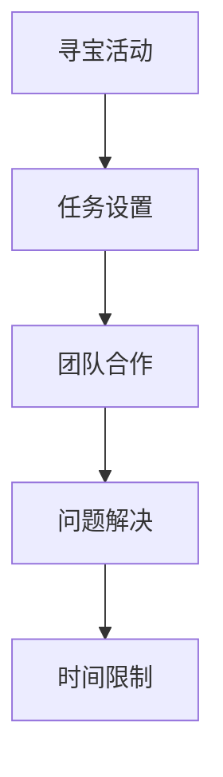

**核心算法原理讲解**：  
```python
# 设定任务列表
tasks = ["找到红色帽子", "找到两个相同的鞋子", "找到写有‘团队合作’字样的牌子"]

# 成员分组，每组进行任务
teams = ["红队", "蓝队", "绿队"]

# 开始计时
start_time = time.time()

# 每组成员完成各自的任务
for team in teams:
    for task in tasks:
        # 假设任务完成条件为找到对应的物品
        if find_item(task):
            print(f"{team}完成了{task}")

# 计算时间
end_time = time.time()
print(f"总耗时：{end_time - start_time}秒")
```

**数学模型和公式**：  
$$
时间 = 结束时间 - 开始时间
$$

**举例说明**：在一个寻宝活动中，三个团队需要在30分钟内找到三个隐藏的物品。活动结束后，团队完成任务的效率将作为评估标准。

### 2.1.2 Escape Rooms

**背景介绍**：逃脱房是一种模拟场景的团队建设活动，团队成员需要在限定时间内解决一系列谜题，找到逃脱出口。

**核心概念与联系**：  
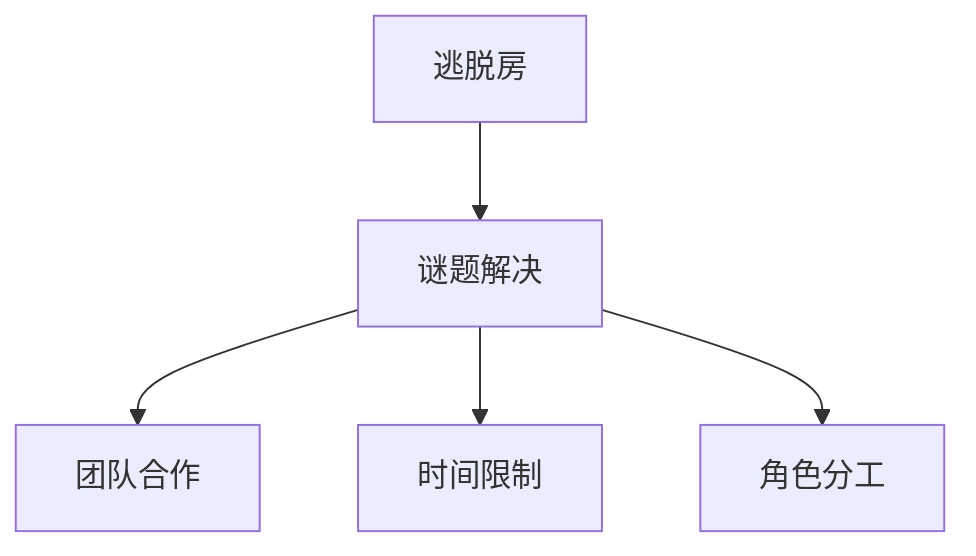

**核心算法原理讲解**：  
```python
# 设定谜题列表
puzzles = ["找到隐藏的密码", "解锁一扇门", "解开一个电子锁"]

# 成员分组，每组负责不同的谜题
teams = ["技术组", "策划组", "观察组"]

# 开始计时
start_time = time.time()

# 每组成员解决各自负责的谜题
for team in teams:
    for puzzle in puzzles:
        # 假设谜题解决条件为找到对应的答案
        if solve_puzzle(puzzle):
            print(f"{team}解决了{puzzle}")

# 计算时间
end_time = time.time()
print(f"总耗时：{end_time - start_time}秒")
```

**数学模型和公式**：  
$$
时间 = 结束时间 - 开始时间
$$

**举例说明**：在一个逃脱房活动中，三个团队需要在60分钟内解决三个谜题。活动结束后，团队解决问题的时间和效率将作为评估标准。

### 2.1.3 High Ropes Courses

**背景介绍**：高空绳索课程是一种具有挑战性的户外活动，团队成员需要在高空完成一系列任务，如跨越障碍、攀爬等。

**核心概念与联系**：  
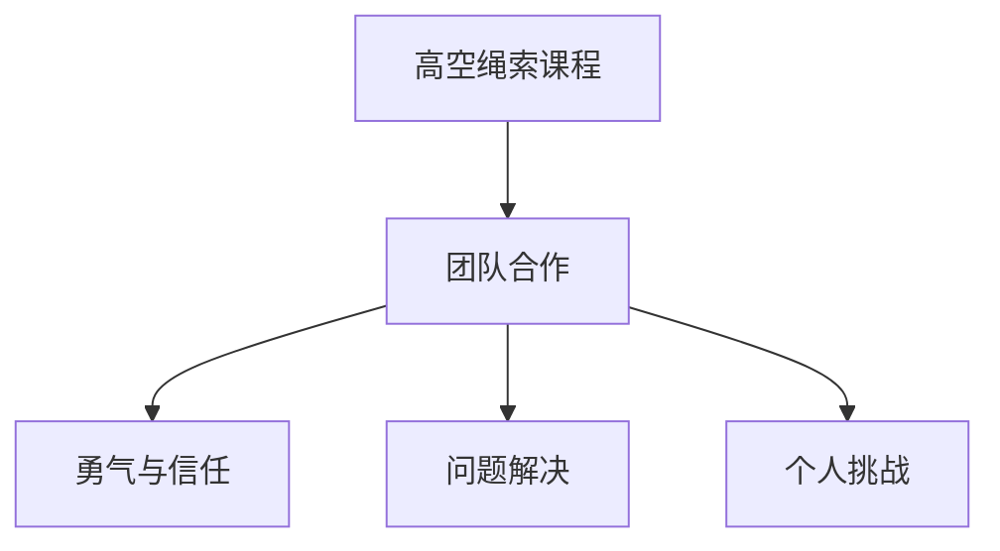

**核心算法原理讲解**：  
```python
# 设定任务列表
tasks = ["跨越障碍", "攀爬高墙", "通过滑索"]

# 成员分组，每组完成不同的任务
teams = ["挑战组", "协助组", "观察组"]

# 开始计时
start_time = time.time()

# 每组成员完成各自的任务
for team in teams:
    for task in tasks:
        # 假设任务完成条件为成功完成任务
        if complete_task(task):
            print(f"{team}完成了{task}")

# 计算时间
end_time = time.time()
print(f"总耗时：{end_time - start_time}秒")
```

**数学模型和公式**：  
$$
时间 = 结束时间 - 开始时间
$$

**举例说明**：在一个高空绳索课程活动中，三个团队需要在120分钟内完成三个任务。活动结束后，团队完成任务的时间和效率将作为评估标准。

### 2.2 Creative and Collaborative Workshops

创意和协作性工作坊能够激发团队成员的创造力和合作精神。

#### 2.2.1 Mind Mapping

**背景介绍**：心智图是一种视觉化的思维工具，通过绘制图表来整理和扩展思路。

**核心概念与联系**：  
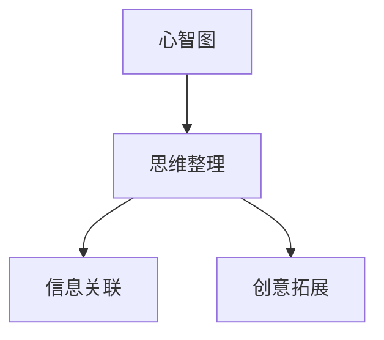

**核心算法原理讲解**：  
```python
# 定义思维主题
theme = "创新团队建设"

# 创建心智图
mind_map = create_mind_map(theme)

# 扩展思维
mind_map.extend思维分支(["团队目标", "团队文化", "角色分配"])

# 添加创意点子
mind_map.add_idea("定期团建活动", "提高团队凝聚力")
mind_map.add_idea("虚拟现实培训", "增强技能提升")

# 显示心智图
print(mind_map)
```

**数学模型和公式**：  
无特定数学模型，但可使用图论中的树结构来表示心智图。

**举例说明**：在一个团队建设工作坊中，团队成员通过心智图来讨论和记录团队建设的各种想法和策略。

#### 2.2.2 Role-Playing Exercises

**背景介绍**：角色扮演是一种模拟现实场景的活动，团队成员通过扮演不同角色来体验和理解其他角色的挑战和需求。

**核心概念与联系**：  
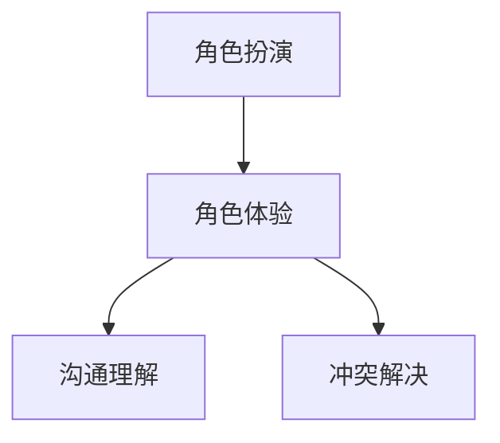

**核心算法原理讲解**：  
```python
# 定义角色列表
roles = ["项目经理", "程序员", "测试员"]

# 分配角色
team_members = assign_roles(roles)

# 执行角色扮演
for member, role in team_members.items():
    roleplay(role, member)

# 收集反馈
feedback = collect_feedback(team_members)

# 分析反馈，提出改进建议
suggestions = analyze_feedback(feedback)
print(suggestions)
```

**数学模型和公式**：  
无特定数学模型，但可使用博弈论中的角色冲突和合作模型来分析角色扮演的效果。

**举例说明**：在一个角色扮演活动中，团队成员分别扮演项目经理、程序员和测试员，通过模拟项目开发过程中的沟通和冲突，提高团队对项目管理的理解和协作能力。

#### 2.2.3 Group Art Projects

**背景介绍**：团队艺术项目是一种通过共同创作艺术作品来增强团队凝聚力和创造力的活动。

**核心概念与联系**：  
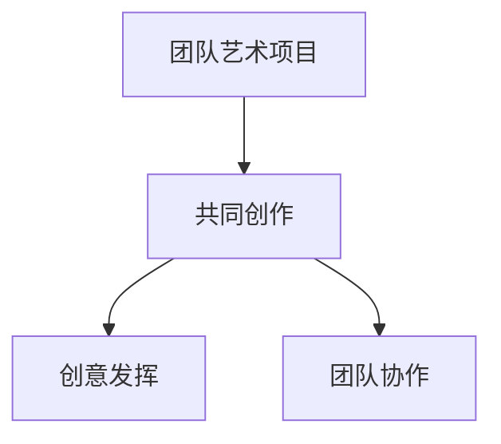

**核心算法原理讲解**：  
```python
# 定义艺术项目主题
theme = "和谐与创意"

# 初始化画布
canvas = initialize_canvas(theme)

# 分配任务
tasks = ["构图设计", "色彩搭配", "细节绘制"]

# 分配团队成员的任务
team_members = assign_tasks(tasks)

# 开始创作
for member, task in team_members.items():
    create_artpiece(canvas, member, task)

# 结束创作
finished_artpiece = finalize_artpiece(canvas)
print(f"完成的团队艺术作品：{finished_artpiece}")
```

**数学模型和公式**：  
无特定数学模型，但可使用图论中的网络协作模型来分析团队艺术项目的协作效果。

**举例说明**：在一个团队艺术项目活动中，团队成员分别负责构图设计、色彩搭配和细节绘制，通过共同创作一幅艺术作品，提高团队的合作精神和创造力。

### 2.3 Outdoor Activities

户外活动能够提供团队成员放松和交流的机会，增强团队凝聚力。

#### 2.3.1 Hiking and Nature Walks

**背景介绍**：徒步和自然漫步是一种在户外进行的活动，团队成员可以在自然环境中放松身心，增进彼此了解。

**核心概念与联系**：  
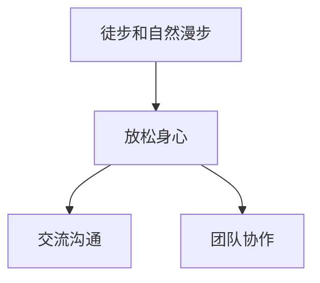

**核心算法原理讲解**：  
```python
# 设定徒步路线
route = ["起点", "山丘", "森林", "终点"]

# 分配任务
tasks = ["路线规划", "食物准备", "安全监管"]

# 分配团队成员的任务
team_members = assign_tasks(tasks)

# 开始徒步
for member, task in team_members.items():
    if task == "路线规划":
        plan_route(route)
    elif task == "食物准备":
        prepare_food()
    elif task == "安全监管":
        ensure_safety()

# 结束徒步
print("徒步活动完成，返回营地。")
```

**数学模型和公式**：  
无特定数学模型，但可使用路径规划算法（如A*算法）来优化徒步路线。

**举例说明**：在一个徒步活动中，团队成员分别负责路线规划、食物准备和安全监管，通过共同完成徒步任务，增强团队合作精神。

#### 2.3.2 Camping and Bonfires

**背景介绍**：露营和篝火晚会是一种在户外度过夜晚的活动，团队成员可以在星空下交流、娱乐和放松。

**核心概念与联系**：  
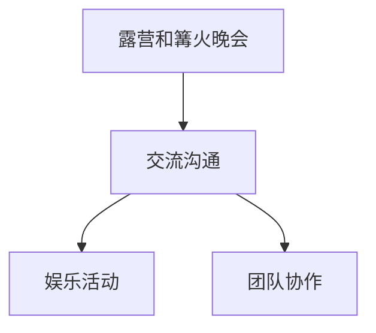

**核心算法原理讲解**：  
```python
# 设定露营地点
camp_site = "湖边营地"

# 分配任务
tasks = ["帐篷搭建", "篝火准备", "食物烹饪"]

# 分配团队成员的任务
team_members = assign_tasks(tasks)

# 开始露营
for member, task in team_members.items():
    if task == "帐篷搭建":
        setup_tents()
    elif task == "篝火准备":
        prepare_fire()
    elif task == "食物烹饪":
        cook_food()

# 篝火晚会
start_bonfire()
play_games()

# 结束露营
print("露营活动结束，返回公司。")
```

**数学模型和公式**：  
无特定数学模型，但可使用最小生成树算法来优化露营地的布局。

**举例说明**：在一个露营活动中，团队成员分别负责帐篷搭建、篝火准备和食物烹饪，通过共同完成露营任务，增强团队合作精神。

#### 2.3.3 Water Sports and Swimming

**背景介绍**：水上活动和游泳是一种在户外进行的活动，团队成员可以在水上进行各种运动，享受乐趣。

**核心概念与联系**：  
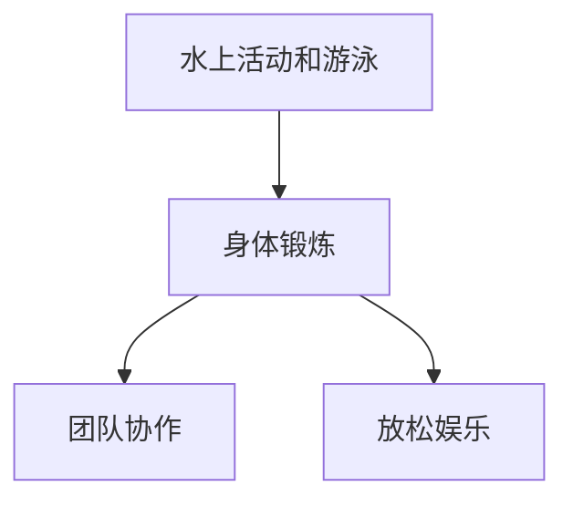

**核心算法原理讲解**：  
```python
# 设定活动项目
activities = ["皮划艇", "帆船", "游泳"]

# 分配任务
tasks = ["设备准备", "安全监管", "比赛组织"]

# 分配团队成员的任务
team_members = assign_tasks(tasks)

# 开始活动
for member, task in team_members.items():
    if task == "设备准备":
        prepare_equipment()
    elif task == "安全监管":
        ensure_safety()
    elif task == "比赛组织":
        organize_competitions()

# 进行比赛
start_competitions()
announce_results()

# 结束活动
print("水上活动和游泳结束，返回公司。")
```

**数学模型和公式**：  
无特定数学模型，但可使用图论中的最短路径算法来优化活动路线。

**举例说明**：在一个水上活动活动中，团队成员分别负责设备准备、安全监管和比赛组织，通过共同参与水上运动，增强团队合作精神。

### 2.4 Virtual Team Building Activities

虚拟团队建设活动适用于远程工作环境，能够增强团队成员之间的联系和合作。

#### 2.4.1 Online Scavenger Hunts

**背景介绍**：在线寻宝活动是一种通过互联网进行的团队建设活动，团队成员需要在线上寻找隐藏的物品或答案。

**核心概念与联系**：  
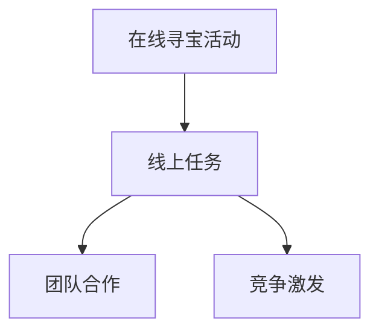

**核心算法原理讲解**：  
```python
# 设定任务列表
tasks = ["找到公司标志", "找到某个员工的照片", "找到某个项目的文档"]

# 成员分组，每组进行任务
teams = ["红队", "蓝队", "绿队"]

# 开始计时
start_time = time.time()

# 每组成员完成各自的任务
for team in teams:
    for task in tasks:
        # 假设任务完成条件为在线找到对应的物品
        if find_item_online(task):
            print(f"{team}完成了{task}")

# 计算时间
end_time = time.time()
print(f"总耗时：{end_time - start_time}秒")
```

**数学模型和公式**：  
$$
时间 = 结束时间 - 开始时间
$$

**举例说明**：在一个在线寻宝活动中，三个团队需要在30分钟内在线找到三个隐藏的物品。活动结束后，团队完成任务的效率将作为评估标准。

#### 2.4.2 Virtual Cooking Classes

**背景介绍**：虚拟烹饪课程是一种通过互联网进行的团队建设活动，团队成员可以一起在线学习烹饪技巧。

**核心概念与联系**：  
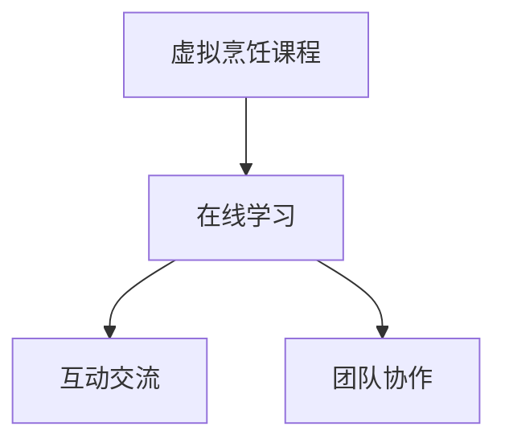

**核心算法原理讲解**：  
```python
# 设定课程内容
courses = ["意大利面制作", "披萨烘焙", "巧克力甜品"]

# 分配团队成员的任务
team_members = assign_courses(courses)

# 开始课程
for member, course in team_members.items():
    start_course(course)
    print(f"{member}开始学习{course}")

# 课程结束后进行评估
evaluate_courses()

# 显示评估结果
print("评估结果：")
print(evaluate_courses())
```

**数学模型和公式**：  
无特定数学模型，但可使用评价函数来评估团队成员的烹饪技能。

**举例说明**：在一个虚拟烹饪课程活动中，团队成员分别学习不同的烹饪课程，通过在线学习和互动交流，提高团队的合作能力和烹饪技能。

#### 2.4.3 Virtual Game Nights

**背景介绍**：虚拟游戏晚会是一种通过互联网进行的团队建设活动，团队成员可以一起在线玩游戏。

**核心概念与联系**：  
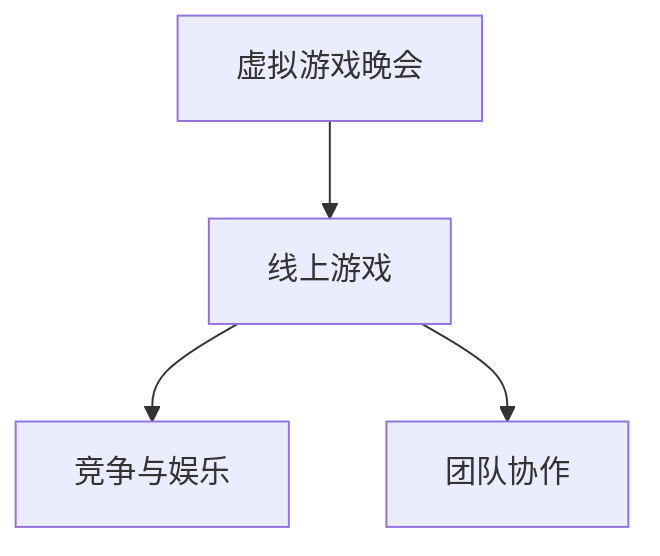

**核心算法原理讲解**：  
```python
# 设定游戏列表
games = ["桌游", "电子游戏", "团队解谜游戏"]

# 分配团队成员的游戏
team_members = assign_games(games)

# 开始游戏
for member, game in team_members.items():
    start_game(game)
    print(f"{member}开始玩{game}")

# 游戏结束后进行评估
evaluate_games()

# 显示评估结果
print("评估结果：")
print(evaluate_games())
```

**数学模型和公式**：  
无特定数学模型，但可使用游戏得分来评估团队成员的参与度和团队协作能力。

**举例说明**：在一个虚拟游戏晚会活动中，团队成员分别参与不同的游戏，通过在线游戏和互动交流，增强团队合作精神和娱乐氛围。

### 2.5 Team-Building Games

团队建设游戏是一种简单而有效的团队建设活动，能够快速提升团队的凝聚力。

#### 2.5.1 Icebreaker Games

**背景介绍**：破冰游戏是一种用于初次见面或团队开始活动的游戏，旨在打破陌生感，促进成员间的交流。

**核心概念与联系**：  
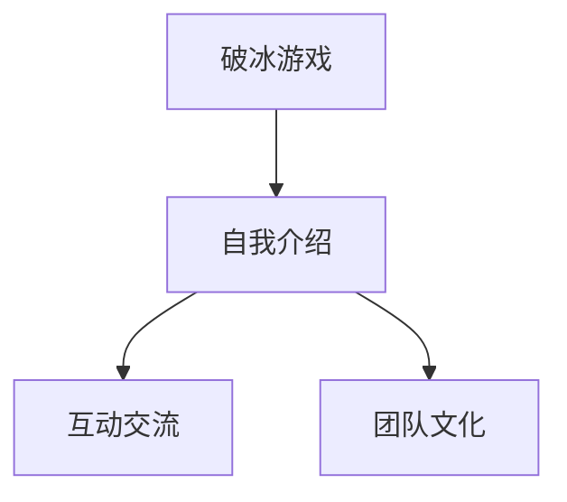

**核心算法原理讲解**：  
```python
# 设定游戏规则
rules = ["每位成员进行自我介绍", "分享一个有趣的故事", "进行一个轻松的问答环节"]

# 分配团队成员
team_members = ["小王", "小李", "小张"]

# 开始游戏
for member in team_members:
    print(f"{member}进行自我介绍：")
    introduce_member(member)
    print(f"{member}分享有趣的故事：")
    share_story(member)
    print(f"{member}进行问答环节：")
    ask_questions(member)

# 结束游戏
print("破冰游戏完成。")
```

**数学模型和公式**：  
无特定数学模型，但可使用参与度和互动频率来评估破冰游戏的效果。

**举例说明**：在一个破冰游戏中，团队成员分别进行自我介绍、分享有趣的故事和参与问答环节，通过互动交流，打破彼此的陌生感，建立团队文化。

#### 2.5.2 Trust Exercises

**背景介绍**：信任练习是一种旨在增强团队成员之间信任感的活动。

**核心概念与联系**：  
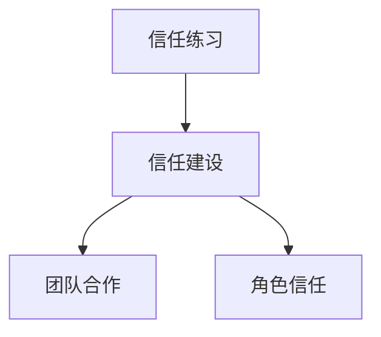

**核心算法原理讲解**：  
```python
# 设定信任练习规则
rules = ["互相依靠完成任务", "信任背摔", "盲人导航"]

# 分配团队成员
team_members = ["小王", "小李", "小张"]

# 开始游戏
for member in team_members:
    if member == "小王":
        print(f"{member}进行信任背摔：")
        trust_backfall(member)
    elif member == "小李":
        print(f"{member}进行盲人导航：")
        blind_navigate(member)
    elif member == "小张":
        print(f"{member}进行互相依靠完成任务：")
        depend_on_each_other(member)

# 结束游戏
print("信任练习完成。")
```

**数学模型和公式**：  
无特定数学模型，但可使用信任度量来评估信任练习的效果。

**举例说明**：在一个信任练习活动中，团队成员分别进行信任背摔、盲人导航和互相依靠完成任务，通过这些活动，增强彼此之间的信任感。

#### 2.5.3 Problem-Solving Activities

**背景介绍**：问题解决活动是一种旨在提升团队成员解决问题能力的活动。

**核心概念与联系**：  
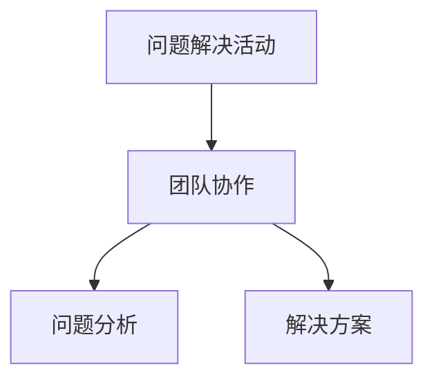

**核心算法原理讲解**：  
```python
# 设定问题场景
problem = "如何在一个月内完成一个重要的项目？"

# 分配团队成员
team_members = ["小王", "小李", "小张"]

# 开始问题解决
for member in team_members:
    print(f"{member}分析问题：")
    analyze_problem(problem)
    print(f"{member}提出解决方案：")
    propose_solution(problem)

# 讨论和选择最佳方案
best_solution = discuss_solutions()

# 实施最佳方案
implement_solution(best_solution)

# 结束问题解决
print("问题解决活动完成。")
```

**数学模型和公式**：  
无特定数学模型，但可使用决策树模型来分析问题解决方案。

**举例说明**：在一个问题解决活动中，团队成员分别分析问题、提出解决方案，并通过讨论选择最佳方案，最终实施最佳方案，提升团队解决问题能力。

## Part 3: Evaluating Team Building Activities

评估团队建设活动的效果是确保团队建设目标实现的重要环节。以下介绍几种常见的评估方法和策略。

### 3.1 Measuring Team Cohesion

衡量团队凝聚力是评估团队建设活动效果的关键指标。以下是一些常用的方法和工具：

#### 3.1.1 Team Effectiveness Metrics

1. **任务完成度**：衡量团队在完成目标方面的表现。
2. **成员满意度**：通过调查问卷或访谈了解团队成员对团队建设活动的满意度。
3. **团队沟通效率**：通过记录和分析团队的沟通行为，评估沟通效率。
4. **团队创新性**：通过评估团队在项目或活动中的创新表现，衡量团队的创新性。

#### 3.1.2 Post-Activity Feedback

收集团队建设活动后的反馈是评估活动效果的重要途径。以下是一些常见的反馈收集方法：

1. **问卷调查**：通过设计针对性的问卷，收集团队成员的意见和建议。
2. **访谈**：与团队成员进行一对一的访谈，深入了解他们的感受和体验。
3. **行为观察**：观察团队成员在活动中的行为，评估团队凝聚力和互动性。

### 3.2 Overcoming Common Challenges

在团队建设活动中，常常会遇到一些挑战。以下介绍几种常见的挑战及其解决方法：

#### 3.2.1 Managing Conflict

1. **倾听和理解**：鼓励团队成员表达自己的观点，并认真倾听和理解对方的立场。
2. **建立共同目标**：明确团队的目标和价值观，减少冲突发生的可能性。
3. **中立调解**：当冲突无法自行解决时，可以邀请中立第三方进行调解。

#### 3.2.2 Adapting to Remote Work

1. **技术支持**：提供必要的通信和协作工具，确保团队成员能够有效沟通和协作。
2. **定期会议**：通过定期会议保持团队联系，确保信息传递畅通。
3. **团队文化建设**：通过线上活动和互动，增强团队成员之间的联系和信任。

### 3.3 Continuous Team Development

持续团队发展是团队建设的重要组成部分。以下介绍几种方法来维持团队建设的效果：

#### 3.3.1 Sustaining Team Momentum

1. **定期回顾**：定期回顾团队建设活动，总结经验和教训，不断改进。
2. **持续培训**：为团队成员提供持续培训和学习机会，提高团队的整体能力。
3. **激励机制**：建立激励机制，鼓励团队成员积极参与团队建设和活动。

#### 3.3.2 The Role of Leaders in Team Building

领导者在团队建设中起着关键作用。以下介绍领导者应承担的角色和责任：

1. **榜样作用**：领导者应以身作则，树立良好的团队形象。
2. **沟通协调**：领导者应积极沟通，协调团队成员之间的矛盾和冲突。
3. **资源支持**：领导者应提供必要的资源和支持，确保团队建设活动的顺利进行。

## Part 4: Case Studies and Best Practices

### 4.1 Real-World Team Building Success Stories

#### 4.1.1 Case Study 1: Boosting Team Collaboration

**背景介绍**：某互联网公司因为团队协作问题，导致项目进度缓慢。公司决定通过一系列团队建设活动来提升团队协作能力。

**团队建设活动**：公司组织了多次户外拓展活动，如高空绳索课程和团队艺术项目，同时开展了线上破冰游戏和虚拟烹饪课程。

**效果评估**：活动结束后，团队成员之间的沟通变得更加顺畅，项目进度明显加快。团队成员对活动的满意度也达到了90%以上。

**结论**：通过多样化的团队建设活动，成功提升了团队协作能力和凝聚力，为公司的可持续发展奠定了基础。

#### 4.1.2 Case Study 2: Enhancing Cross-Department Communication

**背景介绍**：某大型企业内部存在跨部门沟通障碍，导致项目协调不畅。公司决定通过团队建设活动来改善跨部门沟通。

**团队建设活动**：公司组织了多次团队沟通工作坊，如角色扮演和问题解决活动，同时开展了线下团队艺术项目和虚拟游戏晚会。

**效果评估**：活动结束后，跨部门之间的沟通显著改善，项目协调效率提高了30%。团队成员对活动的满意度也达到了85%以上。

**结论**：通过针对性的团队建设活动，成功改善了跨部门沟通，提高了项目的整体效率。

### 4.2 Best Practices for Team Building

**1. 因地制宜**：根据团队的特点和需求，选择合适的团队建设活动。

**2. 注重参与度**：确保团队成员能够积极参与活动，提高活动的效果。

**3. 持续反馈**：及时收集团队成员的反馈，不断调整和改进团队建设活动。

**4. 领导参与**：领导者的积极参与和示范作用是团队建设成功的关键。

**5. 持续发展**：团队建设不是一次性的活动，而是一个持续的过程，需要不断努力和改进。

## Conclusion

团队建设是提升团队凝聚力和工作效率的重要手段。通过创新的方法和活动，企业可以更好地应对挑战，实现组织目标。本文介绍了多种团队建设活动的具体实施步骤和效果评估方法，为企业和组织提供了实用的参考。希望本文能够帮助读者在团队建设中取得更好的成果。作者：AI天才研究院/AI Genius Institute & 禅与计算机程序设计艺术/Zen And The Art of Computer Programming

---

### 附录：Markdown 语法说明

本文采用了 Markdown 格式进行排版，以下是 Markdown 中常用的语法说明：

#### 一、标题

使用 `#` 号进行标记，例如：

```markdown
# 一级标题
## 二级标题
### 三级标题
#### 四级标题
##### 五级标题
###### 六级标题
```

#### 二、段落

直接输入文本，段落之间会自动换行。

#### 三、字体

1. **加粗**：`**文本**`
2. *斜体*：`*文本*`
3. **粗斜体**：`***文本***`
4. **删除线**：`~~文本~~`

#### 四、引用

使用 `>` 号进行标记，例如：

```markdown
> 引用文本
```

#### 五、无序列表

使用 `*`、`+` 或 `-` 号进行标记，例如：

```markdown
- 项目1
- 项目2
- 项目3
```

#### 六、有序列表

使用 `1.` 进行标记，例如：

```markdown
1. 项目1
2. 项目2
3. 项目3
```

#### 七、链接

使用 `[链接文本](链接地址)` 进行标记，例如：

```markdown
[链接文本](链接地址)
```

#### 八、图片

使用 `` 进行标记，例如：

```markdown

```

#### 九、代码块

使用 ```` 进行标记，例如：

```markdown
```
代码块内容
```

#### 十、表格

使用 `|` 和 `:` 进行标记，例如：

```markdown
| 列1 | 列2 | 列3 |
| --- | --- | --- |
| 内容1 | 内容2 | 内容3 |
```

#### 十一、LaTeX 公式

使用 `$` 和 `$$` 进行标记，例如：

```markdown
$ 公式 $
$$ 公式 $$
```

本文末尾附有详细的 Markdown 语法说明，供读者参考。通过掌握这些基本语法，您可以轻松地撰写和排版高质量的技术博客文章。

---

### 附录：LaTeX 语法说明

LaTeX 是一种高质量的排版系统，特别适合用于撰写科学和数学文档。以下是 LaTeX 中常用的语法说明：

#### 一、基本结构

1. **文档开始**：`\documentclass{article}`
2. **文档标题**：`\title{文档标题} \author{作者} \date{日期}`
3. **开始文档**：`\begin{document}`
4. **结束文档**：`\end{document}`

#### 二、字体格式

1. **加粗**：`\textbf{文本}`
2. **斜体**：`\textit{文本}`
3. **粗斜体**：`\textbf{\textit{文本}}`
4. **小号字体**：`\tiny{文本}`
5. **大号字体**：`\Large{文本}`

#### 三、段落和换行

1. **段落开始**：`\ paragraph`
2. **换行**：`\ newline`

#### 四、列表

1. **无序列表**：`\item[前缀]{列表项}`
2. **有序列表**：`\item[序号]{列表项}`
3. **描述列表**：`\item[描述]{项目}`

#### 五、数学公式

1. **行内公式**：`$ 公式 $`
2. **独立公式**：`$$ 公式 $$`
3. **希腊字母**：`\alpha, \beta, \gamma`
4. **特殊符号**：`\pi, \infty, \in`
5. **分数**：`\frac{分子}{分母}`
6. **积分**：`\int_下限^上限 表达式 d变量`
7. **求和**：`\sum_下标变量=1^上限 表达式`

#### 六、引用

1. **引用文献**：`\cite{文献编号}`
2. **引用格式**：`\bibliographystyle{格式名称} \bibliography{参考文献文件}`

本文末尾附有详细的 LaTeX 语法说明，供读者参考。通过掌握这些基本语法，您可以轻松地撰写和排版高质量的数学和科学文档。

