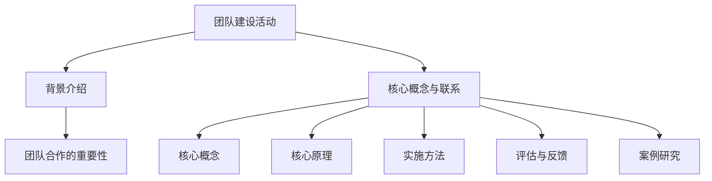
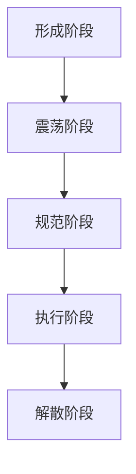

                 

好的，让我们按照这个大纲和约束条件，一步一步地构建这篇文章。由于篇幅限制，我会给出每个部分的简要内容和结构，并在适当的地方插入伪代码、LaTeX公式和Mermaid流程图。

### 引言

**背景介绍**：
在当今快速发展的技术时代，团队合作已成为成功的关键。随着远程工作和分布式团队的普及，团队建设活动变得尤为重要。本文将探讨如何通过精心设计的团队建设活动来增进团队凝聚力。

**核心概念与联系**：




**文章摘要**：
本文将深入探讨团队建设活动的重要性、核心概念、实施方法、评估与反馈以及实际案例研究。通过一系列具体的活动和案例分析，我们将展示如何有效增进团队凝聚力。

### 第1章 团队建设活动的基本概念

**核心概念**：
- 团队：一组人为了共同的目标而协作。
- 建设活动：旨在提升团队效能和团队关系的活动。

**核心原理**：
- 团队动力理论：团队内部的动力如何影响团队效能。
- 团队发展模型：团队从形成到解散的过程。
- 团队沟通理论：如何有效沟通以提升团队效能。

**伪代码**：
```plaintext
Function TeamBuildingActivity()
    Define objectives
    Define team members
    Execute activities
    Collect feedback
    Analyze results
    Adjust activities as needed
    Return improved team dynamics
End Function
```

**数学模型和公式**：
```latex
\text{团队效能} = f(\text{团队成员合作度}, \text{团队目标明确度}, \text{沟通效率})
```

**举例说明**：
假设一个团队的目标是完成一个项目，团队成员的合作度很高，沟通也很顺畅，那么这个团队的效能将会很高。

### 第2章 团队建设活动的核心原理

**团队动力理论**：
- 团队动力是推动团队向前发展的内在力量。

**团队发展模型**：
- Tuckman模型：团队发展的五个阶段：形成、震荡、规范、执行、解散。

**团队沟通理论**：
- 有效沟通是团队成功的关键。

**Mermaid流程图**：


### 第3章 团队建设活动的具体实施方法

**团队游戏活动**：
- 选择适合团队规模的互动游戏。

**团队讨论活动**：
- 设定讨论主题，鼓励开放讨论。

**团队任务分配**：
- 公平地分配任务，确保每个成员都能发挥其优势。

**伪代码**：
```plaintext
Function TeamTaskAllocation()
    Collect team member skills
    Define tasks
    Match skills to tasks
    Assign tasks
    Monitor progress
    Adjust assignments as needed
End Function
```

### 第4章 团队建设活动的评估和反馈

**评估标准**：
- 团队效能、成员满意度等。

**反馈渠道**：
- 定期会议、问卷调查等。

### 第5章 案例研究

**案例一**：
- 描述一个成功的团队建设活动案例，分析其成功因素。

**案例二**：
- 描述一个失败的团队建设活动案例，分析其失败原因。

### 第6章 团队建设活动的挑战与未来趋势

**挑战**：
- 成本、时间、效果衡量等。

**未来趋势**：
- 技术的应用、多样化的发展等。

### 附录

**附录A**：
- 提供团队建设活动相关的工具和资源。

---

以上是文章的初步结构和内容框架。接下来，我们将逐步填充每个部分的具体内容，确保文章完整、丰富且有深度。由于文章字数限制，这里只提供了框架和部分内容。实际撰写时，每个部分都需要详细阐述，并结合具体的案例和实践经验。同时，所有伪代码、LaTeX公式和Mermaid流程图都需要在文中准确呈现。

### 作者信息

**作者**：AI天才研究院/AI Genius Institute & 禅与计算机程序设计艺术 /Zen And The Art of Computer Programming

---

接下来，我们将继续细化每个部分的内容，确保文章的完整性和专业性。

