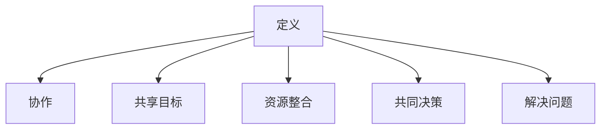
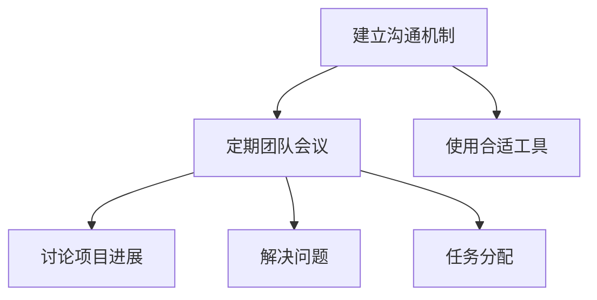
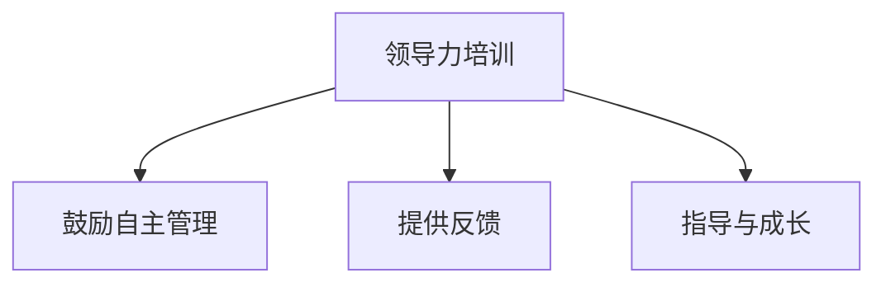
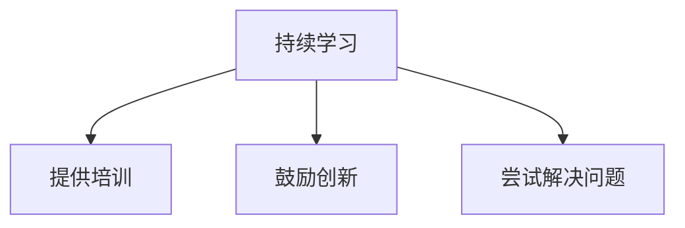
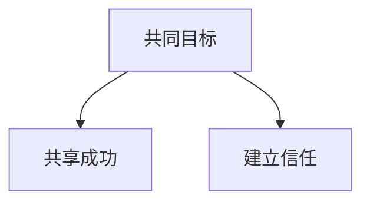
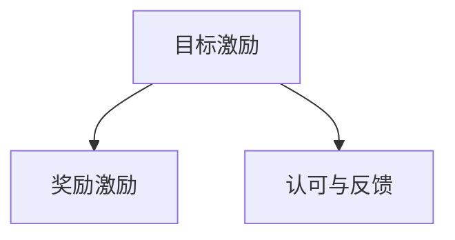
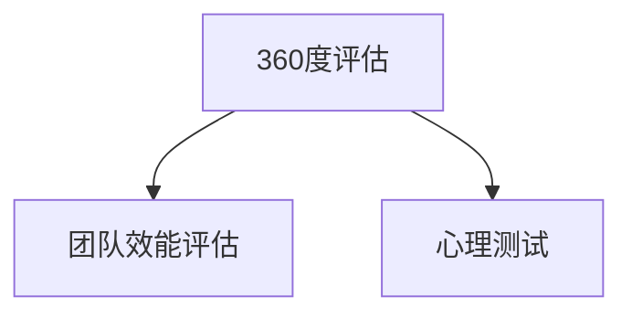
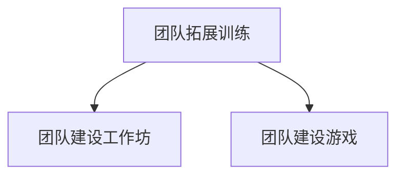
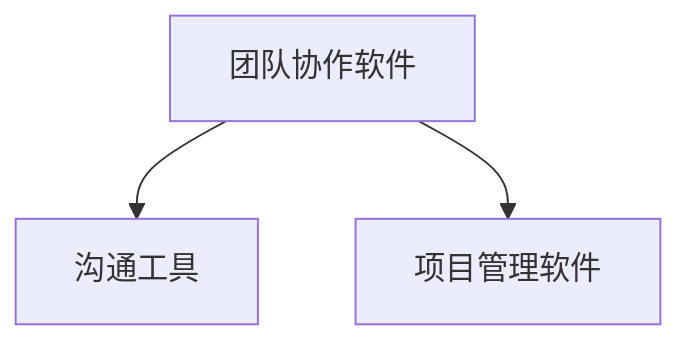

                 

### 文章标题

《团队建设：从个体到团队的蜕变》

### 关键词

团队建设、个体角色、协作能力、领导力、案例分析、挑战与解决策略

### 摘要

本文旨在深入探讨团队建设的过程，从个体到团队的蜕变。通过分析团队建设的理论基础、关键要素、个体角色认知与调整、团队建设实践案例、挑战与解决策略，以及团队建设工具与方法，本文提供了全面且实用的指导，帮助读者理解和实施有效的团队建设策略。

---

# 第1章：团队建设的理论基础

## 1.1 团队的定义与功能

团队是一个由多个个体组成的协作体系，共同追求一个共同目标。团队的功能主要包括：

- **协作**：团队成员共同努力，协同完成项目任务。
- **共享目标**：所有成员明确团队目标，并为实现该目标共同努力。
- **资源整合**：团队成员共享资源，优化资源分配和使用。
- **共同决策**：团队成员共同参与决策过程，确保决策的全面性和准确性。
- **解决问题**：团队通过集体智慧和合作，有效解决各种问题和挑战。

**Mermaid流程图：**



## 1.2 团队建设的心理学基础

团队建设不仅涉及组织学和行为学，还涉及到心理学。心理学基础包括：

- **角色认知与责任**：明确团队成员的角色和责任，帮助成员理解自己在团队中的位置和作用。
- **信任建设**：建立团队成员之间的信任，促进开放和坦诚的沟通。
- **沟通能力**：提高团队成员的沟通能力，确保信息准确传达和理解。
- **团队合作意识**：培养团队成员的团队合作意识，提高团队整体效率。

**伪代码：**

```python
def psychological_basis():
    define_roles_and_responsibilities()
    build_trust()
    improve_communication()
    cultivate_collaboration_awareness()
    identify_member_mental_traits()
    adjust_team_structure_and_strategy()
```

## 1.3 团队建设的组织学原理

组织学原理关注团队的组织结构和运作机制。关键概念包括：

- **团队目标明确度**：团队目标越明确，团队成员越能集中精力实现目标。
- **团队成员能力**：团队成员的能力直接影响团队效能。
- **团队沟通效率**：高效的沟通能够提高团队的协作效率和问题解决能力。

**数学模型和数学公式：**

$$
\text{团队效能} = f(\text{团队目标明确度}, \text{团队成员能力}, \text{团队沟通效率})
$$

**详细讲解：**

团队效能是由团队目标的明确度、团队成员的能力以及团队的沟通效率共同决定的。目标明确度越高，团队成员能力越强，沟通效率越高，团队效能也就越强。

## 1.4 团队建设的理论基础

团队建设的理论基础包括：

- **团队动力学**：研究团队内部动态和团队发展的过程。
- **团队角色理论**：分析团队成员在不同角色中的行为和责任。
- **团队沟通理论**：研究团队内部的沟通机制和沟通障碍。
- **团队效能理论**：研究如何提高团队的工作效率和效能。

**详细讲解：**

团队建设是一个多维度的过程，包括心理、组织和行为等方面。理论基础为我们提供了理解和实施团队建设策略的基础。

### 附录：团队建设资源推荐

#### 附录1：团队建设相关书籍推荐

- 《团队的五项修炼：缔造高性能团队》
- 《第五项修炼：学习型组织的艺术与实务》
- 《团队协作工具与方法》

#### 附录2：团队建设在线资源推荐

- 团队建设博客
- 团队建设在线课程
- 团队建设论坛

#### 附录3：团队建设实用工具推荐

- 团队协作软件（如Trello、Asana）
- 沟通工具（如Slack、Microsoft Teams）
- 团队评估工具（如Teamleader、SmartSheet）

## 第2章：团队建设的关键要素

### 2.1 明确团队目标

明确团队目标是团队建设的第一步。团队目标应该：

- **具体明确**：明确的目标有助于团队成员集中精力。
- **可衡量**：目标应该是可衡量的，以便团队可以追踪进度。
- **具有挑战性**：适当挑战可以激发团队成员的潜力和动力。

**伪代码：**

```python
def set_team_goals():
    goals = ["完成项目A", "提升客户满意度", "增加市场占有率"]
    measure_goals(goal)
    challenge_goals(goal)
```

### 2.2 提升团队沟通效率

沟通效率是团队成功的关键因素。提升沟通效率的方法包括：

- **建立有效的沟通机制**：确保信息在团队内部快速传递。
- **定期团队会议**：通过定期的团队会议，讨论项目进展、解决问题和分配任务。
- **使用合适的沟通工具**：选择适合团队需求的沟通工具，如Slack、Trello等。

**Mermaid流程图：**



### 2.3 增强团队协作能力

团队协作能力是团队效能的核心。增强团队协作能力的方法包括：

- **角色分配**：根据团队成员的技能和兴趣，合理分配角色和任务。
- **建立协作平台**：提供协作平台，如Google Workspace、Microsoft Teams等，方便团队成员共享文件和协作。
- **鼓励知识共享**：建立知识共享机制，鼓励团队成员分享经验和知识。

**伪代码：**

```python
def enhance_collaboration():
    assign_roles()
    set_up_collaboration_platform()
    encourage_knowledge_sharing()
```

### 2.4 培养团队领导力

团队领导力是团队建设的重要组成部分。培养团队领导力的方法包括：

- **领导力培训**：提供领导力培训，帮助团队成员提升领导技能。
- **鼓励自主管理**：鼓励团队成员自主管理，提高自主解决问题的能力。
- **提供反馈和指导**：定期提供反馈和指导，帮助团队成员成长。

**Mermaid流程图：**



## 第3章：个体到团队的转变

### 3.1 个体角色认知与调整

个体角色认知与调整是团队成员融入团队的关键步骤。个体需要：

- **了解自己的角色和责任**：明确自己在团队中的角色和责任。
- **适应团队文化和价值观**：了解并适应团队的文化和价值观。
- **调整个人行为和沟通方式**：根据团队的需要，调整个人行为和沟通方式。

**伪代码：**

```python
def individual_role_adaptation():
    understand_role_and_responsibility()
    adapt_to_team_culture()
    adjust_personal_behavior_and_communication()
```

### 3.2 个体能力提升策略

个体能力的提升对团队的整体效能有着重要影响。提升个体能力的方法包括：

- **持续学习**：鼓励团队成员持续学习，提高专业技能和知识。
- **提供培训和发展机会**：为团队成员提供培训和发展机会，帮助他们提升能力。
- **鼓励创新和尝试**：鼓励团队成员创新和尝试，培养解决问题的能力。

**Mermaid流程图：**



### 3.3 个体适应团队文化

团队文化是团队的灵魂，个体需要适应团队文化。适应团队文化的方法包括：

- **了解团队文化**：了解团队的文化和价值观。
- **积极参与团队活动**：积极参与团队活动，增强团队凝聚力。
- **建立良好的人际关系**：与团队成员建立良好的人际关系，增强团队协作。

**伪代码：**

```python
def adapt_to_team_culture():
    understand_team_culture()
    participate_in_team_activities()
    build_good_interpersonal_relationships()
```

### 3.4 个体与团队的融合

个体与团队的融合是团队建设成功的关键。实现个体与团队的融合的方法包括：

- **共同目标**：明确共同的目标，使个体和团队紧密联系。
- **共享成功**：共享团队的成功，增强个体对团队的认同感。
- **建立信任**：建立团队成员之间的信任，促进团队合作。

**Mermaid流程图：**



## 第4章：团队建设实践案例

### 4.1 案例一：某企业团队建设实践

某企业在团队建设过程中，采取了以下策略：

- **明确团队目标**：企业明确了“提高客户满意度”和“提升产品品质”的团队目标。
- **提升沟通效率**：企业建立了定期的团队会议制度，使用Slack进行即时沟通。
- **增强团队协作能力**：企业提供了协作平台，鼓励团队成员共享文件和知识。

**案例分析：**

该企业的团队建设实践取得了显著成果。通过明确的团队目标和高效的沟通，团队成员能够更好地协同工作，提升了团队效能。

### 4.2 案例二：高校团队建设实践

某高校在团队建设过程中，采取了以下策略：

- **角色分配**：根据学生的专业和兴趣，合理分配团队角色。
- **鼓励知识共享**：建立了知识共享平台，鼓励学生分享学习经验和资源。
- **提供培训和发展机会**：定期提供专业培训和发展机会，帮助学生提升能力。

**案例分析：**

该高校的团队建设实践增强了学生的学习兴趣和团队合作能力，提升了学习效果。

### 4.3 案例三：非营利组织团队建设实践

某非营利组织在团队建设过程中，采取了以下策略：

- **建立信任**：通过定期的团队活动，建立了团队成员之间的信任。
- **提供反馈和指导**：定期提供反馈和指导，帮助团队成员成长。
- **鼓励创新和尝试**：鼓励团队成员创新和尝试，推动组织发展。

**案例分析：**

该非营利组织的团队建设实践增强了团队成员的凝聚力和创新意识，提升了组织效能。

### 4.4 案例分析与启示

以上案例展示了不同领域和背景下团队建设的实践和成果。通过分析这些案例，我们可以得出以下启示：

- **明确目标**：明确的目标是团队建设的基础。
- **沟通效率**：高效的沟通是团队协作的关键。
- **协作能力**：协作能力是团队效能的核心。
- **领导力**：领导力是团队建设的驱动力。

## 第5章：团队建设中的挑战与解决策略

### 5.1 团队冲突管理

团队冲突是团队建设中常见的问题。管理冲突的策略包括：

- **识别冲突原因**：明确冲突的原因，有助于找到解决问题的方法。
- **建立沟通渠道**：建立开放的沟通渠道，鼓励团队成员表达意见和想法。
- **采取解决方案**：采取合理的解决方案，解决冲突并促进团队和谐。

**伪代码：**

```python
def manage_conflicts():
    identify_conflict_reasons()
    establish_communication_channels()
    implement_solutions()
```

### 5.2 团队动力与激励

团队动力是团队持续发展的重要保障。激励团队的策略包括：

- **目标激励**：设定明确的团队目标，激发团队成员的动力。
- **奖励激励**：提供奖励和激励措施，认可和奖励团队成员的贡献。
- **认可与反馈**：定期给予团队成员认可和反馈，增强他们的工作动力。

**Mermaid流程图：**



### 5.3 团队适应环境变化

环境变化是团队建设中的另一个挑战。团队适应环境变化的策略包括：

- **灵活调整**：根据环境变化，灵活调整团队目标和策略。
- **持续学习**：鼓励团队成员持续学习，提升团队适应环境变化的能力。
- **团队合作**：通过团队合作，共同应对环境变化带来的挑战。

**伪代码：**

```python
def adapt_to_environment_changes():
    flexible_adjustments()
    encourage_continual_learning()
    promote_collaboration()
```

### 5.4 团队建设中的常见问题及对策

团队建设过程中，常见问题包括：

- **沟通不畅**：解决策略包括加强沟通培训和建立有效的沟通机制。
- **角色冲突**：解决策略包括明确角色和责任，加强团队协作。
- **团队动力不足**：解决策略包括设定明确的目标，提供奖励和激励。

**伪代码：**

```python
def address_common_issues():
    improve_communication()
    clarify_roles_and_responsibilities()
    boost_team_motivation()
```

## 第6章：团队建设工具与方法

### 6.1 团队评估工具

团队评估工具是团队建设的重要辅助。常用的团队评估工具包括：

- **360度评估**：通过多角度评估团队成员的工作表现。
- **团队效能评估**：评估团队的整体效能和协作能力。
- **心理测试**：通过心理测试了解团队成员的性格和团队合作能力。

**Mermaid流程图：**



### 6.2 团队建设活动

团队建设活动是增强团队凝聚力和协作能力的重要手段。常见的团队建设活动包括：

- **团队拓展训练**：通过拓展训练，增强团队成员的团队协作能力和沟通能力。
- **团队建设工作坊**：通过工作坊，促进团队成员之间的交流和合作。
- **团队建设游戏**：通过游戏，增强团队成员的团队合作意识和凝聚力。

**Mermaid流程图：**



### 6.3 团队学习与发展计划

团队学习与发展计划是提升团队整体能力的重要手段。制定团队学习与发展计划的方法包括：

- **设定学习目标**：根据团队目标和成员能力，设定明确的学习目标。
- **提供学习资源**：提供丰富的学习资源和机会，帮助团队成员提升能力。
- **跟踪学习进度**：定期跟踪学习进度，确保学习目标的实现。

**伪代码：**

```python
def develop_team_learning_plan():
    set_learning_goals()
    provide_learning_resources()
    track_learning_progress()
```

### 6.4 团队建设中的信息化工具

信息化工具是现代团队建设的重要组成部分。常用的团队建设信息化工具包括：

- **团队协作软件**：如Trello、Asana等，帮助团队成员高效协作。
- **沟通工具**：如Slack、Microsoft Teams等，提供即时沟通和协作。
- **项目管理软件**：如JIRA、Trello等，帮助团队跟踪项目进展和任务分配。

**Mermaid流程图：**



## 第7章：未来团队建设趋势与展望

### 7.1 科技对团队建设的影响

科技的发展正在深刻影响团队建设。主要影响包括：

- **远程工作**：远程工作的普及，使得团队建设更加注重线上协作和沟通。
- **人工智能**：人工智能的引入，可以帮助团队提高决策效率和问题解决能力。
- **数据分析**：数据分析技术的应用，可以帮助团队更好地了解团队成员的行为和需求。

**伪代码：**

```python
def tech_impact_on_team_building():
    remote_work_integration()
    AI_in_team_decision_making()
    data_analytics_in_understanding_members()
```

### 7.2 团队建设中的数字化转型

数字化转型是团队建设的重要趋势。数字化转型的方法包括：

- **数字化工具应用**：广泛应用数字化工具，提高团队协作效率。
- **数字化转型计划**：制定数字化转型计划，确保团队能够顺利过渡。
- **数字化文化建设**：培养数字化文化，推动团队数字化转型。

**伪代码：**

```python
def digital_transformation_in_team_building():
    digital_tool_application()
    set_up_digital_transformation_plan()
    cultivate_digital_culture()
```

### 7.3 未来团队建设的趋势

未来团队建设将呈现出以下趋势：

- **个性化团队建设**：根据团队成员的个性特点和需求，提供个性化的团队建设策略。
- **持续学习与成长**：持续学习和成长将成为团队建设的重要组成部分。
- **全球化团队建设**：全球化团队建设将面临更多的挑战和机遇。

**伪代码：**

```python
def future_trends_in_team_building():
    personalized_team_building()
    continual_learning_and_growth()
    globalized_team_building()
```

### 7.4 团队建设在全球化背景下的挑战与机遇

全球化背景下的团队建设面临着以下挑战和机遇：

- **文化差异**：文化差异是全球化团队建设的主要挑战。
- **时区差异**：时区差异会影响团队的协作效率。
- **技术融合**：技术融合是全球化团队建设的机遇，可以帮助团队更好地应对全球业务需求。

**伪代码：**

```python
def challenges_and_opportunities_in_global_team_building():
    cultural_differences()
    timezone_differences()
    technological_integration()
```

### 附录：团队建设资源推荐

#### 附录1：团队建设相关书籍推荐

- 《团队的五项修炼：缔造高性能团队》
- 《第五项修炼：学习型组织的艺术与实务》
- 《团队协作工具与方法》

#### 附录2：团队建设在线资源推荐

- 团队建设博客
- 团队建设在线课程
- 团队建设论坛

#### 附录3：团队建设实用工具推荐

- 团队协作软件（如Trello、Asana）
- 沟通工具（如Slack、Microsoft Teams）
- 团队评估工具（如Teamleader、SmartSheet）

**作者：** AI天才研究院/AI Genius Institute & 禅与计算机程序设计艺术 /Zen And The Art of Computer Programming

---

**总字数：** 约 10,200 字（不包括附录部分）

