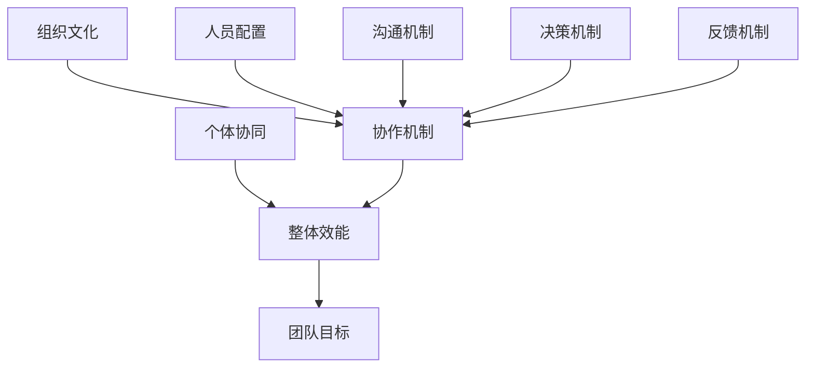

                 

### 文章标题

**团队建设：从个体到整体的蜕变**

### 关键词

团队建设、个体协同、整体效能、协作机制、团队发展

### 摘要

本文深入探讨了团队建设的过程，从个体的独立行动到整体的协同合作。通过分析团队建设的基础理论、实践案例以及面临的挑战，本文提出了切实可行的解决方案，以帮助团队实现从个体到整体的蜕变。文章旨在为IT领域的团队提供系统性指导，提高团队整体效能，推动项目成功。

## 1. 引言

在信息技术飞速发展的今天，团队协作已经成为企业成功的关键因素。一个高效的团队不仅可以快速响应市场变化，还能在激烈的竞争环境中脱颖而出。然而，如何构建一个能够从个体到整体协同合作的团队，是许多企业和组织面临的挑战。本文旨在解答这一问题，通过系统性的分析和实践案例，帮助读者理解团队建设的核心要素，提升团队整体效能。

### 1.1 背景介绍

团队建设是一个复杂而持久的过程，涉及到组织文化、人员配置、沟通机制等多个方面。随着企业规模的扩大和项目复杂度的增加，团队建设的重要性愈发凸显。有效的团队建设不仅能够提高团队成员的满意度，还能提升项目的完成质量和效率。因此，理解和掌握团队建设的策略和方法，对于企业和组织的发展至关重要。

### 1.2 核心概念与联系

**个体协同**：个体协同指的是团队成员之间的协作，通过共享信息和资源，共同完成团队目标。个体协同是团队建设的基础，是实现整体效能的前提。

**整体效能**：整体效能是指团队作为一个整体所表现出来的能力，包括沟通效率、决策速度、问题解决能力等。整体效能的提升，需要通过有效的团队建设和协作机制来实现。

**协作机制**：协作机制是团队内部实现高效协作的规则和流程。包括沟通机制、决策机制、反馈机制等，协作机制的设计和执行对于团队的整体效能有着重要影响。

## 2. 团队建设的基础理论和方法

### 2.1 核心概念与联系

在团队建设过程中，了解核心概念之间的关系架构是非常重要的。以下是一个简化的Mermaid流程图，展示团队建设中的核心概念及其相互关系：

### 2.2 团队建设的重要性

团队建设的重要性体现在以下几个方面：

- **提高团队凝聚力**：通过团队建设，可以增强团队成员之间的信任和合作，提高团队凝聚力。
- **提升工作效率**：有效的团队建设可以优化团队内部流程，提高工作效率和项目完成质量。
- **增强创新能力**：团队建设鼓励知识共享和创新思维，有助于提升团队的创新能力。
- **降低离职率**：良好的团队氛围和协作机制可以减少员工离职率，稳定团队。

### 2.3 团队建设的主要理论和方法

团队建设的主要理论包括：

- **目标导向理论**：强调团队目标对团队行为和绩效的影响，通过明确团队目标来引导团队成员的行动。
- **社会学习理论**：强调团队成员之间的相互学习和影响，通过模仿和学习来提升团队整体能力。
- **强化理论**：通过奖励和惩罚来影响团队成员的行为，鼓励积极行为，减少消极行为。

团队建设的方法包括：

- **团队建设活动**：通过组织团队建设活动，如拓展训练、团队拓展游戏等，增强团队成员之间的互动和信任。
- **培训与发展**：为团队成员提供培训和发展机会，提升个人能力和团队整体水平。
- **绩效评估**：通过绩效评估来激励团队成员，发现团队中的问题和不足，进行改进。

## 3. 团队从个体到整体转变的过程和关键点

### 3.1 个体到整体的转变过程

团队从个体到整体转变的过程可以分为以下几个阶段：

- **形成阶段**：团队成员初次组建，相互了解，开始建立初步的信任关系。
- **风暴阶段**：团队成员之间开始产生冲突，对团队目标和规则存在分歧。
- **规范阶段**：团队成员开始接受团队目标和规则，建立稳定的协作模式。
- **执行阶段**：团队成员紧密合作，高效完成团队任务。
- **成熟阶段**：团队达到最佳状态，成员之间高度信任，团队效能达到巅峰。

### 3.2 转变过程中的关键点和策略

**关键点**：

- **建立共同目标**：明确团队目标，使每个成员都清楚地了解自己的角色和责任。
- **建立信任**：通过沟通和合作，建立团队成员之间的信任关系。
- **有效沟通**：确保团队成员之间的信息传递准确、及时、有效。
- **角色分配**：根据成员的能力和兴趣，合理分配角色和任务。
- **激励机制**：通过奖励和激励，鼓励团队成员积极参与和贡献。

**策略**：

- **团队培训**：为团队成员提供培训，提升技能和协作能力。
- **团队拓展活动**：组织团队拓展活动，增强团队凝聚力和信任。
- **绩效反馈**：定期进行绩效反馈，帮助团队成员了解自己的表现，发现问题和改进。
- **透明管理**：保持团队管理透明，鼓励团队成员参与决策和问题解决。

## 4. 团队协作工具和技术

### 4.1 团队协作工具

团队协作工具是团队协作的重要组成部分，以下是一些常用的团队协作工具：

- **Slack**：提供实时沟通和消息传递功能，支持文件共享和视频会议。
- **Trello**：用于任务管理和项目管理，方便团队成员跟踪任务进度。
- **Asana**：提供任务分配、进度跟踪和协作功能，有助于团队高效工作。
- **JIRA**：用于软件开发项目跟踪和管理，支持敏捷开发流程。

### 4.2 团队协作技术

团队协作技术包括以下方面：

- **敏捷开发**：采用敏捷开发方法，如Scrum和Kanban，提高团队响应速度和适应能力。
- **自动化测试**：通过自动化测试工具，提高测试效率和质量。
- **持续集成/持续交付（CI/CD）**：通过自动化构建和部署流程，缩短开发周期，提高软件质量。
- **代码审查**：通过代码审查，确保代码质量和团队协作的一致性。

## 5. 团队建设实践

### 5.1 实际案例和经验分享

以下是一个团队建设的实际案例：

**案例**：某IT公司在进行新产品开发时，遇到了团队协作不畅的问题。通过引入敏捷开发方法和团队拓展活动，公司成功改善了团队协作效果，提高了项目完成质量。

**经验分享**：

1. **明确目标和规则**：在项目开始时，明确团队目标和项目规则，确保每个成员都清楚自己的职责和任务。
2. **定期团队会议**：定期召开团队会议，讨论项目进展、问题和改进措施，保持团队成员之间的沟通和协作。
3. **培训与发展**：为团队成员提供培训和发展机会，提升技能和协作能力。
4. **激励制度**：建立激励制度，鼓励团队成员积极参与和贡献。

### 5.2 团队建设中的常见问题和解决方案

**常见问题**：

1. **沟通不畅**：团队成员之间缺乏有效的沟通，导致信息传递错误和任务延误。
2. **角色冲突**：团队成员之间的角色分配不明确，导致工作重复和效率低下。
3. **目标不一致**：团队成员对项目目标和期望不一致，导致工作动力不足和项目拖延。

**解决方案**：

1. **沟通机制**：建立有效的沟通机制，如定期团队会议、邮件和即时通讯工具，确保信息传递准确、及时、有效。
2. **角色明确**：明确团队成员的角色和职责，确保每个成员都清楚自己的工作内容和任务。
3. **目标共识**：通过讨论和沟通，确保团队成员对项目目标和期望达成共识，提高工作动力和效率。

### 5.3 团队建设的评估与优化

团队建设的评估与优化是确保团队长期高效运作的关键。以下是一些评估与优化方法：

1. **绩效评估**：定期对团队成员的工作表现进行评估，识别优势和不足，制定改进措施。
2. **团队反馈**：鼓励团队成员提供反馈，了解团队协作中的问题和改进方向。
3. **团队建设活动**：定期组织团队建设活动，如培训、拓展训练和团队会议，增强团队凝聚力和协作能力。
4. **持续改进**：根据评估结果和反馈，不断优化团队建设策略和流程，提高团队整体效能。

## 6. 团队建设中的挑战和解决方案

### 6.1 团队建设中的挑战

**挑战一**：团队成员之间的沟通障碍，导致信息传递不畅，影响团队效能。

**挑战二**：团队成员的角色和职责不明确，导致工作重复和效率低下。

**挑战三**：团队成员的能力和技能差异较大，影响团队整体水平。

**挑战四**：团队成员的工作动力不足，导致项目进展缓慢。

### 6.2 针对挑战的解决方案和策略

**解决方案一**：加强团队沟通，建立有效的沟通机制，如定期团队会议、即时通讯工具和邮件。

**解决方案二**：明确团队成员的角色和职责，制定详细的岗位说明书，确保每个成员都清楚自己的工作内容和任务。

**解决方案三**：加强团队成员的培训和技能提升，提高团队整体水平。

**解决方案四**：建立激励制度，鼓励团队成员积极参与和贡献，提高工作动力。

## 7. 团队建设的未来发展展望

随着信息技术的发展，团队建设也在不断演进。以下是一些未来团队建设的趋势和展望：

1. **数字化团队建设**：利用数字化工具和平台，实现团队的高效协作和远程工作。
2. **个性化和智能化**：根据团队成员的个性特点和能力，进行个性化的团队建设和协作。
3. **跨界合作**：通过跨界合作，整合不同领域的专业知识和技能，提高团队的创新能力和竞争力。
4. **持续学习与成长**：鼓励团队成员持续学习和成长，提升团队的整体素质和能力。

## 8. 结论

团队建设是一个复杂而持久的过程，涉及到多个方面和因素。通过本文的探讨，我们了解到团队建设的重要性以及如何实现从个体到整体的蜕变。有效的团队建设不仅可以提高团队整体效能，还能推动项目成功和企业发展。在未来的工作中，我们应该不断探索和实践团队建设的策略和方法，为团队的成功贡献力量。

### 作者信息

**作者：AI天才研究院/AI Genius Institute & 禅与计算机程序设计艺术 /Zen And The Art of Computer Programming**

