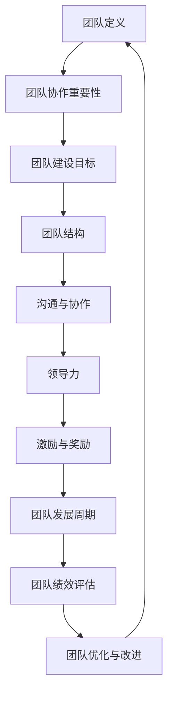

                 

好的，我会按照您的要求，逐步思考并撰写文章。以下是文章的大纲和初步内容：

---

# 团队建设：从个体英雄到团队协作

> 关键词：团队建设、团队协作、个体英雄、团队效能、项目实战

> 摘要：本文将探讨团队建设的重要性，从个体英雄到团队协作的转变，以及如何通过核心概念与联系、核心算法原理、数学模型和项目实战，提升团队效能和协作效率。

---

## 第一步：核心概念与联系

在团队建设中，理解核心概念和它们之间的联系是至关重要的。以下是团队建设的关键概念及其相互关系：

### 团队定义

团队是一组相互依赖的个体，共同追求共同目标，通过协作和沟通来实现成果。

### 团队协作重要性

团队协作是团队成功的关键。通过协作，团队成员可以共享资源、知识、技能和经验，从而提高整体效能。

### 团队建设目标

团队建设的目标是创建一个高效、协作、互相支持的团队环境，以实现项目目标。

### 团队结构

团队结构决定了团队成员的角色和责任。合理的团队结构有助于提高团队协作效率。

### 沟通与协作

沟通是团队协作的基石。有效的沟通可以减少误解，提高工作效率。

### 领导力

领导力在团队建设中起着关键作用。领导者的角色是指导、激励和协调团队成员。

### 激励与奖励

激励与奖励机制可以激发团队成员的积极性，提高团队效能。

### 团队发展周期

团队发展周期包括形成、震荡、规范化、执行和休整阶段。了解团队发展周期有助于管理者应对不同阶段的挑战。

### 团队绩效评估

团队绩效评估是评估团队工作效果和成员表现的重要手段。

### 团队优化与改进

团队优化与改进是持续提升团队效能的过程。

以下是团队建设的主要步骤和关键因素：

---

在接下来的部分中，我们将深入探讨团队协作的核心算法原理、数学模型和项目实战，以帮助您更好地理解团队建设的实际应用。

---

请您查看以上内容，如果有需要修改或补充的地方，请告诉我，我会进行相应的调整。

---

内容初步完成，接下来我将进一步完善和细化各个部分，确保文章的完整性和逻辑性。请稍等，我会为您撰写详细的内容。

