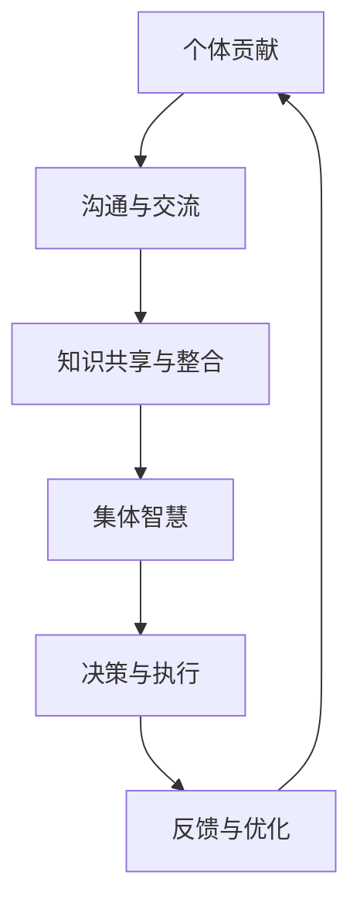

                 

## 文章标题：团队建设：从个体贡献到集体智慧

团队建设是现代组织和企业发展的核心环节，它不仅关乎团队效率，更关系到企业的核心竞争力。本文将深入探讨团队建设的过程，从个体贡献到集体智慧的转化机制，并结合实际案例，为读者提供实用的策略和方法。

### 关键词：

- 团队建设
- 个体贡献
- 集体智慧
- 团队协作
- 数学模型
- 项目实战

### 摘要：

本文旨在揭示团队建设的关键要素，通过理论分析和实际案例，阐述如何通过有效的团队协作，实现从个体贡献到集体智慧的提升。文章分为六个部分，包括团队建设基础、团队协作算法原理、项目实战、挑战与解决方案、未来展望以及附录，旨在为读者提供全方位的团队建设指导。

## 第1章 团队建设基础

### 1.1 团队建设的基本概念

团队建设是一个复杂的系统性工程，涉及多个关键概念，包括个体贡献、集体智慧、团队协作等。个体贡献指的是团队成员在团队活动中所做出的个人努力和成果，而集体智慧则是指通过团队协作，个体贡献所汇集而成的整体智慧。

### 1.2 团队协作的数学模型

团队协作中的数学模型主要包括博弈论和复杂网络理论。博弈论用于分析团队中个体之间的利益分配和策略选择，而复杂网络理论则用于研究团队内信息流动和协作效率。

### Mermaid流程图：团队建设过程与关键环节



### 1.3 团队协作中的关键算法

在团队协作中，关键算法的设计至关重要。以下是一个简单的伪代码，用于描述团队协作的关键流程：

```python
def team_collaboration():
    initialize_communication()
    while not goal_achieved():
        receive_individual_contributions()
        integrate_knowledge()
        make_decision()
        execute_plan()
        receive_feedback()
        optimize_next_step()
    return collective_wisdom
```

## 第2章 团队协作算法原理

### 2.1 个体贡献与集体智慧的关系

个体贡献是集体智慧的基础，而集体智慧则是个体贡献的升华。通过有效的团队协作，个体贡献能够得到最大化利用，从而实现集体智慧的提升。

### 2.2 团队协作策略

团队协作策略包括多智能体系统和协同优化算法。多智能体系统通过分布式计算，实现个体之间的协作与信息共享；而协同优化算法则用于优化团队整体效率。

## 第3章 团队建设项目实战

### 3.1 团队建设案例分析

在本案例中，我们将分析一个实际团队建设项目，包括项目背景、目标、实施过程以及成果评估。

### 3.2 团队协作环境搭建

为了实现高效的团队协作，我们需要搭建一个合适的开发环境。以下是环境搭建的关键步骤：

1. 确定开发工具和框架。
2. 配置服务器和数据库。
3. 安装相关软件和插件。

### 3.3 源代码实现与解读

在本案例中，我们将详细解读关键代码，并分析其实现原理和优化策略。

```java
public class TeamCollaboration {
    // 初始化团队协作环境
    public void initializeEnvironment() {
        // 配置服务器和数据库
        // 安装相关软件和插件
    }

    // 接收个体贡献
    public void receiveContributions() {
        // 实现个体贡献的收集和整合
    }

    // 实现集体智慧
    public void implementCollectiveWisdom() {
        // 将个体贡献转化为集体智慧
    }

    // 决策与执行
    public void makeDecisionAndExecute() {
        // 根据集体智慧进行决策和执行
    }

    // 接收反馈并优化
    public void receiveFeedbackAndOptimize() {
        // 根据反馈进行优化和调整
    }
}
```

### 3.4 代码应用解读与分析

在本案例中，我们将分析代码的具体实现和应用场景，并提供优化建议。

## 第4章 团队建设挑战与解决方案

### 4.1 团队建设中的挑战

团队建设过程中可能会面临多种挑战，如沟通障碍、权力分配不均和冲突管理等。

### 4.2 解决方案与策略

针对上述挑战，我们可以采取以下解决方案和策略：

1. 建立有效的沟通机制。
2. 设计合理的权力分配模型。
3. 采用冲突管理策略。

## 第5章 团队建设未来展望

### 5.1 当前趋势与挑战

随着科技的发展，团队建设面临着新的趋势和挑战。例如，远程办公、跨文化团队协作等。

### 5.2 未来发展方向

未来团队建设将更加智能化、自动化。例如，利用人工智能技术优化团队协作流程，实现更高效的集体智慧。

## 第6章 附录

### 6.1 相关资源与工具

- 团队建设相关书籍
- 开发工具与框架资源

### 6.2 参考文献

- 引用文献列表

## 作者信息

- 作者：AI天才研究院/AI Genius Institute & 禅与计算机程序设计艺术 /Zen And The Art of Computer Programming

### 总结

团队建设是现代企业成功的关键。通过深入理解和应用团队协作算法，实现从个体贡献到集体智慧的提升，企业可以更好地应对市场挑战，实现可持续发展。本文为读者提供了全面的团队建设指南，希望对实际工作有所启发。

（注：本文为示例性文章，具体内容需根据实际情况进行调整和补充。）

