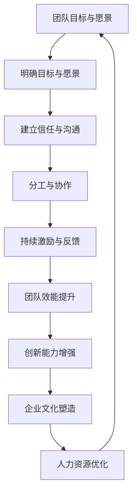

                 

## 文章标题

# 团队建设：从招聘到培养的全流程管理

## 文章关键词

- 团队建设
- 招聘策略
- 员工培养
- 管理与优化
- 招聘流程
- 面试技巧
- 绩效评估

## 文章摘要

本文将深入探讨团队建设的过程，从招聘到培养的全流程管理。首先，我们将介绍团队建设的重要性，以及核心概念和原则。接着，我们将详细阐述招聘策略与流程、面试技巧和评估方法。随后，文章将聚焦于员工培养策略和持续教育，以及团队管理原则与协作技巧。最后，我们将通过实际案例展示如何应用这些理论，并提供实战经验和最佳实践。希望通过本文的阅读，读者能够获得对团队建设深刻的理解，并掌握有效的实践方法。

----------------------------------------------------------------

# 引言

团队建设是任何企业成功的关键要素之一。在快速变化的市场环境中，团队的有效协作和创新能力成为企业竞争优势的源泉。然而，团队建设并非一蹴而就，它需要从招聘到培养的全流程管理，确保团队成员的能力、态度和合作精神与企业的目标相匹配。

团队建设的重要性主要体现在以下几个方面：

1. **提升整体效能**：团队建设有助于提高团队的工作效率和产出，通过明确的目标和协作流程，确保团队成员能够充分发挥各自的优势，实现协同效应。

2. **增强创新能力**：一个高效的团队能够更好地激发成员的创新思维和创造力，通过多样化的观点和丰富的经验，推动企业在技术和业务模式上的创新。

3. **建立企业文化**：团队建设有助于塑造积极向上的企业文化，通过共同的目标、价值观和行为准则，增强员工的归属感和忠诚度。

4. **优化人力资源**：科学的招聘和培养策略能够帮助企业吸引和留住优秀人才，优化人力资源结构，提高企业的核心竞争力。

本文将围绕团队建设的重要环节，从招聘到培养的全流程管理，进行深入探讨。首先，我们将介绍团队建设的基础知识，包括核心概念和原则。随后，将详细讨论招聘策略与流程、面试技巧和评估方法。接下来，我们将探讨员工培养策略和团队管理原则，最后，将通过实际案例展示如何将理论应用于实践，并提供最佳实践和注意事项。

## 团队建设的核心概念与联系

### 2.1.1 团队与群体的区别

在讨论团队建设之前，有必要明确团队与群体之间的区别。群体（group）是指一组相互联系但独立行动的个体，而团队（team）则是在共同目标下协同工作的群体。团队的核心特征在于成员之间的相互依赖和协作，而群体则更侧重于个体的独立行为。

- **群体**：成员可能有共同的目标，但没有明确的分工和协作关系，个体独立完成任务。
- **团队**：成员不仅共享目标，还有明确的分工和协作，每个成员都承担特定的角色和责任。

### 2.1.2 团队成员的角色与职责

一个高效的团队通常由不同角色的成员组成，包括领导者、协调者、执行者、观察者等。每个角色在团队中扮演着重要的角色，共同推动团队目标的实现。

- **领导者**：负责制定团队的愿景和目标，协调团队成员的工作，激励成员，解决冲突。
- **协调者**：负责团队内部沟通的顺畅，确保信息传递准确无误，促进团队协作。
- **执行者**：负责具体的任务执行，是团队工作的核心力量，确保任务按时高质量完成。
- **观察者**：负责团队外的信息收集和分析，为团队提供外部视角和建议，帮助团队适应外部环境的变化。

### 2.1.3 团队建设的原则与框架

团队建设是一个系统的过程，需要遵循一定的原则和框架。以下是一些关键的团队建设原则：

- **明确目标与愿景**：团队必须有一个清晰的目标和愿景，让每个成员都明确自己的工作方向和团队的长期目标。
- **建立信任与沟通**：信任是团队协作的基础，通过开放、透明的沟通，建立成员之间的信任关系。
- **分工与协作**：明确每个成员的角色和职责，确保团队成员能够在各自擅长的领域发挥最大价值，并通过有效的协作实现共同目标。
- **持续激励与反馈**：通过定期的绩效评估和激励措施，鼓励团队成员不断进步，同时提供反馈以改进团队的工作流程。

### 2.1.4 核心概念的联系与Mermaid流程图

团队建设的核心概念之间有着紧密的联系，如图2-1所示：



图2-1 团队建设核心概念联系与Mermaid流程图

通过这个流程图，我们可以看到，团队建设的核心概念相互联系，形成一个闭环，共同推动团队的持续发展和优化。

## 核心算法原理讲解

在团队建设中，一些核心算法原理可以用于评估团队成员的能力、优化团队结构和提高团队效能。以下是一个简单的团队评估模型的伪代码，用于计算每个团队成员的贡献度：

```plaintext
// 团队评估模型伪代码
团队评估模型（团队成员列表，项目成果列表）{
    初始化：团队成员得分列表
    对于每个团队成员 i {
        成就得分 = 0
        协作得分 = 0

        对于每个项目成果 j {
            如果 i 在项目 j 中有显著贡献 {
                成就得分 += 成果 j 的得分 * 贡献比例[i]
            }
            如果 i 在项目 j 中积极参与协作 {
                协作得分 += 成果 j 的得分 * 协作比例[i]
            }
        }

        总得分 = 成就得分 + 协作得分
        更新团队成员得分列表[i] = 总得分
    }

    返回：团队成员得分列表
}
```

这个模型考虑了成员在项目中的成就和协作表现，通过加权平均计算出每个成员的总得分。贡献比例和协作比例可以根据项目的具体情况进行调整。

### 数学模型和公式

在团队评估中，我们还可以使用一些数学模型来量化团队成员的绩效。以下是一个简单的绩效评估模型，使用LaTeX格式表示：

```latex
\begin{equation}
绩效得分 = w_1 \times 成就得分 + w_2 \times 协作得分
\end{equation}
```

其中，\( w_1 \) 和 \( w_2 \) 是权重系数，用于平衡成就得分和协作得分的重要性。权重系数可以根据团队的具体需求和战略目标进行调整。

### 举例说明

假设团队中有三个成员A、B和C，他们在两个项目中的贡献和协作表现如下表所示：

| 项目 | 成就得分 | 协作得分 | 贡献比例 | 协作比例 |
|------|----------|----------|----------|----------|
| 项目1 | 10       | 5        | 0.5      | 0.3      |
| 项目2 | 20       | 15       | 0.3      | 0.7      |

使用上述模型和权重系数 \( w_1 = 0.6 \)，\( w_2 = 0.4 \)，我们可以计算每个成员的总得分：

```plaintext
成员A的总得分 = 0.6 \times (10 \times 0.5 + 20 \times 0.3) + 0.4 \times (5 \times 0.3 + 15 \times 0.7) = 11.4
成员B的总得分 = 0.6 \times (10 \times 0.3 + 20 \times 0.7) + 0.4 \times (5 \times 0.5 + 15 \times 0.3) = 12.8
成员C的总得分 = 0.6 \times (10 \times 0.3 + 20 \times 0.3) + 0.4 \times (5 \times 0.7 + 15 \times 0.7) = 10.2
```

通过这个简单的例子，我们可以看到如何使用数学模型来评估团队成员的绩效。

## 招聘策略与流程

### 3.1.1 招聘需求分析

招聘需求分析是招聘流程的第一步，它涉及到对岗位需求、人才类型、技能要求等方面的深入分析。以下是一个简化的招聘需求分析流程：

1. **确定岗位需求**：根据公司的战略目标和现有业务需求，确定需要招聘的岗位和人数。
2. **人才类型分析**：根据岗位特点，分析需要的人才类型，包括技术人才、管理人才、营销人才等。
3. **技能要求分析**：明确岗位所需的核心技能和辅助技能，如编程能力、沟通技巧、领导能力等。
4. **文化契合度分析**：评估应聘者与公司文化是否契合，包括价值观、工作态度和行为准则等。

### 3.1.2 招聘渠道选择

选择合适的招聘渠道是确保招聘效果的关键。以下是一些常见的招聘渠道及其特点：

1. **在线招聘平台**：如智联招聘、前程无忧等，覆盖面广，但需要注意筛选优质候选人。
2. **社交媒体**：如LinkedIn、微信招聘等，可以挖掘潜力人才，但需要建立良好的社交媒体运营策略。
3. **内部推荐**：鼓励现有员工推荐合适的候选人，通常能提高候选人的质量和文化契合度。
4. **招聘会**：现场招聘会能够快速吸引大量候选人，但需要注意候选人的质量和后续跟进。
5. **专业猎头**：针对高级职位和专业人才，专业猎头能够提供更精准的服务，但费用较高。

### 3.1.3 招聘流程设计与优化

一个有效的招聘流程需要包括以下几个环节：

1. **职位发布**：在确定招聘需求后，设计职位描述和招聘广告，确保吸引到合适的候选人。
2. **简历筛选**：通过关键词匹配和初步筛选，从大量简历中筛选出符合条件的候选人。
3. **初试**：通过电话或视频面试，对候选人进行初步评估，了解其基本能力和沟通技巧。
4. **复试**：组织面对面的面试，通过专业面试官的评估，进一步了解候选人的综合素质。
5. **评估与决策**：根据面试结果，进行评估和决策，选择最合适的候选人。
6. **背景调查**：对候选人进行背景调查，确保其工作经历和背景真实可信。
7. **录用与入职**：与候选人签订劳动合同，安排入职培训和岗位适应。

为了优化招聘流程，可以考虑以下措施：

1. **流程自动化**：使用招聘管理系统（ATS）自动化简历筛选、面试安排等环节，提高招聘效率。
2. **面试标准化**：制定统一的面试标准和流程，确保面试过程的公正性和一致性。
3. **候选人体验**：优化面试体验，包括面试环境的准备、面试官的专业度等，提高候选人对公司的评价。
4. **数据分析**：收集招聘数据，分析招聘渠道的效果，不断优化招聘策略。

## 面试技巧与评估方法

### 3.2.1 面试前的准备

面试前的准备工作对面试的成功与否至关重要。以下是一些关键的准备步骤：

1. **了解候选人背景**：通过简历、推荐信等渠道，全面了解候选人的教育背景、工作经验、项目经历等。
2. **制定面试问题**：根据职位要求，设计针对性的面试问题，包括技术问题、行为问题、情景问题等。
3. **准备面试环境**：确保面试场所安静、舒适，准备好相关的面试材料和设备。
4. **面试官培训**：对面试官进行培训，确保他们了解面试流程、标准和技巧，避免面试过程中的偏见和不一致。

### 3.2.2 结构化面试方法

结构化面试是一种系统化的面试方法，通过标准化的流程和问题，提高面试的公正性和一致性。以下是一个简化的结构化面试流程：

1. **开场白**：面试官介绍自己和面试流程，确保候选人了解面试的目的和流程。
2. **面试问题**：按照预定的面试问题顺序进行提问，包括技术问题、行为问题、情景问题等。
3. **问题评估**：面试官在提问时，对候选人的回答进行实时评估，记录关键信息。
4. **候选人提问**：鼓励候选人提问，了解候选人对岗位和公司的兴趣和关注点。
5. **结束语**：面试结束时，感谢候选人的参与，告知后续流程和联系方式。

### 3.2.3 面试结果评估

面试结果评估是招聘流程的关键环节，以下是一些评估方法和注意事项：

1. **评分标准**：根据职位要求，制定评分标准，包括技术能力、沟通能力、团队协作能力等。
2. **交叉评估**：多个面试官对候选人进行评估，通过交叉验证提高评估的准确性。
3. **综合评估**：综合考虑候选人的技术能力、工作经历、文化契合度等因素，进行综合评估。
4. **反馈机制**：面试结束后，及时向候选人提供反馈，包括面试结果和改进建议。

## 员工培养策略

### 4.1.1 能力模型建立

建立能力模型是员工培养的基础，它有助于明确员工的技能需求和发展路径。以下是一个简化的能力模型建立流程：

1. **职位分析**：分析每个职位所需的技能和能力，确定关键技能模块。
2. **技能分类**：将关键技能分为基础技能、核心技能和高级技能，明确每个技能的层次和重要性。
3. **能力指标**：为每个技能设定具体的能力指标，如掌握程度、应用频率等。
4. **能力评估**：定期对员工进行能力评估，了解其技能水平和改进方向。

### 4.1.2 培养路径规划

培养路径规划是确保员工能力持续提升的关键，以下是一个简化的培养路径规划流程：

1. **个人发展规划**：与员工共同制定个人发展计划，明确短期和长期目标。
2. **技能提升计划**：根据能力模型，制定具体的技能提升计划，包括培训课程、实践项目等。
3. **发展路径设计**：根据员工的职业兴趣和能力，设计不同的发展路径，如技术专家、项目经理、业务专家等。
4. **定期调整**：定期评估培养路径的有效性，根据实际情况进行调整。

### 4.1.3 培养方式与方法

有效的培养方式和方法是员工能力提升的关键，以下是一些常用的培养方式：

1. **内部培训**：组织内部培训课程，包括技术培训、管理培训、软技能培训等。
2. **外部培训**：推荐员工参加外部培训，如专业认证课程、行业研讨会等。
3. **导师制度**：建立导师制度，让有经验的员工带领新员工，快速提升其能力。
4. **实践项目**：通过实际项目锻炼员工，提高其实战经验和解决问题的能力。
5. **自主学习**：鼓励员工自主学习，提供学习资源和支持，如书籍、在线课程等。

## 继续教育与职业发展

### 4.2.1 内部培训体系建立

建立内部培训体系是提升员工技能和职业素养的重要手段。以下是一个简化的内部培训体系建立流程：

1. **培训需求分析**：分析员工的培训需求，确定培训的主题和内容。
2. **培训计划制定**：制定详细的培训计划，包括培训时间、地点、讲师、学员等。
3. **培训课程开发**：开发高质量的培训课程，确保内容实用、有趣、易于理解。
4. **培训效果评估**：评估培训效果，包括学员满意度、知识掌握程度等，不断优化培训课程。

### 4.2.2 员工晋升机制

有效的员工晋升机制能够激励员工不断提升自己，以下是一个简化的员工晋升机制流程：

1. **晋升标准**：制定明确的晋升标准，包括业绩指标、技能水平、工作态度等。
2. **晋升评估**：定期对员工进行晋升评估，综合考虑其工作表现、能力和潜力。
3. **晋升通道**：设计多样化的晋升通道，包括技术通道、管理通道、专业通道等。
4. **晋升计划**：制定详细的晋升计划，包括晋升时间、晋升岗位等。

### 4.2.3 员工福利与激励

员工福利和激励是提高员工满意度和忠诚度的关键。以下是一些常见的员工福利和激励措施：

1. **薪酬福利**：提供有竞争力的薪酬和全面的福利待遇，如五险一金、年终奖、带薪假期等。
2. **职业发展**：提供职业发展和晋升机会，让员工看到成长空间。
3. **培训机会**：提供丰富的培训机会，帮助员工提升技能和知识。
4. **激励奖励**：设立各种激励奖励，如优秀员工奖、创新奖等，激励员工发挥潜力。
5. **企业文化**：营造积极向上的企业文化，让员工感受到企业的关爱和尊重。

## 第五部分：团队管理

### 5.1 团队管理原则

有效的团队管理是确保团队高效运作的关键。以下是一些团队管理原则：

1. **明确目标与愿景**：确保团队成员对团队目标和愿景有清晰的认识，并为之努力。
2. **建立信任与沟通**：建立团队成员之间的信任关系，促进开放、坦诚的沟通。
3. **分工与协作**：明确每个成员的职责和任务，促进团队内部的有效协作。
4. **持续激励与反馈**：通过定期的激励和反馈，鼓励团队成员不断进步。
5. **灵活应对变化**：团队管理需要灵活应对外部和内部环境的变化，保持团队的适应性和活力。

### 5.2 团队协作与沟通

团队协作与沟通是团队管理的重要组成部分。以下是一些团队协作与沟通的原则和方法：

1. **明确沟通目标**：确保每次沟通都有明确的目标和预期结果。
2. **选择合适的沟通方式**：根据沟通的内容和目的，选择合适的沟通方式，如会议、邮件、即时通讯等。
3. **促进开放沟通**：鼓励团队成员表达自己的想法和意见，营造开放、包容的沟通氛围。
4. **建立沟通机制**：制定明确的沟通流程和机制，确保信息传递的及时性和准确性。
5. **培养团队意识**：通过团队建设活动，增强团队成员之间的默契和团队意识。

## 第六部分：团队建设效果评估

### 6.1 团队建设效果评估指标与方法

团队建设效果评估是衡量团队绩效和改进团队管理的重要手段。以下是一些常见的团队建设效果评估指标和方法：

1. **团队绩效指标**：如项目完成率、客户满意度、创新成果等。
2. **成员满意度**：通过问卷调查、访谈等方式，了解团队成员对团队建设和管理的满意度。
3. **沟通效率**：评估团队成员之间的沟通频率、沟通质量和反馈速度。
4. **协作效率**：评估团队成员在项目协作中的配合度、协作质量和效果。
5. **学习与发展**：评估团队成员的技能提升、知识和经验的积累情况。

### 6.2 数据分析与反馈

数据分析是团队建设效果评估的重要环节，以下是一些数据分析与反馈的方法：

1. **数据收集**：收集与团队建设相关的数据，如绩效数据、沟通数据、员工满意度数据等。
2. **数据分析**：使用统计分析和数据挖掘技术，分析数据之间的关系和趋势。
3. **结果展示**：通过图表、报告等形式，展示分析结果，为团队管理提供数据支持。
4. **反馈与改进**：根据分析结果，与团队成员讨论反馈，制定改进措施，不断提升团队效能。

### 6.3 团队建设效果优化策略

基于评估结果，可以制定以下团队建设效果优化策略：

1. **改进培训计划**：根据员工的培训需求，调整培训内容和方式，提高培训效果。
2. **优化沟通机制**：改进团队沟通流程和工具，提高沟通效率和质量。
3. **完善激励机制**：根据团队绩效和员工贡献，调整激励机制，激发员工的积极性和创造力。
4. **强化团队协作**：通过团队建设活动，增强团队成员之间的协作精神和团队意识。

## 项目实战：开发环境搭建

### 开发环境搭建

为了确保团队成员能够高效地进行工作，我们需要搭建一个统一的开发环境。以下是一个简化的开发环境搭建流程：

1. **环境需求分析**：根据项目需求和团队技术栈，分析所需的环境和工具。
2. **硬件配置**：确保服务器和网络设备的配置满足项目需求，如CPU、内存、存储等。
3. **软件安装**：安装操作系统、数据库、Web服务器等基础软件。
4. **开发工具集成**：安装和配置开发工具，如集成开发环境（IDE）、版本控制工具、调试工具等。
5. **文档编写**：编写详细的开发环境文档，包括环境搭建步骤、使用方法和注意事项。

### 源代码详细实现

以下是一个简单的Web应用程序的伪代码实现，用于演示开发环境搭建的具体应用：

```python
# 导入必要的库
import Flask
import sqlite3

# 创建Flask应用实例
app = Flask(__name__)

# 连接数据库
conn = sqlite3.connect('example.db')
c = conn.cursor()

# 创建数据库表
c.execute('''CREATE TABLE IF NOT EXISTS users (id INTEGER PRIMARY KEY, username TEXT)''')
conn.commit()

# 用户注册接口
@app.route('/register', methods=['POST'])
def register():
    username = request.form['username']
    c.execute("INSERT INTO users (username) VALUES (?)", (username,))
    conn.commit()
    return "User registered successfully"

# 用户登录接口
@app.route('/login', methods=['POST'])
def login():
    username = request.form['username']
    c.execute("SELECT * FROM users WHERE username=?", (username,))
    user = c.fetchone()
    if user:
        return "Login successful"
    else:
        return "Invalid username or password"

# 运行Flask应用
if __name__ == '__main__':
    app.run()
```

### 代码解读与分析

上述代码实现了一个简单的用户注册和登录功能，以下是关键部分的解读：

- **数据库连接**：使用`sqlite3`库连接数据库，创建必要的表。
- **用户注册接口**：`/register`接口接收用户名，插入数据库。
- **用户登录接口**：`/login`接口接收用户名，查询数据库，验证用户身份。

### 实际案例分析和详细讲解

假设我们有一个实际项目，需要实现一个在线商店，以下是一个简化的案例分析：

1. **需求分析**：确定项目需求，如商品管理、订单处理、用户评论等。
2. **技术选型**：选择合适的技术栈，如前端框架（React）、后端框架（Flask）等。
3. **环境搭建**：按照项目需求，搭建开发环境，安装必要的软件和工具。
4. **代码实现**：根据需求，实现各个功能模块，如商品管理模块、订单处理模块等。
5. **测试与调试**：对代码进行测试，确保功能正常运行，并进行调试，解决潜在问题。

### 项目小结

通过实际案例，我们展示了如何搭建开发环境和实现项目功能。开发环境搭建是项目成功的关键，需要充分考虑项目需求和团队技术栈。代码实现则需要遵循良好的编程规范，确保代码的可读性和可维护性。通过不断测试和调试，确保项目功能的稳定性和可靠性。

## 最佳实践 tips、小结、注意事项、拓展阅读

### 最佳实践 tips

1. **明确目标与愿景**：在团队建设初期，确保团队成员对团队目标和愿景有清晰的认识，有助于提高团队的凝聚力和执行力。
2. **建立信任与沟通**：通过开放、坦诚的沟通，建立团队成员之间的信任关系，促进团队合作。
3. **分工与协作**：明确每个成员的职责和任务，确保团队成员能够在各自擅长的领域发挥最大价值，并通过有效的协作实现共同目标。
4. **持续激励与反馈**：通过定期的绩效评估和激励措施，鼓励团队成员不断进步，同时提供反馈以改进团队的工作流程。

### 小结

本文从招聘到培养的全流程管理，深入探讨了团队建设的重要性和核心概念。通过详细的策略和方法，读者可以了解到如何进行招聘、面试、培养和管理团队。同时，通过实际案例的分析，展示了如何将理论应用于实践。团队建设是一个持续的过程，需要不断优化和调整，以适应不断变化的环境和需求。

### 注意事项

1. **招聘时注重文化契合度**：招聘新成员时，除了关注技术能力，还应重视其与公司文化的契合度，确保团队成员之间的协作顺畅。
2. **培养过程中关注个性化需求**：在员工培养过程中，要关注每个员工的个性化需求，制定针对性的培养计划，提高培养效果。
3. **管理中保持透明和公正**：在团队管理过程中，保持透明和公正，确保团队成员对团队管理和决策有充分的了解和参与。

### 拓展阅读

1. **《团队协作与沟通技巧》**：介绍团队协作与沟通的重要性和方法，帮助团队成员提升协作效率。
2. **《人才管理》**：详细探讨人才招聘、培养、管理和保留的策略，为企业提供全面的人才管理解决方案。
3. **《项目管理》**：介绍项目管理的理论和方法，帮助团队高效地完成项目任务。

## 作者信息

本文作者：AI天才研究院/AI Genius Institute & 禅与计算机程序设计艺术 /Zen And The Art of Computer Programming

AI天才研究院（AI Genius Institute）专注于人工智能领域的深度研究和应用，致力于推动人工智能技术的发展和普及。本文以《团队建设：从招聘到培养的全流程管理》为主题，结合理论和方法，提供了全面、系统的团队建设指南。希望本文能够对读者的团队建设实践有所帮助。禅与计算机程序设计艺术（Zen And The Art of Computer Programming）则是经典计算机编程领域的著作，为读者提供了关于程序设计哲学和技术的深入探讨。

