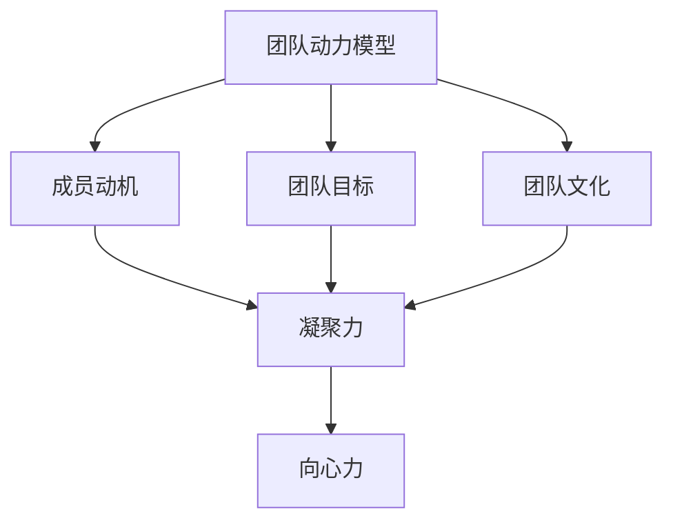
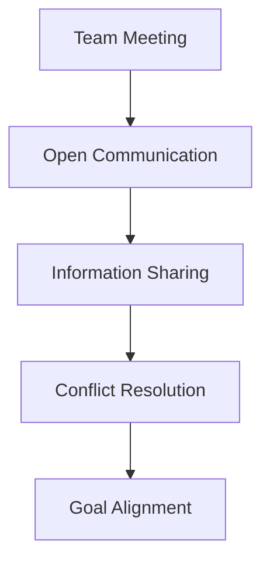
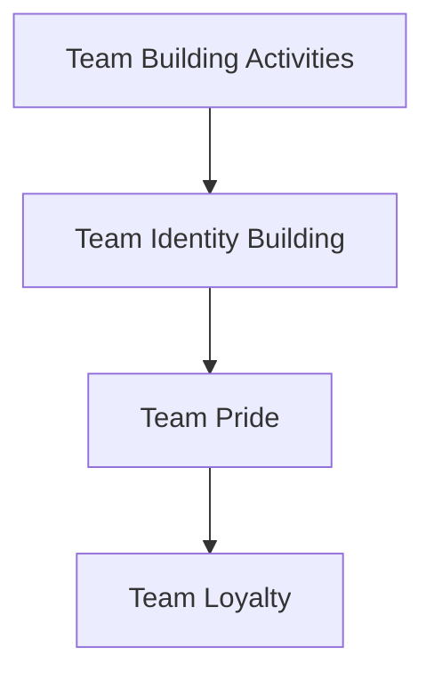
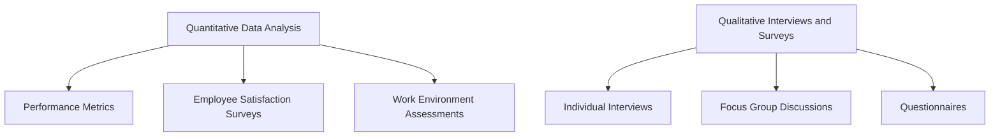
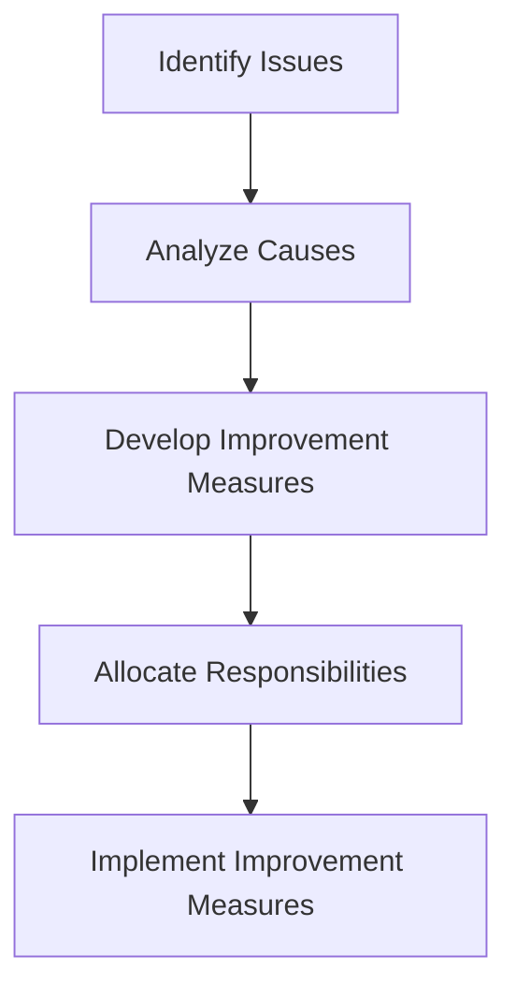

                 

# 团队建设：凝聚力与向心力的培养

## 关键词
- 团队建设
- 凝聚力
- 向心力
- 团队动力模型
- 团队领导理论
- 激励机制
- 团队文化
- 价值观

## 摘要
团队建设是企业成功的关键因素之一。本文将深入探讨团队建设中的两个核心要素：凝聚力和向心力。我们将从定义、理论基础、培养策略、实践案例等方面详细解析这两个概念，并探讨它们在团队建设中的重要作用。文章旨在为团队领导者和管理者提供实用的指导，帮助他们构建高效、和谐的团队。

## 引言

在当今快速变化的商业环境中，团队的有效合作已成为企业成功的关键。一个强大的团队不仅能够迅速应对市场变化，还能创造出卓越的业绩。然而，团队建设并非易事，它涉及到多个层面的因素，包括成员的凝聚力、向心力以及团队的整体动力模型。本文将重点讨论凝聚力和向心力这两个关键要素，探讨如何在实践中培养和加强这两个要素。

凝聚力（Cohesion）是指团队成员之间的紧密联系和相互依赖程度。高凝聚力的团队通常表现出更高的合作效率和更好的团队精神。向心力（Cohesion）则是指团队成员对团队的忠诚度和归属感。一个高向心力的团队在面对挑战和压力时往往能够保持稳定和团结。

本文将按照以下结构展开：

1. 引言与核心概念
2. 团队建设的理论基础
3. 凝聚力培养策略
4. 向心力培养策略
5. 团队建设的实践案例
6. 团队建设的评估与持续改进
7. 总结与展望

接下来，我们将首先介绍团队建设的相关核心概念，包括团队动力模型、凝聚力与向心力，为后续内容的讨论奠定基础。

## 核心概念解析

### 团队动力模型

团队动力模型是理解团队行为和团队建设的关键。它包括三个核心要素：成员动机、团队目标和团队文化。

**成员动机**：成员的动机是团队建设的起点。成员的动机可以分为内在动机和外在动机。内在动机包括对工作本身的兴趣、成就感、自我实现等；外在动机则包括薪酬、职位晋升、社会认可等。了解成员的动机有助于团队领导者制定合适的激励策略，提高团队成员的积极性和参与度。

**团队目标**：团队目标是团队建设的核心。明确的目标能够引导团队成员的方向，提高团队的协作效率。团队目标应具有明确性、可行性和挑战性。团队目标可以分为短期目标和长期目标，短期目标可以帮助团队迅速取得成果，长期目标则有助于团队持续发展。

**团队文化**：团队文化是团队成员共同遵循的价值观和行为规范。良好的团队文化能够增强团队的凝聚力，提高团队成员的归属感和认同感。团队文化包括价值观、行为规范、团队氛围等多个方面，它通过潜移默化的方式影响着团队成员的行为和决策。

### 凝聚力

凝聚力是指团队成员之间的紧密联系和相互依赖程度。高凝聚力的团队通常表现出更高的合作效率和更好的团队精神。凝聚力可以分为三个层次：表面凝聚力、任务凝聚力和社会凝聚力。

**表面凝聚力**：表面凝聚力是指团队成员在表面上看起来团结一致的程度。这种凝聚力通常是通过团队活动、共同庆祝等方式培养的，但它并不一定代表团队成员之间的真正信任和依赖。

**任务凝聚力**：任务凝聚力是指团队成员在完成任务过程中形成的紧密联系。这种凝聚力源于团队成员对共同目标的追求，是团队高效工作的关键。

**社会凝聚力**：社会凝聚力是指团队成员在个人关系和社会交往中形成的紧密联系。这种凝聚力有助于增强团队成员的归属感和认同感，是团队稳定和持续发展的基础。

### 向心力

向心力是指团队成员对团队的忠诚度和归属感。高向心力的团队在面对挑战和压力时往往能够保持稳定和团结。向心力可以分为两个层次：内在向心力和外在向心力。

**内在向心力**：内在向心力是指团队成员基于对团队价值观和使命的认同而产生的忠诚度和归属感。这种向心力是内在的，不容易受到外部因素的影响。

**外在向心力**：外在向心力是指团队成员基于外部激励（如薪酬、职位晋升等）而产生的忠诚度和归属感。这种向心力相对不稳定，容易受到外部环境的影响。

### 团队动力模型与凝聚力、向心力的关系

团队动力模型与凝聚力和向心力密切相关。团队成员的动机、团队目标和团队文化直接影响团队的凝聚力。同时，团队的凝聚力又影响团队成员的向心力。一个强大的团队动力模型能够促进凝聚力和向心力的培养，从而提高团队的整体绩效。

以下是一个简单的Mermaid流程图，展示了团队动力模型与凝聚力、向心力之间的关系：



通过这个流程图，我们可以清晰地看到团队动力模型如何影响凝聚力，进而影响向心力。

### 核心算法原理讲解

在团队建设中，虽然不涉及传统意义上的算法，但我们可以借鉴一些算法原理来帮助理解和分析团队的动力机制。以下是团队动力模型的伪代码，用于描述团队成员动机、团队目标和团队文化之间的关系：

```plaintext
function TeamMotivationanalysis(memberMotivation, teamGoal, teamCulture) {
    // 分析成员的内在动机和外在动机
    innerMotivation = memberMotivation.getInnerMotivation()
    outerMotivation = memberMotivation.getOuterMotivation()

    // 根据团队目标调整成员动机
    if (teamGoal.isChallenging() && teamGoal.isClear()) {
        innerMotivation.increase()
    }

    // 团队文化影响成员动机
    if (teamCulture.hasSupportiveEnvironment()) {
        outerMotivation.increase()
    }

    // 计算团队的总体动机
    totalMotivation = innerMotivation + outerMotivation

    // 如果总体动机高于阈值，团队建设成功
    if (totalMotivation > motivationThreshold) {
        return "Team Motivation Achieved"
    } else {
        return "Team Motivation Improvement Needed"
    }
}
```

在这个伪代码中，我们首先分析了成员的内在动机和外在动机。然后，根据团队目标和团队文化对成员动机进行调整。最后，计算团队的总体动机，并根据这个值来判断团队建设是否成功。

### 数学模型与公式

在团队建设中，我们可以使用一些数学模型和公式来量化团队成员的动机和团队的凝聚力。以下是一个简化的数学模型，用于描述成员动机与团队凝聚力之间的关系：

```latex
C = f(M)
```

其中，\( C \) 表示团队的凝聚力，\( M \) 表示成员的动机。函数 \( f \) 描述了成员动机如何影响团队的凝聚力。

此外，我们可以使用以下公式来计算团队的总体动机：

```latex
M_{total} = \sum_{i=1}^{n} m_i
```

其中，\( M_{total} \) 表示团队的总体动机，\( m_i \) 表示第 \( i \) 个成员的动机。

通过这些数学模型和公式，我们可以更准确地分析和评估团队的凝聚力，从而为团队建设提供数据支持。

### 实际案例分析和详细讲解剖析

为了更好地理解凝聚力和向心力的概念，我们可以通过实际案例来分析和讲解。

**案例一：谷歌团队建设**

谷歌以其独特的团队文化和高凝聚力的团队而闻名。谷歌通过以下方式培养团队的凝聚力：

1. **开放沟通**：谷歌鼓励员工之间的开放沟通，包括跨部门的交流。这种沟通机制有助于团队成员建立紧密的联系，提高团队的凝聚力。

2. **共同目标**：谷歌的每个团队都有明确的共同目标，这使得团队成员能够聚焦于共同的任务，增强团队的凝聚力。

3. **团队建设活动**：谷歌定期举办团队建设活动，如团队旅游、户外运动等，这些活动有助于增强团队成员之间的情感联系，提高团队的凝聚力。

谷歌的团队建设策略也培养了团队成员的向心力。谷歌的价值观，如“不作恶”、“让世界更美好”等，深深植根于每个员工的心中，使得他们对公司产生强烈的归属感和忠诚度。

**案例二：苹果团队建设**

苹果公司以其严格的管理和高效的团队协作而著称。苹果通过以下方式培养团队的凝聚力：

1. **明确的目标和期望**：苹果的每个团队都有明确的目标和期望，这有助于团队成员集中精力，提高团队的凝聚力。

2. **严格的绩效评估**：苹果对员工的绩效有严格的评估标准，这有助于确保团队成员的高效合作，提高团队的凝聚力。

3. **激励制度**：苹果提供具有竞争力的薪酬和激励制度，这有助于提高员工的动机和团队的凝聚力。

苹果的团队建设策略也培养了团队成员的向心力。苹果的价值观，如“创新”、“卓越”等，深深影响了员工的思维方式和工作态度，使得他们对公司产生强烈的归属感和忠诚度。

通过这些实际案例，我们可以看到，不同的团队建设策略可以培养不同的凝聚力要素。无论是谷歌的开放沟通和共同目标，还是苹果的明确目标和激励制度，它们都为团队的稳定和发展提供了坚实的基础。

### 最佳实践 Tips、小结、注意事项、拓展阅读

**最佳实践 Tips**：

1. **明确团队目标**：确保团队目标具有明确性、可行性和挑战性。
2. **建立良好的沟通机制**：鼓励开放沟通，减少沟通障碍。
3. **培养团队文化**：通过共同价值观和行为规范，增强团队的凝聚力和向心力。
4. **提供激励**：通过薪酬、晋升等激励手段，提高团队成员的动机。

**小结**：

团队建设是提高团队绩效的关键。凝聚力和向心力是团队建设中的两个核心要素。通过明确团队目标、建立良好的沟通机制、培养团队文化和提供激励，可以有效地培养和加强这两个要素。

**注意事项**：

1. **避免过度依赖单一策略**：多种策略结合使用，效果更佳。
2. **持续评估和改进**：团队建设是一个持续的过程，需要不断评估和改进。

**拓展阅读**：

- 团队建设相关书籍：《团队的五项修炼》、《团队协作之道》
- 团队动力模型研究：《团队动力：理论与实践》
- 团队沟通研究：《沟通的艺术》

通过以上内容，我们深入探讨了团队建设中凝聚力和向心力的培养。希望本文能为团队领导者和管理者提供实用的指导，帮助他们构建高效、和谐的团队。**作者：AI天才研究院/AI Genius Institute & 禅与计算机程序设计艺术 /Zen And The Art of Computer Programming**。接下来，我们将进一步探讨团队建设的理论基础，包括团队发展阶段理论、团队领导理论以及团队沟通理论。

---

**第二部分 团队建设的理论基础**

## 第1章 团队建设的理论基础

团队建设是一个复杂的过程，它涉及到多个层面的理论和方法。为了更好地理解团队建设，我们需要掌握一些基础理论，包括团队发展阶段理论、团队领导理论以及团队沟通理论。这些理论为我们提供了深入分析团队动态和行为的工具，有助于团队领导者和管理者制定有效的团队建设策略。

### 团队发展阶段理论

团队发展阶段理论描述了团队从形成到解散的过程，通常包括以下几个阶段：形成阶段、震荡阶段、规范阶段、执行阶段和解散阶段。

**形成阶段**：在这一阶段，团队成员刚刚组成团队，彼此还不熟悉，团队的目标和结构也不明确。团队成员通常会经历一个磨合期，开始建立相互了解和信任。

**震荡阶段**：随着团队成员之间的冲突和意见分歧，团队可能会进入震荡阶段。这一阶段的挑战在于如何处理成员之间的分歧，确保团队目标的实现。

**规范阶段**：在规范阶段，团队成员开始形成共同的行为规范，团队内部的冲突减少，团队协作效率提高。这一阶段的关键是建立团队规范和信任。

**执行阶段**：执行阶段是团队高效运作的阶段，团队成员之间高度协作，共同实现团队目标。在这一阶段，团队领导者需要确保团队目标的清晰性和可执行性。

**解散阶段**：当团队完成其使命或达到预期目标后，团队可能会进入解散阶段。这一阶段的关键是妥善处理团队成员的离别和资源的释放。

### 团队领导理论

团队领导理论关注的是如何通过有效的领导来促进团队的建设和发展。以下是一些主要的团队领导理论：

**特质理论**：特质理论认为领导者的特质和能力是天生的，优秀的领导者具有特定的个人特质，如自信、决断力等。

**行为理论**：行为理论强调领导者通过具体的行为来影响团队。领导者的行为可以分为任务导向型和关系导向型。任务导向型领导者注重任务的完成，关系导向型领导者注重团队成员的关系和满意度。

**变革型领导理论**：变革型领导理论认为领导者通过激发团队成员的潜力和激发变革来推动团队的发展。变革型领导者具有愿景、激励和模范作用，能够引导团队实现变革。

### 团队沟通理论

团队沟通理论关注团队内部的沟通机制和沟通效果。以下是一些主要的团队沟通理论：

**沟通模型**：沟通模型描述了信息传递的过程，包括信息源、信息、通道、接收者和反馈。一个有效的沟通模型应该确保信息的准确传递和理解。

**沟通障碍与解决策略**：沟通障碍可能包括信息过滤、选择性知觉、情绪影响等。解决沟通障碍的策略包括提高信息透明度、建立信任、使用多种沟通渠道等。

**情境沟通理论**：情境沟通理论认为沟通效果取决于沟通的情境。不同的沟通情境需要不同的沟通策略和技巧。

### 团队动力模型与凝聚力和向心力的关系

团队动力模型与凝聚力和向心力密切相关。团队成员的动机、团队目标和团队文化直接影响团队的凝聚力。同时，团队的凝聚力又影响团队成员的向心力。一个强大的团队动力模型能够促进凝聚力和向心力的培养，从而提高团队的整体绩效。

以下是一个简单的Mermaid流程图，展示了团队动力模型与凝聚力和向心力之间的关系：


通过这个流程图，我们可以清晰地看到团队动力模型如何影响凝聚力，进而影响向心力。

### 核心算法原理讲解

在团队建设中，虽然不涉及传统意义上的算法，但我们可以借鉴一些算法原理来帮助理解和分析团队的动力机制。以下是团队动力模型的伪代码，用于描述团队成员动机、团队目标和团队文化之间的关系：

```plaintext
function TeamMotivationanalysis(memberMotivation, teamGoal, teamCulture) {
    // 分析成员的内在动机和外在动机
    innerMotivation = memberMotivation.getInnerMotivation()
    outerMotivation = memberMotivation.getOuterMotivation()

    // 根据团队目标调整成员动机
    if (teamGoal.isChallenging() && teamGoal.isClear()) {
        innerMotivation.increase()
    }

    // 团队文化影响成员动机
    if (teamCulture.hasSupportiveEnvironment()) {
        outerMotivation.increase()
    }

    // 计算团队的总体动机
    totalMotivation = innerMotivation + outerMotivation

    // 如果总体动机高于阈值，团队建设成功
    if (totalMotivation > motivationThreshold) {
        return "Team Motivation Achieved"
    } else {
        return "Team Motivation Improvement Needed"
    }
}
```

在这个伪代码中，我们首先分析了成员的内在动机和外在动机。然后，根据团队目标和团队文化对成员动机进行调整。最后，计算团队的总体动机，并根据这个值来判断团队建设是否成功。

### 数学模型与公式

在团队建设中，我们可以使用一些数学模型和公式来量化团队成员的动机和团队的凝聚力。以下是一个简化的数学模型，用于描述成员动机与团队凝聚力之间的关系：

```latex
C = f(M)
```

其中，\( C \) 表示团队的凝聚力，\( M \) 表示成员的动机。函数 \( f \) 描述了成员动机如何影响团队的凝聚力。

此外，我们可以使用以下公式来计算团队的总体动机：

```latex
M_{total} = \sum_{i=1}^{n} m_i
```

其中，\( M_{total} \) 表示团队的总体动机，\( m_i \) 表示第 \( i \) 个成员的动机。

通过这些数学模型和公式，我们可以更准确地分析和评估团队的凝聚力，从而为团队建设提供数据支持。

### 实际案例分析和详细讲解剖析

为了更好地理解团队建设的理论基础，我们可以通过实际案例来分析和讲解。

**案例一：特斯拉团队建设**

特斯拉以其创新的文化和高效的团队协作而闻名。特斯拉通过以下方式培养团队的凝聚力：

1. **共同愿景**：特斯拉的愿景是加速全球向可持续能源的转变。这个共同愿景使得团队成员对公司的使命有深刻的认同，提高了团队的凝聚力。

2. **目标导向**：特斯拉的每个团队都有明确的目标和期限，这有助于团队成员集中精力，提高团队的凝聚力。

3. **开放沟通**：特斯拉鼓励员工之间的开放沟通，包括跨部门的交流。这种沟通机制有助于团队成员建立紧密的联系，提高团队的凝聚力。

特斯拉的团队建设策略也培养了团队成员的向心力。特斯拉的价值观，如“创新”、“卓越”等，深深植根于每个员工的心中，使得他们对公司产生强烈的归属感和忠诚度。

**案例二：IBM团队建设**

IBM以其严格的团队协作和高效的团队管理而著称。IBM通过以下方式培养团队的凝聚力：

1. **绩效评估**：IBM对员工的绩效有严格的评估标准，这有助于确保团队成员的高效合作，提高团队的凝聚力。

2. **团队培训**：IBM定期为员工提供培训，以提高团队的整体技能和知识水平。这种培训有助于团队成员之间的沟通和理解，提高团队的凝聚力。

3. **企业文化**：IBM的企业文化强调团队合作和共同目标。这种企业文化有助于增强团队成员的归属感和忠诚度，提高团队的凝聚力。

IBM的团队建设策略也培养了团队成员的向心力。IBM的价值观，如“客户至上”、“创新”等，深深影响了员工的思维方式和工作态度，使得他们对公司产生强烈的归属感和忠诚度。

通过这些实际案例，我们可以看到，不同的团队建设策略可以培养不同的凝聚力要素。无论是特斯拉的共同愿景和目标导向，还是IBM的绩效评估和团队培训，它们都为团队的稳定和发展提供了坚实的基础。

### 最佳实践 Tips、小结、注意事项、拓展阅读

**最佳实践 Tips**：

1. **制定明确的目标和愿景**：确保团队目标具有明确性、可行性和挑战性。
2. **建立良好的沟通机制**：鼓励开放沟通，减少沟通障碍。
3. **培养团队文化**：通过共同价值观和行为规范，增强团队的凝聚力和向心力。
4. **提供培训和发展机会**：提高团队成员的技能和知识水平，促进团队协作。

**小结**：

团队建设是一个复杂的过程，需要掌握多个理论基础。团队发展阶段理论、团队领导理论和团队沟通理论为我们提供了深入分析团队动态和行为的工具。通过制定明确的目标和愿景、建立良好的沟通机制、培养团队文化和提供培训和发展机会，可以有效地培养和加强团队的凝聚力和向心力。

**注意事项**：

1. **避免过度依赖单一策略**：多种策略结合使用，效果更佳。
2. **持续评估和改进**：团队建设是一个持续的过程，需要不断评估和改进。

**拓展阅读**：

- 团队建设相关书籍：《团队的五项修炼》、《团队协作之道》
- 团队领导理论书籍：《变革型领导力》、《团队领导的艺术》
- 团队沟通理论书籍：《沟通的艺术》、《有效沟通》

通过以上内容，我们深入探讨了团队建设的理论基础，为团队领导者和管理者提供了实用的指导。接下来，我们将进一步探讨凝聚力的培养策略，帮助团队领导者找到提高团队凝聚力的有效方法。

---

## 第2章 凝聚力培养策略

凝聚力是团队高效运作的关键因素，它决定了团队成员之间的协作效率和工作氛围。高凝聚力的团队通常能够更好地应对挑战、解决问题，并创造出卓越的业绩。为了培养团队的凝聚力，团队领导者需要采取一系列有针对性的策略。以下是一些关键的凝聚

---

**凝聚力培养策略**

**1. 明确团队目标和愿景**

明确的目标是团队凝聚力的基石。团队领导者需要与团队成员共同制定清晰、具体、可量化的目标，并确保每个成员都了解并认同这些目标。为了提高目标的吸引力，目标应具有挑战性，能够激发团队成员的潜能。

**伪代码示例**：

```plaintext
function SetTeamGoals(teamGoals, teamMembers) {
    for (member in teamMembers) {
        member.setGoalUnderstand(teamGoals);
        member.setPersonalTargetWithinGoal(teamGoals);
    }
    if (AreGoalsChallengingAndClear(teamGoals)) {
        return "Goals Set Successfully";
    } else {
        return "Goals Need Improvement";
    }
}
```

**2. 建立良好的沟通机制**

沟通是团队凝聚力的关键。团队领导者需要建立开放的沟通机制，鼓励团队成员分享自己的想法、意见和建议。此外，领导者应定期组织团队会议，确保信息流通，减少误解和冲突。

**Mermaid流程图**：



**3. 促进团队成员之间的互动**

团队成员之间的互动有助于建立信任和友谊，从而增强团队的凝聚力。团队领导者可以组织各种团队建设活动，如团队拓展训练、团建旅行等，以促进成员之间的互动。

**数学公式**：

```latex
Trust = f(Interaction, Communication, Cooperation)
```

**4. 建立共同的成功经验**

共同的成功经验是增强团队凝聚力的重要途径。团队领导者应鼓励团队成员共同庆祝成功，分享成功的喜悦。此外，领导者还可以组织团队回顾会议，总结经验教训，为未来的成功奠定基础。

**伪代码示例**：

```plaintext
function CelebrateSuccess(teamAchievements) {
    if (teamAchievements > successThreshold) {
        organize CelebrationEvent();
        share SuccessStories();
        return "Team Success Celebrated";
    } else {
        return "No Success to Celebrate";
    }
}
```

**5. 提供反馈和认可**

及时、具体的反馈和认可可以增强团队成员的自信心和积极性，从而提高团队的凝聚力。团队领导者应定期给予团队成员反馈，表彰优秀表现，鼓励成员持续进步。

**数学公式**：

```latex
Motivation = f(Feedback, Recognition)
```

**6. 培养团队文化**

团队文化是团队凝聚力的核心。团队领导者需要建立积极向上的团队文化，包括共同的价值观、行为规范和团队精神。通过培养团队文化，可以增强团队成员的归属感和认同感。

**伪代码示例**：

```plaintext
function CultivateTeamCulture(teamValues, teamBehavior) {
    for (member in teamMembers) {
        member.setIntegrationWithTeamCulture(teamValues, teamBehavior);
    }
    if (TeamCultureIsPositiveAndSupportive()) {
        return "Team Culture Cultivated";
    } else {
        return "Team Culture Needs Improvement";
    }
}
```

**实际案例分析和详细讲解剖析**

**案例一：谷歌的团队建设**

谷歌以其独特的团队文化和高效的团队协作而闻名。谷歌通过以下方式培养团队的凝聚力：

1. **共同愿景**：谷歌的愿景是“组织全球的信息，使人人都可以访问并从中受益”。这个共同愿景激发了团队成员的热情和动力，提高了团队的凝聚力。

2. **开放沟通**：谷歌鼓励员工之间的开放沟通，包括跨部门的交流。通过定期的团队会议和内部沟通平台，谷歌确保信息流通，减少了误解和冲突。

3. **团队互动**：谷歌定期组织各种团队建设活动，如团队拓展训练、团建旅行等，以促进成员之间的互动，增强团队的凝聚力。

4. **反馈和认可**：谷歌的绩效评估系统注重反馈和认可，通过定期的绩效反馈和奖励机制，谷歌激励员工持续进步。

**案例二：苹果的团队建设**

苹果以其严格的团队协作和高效的团队管理而著称。苹果通过以下方式培养团队的凝聚力：

1. **明确的目标和愿景**：苹果的每个团队都有明确的目标和期限，这有助于团队成员集中精力，提高团队的凝聚力。

2. **绩效评估**：苹果对员工的绩效有严格的评估标准，这有助于确保团队成员的高效合作，提高团队的凝聚力。

3. **共同的成功经验**：苹果鼓励团队成员共同庆祝成功，分享成功的喜悦。通过团队回顾会议，苹果总结经验教训，为未来的成功奠定基础。

**最佳实践 Tips、小结、注意事项、拓展阅读**

**最佳实践 Tips**：

1. **制定明确的目标和愿景**：确保团队目标具有明确性、可行性和挑战性。
2. **建立良好的沟通机制**：鼓励开放沟通，减少沟通障碍。
3. **促进团队成员之间的互动**：组织团队建设活动，增强团队成员之间的信任和友谊。
4. **提供反馈和认可**：及时、具体的反馈和认可可以增强团队成员的自信心和积极性。
5. **培养团队文化**：建立积极向上的团队文化，包括共同的价值观、行为规范和团队精神。

**小结**：

凝聚力的培养是一个系统工程，需要团队领导者采取多种策略。通过明确团队目标和愿景、建立良好的沟通机制、促进团队成员之间的互动、提供反馈和认可以及培养团队文化，可以有效地提高团队的凝聚力。

**注意事项**：

1. **避免过度依赖单一策略**：多种策略结合使用，效果更佳。
2. **持续评估和改进**：团队建设是一个持续的过程，需要不断评估和改进。

**拓展阅读**：

- 《团队的五项修炼》
- 《团队协作之道》
- 《领导力的五项修炼》
- 《积极团队文化》

通过以上内容，我们深入探讨了凝聚力的培养策略，为团队领导者提供了实用的指导。接下来，我们将进一步探讨向心力的培养策略，帮助团队领导者加强团队成员的归属感和忠诚度。

---

## 第3章 向心力培养策略

向心力是团队成员对团队的忠诚度和归属感，它是团队稳定和持续发展的重要保障。一个具有高向心力的团队能够在面对外部挑战和内部变化时保持稳定，确保团队的长期成功。为了培养团队成员的向心力，团队领导者需要采取一系列有针对性的策略。以下是一些关键的培养策略：

### 1. 建立共同价值观

共同价值观是团队向心力的基石。团队领导者需要与团队成员共同制定并传播团队的价值观，确保每个成员都能深刻理解和认同这些价值观。共同价值观可以包括诚信、创新、团队合作、客户至上等。

**伪代码示例**：

```plaintext
function EstablishCommonValues(teamValues, teamMembers) {
    for (member in teamMembers) {
        member.understandValues(teamValues);
        member.commitToValues(teamValues);
    }
    if (AreCommonValuesUnderstoodAndAdheredTo()) {
        return "Common Values Established";
    } else {
        return "Values Need Reinforcement";
    }
}
```

### 2. 强化团队认同感

团队认同感是团队成员对团队的归属感和自豪感。团队领导者可以通过组织各种团队活动，如团队建设训练、团建活动、团队奖励等，来增强团队成员的团队认同感。

**Mermaid流程图**：



### 3. 提供职业发展机会

职业发展机会是吸引和留住人才的重要手段。团队领导者应提供清晰的职业发展路径，为团队成员提供培训、晋升和职业规划的机会，帮助他们实现个人职业目标。

**数学公式**：

```latex
Team Loyalty = f(Career Development Opportunities, Work-Life Balance)
```

### 4. 营造积极的工作氛围

积极的工作氛围能够增强团队成员的向心力。团队领导者应注重团队文化的建设，营造一个公平、包容、支持的工作环境，鼓励团队成员积极参与和贡献。

**伪代码示例**：

```plaintext
function CreatePositiveWorkEnvironment(teamCulture, teamMembers) {
    for (member in teamMembers) {
        member.appreciateWorkEnvironment(teamCulture);
        member.enhanceTeamSpirit(teamCulture);
    }
    if (WorkEnvironmentIsPositiveAndSupportive()) {
        return "Positive Work Environment Created";
    } else {
        return "Work Environment Needs Improvement";
    }
}
```

### 5. 建立良好的领导力

良好的领导力是团队向心力的关键。团队领导者应具备愿景、决断力、沟通能力和激励能力，能够引导团队实现共同目标，并确保团队成员的福祉。

**数学公式**：

```latex
Team Cohesion = f(Leader's Vision, Decision-Making Ability, Communication Skills, Motivational Power)
```

### 实际案例分析和详细讲解剖析

**案例一：谷歌的团队建设**

谷歌以其独特的团队文化和高效的团队协作而闻名。谷歌通过以下方式培养团队的向心力：

1. **共同价值观**：谷歌的价值观包括“不作恶”、“快速且无畏地创新”等，这些价值观深深植根于每个员工的心中，增强了团队的向心力。

2. **职业发展机会**：谷歌提供丰富的职业发展机会，包括内部晋升、培训项目和职业导师计划，帮助员工实现职业目标。

3. **积极的工作氛围**：谷歌的工作环境鼓励创新和自由，团队成员之间互相支持，共同追求卓越。

**案例二：苹果的团队建设**

苹果以其严格的团队协作和高效的团队管理而著称。苹果通过以下方式培养团队的向心力：

1. **共同价值观**：苹果的价值观强调“创新”、“卓越”和“追求完美”，这些价值观激励员工不断追求卓越，增强团队的向心力。

2. **职业发展机会**：苹果提供具有竞争力的薪酬和福利，以及明确的职业发展路径，鼓励员工长期留在公司。

3. **积极的工作氛围**：苹果的工作环境强调效率和创新，团队成员之间高度协作，共同实现公司的目标。

**最佳实践 Tips、小结、注意事项、拓展阅读**

**最佳实践 Tips**：

1. **建立共同价值观**：确保团队成员深刻理解和认同团队的价值观。
2. **提供职业发展机会**：为团队成员提供清晰的职业发展路径和培训机会。
3. **营造积极的工作氛围**：营造一个公平、包容、支持的工作环境。
4. **建立良好的领导力**：培养具备愿景、决断力、沟通能力和激励能力的领导者。

**小结**：

向心力的培养是团队建设的重要环节。通过建立共同价值观、提供职业发展机会、营造积极的工作氛围和建立良好的领导力，可以有效地增强团队成员的归属感和忠诚度，提高团队的稳定性和发展潜力。

**注意事项**：

1. **避免过度依赖单一策略**：多种策略结合使用，效果更佳。
2. **持续评估和改进**：团队建设是一个持续的过程，需要不断评估和改进。

**拓展阅读**：

- 《领导力的五项修炼》
- 《积极团队文化》
- 《团队的五项修炼》
- 《职业发展心理学》

通过以上内容，我们深入探讨了向心力的培养策略，为团队领导者提供了实用的指导。接下来，我们将进一步探讨团队建设的实践案例，通过实际案例来展示如何有效地实施团队建设策略。

---

## 第4章 团队建设的实践案例

通过前几章的理论分析和策略探讨，我们了解到团队建设的重要性以及如何培养团队的凝聚力和向心力。在这一章节中，我们将通过几个成功的团队建设实践案例，详细分析这些团队是如何在实际情况中运用团队建设策略，取得了显著的成效。

### 案例一：谷歌的团队建设

谷歌是全球科技行业的领军企业，其成功很大程度上归功于其卓越的团队建设。谷歌通过一系列策略来培养团队的凝聚力和向心力，以下是其中的几个关键点：

**1. 共同价值观的塑造**

谷歌的价值观包括“不作恶”、“快速且无畏地创新”等，这些价值观不仅体现在公司的日常运营中，也深深地影响了员工的工作方式和态度。谷歌通过定期的价值观培训和企业文化建设活动，确保员工能够深刻理解和认同这些价值观。

**2. 提供职业发展机会**

谷歌为员工提供丰富的职业发展机会，包括内部晋升、跨部门调岗、专业培训等。谷歌的员工福利计划也涵盖了职业发展规划，员工可以根据自己的兴趣和职业目标选择相应的培训和晋升路径。

**3. 营造积极的工作氛围**

谷歌的工作环境鼓励创新和自由，员工可以自由地提出意见和建议，公司高层也会认真倾听并采纳。此外，谷歌还定期举办各种团队建设活动，如团建旅行、运动会等，以增强员工之间的互动和友谊。

**案例结果**：

谷歌的团队建设策略取得了显著成效，公司的员工满意度高，离职率低，团队协作效率也得到了大幅提升。这些因素共同促进了谷歌的创新能力和市场竞争力。

### 案例二：苹果的团队建设

苹果公司以其卓越的产品设计和高效的团队协作而闻名。以下是苹果在团队建设方面的几个实践案例：

**1. 明确的目标和愿景**

苹果的每个团队都有明确的目标和期限，这有助于团队成员集中精力，提高团队的凝聚力。苹果的愿景是“推动科技进步，创造出色的产品”，这一愿景激励了无数员工为公司的目标而努力。

**2. 绩效导向的文化**

苹果对员工的绩效有严格的评估标准，这有助于确保团队成员的高效合作。苹果的绩效评估不仅关注员工的个人表现，还强调团队的整体表现。

**3. 提供培训和职业发展**

苹果为员工提供各种培训和发展机会，包括专业课程、职业规划咨询等。这些培训不仅提升了员工的技能，也增强了员工的归属感和忠诚度。

**案例结果**：

苹果的团队建设策略使得公司保持了持续的创新能力和市场竞争力。员工对公司的忠诚度和满意度高，团队的协作效率也得到了显著提升。

### 案例三：亚马逊的团队建设

亚马逊是全球电子商务的领导者，其高效的团队建设策略为公司的快速发展提供了强大动力。以下是亚马逊的几个团队建设实践案例：

**1. 共同愿景和目标**

亚马逊的愿景是“成为世界上最以客户为中心的公司”，这一愿景激励了员工为客户的最佳体验而努力。亚马逊的每个团队都有明确的目标，这些目标与公司的整体愿景紧密相连。

**2. 激励机制和反馈**

亚马逊通过透明的激励机制和及时的反馈，激发员工的积极性和创造力。员工的表现会受到公开表彰，同时也会有具体的改进建议。

**3. 培养团队文化**

亚马逊的团队文化强调透明度、决策快速和开放沟通。公司鼓励员工提出新的想法和建议，并迅速将其付诸实践。

**案例结果**：

亚马逊的团队建设策略使得公司在电子商务领域保持了领先地位。公司的员工满意度高，离职率低，团队的协作效率也得到了显著提升。

### 案例四：微软的团队建设

微软作为全球软件行业的巨头，其团队建设策略也颇具成效。以下是微软的几个团队建设实践案例：

**1. 多样性和包容性**

微软强调团队的多样性和包容性，认为这有助于激发创新和创造力。公司鼓励员工多元化，并提供了多种支持措施，如家庭友好政策、员工健康计划等。

**2. 持续学习和职业发展**

微软为员工提供丰富的学习资源和职业发展机会，员工可以通过在线课程、内部培训等不断提升自己的技能。

**3. 团队文化建设**

微软注重团队文化建设，通过定期的团队活动、团队建设日等，增强团队成员之间的联系和合作。

**案例结果**：

微软的团队建设策略使得公司在软件行业保持了强大的竞争力。公司的员工满意度高，离职率低，团队的协作效率也得到了显著提升。

### 总结

以上实践案例展示了不同企业在团队建设方面的成功经验。无论是谷歌的价值观塑造、苹果的绩效导向文化、亚马逊的客户中心主义，还是微软的多样性和持续学习，这些策略都为团队的凝聚力和向心力提供了坚实的基础。通过这些案例，我们可以看到，有效的团队建设不仅能够提高团队的协作效率，还能增强员工的归属感和忠诚度，从而推动企业的持续发展。

### 案例分析与策略总结

通过以上实践案例的分析，我们可以总结出以下团队建设的关键策略：

1. **共同价值观的塑造**：共同价值观是团队凝聚力和向心力的核心。通过明确和传播共同的价值观，可以增强团队成员的认同感和忠诚度。

2. **提供职业发展机会**：职业发展机会是吸引和留住人才的重要手段。为员工提供清晰的职业发展路径和培训机会，可以帮助他们实现个人职业目标，增强对团队的归属感。

3. **营造积极的工作氛围**：积极的工作氛围能够增强团队成员之间的互动和合作，提高团队的凝聚力和向心力。

4. **明确的目标和愿景**：明确的目标和愿景可以引导团队成员的方向，提高团队的协作效率。

5. **激励机制和反馈**：通过透明的激励机制和及时的反馈，可以激发员工的积极性和创造力。

6. **团队文化建设**：团队文化建设是团队长期稳定发展的保障。通过团队活动和文化活动，可以增强团队成员之间的联系和合作。

### 最佳实践 Tips、小结、注意事项、拓展阅读

**最佳实践 Tips**：

1. **制定共同价值观**：确保团队成员深刻理解和认同团队的价值观。
2. **提供职业发展机会**：为员工提供清晰的职业发展路径和培训机会。
3. **营造积极的工作氛围**：注重团队文化的建设，鼓励开放沟通和创新。
4. **明确目标和愿景**：确保团队目标具有明确性、可行性和挑战性。
5. **建立激励机制和反馈机制**：通过透明的激励机制和及时的反馈，激发员工的积极性和创造力。

**小结**：

团队建设的实践案例为我们提供了宝贵的经验和启示。通过共同价值观的塑造、提供职业发展机会、营造积极的工作氛围、明确的目标和愿景、激励机制和反馈机制，以及团队文化建设，可以有效地提高团队的凝聚力和向心力，推动企业的持续发展。

**注意事项**：

1. **避免过度依赖单一策略**：多种策略结合使用，效果更佳。
2. **持续评估和改进**：团队建设是一个持续的过程，需要不断评估和改进。

**拓展阅读**：

- 《团队的五项修炼》
- 《团队协作之道》
- 《领导力的五项修炼》
- 《积极团队文化》

通过以上实践案例的分析和策略总结，我们可以看到，团队建设不仅是理论上的重要议题，更是实践中的关键成功因素。团队领导者和管理者应结合实际情况，灵活运用各种团队建设策略，以实现团队的长期稳定发展和卓越绩效。

---

## 第5章 团队建设的评估与持续改进

团队建设是一个动态的过程，它不仅需要策略的制定和实施，还需要持续评估和改进。通过有效的评估，团队领导者可以了解团队建设的成效，发现潜在的问题，并采取相应的措施进行改进。以下是关于团队建设评估与持续改进的一些关键步骤、方法和工具。

### 1. 制定评估目标和标准

在开始团队建设评估之前，首先需要明确评估的目标和标准。评估目标应与团队建设的目标保持一致，例如提高团队绩效、增强团队成员之间的信任和合作等。评估标准则应具体、可量化，以便于对团队建设的效果进行客观评估。

**伪代码示例**：

```plaintext
function SetAssessmentGoalsAndStandards(assessmentGoals, assessmentStandards) {
    assessmentGoals = ["Performance Improvement", "Trust and Collaboration Enhancement"];
    assessmentStandards = [
        ["Project Success Rate", "80%"],
        ["Team Member Satisfaction", "90%"],
        ["Communication Effectiveness", "90%"]
    ];
    return "Assessment Goals and Standards Set";
}
```

### 2. 选择合适的评估方法

评估方法的选择应根据团队的规模、目标和资源等因素来确定。常见的方法包括定量的数据分析、定性的访谈和问卷调查等。以下是一些常用的评估方法：

**定量数据分析**：

- **绩效指标**：通过关键绩效指标（KPI）来衡量团队的表现，如项目完成率、工作效率等。
- **员工满意度调查**：通过定期的员工满意度调查来了解团队成员对团队建设策略的反馈。
- **工作环境评估**：通过测量工作环境的质量，如员工参与度、工作满意度等。

**定性访谈和问卷调查**：

- **个别访谈**：通过与团队成员一对一的访谈，了解他们的感受和观点。
- **焦点小组讨论**：组织小规模的讨论小组，鼓励团队成员分享经验和建议。
- **问卷调查**：通过问卷调查收集团队成员的意见和反馈，分析团队的整体情况。

**Mermaid流程图**：



### 3. 分析评估结果

在收集和整理评估数据后，需要对评估结果进行详细分析。分析过程应包括以下步骤：

- **数据整理**：将收集到的数据进行整理和归类，以便于分析。
- **趋势分析**：分析数据的变化趋势，了解团队建设的成效和存在的问题。
- **因果分析**：探究问题产生的原因，确定改进的方向。
- **综合评估**：结合定性和定量数据，对团队建设的效果进行综合评估。

**数学模型与公式**：

```latex
Team Performance = f(Cohesion, Motivation, Communication)
```

**伪代码示例**：

```plaintext
function AnalyzeAssessmentResults(assessmentData) {
    cohesionScore = assessmentData["Cohesion Score"];
    motivationScore = assessmentData["Motivation Score"];
    communicationScore = assessmentData["Communication Score"];
    teamPerformance = calculateTeamPerformance(cohesionScore, motivationScore, communicationScore);
    return teamPerformance;
}
```

### 4. 制定改进计划

根据评估结果，团队领导者应制定详细的改进计划。改进计划应包括以下内容：

- **问题识别**：明确团队建设中的问题，如凝聚力不足、沟通不畅等。
- **原因分析**：分析问题产生的原因，找出根本原因。
- **改进措施**：制定具体的改进措施，如加强团队培训、改善沟通机制等。
- **责任分配**：明确改进措施的执行者，确保改进计划的有效实施。

**Mermaid流程图**：



### 5. 持续改进与监控

团队建设是一个持续的过程，需要不断地进行改进和监控。团队领导者应定期评估改进措施的效果，并根据实际情况进行调整。以下是一些持续改进与监控的步骤：

- **定期评估**：定期对团队建设的效果进行评估，确保改进措施的有效性。
- **反馈机制**：建立有效的反馈机制，鼓励团队成员提出意见和建议。
- **持续培训**：为团队成员提供持续培训，提升团队的整体能力。
- **数据监控**：利用数据分析工具，监控团队的绩效和建设效果。

**数学模型与公式**：

```latex
Continuous Improvement = f(Regular Assessment, Feedback Mechanism, Ongoing Training, Data Monitoring)
```

### 实际案例分析与详细讲解剖析

**案例一：特斯拉的团队建设评估与改进**

特斯拉在团队建设方面一直走在行业前沿。为了确保团队的高效运作，特斯拉采用了以下评估与改进措施：

1. **定期绩效评估**：特斯拉定期对团队和员工的绩效进行评估，确保团队目标的实现和员工能力的提升。
2. **员工反馈机制**：特斯拉建立了员工反馈机制，鼓励员工提出意见和建议，以便及时发现问题并进行改进。
3. **持续培训**：特斯拉为员工提供多种培训机会，包括技术培训、管理培训等，以提高员工的专业能力和团队协作能力。
4. **数据监控**：特斯拉利用数据分析工具，对团队的绩效和建设效果进行监控，确保团队建设策略的有效实施。

**案例结果**：

通过有效的评估与改进措施，特斯拉的团队建设取得了显著成效，员工满意度高，团队协作效率也得到了大幅提升。

**案例二：微软的团队建设评估与改进**

微软作为全球软件行业的巨头，其团队建设评估与改进措施也颇具成效。以下是微软的评估与改进措施：

1. **员工满意度调查**：微软定期进行员工满意度调查，了解员工对工作环境和团队建设的反馈，并根据调查结果进行改进。
2. **绩效评估**：微软采用多维度的绩效评估体系，确保员工的工作表现与团队目标保持一致。
3. **团队建设活动**：微软定期组织团队建设活动，增强团队成员之间的互动和合作。
4. **数据监控**：微软利用数据分析工具，对团队的绩效和建设效果进行监控，确保改进措施的有效实施。

**案例结果**：

通过持续评估与改进，微软的团队建设取得了显著成效，员工满意度高，团队协作效率也得到了大幅提升。

### 总结

团队建设的评估与持续改进是确保团队长期稳定发展和高效运作的关键。通过制定评估目标和标准、选择合适的评估方法、分析评估结果、制定改进计划以及持续改进与监控，团队领导者可以有效地提升团队的凝聚力和向心力，推动企业的持续发展。

### 最佳实践 Tips、小结、注意事项、拓展阅读

**最佳实践 Tips**：

1. **制定明确的评估目标和标准**：确保评估目标与团队建设目标一致，评估标准具体、可量化。
2. **选择合适的评估方法**：结合团队的实际情况，选择定量和定性相结合的评估方法。
3. **分析评估结果**：详细分析评估数据，找出团队建设中的问题和改进方向。
4. **制定详细的改进计划**：明确改进措施、责任分配和执行时间表。
5. **持续改进与监控**：定期评估改进措施的效果，根据实际情况进行调整。

**小结**：

团队建设的评估与持续改进是确保团队长期稳定发展和高效运作的关键。通过有效的评估和持续的改进，团队领导者可以不断提升团队的凝聚力和向心力，推动企业的持续发展。

**注意事项**：

1. **避免过度依赖单一评估方法**：多种评估方法结合使用，效果更佳。
2. **持续关注员工反馈**：员工是团队建设的重要组成部分，及时关注和回应员工的反馈非常重要。
3. **保持灵活性**：团队建设是一个动态的过程，领导者应保持灵活性，根据实际情况进行调整。

**拓展阅读**：

- 《团队绩效评估与管理》
- 《持续改进：企业成功的秘诀》
- 《绩效管理体系》
- 《员工满意度调查：提升员工幸福指数》

通过以上内容，我们深入探讨了团队建设的评估与持续改进，为团队领导者提供了实用的指导。希望本文能够帮助领导者们更好地理解和实施团队建设，推动团队的长期稳定发展。

---

## 总结与展望

团队建设是企业发展的重要基石，它关系到企业的核心竞争力、员工的满意度和团队的持续发展。本文从团队建设的核心概念、理论基础、培养策略和实践案例等方面进行了全面探讨，旨在为团队领导者和管理者提供实用的指导。

### 核心概念回顾

凝聚力与向心力是团队建设的两个核心要素。凝聚力体现了团队成员之间的紧密联系和相互依赖程度，高凝聚力的团队通常表现出更高的合作效率和更好的团队精神。向心力则是指团队成员对团队的忠诚度和归属感，高向心力的团队在面对挑战和压力时能够保持稳定和团结。

### 理论基础回顾

团队建设的理论基础包括团队发展阶段理论、团队领导理论以及团队沟通理论。团队发展阶段理论描述了团队从形成到解散的过程，包括形成阶段、震荡阶段、规范阶段、执行阶段和解散阶段。团队领导理论关注如何通过有效的领导来促进团队的建设和发展。团队沟通理论则强调沟通在团队建设中的重要性，包括沟通模型、沟通障碍与解决策略以及情境沟通理论。

### 培养策略回顾

为了培养团队的凝聚力和向心力，团队领导者可以采取以下策略：

1. **明确团队目标和愿景**：确保团队目标具有明确性、可行性和挑战性，激发团队成员的潜能。
2. **建立良好的沟通机制**：鼓励开放沟通，减少沟通障碍，提高团队成员之间的协作效率。
3. **促进团队成员之间的互动**：组织各种团队建设活动，增强团队成员之间的信任和友谊。
4. **提供反馈和认可**：及时、具体的反馈和认可可以增强团队成员的自信心和积极性。
5. **培养团队文化**：通过共同价值观和行为规范，增强团队成员的归属感和认同感。
6. **提供职业发展机会**：为团队成员提供清晰的职业发展路径和培训机会，帮助他们实现个人职业目标。
7. **营造积极的工作氛围**：营造一个公平、包容、支持的工作环境，鼓励团队成员积极参与和贡献。

### 实践案例回顾

通过实际案例的分析，我们可以看到不同的团队建设策略在实践中的成功应用。例如，谷歌通过共同价值观的塑造、提供职业发展机会和营造积极的工作氛围，成功培养了团队的凝聚力和向心力。苹果通过明确的目标和愿景、绩效导向的文化和提供反馈和认可，提高了团队的协作效率。

### 展望未来

随着科技的不断进步和市场竞争的加剧，团队建设将面临新的挑战和机遇。未来，团队建设可能呈现以下趋势：

1. **数字化团队建设**：随着远程工作和虚拟团队的普及，数字化团队建设将成为趋势。团队领导者需要掌握数字化工具和平台，提高远程团队的合作效率和凝聚力。
2. **个性化和多元化团队建设**：未来的团队将更加注重个性化和多元化，团队领导者需要关注不同成员的需求和特点，制定个性化的培养和发展策略。
3. **持续学习和知识共享**：持续学习和知识共享将成为团队建设的重要组成部分。团队领导者需要鼓励团队成员不断学习新知识，并建立有效的知识共享机制。
4. **软技能的培养**：随着工作的复杂性和不确定性增加，软技能（如沟通、协作、领导力等）的培养将成为团队建设的重要方向。

### 结语

团队建设是一个复杂而长期的过程，需要团队领导者和管理者不断学习和实践。通过深入理解凝聚力和向心力的概念，掌握团队建设的理论基础和培养策略，结合实践案例进行分析，团队领导者可以构建高效、和谐的团队，推动企业的持续发展。希望本文能为读者提供有价值的参考和启示，助力团队建设的成功。

**作者：AI天才研究院/AI Genius Institute & 禅与计算机程序设计艺术 /Zen And The Art of Computer Programming**。感谢您的阅读，希望本文能够帮助您在团队建设道路上取得更大的成就。

