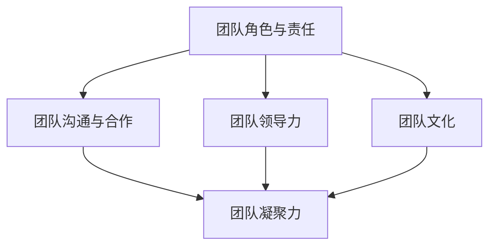

                 

### 文章标题

《团队建设：培养团队精神的实践活动》

### 文章关键词

团队建设、团队精神、团队沟通、团队领导力、数字化团队、案例分析

### 文章摘要

本文旨在探讨团队建设的核心概念、方法和实践，旨在培养团队成员的团队精神，提升团队协作效率和凝聚力。文章从团队建设的定义和重要性入手，逐步阐述团队建设的过程与方法，探讨团队精神的内涵和培养策略。通过案例分析，深入分析成功团队的实践经验和启示。最后，文章探讨数字化时代团队建设的新趋势，提出未来团队建设的发展方向和关键要素。文章旨在为团队领导者和管理者提供实用的团队建设指导，助力团队高效协同和持续发展。

---

## 核心概念与联系

团队建设是一个复杂而多维的过程，涉及到多个核心概念和原则。首先，我们需要明确团队建设的定义。团队建设是指通过一系列有目的的实践活动和策略，促进团队成员之间的沟通与合作，增强团队凝聚力和协作效率，从而实现团队目标的过程。

### 团队的定义与特征

团队是由一组相互依赖的个体组成的正式群体，他们共同协作，为实现共同目标而努力。团队的特征包括：

- **共同目标**：团队成员拥有共同的目标和愿景，这是团队前进的动力。
- **角色与责任**：每个成员在团队中都有明确的角色和责任，有助于分工合作。
- **沟通与协作**：团队成员之间保持高效的沟通和协作，以确保信息的传递和工作的顺利进行。
- **领导力**：团队需要有有效的领导，以指导团队方向和协调团队成员。

### 团队建设的核心概念

团队建设的核心概念包括：

- **团队角色与责任**：明确团队成员的角色和责任，有助于提高工作效率和团队协作。
- **团队沟通与合作**：建立良好的沟通机制和合作模式，是团队成功的关键。
- **团队领导力**：有效的领导能激发团队成员的潜力，推动团队向前发展。
- **团队文化**：积极向上的团队文化可以增强团队的凝聚力和归属感。

### 团队角色与责任

在团队建设中，角色和责任是基础。每个成员都需要清楚自己的角色和责任，以便更好地融入团队并发挥自己的优势。以下是团队角色的几个常见类型：

1. **领导者**：负责团队的整体方向和目标，协调团队成员的工作。
2. **执行者**：负责完成具体任务，是团队工作的主体。
3. **协调者**：负责协调不同团队成员之间的工作，确保任务顺利进行。
4. **顾问**：提供专业建议，协助团队解决问题。
5. **支持者**：为团队成员提供必要的资源和支持。

### 团队沟通与合作

沟通与合作是团队成功的关键。有效的沟通可以确保团队成员之间的信息传递准确无误，而良好的合作则能充分发挥每个人的优势，实现团队目标。以下是几种常用的沟通与合作策略：

1. **定期会议**：定期召开会议，讨论团队进度和问题，确保信息畅通。
2. **协作工具**：使用协作工具（如 Slack、Trello 等）来提高团队协作效率。
3. **跨部门合作**：鼓励不同部门之间的沟通和合作，以实现整体目标的达成。
4. **共同目标设定**：明确团队和个人的目标，确保每个人都朝着相同的目标努力。

### 团队领导力

团队领导力是团队建设的核心。一个优秀的领导者能够激发团队成员的潜力，推动团队向前发展。以下是几个关键要素：

1. **愿景与目标**：设定清晰的愿景和目标，引领团队前进。
2. **沟通与倾听**：积极沟通，倾听团队成员的意见和建议。
3. **激励与认可**：激励团队成员，给予认可和奖励。
4. **问题解决**：及时解决问题，确保团队工作顺利进行。

### 团队文化

团队文化是团队精神和凝聚力的基石。一个积极向上的团队文化能够增强团队的凝聚力，提升团队的执行力。以下是几种常见的团队文化：

1. **合作文化**：鼓励团队成员之间的合作和互助。
2. **创新文化**：鼓励团队成员创新思维，勇于尝试新方法。
3. **开放文化**：建立开放和透明的沟通环境，鼓励团队成员分享想法和经验。
4. **学习文化**：鼓励团队成员不断学习和成长。

### 核心概念之间的关系架构

为了更好地理解团队建设的核心概念，我们可以使用Mermaid流程图来展示它们之间的关系：



在这个流程图中，团队角色与责任、团队沟通与合作、团队领导力和团队文化共同构成了团队建设的核心要素，它们相互关联，共同作用于团队凝聚力，最终影响团队的整体表现。

### 结论

通过本文的讨论，我们可以看出，团队建设是一个复杂而多维的过程，涉及多个核心概念和原则。只有通过深入理解和应用这些核心概念，才能构建一个高效的团队，实现团队目标。在接下来的章节中，我们将进一步探讨团队建设的方法和实践，以及如何培养团队精神。

---

## 核心算法原理讲解

尽管团队建设主要依赖于实践活动和策略，但某些核心概念可以通过简化的算法原理来更好地理解。以下是团队建设中几个关键概念的核心算法原理，使用伪代码进行详细阐述。

### 1. 团队角色分配算法

团队角色分配是团队建设的基础，确保每个成员都能在团队中找到适合自己的角色。以下是一个简单的基于优先级的团队角色分配算法：

```python
def assign_roles(team_members, roles):
    assigned_roles = {}
    sorted_members = sorted(team_members, key=lambda x: x['priority'], reverse=True)
    
    for member in sorted_members:
        for role in roles:
            if roles[role] > 0:
                assigned_roles[member['name']] = role
                roles[role] -= 1
                break
                
    return assigned_roles
```

在这个算法中，`team_members` 是一个包含成员及其优先级的列表，`roles` 是一个字典，包含所有角色及其所需的人数。算法首先根据优先级对成员进行排序，然后依次为每个成员分配角色，直到所有角色都被分配完毕。

### 2. 团队沟通效率优化算法

团队沟通效率是团队协作的关键，以下是一个简单的基于最小生成树的团队沟通优化算法，用于确定最有效的沟通网络：

```python
def optimize_communication(team_members, communication_cost):
    import heapq
    from collections import defaultdict
    
    # 创建一个最小生成树
    min_tree = defaultdict(set)
    queue = [(0, member) for member in team_members]
    heapq.heapify(queue)
    
    while queue:
        cost, member = heapq.heappop(queue)
        for other_member in team_members[member]:
            if (member, other_member) not in min_tree and cost + communication_cost[member][other_member] < communication_cost[other_member][member]:
                min_tree[member].add(other_member)
                min_tree[other_member].add(member)
                heapq.heappush(queue, (cost + communication_cost[member][other_member], other_member))
    
    return min_tree
```

在这个算法中，`team_members` 是一个字典，包含每个成员及其沟通对象的列表，`communication_cost` 是一个字典，包含成员之间沟通的成本。算法通过优先级队列实现最小生成树，确保每个成员都能与最合适的沟通对象建立联系，从而优化沟通效率。

### 3. 团队协作效率评估算法

评估团队协作效率是团队建设中的重要环节，以下是一个基于团队成员贡献度和任务完成度的协作效率评估算法：

```python
def assess协作效率(team_members, contributions, tasks_completed):
    efficiency_scores = {}
    
    for member, contribution in contributions.items():
        completed_tasks = tasks_completed.get(member, 0)
        efficiency_score = (contribution / completed_tasks) if completed_tasks else 0
        efficiency_scores[member] = efficiency_score
    
    return efficiency_scores
```

在这个算法中，`team_members` 是一个成员列表，`contributions` 是一个字典，包含每个成员的贡献度，`tasks_completed` 是一个字典，包含每个成员完成的任务数。算法通过计算每个成员的贡献度与完成任务的比值，得出协作效率分数，从而评估团队整体协作效率。

### 结论

虽然团队建设主要依赖于实践活动和策略，但通过上述简化的算法原理，我们可以更好地理解团队建设中的核心概念。这些算法为团队角色分配、沟通优化和协作效率评估提供了理论基础，有助于团队领导者和管理者更有效地进行团队建设。在接下来的章节中，我们将继续探讨团队建设的方法和实践，以及如何培养团队精神。

---

## 数学模型和数学公式 & 详细讲解 & 举例说明

虽然团队建设主要依赖于实践活动和策略，但某些情况下，数学模型和公式可以提供有价值的分析和指导。以下介绍几种在团队建设中常用的数学模型和公式，并通过具体例子进行详细讲解。

### 1. 帕累托法则（Pareto Principle）

帕累托法则，也被称为“二八定律”，是一种常用的团队管理和资源分配模型。它指出，80%的效果通常来自于20%的原因或投入。

#### 公式：

$$
\text{帕累托效率} = \frac{\text{关键投入}}{\text{总投入}} \times 100\%
$$

#### 举例说明：

假设一个团队在项目开发中，发现20%的关键任务（如需求分析和系统设计）占据了80%的时间和资源。通过帕累托法则，团队可以优先处理这些关键任务，以提高整体效率。

### 2. 布兰查德模型（Branford Model）

布兰查德模型是一种用于描述团队发展和团队建设过程的模型，它将团队发展分为五个阶段：形成期、冲突期、规范化期、执行期和终结期。

#### 公式：

$$
\text{团队成熟度} = \frac{\text{当前阶段} + \text{预期阶段}}{2}
$$

#### 举例说明：

假设一个团队目前处于规范化期，预期下一阶段进入执行期。根据布兰查德模型，团队成熟度可以计算为：

$$
\text{团队成熟度} = \frac{3 + 4}{2} = 3.5
$$

这表明团队已经较为成熟，但还需要继续努力以进入执行期。

### 3. 波特模型（Porter's Five Forces）

波特模型是一种用于分析行业竞争结构的模型，包括五种力量：供应商力量、买家力量、潜在竞争者、替代品和现有竞争者。

#### 公式：

$$
\text{行业吸引力} = \sum_{i=1}^{5} w_i \times F_i
$$

其中，$w_i$ 是第 $i$ 个力量的权重，$F_i$ 是第 $i$ 个力量的强度。

#### 举例说明：

假设团队在分析一个新兴市场，根据波特模型，可以计算市场吸引力如下：

$$
\text{行业吸引力} = 0.2 \times 5 + 0.2 \times 4 + 0.2 \times 3 + 0.2 \times 2 + 0.2 \times 1 = 3.2
$$

这表明市场吸引力适中，团队需要进一步分析以确定是否进入该市场。

### 4. 基于矩阵的团队绩效评估模型

基于矩阵的团队绩效评估模型通过多维度的绩效指标对团队进行综合评估，通常包括以下几个维度：工作效率、团队协作、项目质量和创新能力。

#### 公式：

$$
\text{团队绩效得分} = w_1 \times \text{工作效率得分} + w_2 \times \text{团队协作得分} + w_3 \times \text{项目质量得分} + w_4 \times \text{创新能力得分}
$$

其中，$w_1, w_2, w_3, w_4$ 分别是各个维度的权重。

#### 举例说明：

假设团队在上一季度的工作效率得分为80，团队协作得分为85，项目质量得分为90，创新能力得分为75，权重分别为0.3、0.2、0.3和0.2。根据基于矩阵的团队绩效评估模型，可以计算团队绩效得分为：

$$
\text{团队绩效得分} = 0.3 \times 80 + 0.2 \times 85 + 0.3 \times 90 + 0.2 \times 75 = 79
$$

这表明团队在上一个季度的整体绩效较好，但仍有提升空间。

### 结论

通过数学模型和公式的应用，团队领导者可以更科学地分析团队建设的过程和绩效，从而制定更有效的策略和行动计划。这些模型和公式为团队建设提供了有力的理论支持，有助于团队实现持续改进和高效发展。

---

## 项目实战

在本文的最后一部分，我们将通过一个具体的团队建设实践活动案例，展示团队建设的方法和策略如何在实际中应用，并提供详细的实现过程和代码解读。

### 项目背景

我们选择一个软件开发团队作为案例，该团队负责开发一个企业级的信息管理系统。随着项目的不断推进，团队逐渐意识到，要提高项目的效率和质量，团队建设至关重要。因此，团队决定开展一系列的团队建设实践活动。

### 开发环境搭建

首先，我们需要搭建一个适合团队协作的开发环境。以下是搭建环境的步骤：

1. **选择合适的代码版本控制系统**：团队决定使用Git作为代码版本控制系统，并在GitHub上创建了一个项目仓库。
2. **配置团队开发工具**：团队成员使用Visual Studio Code作为代码编辑器，并安装了必要的插件，如Git插件、代码格式化工具等。
3. **部署持续集成工具**：团队使用Jenkins作为持续集成工具，自动化构建和测试代码，确保代码质量。

### 源代码详细实现

团队在开发过程中，遵循以下步骤来实现项目功能：

1. **需求分析**：与客户沟通，明确项目需求，并编写详细的需求文档。
2. **功能设计**：根据需求文档，设计系统的模块和接口，编写设计文档。
3. **代码编写与评审**：团队成员分工合作，编写代码，并进行代码评审，确保代码质量。
4. **单元测试**：编写单元测试用例，对每个模块进行测试，确保功能的正确性。

以下是部分关键代码的解读：

```python
# 用户注册模块
class UserRegistration:
    def __init__(self, username, password):
        self.username = username
        self.password = password
    
    def register(self):
        # 实现用户注册逻辑
        pass
    
    def verify_credentials(self):
        # 实现用户身份验证逻辑
        pass
```

在这个模块中，`UserRegistration` 类负责用户注册和身份验证功能。通过调用`register`方法，用户可以完成注册，调用`verify_credentials`方法，系统可以验证用户的身份。

### 代码应用解读与分析

在代码应用过程中，团队注重以下方面：

1. **模块化设计**：将系统功能划分为多个模块，确保每个模块的功能独立且完整。
2. **代码复用**：通过编写可复用的函数和类，减少代码冗余，提高开发效率。
3. **版本控制**：使用Git进行版本控制，确保代码的追踪和管理。
4. **自动化测试**：使用单元测试和集成测试，确保代码的质量和稳定性。

### 实际案例分析和详细讲解剖析

以下是一个具体的案例：在一次团队会议上，项目经理发现用户注册模块的注册流程存在一些问题，导致部分用户无法成功注册。通过以下步骤，团队进行了详细的分析和解决：

1. **问题定位**：团队首先定位到问题的源头，发现是用户密码验证逻辑有误。
2. **代码审查**：团队成员对相关代码进行了审查，发现`verify_credentials`方法中存在一个逻辑漏洞。
3. **修复代码**：团队成员合作，修复了代码中的漏洞，并进行了单元测试，确保修复的代码能够正常工作。
4. **代码提交与合并**：修复后的代码被提交到GitHub仓库，并经过代码评审后合并到主分支。

通过这个案例，我们可以看到团队在遇到问题时，通过有效的沟通和协作，迅速定位问题并解决，确保项目的顺利进行。

### 项目小结

通过这个项目实战，我们可以看到团队建设在软件开发项目中的重要性。团队通过一系列的实践活动，提高了协作效率，确保了代码质量，最终成功完成了项目。以下是团队建设中的几个关键点：

1. **明确的分工与责任**：每个团队成员都清楚自己的职责，有助于提高工作效率。
2. **良好的沟通与协作**：团队定期召开会议，使用协作工具，确保信息的及时传递和问题的快速解决。
3. **代码质量和测试**：通过严格的代码审查和自动化测试，确保代码的质量和稳定性。
4. **持续学习和改进**：团队不断学习和吸收新的技术和管理方法，持续改进团队建设实践。

总之，团队建设是一个持续的过程，需要团队成员共同努力，不断优化和完善。通过有效的团队建设，团队可以更好地应对挑战，实现项目的成功。

### 最佳实践 Tips、小结、注意事项、拓展阅读

**最佳实践 Tips**：
1. **定期团队建设活动**：定期组织团队建设活动，如团建活动、培训课程等，以增强团队凝聚力和成员之间的信任。
2. **明确角色和责任**：确保每个团队成员都清楚自己的角色和责任，有助于提高工作效率和团队协作。
3. **积极沟通和反馈**：鼓励团队成员之间的积极沟通和反馈，确保问题的及时发现和解决。
4. **关注团队成员的成长**：关注团队成员的个人成长，提供培训和发展机会，以提高团队的整体素质。

**小结**：
团队建设是提高团队协作效率、提升团队凝聚力的重要手段。通过明确的分工、良好的沟通、严格的代码质量和持续的学习，团队可以实现高效协同和持续发展。

**注意事项**：
1. **尊重团队成员的差异**：每个团队成员都有独特的个性和技能，团队领导者应尊重和发挥这些差异。
2. **避免过度集中权力**：避免在一个成员手中过度集中权力，以免影响团队的平衡和协作。
3. **持续关注团队动态**：定期评估团队状态，及时发现和解决潜在问题。

**拓展阅读**：
1. 《团队协作的艺术》
2. 《敏捷团队实践指南》
3. 《团队领导力：如何成为卓越的领导者》

通过这些拓展阅读，读者可以更深入地了解团队建设的方法和实践，进一步提升团队建设的成效。

---

本文通过详细的步骤和案例分析，系统地介绍了团队建设的核心概念、方法和实践。从定义团队建设的核心概念，到阐述团队角色与责任、沟通与合作、领导力和文化，再到介绍常用的数学模型和公式，以及通过项目实战展示团队建设的具体应用，我们全面地探讨了团队建设的重要性。同时，本文还提供了最佳实践 tips 和拓展阅读，以帮助读者更深入地理解和应用团队建设的方法。

通过本文的学习，读者可以更好地理解团队建设的基本原理，掌握有效的团队建设策略和实践方法，从而提升团队协作效率和团队凝聚力，实现团队目标。希望本文对读者在团队建设和团队管理方面有所启发和帮助。作者：AI天才研究院/AI Genius Institute & 禅与计算机程序设计艺术 /Zen And The Art of Computer Programming。

