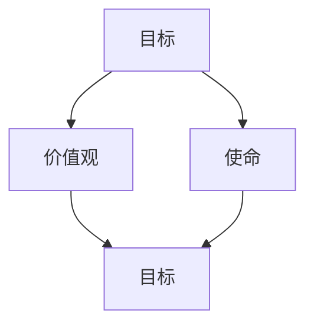
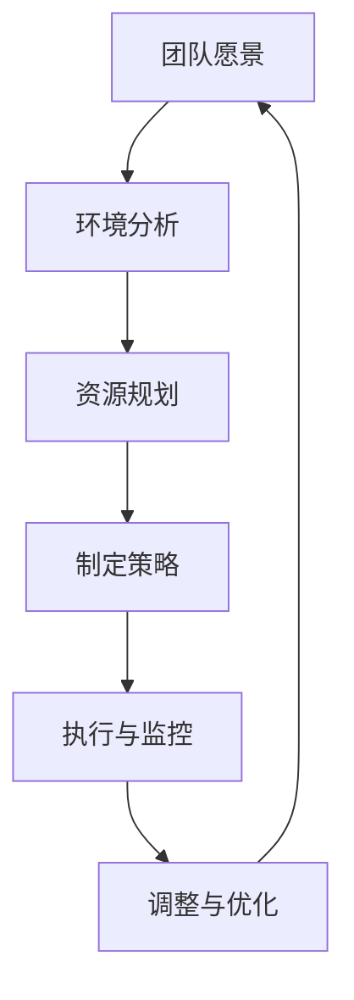
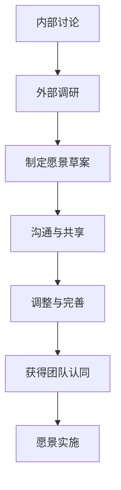
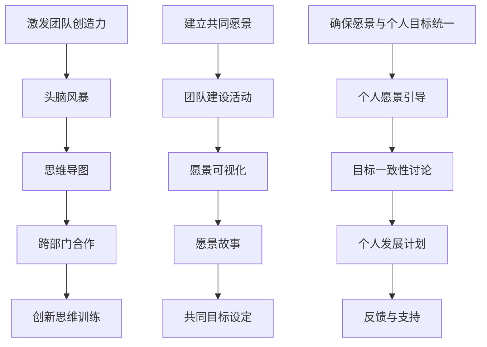
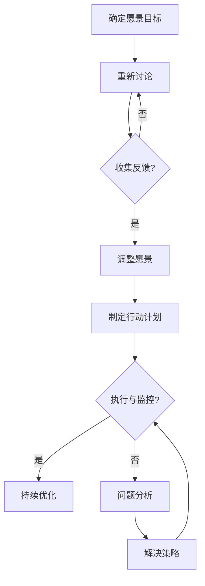

                 

# 文章标题：团队愿景塑造：激发共同奋斗的动力

## 关键词：
- 团队愿景
- 激励机制
- 共同目标
- 领导力
- 组织发展

## 摘要：
本文将探讨团队愿景的重要性，以及如何通过有效的策略和技巧来塑造和激发团队的共同奋斗动力。通过深入分析团队愿景的定义、构建方法、与战略规划的关系、沟通与共享机制，以及实践中的挑战与应对策略，本文旨在为组织领导者提供实用的指南，帮助他们在团队中塑造强大的愿景，从而推动组织的发展和成功。

---

## 引言

在快速变化和竞争激烈的商业环境中，团队的成功往往依赖于其成员的凝聚力和共同目标。而团队愿景作为引导团队方向和激发成员动力的关键因素，发挥着至关重要的作用。一个清晰、具有吸引力的团队愿景能够为团队成员提供共同的目标和方向，增强团队的凝聚力，提高工作效率，进而推动组织的整体发展。

然而，塑造一个有效的团队愿景并非易事。这需要领导者深入了解团队成员的需求和期望，通过系统的策略和技巧来制定和传达愿景，确保团队成员对愿景的理解和认同。本文将围绕这一主题展开讨论，首先介绍团队愿景的基本概念，然后探讨其与战略规划的关系，接着分析团队愿景的构建方法，最后提供实践中的挑战与应对策略。

通过本文的阅读，读者将能够了解到团队愿景的重要性，掌握塑造和传达团队愿景的有效方法，以及如何应对实践中的各种挑战，从而为团队的发展和组织的成功奠定坚实的基础。

---

## 团队愿景的定义与核心要素

团队愿景是指团队对其未来发展的一种理想状态的描绘，它不仅为团队成员指明了前进的方向，还激发了他们的热情和动力。一个明确的团队愿景能够为团队成员提供共同的目标和价值观，帮助他们团结一致、齐心协力地实现目标。

### 定义

团队愿景可以理解为团队共同追求的长期目标和理想状态。它通常包括三个核心要素：目标、价值观和使命。

1. **目标**：目标是指团队期望在未来某个时间点实现的具体成果。这些目标应该是明确、具体和可衡量的，以便团队成员能够清晰地了解团队的目标方向。
   
2. **价值观**：价值观是团队共同遵循的原则和行为准则，它反映了团队的文化和信仰。价值观不仅指导团队成员的行为，还增强了团队的凝聚力和一致性。

3. **使命**：使命是指团队存在的根本原因和目的。它回答了“我们为什么存在”的问题，为团队提供了长远的发展方向和精神支柱。

### 核心要素之间的关系

这三个要素相互关联，共同构成了团队愿景的完整架构。目标为团队提供了具体的方向和动力，价值观为团队成员提供了行为准则和共同信仰，使命则为团队提供了长远的目标和意义。

为了更好地理解这些要素之间的关系，我们可以借助 Mermaid 流程图来直观地展示它们：



在这个流程图中，我们可以看到目标、价值观和使命是如何相互关联和影响的。目标为团队提供了具体的方向，价值观为团队成员提供了共同的行为准则，而使命则为团队提供了长远的目标和意义，这些要素共同构成了团队愿景的核心。

### 团队愿景的重要性

团队愿景不仅为团队提供了明确的方向和目标，还具有重要的激励和凝聚作用。具体来说，团队愿景具有以下几方面的作用：

1. **指导方向**：团队愿景为团队成员提供了共同的方向和目标，帮助他们集中精力、统一行动，避免在前进过程中迷失方向。
   
2. **激发动力**：一个具有吸引力的愿景能够激发团队成员的内在动力，使他们更加主动、积极地为实现团队目标而努力。
   
3. **增强凝聚力**：共同的目标和愿景能够增强团队成员之间的凝聚力，使他们更加团结、协作，共同面对挑战。

4. **提高工作效率**：清晰的团队愿景有助于团队成员明确各自的角色和职责，提高工作效率和协作效果。

总之，团队愿景是团队发展的核心驱动力，它为团队提供了明确的方向、强大的动力和坚实的凝聚力，为团队的成功奠定了坚实的基础。

---

## 团队愿景与战略规划的关系

在团队愿景的塑造过程中，战略规划是一个不可或缺的重要环节。战略规划不仅仅是为了实现团队愿景的具体路径和策略，它更是团队愿景落地的关键保障。因此，理解团队愿景与战略规划之间的关系，以及如何通过战略规划实现团队愿景，是每个团队领导者需要深入探讨的话题。

### 团队愿景与战略规划的定义

1. **团队愿景**：如前文所述，团队愿景是团队对未来理想状态的描绘，它为团队提供了共同的目标和方向。它通常是一个长期的目标，反映了团队的使命和价值观。

2. **战略规划**：战略规划是指为实现团队愿景所制定的具体行动计划和策略。它包括对市场环境、资源需求、执行步骤等进行分析和规划，以确保团队愿景能够在实际操作中得到落实。

### 团队愿景与战略规划的关系

团队愿景与战略规划之间的关系可以看作是目标与手段的关系。团队愿景是团队追求的最终目标，而战略规划则是实现这一目标的路径和工具。具体来说，两者之间的关系可以从以下几个方面来理解：

1. **目标与路径**：团队愿景为战略规划提供了明确的目标，战略规划则为实现这一目标提供了具体的路径和方法。

2. **指导与执行**：团队愿景为团队的发展提供了指导方向，而战略规划则确保了这一方向能够在实际操作中得到有效执行。

3. **动态调整**：在实现团队愿景的过程中，战略规划需要根据实际情况进行动态调整，以适应外部环境的变化和团队内部的调整。

### 如何通过战略规划实现团队愿景

为了确保团队愿景能够通过战略规划得到有效实现，团队领导者需要遵循以下步骤：

1. **明确愿景**：首先，团队需要明确自己的愿景，确保所有成员对愿景有共同的理解和认同。

2. **环境分析**：对市场环境、竞争对手、技术趋势等进行全面分析，了解外部环境对团队实现愿景的影响。

3. **资源规划**：根据愿景和外部环境分析，确定所需的资源和人力，确保战略规划的可行性。

4. **制定策略**：根据资源规划和外部环境分析，制定具体的行动计划和策略，包括市场进入策略、产品开发策略、人力资源策略等。

5. **执行与监控**：将战略规划落实到具体的执行步骤中，并通过定期的监控和评估，确保战略规划的有效执行。

6. **调整与优化**：根据执行过程中的反馈和外部环境的变化，对战略规划进行动态调整和优化，确保其与团队愿景保持一致。

为了更好地理解这一过程，我们可以借助 Mermaid 流程图来展示团队愿景与战略规划之间的互动关系：



在这个流程图中，我们可以看到团队愿景是如何通过战略规划来实现的。从愿景到环境分析，再到资源规划和策略制定，最后到执行和监控，以及动态调整和优化，这一系列步骤共同构成了实现团队愿景的完整过程。

### 结论

团队愿景与战略规划是相辅相成的，战略规划是实现团队愿景的关键工具。通过明确愿景、分析环境、规划资源、制定策略、执行监控和动态调整，团队领导者可以确保团队愿景得到有效实现，从而推动团队和组织的持续发展。

---

## 团队愿景的构建方法

构建一个成功的团队愿景是一个复杂的过程，需要结合团队的特点、外部环境和内部资源进行系统性的规划和实施。以下是构建团队愿景的几个关键步骤：

### 1. 内部讨论

内部讨论是构建团队愿景的第一步，通过团队成员的参与和互动，可以确保愿景的广泛认同和全面性。以下是一些内部讨论的步骤和技巧：

1. **确定讨论目标**：明确讨论的具体目标，例如确定团队的长期目标、核心价值观和使命。

2. **准备讨论材料**：准备相关资料，如市场趋势报告、竞争对手分析等，以便在讨论中提供参考。

3. **引导讨论过程**：由一位经验丰富的主持人引导讨论，确保讨论有序进行，鼓励每个成员都参与进来。

4. **收集反馈**：在讨论过程中，记录每个成员的观点和建议，以便后续分析和整合。

### 2. 外部调研

外部调研是了解外部环境的重要步骤，通过收集和分析外部信息，可以为团队愿景的构建提供更加全面和客观的依据。以下是一些外部调研的方法：

1. **市场调研**：通过问卷调查、访谈等方式，了解市场需求和用户反馈，为团队愿景的制定提供市场依据。

2. **竞争分析**：分析竞争对手的战略和成果，了解行业的竞争态势，为团队愿景的差异化提供参考。

3. **行业报告**：阅读行业报告和研究成果，了解行业趋势和未来发展预测，为团队愿景的制定提供数据支持。

### 3. 制定愿景草案

在内部讨论和外部调研的基础上，团队可以开始制定愿景草案。以下是一些制定愿景草案的步骤和注意事项：

1. **明确愿景内容**：将讨论和调研的结果进行整合，明确愿景的具体内容，包括目标、价值观和使命。

2. **确保可执行性**：愿景草案需要具有可执行性，即团队成员能够通过实际行动来达成愿景。

3. **获得团队认同**：在制定愿景草案后，与团队成员进行讨论和反馈，确保愿景草案能够得到团队的广泛认同。

### 4. 沟通与共享

一个成功的团队愿景不仅需要内部讨论和调研，还需要通过有效的沟通与共享机制，确保团队成员对愿景的理解和认同。以下是一些沟通与共享的技巧：

1. **召开会议**：定期召开会议，向团队成员传达愿景，解释愿景的重要性和具体内容。

2. **使用可视化工具**：借助图表、PPT 等可视化工具，帮助团队成员更好地理解愿景。

3. **建立共享平台**：利用企业微信、钉钉等数字化沟通平台，确保团队成员可以随时随地了解愿景的最新动态。

### 5. 调整与完善

在沟通与共享的过程中，团队可能会收到来自成员的反馈和建议，这需要对愿景草案进行不断的调整和完善。以下是一些调整与完善的步骤：

1. **收集反馈**：定期收集团队成员的反馈，了解他们对愿景的看法和建议。

2. **分析反馈**：对收集到的反馈进行分析，识别其中的共性和差异，为调整愿景提供依据。

3. **调整愿景草案**：根据分析结果，对愿景草案进行相应的调整和完善。

4. **再次沟通与共享**：将调整后的愿景草案再次与团队成员进行沟通和共享，确保团队成员对新的愿景草案有共同的理解和认同。

通过以上步骤，团队可以构建一个清晰、具体且具有吸引力的愿景，为团队的发展和成功奠定坚实的基础。

### 梅里迪亚流程图：团队愿景构建过程

为了更直观地展示团队愿景的构建过程，我们可以使用梅里迪亚（Mermaid）流程图来描述以下关键步骤：



在这个流程图中，我们可以看到团队愿景的构建是一个环环相扣的过程，从内部讨论到外部调研，从制定愿景草案到沟通与共享，再到调整与完善，最终实现愿景的实施。这一过程不仅确保了愿景的制定具有广泛的认同和可执行性，也为团队的持续发展提供了坚实的基础。

---

## 团队愿景的沟通与共享

团队愿景的沟通与共享是确保团队成员对愿景有共同理解和认同的关键步骤。一个成功的沟通与共享机制能够将愿景转化为团队成员的实际行动，从而推动团队目标的实现。以下是一些具体的沟通与共享策略：

### 1. 内部沟通策略

内部沟通策略主要针对团队内部成员，确保他们能够充分理解愿景的重要性和具体内容。以下是一些有效的内部沟通策略：

- **召开愿景说明会**：定期组织愿景说明会，由团队领导者或愿景负责人向团队成员详细解释愿景的背景、目标、价值观和使命。

- **使用可视化工具**：借助图表、PPT、思维导图等可视化工具，将愿景内容形象化，使团队成员更容易理解和记忆。

- **建立团队讨论平台**：利用企业微信、钉钉等沟通工具，建立团队讨论平台，方便成员提出问题和分享对愿景的看法。

- **团队角色模拟**：通过角色扮演，模拟团队成员在不同情境下的行为，帮助他们更好地理解愿景的实际应用场景。

### 2. 外部沟通策略

外部沟通策略主要针对团队的外部合作伙伴、客户和其他利益相关者，确保他们对团队的愿景有正确了解。以下是一些外部沟通策略：

- **发布愿景宣言**：通过官方网站、社交媒体等渠道发布团队愿景宣言，向外界传达团队的目标和价值。

- **举办愿景发布会**：定期举办愿景发布会，邀请合作伙伴、客户和其他利益相关者参与，向他们详细介绍团队愿景和未来的发展方向。

- **建立外部反馈机制**：设立外部反馈渠道，如在线调查、意见箱等，收集外部利益相关者对团队愿景的看法和建议。

### 3. 共享平台

数字化沟通平台在现代团队管理中发挥着重要作用，能够显著提高愿景沟通与共享的效率和效果。以下是一些常用的共享平台：

- **企业微信**：提供消息推送、会议预约、文档共享等功能，方便团队成员之间进行高效的沟通和协作。

- **钉钉**：集成了即时通讯、日程管理、任务分配等功能，有助于团队领导者及时传达愿景和安排工作。

- **Slack**：适合远程团队使用的沟通工具，提供多种集成应用，便于团队成员分享资源和交流想法。

- **Trello**：是一款任务管理工具，可以通过看板视图清晰地展示团队愿景的执行进度，便于团队成员进行协作和追踪。

### 4. 案例分析

以下是一个实际案例，展示了如何通过有效的沟通与共享机制实现团队愿景：

**案例：某科技公司打造创新团队**

某科技公司在构建一个专注于人工智能创新团队的愿景。团队愿景包括：成为行业领先的人工智能解决方案提供商，推动人工智能技术的发展和应用。以下是该团队采取的沟通与共享策略：

1. **内部沟通**：
   - 召开愿景说明会，由公司CEO亲自解释愿景的重要性和目标。
   - 使用PPT和思维导图，将愿景分解为具体目标和行动步骤，便于团队成员理解。
   - 建立钉钉群组，定期发布愿景更新和任务分配，确保团队成员及时了解工作动态。

2. **外部沟通**：
   - 发布愿景宣言，通过官方网站和社交媒体向外界传达团队的愿景和目标。
   - 举办愿景发布会，邀请行业专家、合作伙伴和客户参与，提升团队在外部的知名度和影响力。

3. **共享平台**：
   - 使用Trello管理任务，将愿景拆分为具体的任务和里程碑，实时跟踪进展。
   - 借助企业微信，进行即时沟通和协作，确保团队成员之间的信息传递高效无误。

通过以上策略，该团队成功地将愿景转化为团队成员的实际行动，并在短时间内取得了显著的成绩，成为行业内的佼佼者。

### 结论

有效的团队愿景沟通与共享机制对于团队的长期发展和成功至关重要。通过内部沟通策略、外部沟通策略和数字化共享平台，团队领导者能够确保团队成员对愿景有共同的理解和认同，从而激发团队的共同奋斗动力，推动团队目标的实现。

---

## 塑造团队愿景的技巧

在塑造团队愿景的过程中，激发团队创造力、建立共同愿景以及确保愿景与个人目标的统一是关键步骤。以下是具体的方法和技巧：

### 1. 激发团队创造力

创造力是团队愿景实现的重要推动力。以下是一些激发团队创造力的方法和技巧：

- **头脑风暴**：组织定期的头脑风暴会议，鼓励团队成员自由表达观点和想法，不受限制地思考问题的不同解决方案。
- **思维导图**：通过绘制思维导图，将团队成员的想法和观点可视化，有助于发现新的关联和灵感。
- **跨部门合作**：鼓励不同部门之间的合作，通过跨部门的交流与互动，促进新观点和创意的产生。
- **创新思维训练**：定期开展创新思维训练，如设计思考、快速原型开发等，提升团队成员的创新能力和解决问题的能力。

### 2. 建立共同愿景

共同愿景是团队凝聚力的源泉，以下是一些建立共同愿景的方法和技巧：

- **团队建设活动**：通过团队建设活动，如户外拓展、团队游戏等，增强团队成员之间的互信和合作，从而形成共同的愿景。
- **愿景可视化**：将团队愿景制作成海报、视频等可视化形式，悬挂在办公室或会议室，使团队成员在日常工作中不断受到愿景的激励。
- **愿景故事**：通过讲述团队愿景的实现过程和未来蓝图，激发团队成员的归属感和使命感。
- **共同目标设定**：与团队成员一起设定短期和长期的共同目标，确保每个成员都为实现愿景贡献自己的力量。

### 3. 确保愿景与个人目标的统一

愿景与个人目标的统一是团队协作和实现目标的重要保障。以下是一些确保愿景与个人目标统一的方法和技巧：

- **个人愿景引导**：帮助团队成员明确个人愿景，并与团队愿景进行对接，确保每个成员的个人目标能够支持团队目标的实现。
- **目标一致性讨论**：定期组织目标一致性讨论会议，让团队成员分享个人目标和团队愿景之间的关联，及时调整和优化个人目标。
- **个人发展计划**：制定个人发展计划，将个人目标与团队愿景有机结合，确保个人在实现团队目标的同时，也能实现个人的职业成长。
- **反馈与支持**：建立反馈机制，鼓励团队成员在实现个人目标的过程中遇到困难时，能够及时获得团队的支持和帮助。

通过以上技巧和方法，团队领导者可以有效地激发团队创造力、建立共同愿景，并确保愿景与个人目标的统一，从而为团队的成功奠定坚实的基础。

### Mermaid 流程图：激发团队创造力与建立共同愿景

为了更直观地展示激发团队创造力和建立共同愿景的过程，我们可以使用 Mermaid 流程图来描述以下关键步骤：



在这个流程图中，我们可以看到激发团队创造力和建立共同愿景的各个步骤是如何相互衔接和相互促进的。通过头脑风暴、思维导图、跨部门合作和创新思维训练，团队可以激发出丰富的创意和活力；通过团队建设活动、愿景可视化、愿景故事和共同目标设定，团队可以建立强大的共同愿景；通过个人愿景引导、目标一致性讨论、个人发展计划和反馈与支持，团队可以确保愿景与个人目标的统一。这一系列的步骤共同构成了一个系统化的团队愿景塑造过程。

---

## 团队愿景的测试与反馈

在团队愿景的构建过程中，测试与反馈机制是确保愿景可行性和吸引力的关键环节。通过有效的测试与反馈，团队可以及时发现并解决潜在问题，调整和优化愿景，使其更加符合团队和外部环境的需求。

### 1. 愿景测试的方法

为了确保团队愿景的可行性和吸引力，可以采取以下几种测试方法：

- **内部测试**：通过团队内部的讨论和模拟，评估愿景的可行性和吸引力。例如，可以组织模拟会议，讨论愿景的实现路径和可能面临的挑战，从而识别并解决潜在问题。
- **市场调研**：通过问卷调查、访谈等方式，收集市场对愿景的看法和建议。这有助于了解愿景在目标市场中的接受度和吸引力。
- **用户测试**：如果愿景涉及产品或服务，可以通过实际用户的使用反馈来评估愿景的实用性。这有助于发现用户需求和市场机会，从而优化愿景。

### 2. 如何收集团队成员的反馈

收集团队成员的反馈是确保愿景测试有效性的关键。以下是一些收集团队成员反馈的方法：

- **定期会议**：定期召开团队会议，讨论愿景的进展和存在的问题，鼓励团队成员提出意见和建议。
- **在线调查**：通过在线调查工具，收集团队成员的反馈。这种方式简单便捷，可以迅速获取大量信息。
- **个别访谈**：与团队成员进行个别访谈，深入了解他们对愿景的看法和感受。这种方式有助于获取详细和深入的反馈。

### 3. 如何根据反馈调整愿景

根据反馈调整愿景是确保愿景可行性和吸引力的重要步骤。以下是一些调整愿景的方法：

- **分析反馈**：对收集到的反馈进行系统分析，识别其中的共性和问题点，为调整愿景提供依据。
- **修改愿景内容**：根据分析结果，对愿景的内容进行修改和完善。例如，可以调整目标的具体表述，或优化愿景的实现路径。
- **重新测试**：在调整后，再次进行测试，确保新的愿景内容更加符合团队和市场的需求。
- **沟通与共享**：将调整后的愿景与团队成员进行沟通和共享，确保所有成员对新愿景的理解和认同。

### 案例分析

以下是一个实际案例，展示了如何通过测试与反馈机制调整团队愿景：

**案例：某创业公司的愿景调整**

某创业公司初期设定的愿景是成为国内领先的智能家居解决方案提供商。然而，在市场调研和用户测试过程中，公司发现用户对智能家居的需求更加多样化，而且竞争对手在技术和服务上具有明显优势。为了应对这些挑战，公司采取了以下步骤：

1. **内部测试**：公司内部组织了一次模拟会议，讨论愿景的可行性，识别出潜在的问题和挑战。
2. **市场调研**：通过问卷调查和访谈，了解用户对当前智能家居产品的需求和期望，以及竞争对手的优劣势。
3. **用户测试**：邀请实际用户测试公司的新产品，收集他们的使用反馈，了解产品的实用性和市场接受度。
4. **分析反馈**：对收集到的反馈进行系统分析，识别出用户对智能家居产品的需求变化，以及公司在技术和服务上的不足。
5. **修改愿景内容**：根据分析结果，公司决定调整愿景，将目标市场从单一的智能家居扩展到更广泛的家庭物联网领域，并加强技术研发和服务创新。
6. **重新测试**：在调整后，公司再次进行市场调研和用户测试，验证新愿景的可行性和吸引力。
7. **沟通与共享**：公司通过内部会议和外部发布，向团队成员和客户传达新的愿景，确保所有利益相关者对新愿景的理解和认同。

通过上述步骤，公司成功调整了愿景，并在新的市场定位下取得了显著的发展。

### 结论

团队愿景的测试与反馈机制是确保愿景可行性和吸引力的重要手段。通过内部测试、市场调研和用户测试，团队可以及时识别和解决潜在问题，并根据反馈调整愿景。这一机制不仅有助于提高愿景的实现概率，还能增强团队成员对愿景的认同感和参与度，从而为团队的长期成功奠定坚实的基础。

---

## 团队愿景的执行与持续优化

在团队愿景得以确定和传达后，接下来的关键步骤是实现愿景和持续优化。这两个环节不仅决定了愿景能否顺利落地，还直接影响团队的整体发展和效能。以下是关于团队愿景执行与持续优化的详细讨论。

### 1. 团队愿景的执行策略

愿景的实现需要明确的执行策略，以下是一些关键的执行策略：

- **制定详细的行动计划**：将愿景分解为具体的可执行任务，并制定详细的行动计划。这些行动计划应包括任务的具体目标、负责人员、完成时间和预期成果。

  ```mermaid
  graph TD
  A[制定详细行动计划]
  A --> B[任务分解]
  B --> C[责任分配]
  C --> D[时间安排]
  D --> E[成果预期]
  ```

- **建立跟踪和监控机制**：通过定期的跟踪和监控，确保行动计划按计划执行。可以使用项目管理工具，如Trello或Jira，来记录任务进度，并及时调整。

- **激励机制**：为了激发团队成员的积极性和创造力，可以建立相应的激励机制。例如，对于达成目标的团队成员给予奖励或表彰。

- **内部沟通和协作**：确保团队成员之间的有效沟通和协作。定期召开会议，分享进展和问题，协调资源，确保团队能够高效运作。

### 2. 持续优化团队愿景

在愿景执行过程中，持续优化是保持团队活力和竞争力的关键。以下是一些优化策略：

- **定期评估和反馈**：定期对愿景执行情况进行评估和反馈，识别执行过程中的问题和不足。可以通过内部调查、员工满意度调查等方式收集反馈。

  ```mermaid
  graph TD
  A[定期评估和反馈]
  A --> B[问题识别]
  B --> C[问题分析]
  C --> D[反馈机制]
  ```

- **持续改进**：根据评估和反馈结果，对愿景执行过程进行持续改进。可以采用持续改进（Kaizen）的方法，逐步优化流程和策略。

- **学习和创新**：鼓励团队成员不断学习和创新，通过培训、研讨会和行业交流等方式，提升团队的整体能力和竞争力。

- **灵活调整**：在执行过程中，外部环境和内部情况可能会发生变化，团队需要具备灵活调整的能力。根据实际情况，及时调整愿景和执行策略。

### 3. 实施步骤

以下是实现团队愿景和持续优化的具体实施步骤：

1. **制定行动计划**：根据愿景，分解任务，明确责任人和时间安排。
2. **执行和跟踪**：按照行动计划执行任务，并使用项目管理工具进行跟踪和监控。
3. **评估和反馈**：定期评估执行情况，收集反馈，识别问题和改进机会。
4. **持续改进**：根据评估和反馈结果，持续优化执行过程。
5. **学习和创新**：鼓励团队成员学习和创新，提升团队整体能力。
6. **灵活调整**：根据外部环境和内部情况的变化，灵活调整愿景和执行策略。

### 结论

团队愿景的执行和持续优化是一个动态和持续的过程。通过明确的执行策略和持续优化机制，团队可以确保愿景得以实现，并在不断变化的环境中保持竞争力和创新能力。这一过程不仅有助于团队目标的实现，还能增强团队的凝聚力和工作效率，为组织的长期成功奠定坚实的基础。

---

## 案例分析与启示

为了更好地理解团队愿景塑造的过程和技巧，以下将分析两个成功团队的案例，探讨其愿景的构建、执行以及带来的启示。

### 案例一：谷歌（Google）

**背景介绍**：谷歌成立于1998年，是一家全球知名的互联网技术公司。其愿景是“整合全球信息，使人人皆可访问并从中受益”。这一愿景不仅明确了谷歌的业务方向，还体现了其对社会和用户的承诺。

**团队愿景的构建**：
- **内部讨论**：谷歌非常注重员工的参与和反馈，通过内部论坛和讨论会，让员工提出对愿景的看法和建议。
- **外部调研**：谷歌定期进行市场调研，了解用户需求和竞争对手的动态，确保其愿景与外部环境保持一致。
- **愿景表述**：谷歌的愿景清晰而简洁，易于理解和传播。

**愿景的执行**：
- **行动计划**：谷歌将愿景分解为多个具体目标和项目，如搜索引擎优化、人工智能研发、云计算服务等。
- **执行与监控**：通过谷歌内部的项目管理工具，如Google Doc和Google Sheets，实时跟踪和监控项目进度。
- **激励机制**：谷歌为达成愿景目标的团队成员提供奖励，如股权激励和奖金。

**启示**：
- **员工参与**：谷歌的成功经验表明，员工的参与和反馈是构建有效愿景的重要环节。
- **外部环境分析**：对外部环境的准确把握有助于制定符合实际的可执行愿景。
- **明确的愿景表述**：清晰的愿景表述有助于团队内部和外部的理解与传播。

### 案例二：特斯拉（Tesla）

**背景介绍**：特斯拉成立于2003年，是一家全球领先的电动汽车和清洁能源公司。其愿景是“加速世界向可持续能源的转变”。这一愿景不仅反映了特斯拉的业务定位，还体现了其对环境保护的承诺。

**团队愿景的构建**：
- **内部讨论**：特斯拉非常注重员工的创新和创造力，通过开放的讨论平台，鼓励员工提出新的想法和改进建议。
- **外部调研**：特斯拉定期进行市场调研，了解用户对电动汽车和清洁能源的需求，确保其愿景与市场需求保持一致。
- **愿景表述**：特斯拉的愿景简洁而具有远见，易于激发员工的热情和动力。

**愿景的执行**：
- **行动计划**：特斯拉将愿景分解为多个具体目标和项目，如电动汽车的研发、电池技术的改进、太阳能产品的推广等。
- **执行与监控**：特斯拉采用严格的项目管理流程，确保每个项目都能按计划顺利进行。
- **激励机制**：特斯拉为达成愿景目标的团队成员提供股权激励，以激发其长期投入和创新动力。

**启示**：
- **创新文化**：特斯拉的成功经验表明，鼓励创新和创造力是构建强大团队愿景的关键。
- **市场需求分析**：准确了解市场需求是确保愿景实施的重要前提。
- **股权激励**：通过股权激励，可以有效提升团队成员的长期投入和归属感。

### 案例总结

通过分析谷歌和特斯拉的案例，我们可以总结出以下启示：

1. **员工参与**：成功的团队愿景需要员工的广泛参与和认同。
2. **外部环境分析**：对外部环境的深入了解有助于制定切实可行的愿景。
3. **创新文化**：鼓励创新和创造力是激发团队动力的关键。
4. **明确的愿景表述**：清晰的愿景表述有助于团队内部和外部的理解与传播。
5. **股权激励**：通过股权激励，可以提升团队成员的长期投入和归属感。

这些启示为其他团队在塑造和执行愿景时提供了宝贵的参考，帮助他们在各自领域取得更大的成功。

---

## 团队愿景塑造的挑战与应对策略

在团队愿景塑造的过程中，领导者可能会面临多种挑战，这些挑战包括内部分歧、外部环境变化和资源限制等。了解这些挑战并采取有效的应对策略，对于确保团队愿景的实现至关重要。

### 1. 内部分歧

**挑战**：在团队内部，成员之间可能存在不同的观点和利益，导致愿景构建和执行过程中出现分歧。

**应对策略**：
- **建立共识**：通过讨论和协商，确保所有成员对愿景有共同的理解和认同。可以使用共识会议、头脑风暴等方法，促进团队成员之间的沟通和互动。
- **角色明确**：在团队中明确每个成员的角色和职责，确保每个人都知道自己的责任和期望，减少因角色不清导致的冲突。
- **冲突管理**：当分歧出现时，及时进行冲突管理，通过沟通和妥协找到解决方案。可以采用调解、调解会议等方法，缓解紧张局势。

### 2. 外部环境变化

**挑战**：外部环境的快速变化，如市场波动、技术革新等，可能会对团队愿景的实施产生重大影响。

**应对策略**：
- **灵活调整**：保持团队愿景的灵活性，根据外部环境的变化进行及时调整。可以使用情景分析、风险评估等方法，预测可能的变化并提前做好准备。
- **持续监控**：建立外部环境监控机制，定期收集和分析市场信息，了解行业趋势和竞争对手动态，为愿景调整提供依据。
- **开放沟通**：鼓励团队成员保持开放的心态，对外部变化保持敏感，及时分享信息和反馈，共同应对外部挑战。

### 3. 资源限制

**挑战**：团队在实施愿景过程中可能会面临资源限制，如资金不足、人力资源不足等，这会影响愿景的实现。

**应对策略**：
- **优先排序**：对愿景实施过程中的任务进行优先排序，确保有限的资源能够优先用于最重要和最紧迫的任务。
- **资源优化**：通过优化现有资源的利用，提高资源的使用效率。例如，采用精益管理、敏捷开发等方法，减少浪费和提高效率。
- **外部合作**：寻求与外部合作伙伴的合作，共同分担资源和风险。例如，通过外包、合作开发等方式，补充团队的资源不足。

### 案例分析

以下是一个实际案例，展示了如何应对团队愿景塑造中的挑战：

**案例：某创业公司的团队愿景实现**

某创业公司专注于开发智能物联网（IoT）解决方案。在愿景塑造过程中，该公司面临以下挑战：

1. **内部分歧**：团队成员在产品方向和市场需求上存在不同意见，导致决策效率低下。
2. **外部环境变化**：市场环境变化较快，竞争对手产品更新迅速，对公司愿景实施带来挑战。
3. **资源限制**：公司资金和人力资源有限，难以满足项目需求。

**应对策略**：

1. **建立共识**：公司通过组织内部讨论会议，邀请所有团队成员参与，明确了产品方向和市场需求，建立了共识。
2. **灵活调整**：公司定期进行市场调研，了解行业趋势和竞争对手动态，根据外部环境的变化及时调整愿景和策略。
3. **资源优化**：公司采用敏捷开发方法，优化项目进度和资源分配，提高工作效率。同时，通过与合作伙伴的合作，补充了部分技术资源。

通过以上应对策略，该公司成功克服了团队愿景塑造中的挑战，实现了其愿景。

### 结论

在团队愿景塑造的过程中，领导者需要预见并应对各种挑战。通过建立共识、灵活调整和资源优化等策略，团队可以克服困难，实现其愿景。这些策略不仅有助于团队内部的合作和效率，也为组织的长期成功奠定了基础。

---

## 附录

### 附录 A：团队愿景塑造工具与资源

为了更有效地塑造团队愿景，以下是一些常用的工具和资源：

1. **工具**：
   - **头脑风暴工具**：MindMeister、Mural、Slido等。
   - **项目管理工具**：Trello、Jira、Asana等。
   - **沟通平台**：Slack、微软Teams、Zoom等。
   - **市场调研工具**：SurveyMonkey、Qualtrics、Google Forms等。

2. **资源**：
   - **书籍**：《团队协作工具与方法》、《创新者的宣言》等。
   - **文章**：在LinkedIn、哈佛商业评论等平台上的相关文章。
   - **在线课程**：Coursera、Udemy、edX等平台上的团队领导和团队协作课程。

### 附录 B：团队愿景塑造的 Mermaid 流程图

以下是使用Mermaid绘制的团队愿景塑造的流程图：



这个流程图展示了从确定愿景目标到持续优化的完整过程，包括内部讨论、反馈收集、愿景调整、行动计划制定、执行与监控以及持续优化等步骤。

---

## 作者信息

作者：AI天才研究院/AI Genius Institute & 禅与计算机程序设计艺术 /Zen And The Art of Computer Programming

本文由AI天才研究院和禅与计算机程序设计艺术共同撰写，旨在为团队领导者提供实用的团队愿景塑造指南。作者团队专注于人工智能和计算机编程领域的研究，致力于通过深入分析和实践，为读者提供高质量的技术内容和解决方案。如果您有任何问题或建议，欢迎随时与我们联系。期待与您的进一步交流。

