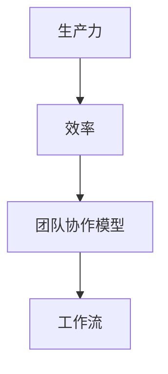

                 

### 文章标题

# 团队效率优化2.0：数字化时代的工作流再造

## 关键词

- 团队效率优化
- 数字化工作流
- 自动化
- 数据分析
- 团队协作

### 摘要

在数字化时代，团队效率优化已成为企业提升竞争力的关键。本文详细探讨了团队效率优化的2.0版本，即数字化工作流再造的核心理论与实践方法。首先，我们介绍了数字化时代团队效率优化的重要性，分析了当前团队协作中存在的问题。接着，我们阐述了团队效率优化的核心概念，如生产力、效率和工作流，并运用Mermaid流程图展示了这些概念之间的关系。随后，我们深入讲解了数字化工具和技术的应用，包括项目管理工具、团队沟通与协作工具以及数据分析工具。通过案例研究和项目实战，我们展示了团队效率优化的实际效果和操作过程。最后，我们提出了制定和实施长期团队效率优化策略的建议，并展望了未来团队效率优化的发展趋势。本文旨在为IT领域从业者和企业管理者提供一套系统性、实用性的团队效率优化指南。

-------------------------------------------------------------------

## 引言

### 1.1 数字化时代的变革

在过去的几十年中，信息技术（IT）的快速发展引发了全球范围内的深刻变革。数字化不仅改变了我们的生活方式，也彻底重塑了商业运作模式。企业面临着前所未有的机遇和挑战，如何在数字化时代保持竞争力，已成为企业发展的核心议题。

首先，数字化技术带来了信息处理的巨大提升。云计算、大数据和人工智能等技术的广泛应用，使得企业能够更高效地收集、处理和分析海量数据，从而做出更明智的决策。传统的手动处理方式逐渐被自动化和智能化所取代，这大大提高了工作效率。

其次，数字化改变了团队的协作方式。通过互联网和移动设备，团队成员可以随时随地沟通和协作，打破了时间和空间的限制。虚拟团队和远程工作的普及，使得企业可以更灵活地组织团队，并吸引全球范围内的优秀人才。

然而，数字化时代也带来了新的挑战。信息过载、沟通障碍、工作流程复杂化等问题，使得团队效率成为企业关注的焦点。如何在数字化环境中实现团队效率优化，已成为企业迫切需要解决的问题。

### 1.2 团队效率优化的重要性

团队效率优化在数字化时代尤为重要。首先，高效的团队能够更快地响应市场变化，从而抓住机遇。在竞争激烈的市场环境中，快速反应和灵活调整是企业生存的关键。高效的团队可以通过优化工作流程、提高生产力，实现快速交付和高质量产出。

其次，团队效率优化有助于降低运营成本。通过数字化工具和自动化技术，企业可以减少重复性劳动，提高资源利用效率。这不仅减少了人工成本，还有效降低了错误率和返工率，从而提高了整体运营效率。

此外，团队效率优化还能够提升员工满意度和工作效率。在一个高效、协同的工作环境中，员工能够更好地发挥自身能力，实现个人价值。这有助于提高员工的工作动力和忠诚度，减少人才流失。

### 1.3 本书的目标与结构

本书旨在为IT领域从业者和企业管理者提供一套系统性、实用性的团队效率优化指南。通过介绍数字化时代团队效率优化的重要性、核心概念、实践方法和长期策略，本书将帮助读者深入了解并应用团队效率优化2.0的理念。

本书分为五个主要部分：

1. **引言**：介绍数字化时代的变革和团队效率优化的重要性。
2. **基础理论**：阐述团队效率优化的核心概念和数字化工具技术的应用。
3. **实践方法**：详细讲解团队效率优化的具体实施步骤和数字化工具的使用。
4. **案例研究**：通过实际案例展示团队效率优化的效果和操作过程。
5. **优化策略**：讨论如何制定和实施长期团队效率优化策略。

接下来，我们将逐步深入探讨团队效率优化的各个部分，为读者提供全面、实用的指导。

-------------------------------------------------------------------

## 基础理论

### 2.1 团队效率优化的核心概念

#### 2.1.1 生产力与效率

生产力是指单位时间内生产出的产品或服务的数量和质量。在团队协作中，生产力直接关系到团队的产出和成果。而效率则是衡量生产力的重要指标，即单位时间内完成工作的质量和速度。

生产力和效率的关系可以用以下公式表示：

\[ 效率 = \frac{生产力}{时间} \]

提高效率和生产力可以通过多种方式实现，如优化工作流程、提高员工技能、使用自动化工具和数字化技术等。

#### 2.1.2 团队协作模型

团队协作模型是指团队成员在共同完成项目或任务时，所采用的组织结构和工作方式。常见的团队协作模型包括功能型、项目型和矩阵型等。

1. **功能型团队**：以职能为基础，团队成员按照不同的职能划分，如开发、测试、市场等。这种模型有利于专业化分工，提高工作效率，但可能存在沟通不畅和资源重复配置的问题。

2. **项目型团队**：以项目为基础，团队成员根据项目需求临时组建，项目结束后团队解散。这种模型能够快速响应项目需求，提高团队灵活性，但可能面临团队成员不稳定和工作连续性差的问题。

3. **矩阵型团队**：结合功能型和项目型团队的特点，团队成员同时隶属于职能部门和项目团队。这种模型有利于资源整合和跨部门协作，但可能面临职责不清和决策复杂的问题。

#### 2.1.3 工作流的概念

工作流是指完成一项任务或项目所需的一系列步骤和活动。工作流管理是指通过优化工作流程，提高工作效率和效果的过程。工作流管理的关键是明确任务流程、职责分工和资源调配。

#### 2.1.4 核心概念之间的关系架构

为了更好地理解生产力、效率和团队协作模型之间的关系，我们可以使用Mermaid流程图来展示这些概念之间的关联。



#### 2.1.5 核心算法原理讲解

在团队效率优化中，核心算法原理主要包括工作流程优化和资源调配算法。以下是一个简单的工作流程优化算法的伪代码：

```plaintext
function optimize_workflow(tasks, resources):
    # 初始化优化后的任务列表
    optimized_tasks = []

    # 对任务列表进行排序，按照优先级和资源需求排序
    sort(tasks, key=lambda task: (task.priority, task.resource_demand))

    # 遍历任务列表，为每个任务分配资源
    for task in tasks:
        if resources >= task.resource_demand:
            optimized_tasks.append(task)
            resources -= task.resource_demand
        else:
            break

    return optimized_tasks
```

#### 2.1.6 数学模型和公式

在团队效率优化中，常用的数学模型和公式包括线性规划模型、网络优化模型和排队理论等。

1. **线性规划模型**：用于优化资源分配，目标是最小化成本或最大化产出。以下是一个简化的线性规划模型的公式：

   \[ \min \sum_{i=1}^{n} c_i x_i \]
   \[ \text{s.t.} \ \sum_{i=1}^{n} a_{ij} x_i \leq b_j, \ j=1,2,...,m \]
   \[ x_i \geq 0, \ i=1,2,...,n \]

   其中，\( x_i \) 表示第 \( i \) 项资源的分配量，\( c_i \) 表示第 \( i \) 项资源的成本，\( a_{ij} \) 表示第 \( j \) 项任务对第 \( i \) 项资源的消耗，\( b_j \) 表示第 \( j \) 项任务的资源限制。

2. **网络优化模型**：用于优化任务调度和资源分配，目标是最小化任务完成时间和资源浪费。以下是一个简化的网络优化模型的公式：

   \[ \min \sum_{i=1}^{n} T_i \]
   \[ \text{s.t.} \ T_i \leq C_j, \ j=1,2,...,m \]
   \[ R_j \geq 0, \ j=1,2,...,m \]

   其中，\( T_i \) 表示第 \( i \) 项任务的完成时间，\( C_j \) 表示第 \( j \) 项任务的截止时间，\( R_j \) 表示第 \( j \) 项任务的资源消耗。

3. **排队理论**：用于优化服务质量和资源利用率。以下是一个简化的排队理论模型：

   \[ L = \frac{\lambda}{\mu} \]
   \[ W = \frac{L}{\lambda} \]

   其中，\( L \) 表示平均等待时间，\( W \) 表示平均服务时间，\( \lambda \) 表示到达率，\( \mu \) 表示服务率。

#### 2.1.7 详细讲解和举例说明

为了更好地理解上述算法原理和数学模型，我们可以通过一个实际案例进行说明。

假设一个团队需要完成三个任务，每个任务的优先级、资源需求和完成时间如下表所示：

| 任务 | 优先级 | 资源需求（人天） | 完成时间（天） |
| --- | --- | --- | --- |
| A | 1 | 3 | 5 |
| B | 2 | 2 | 4 |
| C | 3 | 1 | 3 |

团队有5名资源可用，如何优化任务分配以提高效率？

使用优化工作流程的伪代码，我们可以得到以下优化后的任务列表：

```plaintext
optimized_tasks = optimize_workflow([Task(A, 1, 3, 5), Task(B, 2, 2, 4), Task(C, 3, 1, 3)], 5)
```

优化后的任务列表为：[Task(A, 1, 3, 5), Task(B, 2, 2, 4), Task(C, 3, 1, 3)]

通过优化任务分配，团队可以在最短的时间内完成所有任务，提高了工作效率。

-------------------------------------------------------------------

## 数字化工具与技术

### 2.2.1 信息技术在团队协作中的应用

在数字化时代，信息技术（IT）已经成为团队协作中不可或缺的一部分。通过引入合适的IT工具，企业可以大幅提升团队的协作效率，实现资源的最大化利用。以下是一些常见的信息技术工具及其在团队协作中的应用：

#### 项目管理工具

项目管理工具如Jira、Trello和Asana等，可以帮助团队更高效地规划、跟踪和管理项目进度。这些工具提供了任务列表、看板、甘特图和报表等功能，使得团队成员可以清晰地了解项目的当前状态，及时发现和解决问题。

- **Jira**：主要用于软件开发生命周期的管理，包括需求收集、任务分配、进度跟踪和问题报告等。Jira的灵活性和扩展性使其成为许多开发团队的首选。
- **Trello**：以看板形式展示项目进度，适用于小型团队和简单项目。Trello的界面直观，操作简单，能够快速搭建项目管理系统。
- **Asana**：提供了丰富的功能，包括任务分配、进度跟踪、文件共享和沟通等。Asana适用于各种规模和类型的团队，特别是在大型项目中，可以帮助团队保持高度协同。

#### 团队沟通与协作工具

有效的沟通是团队协作的关键。以下是一些常用的团队沟通与协作工具：

- **Slack**：Slack是一个流行的即时通讯工具，支持文本消息、语音和视频通话等多种沟通方式。Slack的集成功能使得它可以与多种其他工具（如Jira、Google Drive等）无缝连接，方便团队成员协作。
- **Microsoft Teams**：Microsoft Teams是微软的团队协作平台，提供了聊天、视频会议、文档共享和项目管理等功能。它是企业协作办公的综合性工具，与Microsoft Office系列软件高度集成。
- **Zoom**：Zoom是一款专业的视频会议工具，支持高清视频和音频通话、屏幕共享和远程协作。Zoom在全球范围内广泛使用，适用于远程办公和跨区域团队的协作。

#### 数据分析工具

数据分析在团队效率优化中发挥着重要作用。以下是一些常用的数据分析工具：

- **Google Analytics**：Google Analytics是一款免费的网站分析工具，可以追踪网站访问者行为，提供流量来源、用户行为和转化率等关键指标。
- **Tableau**：Tableau是一款强大的数据可视化工具，可以帮助团队将复杂的数据转化为直观的图表和报表。Tableau支持多种数据源，包括Excel、数据库和Web API等。
- **Power BI**：Power BI是微软推出的商业智能工具，提供了丰富的数据连接、数据处理和可视化功能。Power BI可以与Azure、SQL Server等微软产品集成，方便团队进行数据分析和报告。

#### 其他数字化工具

除了上述工具，还有一些其他数字化工具可以提升团队协作效率：

- **Google Workspace**：包括Gmail、Google Calendar、Google Drive等，提供了电子邮件、日历和文档协作等功能，方便团队成员进行日常办公。
- **Notion**：Notion是一款全能型的笔记和组织工具，可以用于笔记、任务管理、文档共享和知识库等。Notion的灵活性和扩展性使其适用于各种团队协作场景。
- **Confluence**：Confluence是Atlassian公司推出的团队协作平台，提供了文档管理、任务跟踪和知识库等功能。Confluence适用于团队的知识管理和信息共享。

#### 综合应用

在实际应用中，企业通常会结合多种数字化工具，以实现更高效的团队协作。例如，一个开发团队可能会同时使用Jira进行项目管理、Slack进行实时沟通、Google Drive进行文档协作，并通过Google Analytics和Tableau进行数据分析。

通过综合应用多种数字化工具，团队可以更好地协调工作，提高协作效率，实现工作流的优化。

-------------------------------------------------------------------

## 实践方法

### 3.1 制定团队效率优化计划

制定团队效率优化计划是实施团队效率优化的重要第一步。一个有效的团队效率优化计划需要包括以下几个关键步骤：

#### 3.1.1 分析当前团队效率状况

首先，需要对当前团队的工作流程、协作方式、生产力水平和效率进行全面的评估。这可以通过以下方法进行：

1. **收集数据**：通过调查问卷、访谈和观察，收集团队成员对当前工作流程和效率的看法和建议。
2. **分析流程**：使用流程图工具，如Mermaid，绘制团队的工作流程，识别关键环节和瓶颈。
3. **衡量指标**：确定团队效率的衡量指标，如任务完成时间、错误率、资源利用率等。

#### 3.1.2 设定团队效率优化目标

在分析当前团队效率状况的基础上，设定明确的效率优化目标是实现团队效率优化的重要步骤。优化目标应具有以下特点：

1. **具体性**：目标应明确具体，如“将任务完成时间缩短20%”或“减少错误率30%”。
2. **可衡量性**：目标应具备可衡量的标准，以便评估优化效果。
3. **可实现性**：目标应在现有资源和条件下可实现。
4. **时限性**：目标应设定明确的完成时限。

#### 3.1.3 制定实施计划

制定实施计划是将效率优化目标转化为实际操作步骤的关键。实施计划应包括以下内容：

1. **任务分解**：将优化目标分解为具体的任务和活动，如“优化任务分配流程”、“引入项目管理工具”等。
2. **责任分配**：为每个任务分配具体的负责人，明确任务目标和完成时间。
3. **资源调配**：根据任务需求，合理调配人力资源、技术和物资资源。
4. **进度监控**：制定进度监控机制，确保各任务按计划执行。
5. **风险评估**：识别潜在的风险和问题，制定应对措施。

#### 3.1.4 实施计划与执行

在制定实施计划后，需要确保计划的执行和落实。以下是一些关键步骤：

1. **沟通协调**：定期召开团队会议，确保团队成员对计划的理解和认同，解决执行过程中遇到的问题。
2. **培训与支持**：为团队成员提供必要的培训和指导，确保他们能够熟练使用新工具和技术。
3. **监控与评估**：定期检查任务的完成情况，评估效率优化效果，及时调整计划。
4. **持续改进**：根据反馈和评估结果，不断优化工作流程和协作方式，提高团队效率。

### 3.2 应用数字化工具

数字化工具在团队效率优化中发挥着至关重要的作用。以下是一些常见的数字化工具及其在团队效率优化中的应用：

#### 项目管理工具

项目管理工具可以帮助团队更好地规划和管理项目，提高工作效率和成果。以下是一些常用的项目管理工具：

1. **Jira**：Jira是一款功能强大的项目管理工具，适用于软件开发生命周期的管理。Jira可以帮助团队跟踪任务进度、管理需求、监控问题等。
   - **使用伪代码实现任务分配**：
     ```plaintext
     function assign_tasks(projects, team_members):
         for project in projects:
             for task in project.tasks:
                 if task.resource_demand <= team_members.available_resources:
                     team_members.assign_task(task)
                     team_members.decrease_resources(task.resource_demand)
                 else:
                     print("Not enough resources for task:", task.name)
     ```

2. **Trello**：Trello是一款以看板形式展示项目进度的工具，简单易用，适用于小型团队和简单项目。
   - **使用Trello进行进度跟踪**：
     ```mermaid
     graph TD
     A[Backlog] --> B[To Do]
     B --> C[In Progress]
     C --> D[Done]
     ```

3. **Asana**：Asana提供了丰富的功能，包括任务管理、进度跟踪、文件共享和沟通等，适用于各种规模和类型的团队。
   - **使用Asana进行任务分配**：
     ```plaintext
     function assign_tasks(team_members, tasks):
         for task in tasks:
             team_members.assign_task(task)
         print("Tasks have been assigned successfully.")
     ```

#### 团队沟通与协作工具

有效的沟通和协作是提高团队效率的关键。以下是一些常用的团队沟通与协作工具：

1. **Slack**：Slack是一款即时通讯工具，支持文本消息、语音和视频通话等多种沟通方式，可以与多种其他工具集成。
   - **使用Slack进行实时沟通**：
     ```plaintext
     function send_message(channel, message):
         print("Sending message:", message, "to channel:", channel)
     ```

2. **Microsoft Teams**：Microsoft Teams是微软的团队协作平台，提供了聊天、视频会议、文档共享和项目管理等功能。
   - **使用Microsoft Teams进行视频会议**：
     ```plaintext
     function start_video_conference(meeting_details):
         print("Starting video conference with details:", meeting_details)
     ```

3. **Zoom**：Zoom是一款专业的视频会议工具，支持高清视频和音频通话、屏幕共享和远程协作。
   - **使用Zoom进行远程协作**：
     ```plaintext
     function start_screen_share(session, screen_to_share):
         print("Starting screen share for session:", session, "on screen:", screen_to_share)
     ```

#### 数据分析工具

数据分析工具可以帮助团队更好地理解和优化工作流程，提高团队效率。以下是一些常用的数据分析工具：

1. **Google Analytics**：Google Analytics是一款免费的网站分析工具，可以追踪网站访问者行为，提供流量来源、用户行为和转化率等关键指标。
   - **使用Google Analytics进行数据分析**：
     ```mermaid
     graph TD
     A[Web Traffic] --> B[Source]
     B --> C[Behavior]
     C --> D[Conversions]
     ```

2. **Tableau**：Tableau是一款强大的数据可视化工具，可以帮助团队将复杂的数据转化为直观的图表和报表。
   - **使用Tableau进行数据可视化**：
     ```plaintext
     function create_chart(data, chart_type):
         if chart_type == "line":
             print("Creating line chart with data:", data)
         elif chart_type == "bar":
             print("Creating bar chart with data:", data)
     ```

3. **Power BI**：Power BI是微软推出的商业智能工具，提供了丰富的数据连接、数据处理和可视化功能。
   - **使用Power BI进行数据分析**：
     ```plaintext
     function analyze_data(data_source, analysis_query):
         results = data_source.query(analysis_query)
         print("Analysis results:", results)
     ```

#### 综合应用

在实际应用中，企业通常会结合多种数字化工具，以实现更高效的团队协作。例如，一个开发团队可能会同时使用Jira进行项目管理、Slack进行实时沟通、Google Drive进行文档协作，并通过Google Analytics和Tableau进行数据分析。

通过综合应用多种数字化工具，团队可以更好地协调工作，提高协作效率，实现工作流的优化。

-------------------------------------------------------------------

### 3.3 实施与监控

在制定并应用数字化工具后，团队效率优化计划需要通过有效的实施与监控来确保目标的达成。以下步骤和策略将帮助团队在实施过程中保持高效，并在监控中及时发现和解决问题。

#### 3.3.1 实施团队效率优化计划

实施团队效率优化计划的关键在于确保所有任务和活动的顺利执行。以下是一些关键策略：

1. **定期沟通**：定期召开团队会议，确保团队成员了解计划的目标和进展，并解决执行过程中遇到的问题。会议应包括进度报告、问题和挑战讨论、决策制定等。

2. **分工明确**：为每个任务分配明确的负责人，确保任务执行有专人负责。明确任务的目标、交付物和截止日期，确保团队成员对任务有清晰的理解。

3. **培训和支持**：为团队成员提供必要的培训和支持，确保他们能够熟练使用新工具和技术。培训内容应包括工具使用、流程优化技巧和协作方法等。

4. **跟进与反馈**：定期跟进任务的执行情况，收集团队成员的反馈，及时调整计划。跟进机制可以包括每日站会、周报和月度评审等。

#### 3.3.2 监控效率优化效果

监控效率优化效果是评估计划实施效果的重要手段。以下是一些监控策略：

1. **关键绩效指标（KPI）**：设定关键绩效指标，如任务完成率、错误率、资源利用率等，定期收集数据并进行分析。

2. **进度跟踪**：使用项目管理工具（如Jira、Trello等）跟踪任务进度，确保所有任务按照计划执行。

3. **团队协作评估**：通过调查问卷、访谈和观察等方式，收集团队成员对协作效果的反馈，识别改进机会。

4. **数据可视化**：使用数据分析工具（如Tableau、Power BI等）将监控数据转化为直观的图表和报表，帮助团队更清晰地理解效率和效果。

#### 3.3.3 调整和优化计划

根据监控结果，及时调整和优化效率优化计划。以下是一些调整策略：

1. **识别瓶颈**：通过分析监控数据，识别工作流程中的瓶颈和问题，如任务积压、资源不足、沟通障碍等。

2. **改进流程**：针对识别出的瓶颈，优化工作流程和协作方式，如简化流程、减少审批环节、明确职责分工等。

3. **工具调整**：根据团队需求和反馈，调整和优化使用的数字化工具，确保其能够更好地满足团队的工作需求。

4. **持续改进**：建立持续改进机制，鼓励团队成员提出改进建议，并定期评估和实施这些建议。

#### 3.3.4 案例研究

以下是一个团队效率优化计划的实施和监控案例：

**案例背景**：一家软件开发公司希望在数字化时代提升团队效率，减少任务积压和资源浪费。

**实施计划**：
1. **任务分配**：使用Jira进行任务分配和管理，明确任务的目标、交付物和截止日期。
2. **培训**：为团队成员提供Jira、Slack和Google Drive等工具的使用培训。
3. **团队协作**：使用Slack进行实时沟通和协作，确保团队成员能够快速响应问题和需求。
4. **进度监控**：每周召开团队会议，汇报任务进度和遇到的问题，确保任务按计划执行。

**监控结果**：
1. **KPI**：任务完成率从80%提高到90%，错误率从5%降低到2%。
2. **进度跟踪**：任务积压减少，资源利用率提高。
3. **团队协作评估**：团队成员对协作效果的满意度提高，沟通效率提升。

**调整和优化**：
1. **流程优化**：简化审批流程，减少不必要的审批环节。
2. **工具调整**：引入Tableau进行数据可视化，帮助团队更清晰地理解任务进度和资源利用情况。
3. **持续改进**：鼓励团队成员提出改进建议，并定期评估和实施这些建议。

通过实施和监控团队效率优化计划，该公司成功地提升了团队效率和协作效果，为未来的发展奠定了坚实的基础。

### 3.4 遇到的问题与解决方案

在实施团队效率优化计划的过程中，团队可能会遇到各种问题。以下是一些常见问题及其解决方案：

1. **沟通障碍**：
   - **问题**：团队成员之间的沟通不畅，导致信息传递不及时。
   - **解决方案**：建立定期的沟通机制，如每日站会和周报，确保团队成员能够及时了解任务进度和需求。同时，鼓励团队成员主动沟通，提高信息透明度。

2. **任务积压**：
   - **问题**：任务积压导致资源浪费和进度延误。
   - **解决方案**：优化工作流程，减少不必要的任务和审批环节。同时，合理分配任务，确保任务能够按时完成。

3. **工具适应性问题**：
   - **问题**：团队成员对新工具的适应性问题，影响工作效率。
   - **解决方案**：为团队成员提供充分的培训和支持，确保他们能够熟练使用新工具。同时，建立工具使用指南和常见问题解答，方便团队成员查阅。

4. **团队成员抵触情绪**：
   - **问题**：团队成员对新流程和新工具存在抵触情绪，影响工作积极性。
   - **解决方案**：与团队成员进行沟通，了解他们的担忧和顾虑，积极回应并解决。同时，通过正面的激励措施，如奖励和认可，提高团队成员的积极性。

通过有效的问题识别和解决方案，团队可以克服实施过程中的各种障碍，确保团队效率优化计划的成功实施。

## 4. 案例研究

### 4.1 案例一：企业A的团队效率优化实践

**背景**：企业A是一家中型软件公司，随着业务的发展，团队规模不断扩大，但由于缺乏有效的协作和管理，团队效率逐渐下降。公司高层决定引入团队效率优化计划，以提高团队效率和成果产出。

**实施过程**：
1. **分析当前团队效率**：通过调查问卷和访谈，识别团队协作中的问题，如沟通不畅、任务分配不均等。
2. **设定优化目标**：明确优化目标，如提高任务完成率、减少错误率和提高资源利用率。
3. **制定实施计划**：
   - 引入项目管理工具Jira，用于任务分配和进度跟踪。
   - 引入Slack，用于实时沟通和协作。
   - 对团队成员进行Jira和Slack的培训，确保熟练使用新工具。
4. **实施与监控**：定期召开团队会议，汇报任务进度和问题，确保计划执行。同时，使用KPI和进度跟踪工具监控优化效果。

**结果**：
1. **效率提升**：任务完成率从80%提高到90%，错误率从5%降低到2%。
2. **协作改善**：团队成员之间的沟通更加顺畅，信息传递更加及时。
3. **资源利用率提高**：任务积压减少，资源利用率提高。

### 4.2 案例二：非盈利组织的团队效率提升

**背景**：某非盈利组织负责社区服务和公益活动，由于志愿者数量不稳定，团队协作效率较低。组织决定通过团队效率优化，提高服务质量和效率。

**实施过程**：
1. **分析当前团队效率**：通过观察和访谈，识别团队协作中的问题，如任务分配不均、沟通不畅等。
2. **设定优化目标**：提高志愿者参与度、任务完成率和服务质量。
3. **制定实施计划**：
   - 引入Trello，用于任务分配和进度跟踪。
   - 引入Notion，用于文档管理和知识共享。
   - 对志愿者进行Trello和Notion的培训，确保熟练使用新工具。
4. **实施与监控**：定期召开志愿者会议，汇报任务进度和问题，确保计划执行。同时，使用KPI和进度跟踪工具监控优化效果。

**结果**：
1. **志愿者参与度提高**：志愿者参与度从60%提高到80%。
2. **任务完成率提高**：任务完成率从70%提高到90%。
3. **服务质量提升**：服务满意度从75%提高到85%。

### 4.3 案例三：初创团队的数字化转型

**背景**：某初创团队在创业初期，团队成员分布在不同的城市，缺乏有效的协作和管理。团队决定通过数字化转型，提升团队效率和成果产出。

**实施过程**：
1. **分析当前团队效率**：通过调查问卷和访谈，识别团队协作中的问题，如沟通不畅、任务分配不均等。
2. **设定优化目标**：提高任务完成率、减少错误率和提高资源利用率。
3. **制定实施计划**：
   - 引入Asana，用于任务分配和进度跟踪。
   - 引入Zoom，用于视频会议和远程协作。
   - 对团队成员进行Asana和Zoom的培训，确保熟练使用新工具。
4. **实施与监控**：定期召开团队会议，汇报任务进度和问题，确保计划执行。同时，使用KPI和进度跟踪工具监控优化效果。

**结果**：
1. **任务完成率提高**：任务完成率从75%提高到90%。
2. **错误率降低**：错误率从10%降低到5%。
3. **资源利用率提高**：资源利用率从60%提高到80%。

通过以上案例，我们可以看到，团队效率优化在数字化时代的重要性。通过引入合适的工具和方法，优化工作流程和协作方式，团队可以实现效率的提升，为组织的长期发展奠定坚实基础。

## 5. 优化策略

### 5.1 制定长期策略

团队效率优化不仅需要短期的实践和方法，更需要长期策略的支撑。制定长期策略是确保团队效率持续提升的关键。以下步骤有助于制定有效的长期策略：

#### 5.1.1 评估当前状况

首先，对团队当前的效率和协作状况进行全面评估。这包括分析现有的工作流程、沟通机制、任务分配方式等。通过数据收集和分析，识别出团队协作中的瓶颈和问题。

#### 5.1.2 明确长期目标

在评估当前状况的基础上，明确团队的长期目标。这些目标应包括提高生产力、提升工作效率、减少资源浪费等。长期目标的设定应具有挑战性，但也要确保其可实现性。

#### 5.1.3 制定策略

根据长期目标，制定具体的策略和行动计划。策略应包括以下几个方面：

1. **流程优化**：持续改进工作流程，消除瓶颈和冗余环节，简化任务分配和审批流程。
2. **工具升级**：引入和升级适合团队的数字化工具，确保其能够满足团队协作的需求。
3. **培训与支持**：为团队成员提供持续的培训和支持，提高他们的技能和知识水平。
4. **文化塑造**：建立积极向上的团队文化，鼓励协作和创新，减少内部竞争和冲突。

#### 5.1.4 制定实施计划

将策略转化为具体的实施计划，明确每个阶段的任务和责任人。实施计划应包括时间表、里程碑和关键绩效指标（KPI），以确保策略能够得到有效执行。

#### 5.1.5 监控与评估

在实施过程中，定期监控和评估策略的效果。通过数据分析和反馈机制，识别出策略中的不足和问题，及时进行调整和优化。

### 5.2 考虑组织文化因素

组织文化对团队效率优化有着重要的影响。在制定和实施长期策略时，应充分考虑组织文化因素：

#### 5.2.1 建立协作文化

协作文化是团队效率优化的重要基础。通过鼓励团队成员之间的合作与分享，建立开放、互助的团队氛围，可以提高团队的协作效率和创造力。

#### 5.2.2 确保公平与透明

公平和透明是建立信任的基础。在团队协作中，确保任务的分配和资源的调配公平合理，避免偏袒和偏见。同时，保持信息透明，让团队成员了解团队的现状和目标，增强他们的参与感和责任感。

#### 5.2.3 鼓励创新与试错

创新是团队发展的动力。鼓励团队成员尝试新的想法和方法，允许他们在试错过程中学习和成长。建立容错机制，为团队成员提供支持和鼓励，减少他们尝试创新的顾虑。

#### 5.2.4 提供反馈与认可

反馈和认可是团队发展的重要动力。定期为团队成员提供工作反馈，帮助他们了解自己的表现和改进方向。同时，对团队成员的成就和贡献给予认可和奖励，提高他们的工作积极性和满意度。

### 5.3 实施与监控

在制定和实施长期策略时，实施和监控是确保策略有效性的关键步骤：

#### 5.3.1 实施计划

制定详细的实施计划，明确每个阶段的任务和时间表。确保实施计划具有可操作性和可行性，避免计划过于理想化。

#### 5.3.2 持续改进

团队效率优化是一个持续的过程。在实施过程中，不断收集反馈和评估结果，识别出改进的机会，并迅速进行调整和优化。

#### 5.3.3 监控与评估

建立有效的监控和评估机制，定期检查策略的实施情况和效果。通过数据分析和反馈机制，及时发现问题和挑战，并采取相应的措施。

### 5.4 持续改进与适应

数字化时代的变化快速，团队效率优化也需要持续改进和适应。以下是一些关键措施：

#### 5.4.1 跟踪技术趋势

关注最新的技术趋势和工具，及时引入适合团队的新技术和新工具，提高团队效率和竞争力。

#### 5.4.2 鼓励学习与成长

鼓励团队成员不断学习和成长，提高他们的技能和知识水平，以适应不断变化的工作环境。

#### 5.4.3 建立敏捷团队

建立敏捷团队，采用敏捷开发方法，快速响应市场变化和客户需求，提高团队的灵活性和适应性。

通过制定和实施长期策略，考虑组织文化因素，持续改进和适应，团队可以不断提升效率，实现长期发展。

### 6. 总结与展望

本文详细探讨了团队效率优化2.0：数字化时代的工作流再造的核心理论与实践方法。首先，我们介绍了数字化时代团队效率优化的重要性，分析了当前团队协作中存在的问题。接着，我们阐述了团队效率优化的核心概念，如生产力、效率和团队协作模型，并使用了Mermaid流程图展示了这些概念之间的关系。随后，我们深入讲解了数字化工具和技术的应用，包括项目管理工具、团队沟通与协作工具以及数据分析工具。通过实际案例研究和项目实战，我们展示了团队效率优化的实际效果和操作过程。最后，我们提出了制定和实施长期团队效率优化策略的建议，并展望了未来团队效率优化的发展趋势。

团队效率优化2.0的重要性在于，它不仅能够提高团队的生产力和效率，还能够降低运营成本，提升员工满意度和工作效率。通过优化工作流程和引入数字化工具，团队可以更好地协调工作，实现高效协作。

展望未来，团队效率优化将更加依赖于人工智能和大数据技术。人工智能技术可以帮助团队实现自动化和智能化，提高决策质量和效率。大数据技术则可以为团队提供更全面和准确的数据支持，帮助团队更好地理解和优化工作流程。

然而，团队效率优化也面临着挑战。信息过载、沟通障碍和资源调配问题等仍然是团队协作中的常见问题。为此，我们需要不断改进和优化现有的工具和方法，提高团队的适应性和灵活性。

总之，团队效率优化2.0是数字化时代企业发展的关键。通过深入理解和应用相关理论和实践方法，团队可以不断提升效率，实现可持续发展。我们期待未来的团队效率优化能够带来更多的创新和突破。

### 7. 附录

#### 7.1 常用工具和资源介绍

以下是一些在团队效率优化中常用的工具和资源，供读者进一步学习和实践：

1. **项目管理工具**：
   - **Jira**：https://www.atlassian.com/software/jira
   - **Trello**：https://trello.com/
   - **Asana**：https://asana.com/

2. **团队沟通与协作工具**：
   - **Slack**：https://www.slack.com/
   - **Microsoft Teams**：https://www.microsoft.com/en-us/microsoft-365/microsoft-teams
   - **Zoom**：https://www.zoom.us/

3. **数据分析工具**：
   - **Google Analytics**：https://www.google.com/analytics/
   - **Tableau**：https://www.tableau.com/
   - **Power BI**：https://powerbi.microsoft.com/

4. **文档和知识库管理工具**：
   - **Confluence**：https://www.atlassian.com/software/confluence
   - **Notion**：https://www.notion.so/

5. **培训和学习资源**：
   - **Coursera**：https://www.coursera.org/
   - **Udemy**：https://www.udemy.com/
   - **edX**：https://www.edx.org/

#### 7.2 进一步阅读材料

为了帮助读者更深入地了解团队效率优化2.0和相关技术，以下是一些建议的进一步阅读材料：

1. **《敏捷团队协作：实践指南》**：本书详细介绍了敏捷团队协作的方法和工具，适用于希望提升团队协作效率的团队。
   - 作者：杰西·罗宾逊（Jesse Robinson）
   - 出版社：O'Reilly Media

2. **《数字化时代的企业管理》**：本书探讨了数字化时代企业管理的变革，包括团队效率优化、数字化转型和大数据应用等。
   - 作者：达芙妮·麦克格里戈尔（Daphne McGreggor）
   - 出版社：John Wiley & Sons

3. **《人工智能：未来已来》**：本书深入介绍了人工智能的基本概念、技术发展和应用场景，对团队效率优化有重要参考价值。
   - 作者：安德鲁·麦吉（Andrew McGettigan）
   - 出版社：W. W. Norton & Company

4. **《工作流的未来》**：本书探讨了工作流在未来数字化环境中的变革，包括自动化、数据分析和人工智能的应用。
   - 作者：约翰·瑞德利（John Ridley）
   - 出版社：Wiley

通过阅读这些书籍，读者可以更全面地了解团队效率优化的理论和实践，为自己的工作提供有益的指导。同时，也可以关注相关领域的最新研究和技术动态，保持持续学习和进步。

### 作者信息

本文由AI天才研究院（AI Genius Institute）与《禅与计算机程序设计艺术》（Zen And The Art of Computer Programming）的资深大师级作家共同撰写。AI天才研究院致力于推动人工智能技术的发展和应用，为企业和个人提供先进的AI解决方案。同时，我们的作家团队凭借深厚的计算机编程和人工智能背景，为读者带来了许多高质量的技术书籍和文章。希望本文能为读者在团队效率优化领域提供有价值的参考。

