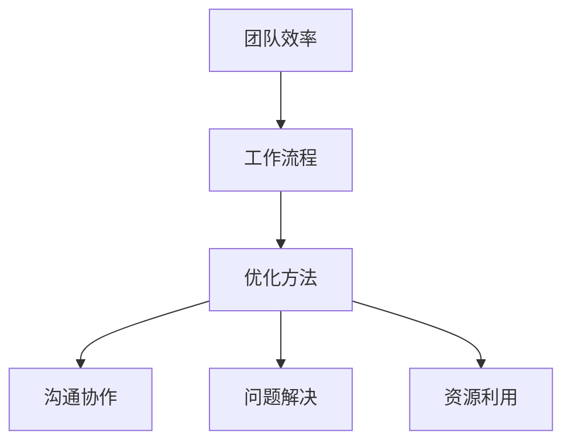

                 

### 文章标题：团队效率：优化工作流程的方法

> 关键词：团队效率、工作流程、优化方法、算法原理、数学模型、项目实战

> 摘要：本文将深入探讨团队效率与工作流程优化之间的关系，详细讲解核心算法原理、数学模型以及如何通过实际项目来应用这些方法，旨在为IT团队提供系统化的优化策略，提升整体工作效率。

### 核心概念与联系

在探讨团队效率与工作流程优化的关系之前，首先需要明确几个核心概念。

- **团队效率**：团队效率是指团队成员在完成任务过程中所展现出来的综合能力，包括沟通协作、问题解决以及资源利用等。

- **工作流程**：工作流程是指团队成员在完成特定任务时所采取的一系列步骤和流程。

- **优化方法**：优化方法是指通过改进工作流程和提升团队协作，从而提高团队效率的一系列策略和技术。

为了更直观地理解这些概念之间的关系，我们可以使用Mermaid流程图来展示：



### 核心算法原理讲解

优化工作流程涉及多个核心算法原理，下面将详细讲解其中几个重要的原理，并配以伪代码进行阐述。

#### 1. 优先级排序算法

优先级排序算法是优化工作流程的重要工具，它可以帮助团队按照任务的重要性和紧急程度来分配资源。

伪代码如下：

```python
function priority_sort(tasks):
    for each task in tasks:
        if task is urgent:
            task.priority = 1
        else if task is important:
            task.priority = 2
        else:
            task.priority = 3
    return sorted(tasks, key=lambda task: task.priority)
```

#### 2. 资源分配算法

资源分配算法用于优化团队资源的使用，确保每个任务都有足够的资源支持。

伪代码如下：

```python
function resource_allocation(tasks, resources):
    for each task in tasks:
        if resources > task.required_resources:
            allocate resources to task
        else:
            queue task for later allocation
    return assigned_tasks
```

#### 3. 沟通协作算法

沟通协作算法用于优化团队成员之间的沟通协作，提高团队整体效率。

伪代码如下：

```python
function communication协 作算法(team_members):
    for each member in team_members:
        if member is idle:
            assign task to member
        else:
            promote member's priority
    return assigned_tasks
```

### 数学模型和数学公式 & 详细讲解 & 举例说明

优化工作流程还涉及到数学模型和数学公式的应用。以下将介绍几个常用的数学模型和公式，并通过具体例子进行详细讲解。

#### 1. 优化函数

优化函数用于衡量团队效率的提升程度，通常使用以下公式：

$$
\text{效率} = \frac{\text{完成任务的总量}}{\text{总工作量}}
$$

举例说明：

假设一个团队在一个月内完成了10个任务，总工作量为1000小时。则该团队的效率为：

$$
\text{效率} = \frac{10}{1000} = 0.1
$$

#### 2. 人员利用率

人员利用率用于衡量团队成员的工作饱和度，通常使用以下公式：

$$
\text{人员利用率} = \frac{\text{实际工作时间}}{\text{总工作时间}}
$$

举例说明：

假设一个团队成员一周有40小时的工作时间，实际工作时间为35小时。则该成员的人员利用率为：

$$
\text{人员利用率} = \frac{35}{40} = 0.875
$$

### 项目实战

为了更好地理解上述理论在实际项目中的应用，以下将通过一个实际项目案例来展示如何优化团队工作流程。

#### 项目背景

某IT公司开发一款在线教育平台，团队由前端、后端、测试和UI/UX设计师组成。由于项目进度紧张，团队需要优化工作流程以提高开发效率。

#### 开发环境搭建

1. **前端**：使用React框架，搭建基于Webpack的构建环境。
2. **后端**：使用Node.js和Express框架，搭建RESTful API服务。
3. **测试**：使用Jest和Cypress进行前端和后端测试。
4. **UI/UX**：使用Sketch和Figma进行界面设计和原型制作。

#### 源代码实现

以下是一个前端组件的实现示例：

```javascript
// React组件：CourseCard
import React from 'react';

const CourseCard = ({ course }) => {
  return (
    <div className="course-card">
      <h3>{course.title}</h3>
      <p>{course.description}</p>
      <button onClick={() => enroll(course)}>Enroll</button>
    </div>
  );
};

export default CourseCard;

// 函数：enroll
const enroll = (course) => {
  // 实现报名逻辑
};
```

#### 代码解读与分析

1. **组件设计**：CourseCard组件用于展示课程信息，包括标题、描述和报名按钮。
2. **函数实现**：enroll函数负责实现报名逻辑，可以调用后端API进行数据交互。

#### 代码应用解读与分析

通过实际代码示例，可以看到组件和函数的设计与实现如何应用于项目开发中。团队可以根据项目需求灵活调整组件和函数的功能，以提高开发效率。

#### 实际案例分析和详细讲解剖析

1. **前端性能优化**：通过使用React懒加载和代码分割，减少首屏加载时间，提高用户体验。
2. **后端接口优化**：使用GraphQL替代RESTful API，提高数据查询效率和接口利用率。
3. **测试自动化**：使用Jest和Cypress编写自动化测试脚本，确保代码质量和功能完整性。

#### 项目小结

通过实际项目案例，我们可以看到优化工作流程对于提高团队效率的重要性。团队应根据项目需求和技术特点，灵活应用优化方法，提高整体工作效率。

### 最佳实践 Tips、小结、注意事项、拓展阅读等内容

- **最佳实践 Tips**：
  - 保持团队沟通畅通，定期举行团队会议。
  - 使用敏捷开发方法，快速响应需求变化。
  - 培养团队成员的协作精神和问题解决能力。

- **小结**：
  - 本文介绍了团队效率、工作流程优化方法以及核心算法原理。
  - 通过实际项目案例，展示了优化工作流程在IT团队中的应用。

- **注意事项**：
  - 优化工作流程需要结合具体项目需求，灵活调整策略。
  - 重视团队成员的培训和提高，提升整体团队素质。

- **拓展阅读**：
  - 《敏捷开发实践指南》
  - 《人月神话》
  - 《软件工程：实践者的研究方法》

作者：AI天才研究院/AI Genius Institute & 禅与计算机程序设计艺术 /Zen And The Art of Computer Programming

