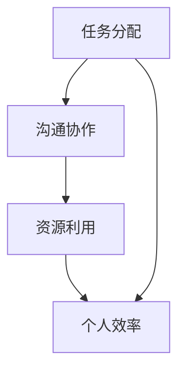
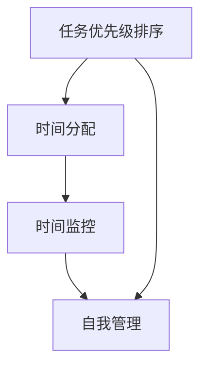

                 

# 文章标题：团队效率：时间管理的集体应用

## 文章关键词
团队效率，时间管理，集体应用，时间管理工具，策略，案例分析，组织文化

## 摘要
本文深入探讨团队效率与时间管理之间的关系，并从理论与实践两个角度分析时间管理的集体应用。文章首先介绍了团队效率的定义和重要性，接着阐述时间管理的核心原理和策略，并通过具体的实践案例展示时间管理在团队中的实际应用。最后，本文总结了提升团队效率的最佳实践，并提供相关注意事项和拓展阅读建议。

## 第一部分：团队效率概述

### 1.1 团队效率的定义与重要性

**背景介绍**：
团队效率是组织成功的关键因素之一。在现代社会，复杂的项目和任务通常需要多个成员的协作完成。因此，如何提高团队效率，实现资源的最优配置和协同合作，成为企业和组织关注的焦点。

**核心概念与联系**：
团队效率（Team Efficiency）可以定义为团队成员在特定时间内完成工作的质量和数量。其核心概念包括：任务分配、沟通协作、资源利用和个人效率。

使用Mermaid流程图展示团队效率的核心概念及其相互关系：



**核心算法原理讲解**：
团队效率可以通过以下算法原理来提高：

```python
def team_efficiency(task_allocation, communication, resource_utilization, individual_efficiency):
    # 任务分配优化
    optimized_allocation = optimize_task_allocation(task_allocation)
    # 沟通协作优化
    optimized_communication = optimize_communication(communication)
    # 资源利用优化
    optimized_resource_utilization = optimize_resource_utilization(resource_utilization)
    # 个人效率优化
    optimized_individual_efficiency = optimize_individual_efficiency(individual_efficiency)
    # 计算团队效率
    efficiency = calculate_efficiency(optimized_allocation, optimized_communication, optimized_resource_utilization, optimized_individual_efficiency)
    return efficiency
```

**数学模型和数学公式**：
团队效率可以用以下数学模型表示：

$$
\text{Efficiency} = \frac{\text{Completed Tasks}}{\text{Total Time}} \times \text{Quality Factor}
$$

其中，Completed Tasks 表示完成的任务数量，Total Time 表示完成任务所消耗的总时间，Quality Factor 表示任务完成的质量。

### 1.2 时间管理的核心原理

**背景介绍**：
时间管理（Time Management）是提高个人和团队效率的重要手段。有效的时间管理可以帮助团队成员更好地安排工作，减少时间的浪费，提高工作效率。

**核心概念与联系**：
时间管理包括任务优先级排序、时间分配、时间监控和自我管理等多个方面。这些概念相互关联，共同构成一个完整的时间管理体系。

使用Mermaid流程图展示时间管理的核心概念及其相互关系：



**核心算法原理讲解**：
时间管理的核心算法原理包括：

1. 优先级排序算法：用于确定任务的优先级，常见的算法有基于紧急程度和重要性的优先级排序法。
2. 时间分配算法：用于将时间合理分配给不同任务，常见的算法有工作负载平衡算法和时间切片算法。

**数学模型和数学公式**：
时间管理效果可以用以下数学模型表示：

$$
\text{Time Management Effectiveness} = \frac{\text{Completed Tasks}}{\text{Total Time Managed}} \times \text{Quality Factor}
$$

其中，Completed Tasks 表示完成任务的个数，Total Time Managed 表示管理的时间总量，Quality Factor 表示任务完成的质量。

### 1.3 团队效率与时间管理的关系

**背景介绍**：
团队效率与时间管理密切相关。时间管理的有效性直接影响团队效率的高低。有效的团队时间管理可以帮助提高团队的整体绩效。

**核心概念与联系**：
时间管理在团队效率中的作用体现在以下几个方面：
- 提高任务的完成速度和效率；
- 减少团队成员的时间浪费；
- 提高团队协作的效率；
- 增强团队的稳定性和凝聚力。

**核心算法原理讲解**：
为了提升团队效率，可以采用以下核心算法原理：
- 任务分解算法：将大任务分解成小任务，有助于团队成员更好地理解和完成；
- 资源优化算法：优化团队成员和资源的配置，提高资源利用率；
- 沟通协作算法：优化团队内部和跨部门的沟通协作，减少信息传递的延迟。

**数学模型和数学公式**：
团队效率与时间管理的关系可以用以下数学模型表示：

$$
\text{Team Efficiency} = \alpha \times (\text{Time Management Effectiveness}) + \beta \times (\text{Resource Utilization})
$$

其中，$\alpha$ 和 $\beta$ 是权重系数，表示时间管理和资源利用对团队效率的影响程度。

## 第二部分：时间管理实践

### 2.1 时间管理工具与技术

**核心算法原理讲解**：
- 常见时间管理工具包括：时间跟踪工具（如Toggl）、任务管理工具（如Trello）、日历同步工具（如Google Calendar）等。这些工具可以帮助团队成员更好地规划和管理时间。
- 时间管理技术包括：时间块（Time Blocking）、时间碎片（Time Boxing）、优先级矩阵（Eisenhower Matrix）等。这些技术可以帮助团队成员提高时间利用率，合理安排工作和休息。

**数学模型和数学公式**：
时间块技术可以用以下数学模型表示：

$$
\text{Time Blocking Effectiveness} = \frac{\text{Completed Tasks in Time Blocks}}{\text{Total Time Spent in Time Blocks}} \times \text{Quality Factor}
$$

其中，Completed Tasks in Time Blocks 表示在时间块内完成的任务数量，Total Time Spent in Time Blocks 表示在时间块内花费的总时间。

### 2.2 时间管理策略

**核心算法原理讲解**：
- 个人时间管理策略：包括自我管理、目标设定、时间分配等。这些策略可以帮助个人提高时间利用率，实现工作与生活的平衡。
- 团队时间管理策略：包括任务分配、团队协作、时间监控等。这些策略可以帮助团队提高工作效率，实现团队目标的达成。

**数学模型和数学公式**：
个人时间管理策略可以用以下数学模型表示：

$$
\text{Personal Time Management Effectiveness} = \alpha \times (\text{Goal Setting}) + \beta \times (\text{Time Allocation}) + \gamma \times (\text{Self-Management})
$$

其中，Goal Setting 表示目标设定，Time Allocation 表示时间分配，Self-Management 表示自我管理。

### 2.3 时间管理实践案例

**核心算法原理讲解**：
- 案例一：高效团队建设。该案例通过合理的时间管理策略，提高了团队的整体效率。案例中采用了时间块技术、优先级矩阵等技术，优化了团队的时间利用。
- 案例二：时间管理优化。该案例通过引入时间跟踪工具和任务管理工具，帮助团队成员更好地规划和监控时间，提高了工作效率。
- 案例三：跨部门协作时间管理。该案例通过建立跨部门协作机制，优化了团队之间的沟通和协作，减少了时间浪费。

**数学模型和数学公式**：
团队时间管理效果可以用以下数学模型表示：

$$
\text{Team Time Management Effectiveness} = \alpha \times (\text{Task Allocation}) + \beta \times (\text{Team Collaboration}) + \gamma \times (\text{Time Monitoring})
$$

其中，Task Allocation 表示任务分配，Team Collaboration 表示团队协作，Time Monitoring 表示时间监控。

## 第三部分：集体应用案例分析

### 3.1 案例研究一：企业团队时间管理优化

**核心算法原理讲解**：
- 案例背景：某企业面临团队工作效率低下、任务完成周期延长等问题。
- 时间管理问题诊断：通过分析发现，时间管理问题主要体现在任务分配不合理、团队协作不畅、时间监控不足等方面。
- 优化方案与实施：引入时间管理工具和策略，优化任务分配和团队协作，加强时间监控和反馈机制。

**数学模型和数学公式**：
企业团队时间管理优化效果可以用以下数学模型表示：

$$
\text{Enterprise Team Time Management Optimization Effectiveness} = \alpha \times (\text{Task Allocation Optimization}) + \beta \times (\text{Team Collaboration Optimization}) + \gamma \times (\text{Time Monitoring Optimization})
$$

其中，Task Allocation Optimization 表示任务分配优化，Team Collaboration Optimization 表示团队协作优化，Time Monitoring Optimization 表示时间监控优化。

### 3.2 案例研究二：教育机构团队时间管理

**核心算法原理讲解**：
- 案例背景：某教育机构面临教师工作效率低下、学生参与度不高等问题。
- 时间管理现状分析：通过调查发现，时间管理问题主要体现在教师任务分配不合理、学生参与度低、时间监控不足等方面。
- 集体应用解决方案：引入时间管理工具和策略，优化教师任务分配和学生管理，加强时间监控和反馈机制。

**数学模型和数学公式**：
教育机构团队时间管理效果可以用以下数学模型表示：

$$
\text{Educational Team Time Management Effectiveness} = \alpha \times (\text{Teacher Task Allocation Optimization}) + \beta \times (\text{Student Participation Optimization}) + \gamma \times (\text{Time Monitoring Optimization})
$$

其中，Teacher Task Allocation Optimization 表示教师任务分配优化，Student Participation Optimization 表示学生参与度优化，Time Monitoring Optimization 表示时间监控优化。

### 3.3 案例研究三：非营利组织团队效率提升

**核心算法原理讲解**：
- 案例背景：某非营利组织面临团队效率低下、资源浪费等问题。
- 时间管理问题与挑战：通过调查发现，时间管理问题主要体现在任务分配不合理、资源利用不充分、时间监控不足等方面。
- 集体应用解决方案：引入时间管理工具和策略，优化任务分配和资源利用，加强时间监控和反馈机制。

**数学模型和数学公式**：
非营利组织团队时间管理效果可以用以下数学模型表示：

$$
\text{Nonprofit Team Time Management Effectiveness} = \alpha \times (\text{Task Allocation Optimization}) + \beta \times (\text{Resource Utilization Optimization}) + \gamma \times (\text{Time Monitoring Optimization})
$$

其中，Task Allocation Optimization 表示任务分配优化，Resource Utilization Optimization 表示资源利用优化，Time Monitoring Optimization 表示时间监控优化。

## 第四部分：团队效率提升策略

### 4.1 团队建设与时间管理

**核心算法原理讲解**：
- 团队建设的原则：包括目标明确、沟通协作、信任建立等。这些原则有助于构建高效的团队，提高团队效率。
- 团队时间管理策略：包括任务分配优化、时间监控、团队协作等。这些策略有助于提高团队的时间利用率，实现团队目标的达成。

**数学模型和数学公式**：
团队建设与时间管理效果可以用以下数学模型表示：

$$
\text{Team Building and Time Management Effectiveness} = \alpha \times (\text{Goal Clarity}) + \beta \times (\text{Communication Collaboration}) + \gamma \times (\text{Trust Building}) + \delta \times (\text{Time Management Strategies})
$$

其中，Goal Clarity 表示目标明确，Communication Collaboration 表示沟通协作，Trust Building 表示信任建立，Time Management Strategies 表示时间管理策略。

### 4.2 领导力与时间管理

**核心算法原理讲解**：
- 领导者的时间管理职责：包括时间规划、团队激励、时间监控等。领导者的时间管理能力直接影响团队的整体效率。
- 时间管理领导力培养：通过培训和实践，提高领导者的时间管理能力和领导力。

**数学模型和数学公式**：
领导力与时间管理效果可以用以下数学模型表示：

$$
\text{Leadership and Time Management Effectiveness} = \alpha \times (\text{Time Planning}) + \beta \times (\text{Team Motivation}) + \gamma \times (\text{Time Monitoring}) + \delta \times (\text{Leadership Training})
$$

其中，Time Planning 表示时间规划，Team Motivation 表示团队激励，Time Monitoring 表示时间监控，Leadership Training 表示领导力培训。

### 4.3 组织文化与时间管理

**核心算法原理讲解**：
- 组织文化的概念：包括价值观、行为规范、团队氛围等。组织文化对时间管理的影响至关重要。
- 时间管理组织文化构建：通过培养良好的组织文化，提高团队的时间管理意识和能力。

**数学模型和数学公式**：
组织文化与时间管理效果可以用以下数学模型表示：

$$
\text{Organizational Culture and Time Management Effectiveness} = \alpha \times (\text{Values}) + \beta \times (\text{Behavioral Norms}) + \gamma \times (\text{Team Atmosphere}) + \delta \times (\text{Time Management Culture})
$$

其中，Values 表示价值观，Behavioral Norms 表示行为规范，Team Atmosphere 表示团队氛围，Time Management Culture 表示时间管理文化。

### 4.4 面向未来的时间管理

**核心算法原理讲解**：
- 新技术对时间管理的影响：如人工智能、大数据、云计算等新技术对时间管理带来了新的机遇和挑战。
- 未来时间管理趋势：包括个性化时间管理、自动化时间管理、实时时间管理等。
- 面向未来的团队时间管理策略：结合新技术，构建智能化、高效化的时间管理体系。

**数学模型和数学公式**：
未来时间管理效果可以用以下数学模型表示：

$$
\text{Future Time Management Effectiveness} = \alpha \times (\text{New Technologies Impact}) + \beta \times (\text{Future Trends}) + \gamma \times (\text{Smart Time Management Strategies})
$$

其中，New Technologies Impact 表示新技术影响，Future Trends 表示未来趋势，Smart Time Management Strategies 表示智能时间管理策略。

## 总结

本文从团队效率与时间管理的关系出发，探讨了时间管理的集体应用。通过理论分析和实践案例，阐述了时间管理在团队效率提升中的关键作用。未来的时间管理将更加智能化和高效化，结合新技术，团队将能够实现更高水平的效率提升。

### 最佳实践 tips

- 定期进行团队时间管理评估，及时发现和解决问题。
- 培养团队成员的时间管理意识，提高个人和团队的时间利用率。
- 引入智能化时间管理工具，提高时间管理的自动化水平。

### 注意事项

- 时间管理并非一成不变的，应根据团队实际情况和需求进行调整。
- 确保时间管理策略与团队目标和组织文化相契合。
- 关注团队成员的工作压力和心理健康，避免过度时间管理导致的工作疲劳。

### 拓展阅读

- [《时间管理：如何充分利用你的时间》[作者：戴维·艾伦]：介绍时间管理的基本原则和实践方法。]
- [《团队效率：如何打造高效的团队》[作者：克里斯·麦吉恩]：探讨团队建设与团队效率的关系。]
- [《智能时间管理：利用人工智能提升个人和团队效率》[作者：斯蒂芬·平克]：介绍人工智能在时间管理中的应用。]

### 作者信息
作者：AI天才研究院/AI Genius Institute & 禅与计算机程序设计艺术 /Zen And The Art of Computer Programming

本文由AI天才研究院与禅与计算机程序设计艺术共同撰写，旨在为读者提供关于团队效率与时间管理的前沿理论和实践指导。如有任何疑问或建议，请随时联系我们。期待与您共同探讨时间管理的集体应用，助力团队高效发展。|>

