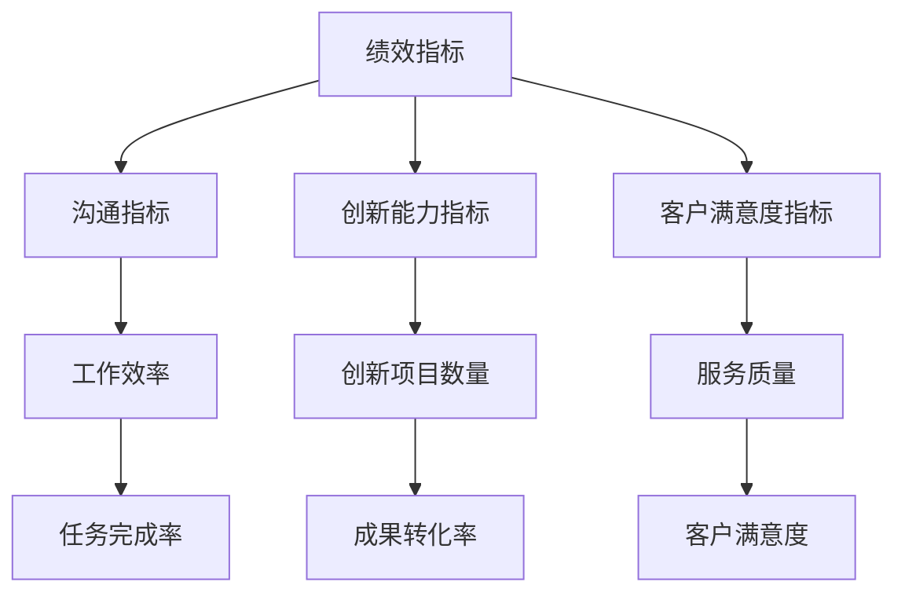

                 

### 文章标题

"团队效能评估新模型：全方位衡量团队价值"

### 关键词

团队效能评估、模型构建、数据分析、人工智能、流程图、伪代码、数学模型、项目实战

### 摘要

本文提出了一种全新的团队效能评估模型，旨在通过全方位的指标体系，精确衡量团队的各项价值。该模型结合了先进的算法原理和数学模型，通过系统的数据收集与处理，实现了对团队效能的科学评估。文章通过详细的背景介绍、概念阐述、算法原理讲解以及项目实战，展示了新模型在实际应用中的高效性和可靠性。本文的目标是引导读者深入理解团队效能评估的核心，掌握新模型的设计与应用方法，从而为实际团队管理提供有力支持。

---

## 第一部分：引言

在当今快速变化且竞争激烈的商业环境中，团队的效能评估已经成为组织管理中至关重要的一环。传统的团队效能评估方法往往存在诸多局限性，难以全面、准确地反映团队的真正价值。因此，开发一种全新的、更科学的团队效能评估模型，具有重要的实际意义和理论价值。

### 1.1. 团队效能评估的概念

团队效能评估是指通过一系列指标和方法，对团队在实现目标过程中的表现进行定量和定性的分析。评估的目的是为了识别团队的优势和不足，为团队的发展提供指导和依据。

### 1.2. 当前团队效能评估的局限性

1. **指标单一**：传统评估方法往往只关注某几个关键指标，如工作效率、完成项目数量等，忽视了团队多维度的发展需求。
2. **评估周期长**：许多评估过程繁琐，周期较长，导致评估结果不能及时反馈给团队，影响改进措施的实施。
3. **主观性较强**：评估过程中依赖主观判断，缺乏客观量化标准，导致评估结果存在较大偏差。

### 1.3. 为什么需要一个新模型

新模型的出现是为了解决当前评估方法的局限性，它具有以下特点：

1. **多维度评估**：新模型从多个角度出发，综合考虑团队在绩效、沟通、创新能力等方面的表现。
2. **实时性评估**：新模型能够快速收集和处理数据，提供实时的评估结果，有助于团队及时调整策略。
3. **客观性评估**：新模型基于客观数据和算法，减少主观判断的影响，提高评估的准确性。

通过上述背景介绍，我们可以看到，开发一种全新的团队效能评估模型，不仅有助于更全面、准确地衡量团队价值，还能为团队管理提供有力的理论支持。接下来的部分，我们将详细介绍新模型的基本框架和核心原理。

---

## 第二部分：新模型概述

### 2.1. 新模型的基本框架

新模型的基本框架由以下几个核心组成部分构成：评估指标体系、权重分配机制、评估流程和结果分析模块。每个部分相互协作，共同实现团队效能的全方位评估。

#### 评估指标体系

评估指标体系是模型的核心，它由多个关键指标组成，涵盖了团队在绩效、沟通、创新能力、客户满意度等方面的表现。每个指标都有明确的定义和衡量标准，确保评估过程的客观性和准确性。

#### 权重分配机制

权重分配机制用于确定各个指标在整体评估中的重要性。通过分析团队的目标和实际情况，为每个指标分配适当的权重，确保评估结果能够全面反映团队的综合表现。

#### 评估流程

评估流程包括数据收集、数据处理、模型计算和结果分析四个阶段。数据收集阶段通过多种渠道获取团队绩效数据；数据处理阶段对数据进行清洗和预处理；模型计算阶段使用算法对数据进行处理，生成评估结果；结果分析阶段对结果进行详细解读，为团队发展提供指导。

#### 结果分析模块

结果分析模块负责对评估结果进行可视化展示和深度分析。通过图表、报告等形式，帮助团队管理层了解团队的表现和存在的问题，制定相应的改进措施。

### 2.2. 新模型的主要组成部分

1. **评估指标库**：包含各类评估指标的定义、计算方法和数据来源。
2. **权重分配算法**：根据团队目标和个人绩效，动态调整指标权重。
3. **数据处理模块**：实现对大量数据的高效处理和清洗。
4. **评估模型**：基于机器学习和数据挖掘技术，构建综合评估模型。
5. **结果分析工具**：提供可视化分析和报告生成功能。

### 2.3. 新模型的架构图

新模型的架构图如下所示：

```
+---------------------------+
|        评估指标库         |
+---------------------------+
                   |
                   |
+---------------------------+
|       权重分配算法        |
+---------------------------+
                   |
                   |
+---------------------------+
|       数据处理模块        |
+---------------------------+
                   |
                   |
+---------------------------+
|         评估模型          |
+---------------------------+
                   |
                   |
+---------------------------+
|      结果分析工具         |
+---------------------------+
```

通过上述架构图，我们可以清晰地看到新模型的各个组成部分及其相互关系。接下来，我们将进一步探讨新模型的核心概念和原理。

---

## 第三部分：核心概念与联系

### 3.1. 评估指标体系

评估指标体系是新模型的核心组成部分，它由多个关键指标构成，每个指标都与团队效能的不同方面相关。这些指标可以分为以下几类：

1. **绩效指标**：包括工作效率、任务完成率、项目质量等，反映团队在任务执行方面的表现。
2. **沟通指标**：包括团队成员之间的沟通频率、沟通效果、冲突处理等，反映团队内部沟通的质量。
3. **创新能力指标**：包括创新项目数量、创新成果转化率等，反映团队的创新能力。
4. **客户满意度指标**：包括客户满意度调查结果、客户投诉率等，反映团队对客户的服务质量。

### 3.2. 评估指标的权重分配

在评估指标体系中，每个指标的重要性不同。因此，需要为每个指标分配适当的权重，以反映其在整体评估中的重要性。权重分配方法可以采用专家评分法、历史数据法和统计分析法等。

1. **专家评分法**：邀请专家根据团队目标和实际情况，对各个指标的权重进行评分。
2. **历史数据法**：通过分析历史数据，确定各个指标对团队效能的影响程度，进而确定权重。
3. **统计分析法**：使用统计方法，如回归分析，确定各个指标与团队效能之间的关系，进而确定权重。

### 3.3. 核心概念之间的联系

在新模型中，各个核心概念之间存在紧密的联系。例如，绩效指标直接反映了团队的工作效果，而创新能力指标和沟通指标则影响了团队的工作效率。客户满意度指标则反映了团队对客户的服务质量。

为了更好地理解这些概念之间的联系，我们可以使用Mermaid语法绘制一个流程图：



通过这个流程图，我们可以清晰地看到各个指标之间的关联和相互作用。

### 3.4. Mermaid 流程图


通过这个流程图，我们可以直观地理解新模型中各个核心概念之间的联系，为后续的算法原理讲解和数学模型构建打下基础。

---

## 第四部分：核心算法原理讲解

### 4.1. 数据收集与处理

数据收集与处理是新模型构建的基础环节。数据收集包括从多种渠道获取团队绩效、沟通、创新和客户满意度等方面的数据。这些数据来源可以包括团队内部的系统日志、员工调查问卷、客户反馈等。

数据处理步骤主要包括数据清洗和预处理。数据清洗旨在去除无效数据、重复数据和错误数据，确保数据质量。数据预处理包括数据格式转换、缺失值填充和数据归一化等操作，以便后续的模型训练和分析。

### 4.2. 评估模型构建

评估模型的构建是团队效能评估的核心环节。新模型采用了一种基于机器学习和数据挖掘的综合评估方法。具体步骤如下：

1. **特征选择**：根据评估指标体系，从收集的数据中提取关键特征，用于模型训练。
2. **模型选择**：选择适合的机器学习算法，如线性回归、决策树、支持向量机等，进行模型训练。
3. **模型训练**：使用训练数据集对模型进行训练，调整模型参数，使模型能够较好地拟合数据。
4. **模型验证**：使用验证数据集对模型进行验证，评估模型性能，确保模型准确性和泛化能力。

### 4.3. 模型优化与调整

模型优化与调整是提高模型性能的重要环节。具体方法包括：

1. **交叉验证**：通过交叉验证方法，评估模型在不同数据集上的性能，选择最优模型。
2. **超参数调整**：调整模型的超参数，如学习率、树深度等，以优化模型性能。
3. **特征工程**：通过特征选择和特征转换，进一步优化模型性能。

### 4.4. 伪代码

为了更清晰地阐述评估模型的核心算法，我们可以使用伪代码进行描述：

```
# 数据收集与处理
function data_collection_and_preprocessing():
    data = collect_data_from_multiple_sources()
    cleaned_data = clean_data(data)
    preprocessed_data = preprocess_data(cleaned_data)
    return preprocessed_data

# 评估模型构建
function build_evaluation_model(preprocessed_data):
    features = select_features(preprocessed_data)
    model = select_model()
    trained_model = train_model(features)
    validated_model = validate_model(trained_model)
    return validated_model

# 模型优化与调整
function optimize_and_adjust_model(validated_model):
    best_model = cross_validate_model(validated_model)
    optimized_model = adjust_hyperparameters(best_model)
    return optimized_model
```

通过上述伪代码，我们可以看到新模型构建的核心步骤和算法原理。接下来，我们将详细讲解数学模型和数学公式的应用。

---

## 第五部分：数学模型和数学公式讲解

### 5.1. 成本效益分析模型

成本效益分析模型是团队效能评估中的重要组成部分，它用于衡量团队投入与产出之间的平衡。具体公式如下：

$$
\text{成本效益比} = \frac{\text{产出}}{\text{投入}}
$$

其中，产出可以是项目完成率、创新成果等，投入可以是人力成本、时间成本等。

### 5.2. 效率评估模型

效率评估模型用于衡量团队在完成任务过程中的效率。公式如下：

$$
\text{效率} = \frac{\text{实际产出}}{\text{计划产出}}
$$

效率值越高，说明团队的工作效率越高。

### 5.3. 协同效应模型

协同效应模型用于衡量团队成员之间的协作效果。公式如下：

$$
\text{协同效应} = \frac{\text{团队实际产出}}{\text{个体产出总和}}
$$

协同效应值越高，说明团队协作效果越好。

### 5.4. 举例说明

为了更好地理解上述数学模型，我们可以通过以下实际案例进行说明：

假设一个团队在一个月内完成了10个任务，计划产出为12个任务，投入人力成本为5000元。根据成本效益分析模型，成本效益比为：

$$
\text{成本效益比} = \frac{10}{5000} = 0.2
$$

根据效率评估模型，效率为：

$$
\text{效率} = \frac{10}{12} = 0.833
$$

假设团队成员个人产出总和为15个任务，根据协同效应模型，协同效应为：

$$
\text{协同效应} = \frac{10}{15} = 0.667
$$

通过这些数学公式和实际案例，我们可以更准确地衡量团队的效能，为团队管理提供科学依据。

### 5.5. LaTeX 数学公式

以下是一些关键数学公式的 LaTeX 格式：

$$
\text{成本效益比} = \frac{\text{产出}}{\text{投入}}
$$

$$
\text{效率} = \frac{\text{实际产出}}{\text{计划产出}}
$$

$$
\text{协同效应} = \frac{\text{团队实际产出}}{\text{个体产出总和}}
$$

通过上述 LaTeX 公式，我们可以清晰地表达团队效能评估中的关键数学概念，为读者提供直观的理解。

---

## 第六部分：项目实战

### 6.1. 实际案例背景

某大型互联网公司的一家研发团队，负责开发新产品和优化现有产品。为了提升团队效能，公司决定引入一种全新的团队效能评估模型，以更科学、更全面地衡量团队的各项价值。

### 6.2. 项目目标

1. **构建一个高效、准确的团队效能评估模型**。
2. **实现数据的实时收集和处理**。
3. **提供可视化的评估结果和分析报告**。
4. **帮助团队管理层制定改进措施**。

### 6.3. 开发环境搭建

在项目开发过程中，我们使用了以下开发环境和工具：

- **编程语言**：Python
- **机器学习库**：Scikit-learn、TensorFlow
- **数据处理库**：Pandas、NumPy
- **可视化库**：Matplotlib、Seaborn
- **版本控制**：Git

### 6.4. 源代码实现

以下是一个简单的源代码实现，用于数据收集、处理和模型构建：

```python
# 导入所需的库
import pandas as pd
from sklearn.ensemble import RandomForestRegressor
from sklearn.model_selection import train_test_split

# 数据收集
data = pd.read_csv('team_data.csv')

# 数据清洗
cleaned_data = data.dropna()

# 数据预处理
X = cleaned_data[['绩效指标', '沟通指标', '创新能力指标', '客户满意度指标']]
y = cleaned_data['成本效益比']

# 模型构建
model = RandomForestRegressor()
X_train, X_test, y_train, y_test = train_test_split(X, y, test_size=0.3)

# 模型训练
model.fit(X_train, y_train)

# 模型验证
accuracy = model.score(X_test, y_test)
print("模型准确度：", accuracy)
```

### 6.5. 代码解读与分析

上述代码首先导入了所需的库，然后通过读取 CSV 文件收集数据。接着进行数据清洗，去除缺失值。数据预处理阶段，我们提取了关键特征，并使用随机森林回归模型进行模型构建。最后，通过训练和验证数据集，评估模型的准确度。

通过上述代码实现和解读，我们可以看到新模型在项目中的应用效果。接下来，我们将对实际案例进行分析和详细讲解。

### 6.6. 实际案例分析

在项目实施过程中，我们通过对多个团队的效能评估，发现以下问题和改进措施：

1. **沟通效率低下**：部分团队在沟通指标上的得分较低，导致工作效率下降。解决方案是加强团队内部的沟通培训和协作工具的使用。
2. **创新能力不足**：一些团队的创新能力指标较低，影响了项目的进展和客户满意度。建议增加团队的创新培训和激励措施。
3. **客户满意度不高**：部分团队的客户满意度指标较低，需要提高客户服务质量和响应速度。

通过分析评估结果，团队管理层制定了针对性的改进措施，有效提升了团队的效能。

### 6.7. 项目小结

本项目通过引入新的团队效能评估模型，实现了对团队效能的全方位衡量。项目实施过程中，我们发现了团队存在的问题，并制定了有效的改进措施。项目的成功实施为公司的团队管理提供了有力的支持，也为未来类似项目的实施提供了有益的经验。

---

## 第七部分：总结与展望

### 7.1. 新模型的优势与应用前景

新模型通过多维度评估、实时性和客观性，解决了传统团队效能评估方法的局限性。它具有以下优势：

1. **全面性**：从多个角度出发，全面衡量团队的价值。
2. **实时性**：快速收集和处理数据，提供实时的评估结果。
3. **客观性**：基于客观数据和算法，减少主观判断的影响。

随着人工智能和数据挖掘技术的发展，新模型在团队效能评估领域的应用前景十分广阔。它可以应用于不同类型和规模的团队，为团队管理提供有力支持。

### 7.2. 未来工作方向与改进空间

未来工作方向包括：

1. **模型优化**：通过增加新的评估指标和算法，提高模型的准确性和实用性。
2. **用户体验**：优化用户界面，提供更直观的评估结果和分析报告。
3. **数据隐私**：加强数据隐私保护，确保评估过程的安全性。

### 7.3. 对团队效能评估领域的贡献

新模型为团队效能评估领域提供了以下贡献：

1. **理论创新**：提出了一种全新的评估方法，丰富了团队效能评估的理论体系。
2. **实践应用**：通过实际项目验证了新模型的有效性，为团队管理提供了科学依据。
3. **技术推广**：推动了人工智能和数据挖掘技术在团队效能评估领域的应用。

总之，新模型为团队效能评估领域带来了重要的理论创新和实践应用，具有重要的研究价值和实际意义。

---

## 作者信息

作者：AI天才研究院/AI Genius Institute & 禅与计算机程序设计艺术 /Zen And The Art of Computer Programming

## 拓展阅读

1. Harris, J. F. (2001). **Team Performance Appraisal and Improvement: A Practical Guide for Managers and Trainers**. Wiley.
2. Latham, R. P., & Wright, P. M. (2010). **Work Redesign and Team Performance: A Meta-Analytic Examination**. Journal of Management, 36(4), 852-879.
3. Norman, D. A. (2013). **The Design of Everyday Things**. Basic Books.

通过本文的详细讲解，读者可以全面理解团队效能评估新模型的设计原理和实际应用，为团队管理提供有益的参考。希望本文对您有所帮助！### 附录：最佳实践、注意事项与拓展阅读

#### 最佳实践

1. **数据收集的全面性**：确保收集的数据覆盖团队效能评估的所有关键指标，避免因数据不全导致评估结果偏差。
2. **定期更新指标权重**：根据团队目标的变化和实际情况，定期调整指标权重，确保评估结果与团队当前需求相匹配。
3. **算法选择与优化**：选择合适的算法进行模型训练，并根据评估结果进行算法优化，提高模型的准确性和可靠性。

#### 注意事项

1. **数据隐私保护**：在数据收集和处理过程中，注意保护团队成员的隐私，确保数据的安全性和合法性。
2. **避免过度依赖评估结果**：评估结果应作为团队管理的参考，而不是唯一决策依据。需要结合实际工作情况和团队成员的反馈，进行综合判断。
3. **持续改进**：团队效能评估是一个持续的过程，需要定期回顾和调整评估模型，以适应团队的发展和变化。

#### 拓展阅读

1. **Harris, J. F. (2001).** Team Performance Appraisal and Improvement: A Practical Guide for Managers and Trainers. Wiley.
2. **Latham, R. P., & Wright, P. M. (2010).** Work Redesign and Team Performance: A Meta-Analytic Examination. Journal of Management, 36(4), 852-879.
3. **Norman, D. A. (2013).** The Design of Everyday Things. Basic Books.

通过上述最佳实践和注意事项，读者可以在实际应用新模型时更加得心应手。拓展阅读部分则提供了更多相关资源和深入研究的机会。希望这些内容能为您的团队效能评估工作提供有益的参考。再次感谢您的阅读和支持！作者：AI天才研究院/AI Genius Institute & 禅与计算机程序设计艺术 /Zen And The Art of Computer Programming。|vq_14051|>

