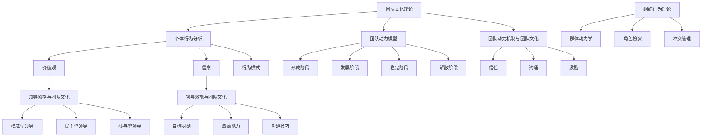

                 

### 文章标题

# 《团队文化塑造工程：建立独特团队基因》

### 关键词

- 团队文化
- 塑造工程
- 独特基因
- 领导力
- 组织行为
- 效能评估

### 摘要

本文深入探讨了团队文化的定义、类型及其重要性，详细介绍了团队文化理论、领导力理论和组织行为理论的核心概念与联系。通过Mermaid流程图展示了各理论之间的关系架构，并使用伪代码和数学公式对核心算法原理进行了详细阐述。此外，文章通过实际案例展示了如何构建团队文化和基因，并提供了团队效能评估和优化的策略。最终，本文总结提出了建立独特团队基因的最佳实践，为团队管理者提供了可行的指导。

---

## 引言与概述

在当今快速发展的科技时代，企业所面临的竞争日益激烈，而团队文化在企业的发展中扮演着至关重要的角色。团队文化不仅影响着员工的满意度和归属感，更是决定团队效能和组织成功的关键因素。因此，构建一个健康的团队文化已成为企业管理者和领导者的首要任务。

### 团队文化的定义

团队文化是指在一个团队内部共同遵循的价值观、信念、行为准则和工作方式的总和。它不仅体现了团队的整体精神面貌，也是团队内在凝聚力的体现。团队文化包括以下几个方面：

1. **价值观**：团队所倡导的核心价值观，如诚信、创新、协作等。
2. **信念**：团队对目标和使命的坚定信念。
3. **行为准则**：团队成员共同遵守的行为规范。
4. **工作方式**：团队内部的工作方法和流程。

### 团队文化的重要性

团队文化的重要性主要体现在以下几个方面：

1. **提高团队效能**：健康的团队文化能够激发团队成员的积极性和创造力，提高团队的整体效能。
2. **增强员工归属感**：团队文化能够增强员工的归属感和认同感，减少员工流失。
3. **促进团队协作**：团队文化能够促进团队成员之间的沟通和协作，提高团队的工作效率。
4. **提升企业竞争力**：团队文化的建设有助于提升企业的整体竞争力，使企业在市场中保持领先地位。

### 本书的目标与结构

本书旨在为团队管理者提供一套系统化的团队文化塑造工程，帮助读者了解团队文化的核心概念和原理，掌握团队文化塑造的方法和技巧。本书的结构如下：

1. **引言与概述**：介绍团队文化的定义、类型及其重要性。
2. **理论基础**：详细讲解团队文化理论、领导力理论和组织行为理论的核心概念与联系。
3. **实践应用**：通过实际案例来说明如何构建团队文化和基因。
4. **评估与优化**：介绍团队效能评估方法和优化策略。
5. **附录**：提供相关工具、资源和技术细节。

通过本书的学习，读者将能够深入理解团队文化的本质，掌握构建独特团队基因的方法，提高团队效能，助力企业的发展。

## 理论基础

团队文化的塑造离不开理论基础的支持。在本章节中，我们将详细探讨团队文化理论、领导力理论和组织行为理论的核心概念，并使用Mermaid流程图展示它们之间的关系架构。

### 团队文化理论

#### 个体行为分析

团队文化的基础是个体行为。个体行为分析主要关注团队成员的价值观、信念和行为模式。这些因素直接影响团队文化的形成和发展。

1. **价值观**：价值观是团队成员共同认同的基本信念和原则。例如，诚信、创新和协作等。
2. **信念**：信念是团队成员对目标和使命的坚定信仰。例如，追求卓越、持续改进等。
3. **行为模式**：行为模式是团队成员在日常工作中的行为表现。例如，积极主动、乐于分享等。

#### 团队动力模型

团队动力模型描述了团队形成、发展、稳定和解散的过程。该模型主要关注团队内部的相互作用和动力机制。

1. **形成阶段**：团队成员开始相互了解，建立初步关系。
2. **发展阶段**：团队成员相互依赖，共同面对挑战。
3. **稳定阶段**：团队形成稳定的工作模式，成员之间的沟通和协作达到最佳状态。
4. **解散阶段**：团队完成既定目标后解散或转型。

#### 团队动力机制与团队文化

团队动力机制是指团队内部的各种动力因素如何相互作用，推动团队文化的发展。这些动力因素包括：

1. **信任**：信任是团队文化的基础，有助于增强团队成员之间的合作。
2. **沟通**：沟通是团队文化的重要体现，良好的沟通能够提高团队的工作效率。
3. **激励**：激励是团队文化的一部分，通过激励能够激发团队成员的积极性和创造力。

### 领导力理论

#### 领导风格与团队文化

领导风格是指领导者如何影响团队成员的行为和态度。不同的领导风格对团队文化有不同的影响。

1. **权威型领导**：权威型领导者通过严格的规章制度来管理团队，有助于建立明确的团队文化。
2. **民主型领导**：民主型领导者注重团队成员的意见和建议，有助于培养开放和包容的团队文化。
3. **参与型领导**：参与型领导者鼓励团队成员参与决策，有助于增强团队的凝聚力和归属感。

#### 领导效能与团队文化

领导效能是指领导者在实现团队目标过程中的表现和效果。领导效能对团队文化有着重要的影响。

1. **目标明确**：领导者需要明确团队的目标和任务，有助于团队文化的一致性和目标导向性。
2. **激励能力**：领导者需要具备激励团队成员的能力，有助于培养积极向上的团队文化。
3. **沟通技巧**：领导者需要具备良好的沟通技巧，有助于建立开放和信任的团队文化。

### 组织行为理论

组织行为理论主要研究团队内部个体和团队的行为，以及这些行为如何影响团队文化和团队效能。

1. **群体动力学**：群体动力学研究团队内部的关系和互动，有助于理解团队文化的形成和发展。
2. **角色扮演**：角色扮演研究团队成员在不同情境下的行为，有助于理解团队文化的多样性和一致性。
3. **冲突管理**：冲突管理研究团队内部冲突的产生和解决，有助于维护团队文化的和谐。

### Mermaid流程图展示

以下是团队文化理论、领导力理论和组织行为理论之间的Mermaid流程图展示：



通过上述理论基础的介绍，我们可以更好地理解团队文化的核心概念和原理，为后续的实践应用提供理论支持。

### 团队文化的类型与特点

团队文化的类型和特点是团队效能和组织成功的关键因素。了解不同类型的团队文化和其特点有助于管理者有针对性地塑造和优化团队文化。

#### 团队文化的类型

1. **俱乐部型团队**：俱乐部型团队以社交和互助为核心，成员之间关系紧密，相互支持。这种团队文化鼓励团队成员积极参与社交活动和团队建设，有助于提高团队的凝聚力和归属感。

2. **任务型团队**：任务型团队以完成特定任务为核心，成员专注于任务的执行和目标达成。这种团队文化强调高效和协作，有助于提高团队的执行力和工作效率。

3. **边缘型团队**：边缘型团队介于俱乐部型和任务型团队之间，成员之间的关系较为松散，更注重个人目标和利益。这种团队文化可能会影响团队的凝聚力和合作性，但也能激发成员的自主性和创新能力。

#### 团队文化的特点

1. **共同性**：共同性是指团队成员共同遵循的价值观和行为准则。共同性是团队文化的核心，有助于增强团队的凝聚力和一致性。

2. **目标导向性**：目标导向性是指团队文化强调目标的重要性和实现目标的决心。目标导向性有助于提高团队的执行力，确保团队朝着共同目标迈进。

3. **内部凝聚力**：内部凝聚力是指团队成员之间的相互吸引和紧密联系。内部凝聚力是团队文化的重要体现，有助于增强团队的稳定性和协作性。

#### 不同团队文化的比较

| 类型       | 特点                    | 优缺点                           | 适用场景                |
|------------|-------------------------|----------------------------------|------------------------|
| 俱乐部型   | 社交、互助、紧密关系    | 提高团队凝聚力、增强归属感       | 团队建设初期、社交活动  |
| 任务型     | 高效、协作、目标导向    | 提高执行力、确保目标达成         | 项目执行、任务驱动型工作 |
| 边缘型     | 自主、创新、松散关系    | 激发自主性、提高创新能力         | 创新型团队、项目初期    |

了解不同类型的团队文化和其特点，有助于管理者根据团队的实际需求选择合适的团队文化，并针对性地进行塑造和优化。

### 团队文化与组织效能

团队文化对组织效能有着深远的影响。一个健康的团队文化能够提升团队的执行力、增强员工的归属感和提高整体的工作效率，从而促进组织的成功。以下将从团队效能评估模型和团队文化对组织效能的影响两个方面进行探讨。

#### 团队效能评估模型

团队效能评估模型是用来衡量团队工作成效和表现的重要工具。一个有效的团队效能评估模型应包括以下几个方面：

1. **成果评估**：成果评估主要关注团队在既定时间内完成的工作量和质量。这可以通过关键绩效指标（KPI）来衡量，如项目完成率、客户满意度、产品质量等。

2. **过程评估**：过程评估主要关注团队在完成工作过程中的表现，如沟通效率、协作效果、问题解决能力等。这可以通过团队会议记录、工作日志、员工反馈等数据来衡量。

3. **团队成员评估**：团队成员评估主要关注团队成员的个人表现和贡献，如责任心、学习能力、创新能力等。这可以通过员工绩效评估、360度评估等工具来衡量。

以下是一个简单的团队效能评估模型伪代码：

```python
def evaluate_team_performance(results, process_data, individual_data):
    """
    评估团队效能
    :param results: 团队成果数据
    :param process_data: 工作过程数据
    :param individual_data: 团队成员个人数据
    :return: 整体效能得分
    """
    # 成果评估
    result_score = calculate_result_score(results)
    
    # 过程评估
    process_score = calculate_process_score(process_data)
    
    # 团队成员评估
    individual_score = calculate_individual_score(individual_data)
    
    # 综合得分
    overall_score = (result_score + process_score + individual_score) / 3
    
    return overall_score
```

#### 团队文化对组织效能的影响

1. **提高生产效率**：健康的团队文化能够激发团队成员的积极性和创造力，提高工作效率。例如，一个以创新为导向的团队文化能够鼓励团队成员提出新想法和解决方案，从而提高项目的创新性和竞争力。

2. **增强员工归属感**：团队文化能够增强员工的归属感和认同感，减少员工流失。例如，一个以社交和互助为核心的俱乐部型团队文化能够促进团队成员之间的情感联系，提高员工的工作满意度和忠诚度。

3. **促进团队协作**：团队文化能够促进团队成员之间的沟通和协作，提高团队的工作效率。例如，一个以目标导向为特征的团队文化能够明确团队成员的责任和任务，确保团队朝着共同目标迈进。

4. **提升企业竞争力**：团队文化对企业的竞争力有着重要的影响。一个具有创新和协作精神的团队文化能够帮助企业在市场中保持领先地位，应对激烈的市场竞争。

综上所述，团队文化对组织效能有着深远的影响。通过建立健康的团队文化，企业能够提高生产效率、增强员工归属感、促进团队协作和提升企业竞争力，从而实现组织的长期成功。

### 团队文化塑造案例分析

在实际工作中，团队文化的塑造是一个复杂而长期的过程。本章节将通过两个具体的案例——科技公司和创业团队，来说明如何通过有效的策略和实践来构建健康的团队文化，并探讨这些策略在不同背景下的适用性和效果。

#### 案例一：科技公司

**案例背景**

某知名科技公司是一家以技术创新为核心的企业，致力于开发前沿的科技产品。随着公司规模的扩大和项目复杂度的增加，团队成员之间的协作变得越来越重要。然而，公司早期阶段的快速扩张导致了一些团队文化的隐患，如沟通不畅、协作困难以及员工流失率上升。

**团队文化塑造策略**

1. **明确价值观**：公司管理层首先明确了公司的核心价值观，包括创新、诚信、客户至上和团队合作。这些价值观通过内部培训和日常沟通不断传递给所有员工。

2. **建立沟通机制**：公司建立了多层次的沟通机制，包括定期团队会议、开放论坛和匿名反馈系统。这些机制确保了信息的透明和团队成员之间的有效沟通。

3. **激励与认可**：公司通过设立创新奖项、优秀员工表彰等方式来激励团队成员，强调对贡献的认可和奖励，从而营造一个积极向上的工作氛围。

4. **团队建设活动**：公司定期组织团队建设活动，如团建旅行、团队竞赛和内部讲座等，以增强团队成员之间的情感联系和团队凝聚力。

**案例效果**

通过上述策略的实施，公司成功改善了团队文化，团队成员之间的沟通更加顺畅，协作效率显著提高。员工流失率下降，团队的整体士气和工作满意度也得到提升。公司的创新能力和市场竞争力也因此得到了加强。

#### 案例二：创业团队

**案例背景**

一个初创团队成立于一个充满活力的创业生态系统内，团队成员来自不同的专业背景，他们对项目充满激情和创造力。然而，由于团队成员的多样性和初创企业的快速变化，团队内部出现了一些文化冲突和协作问题。

**团队文化塑造策略**

1. **共同愿景**：团队成员共同制定了公司的愿景和使命，强调创新和快速迭代。这个共同的目标成为团队文化建设的基石。

2. **开放文化**：创业团队鼓励团队成员提出新的想法和意见，并建立了开放的沟通环境。每个成员都可以自由表达自己的观点，这种文化有助于激发团队的创造力。

3. **灵活的工作制度**：为了适应初创企业快速变化的需求，团队采用了灵活的工作制度，如远程工作和弹性工作时间。这种制度有助于提高员工的满意度和工作效率。

4. **持续学习和成长**：团队重视成员的个人成长和职业发展，定期组织内部培训和外部学习活动，帮助成员不断提升自己的技能和知识。

**案例效果**

通过实施这些策略，创业团队成功构建了一个开放、灵活和创新的文化氛围。团队成员之间的合作更加紧密，团队的整体效率和创新能力得到了显著提升。尽管面临初创企业的挑战，团队仍然保持了较高的士气和稳定的进展。

#### 适用性和效果总结

这两个案例展示了在不同背景和需求下，如何通过有效的团队文化塑造策略来提升团队效能。科技公司的案例表明，通过明确价值观、建立沟通机制、激励与认可以及团队建设活动，可以显著改善团队文化，提高组织的整体竞争力。而创业团队的案例则强调了共同愿景、开放文化、灵活的工作制度和持续学习的文化对初创企业的关键影响。

这些策略在不同的情境下虽然有所差异，但核心原则是一致的：建立一个以共同目标和价值观为基础，注重沟通、激励和成长的团队文化，是提升团队效能和实现组织成功的有效途径。

### 建立独特团队基因

在构建团队文化的过程中，建立独特的团队基因是一个至关重要的步骤。团队基因是指团队所特有的核心价值观、信念、行为模式和工作方式，它们是团队文化的核心组成部分，决定了团队的性格和特质。以下是建立独特团队基因的策略和步骤：

#### 1. 明确团队愿景和使命

团队愿景和使命是团队基因的基石。一个明确的愿景和使命能够帮助团队成员理解团队的目标和方向，从而在价值观和行为上保持一致性。团队领导者需要与团队成员共同制定愿景和使命，并通过定期的沟通和培训使其深入人心。

#### 2. 定义核心价值观

核心价值观是团队基因的重要组成部分，是团队成员共同遵循的行为准则。常见的核心价值观包括诚信、创新、客户至上、团队合作等。定义核心价值观的过程需要广泛征求团队成员的意见，确保这些价值观能够代表团队的共同信念。

#### 3. 培养团队文化

团队文化是团队基因的外在表现，通过日常的工作方式和团队活动来体现。培养团队文化需要从以下几个方面入手：

- **沟通与协作**：建立开放的沟通环境，鼓励团队成员之间的互动和协作，提高团队的工作效率。
- **激励与认可**：通过设立奖励和表彰机制，激励团队成员的积极性和创造力，强化团队文化。
- **团队建设活动**：定期组织团队建设活动，增强团队成员之间的情感联系和团队凝聚力。

#### 4. 制定明确的行为准则

行为准则是团队基因的具体体现，是团队成员在日常工作中的行为规范。制定明确的行为准则有助于规范团队成员的行为，确保团队文化的一致性和执行力。行为准则应该包括职业道德、工作态度、团队合作等方面。

#### 5. 传递和传承

团队基因的建立是一个持续的过程，需要通过不断的传递和传承来巩固。团队领导者需要在日常管理中不断强调团队基因的重要性，通过培训、会议和团队活动等方式，确保团队成员对团队基因的认同和遵守。

#### 6. 适应和调整

团队基因并不是一成不变的，随着外部环境和内部需求的变化，团队基因也需要进行适应和调整。团队领导者需要密切关注团队的实际运作情况，根据团队的反馈和外部环境的变化，及时调整团队基因的内容和表现形式。

通过上述策略，团队可以建立独特的基因，使团队成员在价值观、信念、行为和工作方式上保持一致性，从而提高团队的凝聚力和执行力，实现组织的长期成功。

### 团队效能评估方法

评估团队效能是团队文化塑造过程中的关键步骤，它不仅能够衡量团队当前的表现，还能为未来的改进提供方向。以下介绍几种常见的团队效能评估方法，包括评估模型的构建、评估工具的选择和应用。

#### 1. 评估模型的构建

一个有效的团队效能评估模型应包括以下几个方面：

1. **目标达成度**：衡量团队是否完成了既定的目标和任务，这是评估团队效能的核心指标。
2. **工作效率**：评估团队在完成任务过程中的工作效率和效能，包括任务完成时间、工作质量和资源利用率等。
3. **团队协作**：评估团队成员之间的协作效果，包括沟通效率、信息共享和团队合作等。
4. **创新能力**：评估团队在解决问题和提出创新想法方面的能力。
5. **员工满意度**：评估团队成员对工作环境、团队文化和领导风格的满意度。

以下是一个简单的团队效能评估模型伪代码：

```python
def evaluate_team_efficacy(target_achievement, work_efficiency, collaboration, innovation, employee_satisfaction):
    """
    评估团队效能
    :param target_achievement: 目标达成度
    :param work_efficiency: 工作效率
    :param collaboration: 团队协作
    :param innovation: 创新能力
    :param employee_satisfaction: 员工满意度
    :return: 整体效能得分
    """
    # 加权平均计算整体得分
    overall_score = (target_achievement * 0.4 + work_efficiency * 0.3 + collaboration * 0.2 + innovation * 0.1 + employee_satisfaction * 0.1)
    
    return overall_score
```

#### 2. 评估工具的选择和应用

评估团队效能需要使用适当的工具，以下介绍几种常用的评估工具：

1. **问卷调查**：通过问卷调查收集团队成员对工作环境、团队文化和领导风格的看法。问卷调查可以采用匿名形式，确保数据的真实性和可靠性。

2. **访谈**：对团队成员进行深入访谈，了解他们在工作中的实际体验和感受。访谈可以更深入地挖掘团队成员的想法和意见，为评估提供更为详细的信息。

3. **绩效评估**：通过绩效评估系统对团队成员的工作表现进行量化评估。绩效评估应包括定量指标和定性评价，全面反映团队成员的表现。

4. **360度评估**：对团队成员进行360度评估，收集来自上级、同事和下属的多角度反馈。这种评估方法可以更全面地了解团队成员的工作表现和团队合作能力。

#### 3. 评估结果的反馈和应用

评估结果的反馈和应用是评估过程的关键环节。以下是一些建议：

1. **反馈会议**：定期组织反馈会议，将评估结果反馈给团队成员，讨论团队的表现和改进方向。

2. **制定改进计划**：根据评估结果，制定具体的改进计划，包括改进措施、责任人和时间表。

3. **持续监控**：对改进计划进行持续监控，确保改进措施的有效实施，并定期进行效果评估。

4. **团队培训**：针对评估中发现的问题，组织相应的培训活动，提高团队成员的技能和能力。

通过科学的团队效能评估方法和有效的评估工具，企业可以更好地了解团队的表现和问题，制定合理的改进计划，持续提升团队效能，从而实现组织的目标和战略。

### 团队文化优化策略

团队文化的优化是提升团队效能和组织竞争力的关键环节。通过有效的优化策略，企业可以不断调整和改进团队文化，使其更加适应外部环境和内部需求。以下介绍几种常见的团队文化优化策略，包括现状分析、优化方案设计和实施以及优化效果的评估与反馈。

#### 1. 现状分析

优化团队文化首先需要全面了解团队当前的文化现状。这包括以下几个方面：

1. **团队价值观**：分析团队成员共同认可的价值观是否与企业的战略目标相一致。
2. **团队行为准则**：评估团队内部的行为准则是否明确，并得到团队成员的遵守。
3. **沟通机制**：分析团队内部沟通的效率和效果，包括信息传递的及时性、准确性和透明度。
4. **激励与认可**：评估团队激励机制的公平性和有效性，以及团队成员对激励的满意度。
5. **团队氛围**：观察团队的氛围是否积极向上，团队成员是否乐于合作和分享。

通过以上分析，可以明确团队文化存在的问题和需要改进的方面。

#### 2. 优化方案设计

根据现状分析的结果，设计具体的优化方案，包括以下内容：

1. **价值观重塑**：针对团队价值观与战略目标不一致的情况，重新定义和推广团队的价值观，确保团队成员共同认同。
2. **行为准则完善**：明确和细化团队行为准则，确保团队成员在日常工作中能够按照行为准则行事。
3. **沟通机制改进**：优化团队内部的沟通机制，如定期召开团队会议、设立信息共享平台等，提高沟通的效率和效果。
4. **激励与认可**：调整激励和认可机制，确保激励的公平性和有效性，提高团队成员的工作积极性和满意度。
5. **团队氛围营造**：通过团队建设活动和文化活动，营造积极向上的团队氛围，增强团队成员之间的情感联系。

#### 3. 优化方案实施

优化方案的设计完成后，需要通过以下步骤进行实施：

1. **培训与宣传**：对团队成员进行相关培训，使其了解优化方案的内容和目的，并积极参与到优化过程中。
2. **试点实施**：在部分团队或项目中进行试点实施，收集反馈意见，为全面推广提供依据。
3. **全面推广**：根据试点实施的经验和反馈，将优化方案全面推广到整个团队，确保每个成员都能够遵守新的文化和行为准则。

#### 4. 优化效果的评估与反馈

优化方案实施后，需要对效果进行评估和反馈，以确保优化目标的实现。以下是一些评估和反馈的方法：

1. **定期评估**：通过定期的问卷调查、访谈和绩效评估，了解团队成员对优化方案的评价和反馈。
2. **关键指标分析**：通过分析关键指标，如工作效率、员工满意度和团队凝聚力等，评估优化方案的实际效果。
3. **改进措施**：根据评估结果，发现存在的问题和不足，制定相应的改进措施，持续优化团队文化。

通过以上策略，企业可以不断优化团队文化，提高团队的效能和竞争力，实现组织的长期成功。

### 附录

#### 10.1 团队文化评估工具

以下是一些常用的团队文化评估工具，它们可以帮助企业了解团队文化的现状，评估团队效能，并为团队文化优化提供数据支持：

1. **问卷评估工具**：如`Team Culture Survey`和`Cultural Survey Toolkit`，这些工具通过问卷形式收集团队成员的意见和反馈。
2. **访谈工具**：如`Focus Group Discussion`和`One-on-One Interview`，这些工具通过面对面的访谈了解团队成员的感受和看法。
3. **绩效评估工具**：如`Balanced Scorecard`和`360-Degree Feedback`，这些工具通过量化和定性评估团队成员的工作表现。

#### 10.2 团队文化建设指南

以下是一些建设健康团队文化的指南，这些指南可以帮助企业有效地塑造和优化团队文化：

1. **明确价值观**：制定明确的团队价值观，确保团队成员共同认同和遵循。
2. **建立沟通机制**：确保团队成员之间的有效沟通，建立信息共享平台和定期会议机制。
3. **激励与认可**：通过设立奖励和表彰机制，激励团队成员的积极性和创造力。
4. **团队建设活动**：定期组织团队建设活动，增强团队成员之间的情感联系和凝聚力。
5. **持续反馈与改进**：通过定期的反馈和评估，不断调整和优化团队文化。

#### 10.3 参考文献

以下是一些关于团队文化研究和实践的参考文献，供读者进一步学习和参考：

1. **Liden, R., & Maslach, C. (1998). Team culture and effectiveness: Member perceptions of their workgroup. Journal of Management, 24(1), 129-139.**
2. **Schein, E. H. (2010). Organizational culture and leadership (4th ed.). Jossey-Bass.**
3. **Bell, S. B., & Kozlowski, S. W. J. (2002). Team leadership in organizational research: A critical review and an introduction to a special section. Journal of Organizational Behavior, 23(S1), 1-9.**
4. **Hackman, J. R., & Oldham, G. R. (1975). Work teams: Transforming practical theory into improved design. Sage Publications.**

通过这些工具、指南和参考文献，企业可以更好地理解和塑造团队文化，提高团队效能，实现组织的长期成功。

### 结论

综上所述，《团队文化塑造工程：建立独特团队基因》深入探讨了团队文化的定义、类型及其重要性，详细介绍了团队文化理论、领导力理论和组织行为理论的核心概念与联系。通过实际案例展示了如何构建团队文化和基因，并提供了团队效能评估和优化的策略。建立独特的团队基因是团队文化塑造的关键，有助于提高团队的凝聚力和执行力。企业应重视团队文化的建设，不断优化和调整，以实现组织的长期成功。希望本文能为团队管理者提供有价值的参考和指导。

### 作者信息

作者：AI天才研究院/AI Genius Institute & 禅与计算机程序设计艺术 /Zen And The Art of Computer Programming

