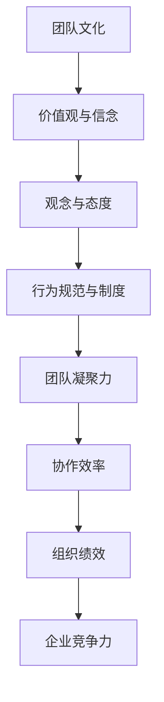

                 

### 文章标题：团队文化塑造：建立独特团队特色的方法

### 关键词：团队文化，团队特色，组织绩效，价值观，领导者，沟通，培训，优化

### 摘要：
本文将深入探讨团队文化塑造的重要性，以及如何通过有效的策略和步骤来建立独特的团队特色。我们将从团队文化的概念与重要性入手，逐步解析团队文化的构成要素、诊断与评估方法，然后详细讨论塑造团队文化的原则与策略，关键环节，特色文化的设计与推广，以及案例分析。最后，我们将提供团队文化维护与优化的实践指南，旨在为团队管理者提供一套完整的文化塑造方案。

## 第一部分：理解团队文化

### 第1章：团队文化的概念与重要性

#### 1.1 团队文化的定义
团队文化是指一个团队在长期发展过程中形成的共同价值观、信念、态度和行为规范的综合体。它是团队精神的物质载体，反映了团队成员的共同追求和团队整体的氛围。

#### 1.2 团队文化的重要性
团队文化对于组织的成功至关重要。它有助于提高团队凝聚力，增强协作效率，提升组织绩效，并形成独特的企业竞争力。以下是团队文化重要性的几个方面：
1. **提升团队凝聚力**：共同的文化价值观能够增强团队成员之间的联系，提高团队的整体士气。
2. **增强协作效率**：明确的行为规范和沟通机制有助于团队成员高效地合作，减少误解和冲突。
3. **提高组织绩效**：团队文化能够激励员工为实现共同目标而努力，从而提升组织的整体绩效。
4. **形成企业竞争力**：独特的团队文化可以成为企业的重要资产，有助于企业在激烈的市场竞争中脱颖而出。

### 1.3 团队文化与组织绩效的关系
团队文化对组织绩效的影响可以通过以下Mermaid流程图来展示：

在这个流程图中，团队文化通过价值观、信念、观念和态度，影响行为规范和制度，进而提升团队凝聚力，增强协作效率，最终提高组织绩效，形成企业竞争力。

### 第2章：团队文化的构成要素

#### 2.1 价值观与信念
价值观是团队文化的核心，是团队成员共同遵守的行为准则。信念是团队成员对价值观的坚定信仰，是团队文化的精神支柱。

#### 2.2 观念与态度
观念是指团队成员对工作、生活、他人等事物的认识和看法。态度是指团队成员对待工作、生活、他人等事物的行为倾向。

#### 2.3 行为规范与制度
行为规范是团队成员在工作和生活中应遵守的行为准则，包括职业道德、工作态度、沟通方式等。制度是团队内部制定的规章制度，用于规范团队成员的行为。

### 第3章：团队文化的诊断与评估

#### 3.1 团队文化诊断方法
团队文化诊断是了解团队当前文化状态的重要步骤。常用的诊断方法包括问卷调查、访谈、观察等。

#### 3.2 团队文化评估工具
团队文化评估工具用于量化团队文化的状态，常用的评估工具包括文化成熟度量表、团队文化调查问卷等。

#### 3.3 团队文化评估结果分析
团队文化评估结果需要进行分析，以了解团队文化的优点和不足，为后续的团队文化塑造提供依据。

## 第二部分：塑造团队文化

### 第4章：团队文化塑造的原则与策略

#### 4.1 文化塑造的原则
1. **统一价值观**：确保团队成员拥有共同的目标和价值观。
2. **尊重个体差异**：尊重每个团队成员的独特性和个性，促进多元化发展。
3. **持续改进**：团队文化需要随着组织发展不断优化和调整。

#### 4.2 文化塑造的策略
1. **领导引领**：领导者需要以身作则，传递和践行团队文化。
2. **培训与教育**：通过培训和教育活动，提高团队成员对团队文化的认知和认同。
3. **激励机制**：建立与团队文化相符的激励机制，鼓励团队成员积极参与文化建设。

#### 4.3 文化塑造的过程
团队文化塑造的过程可以分为以下几个阶段：
1. **规划阶段**：明确团队文化的目标和策略。
2. **实施阶段**：通过具体行动，逐步落实团队文化。
3. **评估阶段**：对团队文化的实施效果进行评估和调整。

### 第5章：团队文化建设的关键环节

#### 5.1 领导者的角色
领导者是团队文化的塑造者和推动者，需要具备以下角色：
1. **文化倡导者**：积极宣传和推广团队文化。
2. **文化监督者**：确保团队成员遵守团队文化。
3. **文化调整者**：根据团队发展需要，适时调整团队文化。

#### 5.2 沟通与共识
沟通是团队文化塑造的关键环节，需要确保团队成员之间信息畅通，形成共识。

#### 5.3 培训与激励
培训是提高团队成员对团队文化认知和认同的重要手段。激励则是激发团队成员积极参与团队文化建设的重要动力。

### 第6章：打造团队特色文化

#### 6.1 团队特色的定义
团队特色是团队文化的重要组成部分，是团队在长期发展过程中形成的独特特质。

#### 6.2 团队特色文化的设计
团队特色文化的设计需要考虑团队的特点和需求，确保文化特色与团队实际相符。

#### 6.3 团队特色文化的推广
团队特色文化的推广需要通过多种渠道，让团队成员充分了解和认同团队特色文化。

### 第7章：团队文化塑造的案例分析

#### 7.1 案例分析一：谷歌的团队文化
谷歌以其独特的团队文化而著称，其文化塑造的经验值得借鉴。

#### 7.2 案例分析二：Facebook的团队文化
Facebook的团队文化强调创新和灵活性，为团队成员提供了广阔的发展空间。

#### 7.3 案例分析三：腾讯的团队文化
腾讯的团队文化注重团队合作和持续学习，为企业的快速发展提供了强大支持。

## 第三部分：维护与优化团队文化

### 第8章：团队文化的维护与传承

#### 8.1 团队文化维护的重要性
团队文化的维护是确保团队长期稳定发展的重要保障。

#### 8.2 团队文化维护的方法
团队文化的维护需要通过多种方法，包括制度保障、培训教育、激励机制等。

#### 8.3 团队文化传承的策略
团队文化的传承需要通过师徒制度、文化传承活动等方式，确保团队文化在代际间传递。

### 第9章：团队文化的优化与变革

#### 9.1 团队文化优化的需求分析
团队文化的优化需要基于对团队发展需求的准确分析。

#### 9.2 团队文化优化的实施策略
团队文化的优化需要通过系统规划和逐步实施，确保文化变革的顺利推进。

#### 9.3 团队文化变革的步骤与注意事项
团队文化变革需要遵循科学的步骤和注意事项，以确保变革的成功。

### 第10章：团队文化塑造的实践指南

#### 10.1 团队文化塑造的实战步骤
团队文化塑造需要遵循一定的实战步骤，确保文化塑造的有效性。

#### 10.2 团队文化塑造的常见问题与解决方法
在团队文化塑造过程中，可能会遇到各种问题。本文将提供常见的解决方法。

#### 10.3 团队文化塑造的成功案例与启示
通过分析成功案例，本文将提供团队文化塑造的启示和经验。

## 附录

### 附录A：团队文化塑造的工具与方法
附录部分将介绍团队文化塑造的工具和方法，以供参考。

### 附录B：团队文化评估问卷模板
附录部分将提供一个团队文化评估问卷模板，以供使用。

### 附录C：团队文化塑造相关文献与资源
附录部分将列举一些团队文化塑造的相关文献与资源，以供进一步学习和研究。

---

**作者：AI天才研究院/AI Genius Institute & 禅与计算机程序设计艺术 /Zen And The Art of Computer Programming**

以上就是《团队文化塑造：建立独特团队特色的方法》的全文内容。希望通过本文，能够为团队管理者提供有价值的指导，助力团队文化的建设与优化。|>

