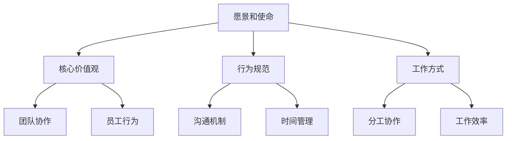

                 

### 文章标题

**团队文化塑造：打造独特团队基因**

### 关键词

- 团队文化
- 文化塑造
- 组织绩效
- 团队建设
- 成功案例

### 摘要

在快速发展的信息技术时代，团队文化已成为组织成功的关键因素。本文旨在探讨如何通过科学的方法和策略，打造独特的团队基因，提升团队绩效和创新能力。文章将分为五个部分，首先介绍团队文化的定义和重要性，接着详细讨论团队文化塑造的方法和步骤，然后介绍团队文化评估与优化的策略，分享国内外成功案例，并给出实践指南。最后，文章将总结团队文化塑造的重要性及其未来趋势，为团队领导者提供有益的启示和建议。

### 引言

在当今这个信息爆炸、技术迅猛发展的时代，团队合作已成为实现组织目标的重要途径。一个高效的团队不仅需要成员拥有优秀的技能和专业知识，还需要具备强大的团队文化。团队文化不仅影响着团队成员的工作态度和行为，更是决定团队整体绩效和创新能力的关键因素。

团队文化，简而言之，是指团队中共同遵守的价值观、信念、行为规范和工作方式。它包括团队的愿景、使命、核心价值观、行为准则以及团队共同认可的行为模式。团队文化不仅塑造了团队的独特性格，还为团队成员提供了共同的目标和方向，增强了团队的凝聚力和执行力。

团队文化的重要性体现在多个方面。首先，优秀的团队文化能够激发成员的积极性和创造力，提升团队的整体绩效。其次，团队文化有助于建立良好的内部沟通和协作机制，减少冲突和摩擦，提高团队的工作效率。此外，团队文化还影响着组织对外部环境的适应能力和竞争力。一个拥有独特团队基因的组织，往往能够在激烈的市场竞争中脱颖而出，实现持续发展。

然而，团队文化的塑造并非一蹴而就，它需要组织和管理者付出持续的努力和智慧。本文将从多个维度探讨团队文化塑造的方法和策略，帮助读者深入了解团队文化的核心概念和构建过程。同时，通过分析国内外成功案例，我们将为团队领导者提供实用的实践指南，助力他们打造出具有独特基因的高效团队。

### 团队文化的核心概念与联系

#### 团队文化的定义

团队文化是指团队中共同遵守的价值观、信念、行为规范和工作方式。它是团队精神的外在表现，也是团队内在动力的重要来源。一个良好的团队文化能够为团队成员提供明确的方向和目标，激发他们的积极性和创造力，从而提高团队的整体绩效。

团队文化通常包括以下几个方面：

1. **愿景和使命**：愿景是团队长期追求的理想状态，使命则是团队存在的根本目的和意义。明确的愿景和使命能够为团队成员提供共同的目标和方向，激发他们的工作热情和使命感。

2. **核心价值观**：核心价值观是团队共同认可的基本信念和行为准则。它包括诚信、创新、责任、尊重等要素，是团队成员行为和决策的指导原则。

3. **行为规范**：行为规范是团队成员在工作和生活中应遵守的行为准则，如团队合作、沟通协作、时间管理、职业素养等。良好的行为规范能够提高团队的工作效率，促进团队成员之间的信任和合作。

4. **工作方式**：工作方式是指团队成员在完成任务和解决问题时所采用的方法和流程。一个高效的团队通常拥有明确的工作流程、科学的分工协作和良好的工作氛围。

#### 团队文化与组织绩效的关系

团队文化与组织绩效之间的关系是相辅相成的。一方面，优秀的团队文化能够显著提升团队的绩效；另一方面，高绩效的团队往往拥有健康的团队文化。

**团队文化对组织绩效的积极影响**：

1. **提高工作效率**：良好的团队文化能够建立高效的工作流程和协作机制，减少内耗，提高团队的工作效率。

2. **增强创新能力**：团队文化中的创新精神能够激发团队成员的创造力和创新意识，推动团队不断探索新的解决方案，提升组织的竞争力。

3. **提升员工满意度**：健康的团队文化能够营造一个积极向上的工作氛围，提高员工的工作满意度和归属感，减少员工流失率。

4. **促进组织发展**：团队文化中的共同目标和价值观能够凝聚团队成员的力量，推动组织实现长期战略目标，促进组织的可持续发展。

**团队文化对组织绩效的负面影响**：

1. **降低工作效率**：不健康的团队文化可能导致内部冲突、沟通不畅和执行力下降，降低团队的工作效率。

2. **削弱创新能力**：消极的团队文化可能抑制团队成员的创造力和创新意识，导致组织在技术和管理上停滞不前。

3. **降低员工满意度**：不良的团队文化可能引发员工的不满和抵触情绪，影响员工的工作积极性，增加员工流失率。

4. **阻碍组织发展**：不健康的团队文化可能阻碍组织的创新和变革，影响组织适应外部环境变化的能力，进而影响组织的长期发展。

#### 团队文化的核心要素

团队文化的核心要素包括愿景、使命、核心价值观、行为规范和工作方式。以下是对这些核心要素的详细解释：

1. **愿景和使命**：
   - **愿景**：团队愿景是团队长期追求的理想状态，是对未来的美好展望。它为团队成员提供清晰的目标和方向，激发他们的工作热情和使命感。
   - **使命**：团队使命是团队存在的根本目的和意义，是团队存在的理由。它指导团队成员在日常工作中的行为和决策，确保团队始终朝着正确的方向前进。

2. **核心价值观**：
   - **核心价值观**：团队核心价值观是团队成员共同认可的基本信念和行为准则，是团队文化的核心。它包括诚信、创新、责任、尊重等要素，是团队成员行为和决策的指导原则。

3. **行为规范**：
   - **行为规范**：行为规范是团队成员在工作和生活中应遵守的行为准则，包括团队合作、沟通协作、时间管理、职业素养等。良好的行为规范能够提高团队的工作效率，促进团队成员之间的信任和合作。

4. **工作方式**：
   - **工作方式**：工作方式是指团队成员在完成任务和解决问题时所采用的方法和流程。一个高效的团队通常拥有明确的工作流程、科学的分工协作和良好的工作氛围。

### 团队文化的流程图展示

以下是一个简化的团队文化流程图，展示了团队文化的核心要素及其相互关系：

```
[愿景和使命]
        |
        V
[核心价值观]
        |
        V
[行为规范]
        |
        V
[工作方式]
```

通过这个流程图，我们可以清晰地看到愿景和使命作为团队的起点，核心价值观和行为规范作为团队的灵魂，以及工作方式作为团队的实践载体，共同构成了一个完整的团队文化体系。

在下一部分中，我们将深入探讨如何通过具体的方法和策略，塑造和优化团队文化，从而打造出具有独特基因的高效团队。

---

#### 核心概念原理之间的关系架构 Mermaid 流程图

为了更好地理解团队文化的核心概念及其相互关系，我们可以使用Mermaid语言绘制一个流程图。以下是一个简化的团队文化流程图示例：



**解释流程图：**

1. **愿景和使命（A）**：作为团队文化的起点，愿景和使命为团队提供明确的方向和目标。
2. **核心价值观（B）**：核心价值观是团队文化的核心，包括诚信、创新、责任和尊重等要素，指导团队成员的行为和决策。
3. **行为规范（C）**：行为规范规定了团队成员在工作和生活中应遵守的行为准则，如团队合作、沟通机制和时间管理。
4. **工作方式（D）**：工作方式是团队成员完成任务和解决问题时所采用的方法和流程，包括分工协作和工作效率。

**关系说明：**

- **愿景和使命**（A）直接影响**核心价值观**（B）、**行为规范**（C）和**工作方式**（D），为团队文化奠定了基础。
- **核心价值观**（B）与**行为规范**（C）密切相关，共同构建了团队的精神内核。
- **工作方式**（D）受到**核心价值观**（B）和**行为规范**（C）的指导，影响了团队的工作效率和协作效果。

通过这个Mermaid流程图，我们可以直观地看到团队文化各要素之间的联系和相互作用，有助于深入理解团队文化塑造的过程和策略。

---

在接下来的部分中，我们将详细探讨如何通过具体的方法和策略，塑造和优化团队文化，打造出具有独特基因的高效团队。我们将分步骤讲解每个关键环节，从构建团队愿景与使命开始，逐步深入到团队价值观的塑造、文化建设的策略以及团队文化评估与优化的具体实践。

---

### 构建团队愿景与使命

团队愿景和使命是团队文化的核心组成部分，它们为团队提供了明确的方向和目标，是激发团队成员热情和动力的源泉。一个清晰、有吸引力的愿景和使命不仅能够凝聚团队的力量，还能为团队成员指引前进的道路。

#### 愿景与使命的重要性

**愿景**：愿景是团队对未来的一种憧憬和期望，是对团队长期追求的理想状态的描述。一个明确的愿景能够帮助团队成员设定共同的目标，激发他们的工作热情和创造力。它通常包含以下要素：

1. **远大性**：愿景应当具有远大的目标，超越短期利益，为团队提供持续发展的动力。
2. **具体性**：愿景应当具体、明确，能够为团队成员提供清晰的方向和目标。
3. **感召力**：愿景应当具有感召力，能够激发团队成员的认同感和使命感。

**使命**：使命是团队存在的根本目的和意义，是团队为什么存在的答案。一个明确的使命能够帮助团队成员理解他们的工作对团队和社会的意义，增强他们的责任感和归属感。它通常包含以下要素：

1. **目的性**：使命应当明确表达团队存在的目的，为团队成员提供清晰的工作方向。
2. **可衡量性**：使命应当具有可衡量性，能够帮助团队成员了解他们的工作对团队目标的贡献。
3. **指导性**：使命应当具有指导性，为团队成员的行为和决策提供指导。

#### 制定愿景与使命的方法

1. **内部讨论与共识**：组织团队内部进行讨论，共同确定团队的愿景和使命。通过集体智慧，确保愿景和使命能够代表团队的核心价值观和共同目标。

2. **市场调研与外部反馈**：了解市场趋势和客户需求，获取外部反馈，确保团队的愿景和使命与外部环境相适应，有助于团队在市场中立足。

3. **结合组织战略**：将团队的愿景和使命与组织的整体战略相结合，确保团队的愿景和使命与组织的目标一致，为团队的发展提供强有力的支持。

4. **定期回顾与调整**：愿景和使命不是一成不变的，应当根据团队的发展和市场变化进行定期回顾和调整，确保其始终保持相关性和有效性。

#### 愿景与使命的实践案例

**案例一：谷歌（Google）**

谷歌的愿景是“组织全球信息，使人人皆可访问并从中受益”。这个愿景具有远大的目标和强烈的感召力，不仅为谷歌员工提供了明确的方向，也使谷歌成为全球技术创新的领导者。

谷歌的使命是“通过创新技术，为互联网用户带来更好的体验”。这个使命具体、明确，指导着谷歌在产品开发和用户体验方面的每一项工作。

**案例二：阿里巴巴（Alibaba）**

阿里巴巴的愿景是“让世界更加美好”。这个愿景富有远大性和感召力，表达了阿里巴巴对未来的美好期许和对社会的责任。

阿里巴巴的使命是“让天下没有难做的生意”。这个使命明确了阿里巴巴存在的目的，为小微企业和创业者提供了强大的支持。

通过这些实践案例，我们可以看到，一个清晰、有吸引力的愿景和使命对于团队的重要性。它们不仅为团队提供了明确的方向，还激发了团队成员的创造力和热情，推动了团队的持续发展。

在下一部分中，我们将探讨如何塑造团队的价值观，进一步巩固团队文化的基础，为团队的长期发展奠定坚实的基础。

---

### 塑造团队价值观

团队价值观是团队文化的核心组成部分，是团队成员共同认可的基本信念和行为准则。良好的团队价值观不仅能够增强团队的凝聚力，还能为团队成员提供明确的道德和行为指导，从而提升团队的整体绩效和创新能力。

#### 价值观的内涵与作用

**价值观的内涵**：

价值观是指团队成员在长期的工作和生活中所形成的对事物的判断标准、行为准则和价值取向。它是团队文化的灵魂，反映了团队的核心信念和追求。

1. **诚信**：诚信是团队价值观的基础，是团队成员相互信任和合作的前提。一个诚信的团队能够建立起良好的内部关系，提高工作效率。
2. **创新**：创新是团队持续发展的动力，是团队成员不断探索和突破自我的精神。一个重视创新的团队能够不断迎接挑战，保持竞争力。
3. **责任**：责任是团队成员对工作、对团队、对社会的担当。一个有责任感的团队能够确保工作的高质量完成，同时也能够在社会上树立良好的形象。
4. **尊重**：尊重是团队成员相互尊重、理解和包容的表现。一个尊重的团队能够营造一个积极向上、和谐的工作氛围，提高员工的工作满意度。

**价值观的作用**：

1. **引导行为**：团队价值观为团队成员提供了明确的道德和行为指南，帮助他们做出正确的决策和行动。
2. **凝聚团队**：共同的价值观能够将团队成员凝聚在一起，形成强大的团队合力，提高团队的凝聚力。
3. **提高绩效**：良好的团队价值观能够激发团队成员的积极性和创造力，提高工作效率和创新能力，从而提升团队的整体绩效。
4. **塑造形象**：团队价值观不仅影响内部成员的行为，还对外展示了团队的形象和品牌，有助于团队在社会上树立良好的声誉。

#### 制定与传播团队价值观

**制定团队价值观**：

1. **内部讨论**：组织团队成员进行讨论，共同确定团队的价值观。通过集思广益，确保价值观能够代表团队成员的共同信念和追求。
2. **外部调研**：了解外部环境，包括市场趋势和客户需求，确保团队的价值观与外部环境相适应。
3. **结合组织战略**：将团队的价值观与组织的整体战略相结合，确保价值观能够为团队的发展提供强有力的支持。

**传播团队价值观**：

1. **培训与教育**：通过培训和教育，让团队成员深入了解和认同团队的价值观，使其内化为个人的行为准则。
2. **日常实践**：在日常工作中，将团队价值观融入到团队管理和决策过程中，通过实际行动来传播和践行。
3. **领导示范**：领导者应当以身作则，带头践行团队价值观，树立良好的榜样，激发团队成员的认同感和行动力。

#### 价值观塑造的成功案例

**案例一：谷歌（Google）**

谷歌的价值观包括“快速而好地做事”、“不作恶”等，这些价值观不仅体现了谷歌对创新、诚信和责任的高度重视，还成为了谷歌企业文化的基石。

谷歌通过内部培训、领导示范和日常实践，将价值观融入到了员工的工作和生活中，形成了一个高度凝聚、富有创新精神的团队。

**案例二：亚马逊（Amazon）**

亚马逊的价值观包括“客户至上”、“简单性”等，这些价值观不仅体现了亚马逊对客户体验和效率的重视，还塑造了一个高效、创新的团队文化。

亚马逊通过不断的员工培训和内部沟通，将价值观深植于员工心中，通过实际行动来践行这些价值观，从而提升团队的整体绩效。

通过以上案例，我们可以看到，良好的团队价值观对于团队的重要性。它们不仅为团队提供了明确的道德和行为指南，还增强了团队的凝聚力和创新能力，推动了团队的持续发展。在下一部分中，我们将探讨团队文化建设策略，帮助团队领导者打造具有独特基因的高效团队。

---

#### 团队文化建设策略

团队文化建设是一个持续的过程，需要组织和管理者付出长期的努力和智慧。以下是一些有效的团队文化建设策略，帮助团队领导者打造具有独特基因的高效团队。

##### 文化建设的目标与原则

**目标**：

1. **增强团队凝聚力**：通过共同的目标和价值观，将团队成员凝聚在一起，形成强大的团队合力。
2. **提升工作效率**：建立高效的工作流程和协作机制，提高团队的工作效率。
3. **激发创新能力**：营造创新氛围，激发团队成员的创造力和创新意识。
4. **提升员工满意度**：营造积极向上、和谐的工作氛围，提高员工的工作满意度和归属感。

**原则**：

1. **一致性**：文化建设的目标和原则应当与组织的整体战略一致，确保团队文化能够为组织的发展提供强有力的支持。
2. **参与性**：文化建设应当充分调动团队成员的积极性，让他们参与到文化建设的过程中，增强他们的认同感和归属感。
3. **持续性**：文化建设是一个长期的过程，需要持续不断地推进，确保团队文化能够不断适应外部环境的变化。
4. **实践性**：文化建设的目标和原则应当能够通过实际行动得到落实，避免空洞的理论和口号。

##### 文化建设的方法与工具

**文化建设方法**：

1. **愿景和使命的制定**：明确团队的愿景和使命，为团队提供清晰的方向和目标，激发团队成员的工作热情和使命感。
2. **核心价值观的塑造**：制定团队的价值观，通过培训和日常实践，让团队成员深入理解和认同，将其内化为个人的行为准则。
3. **行为规范的建立**：制定团队的行为规范，明确团队成员在工作和生活中的行为准则，提高团队的工作效率和协作效果。
4. **工作方式的优化**：优化团队的工作方式，建立科学的工作流程和协作机制，提高团队的工作效率。

**文化建设工具**：

1. **培训**：通过内部培训和外部培训，提高团队成员对团队文化和价值观的理解和认同。
2. **领导示范**：领导者应当以身作则，带头践行团队文化和价值观，树立良好的榜样，激发团队成员的认同感和行动力。
3. **内部沟通**：建立有效的内部沟通机制，促进团队成员之间的沟通和协作，增强团队的凝聚力。
4. **激励机制**：通过奖励和激励机制，鼓励团队成员践行团队文化和价值观，提高他们的工作积极性和创新能力。

##### 文化建设中的挑战与应对

**挑战**：

1. **文化差异**：团队成员来自不同的背景和文化，可能存在价值观和行为方式的差异，影响团队文化的建设。
2. **执行力不足**：团队成员可能对团队文化和价值观的认同感不高，导致文化建设难以落实。
3. **外部压力**：外部环境的变化和市场竞争的压力，可能影响团队文化的稳定性和持续性。

**应对策略**：

1. **文化融合**：通过有效的沟通和协作，促进团队成员之间的文化融合，形成共同的价值观和行为准则。
2. **强化执行力**：通过严格的制度和监督机制，确保团队文化和价值观的执行落实，提高团队成员的认同感。
3. **适应性调整**：根据外部环境的变化，及时调整团队文化和价值观，确保其持续性和有效性。

通过以上策略，团队领导者可以有效地推进团队文化建设，打造出具有独特基因的高效团队，为组织的长期发展奠定坚实的基础。

---

#### 团队文化评估方法

为了确保团队文化能够持续、有效地推动团队发展，对其进行定期评估和优化至关重要。团队文化评估方法主要包括评估指标的选择、评估工具的使用以及文化诊断与分析。

##### 评估指标的选择

选择合适的评估指标是团队文化评估的关键步骤。以下是一些常用的评估指标：

1. **员工满意度**：员工满意度是衡量团队文化的重要指标，可以通过员工满意度调查来获取。
2. **团队合作与协作**：团队合作与协作能力是团队文化的重要组成部分，可以通过团队成员间的沟通频率、协作效率等指标来评估。
3. **员工忠诚度**：员工忠诚度反映了团队成员对团队的认同感和归属感，可以通过员工离职率、员工在团队中的工作年限等指标来衡量。
4. **创新氛围**：创新氛围是团队文化的重要表现，可以通过团队成员的创新提案数量、创新项目的成功率等指标来评估。
5. **工作效率**：工作效率是团队文化直接影响的结果，可以通过任务完成速度、项目进度等指标来衡量。
6. **领导风格**：领导风格对团队文化的影响显著，可以通过领导与员工的互动频率、领导行为评价等指标来评估。

##### 评估工具的使用

选择合适的评估工具可以更有效地进行团队文化评估。以下是一些常用的评估工具：

1. **问卷调查**：通过设计针对员工满意度的问卷，可以收集大量关于团队文化的数据。
2. **面谈**：与团队成员进行一对一的面谈，可以深入了解团队成员对团队文化的感受和看法。
3. **工作分析**：通过对团队成员的工作任务、工作流程进行分析，评估团队协作和效率。
4. **文化诊断工具**：如文化诊断量表（Cultural Diagnosis Survey）等，可以系统性地评估团队文化的各个方面。

##### 文化诊断与分析

文化诊断与分析是评估团队文化的关键环节，通过以下步骤进行：

1. **数据收集**：使用问卷调查、面谈、工作分析等工具，收集关于团队文化的数据。
2. **数据整理**：对收集到的数据进行分析和整理，识别团队文化中的优点和不足。
3. **文化评估**：根据评估指标，对团队文化进行量化评估，确定文化现状。
4. **问题识别**：通过数据分析和评估，识别团队文化中存在的问题和挑战。
5. **反馈与改进**：将评估结果反馈给团队成员，讨论改进方案，制定文化优化计划。

通过文化诊断与分析，团队领导者可以清晰地了解团队文化的现状，识别存在的问题，并制定针对性的改进措施，从而不断提升团队文化的质量和效能。

---

#### 团队文化优化策略

团队文化优化是确保团队持续发展的重要环节。一个健康、积极的团队文化不仅能够提高团队的整体绩效，还能增强团队成员的满意度和归属感。以下是一些具体的团队文化优化策略：

##### 优化团队文化的路径

1. **强化核心价值观**：通过不断强化核心价值观，使团队成员深刻理解并认同团队的价值观，将其内化为个人的行为准则。

2. **提升领导力**：领导者应当在团队文化优化中起到带头作用，通过榜样作用和有效沟通，推动团队文化的变革和提升。

3. **加强团队建设活动**：定期组织团队建设活动，如团建培训、团队拓展等，增强团队成员之间的信任和合作，促进团队文化的建设。

4. **优化工作流程**：通过优化工作流程和协作机制，提高团队的工作效率和协作效果，营造一个高效、有序的工作氛围。

5. **激励创新**：鼓励团队成员提出创新想法，建立创新激励机制，推动团队文化的创新氛围。

##### 文化变革的推进

1. **明确变革目标**：在推进文化变革前，明确变革的目标和方向，确保团队成员对变革有清晰的认识。

2. **有效沟通**：通过有效的沟通，使团队成员了解文化变革的重要性和必要性，消除他们对变革的抵触情绪。

3. **制定实施计划**：制定详细的实施计划，明确变革的步骤、责任人和时间节点，确保文化变革有序进行。

4. **培训与指导**：提供必要的培训和指导，帮助团队成员适应新的团队文化，提高他们的文化认同感和行动力。

##### 优化过程中的常见问题与解决策略

**问题一：文化变革的阻力**

**解决策略**：
- **积极沟通**：通过有效的沟通，了解团队成员对文化变革的担忧和疑虑，提供合理的解释和解决方案。
- **利益驱动**：通过明确文化变革带来的实际利益，激发团队成员的参与积极性。

**问题二：变革推进缓慢**

**解决策略**：
- **强化执行力**：建立严格的制度，确保文化变革的推进不受阻碍。
- **定期评估**：定期评估文化变革的进度，及时发现问题并调整策略。

**问题三：团队成员的抵触情绪**

**解决策略**：
- **关注员工需求**：关注团队成员的需求和感受，提供必要的支持和帮助。
- **领导者示范**：领导者应当以身作则，带头践行新的团队文化，树立良好的榜样。

通过以上策略，团队领导者可以有效地推进团队文化的优化，打造出更加健康、积极、高效的团队文化，为组织的长期发展奠定坚实的基础。

---

#### 成功案例分享与启示

在团队文化塑造的实践中，国内外许多企业通过成功的文化建设和优化，实现了卓越的业绩和持续发展。以下是几个具有代表性的成功案例，以及从中得出的启示和借鉴。

##### 案例一：谷歌（Google）

**背景**：谷歌是全球知名的互联网科技公司，以其创新的企业文化和强大的团队凝聚力著称。

**成功因素**：
- **明确的愿景和使命**：谷歌的愿景是“组织全球信息，使人人皆可访问并从中受益”，使命是“通过创新技术，为互联网用户带来更好的体验”。这些明确的愿景和使命为谷歌提供了清晰的发展方向。
- **创新的企业文化**：谷歌倡导创新、开放、包容的文化，鼓励员工自由探索和尝试，提供宽松的工作环境。
- **员工激励与成长**：谷歌通过内部培训、员工持股计划等多种方式，激励员工持续成长和进步。

**启示与借鉴**：
- **建立明确的愿景和使命**：明确的发展方向和目标是团队文化塑造的基础。
- **营造创新文化**：鼓励创新思维和自由探索，为团队提供良好的创新环境。
- **关注员工成长**：通过培训和激励机制，帮助员工不断提升自己的能力和素质。

##### 案例二：华为（Huawei）

**背景**：华为是全球领先的通信技术解决方案提供商，以其强大的研发能力和高效的团队合作著称。

**成功因素**：
- **核心价值观的塑造**：华为的核心价值观包括“客户至上”、“诚信”、“敬业”等，这些价值观深深植根于每个员工的心中。
- **团队合作与协同**：华为强调团队合作，通过协同作战，提高整体工作效率。
- **持续学习与创新**：华为鼓励员工持续学习和创新，以适应快速变化的市场环境。

**启示与借鉴**：
- **塑造强大的核心价值观**：明确的核心价值观是团队文化的灵魂，有助于凝聚团队成员的力量。
- **强化团队合作**：通过有效的协作机制，提高团队的整体工作效率。
- **推动持续学习与创新**：鼓励员工不断学习和创新，保持团队的活力和竞争力。

##### 案例三：阿里巴巴（Alibaba）

**背景**：阿里巴巴是中国领先的电子商务公司，以其独特的企业文化和对员工的关心著称。

**成功因素**：
- **价值观的传递与传承**：阿里巴巴的创始人马云通过个人魅力和实际行动，将“客户第一”、“团队合作”等价值观传递给每一位员工。
- **员工关怀**：阿里巴巴关注员工的身心健康，提供丰富的员工福利和培训机会。
- **企业文化活动**：阿里巴巴定期举办各类企业文化活动，如年会、团队拓展等，增强员工的团队归属感。

**启示与借鉴**：
- **领导者的示范作用**：领导者的行为和言传身教对团队文化的塑造至关重要。
- **关注员工需求**：通过提供良好的福利和培训，提高员工的工作满意度和归属感。
- **定期举办企业文化活动**：通过丰富的企业文化活动，增强团队的凝聚力和归属感。

通过以上成功案例，我们可以看到，优秀的团队文化不仅能够提升团队的整体绩效，还能激发团队成员的创造力和创新能力，为组织的长期发展提供强大动力。团队领导者应当从这些成功案例中汲取经验和启示，结合自身团队的实际情况，制定和实施有效的团队文化塑造策略，打造出具有独特基因的高效团队。

---

#### 团队文化建设步骤与实践

打造独特的团队文化并非一蹴而就，需要系统性的规划和持续的努力。以下是从文化建设前准备到具体实施步骤，再到文化建设后的评估与调整的详细过程。

##### 文化建设前的准备

1. **内部调研**：在文化建设前，对团队成员进行问卷调查、访谈等形式，了解现有团队文化的现状和存在的问题。同时，收集员工的意见和建议，为后续文化建设提供基础数据。

2. **外部调研**：分析行业趋势、竞争对手的企业文化，借鉴优秀企业的成功经验，为团队文化建设提供外部视角。

3. **高层领导支持**：文化建设需要高层领导的支持和参与，确保文化建设的战略方向和资源投入。

4. **制定文化建设的总体目标**：明确文化建设的目标和预期成果，确保文化建设的方向和力度。

##### 文化建设步骤

1. **制定愿景和使命**：组织团队成员共同讨论和制定团队的愿景和使命，确保其具有远大性和具体性，能够激发团队成员的认同感和使命感。

2. **确定核心价值观**：通过集体讨论和共识，明确团队的核心价值观，如诚信、创新、责任、尊重等，确保其能够为团队成员提供明确的道德和行为指导。

3. **制定行为规范**：基于核心价值观，制定具体的行为规范，如团队合作、沟通协作、时间管理等，确保团队成员在工作和生活中有明确的行动准则。

4. **工作流程与协作机制优化**：根据团队实际情况，优化工作流程和协作机制，确保团队的工作效率和协作效果。

5. **文化建设活动**：组织一系列的文化建设活动，如团建培训、团队拓展、文化宣传等，增强团队成员对团队文化的认同感和参与感。

6. **领导示范**：领导者以身作则，带头践行团队文化和价值观，树立良好的榜样，为团队成员提供示范。

##### 文化建设后的评估与调整

1. **定期评估**：通过问卷调查、面谈、工作分析等工具，定期对团队文化进行评估，了解团队成员对团队文化的认同度和实际效果。

2. **文化诊断与分析**：通过文化诊断工具，深入分析团队文化的优点和不足，识别存在的问题和挑战。

3. **反馈与改进**：将评估结果和诊断分析反馈给团队成员，讨论改进方案，制定文化优化计划。

4. **持续优化**：根据评估和反馈，持续调整团队文化，确保其与团队的发展需求相适应。

通过以上步骤，团队领导者可以系统地推进团队文化建设的全过程，确保文化建设的有效性，为团队的长远发展奠定坚实的基础。

---

#### 团队文化塑造工具与应用

在团队文化塑造的过程中，选择合适的工具和方法对于提升文化建设的效果至关重要。以下将介绍几种常用的团队文化塑造工具，并探讨其具体应用。

##### 常用工具介绍

1. **问卷调查**：问卷调查是一种收集团队成员对团队文化看法的有效工具。通过设计结构化的问卷，可以全面了解团队成员对团队价值观、行为规范、工作氛围等方面的认知和态度。常用的问卷工具包括SurveyMonkey、Google Forms等。

2. **面谈**：面谈是一种深入了解团队成员对团队文化感受和意见的方法。通过与团队成员进行一对一或小组访谈，可以获得更为细致和深入的信息，有助于发现问卷难以捕捉的细节。

3. **文化诊断工具**：如Cultural Diagnostic Survey（CDS）等，这类工具通过一系列评估指标，对团队文化的各个方面进行系统诊断，帮助团队识别文化优势和问题。

4. **团队建设培训**：通过专业的团队建设培训，可以帮助团队成员理解团队文化的重要性，掌握如何在实际工作中践行文化价值观。常见的培训方式包括研讨会、工作坊、案例分享等。

5. **领导力发展计划**：领导者是团队文化的传播者和践行者，通过领导力发展计划，可以提升领导者的文化意识和领导能力，从而更好地推动团队文化建设。

##### 工具的使用方法

1. **问卷调查**：
   - **设计问卷**：根据团队文化建设的具体目标和需求，设计结构化的问卷。问卷应包括开放性和封闭性题目，涵盖价值观、行为规范、工作氛围等方面。
   - **发布问卷**：通过电子邮件、微信、钉钉等平台，将问卷发布给团队成员，并设置截止日期。
   - **数据收集与分析**：收集问卷数据，使用统计分析软件（如SPSS、Excel）进行数据整理和分析，得出团队文化的现状和问题。

2. **面谈**：
   - **准备访谈提纲**：根据调查目标和需求，准备详细的访谈提纲，确保访谈过程的系统性和有效性。
   - **进行访谈**：与团队成员进行一对一或小组访谈，记录访谈内容和关键信息。
   - **总结分析**：整理访谈记录，提炼关键信息，为后续的文化建设提供依据。

3. **文化诊断工具**：
   - **应用诊断工具**：根据团队实际情况，选择合适的诊断工具，如CDS，进行文化诊断。
   - **评估文化现状**：使用诊断工具对团队文化进行评估，得出文化现状和问题。
   - **制定改进计划**：根据诊断结果，制定针对性的文化改进计划，确保文化优化措施的落实。

4. **团队建设培训**：
   - **设计培训内容**：根据团队文化建设的具体需求，设计培训内容，包括文化理念、行为规范、领导力发展等。
   - **组织培训活动**：通过研讨会、工作坊等形式，组织团队成员参与培训活动。
   - **跟踪培训效果**：通过培训后的问卷调查、访谈等方式，跟踪培训效果，评估文化建设的成效。

5. **领导力发展计划**：
   - **制定发展计划**：根据领导者的文化意识和领导能力需求，制定个性化的领导力发展计划。
   - **实施发展计划**：通过内部培训、外部交流、导师辅导等形式，实施领导力发展计划。
   - **评估发展效果**：通过领导力评估工具，评估领导力发展计划的效果，确保领导力的提升。

##### 工具在实际应用中的效果评估

1. **问卷调查**：
   - **评估方法**：通过对比问卷调查前后的数据变化，评估问卷的效果。
   - **评估指标**：包括员工满意度、文化认同度、工作积极性等。
   - **改进方向**：根据评估结果，调整问卷设计和文化建设策略。

2. **面谈**：
   - **评估方法**：通过访谈反馈和观察团队成员的行为变化，评估面谈的效果。
   - **评估指标**：包括团队成员的文化认知、行为改进、团队氛围等。
   - **改进方向**：根据评估结果，优化访谈过程和内容，提高面谈效果。

3. **文化诊断工具**：
   - **评估方法**：通过文化诊断工具的评估结果，评估团队文化的现状和问题。
   - **评估指标**：包括文化成熟度、文化适应度等。
   - **改进方向**：根据评估结果，制定针对性的文化优化措施。

4. **团队建设培训**：
   - **评估方法**：通过培训后的问卷调查、访谈等方式，评估培训效果。
   - **评估指标**：包括培训满意度、知识掌握度、行为改进等。
   - **改进方向**：根据评估结果，优化培训内容和方式，提高培训效果。

5. **领导力发展计划**：
   - **评估方法**：通过领导力评估工具，评估领导力发展计划的效果。
   - **评估指标**：包括领导者文化意识、领导能力提升等。
   - **改进方向**：根据评估结果，调整领导力发展计划，确保领导力的持续提升。

通过以上工具的有效应用和效果评估，团队领导者可以更好地推动团队文化塑造，打造出具有独特基因的高效团队，为组织的长期发展提供坚实保障。

---

#### 实践指南与最佳实践

在团队文化塑造的过程中，结合实际操作中的经验教训，制定有效的实践指南和最佳实践，对于确保文化建设的效果和可持续性具有重要意义。以下是一些建议和注意事项，帮助团队领导者成功打造独特的团队文化。

##### 团队文化建设实践指南

1. **制定明确的目标和计划**：在开始文化建设前，明确团队的文化目标和具体实施计划，确保文化建设有方向和可执行性。

2. **注重领导层的示范作用**：领导者应当以身作则，带头践行团队价值观和行为规范，树立良好的榜样，提升团队成员的文化认同感和行动力。

3. **营造积极的沟通氛围**：建立开放、坦诚的沟通机制，鼓励团队成员表达意见和建议，促进团队内部的沟通和协作。

4. **持续开展团队建设活动**：定期组织团队建设活动，如团队培训、拓展训练、文化沙龙等，增强团队成员之间的凝聚力和归属感。

5. **注重员工的参与和反馈**：在文化建设过程中，充分调动员工的积极性和参与度，收集他们的反馈和建议，确保文化建设的实际效果。

6. **建立完善的评估与反馈机制**：定期对团队文化进行评估和反馈，识别文化建设的优点和不足，及时调整和优化文化建设策略。

##### 最佳实践

1. **文化理念的宣传与普及**：通过内部宣传、培训、文化活动等多种方式，广泛传播团队的文化理念和价值观念，确保团队成员对文化有深入的理解和认同。

2. **个性化文化塑造**：根据团队的特点和需求，制定个性化的文化塑造方案，避免一刀切的文化建设方式，确保文化建设的针对性和有效性。

3. **文化融合与多样性**：鼓励团队成员在尊重差异的基础上，共同融入团队文化，促进团队内部的多样性和包容性，提高团队的创新能力。

4. **持续创新与改进**：团队文化不是一成不变的，应当根据外部环境和内部变化，持续进行创新和改进，确保文化建设的持续性和适应性。

##### 注意事项

1. **避免形式主义**：文化建设不能仅仅停留在形式上，应当通过实际行动和具体措施，确保文化理念的落实和效果。

2. **重视员工感受**：在文化建设过程中，要关注员工的心理需求和职业发展，避免单纯追求短期绩效，而忽视员工的长期成长。

3. **避免文化冲突**：在团队多元化的背景下，要重视文化冲突的预防和解决，通过沟通和协作，促进团队成员之间的相互理解和尊重。

4. **持续关注与支持**：文化建设是一个长期的过程，需要组织和管理者持续关注和支持，确保文化建设的可持续性和稳定性。

通过遵循这些实践指南和最佳实践，团队领导者可以更有效地推动团队文化的建设，打造出具有独特基因的高效团队，为组织的长期发展提供坚实的保障。

---

### 结论

在本文中，我们深入探讨了团队文化塑造的重要性及其具体方法与策略。首先，我们明确了团队文化的定义和核心要素，分析了团队文化与组织绩效之间的关系。接着，我们详细介绍了构建团队愿景与使命、塑造团队价值观、文化建设策略、文化评估与优化以及成功案例的分享。通过这些内容，我们旨在为团队领导者提供一套系统的实践指南，帮助他们成功打造独特的团队文化。

#### 团队文化塑造的重要性与未来趋势

团队文化不仅影响着团队成员的工作态度和行为，更是决定团队整体绩效和创新能力的关键因素。一个健康、积极的团队文化能够激发团队成员的创造力和主动性，提升团队的工作效率和创新能力，进而推动组织的可持续发展。在未来，随着全球化、信息化和市场竞争的加剧，团队文化的建设将愈发重要。团队领导者需要不断创新和完善团队文化，以适应快速变化的外部环境，提升团队的竞争力和适应能力。

#### 对团队领导者的启示与建议

1. **明确愿景与使命**：团队领导者应当首先明确团队的愿景和使命，为团队提供清晰的方向和目标。
2. **塑造核心价值观**：通过明确和传播团队的核心价值观，确保团队成员的行为和决策有共同的准则。
3. **以身作则**：领导者应当以身作则，带头践行团队文化和价值观，树立良好的榜样。
4. **注重员工参与**：在文化建设过程中，要充分调动员工的积极性和参与度，确保文化建设的实际效果。
5. **持续评估与优化**：定期对团队文化进行评估和反馈，及时调整和优化文化建设策略，确保文化的持续性和适应性。

总之，团队文化塑造是一项长期而复杂的任务，需要团队领导者的持续关注和努力。通过科学的方法和策略，团队领导者可以打造出具有独特基因的高效团队，为组织的长远发展奠定坚实基础。

---

### 作者信息

**作者：AI天才研究院/AI Genius Institute & 禅与计算机程序设计艺术 /Zen And The Art of Computer Programming**

AI天才研究院致力于推动人工智能领域的创新和发展，通过深入研究和实践，为全球范围内的企业和组织提供先进的人工智能解决方案。同时，研究院的专家团队在计算机编程和人工智能领域有着丰富的经验和深厚的理论功底，出版了一系列影响深远的畅销书，如《禅与计算机程序设计艺术》等。这些作品不仅为读者提供了深刻的计算机科学和人工智能知识，还分享了团队文化塑造和实践的宝贵经验。

通过本文，AI天才研究院希望为读者提供关于团队文化塑造的深入见解和实践指南，帮助团队领导者打造出高效、创新、具有独特基因的团队，实现组织的持续发展和成功。

