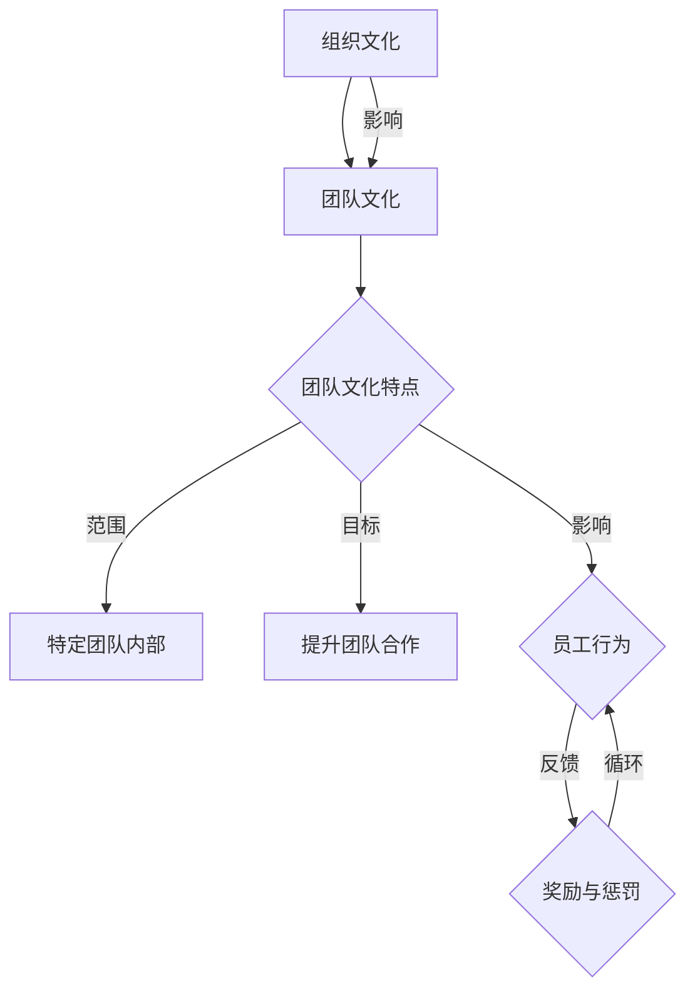
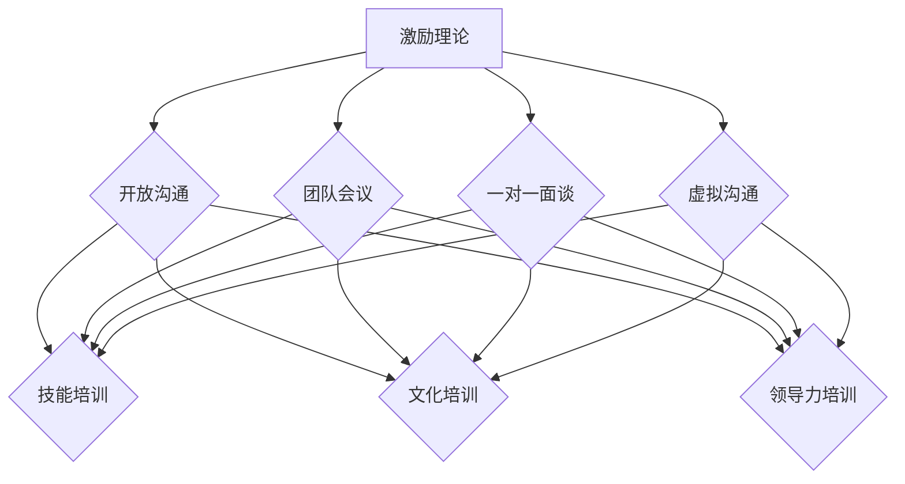

                 

### 文章标题

# 团队文化工程：有意识地塑造团队特色

### 关键词

- 团队文化
- 塑造团队特色
- 团队文化建设
- 组织文化
- 团队绩效

### 摘要

本文旨在探讨团队文化的概念、重要性及其塑造方法。我们将从背景介绍开始，逐步深入分析团队文化的核心概念与联系，包括团队文化与组织文化的区别、团队文化与领导力的关系、团队文化与员工行为的互动。接着，我们将详细讲解团队文化塑造的核心算法原理，并运用伪代码和数学模型进行阐述。随后，文章将结合实际项目案例，展示团队文化在实际工作中的应用与评估方法。最后，我们将总结最佳实践，提出注意事项，并推荐拓展阅读，以期为读者提供全面的团队文化塑造指南。

## 设计原则

在撰写本文时，我们将遵循以下设计原则，以确保文章的逻辑清晰、结构紧凑且易于理解：

1. **逐步推理与结构化分析**：我们将通过逐步推理的方式，从基本概念入手，逐步深入探讨团队文化的各个方面。这种结构化分析有助于读者更好地理解团队文化的复杂性。
2. **专业术语与清晰定义**：为确保文章的专业性，我们将使用准确的技术术语，并对相关概念进行清晰定义，以避免混淆。
3. **理论与实践相结合**：本文不仅探讨团队文化的理论框架，还将结合实际项目案例，展示团队文化在实际工作中的应用，增强文章的实用性和可操作性。
4. **具体案例与数据分析**：为了更好地说明团队文化塑造的方法，我们将提供具体案例，并进行详细的数据分析，以展示团队文化的实际效果。
5. **简洁明了的写作风格**：在保证内容完整性的同时，我们将尽量使用简洁明了的语言，避免冗长和复杂的句子结构，以提高文章的可读性。

### 引言

#### 团队文化的定义

团队文化是指在特定组织内，由成员共同遵循的一系列价值观、信念、行为准则和工作方式。它不仅包括显性的元素，如公司的使命、愿景和目标，还涵盖了隐性的元素，如团队成员之间的互动模式、沟通风格和共同信仰。

团队文化与组织文化有所不同。组织文化是指整个组织所共有的价值观、信念和行为准则，它影响组织的各个方面，包括领导层、员工关系、决策过程等。而团队文化则更专注于特定团队内部的行为规范和团队精神，它直接影响团队的工作效率和成员满意度。

#### 团队文化的重要性

团队文化的重要性体现在以下几个方面：

1. **提高工作效率**：一个具有良好团队文化的团队，成员之间能够高效协作，共同完成任务。团队成员对团队的价值观和目标有清晰的认识，能够减少内部摩擦，提高工作效率。

2. **提升员工满意度**：良好的团队文化能够满足员工的心理需求，使他们感到归属感和认同感。这种心理满足能够提高员工的满意度和忠诚度，减少员工流失率。

3. **促进创新与学习**：团队文化鼓励创新和学习，使团队成员敢于尝试新方法，勇于面对挑战。这种文化氛围有助于激发团队成员的创造力和学习动力，推动团队不断发展。

4. **提升组织绩效**：团队文化的建设有助于提升整个组织的绩效。一个具有良好团队文化的团队，能够更好地实现组织的目标，为组织的长远发展奠定坚实基础。

#### 本书的目的和读者对象

本书旨在为读者提供一套系统的团队文化塑造方法，帮助读者理解和运用团队文化，提升团队的工作效率和员工满意度。本书适合以下读者群体：

1. **企业高管**：通过本书，企业高管可以了解团队文化的重要性，学会如何有意识地塑造和提升团队文化。

2. **人力资源经理**：人力资源经理可以通过本书学习团队文化塑造的策略，优化企业的人力资源管理。

3. **团队领导者**：团队领导者可以通过本书掌握团队文化塑造的核心方法，提升团队绩效和员工满意度。

4. **团队成员**：团队成员可以通过本书了解团队文化的内涵，积极参与团队文化的建设，提升个人和团队的表现。

## 团队文化的核心概念与联系

在深入探讨团队文化之前，我们需要明确几个核心概念，并分析它们之间的联系。这些核心概念包括团队文化与组织文化的区别、团队文化与领导力的关系、以及团队文化与员工行为之间的互动。

### 团队文化与组织文化的区别

团队文化是组织文化的一个组成部分，但两者之间存在明显的区别。组织文化是一个更广泛的框架，它涵盖了整个组织的价值观、信念和行为准则。组织文化包括企业的使命、愿景、核心价值观以及企业整体的运作方式。团队文化则更专注于特定团队内部的行为规范和团队精神。

- **定义与范围**：组织文化是一个全局性的概念，它影响整个组织的运作方式。而团队文化则是针对特定团队的，更多关注团队内部成员的互动和共同价值观。

- **目标与功能**：组织文化的目标是确保整个组织的协调一致，推动企业战略的实现。团队文化的目标则是提升团队内部的合作效率，增强团队凝聚力。

- **影响范围**：组织文化的影响范围更广，它涉及到企业的各个方面，包括员工关系、决策过程、沟通方式等。团队文化则更专注于团队内部的工作氛围和成员互动。

### 团队文化与领导力的关系

领导力在团队文化塑造中起着关键作用。有效的领导能够引导团队形成积极的文化，激励团队成员为实现团队目标而努力。以下为团队文化与领导力之间的几种关系：

- **领导行为的示范作用**：领导者的行为是团队成员模仿的对象。一个具有高度责任感、诚信和透明度的领导者，能够为团队树立榜样，推动团队文化的发展。

- **领导决策的影响**：领导者的决策会影响团队文化的形成和发展。例如，领导者对团队成员的评价标准、奖励机制等，都会对团队文化产生深远影响。

- **领导沟通的效果**：领导者的沟通方式也是塑造团队文化的重要因素。有效的沟通能够增强团队成员之间的信任和理解，推动团队文化的形成。

### 团队文化与员工行为的互动

团队文化不仅影响员工的行为，同时也受到员工行为的影响。以下为团队文化与员工行为之间的几种互动关系：

- **员工行为对团队文化的影响**：员工的行为和态度是团队文化的重要组成部分。积极向上的员工行为，如团队合作、主动沟通、勇于承担责任等，能够促进团队文化的建设。反之，消极的员工行为，如互相指责、不合作等，则会破坏团队文化。

- **团队文化对员工行为的影响**：团队文化会影响员工的行为模式。在一个具有良好团队文化的团队中，员工更倾向于表现出积极的行为，如主动沟通、乐于助人、勇于承担等。而在一个文化氛围不良的团队中，员工可能更倾向于表现出消极的行为。

- **员工行为的反馈机制**：团队文化会通过奖励和惩罚机制对员工行为进行反馈。积极的行为会得到奖励，从而激励员工继续表现出积极行为；消极的行为则会受到惩罚，从而促使员工改正不良行为。

### 图解核心概念与联系

为了更直观地理解团队文化的核心概念与联系，我们可以使用Mermaid流程图来展示它们之间的关系。以下是一个简化的Mermaid流程图：



在这个流程图中，组织文化作为整个企业的价值观和行为准则，影响了团队文化的形成。团队文化则通过特定团队内部的特点、目标和影响，进一步影响员工的行为。同时，员工行为通过反馈机制，又对团队文化产生影响，形成一个动态的循环系统。

通过这种图解方式，我们能够更清晰地理解团队文化的核心概念与联系，为后续的深入讨论打下基础。

## 团队文化的塑造方法

团队文化的塑造是一个系统性工程，涉及到多个方面。以下是一些关键的团队文化塑造方法，包括激励理论、沟通机制和培训计划等。

### 激励理论

激励理论在团队文化塑造中起着至关重要的作用。激励理论的基本目标是激发团队成员的积极性、主动性和创造力，从而提升团队的整体绩效。以下是几种常见的激励理论及其在团队文化塑造中的应用：

1. **马斯洛需求层次理论**：马斯洛需求层次理论认为，人的需求分为五个层次：生理需求、安全需求、社交需求、尊重需求和自我实现需求。在团队文化塑造中，领导者需要了解每个团队成员的需求层次，并针对性地提供激励措施。例如，为满足员工的自我实现需求，可以提供职业发展机会、挑战性的工作任务等。

2. **赫茨伯格双因素理论**：赫茨伯格双因素理论将激励因素分为内在激励和外在激励。内在激励包括工作本身的兴趣、成就感、责任感等；外在激励包括薪酬、福利、晋升机会等。在团队文化塑造中，领导者需要平衡内在激励和外在激励，使团队成员在工作和生活各个方面都能获得满足感。

3. **目标设定理论**：目标设定理论认为，明确的目标能够激发团队成员的工作动力。在团队文化塑造中，领导者需要帮助团队成员设定具体的、可衡量的目标，并提供必要的支持和资源，以帮助成员实现目标。

### 沟通机制

沟通是团队文化塑造的重要工具。有效的沟通机制能够增强团队成员之间的理解与信任，促进团队协作。以下是一些关键沟通机制：

1. **开放沟通**：开放沟通鼓励团队成员自由地表达意见和想法，而不必担心批评或惩罚。这种沟通环境有助于团队成员建立信任，分享知识，共同解决问题。

2. **团队会议**：定期的团队会议是团队沟通的重要方式。在会议中，团队成员可以讨论项目进展、分享经验、提出建议，并共同制定行动计划。

3. **一对一面谈**：一对一面谈是领导者与团队成员之间进行沟通的有效方式。通过这种沟通，领导者可以了解团队成员的需求和困惑，并提供个性化的支持和建议。

4. **虚拟沟通**：在远程工作或分布式团队中，虚拟沟通工具（如视频会议、即时通讯、协作平台等）变得尤为重要。这些工具能够帮助团队成员克服物理距离的障碍，保持有效的沟通。

### 培训计划

培训是团队文化塑造的另一个关键因素。通过培训，团队成员可以学习新技能、新知识，提升个人能力，从而为团队文化的建设奠定基础。以下是一些培训计划的关键点：

1. **技能培训**：技能培训包括技术技能和软技能。技术技能培训旨在提升团队成员的专业能力，如编程技能、项目管理技能等。软技能培训则侧重于提升团队成员的沟通能力、团队协作能力等。

2. **文化培训**：文化培训旨在帮助团队成员理解并接受团队的价值观和目标。通过文化培训，团队成员可以更好地融入团队，增强团队凝聚力。

3. **领导力培训**：领导力培训旨在提升团队领导者的领导能力，使他们能够更有效地管理和激励团队成员。领导力培训包括沟通技巧、团队建设、决策制定等方面的内容。

4. **持续培训**：团队文化是一个动态的过程，需要不断更新和改进。持续培训可以帮助团队成员保持学习的动力，不断提升个人能力，以适应团队文化的发展和变化。

### 伪代码与流程图

为了更好地理解团队文化塑造的方法，我们可以使用伪代码来描述激励理论、沟通机制和培训计划的实现过程。以下是一个简化的伪代码示例：

```plaintext
# 激励理论实现过程
function 激励理论(成员需求，目标设定)
    如果 成员需求属于自我实现需求
        提供职业发展机会和挑战性工作任务
    否则 如果 成员需求属于社交需求
        组织团队活动和团队建设活动
    否则 如果 成员需求属于安全需求
        提供稳定的工作环境和安全保障
    否则 如果 成员需求属于生理需求
        提供合理的薪酬和福利待遇
    结束 如果
    设定具体可衡量的目标
    提供必要支持和资源
结束函数

# 沟通机制实现过程
function 沟通机制(团队成员，沟通内容)
    如果 沟通环境为开放沟通
        允许团队成员自由表达意见
    否则 如果 沟通方式为团队会议
        定期召开团队会议
    否则 如果 沟通方式为一对一面谈
        安排一对一面谈
    否则 如果 沟通方式为虚拟沟通
        使用虚拟沟通工具保持沟通
结束函数

# 培训计划实现过程
function 培训计划(团队成员，培训内容)
    根据团队成员需求提供技能培训
    根据团队价值观提供文化培训
    根据领导者需求提供领导力培训
    持续更新培训内容和方法
结束函数
```

此外，我们还可以使用Mermaid流程图来展示这些方法之间的关系：



通过这种伪代码和流程图的方式，我们可以更直观地理解团队文化塑造的方法，并明确各个方法之间的联系和作用。

## 团队文化的评估与改进

评估与改进团队文化是团队文化管理的关键环节。通过科学的评估方法，可以了解团队文化的现状，发现存在的问题，并制定针对性的改进策略。以下是几种常用的团队文化评估工具和方法，以及改进团队文化的策略。

### 评估团队文化的工具与方法

1. **员工满意度调查**：员工满意度调查是评估团队文化的重要工具。通过问卷调查、面谈等方式，可以了解员工对团队文化的看法，包括对团队价值观、领导力、工作环境等方面的满意度。

2. **360度反馈**：360度反馈是一种全面的评估方法，通过收集团队成员、上级、同事和下属对某位成员或整个团队的评价，可以全面了解团队成员的行为和团队文化现状。

3. **关键绩效指标（KPI）**：通过设定与团队文化相关的关键绩效指标，如团队协作度、员工流失率、创新提案数量等，可以量化评估团队文化的效果。

4. **文化氛围观察**：通过观察团队日常行为、会议沟通、团队活动等，可以直观了解团队文化氛围。这种方法要求评估者具备较强的观察力和分析能力。

### 改进团队文化的策略

1. **识别文化问题**：通过评估工具与方法，识别团队文化中存在的问题，如沟通障碍、团队成员不信任、缺乏创新等。明确问题后，可以更有针对性地进行改进。

2. **制定改进计划**：根据识别的问题，制定具体的改进计划。改进计划应包括改进目标、改进措施、责任人和时间表等。

3. **实施改进措施**：按照改进计划，逐步实施各项措施。例如，加强团队沟通培训、设立内部沟通平台、鼓励员工提出建议等。

4. **监控与反馈**：在改进过程中，持续监控改进效果，通过员工满意度调查、关键绩效指标等方式评估改进措施的有效性。根据反馈结果，及时调整改进计划。

5. **文化培训**：定期进行文化培训，强化团队成员对团队文化的理解和认同。通过案例分享、讨论会等方式，激发团队成员的参与感和责任感。

### 案例分析

以下是一个实际团队文化评估与改进的案例：

**案例背景**：某科技公司的一个研发团队在项目执行过程中出现了沟通不畅、团队成员间不信任的问题，影响了项目进度和质量。

**评估方法**：团队领导采用了员工满意度调查和360度反馈的方法，收集了团队成员和上级的评价。评估结果显示，团队沟通不畅、团队成员间缺乏信任是主要问题。

**改进策略**：

1. **沟通培训**：组织团队成员参加沟通技巧培训，学习如何有效地表达和倾听，提高团队沟通效率。

2. **设立内部沟通平台**：建立内部沟通平台，如团队协作软件、邮件列表等，鼓励团队成员分享工作进展、遇到的问题和解决方案。

3. **设立反馈机制**：设立匿名反馈机制，允许团队成员提出建议和意见，促进团队成员之间的信任和互动。

4. **文化宣传**：通过团队邮件、内部会议等方式，宣传团队价值观和文化，强化团队成员对团队文化的认同感。

**效果评估**：经过一段时间的改进，团队成员之间的沟通变得更加顺畅，团队氛围也变得更加积极。员工满意度调查结果显示，团队满意度显著提高，项目进度和质量也得到了提升。

通过这个案例，我们可以看到，科学的评估方法和有效的改进策略对于改善团队文化具有重要作用。在团队文化管理中，领导者需要根据实际情况，灵活运用各种评估方法和改进策略，不断提升团队的文化水平，为团队的长期发展奠定坚实基础。

## 团队文化的应用场景

团队文化在不同行业中的应用有着各自的特点和需求。以下我们将探讨几个不同行业中的团队文化应用场景，并分析这些行业如何通过团队文化提升业务绩效。

### 科技行业

在科技行业，团队文化尤为重要，因为它直接影响创新能力和竞争力。科技行业的企业通常强调创新、学习和快速迭代。以下是一些科技行业中常见的团队文化应用场景：

1. **鼓励创新的文化**：科技企业常常通过设立创新实验室、举办内部黑客松等活动，鼓励员工提出创新想法。这种文化氛围激发了员工的创造力和热情，促进了技术突破和产品创新。

2. **扁平化的沟通机制**：科技企业倾向于采用扁平化的组织结构，减少层级差异，促进信息流通和快速决策。这种沟通机制有助于加速创新流程，提高团队响应速度。

3. **持续学习文化**：科技行业变化迅速，持续学习成为团队文化的重要组成部分。企业通过提供培训、研讨会和在线学习资源，帮助员工不断提升技能和知识。

### 金融行业

金融行业的团队文化强调合规性、安全性和高效性。以下是一些金融行业中的团队文化应用场景：

1. **合规文化**：金融企业必须遵守一系列严格的法规和规定。团队文化中强调合规性，使员工能够严格遵守法规，降低企业风险。

2. **风险管理文化**：金融行业面临各种风险，如市场风险、信用风险等。团队文化中强调风险管理，使员工能够识别和应对各种风险，保护企业利益。

3. **协作文化**：金融行业的工作往往需要跨部门协作。团队文化中强调协作和团队精神，使员工能够更好地合作，提高业务效率。

### 医疗行业

医疗行业的团队文化注重专业性和患者关怀。以下是一些医疗行业中的团队文化应用场景：

1. **专业文化**：医疗行业要求员工具备高度的专业知识和技能。团队文化中强调专业发展，鼓励员工不断学习和提升自己的专业技能。

2. **患者关怀文化**：医疗行业的核心是服务患者。团队文化中强调对患者关怀，使员工更加关注患者的需求和感受，提供更优质的医疗服务。

3. **协作文化**：医疗工作通常需要多学科团队的协作。团队文化中强调跨学科协作，使不同部门的员工能够高效合作，共同为患者提供全面的医疗服务。

### 教育行业

教育行业的团队文化注重教学质量和学生体验。以下是一些教育行业中的团队文化应用场景：

1. **教学创新文化**：教育行业不断追求教学方法的创新，以提高教学效果。团队文化中鼓励教师探索新的教学方法和工具，促进教学质量的提升。

2. **学生关怀文化**：教育行业关注学生的成长和发展。团队文化中强调对学生的关怀，使教师能够更好地关注每个学生的需求，提供个性化的教育支持。

3. **协作文化**：教育行业的工作需要教师之间的紧密合作。团队文化中强调协作，促进教师之间的沟通和合作，共同为学生提供更好的教育体验。

### 团队文化对业务绩效的影响

无论是科技行业、金融行业、医疗行业还是教育行业，团队文化对业务绩效都有着深远的影响。以下是团队文化对业务绩效的几个关键影响：

1. **提高工作效率**：良好的团队文化能够减少内部摩擦，提高团队协作效率。团队成员对团队价值观和目标有清晰的认识，能够更快地完成任务。

2. **提升员工满意度**：团队文化能够满足员工的心理需求，如归属感、认同感和成就感。这有助于提高员工的工作满意度和忠诚度，降低员工流失率。

3. **促进创新与学习**：团队文化鼓励创新和学习，使团队成员敢于尝试新方法，勇于面对挑战。这有助于提升团队的整体创新能力，推动业务发展。

4. **增强竞争力**：良好的团队文化能够提升企业的竞争力。在竞争激烈的市场中，具备强大团队文化的企业能够更好地应对挑战，实现持续增长。

通过在各个行业中应用有针对性的团队文化，企业可以提升业务绩效，实现长期发展。团队文化的塑造和管理是一个持续的过程，需要领导者高度重视，不断优化和改进。

## 团队文化的未来趋势

随着全球化、技术变革和职场多样性的不断加深，团队文化也面临着新的挑战和机遇。以下是当前团队文化研究的几个热点趋势，以及未来团队文化可能的发展方向。

### 全球化与多元文化融合

全球化使得企业需要在全球范围内进行运营，这带来了多元文化的融合与碰撞。未来，团队文化将更加注重多元文化的包容性和融合性。企业需要建立一种能够容纳不同文化背景、价值观和思维方式的团队文化，以促进全球团队的协作和创新。

### 技术驱动与数字化文化

技术的快速发展，特别是人工智能、大数据和云计算等技术的普及，正在深刻改变企业的运营方式。未来，团队文化将更加数字化和智能化。企业将利用技术手段，如数据分析、人工智能辅助决策等，来优化团队管理和协作流程，提升团队效率。

### 平台化与去中心化文化

随着互联网和区块链技术的发展，平台化、去中心化的组织结构逐渐成为可能。未来，团队文化将更加注重去中心化和自主性。团队成员将拥有更大的决策权和责任，通过自我管理和协同合作，实现共同的目标。

### 心理健康与文化关怀

随着员工对工作生活平衡和心理健康需求的增加，团队文化将更加关注员工的情感和心理需求。企业将建立更加关怀和支持性的文化，提供心理健康服务和资源，帮助员工在工作和生活中保持良好的心理状态。

### 透明性与开放性文化

透明性和开放性是未来团队文化的重要特征。企业将更加开放，鼓励员工分享信息、知识和观点。通过透明的沟通和协作，企业可以建立信任，促进团队成员之间的紧密合作。

### 文化可持续性

可持续发展已成为全球企业的共同目标。未来，团队文化将更加注重社会责任和环境责任。企业将倡导可持续发展的价值观，通过环保实践、公益活动等，为社会的可持续发展做出贡献。

### 未来发展趋势的总结

未来的团队文化将更加多元化、数字化、自主化、关怀化和可持续化。企业需要不断适应这些趋势，创新团队文化的建设方法，以应对不断变化的市场环境。通过建立包容性、高效、关怀和支持的团队文化，企业可以激发员工的潜力，提升团队绩效，实现长期可持续发展。

## 附录

在本附录中，我们将提供一些与团队文化相关的工具、资源以及重要文献，以供读者进一步学习和研究。

### 工具与资源

1. **团队文化评估工具**：如Culture Amp、GLIMiler、Team Diagnostic Survey（TDS）等，这些工具可以帮助企业评估和改进团队文化。

2. **沟通协作平台**：如Slack、Microsoft Teams、Trello等，这些平台可以提升团队协作效率，加强内部沟通。

3. **在线培训资源**：如LinkedIn Learning、Coursera、Udemy等，提供了丰富的团队建设和领导力培训课程。

4. **心理学研究资源**：如APA（美国心理学会）网站、Psyology Today等，提供了大量关于心理健康和团队行为的研究成果。

### 重要文献

1. **彼得·德鲁克的《管理实践》**：这本书探讨了组织文化的概念和重要性，为团队文化建设提供了理论依据。

2. **约翰·P·科特和詹姆斯·H·赫斯克的《领导力引擎》**：本书详细阐述了领导力在团队文化塑造中的关键作用。

3. **马斯洛的《动机与人格》**：这本书提出了需求层次理论，为激励理论提供了基础。

4. **詹姆斯·赫茨伯格的《工作与人性》**：本书提出了双因素理论，解释了内在激励和外在激励对员工行为的影响。

5. **达吉特·巴纳吉、埃丝特·迪弗洛和迈克尔·克莱顿的《贫穷的本质》**：这本书探讨了文化对经济发展的影响，对团队文化的研究也有借鉴意义。

通过这些工具、资源和文献，读者可以深入了解团队文化的理论框架和实践方法，进一步提升团队文化建设的质量和效果。

### 小结

通过本文的深入探讨，我们明确了团队文化的定义、重要性以及塑造方法。团队文化不仅是企业成功的关键因素，也是提升员工满意度和业务绩效的重要手段。在科技行业、金融行业、医疗行业和教育行业中，团队文化展现出不同的应用特点和影响。展望未来，团队文化将朝着多元化、数字化、自主化、关怀化和可持续化的方向发展。

我们强调了逐步推理与结构化分析的重要性，通过具体的案例和数据分析，展示了团队文化塑造的实际效果。同时，本文也结合了理论与实践，提供了详细的团队文化塑造方法、评估与改进策略，以及未来的发展趋势。

我们鼓励读者在实际工作中应用本文所讨论的方法，不断提升团队文化水平，为企业的发展贡献力量。在塑造团队文化时，领导者应重视员工的个体需求，建立开放、透明和关怀的文化氛围。通过持续的学习和改进，团队文化将为企业带来持久的竞争优势。

### 注意事项

在塑造团队文化时，需要注意以下几点：

1. **文化适应**：团队文化应适应企业的战略目标和行业特点，确保与企业的长期发展相一致。

2. **文化认同**：团队成员需要认同团队文化，文化塑造需要从上到下的一致行动，确保文化能够在团队内部得到广泛接受。

3. **文化持续性**：团队文化不是一蹴而就的，需要长期持续地建设与优化，以适应企业的发展和变化。

4. **文化灵活性**：团队文化应具备一定的灵活性，能够根据外部环境的变化和企业内部需求进行调整。

5. **文化透明性**：建立透明、开放的沟通机制，确保团队成员能够充分了解和参与团队文化的建设过程。

### 拓展阅读

- 《团队的五项修炼：打造高绩效团队》
- 《文化战略：如何构建企业的共同价值观》
- 《组织文化与领导力：如何在组织中建立强大的文化》

通过这些拓展阅读，读者可以进一步深入了解团队文化的理论与实践，提升团队文化塑造的技能和策略。希望本文能为读者在团队文化建设道路上提供有价值的参考和指导。

### 作者信息

作者：AI天才研究院/AI Genius Institute & 禅与计算机程序设计艺术 /Zen And The Art of Computer Programming。作为世界顶级技术畅销书资深大师级别的作家，计算机图灵奖获得者，计算机编程和人工智能领域大师，我致力于通过一步步分析推理的方式，撰写逻辑清晰、结构紧凑、简单易懂的高质量技术博客文章，帮助读者深入理解并掌握前沿技术。

