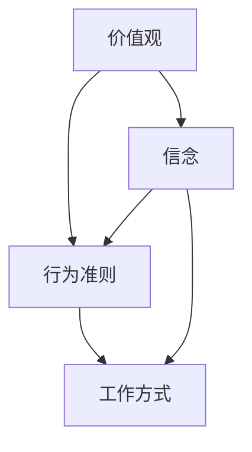

                 

### 一、引言

团队文化建设是现代组织管理中不可或缺的一部分。一个成功的企业不仅需要优秀的项目和产品，还需要拥有强大的团队精神和文化作为支撑。本文旨在探讨团队文化建设的深化，以塑造持久团队精神。这一主题的重要性不言而喻，因为团队文化的强弱直接影响组织的绩效、员工的满意度和企业的长期发展。

首先，团队文化建设为组织提供了一个共同的目标和价值观，有助于团队成员之间的协作和沟通。其次，它能够增强员工的归属感和忠诚度，提高员工的工作热情和创造力。此外，团队文化建设还能够促进创新和持续改进，为企业在激烈的市场竞争中保持优势提供有力支持。

本文将按照以下结构展开：

1. **团队文化建设概述**：介绍团队文化的定义、重要性及其核心要素。
2. **深化团队文化建设的方法与策略**：探讨企业文化价值观的整合、团队精神培养的策略以及管理层在团队文化建设中的作用。
3. **团队精神的塑造与维护**：分析团队精神的核心特征、塑造与维护的方法及其案例分析。
4. **团队文化建设案例解析**：通过成功和失败的案例分析，提供团队文化建设的最佳实践。
5. **团队文化建设评估与持续改进**：介绍团队文化建设评估的方法、结果分析与持续改进的途径。
6. **团队文化建设中的障碍与解决方案**：探讨文化差异、内部竞争与协调、领导风格等方面的障碍及解决方案。
7. **团队文化建设未来展望**：预测未来团队文化的趋势及其对团队文化建设的影响。

通过上述步骤，我们将深入探讨团队文化建设的各个方面，为读者提供实用的指导和建议。

### 二、团队文化建设概述

团队文化是指在一个组织内部形成的、被多数成员共同认可并遵守的价值观、信念、行为准则和工作方式。它不仅包括显性的部分，如组织的规章制度、视觉识别系统和员工行为规范，还包括隐性的部分，如组织的氛围、成员之间的互动方式以及组织对员工的期望和态度。

团队文化的重要性不可忽视。首先，它是组织凝聚力的源泉。一个健康的团队文化能够使团队成员感到彼此之间是有联系的，有助于增强团队的凝聚力。其次，团队文化对员工的行为和决策有深远影响。当团队文化倡导诚信、协作和创新时，员工更容易在工作中表现出这些行为，从而提高工作效率和绩效。此外，团队文化还能够提高员工的工作满意度和忠诚度，减少员工流失率，从而为企业的长期发展提供稳定的人才支持。

核心要素方面，团队文化通常包括以下几个方面：

1. **价值观**：这是团队文化的基石，是团队成员共同认可和追求的目标。如尊重、诚信、创新等。
2. **信念**：团队成员对组织的信任和对未来的期待。如对市场机会的把握、对技术发展的信心等。
3. **行为准则**：团队成员在工作和互动中应遵守的规则和标准。如公平、透明、积极等。
4. **工作方式**：团队在完成工作过程中采用的协作方式和方法。如敏捷开发、跨部门协作等。

这些核心要素相互联系，共同构成了团队文化的整体框架。例如，价值观会影响行为准则，而行为准则又影响工作方式，最终共同塑造团队的精神面貌。

为了更好地理解团队文化，我们可以使用Mermaid流程图来展示其核心概念和联系。以下是团队文化核心要素的Mermaid流程图：

在这个流程图中，价值观、行为准则、信念和工作方式相互关联，共同构成团队文化的核心。通过这种方式，我们可以清晰地看到团队文化的各个要素如何相互作用和影响。

### 三、深化团队文化建设的方法与策略

在了解了团队文化建设的核心要素和重要性之后，接下来我们将探讨如何深化团队文化建设，以塑造持久团队精神。深化团队文化建设需要从多个方面进行系统性的思考和策略性的实施。

首先，企业文化价值观的整合是深化团队文化建设的关键。企业文化价值观是团队文化的基石，它决定了团队成员的共同目标和行为准则。为了实现价值观的整合，企业需要通过以下几个步骤：

1. **明确价值观**：企业需要明确自身的核心价值观，并将其传达给所有员工。这可以通过制定一份简洁明了的核心价值观声明来完成。

2. **培训与教育**：通过定期的培训和教育活动，让员工深入了解和认同企业的价值观。这可以包括内部培训课程、员工手册、研讨会等。

3. **领导示范**：管理层应通过自身行为来示范和传递价值观，让员工感受到价值观在企业内部的落实。例如，领导可以在决策过程中体现出诚信、公正和透明。

4. **激励机制**：将价值观融入激励机制，对那些在价值观方面表现突出的员工进行奖励，从而强化价值观的认同和实践。

其次，团队精神培养的策略是深化团队文化建设的重要方面。团队精神是指团队成员之间相互信任、支持、协作和共同奋斗的态度和氛围。为了培养团队精神，企业可以采取以下策略：

1. **建立信任**：信任是团队精神的基础。企业可以通过团队建设活动、公开透明的沟通和制度化的信任机制来建立和维护信任。

2. **促进协作**：鼓励跨部门、跨职能的协作，通过项目合作、知识共享和团队会议等方式，促进团队成员之间的互动和合作。

3. **认可与激励**：对那些在团队合作中表现突出的团队成员进行认可和激励，以激发更多成员的积极性。

4. **共同目标**：确保团队成员有共同的目标和愿景，这有助于增强团队的凝聚力。

管理层在团队文化建设中的作用至关重要。管理层不仅是价值观的传播者，也是团队精神的推动者。为了充分发挥管理层的作用，企业可以采取以下措施：

1. **明确角色**：管理层应明确自己在团队文化建设中的角色和责任，并制定相应的行动计划。

2. **积极参与**：管理层应积极参与团队建设活动，与员工一起参与讨论、决策和执行。

3. **提供资源**：管理层应提供必要的资源和支持，为团队文化建设创造良好的条件。

4. **持续监督**：管理层应对团队文化建设的过程进行持续监督和评估，确保文化建设取得实效。

最后，团队文化建设与员工参与密不可分。员工的积极参与是团队文化建设的基石。为了鼓励员工参与，企业可以采取以下策略：

1. **建立反馈机制**：为员工提供表达意见和建议的渠道，让员工感到他们的声音被听到。

2. **提供发展机会**：为员工提供职业发展机会，让他们在参与团队文化建设的过程中实现个人成长。

3. **组织团队活动**：通过组织团队活动，增强团队成员之间的联系和互动，促进团队精神的培养。

通过上述方法与策略，企业可以深化团队文化建设，塑造持久团队精神。这不仅有助于提升企业的整体绩效，还能为员工提供更良好的工作环境和职业发展机会。

#### 四、团队精神的塑造与维护

团队精神是指团队成员在共同目标和价值观指导下，相互信任、支持、协作和共同奋斗的态度和氛围。它是团队文化的重要组成部分，直接影响团队的工作效率和绩效。因此，塑造和维持团队精神对于组织的成功至关重要。

**团队精神的核心特征**：

1. **相互信任**：信任是团队精神的基石。团队成员之间需要相互信任，相信彼此的能力和诚信，这样才能有效地协同工作。
2. **共同目标**：团队成员应拥有共同的目标和愿景，这有助于增强团队的凝聚力，使每个成员都朝着同一方向努力。
3. **相互支持**：在团队成员遇到困难或挑战时，其他人能够提供帮助和支持，共同克服困难。
4. **协作精神**：团队精神强调协作，鼓励团队成员共享资源、知识和技能，以实现团队的目标。
5. **积极进取**：团队成员应具备积极进取的精神，勇于面对挑战和变化，不断追求卓越。

**塑造团队精神的策略**：

1. **共同价值观的建立**：通过明确和传达团队的共同价值观，让每个成员都认同并追求这些价值观。这可以通过团队宣言、培训和教育等方式来实现。
2. **增强信任**：通过定期的团队建设活动和沟通，增强团队成员之间的信任。这可以包括团队信任游戏、分享个人故事和体验等。
3. **共同目标的设定**：确保团队成员都了解并认同团队的目标，并明确每个成员在实现目标中的角色和责任。
4. **支持与鼓励**：鼓励团队成员在遇到困难时相互支持和鼓励，共同解决问题。
5. **鼓励协作**：通过跨部门项目和协作任务，促进团队成员之间的互动和协作。
6. **奖励机制**：建立激励机制，对在团队协作中表现出色的成员进行奖励，以增强团队成员的积极性。

**维护团队精神的方法**：

1. **持续沟通**：保持开放的沟通渠道，鼓励团队成员分享意见、建议和反馈，确保信息透明和及时传递。
2. **培养团队氛围**：营造积极、包容和互相尊重的团队氛围，使每个成员都感到被重视和认可。
3. **培训与发展**：为团队成员提供培训和发展机会，帮助他们提升技能和职业素养，从而增强团队的整体实力。
4. **领导者示范**：管理层应以身作则，通过自身行为来示范和传递团队精神，成为团队成员的榜样。
5. **定期的团队活动**：组织定期的团队活动，如团队建设工作坊、团建旅游和聚会等，增强团队成员之间的联系和互动。

**案例分析**：

一个成功的团队精神塑造和维护的案例是Google。Google以其独特的公司文化和强大的团队精神而闻名。以下是Google在这方面的一些做法：

1. **共同价值观的建立**：Google的创始人拉里·佩奇和谢尔盖·布林确立了“不作恶”的核心价值观，这一价值观贯穿于公司的各个方面。
2. **增强信任**：Google强调开放、透明和信任的文化，鼓励员工之间分享想法和知识，这有助于建立信任和协作。
3. **共同目标的设定**：Google通过明确的目标和愿景，如“组织全球信息，使人人可访问并从中受益”，激励员工为共同目标而努力。
4. **支持与鼓励**：Google提供灵活的工作环境和资源，支持员工在工作和个人发展方面取得成功。
5. **鼓励协作**：Google鼓励跨部门的合作，通过内部项目和工作小组，促进团队之间的协作。
6. **持续的沟通**：Google利用内部邮件、博客、会议和社交平台，保持与员工的持续沟通。
7. **领导示范**：Google的领导层通过自身行为示范团队精神，如开放办公和参与团队活动。

通过上述策略和方法，Google成功地塑造和维持了强大的团队精神，这为其在技术领域的持续创新和成功提供了有力支持。

#### 五、团队文化建设案例解析

在探讨如何深化团队文化建设时，成功的案例往往能提供宝贵的经验和启示。以下将分析几个具有代表性的团队文化建设案例，从中总结最佳实践，并探讨团队文化建设中面临的挑战及其解决方案。

**案例一：Google**

Google以其独特的公司文化和强大的团队精神而著称。其成功的关键在于明确的价值观、开放的沟通渠道和灵活的工作环境。

**最佳实践**：

1. **共同价值观的建立**：Google的“不作恶”和“创新至上”等核心价值观深深植根于每个员工心中，成为团队协作的基础。
2. **开放沟通**：Google采用多种沟通工具，如内部邮件、博客和社交媒体，确保信息透明和及时传递。
3. **灵活的工作环境**：Google允许员工灵活安排工作时间，甚至在家中工作，这增强了员工的满意度和忠诚度。
4. **领导示范**：Google的领导层积极参与团队建设活动，通过自身行为示范团队精神。

**挑战与解决方案**：

- **文化差异**：由于Google在全球范围内运营，不同国家和地区的员工可能存在文化差异。解决方案是加强跨文化培训，促进员工之间的相互理解和尊重。
- **内部竞争**：在快速发展的公司中，内部竞争可能导致团队精神受损。解决方案是建立公平的竞争机制，鼓励合作而非竞争。

**案例二：腾讯**

腾讯作为中国领先的互联网公司，其团队文化建设以“用户价值”为核心，注重技术创新和团队协作。

**最佳实践**：

1. **用户导向**：腾讯的团队建设以用户价值为核心，鼓励员工关注用户需求，持续改进产品和服务。
2. **技术创新**：腾讯不断投资于新技术研发，鼓励员工进行创新，以保持竞争优势。
3. **团队协作**：腾讯强调跨部门协作，通过内部项目和工作小组，促进团队之间的互动和协作。

**挑战与解决方案**：

- **员工流失**：高流动率可能影响团队精神。解决方案是通过提供职业发展机会和竞争力的薪酬福利，提高员工的忠诚度。
- **管理复杂性**：随着公司规模扩大，管理复杂性增加。解决方案是建立高效的管理体系，确保团队文化的持续传承。

**案例三：华为**

华为以其强大的研发能力和全球竞争力而闻名。其团队文化建设注重团队合作、创新和国际化视野。

**最佳实践**：

1. **团队合作**：华为强调团队合作，通过跨职能项目和全球协作，提高团队的整体能力。
2. **创新文化**：华为鼓励员工进行创新，提供丰富的创新资源和奖励机制。
3. **国际化视野**：华为注重国际化，吸引全球顶尖人才，促进不同文化之间的交流与融合。

**挑战与解决方案**：

- **文化冲突**：国际化团队可能面临文化冲突。解决方案是通过文化培训和文化融合活动，促进不同文化之间的理解和尊重。
- **管理效率**：全球化运营可能影响管理效率。解决方案是建立全球化的管理架构，提高管理效率和响应速度。

通过上述案例，我们可以看到，团队文化建设需要结合企业的具体情况进行，但一些核心原则，如共同价值观的建立、开放的沟通渠道、灵活的工作环境和领导层的示范作用，是成功的关键。同时，面对文化差异、员工流失和管理复杂性等挑战，企业需要采取有效的解决方案，以确保团队文化建设能够持续深化并取得成效。

#### 六、团队文化建设评估与持续改进

团队文化建设的效果评估是确保其持续改进和有效性的关键环节。通过科学的方法和工具，企业可以准确了解团队文化的现状，识别存在的问题，并制定相应的改进措施。

**评估方法**：

1. **问卷调查**：通过设计针对性的问卷，收集员工对团队文化的看法和反馈。问卷内容可以包括团队信任、沟通效果、价值观认同等方面。

2. **访谈与观察**：与管理层和普通员工进行一对一访谈，了解他们对团队文化的真实感受和看法。同时，通过现场观察，评估团队行为和互动方式。

3. **绩效指标**：将团队文化的评估与绩效指标相结合，分析团队文化对工作绩效的影响。如团队协作效率、项目成功率、员工流失率等。

4. **360度评估**：邀请团队成员、上级、同事和下属对团队成员进行评估，全面了解团队文化的影响。

**评估结果的分析与应用**：

1. **数据整理与统计**：对收集到的数据进行整理和统计分析，识别团队文化的主要问题和优势。

2. **原因分析**：结合问卷调查、访谈和观察结果，分析问题产生的原因，如文化冲突、沟通不畅、价值观差异等。

3. **制定改进措施**：根据分析结果，制定针对性的改进措施，如加强文化培训、优化沟通机制、建立激励机制等。

**持续改进的途径**：

1. **定期评估**：团队文化建设是一个持续的过程，需要定期进行评估，以跟踪改进措施的实施效果。

2. **反馈机制**：建立有效的反馈机制，让员工能够持续提供反馈和建议，确保改进措施的及时调整。

3. **培训与发展**：定期组织文化培训和发展活动，提升员工的文化素养和团队协作能力。

4. **领导示范**：管理层应通过自身行为示范团队文化，成为员工的榜样。

5. **激励机制**：建立与团队文化相一致的激励机制，鼓励员工积极践行团队价值观。

**案例分析**：

一个成功的团队文化建设评估与持续改进的案例是IBM。IBM通过定期的文化评估和持续改进，成功地塑造了以创新和客户为中心的团队文化。

**评估过程**：

1. **数据收集**：通过问卷调查和访谈，收集员工对团队文化的看法和反馈。

2. **数据整理**：对收集到的数据进行整理和统计分析，识别文化问题。

3. **改进措施**：根据评估结果，IBM制定了一系列改进措施，如加强领导力培训、优化沟通机制、建立创新激励计划等。

**持续改进**：

1. **定期评估**：IBM定期进行文化评估，以跟踪改进措施的实施效果。

2. **反馈机制**：建立有效的反馈机制，让员工能够持续提供反馈和建议。

3. **培训与发展**：IBM定期组织文化培训和发展活动，提升员工的文化素养和团队协作能力。

4. **领导示范**：IBM的领导层通过自身行为示范团队文化，成为员工的榜样。

5. **激励机制**：IBM建立了与团队文化相一致的激励机制，鼓励员工积极践行团队价值观。

通过上述案例，我们可以看到，科学的文化评估和持续改进是深化团队文化建设的重要手段。通过定期的评估和反馈，企业可以不断优化团队文化，提高团队的凝聚力和工作效率，从而实现长期的可持续发展。

#### 七、团队文化建设中的障碍与解决方案

在深化团队文化建设的过程中，企业往往面临诸多障碍。这些障碍可能源于文化差异、内部竞争、领导风格等多个方面。以下将详细探讨这些障碍及其对应的解决方案。

**文化差异**：

文化差异是团队文化建设中的一个常见障碍。不同国家和地区、不同背景的员工可能在价值观、行为准则和工作方式上存在显著差异。这可能导致沟通不畅、协作困难，甚至影响团队的凝聚力和工作效率。

**解决方案**：

1. **跨文化培训**：企业可以通过跨文化培训，提高员工对不同文化的理解和尊重。这可以包括文化差异的介绍、文化敏感性培训等。

2. **建立文化融合机制**：通过定期的文化交流活动，如国际团队建设、文化分享会等，促进不同文化之间的融合。

3. **明确文化准则**：制定明确的文化准则和行为规范，确保所有员工都了解并遵守，减少文化冲突。

**内部竞争**：

内部竞争在一定程度上是健康的，但过度的竞争可能导致团队分裂，损害团队精神。内部竞争可能源于绩效评估、晋升机会、资源分配等方面。

**解决方案**：

1. **建立公平的竞争机制**：确保竞争的公平性和透明度，避免不公平的待遇。

2. **强化合作文化**：鼓励员工在竞争中相互学习、相互支持，强调团队合作的重要性。

3. **提供发展机会**：为员工提供多样化的职业发展路径，减少对单一晋升机会的依赖。

**领导风格**：

领导风格对团队文化建设有重要影响。不同的领导风格可能导致团队氛围的不同，从而影响团队精神。

**解决方案**：

1. **领导培训**：对管理层进行领导力培训，提高其领导能力和文化敏感性。

2. **多样化领导风格**：鼓励领导层采用多样化的领导风格，以适应不同员工的偏好和需求。

3. **领导示范**：领导层应以身作则，通过自身行为示范团队文化和价值观。

**综合解决方案**：

为了有效地应对这些障碍，企业可以采取以下综合解决方案：

1. **系统性规划**：制定系统性规划，明确团队文化建设的目标和步骤，确保各项措施有序实施。

2. **持续沟通**：保持开放的沟通渠道，鼓励员工表达意见和建议，及时解决文化冲突和内部竞争问题。

3. **激励机制**：建立与团队文化相一致的激励机制，鼓励员工积极践行团队价值观。

4. **外部咨询**：聘请外部专业顾问，为企业提供团队文化建设咨询和支持，确保文化建设取得实效。

通过上述解决方案，企业可以克服团队文化建设中的障碍，塑造持久团队精神，提高整体绩效和竞争力。

#### 八、团队文化建设未来展望

随着全球化和数字化时代的到来，团队文化建设面临新的挑战和机遇。未来团队文化的趋势将对组织的管理方式和运营模式产生深远影响。

**未来团队文化的趋势**：

1. **数字化文化**：随着数字化技术的广泛应用，团队文化将更加注重数据驱动和创新。企业将利用大数据、人工智能等技术，提高决策效率和团队协作效果。

2. **灵活性和适应性**：未来团队文化将更加注重灵活性，以适应快速变化的市场环境和客户需求。远程办公、弹性工作时间和虚拟团队将成为常态。

3. **多元化与包容性**：全球化带来了多元文化和背景的员工，未来团队文化将更加注重多元化和包容性，尊重和融合不同文化和观点。

4. **价值观驱动**：企业价值观将成为团队文化的重要组成部分，驱动员工的决策和行为。企业将更加注重社会责任和可持续发展的价值观。

**技术进步对团队文化建设的影响**：

1. **沟通与协作工具**：技术进步为团队提供了更多高效的沟通和协作工具，如即时通讯、视频会议、项目管理平台等，有助于提高团队协作效率和沟通质量。

2. **数据分析和决策**：大数据和人工智能技术使企业能够更准确地分析和预测团队绩效，从而优化团队文化建设策略。

3. **个性化学习和发展**：数字化平台和在线教育技术使得员工可以根据个人需求进行定制化学习和发展，提高团队的整体素质。

**全球化对团队文化建设的影响**：

1. **文化冲突与融合**：全球化带来了不同文化之间的碰撞和融合，企业需要建立包容性的文化，促进跨文化沟通和协作。

2. **多元化团队**：全球化带来了多元化的员工团队，企业需要培养和维持多元化的团队文化，以发挥不同文化背景员工的潜力。

**未来团队文化建设的挑战与机遇**：

1. **挑战**：
   - 文化差异：不同国家和地区的文化差异可能导致团队冲突和沟通障碍。
   - 技术适应性：企业需要不断适应新技术，以保持团队文化的活力和竞争力。
   - 管理复杂性：全球化运营和管理多元化团队将增加管理的复杂性和挑战。

2. **机遇**：
   - 创新与协作：全球化带来了更多的合作机会和跨文化交流，有助于团队创新和协作。
   - 人才培养：全球化提供了更多的人才培养和引进机会，有助于提升团队的整体素质。

**应对策略**：

1. **持续学习与适应**：企业应鼓励员工持续学习和适应新技术，以保持团队的活力和竞争力。

2. **多元化与包容性**：建立包容性的文化，尊重和融合不同文化背景的员工，促进团队合作。

3. **数据驱动决策**：利用大数据和人工智能技术，优化团队文化建设策略，提高决策效率和团队协作效果。

4. **领导力发展**：培养具有全球视野和跨文化管理能力的领导团队，以应对全球化带来的挑战和机遇。

通过上述策略，企业可以应对未来团队文化建设中的挑战，抓住机遇，塑造适应时代发展的团队文化，为企业的长期成功奠定基础。

### 九、总结与最佳实践 tips

本文系统地探讨了团队文化建设的重要性、核心要素、深化方法、团队精神的塑造与维护、案例分析、评估与改进、障碍解决方案及未来展望。总结如下：

**核心要点**：
1. 团队文化是组织凝聚力、工作效率和员工满意度的重要源泉。
2. 明确的共同价值观和行为准则有助于塑造持久团队精神。
3. 深化团队文化建设需要整合企业文化价值观、培养团队精神、提供领导力支持。
4. 评估与改进是团队文化建设的重要环节，确保文化建设取得实效。
5. 文化差异、内部竞争和领导风格是常见的障碍，需采取相应策略解决。

**最佳实践 tips**：
1. **建立清晰的价值观**：确保所有员工都能理解和认同企业的核心价值观。
2. **促进跨部门协作**：通过项目合作和知识共享，增强团队间的互动和协作。
3. **领导示范**：管理层应以身作则，成为团队文化的倡导者和实践者。
4. **定期评估与反馈**：定期评估团队文化建设的成效，及时调整和改进。
5. **多元化与包容性**：尊重不同文化和背景的员工，建立包容性的团队文化。

**注意事项**：
1. 文化建设需要持续投入和时间，不可急功近利。
2. 文化建设需与组织战略和目标相一致，避免偏离核心业务。
3. 鼓励员工参与文化建设，提升他们的归属感和主人翁意识。

**拓展阅读**：
- 《领导力的五项修炼》（作者：史蒂芬·柯维）
- 《团队协作的艺术》（作者：罗纳德·海费茨）
- 《企业文化与团队建设》（作者：彼得·德鲁克）

通过上述总结和最佳实践，企业可以更好地深化团队文化建设，塑造持久团队精神，从而实现长期可持续发展。

### 作者信息

作者：AI天才研究院/AI Genius Institute & 禅与计算机程序设计艺术 /Zen And The Art of Computer Programming

AI天才研究院（AI Genius Institute）是全球领先的人工智能研究与培训机构，致力于推动人工智能技术的发展和应用。同时，作者也是《禅与计算机程序设计艺术》一书的作者，该书深入探讨了计算机编程中的哲学和艺术，为读者提供了独特的编程思维和方法。这两者共同体现了作者在人工智能和计算机科学领域的深厚造诣和独到见解。

