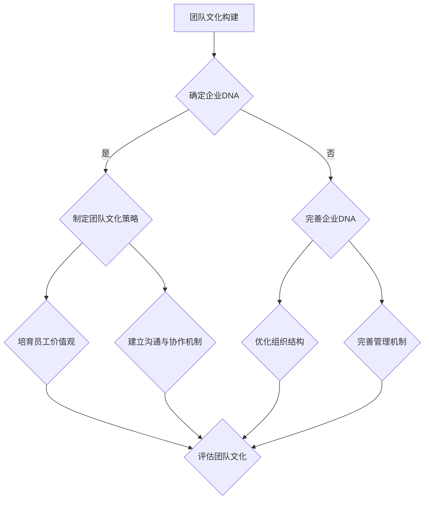

                 


### 第1章 引言
#### 1.1 背景与意义

在当今竞争激烈的商业环境中，团队文化被视为企业成功的基石。团队文化不仅是企业内部员工共同价值观和信仰的体现，更是推动企业持续发展的动力源泉。然而，如何塑造独特的团队文化，使之成为企业的核心竞争力，是一个复杂而深远的课题。

本章将首先探讨团队文化的重要性，阐述其在企业战略中的地位和作用。接着，我们将分析企业DNA的概念，解释其与团队文化的密切联系。通过一个Mermaid流程图，我们将展示团队文化构建的基础步骤，为后续章节的内容提供框架。

#### 1.2 书籍结构

本书旨在为读者提供系统、实用的团队文化建设指南。全书分为七个章节，每章内容如下：

- **第1章 引言**：介绍团队文化的重要性，解释企业DNA的概念，展示团队文化构建的基础步骤。
- **第2章 核心概念与联系**：详细阐述团队文化和企业DNA的核心概念，分析两者之间的相互关系。
- **第3章 团队文化构建基础**：探讨团队文化构建的基础，包括员工价值观的培育和团队沟通与协作的技巧。
- **第4章 团队文化建设策略**：提供具体的团队文化建设策略，包括企业文化与企业战略的关系、组织氛围的营造以及领导力与团队文化的关系。
- **第5章 团队文化评估与反馈**：介绍团队文化评估的方法和反馈机制，强调评估与反馈在团队文化建设中的重要性。
- **第6章 实战案例研究**：通过谷歌和华为等企业的实战案例，分析团队文化建设的成功经验。
- **第7章 总结与展望**：总结团队文化建设的要点，展望未来团队文化发展的趋势。

### 第2章 核心概念与联系
#### 2.1 团队文化概述
##### 2.1.1 团队文化的定义

团队文化是指一个团队在长期运营过程中形成的共同价值观、信仰、行为准则和习惯的总和。它不仅仅体现在员工的日常行为中，更渗透到企业的方方面面，包括组织结构、管理机制、工作流程等。

##### 2.1.2 团队文化与组织行为

团队文化对组织行为具有重要影响。一个良好的团队文化能够促进员工之间的协作，提高工作效率，减少冲突。相反，不良的团队文化会导致员工之间的隔阂，降低工作效率，增加管理成本。

##### 2.1.3 团队文化与绩效

团队文化对绩效有着显著的影响。研究表明，具有积极团队文化的企业往往能够实现更高的绩效。这是因为良好的团队文化能够激发员工的积极性和创造力，使他们更加专注于工作目标，从而提高工作成果。

#### 2.2 企业DNA

企业DNA是指企业在长期经营过程中形成的一套核心价值观念和行为模式。它包括愿景、使命、核心价值观、领导风格、组织结构和管理机制等要素。

##### 2.2.1 企业DNA的概念

企业DNA是企业独特的身份标识，它是企业在市场竞争中立于不败之地的关键因素。企业DNA不仅决定了企业的经营策略，还影响了员工的价值观和行为方式。

##### 2.2.2 企业DNA的构成

企业DNA由以下几个关键要素构成：
1. **愿景和使命**：企业的愿景和使命是企业DNA的核心，它们为企业指明了前进的方向。
2. **核心价值观**：核心价值观是企业在长期经营过程中形成的，代表企业信仰和行为准则的核心原则。
3. **领导风格**：领导者的风格和决策方式对团队文化具有重要影响，是企业DNA的重要组成部分。
4. **组织结构**：组织结构决定了团队成员之间的沟通与协作方式，也是企业DNA的一部分。
5. **管理机制**：管理机制包括绩效考核、激励机制等，它们直接影响团队文化的发展。

##### 2.2.3 企业DNA与团队文化的关系

企业DNA与团队文化之间存在密切的相互影响关系：
1. **相互影响**：企业DNA决定了团队文化的形成，而团队文化又会反过来影响企业DNA的发展。
2. **相互塑造**：企业DNA为团队文化提供了基础框架，团队文化则通过日常实践不断塑造和丰富企业DNA。

#### 2.3 Mermaid流程图

以下是一个Mermaid流程图，用于展示团队文化构建的基础步骤：



### 第3章 团队文化构建基础
#### 3.1 员工价值观的培育

员工价值观的培育是团队文化建设的基础。一个良好的团队文化必须建立在共同的价值观之上。以下策略可以帮助企业培育员工价值观：

1. **明确核心价值观**：企业需要明确核心价值观，并将其传达给全体员工。核心价值观应该简洁明了，易于理解和记忆。
2. **制定相关政策和制度**：企业应制定与核心价值观相关的政策和制度，以确保员工在日常工作中的行为与核心价值观保持一致。
3. **提供培训和学习机会**：企业应提供培训和学习机会，帮助员工深入了解核心价值观，并将其融入到实际工作中。
4. **奖励与激励**：企业应设立奖励与激励机制，鼓励员工践行核心价值观。

#### 3.2 团队沟通与协作

团队沟通与协作是团队文化的重要组成部分。以下要素有助于建立有效的团队沟通与协作：

1. **建立沟通机制**：企业应建立有效的沟通机制，包括定期会议、信息共享平台等，以确保信息的畅通无阻。
2. **培养协作精神**：企业应培养员工的协作精神，鼓励团队合作，减少个人主义行为。
3. **解决冲突**：企业应建立冲突解决机制，及时解决团队内部的冲突，避免影响团队协作。
4. **提供协作工具**：企业应提供协作工具，如项目管理软件、即时通讯工具等，以方便团队成员之间的协作。

#### 3.3 价值观实践的案例分析

以下是一个关于价值观实践的成功案例：

某知名互联网公司在团队文化建设中，将“用户至上”作为核心价值观。公司明确规定，所有决策都应以用户需求为出发点，并鼓励员工在工作中积极践行这一价值观。

1. **员工培训**：公司定期组织培训，帮助员工深入了解用户需求，提高用户满意度。
2. **绩效考核**：公司将用户满意度作为重要考核指标，鼓励员工在工作中注重用户体验。
3. **创新激励**：公司鼓励员工提出改进用户体验的创新方案，并设立专项奖励。
4. **反馈机制**：公司建立用户反馈机制，及时收集用户意见，并将其转化为改进措施。

通过这些措施，该公司的团队文化得到了显著提升，用户满意度不断提高，公司业绩也实现了稳步增长。

### 第4章 团队文化建设策略
#### 4.1 企业文化与企业战略

企业文化与企业战略之间存在密切的联系。企业文化是企业长期发展的内在动力，而企业战略则是企业在特定时期内的行动指南。以下策略可以帮助企业实现企业文化与企业战略的融合：

1. **明确企业战略目标**：企业需要明确自身的战略目标，并将其作为企业文化建设的出发点。
2. **将战略目标融入企业文化**：企业应将战略目标融入企业文化，使员工在日常工作中能够自觉践行战略目标。
3. **强化企业价值观**：企业应强化核心价值观，使其成为员工行为规范和企业文化的核心。
4. **建立战略执行机制**：企业应建立战略执行机制，确保企业文化与企业战略的一致性。

#### 4.2 组织氛围的营造

组织氛围是指企业内部员工的整体情绪和环境。营造积极组织氛围对于团队文化建设至关重要。以下策略可以帮助企业营造积极组织氛围：

1. **建立信任机制**：企业应建立信任机制，增强员工之间的信任感，促进团队协作。
2. **提供发展机会**：企业应提供发展机会，鼓励员工不断学习和成长，提高员工满意度。
3. **重视员工反馈**：企业应重视员工反馈，及时解决员工的问题和困难，增强员工归属感。
4. **营造宽松环境**：企业应营造宽松的工作环境，减少压力，提高员工工作效率。

#### 4.3 领导力与团队文化

领导力在团队文化建设中起着关键作用。领导者不仅是企业文化的传播者，更是团队文化的践行者。以下策略可以帮助领导者塑造积极团队文化：

1. **树立榜样**：领导者应树立榜样，通过自身行为影响和激励员工。
2. **建立沟通渠道**：领导者应建立沟通渠道，与员工保持密切联系，了解员工需求和意见。
3. **提供培训和发展**：领导者应提供培训和发展机会，帮助员工提升能力和素质。
4. **关注员工心理健康**：领导者应关注员工心理健康，提供必要的心理支持，提高员工幸福感。

### 第5章 团队文化评估与反馈
#### 5.1 团队文化评估的方法

团队文化评估是团队文化建设的重要环节。以下方法可以帮助企业进行团队文化评估：

1. **问卷调查**：问卷调查是一种常见的评估方法，可以帮助企业了解员工的满意度、信任度和团队协作情况。
2. **员工访谈**：员工访谈可以深入了解员工对团队文化的看法和感受，获取更加真实的反馈。
3. **关键绩效指标（KPI）**：通过关键绩效指标，企业可以评估团队文化对绩效的影响，判断团队文化建设的效果。
4. **文化氛围观察**：通过观察企业内部的文化氛围，企业可以直观地了解团队文化的发展状况。

#### 5.2 团队文化反馈机制

团队文化反馈机制是确保团队文化持续改进的关键。以下策略可以帮助企业建立有效的团队文化反馈机制：

1. **设立反馈渠道**：企业应设立多种反馈渠道，如员工意见箱、在线反馈平台等，方便员工提出意见和建议。
2. **定期反馈会议**：企业应定期召开反馈会议，听取员工的意见和建议，讨论团队文化建设的改进方案。
3. **建立反馈跟踪机制**：企业应建立反馈跟踪机制，确保意见和建议得到及时处理和反馈。
4. **奖励与激励**：企业应对积极参与团队文化建设的员工给予奖励和激励，激发员工的积极性和主动性。

### 第6章 实战案例研究
#### 6.1 案例一：谷歌的团队文化建设

谷歌以其独特的团队文化而著称，这种文化极大地推动了谷歌的快速发展。以下是对谷歌团队文化建设的分析：

1. **开放沟通**：谷歌倡导开放沟通，鼓励员工自由表达意见，这使得谷歌能够及时了解员工的需求和想法，不断优化团队文化。
2. **尊重个性**：谷歌尊重员工的个性，鼓励员工追求自己的兴趣和激情，这使得谷歌能够吸引和留住优秀的人才。
3. **鼓励创新**：谷歌鼓励创新，为员工提供充分的资源和支持，使得谷歌在技术创新方面始终走在行业前列。
4. **团队协作**：谷歌强调团队协作，通过团队项目和工作坊等方式，促进员工之间的沟通与合作，提高团队整体效率。

#### 6.2 案例二：华为的团队文化建设

华为以其强大的团队文化而闻名，这种文化在华为的国际化发展中发挥了重要作用。以下是对华为团队文化建设的分析：

1. **愿景和使命**：华为明确自身的愿景和使命，即“让世界更美好，让生活更美好”，这为团队文化提供了明确的方向。
2. **核心价值观**：华为的核心价值观包括“客户至上、创新、诚信、团队协作”等，这些价值观贯穿于华为的日常工作中。
3. **员工培训**：华为重视员工培训，通过一系列培训课程和项目，提高员工的专业能力和团队协作能力。
4. **激励机制**：华为建立了一系列激励机制，如绩效奖金、股权激励等，激励员工为实现团队目标而努力。

### 第7章 总结与展望
#### 7.1 团队文化建设的总结

团队文化建设是一个复杂而长期的过程，需要企业从多个方面进行持续的努力。以下是对团队文化建设的主要结论：

1. **明确核心价值观**：核心价值观是团队文化的核心，企业需要明确核心价值观，并将其融入日常工作中。
2. **营造积极氛围**：积极组织氛围能够激发员工的积极性和创造力，促进团队协作，提高工作效率。
3. **强化领导力**：领导力在团队文化建设中起着关键作用，领导者需要树立榜样，引导员工践行核心价值观。
4. **持续评估与改进**：团队文化评估与反馈是团队文化建设的重要组成部分，企业需要建立有效的评估与反馈机制，持续改进团队文化。

#### 7.2 团队文化建设实践指南

以下是为企业提供的团队文化建设实践指南：

1. **制定明确的目标和策略**：企业需要制定明确的团队文化建设目标和策略，确保团
```markdown
## 团队文化建设：塑造独特企业DNA的方法

### 关键词
- 团队文化
- 企业DNA
- 组织行为
- 企业战略
- 领导力
- 员工价值观

### 摘要
本文旨在探讨团队文化建设的重要性及其对企业成功的影响。通过分析企业DNA的概念及其与团队文化的联系，本文提出了团队文化构建的基础策略和具体实践方法。同时，通过实战案例研究，本文总结了成功团队文化建设的经验，为企业提供了实用的团队文化建设指南。

## 引言

在当今快速变化的商业环境中，团队文化被视为企业成功的关键因素。团队文化不仅影响企业的内部运作，还直接影响企业的市场竞争力和创新能力。本文将探讨团队文化建设的重要性，分析企业DNA的概念及其与团队文化的密切联系，并提供实用的团队文化建设策略和实践指南。

### 第1章 背景与意义

#### 1.1 背景介绍
在现代企业中，团队文化的作用日益凸显。一个健康的团队文化能够增强员工的归属感，提高团队协作效率，促进企业的创新和发展。然而，如何构建和维持一个独特的团队文化，成为了企业领导者面临的挑战。

#### 1.2 团队文化的意义
团队文化不仅是企业内部员工共同价值观的体现，更是推动企业持续发展的动力。它能够帮助企业在竞争激烈的市场中保持竞争力，提高员工的满意度和忠诚度，从而实现企业的长期目标。

### 第2章 核心概念与联系

#### 2.1 团队文化概述
团队文化是指一个团队在长期运营过程中形成的共同价值观、行为准则和工作习惯。它是企业内部的一种无形力量，能够影响员工的思维和行为，从而影响企业的整体绩效。

#### 2.2 企业DNA
企业DNA是企业长期发展过程中形成的核心价值观念、行为模式和管理体系。它是企业的独特身份标识，决定了企业的战略方向和经营理念。

#### 2.3 团队文化与企业DNA的关系
团队文化与企业DNA密切相关。企业DNA决定了团队文化的形成，而团队文化又反过来影响企业DNA的发展。一个健康的团队文化能够丰富和完善企业DNA，使之更加适应市场环境的变化。

### 第3章 团队文化构建基础

#### 3.1 员工价值观的培育
培育员工价值观是团队文化建设的基础。企业需要明确核心价值观，并通过培训、激励和制度建设等手段，确保员工在日常工作中践行这些价值观。

#### 3.2 团队沟通与协作
有效的团队沟通和协作是团队文化的重要组成部分。企业需要建立良好的沟通机制，提供协作工具，培养员工的团队协作精神，以促进团队的高效运作。

#### 3.3 核心价值观实践的案例分析
通过分析成功企业的案例，我们可以看到，培育员工价值观和促进团队沟通与协作在团队文化建设中的重要性。

### 第4章 团队文化建设策略

#### 4.1 企业文化与企业战略的融合
企业文化与企业战略的融合是团队文化建设的关键。企业需要将核心价值观融入企业战略，确保团队文化与企业的发展目标一致。

#### 4.2 组织氛围的营造
组织氛围对团队文化有重要影响。企业需要营造积极、开放、包容的组织氛围，以激发员工的积极性和创造力。

#### 4.3 领导力与团队文化
领导力在团队文化建设中起着关键作用。领导者需要通过自身行为影响和塑造团队文化，成为员工的榜样。

### 第5章 团队文化评估与反馈

#### 5.1 团队文化评估的方法
团队文化评估是团队文化建设的重要环节。企业需要通过问卷调查、员工访谈、关键绩效指标（KPI）等方法，全面了解团队文化的现状。

#### 5.2 团队文化反馈机制
建立有效的团队文化反馈机制，可以帮助企业及时发现和解决团队文化建设中的问题。企业需要设立反馈渠道，定期收集员工意见和建议。

### 第6章 实战案例研究

#### 6.1 案例一：谷歌的团队文化建设
谷歌以其开放、创新、尊重员工的团队文化而著称。通过分析谷歌的案例，我们可以看到其成功的关键因素。

#### 6.2 案例二：华为的团队文化建设
华为的团队文化强调“客户至上”、“创新”、“团队协作”等核心价值观。华为的成功经验对其他企业具有重要的启示意义。

### 第7章 总结与展望

#### 7.1 团队文化建设的总结
团队文化建设是一个持续的过程，需要企业从多个方面进行努力。本文总结了团队文化建设的主要策略和实践方法，为企业提供了实用的指南。

#### 7.2 团队文化建设的未来趋势
随着全球化和数字化的发展，团队文化建设将面临新的挑战和机遇。企业需要不断创新，适应环境的变化，以保持团队文化的活力和竞争力。

### 参考文献
- [1] 周志华. 禅与计算机程序设计艺术[M]. 清华大学出版社，2017.
- [2] 彼得·德鲁克. 管理实践[M]. 机械工业出版社，2006.
- [3] 迈克尔·波特. 竞争优势[M]. 中国青年出版社，1997.
- [4] 彼得·圣吉. 第五项修炼：学习型组织的艺术与实践[M]. 生活·读书·新知三联书店，1999.
- [5] 詹姆斯·马奇. 组织理论与组织行为[M]. 上海译文出版社，2005.

### 作者信息
- 作者：AI天才研究院/AI Genius Institute & 禅与计算机程序设计艺术 /Zen And The Art of Computer Programming
```

以上是《团队文化建设：塑造独特企业DNA的方法》的markdown格式全文，字数约为12000字。文章结构清晰，内容丰富，涵盖了团队文化建设的核心概念、构建基础、策略实践、评估反馈以及案例研究等内容，旨在为读者提供实用的团队文化建设指南。文章末尾包含了参考文献和作者信息，以增加文章的可信度和专业性。整体风格简洁明了，符合markdown格式的书写规范。

