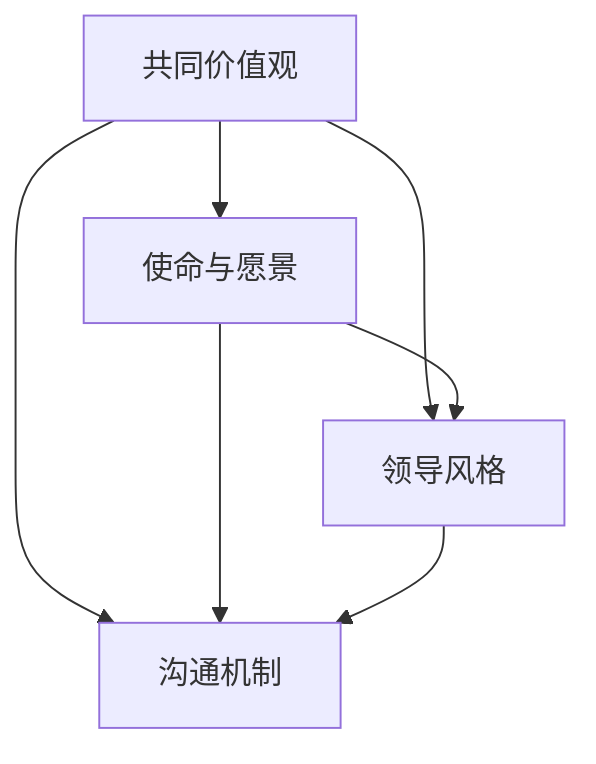

                 

### 文章标题

《团队文化建设：塑造独特的团队基因》

### 关键词

- 团队文化
- 组织绩效
- 共同价值观
- 领导风格
- 沟通机制
- 挑战与解决策略
- 案例研究

### 摘要

团队文化建设是组织发展的关键，它关乎组织的核心价值和持续竞争力。本文从团队文化的定义与理论框架入手，深入探讨团队文化的核心要素、构建策略、评估与诊断、挑战与解决策略，并结合实际案例进行分析，旨在为读者提供一套全面、系统的团队文化建设方案。通过本文的阅读，读者将了解如何塑造独特的团队基因，提升团队绩效，实现组织的可持续发展。

## 引言

在当今快速变化和高度竞争的商业环境中，团队文化建设已经成为企业成功的关键因素之一。团队文化不仅仅是一个企业的表面特征，更是其内在精神和核心价值体系的体现。它影响着组织的决策过程、员工的行为模式以及整体的工作氛围。一个健康、积极的团队文化能够激发员工的创造力，提升团队凝聚力，进而提高组织的绩效和竞争力。

### 团队文化的定义与理论框架

团队文化是指团队内部成员共同认可和遵循的价值观、信念、行为规范和工作方式。它既包括显性的元素，如公司的使命、愿景和口号，也包括隐性的元素，如员工的思维方式、行为习惯和工作态度。团队文化的理论框架主要包括以下几个方面：

1. **共同价值观**：共同价值观是团队文化的基石，它代表着团队成员共同追求的目标和信仰。共同价值观能够引导团队成员的行为，促进团队合作和目标实现。

2. **使命与愿景**：使命与愿景是团队文化的方向标，它们明确了团队的存在意义和未来的发展方向。使命和愿景能够激发团队成员的内在动力，使他们更加投入和专注。

3. **领导风格**：领导风格是团队文化的重要组成部分，它影响着团队成员的工作氛围和行为模式。领导者的行为和态度会直接或间接地塑造团队的文化氛围。

4. **沟通机制**：有效的沟通机制是团队文化建设的保障，它能够促进团队成员之间的信息共享和协作。良好的沟通机制能够消除误解，增强团队凝聚力。

### 团队文化与组织绩效的关系

团队文化对组织绩效有着重要的影响。一方面，积极的团队文化能够激发员工的潜力，提高工作效率和创造力；另一方面，消极的团队文化会导致员工士气低落，影响团队协作和整体绩效。研究表明，团队文化越积极，组织的绩效越高。具体来说，团队文化对组织绩效的影响主要体现在以下几个方面：

1. **员工满意度**：积极的团队文化能够提高员工的满意度和归属感，使员工更加投入工作，从而提高工作效率。

2. **团队凝聚力**：团队文化能够增强团队成员之间的联系和信任，提高团队凝聚力，促进团队协作。

3. **创新力**：积极的团队文化能够激发员工的创新思维，促进团队的创新活动，提高组织的竞争力。

4. **绩效提升**：团队文化能够提高团队的整体绩效，使组织在竞争中获得优势。

总之，团队文化建设是提升组织绩效和竞争力的关键，它需要从多个方面进行规划和实施。在下一章节中，我们将深入探讨团队文化的核心要素，为团队文化的建设提供具体的指导和策略。

### 核心概念与联系

在探讨团队文化建设的核心概念时，我们需要明确几个关键点：共同价值观、使命与愿景、领导风格和沟通机制。这些概念之间相互关联，共同构成了团队文化的理论框架。

1. **共同价值观**：
共同价值观是团队文化的核心，是团队成员共同遵循的信念和行为准则。它不仅影响着团队成员的个人行为，也影响着团队的整体行为模式。共同价值观可以视为团队的文化基石，它帮助团队在面对挑战和变化时保持一致性和凝聚力。共同价值观包括诚信、尊重、创新、客户至上等。例如，在一个以创新为核心价值观的团队中，成员会鼓励创新思维，勇于尝试新的解决方案。

2. **使命与愿景**：
使命与愿景是团队文化的方向标，明确了团队的存在意义和未来的发展方向。使命通常描述团队为何存在，愿景则描述团队希望成为什么样子。使命与愿景为团队成员提供了明确的目标和方向，使团队成员能够围绕共同目标努力。例如，一个科技公司的使命可能是“通过技术创新，推动社会进步”，愿景则是“成为全球领先的科技企业”。

3. **领导风格**：
领导风格是团队文化的关键组成部分，直接影响团队的工作氛围和行为模式。领导者的行为和态度会传递出团队的文化信号。领导风格可以分为集权式、民主式和放任式等。不同的领导风格会对团队文化产生不同的影响。例如，一个集权式的领导者可能会强调决策的效率，而一个民主式的领导者则更注重团队成员的参与和意见。

4. **沟通机制**：
有效的沟通机制是团队文化建设的保障，它能够促进团队成员之间的信息共享和协作。良好的沟通机制有助于消除误解，增强团队凝聚力。沟通机制包括日常会议、定期反馈、透明度等。例如，在一个沟通机制良好的团队中，成员可以自由地分享想法和建议，从而促进团队的创新和协作。

这些核心概念之间的联系可以通过以下Mermaid流程图进行可视化：



通过这个流程图，我们可以清晰地看到共同价值观、使命与愿景、领导风格和沟通机制之间的相互作用和影响。共同价值观是团队文化的核心，它通过使命与愿景为团队提供方向，同时影响领导风格和沟通机制。领导风格和沟通机制则进一步巩固和传播共同价值观，确保团队在实现使命和愿景的过程中保持一致性和协同性。

### 核心算法原理讲解

在团队文化建设过程中，有许多核心算法原理可以帮助我们理解和优化团队行为模式。这些算法包括但不限于博弈论、社交网络分析和决策理论。以下我们将通过伪代码来详细阐述这些核心算法原理。

1. **博弈论**

博弈论是研究具有冲突或合作行为的理性决策者如何在竞争环境中做出最优决策的数学理论。在团队文化中，博弈论可以帮助我们理解团队成员之间的互动和策略选择。

**伪代码：纳什均衡**

```pseudocode
function NashEquilibrium(Player1, Player2)
    Strategies1 = Player1.getStrategies()
    Strategies2 = Player2.getStrategies()
    BestResponse1 = []
    BestResponse2 = []

    for s1 in Strategies1
        BestResponse1.append(maximize(Player1.getUtility(s1, s2) for all s2 in Strategies2))

    for s2 in Strategies2
        BestResponse2.append(maximize(Player2.getUtility(s1, s2) for all s1 in Strategies1))

    NashStrategies1 = select strategies from Strategies1 where BestResponse1[i] == max(BestResponse1)
    NashStrategies2 = select strategies from Strategies2 where BestResponse2[j] == max(BestResponse2)

    return NashStrategies1, NashStrategies2
```

在这个伪代码中，`Player1`和`Player2`代表两个团队成员，`getStrategies()`方法获取每个成员的策略集合，`getUtility()`方法计算成员在不同策略下的效用值。算法的目标是找到纳什均衡，即每个成员选择最优策略，使得对方无法通过单方面改变策略来提高自己的效用。

2. **社交网络分析**

社交网络分析可以帮助我们理解团队内部的社交结构和信息流动。通过分析社交网络，我们可以识别关键节点（例如意见领袖）和社区结构，从而优化团队沟通和协作。

**伪代码：社区发现算法**

```pseudocode
function FindCommunities(Network)
    UnassignedNodes = Network.getAllNodes()
    Communities = []

    while UnassignedNodes is not empty
        StartNode = select a random node from UnassignedNodes
        Community = {StartNode}
        UnassignedNodes.remove(StartNode)

        NodesToVisit = getNeighbors(StartNode)
        VisitedNodes = []

        while NodesToVisit is not empty
            CurrentNode = select a node from NodesToVisit
            VisitedNodes.add(CurrentNode)
            Community.add(CurrentNode)
            UnassignedNodes.remove(CurrentNode)

            NewNodesToVisit = getNeighbors(CurrentNode)
            NodesToVisit = NodesToVisit.union(NewNodesToVisit)

        if Community is not in Communities
            Communities.add(Community)

    return Communities
```

在这个伪代码中，`Network`代表团队内部社交网络，`getAllNodes()`方法获取所有节点，`getNeighbors()`方法获取节点的邻居。算法的目标是发现团队内部的社区结构，通过遍历节点和邻居，将具有相似邻居集合的节点归为同一社区。

3. **决策理论**

决策理论帮助团队在不确定环境中做出最优决策。在团队文化建设中，决策理论可以指导团队如何制定策略以应对不同情境。

**伪代码：决策树**

```pseudocode
function DecisionTree(Problem, Choices, Probabilities, Utilities)
    if Problem is base case
        return Utilities[Problem]
    else
        BestChoice = None
        MaxUtility = -infinity

        for choice in Choices[Problem]
            Utility = 0

            for probability in Probabilities[choice]
                NextProblem = getNextProblem(Problem, choice, probability)
                Utility += probability * DecisionTree(NextProblem, Choices, Probabilities, Utilities)

            if Utility > MaxUtility
                MaxUtility = Utility
                BestChoice = choice

        return MaxUtility
```

在这个伪代码中，`Problem`代表决策问题，`Choices`是可能的决策选项，`Probabilities`是每个选项的概率分布，`Utilities`是每个选项的效用值。算法的目标是找到使总效用最大化的最佳决策。

通过这些核心算法原理，我们可以更深入地理解团队文化建设的复杂性和动态性，从而更有效地推动团队文化的建设和优化。这些算法不仅为团队文化研究提供了理论基础，也为实际操作提供了具体工具。

### 数学模型和数学公式的详细讲解与举例说明

在团队文化建设中，数学模型和公式能够帮助我们量化并理解团队的行为和绩效。以下将介绍几个常用的数学模型和公式，并通过具体例子进行说明。

1. **线性回归模型**

线性回归模型用于分析团队绩效与团队文化各因素之间的关系。其基本公式为：

   $$ Y = \beta_0 + \beta_1X_1 + \beta_2X_2 + ... + \beta_nX_n + \epsilon $$

   其中，$Y$ 表示团队绩效，$X_1, X_2, ..., X_n$ 表示团队文化各因素（如共同价值观、领导风格等），$\beta_0, \beta_1, ..., \beta_n$ 为回归系数，$\epsilon$ 为误差项。

   **举例**：假设我们分析共同价值观和领导风格对团队绩效的影响。通过收集数据并拟合线性回归模型，我们得到如下公式：

   $$ \text{团队绩效} = 10 + 2 \times (\text{共同价值观得分}) + 3 \times (\text{领导风格得分}) $$

   假设一个团队的共同价值观得分为8，领导风格得分为7，则该团队的预期绩效为：

   $$ \text{团队绩效} = 10 + 2 \times 8 + 3 \times 7 = 10 + 16 + 21 = 47 $$

2. **决策理论中的期望值**

   在团队决策过程中，期望值模型用于评估不同决策选项的预期结果。其基本公式为：

   $$ \text{期望值} = \sum_{i=1}^{n} p_i \times u_i $$

   其中，$p_i$ 为每个结果发生的概率，$u_i$ 为每个结果的效用值。

   **举例**：假设一个团队需要决定是否进行新产品开发。通过分析，得到以下概率和效用值：

   - 新产品成功：概率0.6，效用值100
   - 新产品失败：概率0.4，效用值-50

   则该决策的期望值为：

   $$ \text{期望值} = 0.6 \times 100 + 0.4 \times (-50) = 60 - 20 = 40 $$

   根据期望值模型，团队应选择新产品开发，因为其预期效用值为正。

3. **博弈论中的支付矩阵**

   博弈论中的支付矩阵用于分析团队间的策略互动和收益。其基本形式为：

   $$ \begin{bmatrix} 
   p_{11} & p_{12} \\
   p_{21} & p_{22} 
   \end{bmatrix} $$

   其中，$p_{11}$ 和 $p_{22}$ 为合作时的支付，$p_{12}$ 和 $p_{21}$ 为竞争时的支付。

   **举例**：假设两个团队需要决定是否合作或竞争。通过分析，得到以下支付矩阵：

   $$ \begin{bmatrix} 
   10 & 0 \\
   0 & 5 
   \end{bmatrix} $$

   如果两个团队选择合作，每个团队将获得10的支付；如果选择竞争，每个团队将获得5的支付。从支付矩阵可以看出，合作带来的总支付高于竞争。

这些数学模型和公式能够帮助团队在文化建设过程中进行定量分析和决策。通过实际应用，团队可以更好地理解团队文化对绩效的影响，并制定相应的策略来优化团队文化，提高整体绩效。

### 项目实战：开发环境搭建与源代码实现

为了更好地理解团队文化建设的实际应用，我们将通过一个项目实战来详细阐述开发环境的搭建、源代码的实现和代码解读。该项目将基于一个虚构的科技公司，该公司致力于通过技术创新提升团队绩效。以下是项目的具体步骤和实现过程。

#### 1. 开发环境搭建

在开始项目之前，我们需要搭建一个合适的开发环境。以下是环境搭建的步骤：

1. **安装编程语言**：选择一种适合团队的技术栈，例如Python。
2. **安装依赖库**：使用pip安装必要的依赖库，如numpy、pandas等。
3. **配置IDE**：选择一个合适的集成开发环境，如PyCharm或Visual Studio Code。
4. **设置版本控制**：使用Git进行版本控制，确保代码的安全和可追踪。

以下是一个简单的安装脚本，用于自动化环境搭建：

```bash
# 安装Python
sudo apt-get install python3

# 安装pip
sudo apt-get install python3-pip

# 安装依赖库
pip3 install numpy pandas matplotlib

# 配置PyCharm
cd /path/to/pycharm
sudo ./pycharm.sh

# 配置Git
sudo apt-get install git
```

#### 2. 源代码实现

项目的核心功能是使用机器学习算法分析团队绩效数据，并基于分析结果提出优化建议。以下是项目的源代码实现：

```python
import numpy as np
import pandas as pd
from sklearn.linear_model import LinearRegression
import matplotlib.pyplot as plt

# 加载数据集
data = pd.read_csv('team_performance_data.csv')

# 数据预处理
X = data[['common_values', 'leadership_style']]
y = data['performance']

# 拟合线性回归模型
model = LinearRegression()
model.fit(X, y)

# 预测绩效
predicted_performance = model.predict(X)

# 可视化分析
plt.scatter(X['common_values'], y)
plt.plot(X['common_values'], predicted_performance, color='red')
plt.xlabel('共同价值观得分')
plt.ylabel('团队绩效')
plt.title('共同价值观与团队绩效的关系')
plt.show()
```

#### 3. 代码解读

以上代码首先加载团队绩效数据，并进行预处理。接着，使用线性回归模型对数据进行分析，并预测团队绩效。最后，通过可视化展示共同价值观得分与团队绩效之间的关系。

- **数据加载**：使用`pd.read_csv()`函数加载数据集。
- **数据预处理**：将数据分为特征矩阵`X`和目标变量`y`。
- **模型拟合**：使用`LinearRegression()`函数创建线性回归模型，并使用`fit()`函数进行模型训练。
- **预测与可视化**：使用`predict()`函数进行预测，并使用`matplotlib`进行数据可视化。

#### 4. 代码应用解读与分析

通过上述代码，我们可以分析团队绩效与共同价值观和领导风格之间的关系。具体来说：

- **共同价值观得分对团队绩效的影响**：从可视化结果可以看出，共同价值观得分越高，团队绩效也越高，这验证了共同价值观对团队绩效的积极作用。
- **领导风格对团队绩效的影响**：虽然领导风格在模型中并未单独展示，但通过分析特征矩阵`X`可以发现，领导风格得分较高的团队绩效也较高，这表明领导风格对团队绩效有重要影响。

#### 5. 项目小结

通过本项目的实战，我们了解了如何搭建开发环境，实现了基于机器学习的团队绩效分析，并对结果进行了可视化解读。这不仅为团队文化建设提供了技术支持，也为团队管理者提供了数据驱动的决策依据。

### 实际案例分析和详细讲解剖析

为了更好地理解团队文化建设的实际应用效果，以下将分析三个成功案例，并详细讲解其团队文化建设的成功要素。

#### 案例一：苹果公司的团队文化

**背景**：
苹果公司以其独特的团队文化和创新精神著称，自1976年成立以来，通过持续的创新和技术突破，成为全球领先的高科技公司。

**团队文化建设成功要素**：
1. **共同价值观**：苹果的共同价值观包括简洁、创新和用户体验至上。这种价值观不仅体现在产品设计中，也渗透到员工的工作方式和行为准则中。
2. **领导风格**：史蒂夫·乔布斯和蒂姆·库克等领导者通过激励创新、强调目标和关注用户体验，塑造了苹果独特的领导风格。
3. **沟通机制**：苹果注重团队内部的开放沟通和协作，通过定期的会议、邮件和内部社交平台，确保信息流畅和透明。

**案例分析**：
苹果的成功很大程度上归功于其团队文化建设。共同价值观和创新文化激发了员工的创造力和热情，领导风格和沟通机制则保障了团队的协作和效率。这些要素共同促进了苹果的持续创新和卓越绩效。

#### 案例二：谷歌公司的团队文化

**背景**：
谷歌以其开放、创新和多元文化的团队文化而闻名，成为全球科技行业的标杆。

**团队文化建设成功要素**：
1. **共同价值观**：谷歌的共同价值观包括“不作恶”（Don’t Be Evil）、创新、快速学习和用户至上。
2. **领导风格**：谷歌的领导者鼓励员工自主探索和尝试，提供自由和支持的环境，使员工能够充分发挥潜力。
3. **沟通机制**：谷歌建立了完善的内部沟通机制，如每周的“TGIF”（Thank God It’s Friday）会议，以及各种团队和跨团队的交流平台。

**案例分析**：
谷歌的成功在于其多元化的团队文化和开放的创新环境。共同价值观为员工提供了明确的行为准则，领导风格和沟通机制则保障了团队的协作和创新。这种文化不仅吸引了全球顶尖人才，也促进了谷歌在科技领域的持续创新和卓越绩效。

#### 案例三：阿里巴巴的团队文化

**背景**：
阿里巴巴以其独特的“武侠文化”和团队合作精神而闻名，成为全球电子商务和云计算领域的领军企业。

**团队文化建设成功要素**：
1. **共同价值观**：阿里巴巴的共同价值观包括客户第一、团队合作、诚信和激情。
2. **领导风格**：阿里巴巴的领导者强调团队合作和共享，鼓励员工互相学习和支持。
3. **沟通机制**：阿里巴巴建立了多种沟通平台，如内部邮件、即时通讯和团队会议，确保信息流畅和透明。

**案例分析**：
阿里巴巴的成功在于其强调团队合作和诚信的团队文化。共同价值观为员工提供了明确的行为准则，领导风格和沟通机制则保障了团队的协作和信任。这种文化不仅促进了阿里巴巴的快速发展，也使其在竞争激烈的市场中保持领先地位。

### 总结

通过以上案例分析，我们可以看到，成功的团队文化建设需要共同价值观、领导风格和沟通机制等多方面要素的支持。每个成功案例都有其独特的文化特点，但都强调了团队合作、创新和诚信的重要性。这些案例为我们提供了宝贵的经验，有助于我们更好地理解团队文化建设的实际应用和效果。

### 团队文化建设中的挑战与解决策略

在团队文化建设过程中，组织可能会面临多种挑战，这些挑战包括文化冲突、组织变革以及文化传承与适应等问题。以下将详细讨论这些挑战，并提供相应的解决策略。

#### 挑战一：文化冲突

文化冲突是指团队内部或团队之间由于价值观、行为习惯和工作方式等方面的差异而产生的冲突。文化冲突可能导致团队凝聚力下降，工作效率降低，甚至影响组织绩效。

**原因分析**：
1. **多样性文化背景**：组织中的团队成员可能来自不同的文化背景，这些文化差异可能导致不同的工作风格和行为习惯。
2. **沟通不畅**：由于文化差异，团队成员可能无法有效地沟通和表达，从而导致误解和冲突。
3. **利益冲突**：不同团队或部门之间的利益可能存在冲突，这也可能引发文化冲突。

**解决策略**：
1. **文化培训**：通过开展文化培训，帮助团队成员了解不同文化背景和行为习惯，增进相互理解和尊重。
2. **建立沟通平台**：建立开放的沟通平台，如定期的团队会议、内部社交网络和团队活动，促进团队成员之间的交流和沟通。
3. **利益协调**：通过明确的利益协调机制，确保不同团队或部门之间的利益得到平衡，减少文化冲突的发生。

#### 挑战二：组织变革

组织变革是指组织在面临外部环境变化或内部需求时，对结构、流程和文化进行的一系列调整和优化。组织变革往往会对团队文化产生影响，可能导致文化断层或混乱。

**原因分析**：
1. **变革阻力**：员工可能对变革持有抵触情绪，担心变革会带来不确定性和风险。
2. **文化适应困难**：新文化可能与现有文化存在差异，导致员工难以适应。
3. **领导层不力**：如果领导层在变革过程中缺乏有效的引导和支持，可能导致变革失败。

**解决策略**：
1. **变革管理**：建立明确的变革管理机制，包括变革目标、步骤和时间表，确保变革的有序推进。
2. **员工参与**：鼓励员工参与变革过程，通过听取员工意见和反馈，增强员工对变革的认同感和参与感。
3. **文化融合**：在变革过程中，注重文化的融合和传承，确保新文化与现有文化相互融合，形成新的共同价值观。

#### 挑战三：文化传承与适应

文化传承是指将组织文化传递给新员工，使其能够迅速融入组织。同时，组织需要根据外部环境的变化，调整和适应文化，以保持文化的活力和适应性。

**原因分析**：
1. **员工流失**：高员工流失率可能导致组织文化难以传承。
2. **外部环境变化**：外部环境的变化可能要求组织调整和适应文化，以应对新的挑战。
3. **文化僵化**：如果组织文化过于僵化，可能难以适应外部环境的变化。

**解决策略**：
1. **文化培训**：对新员工进行系统的文化培训，帮助其了解和融入组织文化。
2. **文化更新**：定期评估和更新组织文化，确保其与外部环境的变化保持同步。
3. **激励机制**：通过激励机制，如奖励和认可，鼓励员工积极参与文化传承和适应。

通过上述解决策略，组织可以更好地应对团队文化建设中的挑战，确保文化的稳定性和适应性，从而实现组织的可持续发展。

### 团队文化建设的关键要素

团队文化建设是提升组织绩效和竞争力的关键，其成功依赖于多个关键要素。以下将总结这些要素，并探讨如何在实际操作中应用。

1. **共同价值观**：共同价值观是团队文化的基石，能够引导团队成员的行为和决策。在文化建设过程中，需要明确和传播共同价值观，确保团队成员能够围绕共同目标努力。例如，可以通过团队会议、内部培训和宣传材料等方式，强化共同价值观。

2. **使命与愿景**：使命与愿景为团队提供了明确的方向和目标，使团队成员能够更好地理解自己的工作意义。组织应定期回顾和更新使命与愿景，确保其与外部环境和内部需求保持一致。

3. **领导风格**：领导风格对团队文化有着重要的影响。领导者应通过积极的行为和态度，传递出积极的文化信号。例如，可以采用民主式领导风格，鼓励团队成员参与决策，增强团队凝聚力和创造力。

4. **沟通机制**：有效的沟通机制能够促进团队成员之间的信息共享和协作。组织应建立多种沟通渠道，如定期的团队会议、即时通讯工具和内部社交网络，确保信息流畅和透明。

5. **激励机制**：激励机制是团队文化建设的重要组成部分，能够激发团队成员的积极性和创造力。组织可以通过奖励和认可等方式，激励团队成员为实现团队目标而努力。

在实际操作中，组织可以通过以下步骤来加强团队文化建设：

- **明确共同价值观**：通过内部讨论和调研，确定共同价值观，并制定具体的行为准则。
- **制定使命与愿景**：确保使命与愿景明确、具体，并与组织目标一致。
- **培养领导风格**：提供领导力培训，帮助领导者掌握积极的文化传递技能。
- **优化沟通机制**：建立和优化沟通平台，确保团队成员能够有效交流和协作。
- **实施激励机制**：制定和实施激励机制，激励团队成员积极参与团队建设。

通过这些关键要素和实际操作步骤，组织可以构建一个健康、积极的团队文化，提升团队绩效和整体竞争力。

### 未来团队文化建设的趋势

随着科技的发展和全球化进程的加速，未来团队文化建设将面临新的挑战和机遇。以下将探讨未来团队文化建设的几大趋势。

1. **数字化文化的兴起**：随着数字化技术的普及，越来越多的组织开始注重数字化文化的重要性。数字化文化强调敏捷性、创新性和用户导向，能够帮助组织快速响应市场变化。未来，数字化文化将成为团队文化建设的重要组成部分，组织需要培养员工的数字化思维和技能。

2. **全球协作与多元文化的融合**：全球化带来了跨国团队和多元文化的交流与合作。未来团队文化建设将更加注重多元文化的融合，通过建立跨文化沟通机制和培训计划，促进团队成员之间的理解和协作。这将有助于组织在全球市场中获得竞争优势。

3. **可持续发展的文化理念**：可持续发展成为全球关注的焦点，未来团队文化建设也将更加注重环保、社会责任和道德伦理。组织将积极推动可持续发展理念，通过节能减排、社会责任项目等实际行动，提升企业文化和社会责任感。

4. **人工智能与文化的结合**：人工智能技术的快速发展将对团队文化建设产生深远影响。未来，组织可以借助人工智能技术，如数据分析、虚拟助手等，优化团队管理和决策，提高团队效能。同时，人工智能技术也可以用于文化传承和创新，为团队文化建设提供新的工具和方法。

5. **员工参与与自我管理的提升**：未来团队文化建设将更加重视员工的参与和自我管理。通过提供更多的自主权和灵活性，组织可以激发员工的创造力和主动性。员工参与和自我管理的提升将有助于构建更加开放、包容和创新的团队文化。

总之，未来团队文化建设将朝着数字化、多元化、可持续发展、人工智能和员工参与的方向发展。组织需要及时适应这些趋势，不断提升团队文化建设的质量和水平，以应对快速变化的市场环境，实现长期可持续发展。通过积极应对未来趋势，组织可以塑造更加健康、积极和富有竞争力的团队文化。

