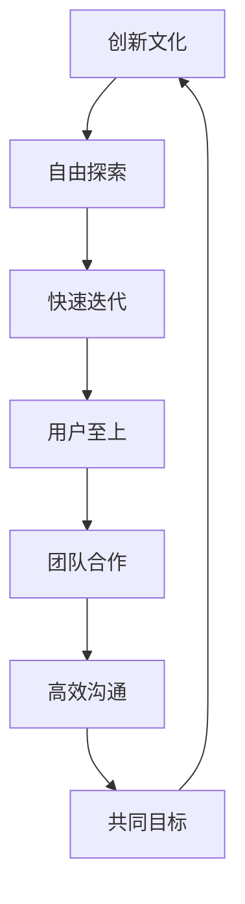
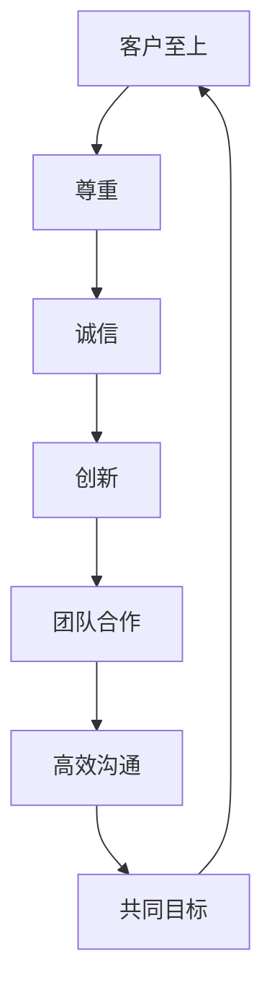

                 

### 文章标题：团队文化建设：塑造积极向上的工作环境

团队文化建设在现代企业中扮演着至关重要的角色。一个积极向上的工作环境不仅能够提升员工的工作满意度和生产力，还能促进团队协作和创新。本文将围绕团队文化建设这一主题，通过深入探讨其重要性、核心概念、实践方法以及持续发展策略，为企业和团队管理者提供有价值的指导。我们将逐步分析团队文化的各个层面，从构建共同价值观、建立有效沟通机制到激励与认可，最后探讨领导者在团队文化建设中的关键作用。希望通过本文，您能获得关于如何塑造积极向上的工作环境的深刻见解。

### 关键词

- 团队文化
- 共同价值观
- 沟通机制
- 激励与认可
- 领导者角色
- 工作环境
- 团队协作
- 创新能力

### 文章摘要

本文旨在探讨团队文化建设在塑造积极向上的工作环境中的重要作用。首先，我们介绍了团队文化的定义、构成要素及其作用和价值。接着，我们详细分析了积极向上的团队文化特点，并探讨了如何塑造这样的文化。文章随后从构建共同价值观、建立有效沟通机制、塑造积极工作氛围、激励与认可以及领导者的角色五个方面，提供了具体的实践方法。最后，通过案例分析和持续发展策略，总结了团队文化建设的成功经验和未来趋势。希望通过本文，能够为企业和团队管理者提供有价值的参考和指导。

## 第一部分：团队文化建设的重要性

### 第1章：团队文化概述

#### 1.1 什么是团队文化

团队文化是指团队内部共同形成的价值观、信仰、行为准则和工作方式的总和。它是团队精神的外在表现，是团队成员在长期合作中逐渐形成的一种共识。团队文化的核心在于价值观，它决定了团队成员如何看待工作、对待同事以及处理问题的方式。

#### 1.2 团队文化的构成要素

团队文化的构成要素主要包括以下几个方面：

1. **共同目标**：团队文化中最重要的要素之一是共同目标。一个团队如果缺乏共同的目标，成员之间将缺乏协作的动力，工作效率也会受到影响。

2. **价值观**：价值观是团队文化的基石，它决定了团队如何看待道德、伦理、责任和成就。

3. **行为准则**：行为准则是团队文化的具体体现，它规定了团队成员应该如何行动和互动。

4. **工作方式**：工作方式是团队文化的重要组成部分，它包括团队的决策过程、沟通方式以及问题解决方法。

#### 1.3 团队文化的作用和价值

团队文化在企业中扮演着至关重要的角色，它具有以下几个方面的作用和价值：

1. **增强团队凝聚力**：积极向上的团队文化能够增强团队成员之间的凝聚力，使团队更加团结一致，共同追求目标。

2. **提升工作效率**：良好的团队文化能够提高员工的工作效率和生产力。团队成员之间相互支持、协作，能够更快地完成任务。

3. **促进创新**：团队文化鼓励创新和尝试新方法，能够激发团队成员的创造力和创新能力，推动企业不断进步。

4. **提升员工满意度**：积极向上的工作环境能够提升员工的工作满意度和幸福感，减少员工流失率，为企业留住优秀人才。

5. **增强企业竞争力**：一个具有强大团队文化的企业，在市场竞争中会更加具有竞争力。团队成员的协作和创新能力，能够帮助企业应对各种挑战。

通过以上分析，我们可以看到团队文化在企业中的重要性。一个积极向上的团队文化不仅能够提升团队的整体表现，还能够为企业创造巨大的价值。因此，企业和团队管理者应该高度重视团队文化建设，通过有效的策略和方法，塑造出积极向上的团队文化。

### 第2章：积极向上的团队文化特点

#### 2.1 积极向上的团队文化的特征

积极向上的团队文化具有以下几个显著特征：

1. **共同目标**：积极向上的团队文化强调共同目标的重要性。团队成员在面对各种挑战时，能够团结一致，共同追求目标。共同目标为团队提供了前进的方向和动力。

2. **相互尊重**：在积极向上的团队文化中，团队成员之间相互尊重，彼此信任。这种尊重不仅体现在言语和行为上，更体现在对他人意见和贡献的认可。

3. **鼓励创新**：积极向上的团队文化鼓励创新和尝试新方法。团队成员敢于提出新的想法和解决方案，不断挑战现状，推动团队不断进步。

4. **透明沟通**：在积极向上的团队文化中，沟通是开放的、透明的。团队成员能够自由地表达自己的意见和想法，共同解决问题。

5. **积极态度**：积极向上的团队文化倡导积极的态度。团队成员在面对困难和挑战时，能够保持乐观和积极，以积极的心态去解决问题。

6. **共同成长**：积极向上的团队文化鼓励团队成员共同成长。团队管理者通过提供培训和学习机会，帮助团队成员提升个人能力和职业素养。

#### 2.2 塑造积极向上的团队文化的关键

要塑造积极向上的团队文化，需要从以下几个方面入手：

1. **建立共同价值观**：共同价值观是团队文化的基石。团队管理者需要明确团队的价值观，并将其传达给每个成员。通过共同的价值观，团队成员能够更好地理解团队的目标和使命，形成统一的行动方向。

2. **建立有效的沟通机制**：良好的沟通机制是塑造积极向上团队文化的重要保障。团队管理者需要建立开放的沟通渠道，鼓励团队成员自由表达意见和想法，促进团队成员之间的互动和协作。

3. **提供激励与认可**：激励与认可是激发团队成员积极性的关键。团队管理者需要通过适当的激励措施，如奖励、晋升和培训等，来激励团队成员努力工作，实现个人和团队的共同目标。

4. **塑造积极的工作氛围**：积极的工作氛围能够提升团队的整体士气。团队管理者需要关注团队成员的情绪变化，及时处理负面情绪和冲突，营造一个积极、健康的工作环境。

5. **发挥领导者的作用**：领导者是塑造团队文化的关键。团队领导者需要以身作则，树立榜样，通过自己的言行和决策，引领团队形成积极向上的文化。

通过以上关键措施，团队管理者能够逐步塑造出积极向上的团队文化，提升团队的整体表现和竞争力。

#### 2.3 塑造积极向上的团队文化的挑战

尽管塑造积极向上的团队文化对企业发展具有重要意义，但在实际操作中，团队管理者仍面临诸多挑战：

1. **团队成员差异**：团队成员来自不同的背景，拥有不同的价值观和期望。这可能导致团队内部存在分歧和冲突，影响团队文化的统一性和一致性。

2. **文化转变的难度**：企业文化一旦形成，就具有相对的稳定性。要转变文化，需要克服员工的惯性思维和既得利益，这往往需要较长的时间和大量的资源投入。

3. **外部环境的变化**：企业所处的外部环境不断变化，如市场变化、竞争压力等，这要求团队文化也要不断调整和适应。但快速适应外部环境的变化，并非易事。

4. **领导者的能力**：领导者的能力对团队文化建设起着至关重要的作用。如果领导者缺乏远见和执行力，团队文化建设将难以取得实质性进展。

5. **员工流动**：员工的高流动性可能会破坏团队文化的稳定性，导致文化断裂。新员工的融入和旧员工的离职，都会对团队文化产生冲击。

为了克服这些挑战，团队管理者需要采取一系列措施，如加强团队建设活动、提供培训和学习机会、建立有效的反馈机制等。通过这些措施，团队管理者能够逐步解决团队文化建设中遇到的问题，确保团队文化的持续发展和提升。

## 第二部分：团队文化建设的方法与实践

### 第3章：构建共同价值观

#### 3.1 确定共同价值观的重要性

共同价值观是团队文化的基石，它是团队成员共同遵循的原则和信仰，决定了团队的行为方式和工作风格。确定共同价值观的重要性体现在以下几个方面：

1. **统一团队成员的目标和行动**：共同价值观能够帮助团队成员明确团队的目标和方向，使他们在工作中保持一致的行动和努力。

2. **增强团队凝聚力**：共同价值观有助于增强团队成员之间的认同感和归属感，从而提升团队的凝聚力。

3. **提高决策效率**：共同价值观为团队提供了统一的决策框架和标准，使团队成员在面临决策时能够快速达成共识，提高决策效率。

4. **塑造积极的工作氛围**：共同价值观能够营造一个积极向上的工作氛围，激发团队成员的积极性和创造力，促进团队的整体发展。

#### 3.2 确定共同价值观的步骤

要确定共同价值观，团队管理者需要遵循以下步骤：

1. **内部讨论**：首先，团队管理者应组织团队成员进行内部讨论，了解每个人的价值观和期望。通过讨论，团队成员可以相互了解，找到共同点。

2. **收集反馈**：在内部讨论的基础上，团队管理者可以收集团队成员的反馈，包括他们对团队价值观的看法和建议。这些反馈可以帮助团队管理者更全面地了解团队成员的需求和期望。

3. **提炼核心价值观**：根据内部讨论和反馈，团队管理者应提炼出核心的价值观。这些核心价值观应具有普遍性和可操作性，能够为团队成员提供明确的行为指南。

4. **沟通和传达**：确定核心价值观后，团队管理者需要通过内部会议、公告板、邮件等方式，将核心价值观传达给每个团队成员，确保他们理解和认同这些价值观。

5. **实施和监督**：在核心价值观得到团队成员的认同后，团队管理者需要将它们融入到日常工作中，并通过定期的监督和反馈，确保这些价值观得到有效执行。

#### 3.3 共同价值观的传达和落实

传达和落实共同价值观是团队文化建设的关键环节。以下是一些具体的方法：

1. **领导者的示范作用**：团队领导者应通过自己的言行示范，展示共同价值观的重要性。他们的行为将直接影响团队成员对价值观的认同和执行。

2. **培训和学习**：定期组织培训和学习活动，帮助团队成员深入理解和掌握共同价值观。这些活动可以是内部分享会、外部研讨会或在线课程等。

3. **绩效考核**：将共同价值观纳入绩效考核体系，通过绩效指标来衡量团队成员对价值观的执行情况。这可以激励团队成员更加重视共同价值观的落实。

4. **激励与认可**：对在共同价值观落实过程中表现出色的团队成员给予激励和认可，如颁发奖项、晋升机会等。这可以增强团队成员对共同价值观的认同感和归属感。

通过以上措施，团队管理者可以确保共同价值观得到有效传达和落实，从而塑造一个积极向上的团队文化。

### 第4章：建立有效的沟通机制

#### 4.1 沟通在团队文化中的重要性

沟通是团队文化的重要组成部分，它直接影响团队的工作效率和成员之间的互动。有效的沟通机制能够确保信息的准确传递、问题的及时解决和团队目标的共同达成。以下是沟通在团队文化中的重要性的具体体现：

1. **增强协作能力**：良好的沟通机制能够促进团队成员之间的协作，使每个人都能清楚地了解自己的角色和责任，从而提高团队的整体效率。

2. **提高决策质量**：通过有效的沟通，团队成员能够分享各自的见解和建议，从而在决策过程中获得更多的信息和视角，提高决策的质量和准确性。

3. **增强团队凝聚力**：频繁而透明的沟通有助于增强团队成员之间的信任和归属感，提高团队的凝聚力。

4. **减少误解和冲突**：有效的沟通可以减少误解和冲突，使团队成员在遇到问题时能够及时沟通和解决，避免矛盾升级。

#### 4.2 建立有效的沟通机制的策略

要建立有效的沟通机制，团队管理者需要采取一系列策略，以下是一些具体的建议：

1. **明确沟通目标**：在建立沟通机制之初，团队管理者应明确沟通的目标和内容。这包括沟通的具体目的、所需信息以及预期的结果。

2. **建立多样化的沟通渠道**：为了确保信息的全面传递，团队管理者应建立多样化的沟通渠道，如面对面会议、电子邮件、即时通讯工具和在线论坛等。

3. **设定沟通频率**：根据团队的工作内容和需求，设定合理的沟通频率。例如，每周举行一次团队会议，每日进行一次简短的站会等。

4. **鼓励双向沟通**：在沟通过程中，应鼓励团队成员进行双向沟通，即不仅传达信息，还要倾听反馈。这有助于团队成员之间的理解和互动。

5. **提供反馈机制**：建立有效的反馈机制，使团队成员能够对沟通效果进行评估和反馈。这可以帮助团队管理者不断优化沟通机制，提高沟通效率。

6. **培养沟通能力**：定期组织沟通培训，帮助团队成员提高沟通技巧，包括如何表达自己的观点、如何倾听他人的意见等。

#### 4.3 沟通机制的实践案例

以下是一个关于沟通机制实践案例的详细描述：

**案例：某科技公司团队沟通机制的建立**

1. **明确沟通目标**：该科技公司的团队沟通目标是确保项目进展的透明性，提高团队成员之间的协作效率。

2. **建立多样化的沟通渠道**：公司建立了以下沟通渠道：
   - **面对面会议**：每周五下午举行一次项目进展会议，团队成员面对面讨论项目问题。
   - **电子邮件**：用于日常的沟通和项目文档的发送。
   - **即时通讯工具**：如Slack，用于实时沟通和问题解决。
   - **在线论坛**：用于发布项目公告、共享资源和讨论技术问题。

3. **设定沟通频率**：团队会议每周一次，即时通讯工具每日早晚各一次简短站会。

4. **鼓励双向沟通**：在会议中，鼓励团队成员积极发言，提出问题和建议。同时，领导者在会议中也注重倾听成员的意见。

5. **提供反馈机制**：团队成员可以在每次会议结束后填写反馈表，对沟通效果进行评价。团队管理者根据反馈表的内容，不断优化沟通机制。

通过以上措施，该科技公司的团队沟通机制得到了显著改善。团队成员之间的协作更加顺畅，项目进展更加透明，团队的凝聚力也得到了提升。

### 第5章：塑造积极的工作氛围

#### 5.1 营造积极工作氛围的关键

营造积极的工作氛围对于提升团队的生产力和幸福感至关重要。以下是一些关键要素，有助于塑造积极的工作氛围：

1. **公平和透明**：确保团队成员在工作中享有公平的机会和待遇，能够感受到公正。透明的工作流程和信息传递也有助于减少猜疑和误解。

2. **尊重和认可**：尊重团队成员的意见和贡献，及时给予认可和奖励，能够激发团队成员的积极性和创造力。

3. **激励和目标设定**：通过设定明确的个人和团队目标，提供适当的激励措施，如奖励和晋升机会，能够激发团队成员的工作动力。

4. **支持和帮助**：提供必要的支持和帮助，包括技能培训、心理支持和团队协作，有助于团队成员克服困难，提升工作满意度。

5. **开放的沟通**：鼓励团队成员自由表达意见和建议，建立开放的沟通渠道，确保问题能够及时反馈和解决。

6. **健康的工作环境**：创造一个健康的工作环境，包括舒适的工作空间、良好的办公设施和健康的工作节奏，能够提升员工的工作满意度和生产力。

#### 5.2 处理负面情绪和冲突的策略

在团队中，负面情绪和冲突是不可避免的。以下是一些策略，有助于处理这些负面情绪和冲突：

1. **倾听和理解**：当团队成员出现负面情绪或冲突时，领导者需要耐心倾听，理解其背后的原因和需求，避免简单化处理。

2. **冷静分析**：在处理冲突时，领导者需要保持冷静，避免情绪化的反应，通过客观分析找到问题的根本原因。

3. **中立调解**：在冲突双方中保持中立，帮助双方找到共同点和解决方案，避免偏袒一方。

4. **积极沟通**：通过积极沟通，帮助团队成员表达自己的观点和感受，找到解决问题的方法。

5. **提供心理支持**：对于严重的负面情绪和冲突，可以提供专业的心理支持，帮助团队成员缓解情绪，恢复心理健康。

#### 5.3 积极工作氛围的实践案例

以下是一个积极工作氛围实践案例的详细描述：

**案例：某创业公司团队氛围建设**

1. **公平和透明**：公司建立了一套透明的绩效考核体系，确保团队成员的绩效评估和奖励分配公正、透明。

2. **尊重和认可**：公司定期举行团队会议，鼓励团队成员分享自己的工作和心得，及时表扬和奖励那些表现出色的团队成员。

3. **激励和目标设定**：公司为每个团队成员设定了明确的个人和团队目标，并提供各种培训和学习机会，帮助团队成员不断提升技能和职业素养。

4. **支持和帮助**：公司设有内部知识库和技能交流平台，团队成员可以在这里分享经验和学习资源，互相支持和帮助。

5. **健康的工作环境**：公司提供了舒适的工作空间，配备了先进的办公设施，并鼓励员工合理安排工作和休息时间，保持身心健康。

6. **开放沟通**：公司建立了开放的沟通渠道，如定期团队会议、内部邮件和即时通讯工具，鼓励团队成员自由表达意见和建议。

通过以上措施，该创业公司成功地营造了一个积极向上的工作氛围，团队成员的工作满意度和生产力显著提升，公司业绩也实现了快速增长。

### 第6章：激励与认可

#### 6.1 激励在团队文化中的作用

激励是团队文化中至关重要的一环，它直接影响团队成员的工作动力、创新能力和团队凝聚力。以下是激励在团队文化中的几个关键作用：

1. **提升工作效率**：适当的激励措施能够激发团队成员的工作积极性，提高工作效率和生产力。

2. **促进创新**：激励鼓励团队成员勇于尝试新方法、提出新想法，从而推动团队创新和进步。

3. **增强团队凝聚力**：通过激励和认可，团队成员感受到自己的价值和贡献，增强对团队的归属感和凝聚力。

4. **提升员工满意度**：激励措施能够提高员工的工作满意度和幸福感，减少员工流失率，为企业留住优秀人才。

5. **促进个人成长**：激励不仅是对当前表现的认可，更是对团队成员未来发展的激励，有助于提升个人能力和职业素养。

#### 6.2 不同类型的激励方式

激励方式可以分为物质激励和精神激励两大类，每种激励方式都有其独特的优势和应用场景：

1. **物质激励**：
   - **奖金和提成**：通过绩效奖金和提成奖励，激励团队成员提高工作绩效。
   - **福利和补贴**：提供良好的福利待遇，如医疗保险、住房补贴等，提升员工的生活质量。
   - **晋升和职位提升**：通过晋升机制，为表现优秀的员工提供职业发展机会。

2. **精神激励**：
   - **认可和表扬**：及时给予认可和表扬，提升团队成员的自豪感和成就感。
   - **培训和成长机会**：提供培训和学习机会，帮助团队成员提升技能和职业素养。
   - **参与决策**：鼓励团队成员参与团队的决策过程，增强其责任感和归属感。

#### 6.3 激励与认可的实践案例

以下是一个激励与认可实践案例的详细描述：

**案例：某互联网公司激励与认可机制**

1. **绩效奖金和提成**：公司设立绩效奖金和提成机制，根据团队成员的绩效和工作表现发放奖金，激励团队成员努力工作。

2. **福利和补贴**：公司提供全面的福利待遇，包括医疗保险、住房补贴、员工旅游等，提升员工的生活质量和满意度。

3. **晋升和职业发展**：公司设有明确的晋升路径，为表现优秀的员工提供晋升机会，激励团队成员不断提升自己。

4. **认可和表扬**：公司定期举行表彰大会，对表现优秀的团队成员进行公开表扬和奖励，提升团队成员的自豪感和成就感。

5. **培训和成长机会**：公司提供多种培训和学习机会，包括内部培训、外部课程和在线学习平台，帮助团队成员提升技能和职业素养。

通过这些激励与认可措施，该公司成功地提高了员工的工作动力和满意度，团队的整体表现也得到了显著提升。

### 第7章：领导者的角色

#### 7.1 领导者对团队文化的影响

领导者在团队文化建设中扮演着至关重要的角色。他们的行为、决策和价值观直接影响团队文化的形成和发展。以下是领导者对团队文化影响的几个方面：

1. **价值观的传递**：领导者通过自己的言行传递团队的价值观，成为团队成员的行为榜样。他们的价值观和行为方式决定了团队的文化基调。

2. **决策风格**：领导者的决策风格影响团队的工作流程和决策机制。开放、透明和民主的决策风格有助于塑造积极的团队文化。

3. **激励与认可**：领导者通过激励和认可措施激发团队成员的积极性，影响团队的整体士气和工作氛围。

4. **问题处理方式**：领导者处理问题的方式和态度影响团队成员对问题的看法和处理方式。积极、包容和解决问题的态度有助于塑造积极向上的团队文化。

5. **团队建设**：领导者通过组织团队建设活动，增强团队成员之间的信任和协作，提升团队的凝聚力。

#### 7.2 塑造积极向上团队文化的领导力特质

要塑造积极向上的团队文化，领导者需要具备以下几方面的领导力特质：

1. **远见和愿景**：领导者需要具有清晰的远见和愿景，明确团队的目标和方向，为团队提供前进的动力。

2. **沟通能力**：领导者需要具备出色的沟通能力，能够清晰、有效地传达信息和激励团队成员。

3. **同理心**：领导者需要具备同理心，能够理解团队成员的需求和感受，帮助他们克服困难，提升工作满意度。

4. **决策能力**：领导者需要具备果断的决策能力，能够在面对挑战和问题时做出明智的决策，为团队树立榜样。

5. **变革推动者**：领导者需要具备推动变革的能力，能够引领团队适应变化，不断创新和进步。

#### 7.3 领导者的实践案例

以下是一个领导者在团队文化建设中的实践案例：

**案例：某科技公司CEO的领导力实践**

1. **明确愿景和目标**：公司CEO明确了公司的愿景和目标，即成为行业领导者，为用户提供卓越的产品和服务。他通过内部会议和邮件，向全体员工传达这一愿景，激励他们为之努力。

2. **沟通和激励**：CEO定期组织团队会议，与员工面对面交流，了解他们的工作进展和需求。他在会议中分享公司的战略和计划，鼓励员工提出建议和意见。通过公开表扬和奖励，他激励员工努力工作，提升团队士气。

3. **同理心和支持**：CEO关心员工的工作和生活，了解他们的需求，提供必要的支持和帮助。他组织了员工家庭日和团队建设活动，增强员工之间的信任和协作。

4. **果断决策**：在面对市场变化和竞争压力时，CEO能够果断决策，采取有效措施应对挑战。他的果断决策为公司赢得了市场机会，提升了公司的竞争力。

5. **推动变革和创新**：CEO鼓励员工尝试新方法，推动公司进行技术创新和业务模式变革。他组织了创新工作坊和头脑风暴会议，激发员工的创新思维，推动公司不断进步。

通过这些领导力实践，该公司的团队文化逐渐形成，员工的工作满意度和生产力显著提升，公司业绩也实现了快速增长。

### 第8章：团队文化建设案例分析

#### 8.1 成功的团队文化建设案例

在探讨团队文化建设的实践中，以下两个企业提供了成功的典范，它们通过精心设计和持续的努力，塑造出了积极向上的团队文化，显著提升了团队绩效和企业竞争力。

#### **案例一：谷歌（Google）的“创新文化”**

**背景介绍**：
谷歌作为全球知名的高科技公司，以其独特的创新文化而著称。谷歌的创始人拉里·佩奇和谢尔盖·布林非常注重团队文化的建设，特别是在鼓励创新和自由探索方面。

**核心概念与联系**：
谷歌的核心价值观包括“不作恶”（Don’t Be Evil）、创新、快速迭代、用户至上等。这些价值观不仅指导着公司的运营，也成为团队文化的重要组成部分。

**Mermaid流程图**：

**核心算法原理讲解**：
谷歌通过以下几个核心算法原理来塑造其团队文化：
1. **透明度算法**：谷歌鼓励员工分享信息，保持工作透明。通过内部博客、邮件和面对面交流，员工能够及时了解公司动态和项目进展。
2. **推荐系统算法**：谷歌的推荐系统算法用于发现和推荐优秀项目。这种算法不仅适用于产品推荐，也用于人才推荐，帮助优秀员工得到更多的机会。
3. **PageRank算法**：谷歌的PageRank算法用于评估网页的重要性。这一算法也被应用到团队内部，通过评估员工在项目中的贡献和影响力，给予相应的奖励和认可。

**数学模型和公式 & 详细讲解 & 举例说明**：
为了确保创新文化的持续发展，谷歌采用了一个数学模型来评估员工的工作表现：
$$ \text{绩效评分} = f(\text{项目成果}, \text{团队合作}, \text{创新思维}) $$
举例：一名员工在项目A中取得了显著的成果，同时在团队B中表现出色，并且提出了多个创新点，那么他的绩效评分将会非常高。

**项目实战**：
- **开发环境搭建**：谷歌为员工提供了先进的开发工具和资源，支持他们在不同的项目中自由探索和实验。
- **源代码详细实现和代码解读**：谷歌鼓励开源，员工可以自由访问和学习其他项目的源代码，从而提升自己的编程技能。
- **代码应用解读与分析**：通过代码审查和分享会，员工可以共同分析代码中的优秀实践和问题，促进知识的共享和提升。
- **实际案例分析和详细讲解剖析**：谷歌定期举办内部研讨会，邀请员工分享他们的成功经验和创新思路，这些案例成为其他员工学习和借鉴的宝贵资源。
- **项目小结**：通过这些措施，谷歌成功培养了一批具有创新精神和团队协作能力的优秀员工，公司也因此保持了持续的创新能力和市场竞争力。

**最佳实践 tips**：
- **建立明确的价值观**：谷歌通过明确的价值观和愿景，确保员工在工作和创新中有共同的目标和方向。
- **鼓励自由探索**：谷歌为员工提供了广泛的自由探索空间，让他们在项目中自由发挥创意。
- **持续反馈和改进**：通过定期的评估和反馈，谷歌不断改进团队文化，确保其始终适应公司的发展需求。

#### **案例二：IBM的“客户至上”文化**

**背景介绍**：
IBM（国际商业机器公司）是一家拥有百年历史的大型科技公司，其“客户至上”的文化是其成功的关键因素之一。

**核心概念与联系**：
IBM的核心价值观包括尊重、诚信、创新和客户至上。这些价值观贯穿于公司的各个层面，成为团队文化的核心。

**Mermaid流程图**：

**核心算法原理讲解**：
IBM通过以下核心算法原理来塑造其团队文化：
1. **客户反馈系统**：IBM建立了完善的客户反馈系统，及时收集和分析客户的需求和反馈，确保产品和服务始终符合客户期望。
2. **项目评估模型**：IBM采用项目评估模型，通过关键绩效指标（KPI）来评估项目的成功程度，确保项目目标的实现。
3. **团队合作算法**：IBM鼓励团队合作，通过项目任务分解和角色分配，确保每个团队成员都能发挥最大的作用。

**数学模型和公式 & 详细讲解 & 举例说明**：
IBM采用了一个数学模型来评估团队的文化绩效：
$$ \text{文化绩效评分} = f(\text{客户满意度}, \text{团队合作}, \text{创新成果}) $$
举例：如果一个团队在项目A中实现了高客户满意度，同时团队成员之间合作紧密，提出了多个创新点，那么这个团队的文化绩效评分将会很高。

**项目实战**：
- **开发环境搭建**：IBM为员工提供了丰富的工具和资源，支持他们开发和实施客户解决方案。
- **源代码详细实现和代码解读**：IBM鼓励员工编写高质量的代码，并通过代码审查和分享会，提升团队的整体编程水平。
- **代码应用解读与分析**：IBM定期进行代码分析和审查，确保代码的质量和安全性。
- **实际案例分析和详细讲解剖析**：IBM通过案例分析会，分享成功案例和经验教训，帮助员工提升项目实施能力。
- **项目小结**：通过这些措施，IBM成功培养了一批具有卓越客户服务能力和团队合作精神的员工，公司也因此获得了客户的信任和市场的领先地位。

**最佳实践 tips**：
- **重视客户反馈**：IBM通过客户反馈系统，确保产品和服务始终符合客户需求，提升客户满意度。
- **强调团队合作**：IBM鼓励团队合作，通过明确的角色分配和任务分解，提升团队协作效率。
- **持续学习和创新**：IBM通过定期的培训和研讨会，帮助员工不断提升技能和创新能力，保持公司的竞争力。

通过这两个成功案例，我们可以看到，团队文化建设不仅需要明确的价值观和策略，还需要持续的努力和实践。只有通过不断的改进和优化，团队文化才能持续发展，为企业带来长期的竞争优势。

#### 8.2 团队文化建设的挑战与应对策略

尽管团队文化建设对企业和团队的发展具有重要意义，但在实际操作过程中，企业和团队管理者仍然面临诸多挑战。以下是团队文化建设中常见的挑战及其应对策略：

1. **文化转变的难度**：
   - **挑战**：企业文化一旦形成，就具有相对的稳定性。要改变现有的文化，需要克服员工的惯性思维和既得利益。
   - **应对策略**：首先，团队管理者应明确新的文化目标，并通过内部讨论和培训，逐步引导员工理解和接受新的文化。其次，通过领导者的示范作用，树立新文化的榜样，增强员工对新文化的认同感。最后，通过定期的反馈和评估，不断调整和完善新文化，确保其得到有效落实。

2. **团队成员差异**：
   - **挑战**：团队成员来自不同的背景，拥有不同的价值观和期望，这可能导致团队内部存在分歧和冲突。
   - **应对策略**：首先，团队管理者应通过内部讨论和沟通，了解团队成员的价值观和期望，寻找共同点。其次，通过建立多样化的沟通渠道，鼓励团队成员表达自己的意见和想法，促进团队成员之间的理解和互动。最后，通过定期的团队建设活动，增强团队成员之间的信任和凝聚力。

3. **外部环境的变化**：
   - **挑战**：企业所处的外部环境不断变化，如市场变化、竞争压力等，这要求团队文化也要不断调整和适应。
   - **应对策略**：首先，团队管理者应保持对外部环境的敏锐感知，及时调整团队目标和策略。其次，通过定期的培训和研讨会，帮助团队成员了解外部环境的变化，提升他们的适应能力。最后，通过灵活的沟通机制和快速响应机制，确保团队能够迅速适应外部环境的变化。

4. **领导者的能力**：
   - **挑战**：领导者的能力对团队文化建设起着至关重要的作用。如果领导者缺乏远见和执行力，团队文化建设将难以取得实质性进展。
   - **应对策略**：首先，企业应重视领导者的选拔和培养，选择具有领导潜力和文化敏感性的领导者。其次，通过定期的培训和领导力发展项目，提升领导者的领导能力和文化塑造能力。最后，建立有效的反馈机制，使领导者能够及时了解团队文化和员工的需求，不断调整和优化领导方式。

5. **员工流动**：
   - **挑战**：员工的高流动性可能会破坏团队文化的稳定性，导致文化断裂。
   - **应对策略**：首先，企业应通过职业发展规划和激励措施，提高员工的稳定性和忠诚度。其次，通过新员工入职培训和团队文化建设活动，帮助新员工快速融入团队文化。最后，通过建立有效的团队文化传承机制，确保新员工能够继承和发扬团队文化。

通过以上应对策略，企业和团队管理者可以克服团队文化建设中遇到的挑战，确保团队文化的持续发展和提升。

#### 8.3 团队文化建设的前景与趋势

随着全球化、技术进步和市场竞争的加剧，团队文化建设的前景和趋势也在不断演变。以下是一些值得关注的趋势：

1. **个性化与多元化**：随着团队成员背景和价值观的多元化，团队文化也在向个性化和多元化方向发展。企业和团队管理者需要更加关注个性化需求，尊重团队成员的独特性和多样性。

2. **数字化与智能化**：数字化和智能化技术的广泛应用，为团队文化建设提供了新的工具和方法。例如，通过大数据分析和人工智能技术，可以更精准地了解团队成员的需求和行为，优化团队文化策略。

3. **持续性与灵活性**：团队文化建设不再是短期目标，而是需要持续关注和优化的长期过程。同时，随着外部环境的不断变化，团队文化也需要具备灵活性和适应性，以应对快速变化的市场需求。

4. **领导力的进化**：未来，领导者的角色将更加注重文化引领和价值观塑造。领导者需要具备更强的跨文化沟通能力、创新思维和适应性，以引领团队实现持续发展。

5. **员工参与与共治**：随着员工对工作环境和工作方式的期望不断提高，员工参与和共治将成为团队文化建设的重要趋势。通过鼓励员工参与决策和管理，可以增强员工的归属感和责任感，提升团队的整体绩效。

通过关注这些趋势，企业和团队管理者可以更好地把握团队文化建设的前景，制定符合时代发展的文化策略。

### 第9章：团队文化的评估与改进

#### 9.1 团队文化评估的方法

团队文化评估是确保团队文化持续发展和优化的重要步骤。以下是一些常用的团队文化评估方法：

1. **问卷调查**：通过设计问卷，收集团队成员对团队文化的看法和建议。问卷可以包括多个维度，如价值观认同、工作氛围、沟通效果等。

2. **焦点小组讨论**：组织焦点小组讨论，邀请不同层级的员工参与，深入探讨团队文化的问题和改进方向。

3. **员工满意度调查**：定期进行员工满意度调查，了解员工对团队文化的满意度和不满意度，识别存在的问题。

4. **360度反馈**：通过360度反馈机制，收集团队成员对领导者和团队文化的评价，提供全面、客观的反馈。

5. **关键绩效指标（KPI）**：通过设定关键绩效指标，评估团队文化的实际效果，如生产力、创新成果、员工流失率等。

#### 9.2 团队文化改进的策略

基于文化评估的结果，团队管理者需要制定具体的改进策略，以下是一些建议：

1. **目标明确**：明确团队文化的改进目标和方向，确保改进措施有针对性和可执行性。

2. **培训与发展**：提供培训和学习机会，帮助团队成员提升文化认知和执行能力。

3. **沟通与反馈**：建立有效的沟通渠道，确保团队成员对文化改进措施的了解和参与，及时收集反馈，优化改进方案。

4. **领导示范**：领导者应通过自己的言行示范，推动文化改进，树立榜样。

5. **激励与认可**：通过激励和认可措施，鼓励团队成员积极参与文化改进，提升文化执行力度。

6. **持续评估**：定期评估文化改进效果，根据评估结果进行调整和优化，确保文化改进的持续性。

#### 9.3 团队文化评估与改进的实践案例

以下是一个团队文化评估与改进的实践案例：

**案例：某高科技公司团队文化改进实践**

1. **背景介绍**：
   该高科技公司近年来面临激烈的市场竞争，团队文化出现了一些问题，如沟通不畅、员工满意度下降等。公司决定通过文化评估和改进，提升团队的整体绩效。

2. **文化评估方法**：
   - **问卷调查**：设计了一份包含20个问题的问卷调查，涵盖价值观认同、沟通效果、工作氛围等多个维度，收集了100名员工的反馈。
   - **焦点小组讨论**：组织了4个焦点小组，邀请不同层级的员工参与，深入探讨团队文化的问题和改进方向。
   - **员工满意度调查**：定期进行了员工满意度调查，了解员工对团队文化的满意度和不满意度。
   - **360度反馈**：通过360度反馈机制，收集了团队成员对领导者和团队文化的评价。

3. **文化评估结果**：
   评估结果显示，团队在价值观认同、沟通效果和员工满意度方面存在一定问题。具体表现为：
   - 价值观认同度较低，团队成员对共同价值观的理解和认同不够。
   - 沟通效果不佳，团队成员之间存在信息不对称和误解。
   - 员工满意度下降，主要原因是工作压力和缺乏职业发展机会。

4. **改进策略**：
   - **明确改进目标**：公司制定了明确的改进目标，包括提升价值观认同度、改善沟通效果和提升员工满意度。
   - **培训与发展**：公司提供了一系列培训和学习机会，帮助团队成员提升文化认知和执行能力。
   - **沟通与反馈**：公司建立了内部沟通平台，鼓励团队成员表达意见和建议，及时收集反馈，优化改进方案。
   - **领导示范**：公司领导层通过公开演讲和示范行动，推动文化改进，树立榜样。
   - **激励与认可**：公司通过激励和认可措施，鼓励团队成员积极参与文化改进，提升文化执行力度。

5. **文化改进效果**：
   经过一年的文化改进，公司的团队文化得到了显著提升。具体表现为：
   - 价值观认同度显著提高，团队成员对共同价值观的理解和认同更加深入。
   - 沟通效果得到改善，团队成员之间的信息传递更加顺畅，误解和冲突减少。
   - 员工满意度显著提升，员工的工作压力减轻，职业发展机会增加。

通过这个实践案例，我们可以看到，有效的团队文化评估和改进措施能够显著提升团队的整体绩效和员工满意度。企业和团队管理者应重视团队文化评估和改进，通过持续的努力和优化，打造一个积极向上的工作环境。

### 第10章：团队文化的可持续发展

#### 10.1 团队文化发展的趋势

随着全球化、技术进步和市场竞争的加剧，团队文化的发展也呈现出一些新的趋势。以下是当前团队文化发展的几个主要趋势：

1. **个性化与多元化**：随着团队成员背景和价值观的多元化，团队文化也在向个性化和多元化方向发展。企业和团队管理者需要更加关注个性化需求，尊重团队成员的独特性和多样性。

2. **数字化与智能化**：数字化和智能化技术的广泛应用，为团队文化建设提供了新的工具和方法。例如，通过大数据分析和人工智能技术，可以更精准地了解团队成员的需求和行为，优化团队文化策略。

3. **持续性与灵活性**：团队文化建设不再是短期目标，而是需要持续关注和优化的长期过程。同时，随着外部环境的不断变化，团队文化也需要具备灵活性和适应性，以应对快速变化的市场需求。

4. **员工参与与共治**：随着员工对工作环境和工作方式的期望不断提高，员工参与和共治将成为团队文化建设的重要趋势。通过鼓励员工参与决策和管理，可以增强员工的归属感和责任感，提升团队的整体绩效。

5. **领导力的进化**：未来，领导者的角色将更加注重文化引领和价值观塑造。领导者需要具备更强的跨文化沟通能力、创新思维和适应性，以引领团队实现持续发展。

#### 10.2 团队文化的持续发展策略

为了确保团队文化能够持续发展，企业和团队管理者需要采取一系列策略。以下是一些关键策略：

1. **明确文化愿景**：首先，团队管理者需要明确团队文化的愿景和目标，确保团队成员对文化发展方向有共同的理解和认同。

2. **持续评估与优化**：定期对团队文化进行评估，识别存在的问题和改进机会。通过持续优化，确保团队文化始终与企业发展需求保持一致。

3. **强化领导者作用**：领导者是团队文化的核心推动者，他们需要以身作则，展示文化价值观，并确保文化策略得到有效执行。

4. **员工参与与共治**：鼓励员工参与文化建设和决策过程，提升他们的文化认同感和责任感。通过员工参与，可以激发创新思维，促进团队文化的持续发展。

5. **培训和宣传**：定期进行文化培训和宣传，帮助团队成员理解和掌握文化价值观，确保文化理念的深入人心。

6. **激励机制**：通过激励机制，如奖励、晋升和培训等，鼓励团队成员积极参与文化建设和执行，提升文化执行的力度和效果。

#### 10.3 团队文化持续发展的实践案例

以下是一个团队文化持续发展的实践案例：

**案例：某互联网公司文化持续发展实践**

1. **背景介绍**：
   该互联网公司自成立以来，一直注重团队文化建设。在快速发展过程中，公司逐步形成了以“用户至上、创新驱动、团队合作”为核心的团队文化。为了确保文化持续发展，公司采取了一系列措施。

2. **持续评估与优化**：
   - **年度文化评估**：公司每年进行一次全面的文化评估，通过问卷调查、员工访谈和360度反馈等方式，了解团队成员对文化现状的满意度和建议。
   - **定期文化研讨会**：公司定期组织文化研讨会，邀请员工和管理层共同讨论文化问题，制定改进方案。

3. **强化领导者作用**：
   - **文化宣讲**：公司领导层定期进行文化宣讲，向员工传达文化愿景和价值观，强调文化对企业发展的重要性。
   - **领导示范**：领导层以身作则，通过自己的言行展示文化价值观，成为员工学习的榜样。

4. **员工参与与共治**：
   - **员工提案**：公司鼓励员工提出文化改进建议，通过内部平台进行投票和讨论，选出最受认可的提案。
   - **员工委员会**：公司设立了员工委员会，负责监督和推动文化建设的实施，确保员工的参与和共治。

5. **培训和宣传**：
   - **文化培训**：公司定期组织文化培训，帮助员工理解和掌握文化价值观，提升文化执行能力。
   - **内部宣传**：公司通过内部邮件、公告板和社交媒体平台，宣传文化理念和成功案例，营造积极的文化氛围。

6. **激励机制**：
   - **文化奖励**：公司设立了文化奖励机制，对在文化建设中表现突出的员工给予奖励，激励他们积极参与文化建设和执行。

通过这些措施，该互联网公司的团队文化得到了持续发展，员工的文化认同感和满意度显著提升，公司也因此在市场竞争中取得了优势。

### 总结

通过本文的深入探讨，我们全面了解了团队文化建设在塑造积极向上工作环境中的关键作用。从构建共同价值观、建立有效沟通机制、塑造积极工作氛围、激励与认可，到领导者的角色，以及团队文化建设的评估与改进，我们分析了各个方面的具体实践方法和策略。同时，通过成功案例的实践分享，我们看到了团队文化建设的重要成果和持续发展的重要性。未来，随着个性化、数字化和智能化的不断推进，团队文化建设将迎来新的机遇和挑战。企业和团队管理者应持续关注团队文化建设，不断优化和调整策略，确保团队文化能够适应外部环境的变化，为企业发展提供强有力的支撑。

### 作者信息

作者：AI天才研究院/AI Genius Institute & 禅与计算机程序设计艺术 /Zen And The Art of Computer Programming。本文旨在分享团队文化建设的最佳实践，帮助企业和团队管理者塑造积极向上的工作环境，提升团队绩效和竞争力。如需进一步探讨团队文化建设的相关问题，欢迎联系作者，期待与您共同交流与成长。

