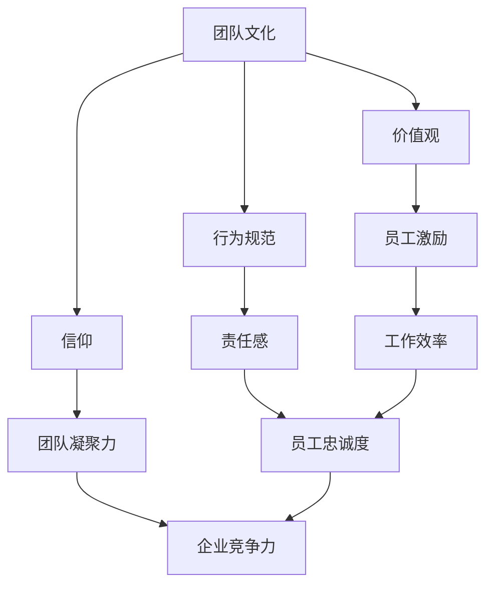

                 


## 文章标题：团队文化建设：塑造积极向上的氛围

### 关键词
- 团队文化
- 激励机制
- 责任感
- 效率提升
- 沟通技巧
- 信任与协作

### 摘要
本文深入探讨了团队文化建设的核心要素，包括激励机制、责任感、沟通技巧、信任与协作，以及如何通过有效策略塑造积极向上的工作氛围。通过实际案例分析和最佳实践，本文提供了实用的团队文化建设方法，旨在帮助企业和组织提升团队效能。

## 第一部分：引言

### 1.1 团队文化建设的背景与重要性

#### 背景介绍
- **团队文化的定义**：团队文化是指团队成员共同遵守的行为规范、价值观和信仰，它体现在团队的日常运作和互动中。
- **团队文化建设的重要性**：团队文化是组织成功的关键因素，它能够促进团队成员的凝聚力、提高工作效率、降低员工流失率，并为企业创造持续的竞争优势。

#### 核心概念与联系



### 1.2 团队文化的核心概念与内涵

#### 核心概念
- **价值观**：团队共同认同的价值观是团队文化的基石，它影响着团队成员的行为和决策。
- **行为规范**：行为规范是指团队成员应该遵循的行为准则，它是团队文化的外在表现。
- **信仰**：信仰是团队成员内心的坚定信念，它指导团队成员在面对困难和挑战时保持一致的行动方向。

## 第二部分：理论基础

### 2.1 团队文化建设的理论基础

#### 心理学在团队文化建设中的应用

- **激励理论**：激励理论揭示了人的需求与行为之间的联系，可以帮助团队领导者了解如何通过激励机制来激发团队成员的积极性。
- **责任感理论**：责任感理论认为，团队成员对工作的责任感是提高工作质量和效率的关键。

### 2.2 核心算法原理讲解

```python
# 伪代码：团队文化建设的关键步骤
Function BuildTeamCulture(team):
    Set vision = DefineVision(team)
    Set values = DefineValues(team)
    Set norms = DefineBehaviors(team)
    Set beliefs = DefineBeliefs(team)
    For each member in team:
       激励成员 = MotivateMember(member, values)
        资任感培养 = FosterResponsibility(member, norms)
    EndFor
    Set culture = Combine(vision, values, norms, beliefs)
    Return culture
```

### 2.3 数学模型和数学公式

#### 团队文化评估模型

$$
\text{团队文化指数} = \alpha \times \text{价值观认同度} + \beta \times \text{行为规范化程度} + \gamma \times \text{信仰一致性}
$$

- $\alpha$、$\beta$、$\gamma$ 为权重系数，可根据实际情况调整。

## 第三部分：实施策略

### 3.1 文化诊断

#### 文化诊断方法与工具

- **问卷调查**：通过问卷调查了解团队成员对团队文化的认知和态度。
- **访谈法**：与团队成员进行一对一访谈，深入了解团队文化的现状和问题。

### 3.2 文化塑造

#### 塑造积极向上氛围的步骤

1. **明确愿景**：确定团队的长期目标和愿景，使团队成员有共同的方向和追求。
2. **建立价值观**：确立团队的核心价值观，确保团队成员行为一致。
3. **制定行为规范**：明确团队的行为准则，规范团队成员的行为。
4. **培养信仰**：通过培训和活动，培养团队成员对团队的信仰和忠诚。

### 3.3 文化传递

#### 文化传递的渠道与方法

- **内部沟通**：通过定期的团队会议、内部邮件和社交媒体等方式，传递团队文化。
- **外部沟通**：通过公开演讲、媒体报道等，将团队文化传递给外部合作伙伴和客户。

## 第四部分：案例分析

### 4.1 成功案例

#### 案例背景与目标
- **背景**：某高科技公司希望通过文化建设提升团队凝聚力。
- **目标**：建立一个共同价值观、高度信任和高效协作的团队。

#### 案例实施过程
- **愿景确立**：明确公司的愿景和使命，使团队成员有共同的追求。
- **价值观塑造**：通过内部讨论和投票，确立团队的核心价值观。
- **行为规范制定**：明确行为规范，制定奖惩制度。
- **信仰培养**：组织团队建设活动，增强团队成员的信仰和归属感。

#### 案例结果与启示
- **结果**：团队凝聚力显著提升，员工满意度增加，项目完成效率提高。
- **启示**：团队文化建设需要持续的努力和投入，只有真正融入到团队的日常运作中，才能取得显著效果。

### 4.2 失败案例

#### 案例背景与目标
- **背景**：某初创公司希望在短时间内快速建立团队文化。
- **目标**：通过快速培训，迅速形成高效协作的团队。

#### 案例实施过程
- **愿景模糊**：缺乏明确的团队愿景和使命。
- **价值观不明确**：团队成员对核心价值观没有共同的理解。
- **行为规范缺失**：团队成员行为缺乏约束。
- **信仰缺失**：团队成员对团队缺乏归属感。

#### 案例失败原因与分析
- **原因**：团队文化建设急于求成，缺乏长期规划和持续投入。
- **分析**：团队文化建设需要时间和耐心，不能急功近利，必须从愿景、价值观、行为规范和信仰等多个方面入手，逐步塑造。

## 第五部分：持续优化

### 5.1 反馈机制

#### 反馈渠道与方式
- **定期反馈**：通过定期会议和问卷调查，收集团队成员的反馈。
- **即时反馈**：通过即时沟通工具，及时解决团队中出现的问题。

### 5.2 评估指标

#### 团队文化建设评估指标体系
- **员工满意度**：通过问卷调查，了解团队成员对团队文化的满意度。
- **项目成功率**：通过项目完成情况，评估团队文化的实施效果。

## 第六部分：实践指南

### 6.1 团队文化建设工具

#### 常用团队文化建设工具介绍
- **愿景图**：通过可视化工具，明确团队的愿景和目标。
- **价值观卡片**：通过卡片游戏，帮助团队成员理解并认同核心价值观。

### 6.2 团队文化建设技巧

#### 培养团队凝聚力的技巧
- **团队建设活动**：通过组织户外拓展、团队建设课程等活动，增强团队凝聚力。
- **跨部门合作**：鼓励跨部门合作，促进团队成员之间的交流和信任。

## 附录

### 附录 A：参考文献

### 附录 B：团队文化建设常用模板与表格

```

### 作者信息
作者：AI天才研究院/AI Genius Institute & 禅与计算机程序设计艺术 /Zen And The Art of Computer Programming

### 文章结尾
本文旨在为团队文化建设提供一套系统的理论和实践方法，帮助企业和组织塑造积极向上的团队氛围，提升团队效能。在团队文化建设过程中，需要注重长期规划和持续投入，从愿景、价值观、行为规范和信仰等多个方面入手，逐步塑造。希望本文能为团队领导者和管理者提供有益的参考。

