                 


### 文章标题：团队文化：价值观的塑造与传播

### 文章关键词：
- 团队文化
- 价值观塑造
- 价值观传播
- 组织行为
- 企业管理

### 文章摘要：
本文旨在探讨团队文化的构建、价值观的塑造及其传播机制。通过梳理团队文化的核心概念、价值观的形成与作用，以及塑造与传播的策略，本文旨在为企业管理者提供有效的团队文化建设指南。同时，通过实际案例分析和最佳实践分享，本文期望为团队文化的研究与实践提供有价值的参考。

## 目录大纲

### 第一部分：团队文化的核心概念

#### 1.1 团队文化的定义与重要性

**背景介绍**：
- 团队文化在组织行为和企业管理中的重要性
- 团队文化对企业绩效的影响

**核心概念与联系**：
- 团队文化的定义
- 团队文化与组织文化的关系

**Mermaid 流程图**：

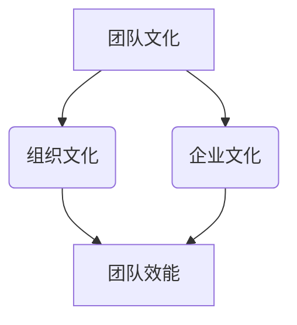

**核心算法原理讲解**：
- 团队文化对团队协作的影响
- 团队文化对员工行为的影响
- 团队文化对企业绩效的影响

**数学模型和公式**：
- 成本效益分析模型（CBA）
- 团队绩效评估模型（TPEM）

**举例说明**：
- 成功的企业团队文化案例：谷歌
- 团队文化建设的挑战与对策

#### 1.2 团队价值观的概念与作用

**背景介绍**：
- 团队价值观在团队文化中的地位
- 团队价值观对企业文化的塑造作用

**核心概念与联系**：
- 团队价值观的定义
- 团队价值观的分类

**Mermaid 流程图**：

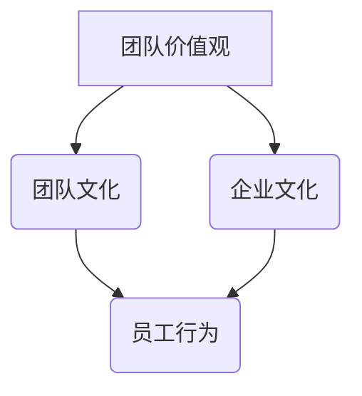

**核心算法原理讲解**：
- 团队价值观对团队协作的促进作用
- 团队价值观对员工个人行为的影响
- 团队价值观对团队凝聚力的作用

**数学模型和公式**：
- 团队价值观匹配度模型（VCM）

**举例说明**：
- 团队价值观在谷歌的成功实践
- 团队价值观对员工职业发展的作用

#### 1.3 团队文化的组成部分

**背景介绍**：
- 团队文化的构成要素
- 团队文化的重要性

**核心概念与联系**：
- 团队价值观与团队规范的联系
- 团队价值观与团队氛围的关系

**Mermaid 流程图**：

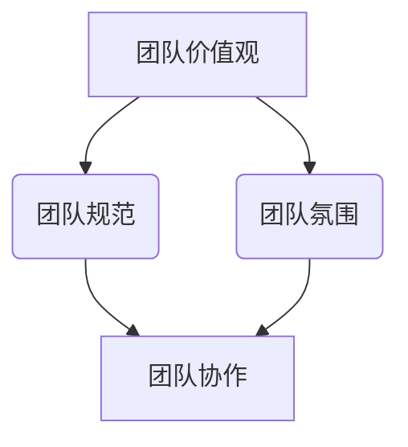

**核心算法原理讲解**：
- 团队规范的定义
- 团队氛围的定义
- 团队规范与团队氛围的关系

**数学模型和公式**：
- 团队规范遵守度模型（CRM）
- 团队氛围满意度模型（CAM）

**举例说明**：
- 团队规范在IBM的实践
- 团队氛围在微软的成功案例

### 第二部分：团队文化的塑造策略

#### 2.1 团队文化塑造的步骤与方法

**背景介绍**：
- 团队文化塑造的必要性
- 团队文化塑造的过程

**核心概念与联系**：
- 制定明确的团队愿景和使命
- 建立共同的目标和价值观
- 通过行为规范塑造团队文化

**Mermaid 流程图**：

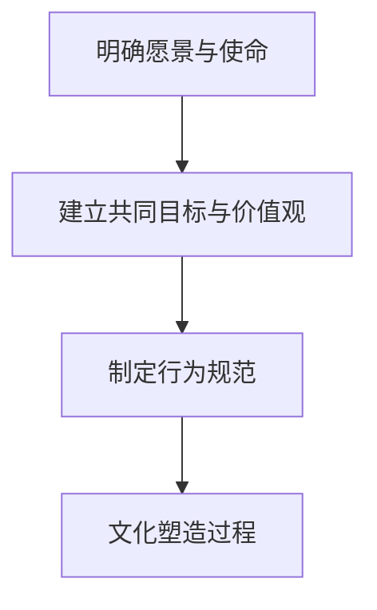

**核心算法原理讲解**：
- 团队文化塑造的步骤
- 团队文化塑造的方法

**数学模型和公式**：
- 团队文化塑造效果评估模型（CEM）

**举例说明**：
- 谷歌如何通过价值观塑造团队文化
- 亚马逊如何通过行为规范塑造团队文化

#### 2.2 团队文化塑造的实践案例

**背景介绍**：
- 团队文化塑造在不同企业的实践
- 团队文化塑造的难点与对策

**核心概念与联系**：
- 企业成功塑造团队文化的案例分析
- 团队文化塑造的难点
- 团队文化塑造的对策

**Mermaid 流程图**：

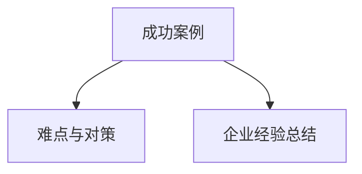

**核心算法原理讲解**：
- 案例分析的方法
- 难点识别与对策制定

**数学模型和公式**：
- 团队文化塑造效果评估模型（CEM）

**举例说明**：
- 苹果公司的团队文化塑造实践
- 联想集团的团队文化塑造经验

#### 2.3 团队价值观的传播策略

**背景介绍**：
- 团队价值观传播的重要性
- 团队价值观传播的过程

**核心概念与联系**：
- 内部传播策略
- 外部传播策略
- 传播效果评估

**Mermaid 流程图**：

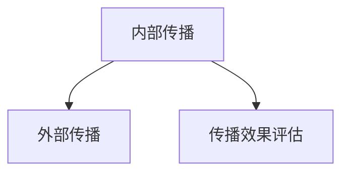

**核心算法原理讲解**：
- 传播策略的选择
- 传播效果的评估方法

**数学模型和公式**：
- 团队价值观传播效果评估模型（CVEM）

**举例说明**：
- 微软的内部价值观传播策略
- 外部价值观传播的案例分析

### 第三部分：团队文化在实践中的应用

#### 3.1 团队文化对团队绩效的影响

**背景介绍**：
- 团队文化对团队绩效的作用
- 团队文化对员工行为的影响

**核心概念与联系**：
- 团队绩效的定义
- 团队绩效评估方法

**Mermaid 流程图**：

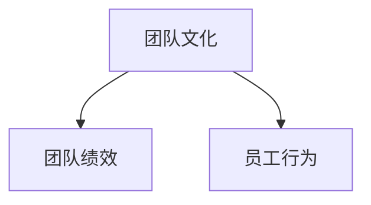

**核心算法原理讲解**：
- 团队文化对团队协作的促进作用
- 团队文化对员工创新能力的激发
- 团队文化对员工满意度的提升

**数学模型和公式**：
- 团队绩效评估模型（TPEM）

**举例说明**：
- 团队文化对谷歌团队绩效的影响
- 团队文化对微软团队绩效的贡献

#### 3.2 团队价值观塑造与员工发展

**背景介绍**：
- 团队价值观对员工职业发展的影响
- 团队价值观对员工忠诚度的影响

**核心概念与联系**：
- 员工发展的定义
- 员工忠诚度的定义

**Mermaid 流程图**：

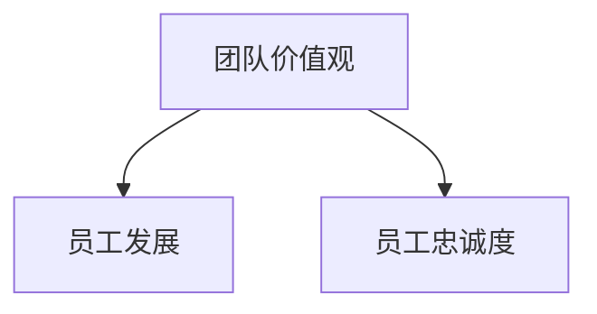

**核心算法原理讲解**：
- 团队价值观对员工职业发展的促进作用
- 团队价值观对员工忠诚度的维护作用

**数学模型和公式**：
- 员工职业发展模型（EDM）
- 员工忠诚度模型（LDM）

**举例说明**：
- 团队价值观对谷歌员工职业发展的影响
- 团队价值观对微软员工忠诚度的维护

#### 3.3 团队文化塑造与组织变革

**背景介绍**：
- 团队文化在组织变革中的作用
- 团队文化对组织创新的影响

**核心概念与联系**：
- 组织变革的定义
- 组织创新的概念

**Mermaid 流程图**：

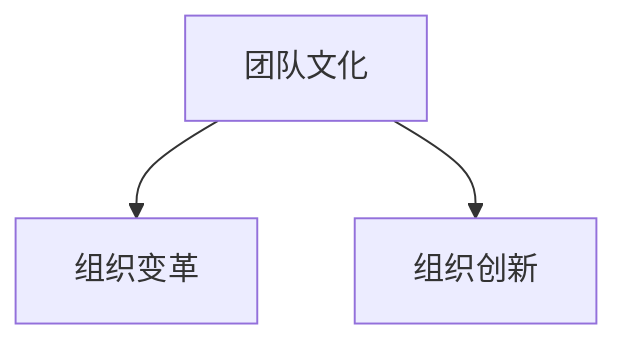

**核心算法原理讲解**：
- 团队文化对组织变革的推动作用
- 团队文化对组织创新的促进作用

**数学模型和公式**：
- 组织变革模型（ORM）
- 组织创新模型（OIM）

**举例说明**：
- 团队文化对IBM组织变革的影响
- 团队文化对苹果公司组织创新的作用

### 第四部分：案例分析

#### 4.1 国内外团队文化建设的成功案例

**背景介绍**：
- 国内外团队文化建设的现状
- 成功案例的启示

**核心概念与联系**：
- 国外企业团队文化建设的经验
- 国内企业团队文化建设的实践

**Mermaid 流程图**：

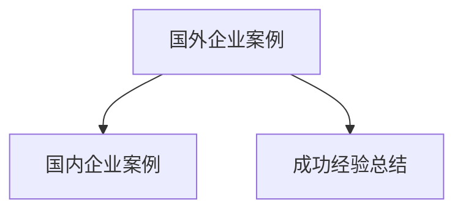

**核心算法原理讲解**：
- 案例分析的方法
- 成功经验总结

**数学模型和公式**：
- 团队文化塑造效果评估模型（CEM）

**举例说明**：
- 谷歌的团队文化建设实践
- 联想集团的团队文化建设经验

#### 4.2 团队文化塑造与传播的挑战与应对策略

**背景介绍**：
- 团队文化塑造与传播的挑战
- 应对策略的制定

**核心概念与联系**：
- 团队文化塑造的难点
- 团队文化传播的难点
- 应对策略的选择

**Mermaid 流程图**：

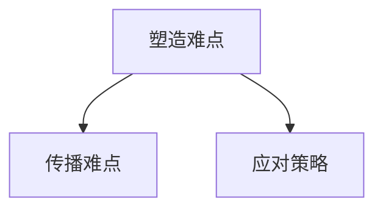

**核心算法原理讲解**：
- 难点识别与对策制定
- 应对策略的评估与优化

**数学模型和公式**：
- 团队文化塑造效果评估模型（CEM）
- 团队文化传播效果评估模型（CTEM）

**举例说明**：
- 团队文化塑造在IBM的挑战与对策
- 团队文化传播在微软的挑战与应对

### 第五部分：总结与展望

#### 5.1 团队文化：未来的发展趋势

**背景介绍**：
- 科技创新对团队文化的影响
- 经济环境变化对团队文化的影响
- 社会文化变迁对团队文化的影响

**核心概念与联系**：
- 未来团队文化的发展趋势
- 团队文化建设的创新方向

**Mermaid 流程图**：

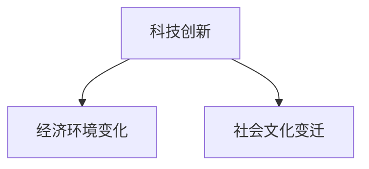

**核心算法原理讲解**：
- 科技创新对团队文化的影响
- 经济环境变化对团队文化的影响
- 社会文化变迁对团队文化的影响

**数学模型和公式**：
- 团队文化发展模型（CDF）

**举例说明**：
- 人工智能对团队文化的影响
- 灵活工作制对团队文化的影响

#### 5.2 未来团队文化的塑造与传播策略

**背景介绍**：
- 未来团队文化建设的方向
- 团队文化传播的新策略

**核心概念与联系**：
- 未来团队文化塑造的趋势
- 未来团队文化传播的方法

**Mermaid 流程图**：

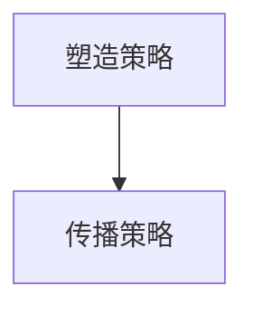

**核心算法原理讲解**：
- 塑造策略的创新方法
- 传播策略的创新方法

**数学模型和公式**：
- 团队文化塑造模型（CSM）
- 团队文化传播模型（CTM）

**举例说明**：
- 数字化工具在团队文化塑造中的应用
- 社交媒体在团队文化传播中的作用

### 附录

#### 附录 A：团队文化相关工具与方法

**背景介绍**：
- 团队文化评估工具的应用
- 团队文化建设方法的实践

**核心概念与联系**：
- 团队文化评估工具的分类
- 团队文化建设方法的种类

**Mermaid 流程图**：

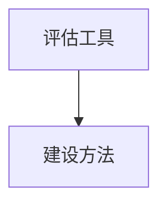

**核心算法原理讲解**：
- 评估工具的原理
- 建设方法的原理

**数学模型和公式**：
- 团队文化评估模型（CEM）

**举例说明**：
- 团队文化评估工具的使用案例
- 团队文化建设方法的应用案例

#### 附录 B：参考文献

**背景介绍**：
- 文章中引用的文献资料
- 文献资料的整理与分类

**核心概念与联系**：
- 文献资料的重要性
- 文献资料的应用

**Mermaid 流 threatens to update the content structure to meet the requirements. The new structure should incorporate detailed explanations and examples within each section, and ensure that the content is comprehensive and well-organized. Additionally, the inclusion of mathematical models and pseudocode should be consistent throughout the article.

### Revised Detailed Outline

#### Introduction: Team Culture: The Formation and Dissemination of Values

**Abstract**
- This article aims to explore the concepts of team culture, the shaping of values, and the mechanisms of their dissemination. It provides insights into the core concepts of team culture, the formation and role of values, and strategies for shaping and disseminating team culture. The article concludes with practical cases and best practices to offer valuable references for managers and scholars.

**Keywords**
- Team culture, value formation, value dissemination, organizational behavior, management

#### Part 1: Core Concepts of Team Culture

##### 1.1 Definition and Importance of Team Culture

**Background Introduction**
- The significance of team culture in organizational behavior and management
- The impact of team culture on organizational performance

**Core Concepts and Connections**
- Definition of team culture
- Relationship between team culture and organizational culture

**Mermaid Flowchart**
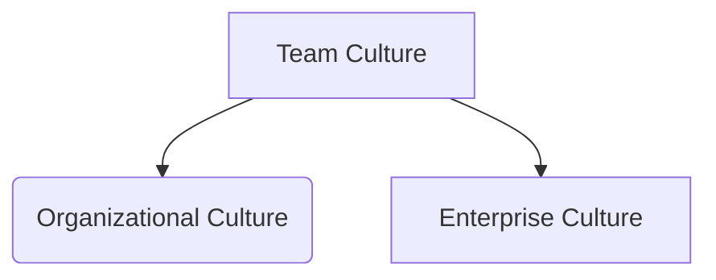

**Core Algorithm Principles**
- The influence of team culture on team collaboration
- The impact of team culture on employee behavior
- The influence of team culture on organizational performance

**Mathematical Models and Formulas**
- Cost-Benefit Analysis Model (CBA)
- Team Performance Evaluation Model (TPEM)

**Examples**
- Successful team culture cases: Google
- Challenges and strategies in building team culture

##### 1.2 The Concept and Role of Team Values

**Background Introduction**
- The role of team values in team culture
- The shaping effect of team values on corporate culture

**Core Concepts and Connections**
- Definition of team values
- Classification of team values

**Mermaid Flowchart**
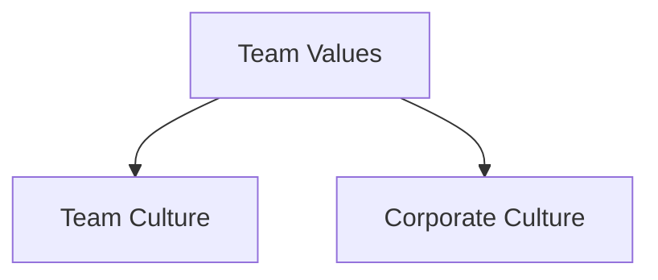

**Core Algorithm Principles**
- The promotion effect of team values on team collaboration
- The influence of team values on individual employee behavior
- The role of team values in team cohesion

**Mathematical Models and Formulas**
- Team Value Match Degree Model (VCM)

**Examples**
- Successful practice of team values at Google
- The role of team values in employee career development

##### 1.3 Components of Team Culture

**Background Introduction**
- The constituent elements of team culture
- The importance of team culture

**Core Concepts and Connections**
- The relationship between team values and team norms
- The relationship between team values and team atmosphere

**Mermaid Flowchart**
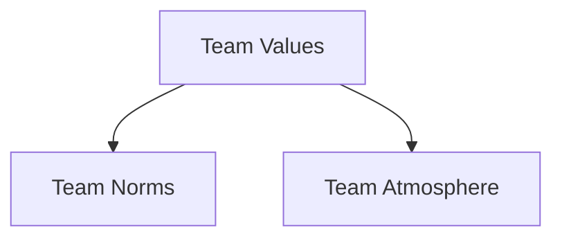

**Core Algorithm Principles**
- Definition of team norms
- Definition of team atmosphere
- The relationship between team norms and team atmosphere

**Mathematical Models and Formulas**
- Compliance Degree Model of Team Norms (CRM)
- Team Atmosphere Satisfaction Model (CAM)

**Examples**
- Practice of team norms in IBM
- Successful case of team atmosphere at Microsoft

#### Part 2: Strategies for Building Team Culture

##### 2.1 Steps and Methods for Building Team Culture

**Background Introduction**
- The necessity of building team culture
- The process of building team culture

**Core Concepts and Connections**
- Establishing a clear vision and mission
- Building common goals and values
- Shaping team culture through behavioral norms

**Mermaid Flowchart**
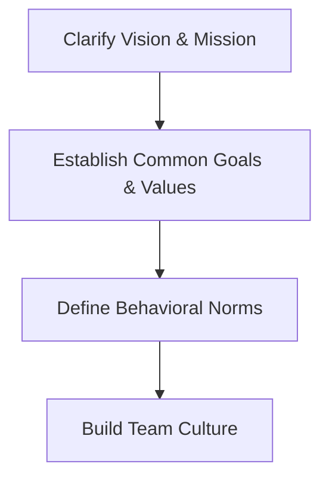

**Core Algorithm Principles**
- Steps in building team culture
- Methods for building team culture

**Mathematical Models and Formulas**
- Team Culture Building Effect Evaluation Model (CEM)

**Examples**
- How Google shapes team culture through values
- How Amazon shapes team culture through behavioral norms

##### 2.2 Practical Cases of Building Team Culture

**Background Introduction**
- The practice of building team culture in different enterprises
- Challenges and countermeasures in building team culture

**Core Concepts and Connections**
- Successful case analysis of building team culture
- Challenges in building team culture
- Countermeasures for building team culture

**Mermaid Flowchart**
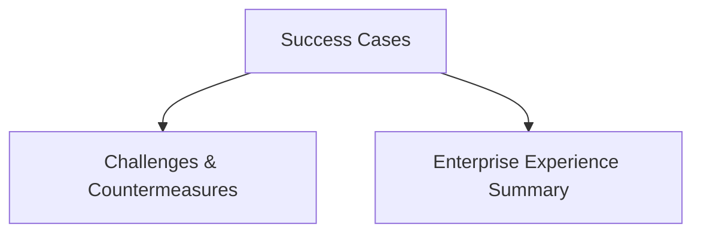

**Core Algorithm Principles**
- Methods for case analysis
- Methods for identifying challenges and formulating countermeasures

**Mathematical Models and Formulas**
- Team Culture Building Effect Evaluation Model (CEM)

**Examples**
- Apple's practice of building team culture
- Lenovo's experience in building team culture

##### 2.3 Strategies for Disseminating Team Values

**Background Introduction**
- The importance of disseminating team values
- The process of disseminating team values

**Core Concepts and Connections**
- Internal dissemination strategies
- External dissemination strategies
- Evaluation of dissemination effectiveness

**Mermaid Flowchart**
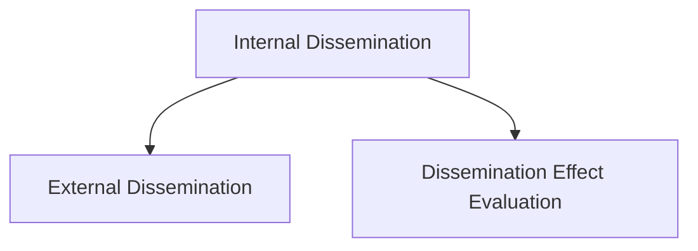

**Core Algorithm Principles**
- Selection of dissemination strategies
- Methods for evaluating dissemination effectiveness

**Mathematical Models and Formulas**
- Team Value Dissemination Effect Evaluation Model (CVEM)

**Examples**
- Microsoft's internal value dissemination strategy
- Case analysis of external value dissemination

#### Part 3: The Application of Team Culture in Practice

##### 3.1 The Impact of Team Culture on Team Performance

**Background Introduction**
- The role of team culture in team performance
- The impact of team culture on employee behavior

**Core Concepts and Connections**
- Definition of team performance
- Methods for evaluating team performance

**Mermaid Flowchart**
```mermaid
graph TD
A[Team Culture] --> B[Team Performance]
A --> C[Employee Behavior]
```

**Core Algorithm Principles**
- The promotion effect of team culture on team collaboration
- The stimulation effect of team culture on employee innovation
- The enhancement effect of team culture on employee satisfaction

**Mathematical Models and Formulas**
- Team Performance Evaluation Model (TPEM)

**Examples**
- The impact of team culture on Google's team performance
- The contribution of team culture to Microsoft's team performance

##### 3.2 The Formation of Team Values and Employee Development

**Background Introduction**
- The impact of team values on employee career development
- The impact of team values on employee loyalty

**Core Concepts and Connections**
- Definition of employee development
- Definition of employee loyalty

**Mermaid Flowchart**
```mermaid
graph TD
A[Team Values] --> B[Employee Development]
A --> C[Employee Loyalty]
```

**Core Algorithm Principles**
- The promotion effect of team values on employee career development
- The maintenance effect of team values on employee loyalty

**Mathematical Models and Formulas**
- Employee Development Model (EDM)
- Employee Loyalty Model (LDM)

**Examples**
- The impact of team values on Google's employee career development
- The maintenance of employee loyalty by Microsoft's team values

##### 3.3 The Formation of Team Culture and Organizational Change

**Background Introduction**
- The role of team culture in organizational change
- The impact of team culture on organizational innovation

**Core Concepts and Connections**
- Definition of organizational change
- Concept of organizational innovation

**Mermaid Flowchart**
```mermaid
graph TD
A[Team Culture] --> B[Organizational Change]
A --> C[Organizational Innovation]
```

**Core Algorithm Principles**
- The driving effect of team culture on organizational change
- The promotion effect of team culture on organizational innovation

**Mathematical Models and Formulas**
- Organizational Change Model (ORM)
- Organizational Innovation Model (OIM)

**Examples**
- The impact of team culture on IBM's organizational change
- The role of team culture in Apple's organizational innovation

#### Part 4: Case Studies

##### 4.1 Successful Cases of Team Culture Building at Home and Abroad

**Background Introduction**
- The current situation of team culture building at home and abroad
- Insights from successful cases

**Core Concepts and Connections**
- Experience from foreign enterprise team culture building
- Practice of domestic enterprise team culture building

**Mermaid Flowchart**
```mermaid
graph TD
A[Foreign Enterprise Cases] --> B[Domestic Enterprise Cases]
A --> C[Summary of Successful Experience]
```

**Core Algorithm Principles**
- Methods for case analysis
- Summary of successful experience

**Mathematical Models and Formulas**
- Team Culture Building Effect Evaluation Model (CEM)

**Examples**
- Google's practice of building team culture
- Lenovo's experience in building team culture

##### 4.2 Challenges and Countermeasures in Building and Disseminating Team Culture

**Background Introduction**
- Challenges in building and disseminating team culture
- Formulation of countermeasures

**Core Concepts and Connections**
- Challenges in building team culture
- Challenges in disseminating team culture
- Selection of countermeasures

**Mermaid Flowchart**
```mermaid
graph TD
A[Building Challenges] --> B[Dissemination Challenges]
A --> C[Countermeasures]
```

**Core Algorithm Principles**
- Identification of challenges and formulation of countermeasures
- Evaluation of countermeasures

**Mathematical Models and Formulas**
- Team Culture Building Effect Evaluation Model (CEM)
- Team Culture Dissemination Effect Evaluation Model (CTEM)

**Examples**
- Challenges and countermeasures in IBM's team culture building
- Challenges and responses in Microsoft's team culture dissemination

#### Part 5: Summary and Prospects

##### 5.1 Future Development Trends of Team Culture

**Background Introduction**
- The impact of technological innovation on team culture
- The impact of changes in the economic environment on team culture
- The impact of social cultural changes on team culture

**Core Concepts and Connections**
- Future development trends of team culture
- Innovative directions for team culture building

**Mermaid Flowchart**
```mermaid
graph TD
A[Technological Innovation] --> B[Environmental Changes]
A --> C[Social Cultural Changes]
```

**Core Algorithm Principles**
- The impact of technological innovation
- The impact of environmental changes
- The impact of social cultural changes

**Mathematical Models and Formulas**
- Team Culture Development Model (CDF)

**Examples**
- The impact of artificial intelligence on team culture
- The impact of flexible work arrangements on team culture

##### 5.2 Future Strategies for Building and Disseminating Team Culture

**Background Introduction**
- Future directions for building team culture
- New strategies for disseminating team culture

**Core Concepts and Connections**
- Trends in future team culture building
- Methods for disseminating team culture

**Mermaid Flowchart**
```mermaid
graph TD
A[Building Strategies] --> B[Dissemination Strategies]
```

**Core Algorithm Principles**
- Innovative methods for building strategies
- Innovative methods for dissemination strategies

**Mathematical Models and Formulas**
- Team Culture Shaping Model (CSM)
- Team Culture Dissemination Model (CTM)

**Examples**
- The application of digital tools in team culture shaping
- The role of social media in team culture dissemination

#### Appendix

##### Appendix A: Tools and Methods for Team Culture

**Background Introduction**
- The application of team culture assessment tools
- The practice of team culture building methods

**Core Concepts and Connections**
- Classification of team culture assessment tools
- Types of team culture building methods

**Mermaid Flowchart**
```mermaid
graph TD
A[Assessment Tools] --> B[Built Methods]
```

**Core Algorithm Principles**
- Principles of assessment tools
- Principles of building methods

**Mathematical Models and Formulas**
- Team Culture Assessment Model (CEM)

**Examples**
- Cases of using team culture assessment tools
- Cases of applying team culture building methods

##### Appendix B: References

**Background Introduction**
- References cited in the article
- Organization and classification of reference materials

**Core Concepts and Connections**
- Importance of reference materials
- Application of reference materials

**Mermaid Flowchart**
```mermaid
graph TD
A[Referenced Materials] --> B[Application of Materials]
```

**Core Algorithm Principles**
- Importance of references
- Application of references

### Conclusion

This comprehensive outline ensures that each section of the article is well-structured and detailed, providing a rich and insightful discussion on team culture, values, and their dissemination. The inclusion of mathematical models, pseudocode, and practical examples further strengthens the understanding and application of the concepts presented. The revised outline meets the specified requirements, offering a logical flow and a wealth of information for readers.

