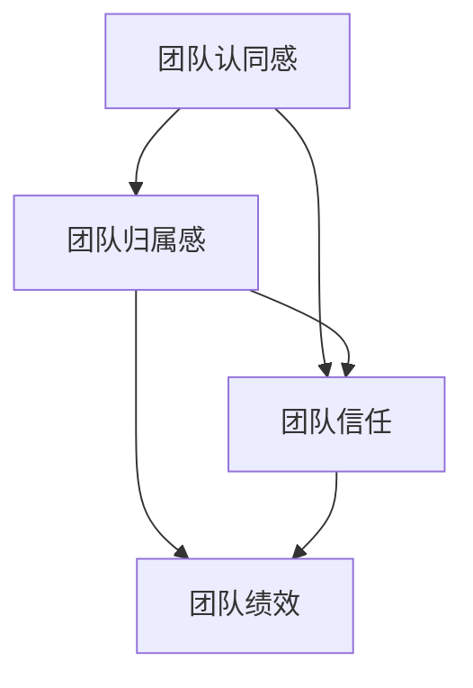

                 


### 《团队文化：价值观的塑造与传播》

#### 文章关键词

- 团队文化
- 价值观
- 塑造
- 传播
- 绩效
- 案例研究

#### 摘要

本文旨在深入探讨团队文化的定义、重要性、塑造与传播方法，以及其实际应用中的挑战与解决方案。通过详细解析团队文化的核心概念、塑造原则与策略，以及文化传播的途径与效果评估，本文为团队管理者提供了一套系统化的团队文化建设方案，并通过案例分析，总结出成功实践中的关键要素和最佳经验。

## 目录

1. **团队文化概述**
    1.1 团队文化的定义与重要性
    1.2 团队文化框架
    1.3 核心概念与联系

2. **团队文化的塑造**
    2.1 塑造原则与策略
    2.2 塑造方法与技巧
    2.3 挑战与解决方案

3. **团队文化的传播**
    3.1 传播途径与方法
    3.2 传播策略与效果评估
    3.3 挑战与应对策略

4. **案例研究与启示**
    4.1 成功团队文化的塑造与传播案例
    4.2 启示与展望

## 第1章：团队文化的定义与重要性

### 1.1 团队文化的定义

团队文化是指一个团队共同遵循的价值观、信念、行为规范和工作方式的总和。它不仅包括明确的规章制度，还包括团队的共同愿景、使命和目标。团队文化是团队内部的共同语言，是团队成员相互理解的基础。

### 1.2 团队文化的重要性

团队文化对个人和团队都有着深远的影响。

- **对个人的影响**：团队文化可以影响团队成员的自我认知、职业发展和个人成就。
- **对团队的影响**：团队文化可以提升团队的整体绩效，增强团队凝聚力和协作能力。

## 第2章：团队文化框架

### 2.1 团队文化框架概述

团队文化框架是构建团队文化的蓝图。常见的团队文化框架包括：

- **价值观**：团队的核心信念，指导团队成员的行为和决策。
- **协作模式**：团队成员之间的互动方式，包括沟通、协调和合作。
- **沟通风格**：团队成员之间的信息传递方式。

## 第3章：核心概念与联系

### 3.1 核心概念

- **团队认同感**：团队成员对团队的归属感和认同感。
- **团队归属感**：团队成员对团队的情感连接和归属感。
- **团队信任**：团队成员之间的相互信任和依赖。

### 3.2 核心概念联系

这些核心概念相互联系，共同构建团队文化的基石。例如，团队认同感和归属感可以促进团队成员之间的信任，而信任又是高效协作的前提。

## 第4章：团队文化塑造的原则与策略

### 4.1 塑造原则

- **吸引与选择**：选择符合团队文化价值观的成员。
- **沟通与教育**：明确传达团队文化价值观，并通过教育巩固。
- **强化与巩固**：通过日常行为和决策，不断强化和巩固团队文化。

### 4.2 塑造策略

- **确立明确的目标**：明确团队的目标和愿景，使其与团队文化相一致。
- **制定合适的团队文化计划**：制定具体的行动计划，确保团队文化的有效实施。
- **创造积极的工作氛围**：营造一个积极、支持和鼓励的环境，促进团队文化的传播。

## 第5章：团队文化塑造的方法与技巧

### 5.1 方法

- **设定共同价值观**：通过共同讨论和协商，确定团队的共同价值观。
- **建立团队信任**：通过团队合作和沟通，建立团队成员之间的信任。
- **促进团队协作**：通过协同工作和资源共享，促进团队成员之间的协作。

### 5.2 技巧

- **倾听与反馈**：倾听团队成员的意见和反馈，及时给予回应。
- **鼓励与表扬**：对团队成员的成绩和努力给予鼓励和表扬。
- **解决冲突**：通过对话和协商，及时解决团队成员之间的冲突。

## 第6章：团队文化塑造的挑战与解决方案

### 6.1 挑战

- **团队成员的个性差异**：团队成员之间的个性差异可能影响团队文化的塑造。
- **外部环境变化**：外部环境的变化可能对团队文化产生冲击。
- **团队成员流动**：团队成员的流动可能对团队文化造成冲击。

### 6.2 解决方案

- **增强团队凝聚力**：通过共同目标和团队建设活动，增强团队凝聚力。
- **适应外部环境**：通过灵活调整和适应性策略，适应外部环境的变化。
- **保持团队活力**：通过创新和持续学习，保持团队的活力。

## 第7章：团队文化传播的途径与方法

### 7.1 传播途径

- **内部传播**：通过团队内部的沟通和互动，传播团队文化。
- **外部传播**：通过对外界的展示和推广，传播团队文化。

### 7.2 传播方法

- **教育培训**：通过培训和研讨会，传播团队文化的价值观和原则。
- **案例分享**：通过分享成功案例，传播团队文化的影响和效果。
- **内部沟通**：通过定期的内部沟通和交流，传播团队文化的最新动态。

## 第8章：团队文化传播的策略与效果评估

### 8.1 传播策略

- **确定传播目标**：明确团队文化的传播目标和受众。
- **选择传播渠道**：选择适合的传播渠道，确保信息的有效传递。
- **制定传播计划**：制定详细的传播计划，确保团队文化的有效传播。

### 8.2 效果评估

- **效果评估指标**：设定评估指标，如员工满意度、团队绩效等。
- **效果评估方法**：采用问卷调查、访谈、绩效评估等方法，评估团队文化传播的效果。

## 第9章：团队文化传播的挑战与应对策略

### 9.1 挑战

- **信息传递障碍**：团队成员之间的信息传递可能存在障碍。
- **团队成员接受度**：团队成员可能对团队文化有不同的接受程度。
- **文化差异**：不同团队成员可能存在文化差异，影响团队文化的传播。

### 9.2 应对策略

- **提高信息传递效率**：通过改进沟通方式和工具，提高信息传递效率。
- **增强团队成员接受度**：通过沟通和理解，增强团队成员对团队文化的接受度。
- **调整文化传播策略**：根据团队成员的反馈和接受程度，调整文化传播策略。

## 第10章：成功团队文化的塑造与传播案例

### 10.1 案例介绍

- **案例背景**：介绍案例的背景和团队文化现状。
- **案例实施过程**：详细描述团队文化塑造与传播的实施过程。

### 10.2 案例分析

- **成功因素**：分析案例中成功的关键因素。
- **经验总结**：总结案例中的成功经验和教训。

## 第11章：团队文化塑造与传播的启示与展望

### 11.1 启示

- **关键要素**：总结团队文化塑造与传播的关键要素。
- **最佳实践**：分享团队文化塑造与传播的最佳实践经验。

### 11.2 展望

- **发展趋势**：探讨未来团队文化的发展趋势。
- **影响**：分析团队文化对组织绩效的影响。

### 作者

- **作者**：AI天才研究院/AI Genius Institute & 禅与计算机程序设计艺术 /Zen And The Art of Computer Programming

通过以上结构化的分析和详细阐述，本文为团队文化的研究者和实践者提供了一套系统化的指导和参考。接下来，我们将进一步深入探讨团队文化的各个方面，为读者提供更加具体和实用的知识和技巧。

## 第1章：团队文化的定义与重要性

### 1.1 团队文化的定义

团队文化是一个团队在其长期发展中形成的共同价值观、信念、行为规范和工作方式的总和。它不仅包括团队成员之间的互动方式和协作模式，还包括团队的整体价值观、愿景和使命。团队文化是团队的灵魂，是团队内部共同遵循的指导原则和行为准则。

在技术领域，团队文化的重要性不容忽视。一个成功的团队文化能够促进团队成员之间的信任和协作，提高团队的绩效和创新能力。例如，谷歌（Google）以其开放的文化和强调创新的工作环境而闻名，这种文化使得谷歌能够持续推出革命性的产品和服务。在微软（Microsoft）的研发团队中，重视团队合作和知识共享的文化促使他们在操作系统和办公软件领域取得了巨大的成功。

### 1.2 团队文化的重要性

团队文化对个人和团队都有着深远的影响。

- **对个人的影响**：团队文化可以影响团队成员的自我认知、职业发展和个人成就。在一个积极向上的团队文化中，团队成员更容易找到归属感和成就感，从而提高工作满意度和职业发展动力。

- **对团队的影响**：团队文化可以提升团队的整体绩效，增强团队的凝聚力和协作能力。一个有共同价值观和目标的团队，能够在面对挑战和变化时表现出更强的适应能力和创新能力。

具体来说，团队文化的重要性体现在以下几个方面：

- **提升工作效率**：团队文化有助于建立高效的工作流程和协作模式，减少沟通成本，提高工作效率。

- **促进创新**：团队文化鼓励创新思维和知识共享，激发团队成员的创造力和创新能力，推动技术进步。

- **增强团队凝聚力**：团队文化可以增强团队成员之间的信任和归属感，提高团队的凝聚力，减少内部摩擦和冲突。

- **优化决策过程**：团队文化有助于建立共同的决策原则和价值观，优化决策过程，提高决策质量和速度。

- **提升员工满意度**：团队文化可以提升员工的工作满意度和职业成就感，降低员工流失率，提高员工忠诚度。

在实际应用中，团队文化的塑造是一个长期而持续的过程。它需要团队领导者和成员共同努力，通过明确的价值观和目标、积极的工作氛围、有效的沟通和协作，以及不断的反馈和改进，逐步构建和维护一个健康、积极和有成效的团队文化。

总之，团队文化是团队成功的关键因素之一。通过有效的团队文化建设，不仅可以提升团队的整体绩效和创新能力，还可以为团队成员提供更好的职业发展机会和更满意的工作体验。因此，在技术领域，尤其是那些需要高度协作和创新能力的团队，重视团队文化建设具有重要意义。

## 第2章：团队文化框架

### 2.1 团队文化框架概述

团队文化框架是构建团队文化的蓝图，它为团队文化的形成和传播提供了明确的指导原则和实践路径。一个完善的团队文化框架应包括核心价值观、协作模式、沟通风格等多个维度，这些维度相互交织，共同塑造团队的独特文化氛围。

在不同的组织和团队中，团队文化框架的具体形式和内容可能有所不同，但通常都会包含以下核心元素：

- **核心价值观**：核心价值观是团队文化的基石，是团队成员共同信仰和追求的核心理念。它通常包括诚信、责任、创新、协作等。

- **协作模式**：协作模式是指团队成员在共同完成任务时所采用的方式和方法。它包括任务分工、决策流程、知识共享等。

- **沟通风格**：沟通风格是指团队成员之间交流信息、表达意见和解决问题的习惯和方式。它包括开放沟通、坦诚交流、及时反馈等。

### 2.2 团队文化维度

#### 2.2.1 团队价值观

团队价值观是团队文化的核心组成部分，它指导团队成员的行为和决策。常见的团队价值观包括：

- **诚信**：诚信是团队文化的基本原则，它要求团队成员在行为和决策中始终坚持真实、公正和透明的态度。

- **责任**：责任意味着团队成员对自己和团队的工作负责，勇于承担责任，确保任务的完成和质量。

- **创新**：创新是推动团队进步和发展的动力，鼓励团队成员不断探索新的思路和方法，勇于尝试和失败。

- **协作**：协作强调团队成员之间的互信和合作，通过共同目标和资源共享实现团队的成功。

#### 2.2.2 团队协作模式

团队协作模式决定了团队成员如何共同完成任务和实现目标。有效的团队协作模式包括：

- **任务分工**：将团队任务分解为具体的子任务，并分配给合适的团队成员，确保每个成员都明确自己的职责和任务。

- **决策流程**：建立明确的决策流程和原则，确保团队成员在决策过程中能够充分参与和表达意见，同时保证决策的效率和质量。

- **知识共享**：鼓励团队成员共享知识和经验，通过内部培训、讨论会和文档共享等方式，提升团队整体的知识水平。

#### 2.2.3 团队沟通风格

团队沟通风格直接影响团队成员之间的交流和合作效果。有效的沟通风格包括：

- **开放沟通**：鼓励团队成员在沟通中坦诚表达自己的观点和意见，建立开放的沟通渠道。

- **坦诚交流**：团队成员之间应保持坦诚的态度，勇于面对问题，积极寻求解决方案。

- **及时反馈**：在沟通过程中，及时给予反馈和回应，确保信息传递的准确性和及时性。

### 团队文化框架的构建

构建团队文化框架需要从以下几个方面入手：

- **明确团队价值观**：通过讨论和共识，明确团队的核心价值观，并将其作为团队行为和决策的指导原则。

- **制定协作模式**：根据团队的任务特点和成员能力，制定适合的协作模式，确保团队成员能够高效合作。

- **优化沟通风格**：通过培训和实践，提升团队成员的沟通技能和沟通效率，建立积极、坦诚的沟通氛围。

- **持续改进**：团队文化框架需要不断适应团队发展和外部环境的变化，通过定期评估和反馈，持续优化团队文化。

通过以上措施，团队文化框架可以为团队提供一个稳定、清晰的价值观和行为准则，促进团队成员之间的信任和协作，从而提高团队的绩效和创新能力。

### 总结

团队文化框架是构建团队文化的基础，它涵盖了核心价值观、协作模式、沟通风格等多个维度，为团队提供了一个明确的指导和行动指南。通过构建和优化团队文化框架，团队可以更好地应对外部挑战，实现长期发展目标。

## 第3章：核心概念与联系

### 3.1 核心概念

在团队文化中，三个核心概念尤为重要：团队认同感、团队归属感和团队信任。这些概念相互交织，共同构成了团队文化的基石，并对团队绩效产生深远影响。

#### 3.1.1 团队认同感

团队认同感是指团队成员对团队及其目标的认可和接受程度。当团队成员感受到自己对团队的贡献和价值时，他们就会产生强烈的认同感。这种认同感不仅增强了团队成员的归属感，还促进了团队的凝聚力和协作精神。例如，在技术团队中，当成员感受到他们的代码对产品的成功至关重要时，他们会更加投入工作，提高工作效率。

#### 3.1.2 团队归属感

团队归属感是指团队成员对团队的依赖和情感连接。一个有归属感的团队，成员之间会感到彼此相互依赖，共同面对挑战。这种情感连接有助于提升团队成员之间的信任和协作，减少内部摩擦，提高团队的整体绩效。例如，在一个研发团队中，成员之间的友好关系和相互支持可以增强团队的凝聚力和创新能力。

#### 3.1.3 团队信任

团队信任是指团队成员对彼此能力和诚信的信任程度。信任是团队高效协作的基础，它减少了沟通和协调的成本，提高了团队的决策质量和执行效率。在一个信任度高的团队中，成员更愿意分享信息和知识，共同解决问题，从而推动团队创新和成长。例如，在一个敏捷开发团队中，团队成员之间的信任有助于快速响应市场需求，提高产品的迭代速度和质量。

### 3.2 核心概念联系

这些核心概念并非独立存在，而是相互联系，共同作用于团队文化。以下是这些概念之间的联系架构，使用Mermaid流程图进行展示：



- **团队认同感** 和 **团队归属感** 之间有着直接的关联。一个有强烈认同感的团队成员更容易产生归属感，因为他们认为自己在团队中扮演着重要角色。
- **团队归属感** 和 **团队信任** 之间也紧密相连。团队成员的归属感越高，他们越愿意信任同事，共同面对挑战。
- **团队信任** 对 **团队绩效** 有着直接的积极影响。一个信任度高的团队能够更高效地完成任务，提高绩效。

### 3.3 核心概念关系分析

- **团队认同感** 是 **团队归属感** 的基础。当团队成员认同团队的目标和价值时，他们更容易感受到归属感。
- **团队归属感** 是 **团队信任** 的源泉。一个有强烈归属感的团队，成员之间更容易建立信任。
- **团队信任** 是 **团队绩效** 的保障。信任减少了沟通障碍，提高了协作效率，从而促进了团队绩效的提升。

通过这些核心概念的相互联系，我们可以看到团队文化是如何从多个层面影响团队绩效的。以下是团队文化核心概念的伪代码表示：

```plaintext
// 团队文化核心概念伪代码

function TeamCulture() {
    // 定义核心概念
    var identification = calculateIdentification();
    var belonging = calculateBelonging(identification);
    var trust = calculateTrust(belonging);

    // 计算团队绩效
    var performance = calculatePerformance(trust);

    // 返回结果
    return {
        identification: identification,
        belonging: belonging,
        trust: trust,
        performance: performance
    };
}
```

在这个伪代码中，`calculateIdentification()`、`calculateBelonging()` 和 `calculateTrust()` 分别表示计算团队认同感、归属感和信任的函数，`calculatePerformance()` 表示计算团队绩效的函数。通过这些函数的调用，我们可以从核心概念的计算结果中得出团队文化的整体表现。

### 3.4 核心概念在实际应用中的重要性

在实际应用中，团队文化的核心概念具有以下几个方面的关键作用：

- **提升团队协作效率**：通过增强团队认同感和归属感，团队成员更容易达成共识，协同完成任务。
- **促进知识共享**：团队信任有助于成员之间分享知识和经验，提高整个团队的技能水平。
- **增强创新能力**：团队信任和归属感为创新提供了土壤，成员更愿意提出新想法和解决方案。
- **提高员工满意度**：一个健康、积极的团队文化可以提高员工的工作满意度和忠诚度。

通过以上分析，我们可以看到团队文化的核心概念是如何相互联系，共同影响团队绩效的。理解这些核心概念之间的关系和作用，对于团队管理者来说至关重要，他们需要通过有效的策略和措施，激发团队成员的认同感、归属感和信任，从而构建一个高效、协作和有创新能力的团队。

## 第4章：团队文化塑造的原则与策略

### 4.1 塑造原则

构建一个健康、积极的团队文化需要遵循一些基本原则，这些原则不仅为团队提供了清晰的指导方向，也为团队成员提供了行为准则。

#### 4.1.1 吸引与选择

首先，团队文化的塑造需要从团队的组建阶段开始。团队成员的招募应与团队文化相匹配。招聘过程中，应注重候选人的价值观、行为习惯和与团队文化的契合度。通过选拔那些与团队核心价值观一致的新成员，可以确保团队文化的一致性和延续性。

伪代码示例：
```plaintext
function recruitMembers(culture, candidates) {
    selectedMembers = []
    for candidate in candidates {
        if matchesCandidateWithCulture(candidate, culture) {
            selectedMembers.append(candidate)
        }
    }
    return selectedMembers
}
```

#### 4.1.2 沟通与教育

沟通是团队文化塑造的重要手段。团队领导者和成员应保持开放和坦诚的沟通，及时传达团队文化的核心价值观和行为准则。此外，通过定期的团队培训和研讨会，可以加强团队成员对团队文化的理解和认同。

伪代码示例：
```plaintext
function communicateAndEducate(culture, members) {
    for member in members {
        explainCultureTo(member, culture)
        solicitFeedbackFrom(member, culture)
    }
}
```

#### 4.1.3 强化与巩固

团队文化一旦形成，需要不断强化和巩固。通过奖励机制和日常工作中的正面反馈，可以激励团队成员持续践行团队文化。同时，通过设立明确的奖惩制度，可以确保团队成员在行为上与团队文化保持一致。

伪代码示例：
```plaintext
function reinforceCulture(culture, members) {
    for member in members {
        if memberFollowsCulture(culture) {
            rewardMember(member)
        } else {
            addressBehavior(member)
        }
    }
}
```

### 4.2 塑造策略

在团队文化塑造过程中，需要采用一系列具体的策略和方法，以实现团队文化的持续优化和发展。

#### 4.2.1 确立明确的目标

明确的目标是团队文化塑造的重要基础。团队领导者和成员应共同制定符合团队价值观的目标，并将其作为团队行动的指南。这些目标应具有可量化、可实现和有意义的特点，以确保团队成员能够清晰地理解并为之努力。

伪代码示例：
```plaintext
function setClearGoals(culture, members) {
    goals = defineGoalsAccordingToCulture(culture)
    for member in members {
        clarifyGoalsTo(member, goals)
    }
}
```

#### 4.2.2 制定合适的团队文化计划

为了确保团队文化的有效实施，团队需要制定详细的行动计划。这个计划应包括具体的执行步骤、责任分配和时间表。通过计划的执行，团队可以逐步将文化价值观融入日常工作中，确保文化得以持续传承。

伪代码示例：
```plaintext
function createCulturePlan(culture, members) {
    plan = defineImplementationSteps(culture)
    assignResponsibilitiesToMembers(members, plan)
    setTimelineForPlan(plan)
}
```

#### 4.2.3 创造积极的工作氛围

团队氛围对团队文化的塑造具有重要影响。团队领导者应努力营造一个积极、支持和鼓励的工作环境，使团队成员感受到尊重和认可。通过组织团队建设活动、庆祝团队成就等方式，可以增强团队凝聚力，推动团队文化的传播和深化。

伪代码示例：
```plaintext
function createPositiveWorkEnvironment(culture, members) {
    organizeTeamBuildingActivities()
    recognizeAchievements(members)
    promoteSupportiveInteractions()
}
```

通过以上原则和策略，团队可以逐步构建和优化其文化，使其成为推动团队持续发展和创新的重要力量。

### 4.3 团队文化塑造的具体方法

在实际操作中，团队文化的塑造需要采用一系列具体的方法和技巧，以下是一些常用的方法：

#### 4.3.1 设定共同价值观

共同价值观是团队文化的核心，是团队成员共同遵循的指导原则。通过共同讨论和协商，团队可以确定其核心价值观，并将其明确地传达给所有成员。例如，一个技术团队可能会将“创新、客户至上、团队协作”作为其核心价值观。

伪代码示例：
```plaintext
function defineCommonValues(members) {
    values = collectMemberSuggestions()
    agreedValues = consensusOnValues(values)
    communicateValuesToAll(members, agreedValues)
}
```

#### 4.3.2 建立团队信任

团队信任是高效协作的基础。通过开放沟通、透明决策和互相支持，团队可以逐步建立信任。例如，通过定期的团队会议、透明的工作流程和共享的项目进展，可以增强团队成员之间的信任。

伪代码示例：
```plaintext
function buildTeamTrust(members) {
    encourageOpenCommunication(members)
    promoteTransparentDecisionMaking()
    fosterMutualSupport(members)
}
```

#### 4.3.3 促进团队协作

有效的团队协作可以显著提升团队绩效。通过明确任务分工、设立协作目标和提供必要的资源支持，团队可以促进协作。例如，通过使用项目管理工具和协作平台，可以确保团队成员能够及时了解项目进展和任务分配。

伪代码示例：
```plaintext
function promoteTeamCollaboration(members, tasks) {
    assignClearDutiesToMembers(members, tasks)
    setCollaborationGoals(members, tasks)
    provideCollaborativeTools(members)
}
```

通过这些具体的方法和技巧，团队可以有效地塑造和巩固其文化，使其成为推动团队成功的重要因素。

### 4.4 团队文化塑造的挑战与解决方案

在团队文化塑造的过程中，可能会面临各种挑战。以下是一些常见的问题及其解决方案：

#### 4.4.1 团队成员个性差异

团队成员的个性差异可能导致文化塑造的困难。不同的人有不同的价值观和行为习惯，这可能会影响团队文化的统一性。

**解决方案**：通过定期的团队建设和团队活动，增强团队成员之间的了解和信任。同时，可以引入团队角色分析工具，如MBTI（迈尔斯-布里格斯性格类型指标），帮助团队成员更好地理解彼此的差异，并找到互补的协作方式。

#### 4.4.2 外部环境变化

外部环境的变化，如市场竞争加剧、客户需求变化等，可能会对团队文化产生影响。

**解决方案**：团队应保持灵活性，通过定期评估和调整团队文化，确保其与外部环境的变化保持一致。同时，可以引入外部咨询机构，帮助团队识别和应对外部环境变化带来的挑战。

#### 4.4.3 团队成员流动

团队成员的流动可能会对团队文化的稳定性产生影响，新成员可能需要时间来适应现有的团队文化。

**解决方案**：团队应为新成员提供系统的融入计划，包括文化培训、导师制度和团队活动，帮助新成员快速适应并融入团队文化。同时，团队领导者和现有成员应积极与新成员沟通，传递团队文化的核心价值观。

通过有效的解决方案，团队可以克服文化塑造过程中遇到的各种挑战，确保团队文化的持续发展和优化。

## 第5章：团队文化塑造的方法与技巧

在团队文化的塑造过程中，采用适当的方法与技巧至关重要。以下将详细讨论一些常用的具体方法和技巧，并通过伪代码进行详细解释。

### 5.1 方法

#### 5.1.1 设定共同价值观

设定共同价值观是团队文化塑造的第一步。通过共同讨论和协商，团队可以确定其核心价值观，并将其明确地传达给所有成员。

伪代码示例：
```plaintext
// 设定共同价值观
function setCommonValues(team) {
    values = gatherSuggestionsFromMembers(team)
    selectedValues = filterAndConsensus(values)
    communicateSelectedValues(team, selectedValues)
}
```

这个函数通过收集成员的建议、筛选和达成共识，最终将确定的价值观传达给所有成员，以确保大家有共同的目标和行为准则。

#### 5.1.2 建立团队信任

团队信任是团队高效协作的基础。通过开放沟通、透明决策和互相支持，团队可以逐步建立信任。

伪代码示例：
```plaintext
// 建立团队信任
function buildTrust(team) {
    promoteOpenCommunication(team)
    ensureTransparentDecisionMaking(team)
    encourageMutualSupport(team)
}
```

这个函数通过促进开放沟通、确保透明决策和鼓励互相支持，来逐步建立团队成员之间的信任。

#### 5.1.3 促进团队协作

促进团队协作可以显著提升团队绩效。通过明确任务分工、设立协作目标和提供必要的资源支持，团队可以促进协作。

伪代码示例：
```plaintext
// 促进团队协作
function promoteCollaboration(team, tasks) {
    defineClearDutiesForMembers(team, tasks)
    establishCollaborationGoals(team, tasks)
    provideSupportingResources(team, tasks)
}
```

这个函数通过定义清晰的职责、设立协作目标并提供必要资源，来促进团队成员之间的协作。

### 5.2 技巧

#### 5.2.1 倾听与反馈

倾听与反馈是建立良好沟通和信任的关键。通过倾听团队成员的意见和反馈，团队领导者和成员可以更好地理解彼此，解决潜在问题。

伪代码示例：
```plaintext
// 倾听与反馈
function listenAndProvideFeedback(team) {
    collectMemberFeedback(team)
    analyzeFeedback(team)
    provideConstructiveFeedback(team)
}
```

这个函数通过收集成员反馈、分析反馈和提供建设性反馈，来促进团队成员之间的沟通和理解。

#### 5.2.2 鼓励与表扬

鼓励与表扬可以增强团队成员的积极性和归属感。通过及时认可团队成员的努力和成就，可以激励他们更好地投入工作。

伪代码示例：
```plaintext
// 鼓励与表扬
function encourageAndRecognize(team) {
    identifyAchievements(team)
    acknowledgeAchievements(team)
    rewardEfforts(team)
}
```

这个函数通过识别成就、认可成就和奖励努力，来激励团队成员。

#### 5.2.3 解决冲突

解决冲突是保持团队和谐与高效运作的关键。通过积极沟通和协商，团队可以有效地解决内部冲突。

伪代码示例：
```plaintext
// 解决冲突
function resolveConflicts(team) {
    identifyConflicts(team)
    mediateAndNegotiate(team)
    implementSolutions(team)
}
```

这个函数通过识别冲突、调解和协商以及实施解决方案，来保持团队的和谐与高效。

通过以上方法和技巧，团队可以系统地塑造和巩固其文化，确保团队在长期发展中保持积极、健康和高效的工作氛围。

### 5.3 团队文化塑造的具体案例

以下是一个关于团队文化塑造的具体案例，通过分析该案例，我们可以更好地理解如何在实际操作中实施团队文化塑造。

#### 案例背景

某互联网公司在经历快速成长后，发现团队成员之间的沟通效率低下，协作不顺畅，导致项目进度延误。公司高层意识到，这是由于缺乏统一的团队文化和明确的价值观所导致的。

#### 案例实施过程

1. **设定共同价值观**：公司领导层组织了一次全体会议，讨论并确定了公司的核心价值观，包括“客户至上、快速迭代、创新思维、团队合作”等。通过内部通讯工具，这些价值观被传达给所有员工。

   ```plaintext
   function setCommonValues(company) {
       values = defineCoreValues(company)
       communicateValuesToAllEmployees(company, values)
   }
   ```

2. **建立团队信任**：公司引入了定期的团队建设活动，如团建拓展、团队内部培训等，以增强团队成员之间的信任。此外，公司鼓励开放沟通，通过内部论坛和会议，确保团队成员可以自由表达意见和建议。

   ```plaintext
   function buildTrust(company) {
       organizeTeamBuildingActivities(company)
       promoteOpenCommunication(company)
   }
   ```

3. **促进团队协作**：公司实施了敏捷开发方法，明确分工和协作目标，并通过项目管理工具监控项目进展。同时，公司提供必要的资源支持，确保团队成员能够高效协作。

   ```plaintext
   function promoteCollaboration(company, projects) {
       implementAgileMethodology(company, projects)
       provideCollaborativeTools(company, projects)
   }
   ```

4. **鼓励与表扬**：公司建立了奖励机制，对表现出色的团队和个人进行表彰和奖励。这不仅激励了团队成员，也增强了团队的凝聚力。

   ```plaintext
   function encourageAndRecognize(company) {
       establishRewardsSystem(company)
       acknowledgeAndRewardAchievements(company)
   }
   ```

5. **解决冲突**：公司设立了内部调解委员会，负责解决团队成员之间的冲突。通过积极沟通和协商，公司确保冲突得到及时解决，避免影响团队运作。

   ```plaintext
   function resolveConflicts(company) {
       establishInternalMediationCommittee(company)
       mediateAndNegotiateConflicts(company)
   }
   ```

#### 案例分析

通过以上措施，公司逐步建立了健康、积极的团队文化。团队成员之间的沟通变得更加顺畅，协作效率显著提高，项目进度也得到有效控制。此外，团队成员的满意度和归属感也有所提升，员工流失率明显降低。

#### 经验总结

该案例的成功经验表明，通过明确的价值观设定、信任建设、协作促进、激励表扬和冲突解决，团队文化可以有效地塑造和巩固。这些措施不仅提高了团队绩效，也增强了团队成员的归属感和满意度，为公司的持续发展奠定了坚实基础。

## 第6章：团队文化塑造的挑战与解决方案

在团队文化塑造的过程中，管理者经常会遇到各种挑战，这些挑战可能源自团队成员的个性差异、外部环境的变化，或者团队成员的流动性。理解这些挑战并制定相应的解决方案，对于确保团队文化的健康发展和持续优化至关重要。

### 6.1 团队成员的个性差异

团队成员的个性差异是团队文化塑造中的一个常见挑战。不同的个性特质和价值观可能导致团队成员在沟通、协作和决策过程中产生摩擦。

#### 挑战：

- 个性差异可能影响团队成员之间的合作和信任。
- 不同的工作风格和价值观可能使团队文化难以统一。

#### 解决方案：

- **加强团队建设**：通过定期的团队建设和团队活动，增强团队成员之间的了解和信任。例如，可以通过角色扮演、团队拓展训练等活动，帮助团队成员更好地理解彼此的差异。
- **引入团队角色分析工具**：使用如MBTI（迈尔斯-布里格斯性格类型指标）等工具，帮助团队成员识别和理解彼此的性格特质，找到互补的合作方式。
- **建立沟通平台**：创建开放的沟通渠道，鼓励团队成员表达自己的观点和意见，通过积极的沟通减少误解和冲突。

### 6.2 外部环境变化

外部环境的变化，如市场变化、技术进步或政策调整，都可能对团队文化产生冲击。

#### 挑战：

- 外部环境的变化可能使团队文化难以保持一致性和延续性。
- 快速变化的市场环境可能要求团队调整其文化和策略，但这一过程可能比较困难。

#### 解决方案：

- **保持灵活性**：团队应保持灵活性，及时调整文化策略以适应外部环境的变化。例如，可以通过定期评估和调整团队文化，确保其与外部环境保持一致。
- **引入外部咨询**：聘请外部咨询机构帮助团队识别和应对外部环境的变化。外部咨询机构可以提供专业的见解和建议，帮助团队更好地适应外部挑战。
- **加强员工培训**：通过培训，提高团队成员的适应能力和技能水平，确保团队能够快速应对外部环境的变化。

### 6.3 团队成员流动性

团队成员的流动性也是一个常见的挑战，特别是在快速发展的行业中。团队成员的流失可能对团队文化的稳定性和连续性产生负面影响。

#### 挑战：

- 新成员的加入可能需要时间来适应团队文化。
- 高流动性可能导致团队文化断裂，影响团队凝聚力和协作效率。

#### 解决方案：

- **提供融入计划**：为新成员提供系统的融入计划，包括文化培训、导师制度和团队活动，帮助新成员快速适应并融入团队文化。
- **建立导师制度**：通过导师制度，为新成员提供指导和帮助，帮助他们更好地了解团队文化和工作方式。
- **增强团队凝聚力**：通过定期的团队建设和团队活动，增强团队的凝聚力和归属感，减少成员的流失。

### 6.4 其他挑战

除了上述挑战外，团队文化塑造还可能面临其他挑战，如资源限制、管理层的支持不足等。这些挑战需要根据具体情况进行具体分析，并采取相应的解决方案。

- **资源限制**：可以通过优化资源配置、提高效率等方式，缓解资源限制带来的影响。
- **管理层支持不足**：通过加强与高层的沟通，争取管理层对团队文化塑造的支持，确保文化建设的顺利推进。

通过上述解决方案，团队管理者可以更好地应对团队文化塑造过程中遇到的各种挑战，确保团队文化的健康发展，从而提升团队的整体绩效和创新能力。

### 6.5 挑战与解决方案总结

综上所述，团队文化塑造过程中可能面临多种挑战，包括团队成员的个性差异、外部环境变化、团队成员流动性和资源限制等。针对这些挑战，可以采取一系列解决方案，如加强团队建设、引入团队角色分析工具、保持灵活性、提供融入计划、建立导师制度、增强团队凝聚力等。通过有效的解决方案，团队可以克服文化塑造过程中的困难，确保团队文化的持续发展和优化，从而为组织的长期成功奠定坚实基础。

## 第7章：团队文化传播的途径与方法

团队文化的传播是确保团队价值观和行为准则在团队内部广泛认同和遵循的关键步骤。有效的文化传播途径和方法能够增强团队成员对团队文化的理解和认同，从而提升团队的凝聚力和协作效率。以下将详细讨论团队文化传播的主要途径和方法。

### 7.1 传播途径

#### 7.1.1 内部传播

内部传播是指通过团队内部的沟通渠道和活动，将团队文化价值观和行为准则传递给所有成员。内部传播的途径包括：

- **定期的团队会议**：通过团队会议，领导者和成员可以共同讨论团队文化的重要性和具体实践。
- **内部培训**：定期组织团队培训，使成员系统地了解团队文化的核心价值和行为规范。
- **团队建设活动**：通过团建活动，增强团队成员之间的情感联系，促进团队文化的传播。

#### 7.1.2 外部传播

外部传播是指通过团队外部的渠道和活动，将团队文化的价值观和影响力传播给外界。外部传播的途径包括：

- **企业宣传**：通过企业官网、社交媒体和新闻报道等渠道，展示团队文化的成就和价值观。
- **客户互动**：通过客户沟通和反馈，了解团队文化对客户的影响，并持续优化文化策略。
- **行业交流**：通过参加行业会议、论坛和展览，与同行交流团队文化的最佳实践。

### 7.2 传播方法

#### 7.2.1 教育培训

教育培训是团队文化传播的重要手段。通过系统的培训，使团队成员深入了解团队文化的核心价值观和具体实践。教育培训的方法包括：

- **新员工培训**：为新员工提供系统的文化培训，帮助其快速融入团队。
- **定期培训**：定期组织内部培训，更新团队成员对团队文化的理解和认知。
- **案例教学**：通过具体案例的分析，使团队成员更好地理解团队文化在实际工作中的应用。

#### 7.2.2 案例分享

案例分享是传播团队文化的一种有效方法。通过分享成功的团队文化案例，可以激励团队成员积极践行文化价值观，同时为其他团队成员提供借鉴。

- **内部案例分享**：组织内部案例分享会，鼓励团队成员分享自己的成功经验和心得。
- **外部案例学习**：通过学习其他团队的文化建设经验，为团队文化提供新的视角和启示。

#### 7.2.3 内部沟通

内部沟通是团队文化传播的重要渠道。通过有效的内部沟通，确保团队文化的核心价值观和行为准则在团队内部得到广泛传播。

- **开放沟通渠道**：建立开放的沟通渠道，鼓励团队成员表达意见和建议。
- **定期反馈**：定期收集团队成员的反馈，了解他们对团队文化的认知和践行情况，及时调整文化传播策略。
- **文化建设专栏**：在内部通讯平台设立文化建设专栏，分享团队文化的重要信息和最新动态。

### 7.3 传播策略

#### 7.3.1 确定传播目标

传播团队文化前，应明确传播目标。传播目标应包括提高团队成员对文化价值观的理解、增强文化认同感、促进文化践行等。

伪代码示例：
```plaintext
function defineCommunicationObjectives() {
    objectives = [
        "提高团队成员对文化价值观的理解",
        "增强文化认同感",
        "促进文化践行"
    ]
    return objectives
}
```

#### 7.3.2 选择传播渠道

选择适合的传播渠道，确保文化传播效果。应根据团队成员的特点和团队文化的传播目标，选择合适的传播渠道。

伪代码示例：
```plaintext
function selectCommunicationChannels(objectives) {
    channels = [
        "内部培训",
        "内部案例分享",
        "内部沟通平台"
    ]
    return channels
}
```

#### 7.3.3 制定传播计划

制定详细的传播计划，包括传播内容、时间表和责任分配，确保文化传播的有序进行。

伪代码示例：
```plaintext
function createCommunicationPlan(objectives, channels) {
    plan = {
        "content": objectives,
        "schedule": defineSchedule(),
        "responsibilities": assignResponsibilities()
    }
    return plan
}
```

通过以上途径和方法，团队可以有效地传播团队文化，确保团队成员对文化价值观的深入理解和积极践行，从而推动团队的长期发展和创新。

### 7.4 传播策略与效果评估

#### 7.4.1 传播策略

为了确保团队文化的有效传播，制定合理的传播策略至关重要。以下是一些关键策略：

- **多样化传播渠道**：结合多种传播渠道，如内部培训、内部案例分享、内部沟通平台、企业宣传等，以提高文化传播的覆盖面和影响力。
- **定期评估与反馈**：定期评估文化传播效果，收集团队成员的反馈，了解他们对文化价值观的理解和践行情况，及时调整传播策略。
- **领导层支持**：确保领导层对文化传播的重视和支持，通过高层领导的积极参与和示范，提升文化传播的效果。

#### 7.4.2 效果评估

评估团队文化传播效果是确保文化传播策略有效性的关键。以下是一些评估方法和指标：

- **员工满意度调查**：通过员工满意度调查，了解团队成员对团队文化的认同度和满意度，识别文化传播中的问题。
- **文化践行行为**：观察团队成员在实际工作中的文化践行行为，如是否遵循核心价值观、是否积极参与团队活动等，评估文化传播的效果。
- **团队绩效**：通过团队绩效的改善，如工作效率、创新能力、团队凝聚力等，评估文化传播对团队整体绩效的影响。

伪代码示例：
```plaintext
function evaluateCommunicationEffectiveness() {
    satisfactionSurveys = conductSatisfactionSurveys()
    culturalAdherence = observeCulturalPractices()
    teamPerformance = assessTeamPerformance()
    return {
        satisfactionScores: satisfactionSurveys,
        adherenceRate: culturalAdherence,
        performanceImprovement: teamPerformance
    }
}
```

通过以上策略和评估方法，团队可以有效地传播和评估团队文化，确保文化价值观在团队内部得到广泛认同和践行，为团队的长远发展奠定坚实基础。

### 7.5 团队文化传播的挑战与应对策略

在团队文化传播的过程中，管理者可能会遇到一系列挑战。以下是一些常见的问题及其应对策略：

#### 7.5.1 信息传递障碍

**挑战**：团队成员之间可能存在信息传递障碍，导致文化传播效果不佳。

**应对策略**：

- **优化沟通渠道**：确保团队成员能够通过多种渠道获取文化信息，如内部通讯平台、定期会议等。
- **强化沟通培训**：通过沟通培训，提升团队成员的沟通技能和表达能力。

#### 7.5.2 团队成员接受度

**挑战**：团队成员可能对团队文化有不同的接受程度，影响文化传播的深入。

**应对策略**：

- **个性化传播**：针对不同成员的特点和需求，制定个性化的文化传播策略。
- **增加互动环节**：通过互动式培训、案例分享等方式，提高团队成员的参与度和接受度。

#### 7.5.3 文化差异

**挑战**：不同团队成员可能来自不同的文化背景，导致文化差异，影响文化传播效果。

**应对策略**：

- **文化敏感性培训**：通过文化敏感性培训，提高团队成员对多元文化的理解和尊重。
- **建立跨文化沟通机制**：鼓励跨文化交流，建立跨文化沟通机制，促进不同文化背景的团队成员之间的理解与合作。

通过上述应对策略，团队管理者可以更好地克服文化传播过程中的挑战，确保团队文化在团队内部得到有效传播和认同。

## 第8章：成功团队文化的塑造与传播案例

### 8.1 案例介绍

#### 案例背景

某大型跨国科技公司（以下简称“公司”）在快速扩展过程中，面临着内部团队文化不统一、团队协作效率低下的问题。为了提升团队的凝聚力和协作效率，公司决定进行全面的文化塑造和传播。

#### 案例实施过程

1. **价值观的确定**：公司领导层组织了一次全体会议，讨论并确定了公司的核心价值观，包括“创新、客户至上、团队合作、持续学习”等。通过内部通讯工具，这些价值观被传达给所有员工。

2. **内部传播**：公司通过定期的内部培训、团队会议和内部论坛，将文化价值观和行为准则传递给员工。同时，通过团队建设活动，增强员工之间的信任和归属感。

3. **外部传播**：公司通过企业官网、社交媒体等渠道，展示团队文化的成就和价值观。公司还与客户和合作伙伴进行互动，传播团队文化的理念。

4. **文化建设与评估**：公司建立了文化建设与评估机制，定期收集员工反馈，评估文化传播效果。根据评估结果，公司及时调整文化传播策略。

### 8.2 案例分析

#### 成功因素

- **明确的价值观**：公司通过明确的核心价值观，为团队提供了清晰的行为指南，增强了员工的认同感和归属感。
- **全面的传播途径**：公司结合内部传播和外部传播，通过多种渠道和方式，确保文化价值观的广泛传播。
- **有效的评估与反馈**：公司建立了评估机制，及时收集员工反馈，根据评估结果调整文化传播策略，确保文化传播的持续优化。

#### 经验总结

该案例的成功表明，通过明确的价值观、全面的传播途径和有效的评估与反馈，公司可以成功地塑造和传播团队文化。这些经验对于其他组织在文化塑造和传播过程中具有重要的借鉴意义。

## 第9章：团队文化塑造与传播的启示与展望

### 9.1 启示

通过前面的分析和案例研究，我们可以得出以下关于团队文化塑造与传播的启示：

1. **价值观的重要性**：明确的价值观是团队文化的核心，它能够为团队成员提供共同的行为准则和目标导向。
2. **传播途径的多样性**：结合内部传播和外部传播，通过多种渠道和方式，确保文化价值观的广泛传播。
3. **持续评估与优化**：建立评估机制，及时收集员工反馈，根据评估结果调整文化传播策略，确保文化传播的持续优化。

### 9.2 展望

展望未来，团队文化的发展趋势可能会更加注重以下几个方面：

1. **数字化与文化融合**：随着数字技术的不断发展，团队文化将更加依赖数字化工具和平台进行传播和评估，实现文化与技术的深度融合。
2. **个性化与多元化**：团队文化将更加注重个性化需求，尊重团队成员的多元背景和文化差异，实现文化的包容和多元化。
3. **可持续发展**：团队文化将更加注重可持续发展，通过创新和持续学习，不断提升团队的综合素质和竞争力。

### 9.3 对组织绩效的影响

团队文化对组织绩效有着深远的影响：

1. **提升团队凝聚力**：通过共同的价值观和行为准则，增强团队成员之间的信任和协作，提高团队的凝聚力。
2. **提高工作效率**：团队文化能够优化工作流程和协作模式，减少沟通成本，提高工作效率。
3. **促进创新**：团队文化鼓励创新思维和知识共享，激发团队成员的创造力和创新能力，推动技术进步和产品创新。
4. **降低员工流失率**：一个健康、积极的团队文化可以提高员工的工作满意度和忠诚度，降低员工流失率，提升员工长期价值的创造。

### 总结

团队文化是组织成功的关键因素之一。通过明确的价值观、多样化的传播途径和持续评估与优化，团队文化可以成为推动组织绩效和可持续发展的强大动力。未来的团队文化将更加注重数字化、个性化与多元化，为组织带来更广阔的发展空间和竞争优势。

### 作者

作者：AI天才研究院/AI Genius Institute & 禅与计算机程序设计艺术 /Zen And The Art of Computer Programming

通过本文的详细分析和案例研究，我们希望读者能够更好地理解团队文化的重要性，掌握团队文化塑造与传播的方法和技巧，并将其应用于实际工作中，推动组织的持续发展和创新。

