                 

### 第1章: 引言

#### 1.1 团队文化的重要性

在当今快速变化和竞争激烈的市场环境中，团队文化的塑造对企业成功至关重要。团队文化不仅影响组织的内部运作，还直接影响客户体验和企业的市场竞争力。一个健康的团队文化能够促进团队成员之间的协作和创造力，提高整体工作效率和绩效。

**核心概念与联系：**

团队文化是指组织内部成员共同遵循的价值观、信念和行为准则。它与组织价值观紧密相连，共同构成组织的核心信仰体系。

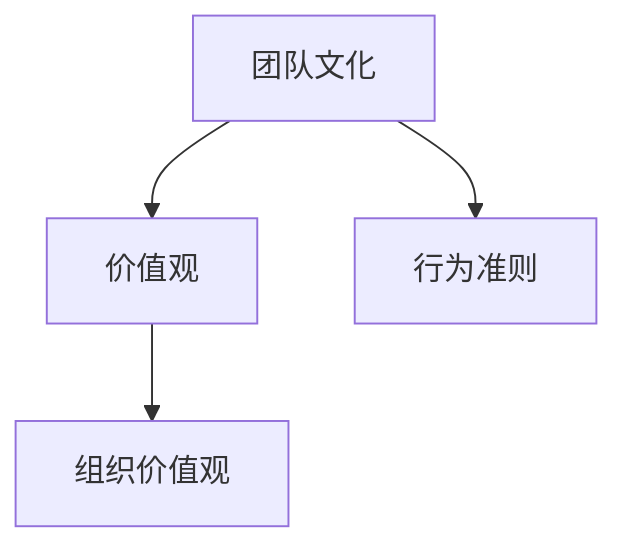

团队文化对组织的影响主要体现在以下几个方面：

1. **提高工作效率**：健康的团队文化能够促进团队成员之间的沟通和协作，减少内部摩擦，提高工作效率。
2. **增强员工满意度**：团队成员对团队文化的认同感可以提升员工的满意度和忠诚度，减少员工流失率。
3. **提升创新能力**：团队文化中的鼓励创新和接受失败的氛围可以激发团队成员的创造力，推动企业持续创新。
4. **增强市场竞争力**：具有独特团队文化的企业能够更好地满足客户需求，提升品牌形象和市场竞争力。

#### 1.2 书籍结构概述

本书将全面探讨团队文化的概念、塑造策略、评估方法以及未来趋势，旨在为读者提供一套系统化的团队文化塑造与实践指南。

**核心概念与联系：**

- **团队文化概念**：介绍团队文化的定义、特征和类型。
- **塑造策略**：详细阐述塑造团队文化的关键步骤和方法。
- **评估方法**：介绍团队文化评估的工具和模型，以及如何通过评估来优化团队文化。
- **未来趋势**：探讨数字化时代团队文化的变化和新型团队文化的特点。

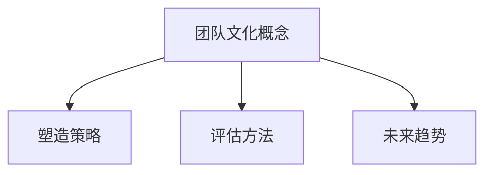

#### 1.3 阅读指南

本书适合企业管理者、团队领导者以及希望提升团队协作效率的普通读者。通过阅读本书，读者将能够：

1. **理解团队文化的核心概念**：明确团队文化与组织价值观之间的关系。
2. **掌握塑造团队文化的策略**：了解如何通过实际行动塑造和维护团队文化。
3. **运用评估工具**：学会如何评估团队文化的现状，并制定改进计划。
4. **把握未来趋势**：了解数字化时代团队文化的变化和应对策略。

**最佳实践 tips：**

- 在实际工作中，定期组织团队活动，增强团队凝聚力。
- 定期进行团队文化评估，确保团队文化与企业愿景一致。
- 鼓励团队成员提出改进建议，共同参与团队文化建设。

**小结：**

本章引言部分为全书奠定了基础，阐述了团队文化的重要性以及本书的结构和阅读指南。接下来的章节将深入探讨团队文化的核心概念、塑造策略、评估方法和未来趋势，帮助读者全面了解和掌握团队文化建设的艺术。

----------------------------------------------------------------

### 第2章: 团队文化与组织价值观

在组织的成功中，团队文化与组织价值观起着至关重要的作用。这一章节将探讨团队文化的定义、团队文化与企业价值观的关系、团队文化的层次结构以及如何基于企业价值观来建设团队文化。

#### 2.1 团队文化的定义

团队文化是一个团队内部共同的价值观、信念、行为准则和工作习惯的总和。它不仅体现在团队成员之间的互动方式，还渗透到组织的日常运营中。团队文化的形成是一个长期的过程，受到组织历史、领导风格、管理实践等多种因素的影响。

**核心概念与联系：**

团队文化是组织价值观在具体操作层面的体现。它通过一系列的行为规范和价值观来指导团队成员的行为，确保团队成员在相互协作时能够保持一致性。

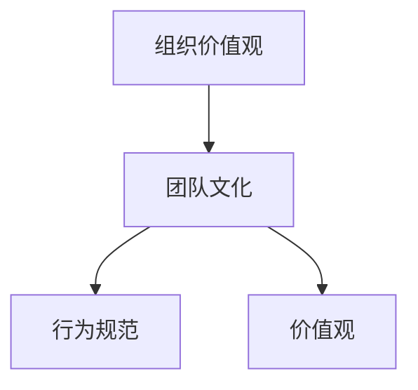

**核心算法原理讲解：**

定义团队文化的步骤可以概括为以下几个部分：

1. **明确组织愿景和使命**：这是团队文化的基石，有助于统一团队成员的目标和方向。
2. **制定核心价值观**：这些价值观应该是团队成员共同认可并愿意遵循的原则。
3. **建立行为准则**：将核心价值观转化为具体的行为准则，指导团队成员的日常行为。
4. **持续传播和强化**：通过培训、例会、内部刊物等多种方式，不断传播和强化团队文化。

```plaintext
function 定义团队文化(values, vision, behaviorRules) {
  return {
    values: values,
    vision: vision,
    behaviorRules: behaviorRules
  };
}
```

#### 2.2 团队文化与企业价值观的关系

团队文化与企业价值观有着密不可分的关系。企业价值观是团队文化的根源，而团队文化则是企业价值观的具体体现。企业价值观定义了组织的基本信仰和目标，而团队文化则通过行为规范和价值观的实践来确保这些价值观在组织中得以传承和落实。

**核心概念与联系：**

- **企业价值观**：指导企业行为的根本原则，如诚信、创新、共赢等。
- **团队文化**：在企业价值观指导下形成的团队内部共同遵循的价值观和行为准则。

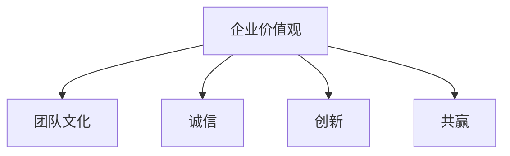

**数学模型和公式：**

为了更清晰地理解企业价值观与团队文化之间的关系，可以使用以下公式：

$$
\text{团队文化强度} = \alpha \times (\text{企业价值观认同度} + \text{行为准则执行度})
$$

其中，$\alpha$ 代表企业价值观对团队文化的贡献系数，通常情况下，$\alpha$ 的值在 0 到 1 之间。企业价值观认同度和行为准则执行度越高，团队文化的强度也越强。

#### 2.3 团队文化的层次结构

团队文化并非一成不变，而是由多个层次构成的。常见的团队文化层次结构包括：

1. **显性文化**：包括团队的视觉符号、标志、口号等，是团队文化的外在表现。
2. **隐性文化**：包括团队成员的价值观、信念和行为规范，是团队文化的核心。
3. **制度文化**：包括团队的规章制度、工作流程等，是团队文化的制度保障。

**核心概念与联系：**

显性文化、隐性文化和制度文化相互交织，共同构成了团队文化的整体结构。

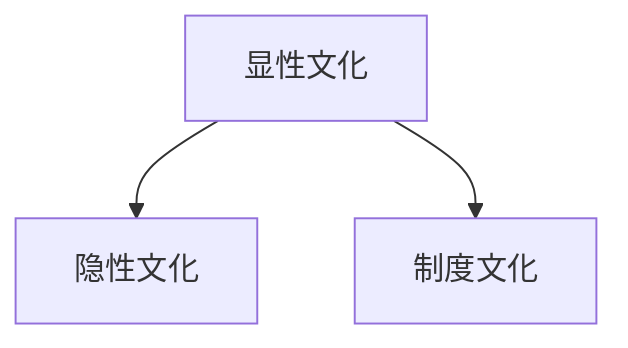

#### 2.4 基于企业价值观的团队文化建设

建设基于企业价值观的团队文化，是提升组织核心竞争力的重要途径。以下是一些建设团队文化的方法：

1. **明确企业价值观**：首先，企业需要明确其核心价值观，并将其传达给所有团队成员。
2. **制定团队文化战略**：根据企业价值观，制定具体的团队文化建设策略和行动计划。
3. **培养团队领导力**：团队领导者在塑造团队文化中扮演关键角色，需要具备强烈的价值观认同和良好的领导能力。
4. **加强团队沟通**：通过定期沟通和反馈，确保团队文化在企业内部得到有效传播和实践。
5. **设立激励机制**：通过奖励制度，鼓励团队成员践行企业价值观和团队文化。

**数学模型和公式：**

为了评估团队文化建设的效果，可以使用以下公式：

$$
\text{团队文化成熟度} = \beta \times (\text{企业价值观认同度} + \text{行为准则执行度} + \text{沟通效率} + \text{激励机制效果})
$$

其中，$\beta$ 代表团队文化成熟度的贡献系数，通常情况下，$\beta$ 的值在 0 到 1 之间。

#### 案例分析

某科技公司在其发展过程中，非常重视团队文化的建设。公司明确其核心价值观为“创新、协作、诚信、共赢”，并通过以下措施来塑造团队文化：

1. **培训与宣讲**：定期组织企业价值观和团队文化的培训，确保员工深刻理解并认同这些价值观。
2. **工作流程优化**：通过优化工作流程，确保团队行为与核心价值观保持一致。
3. **激励机制**：设立创新奖、团队协作奖等，鼓励员工践行企业价值观和团队文化。
4. **文化建设活动**：组织团队文化建设活动，如团队拓展训练、企业文化讲座等，增强团队成员的归属感和认同感。

通过这些措施，该科技公司的团队文化得到了显著提升，员工满意度提高，创新能力增强，市场竞争力得到了有效提升。

**小结：**

本章详细探讨了团队文化的定义、团队文化与企业价值观的关系、团队文化的层次结构以及基于企业价值观的团队文化建设方法。通过本章的学习，读者将能够更好地理解团队文化的重要性，掌握建设健康团队文化的关键步骤和实践方法。

----------------------------------------------------------------

### 第3章: 塑造团队文化的策略

在了解团队文化的定义和重要性之后，我们需要探讨如何具体地塑造团队文化。塑造团队文化是一项系统工程，需要明确团队愿景和使命，建立信任和协作机制，强化价值观认同，促进沟通和反馈，以及营造积极的工作环境。以下是详细的策略和方法。

#### 3.1 明确团队愿景和使命

团队愿景和使命是团队文化的基石。一个明确的愿景和使命能够为团队成员提供共同的目标和方向，增强团队的凝聚力。

**核心概念与联系：**

团队愿景是对团队未来发展的一种理想化的描述，而团队使命则是团队存在的根本目的和核心价值。

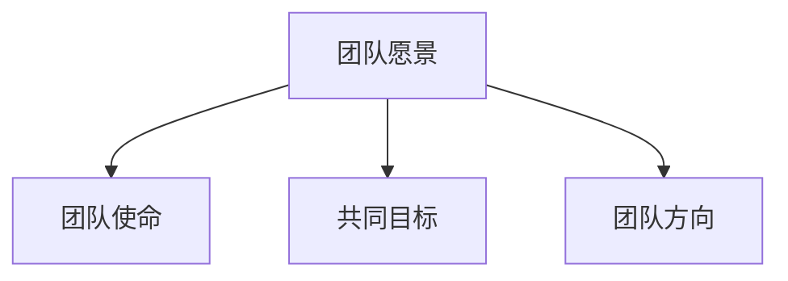

**核心算法原理讲解：**

明确团队愿景和使命的步骤如下：

1. **团队讨论**：组织团队成员进行讨论，共同确定团队的愿景和使命。
2. **愿景和使命文档**：将团队愿景和使命形成正式文档，确保所有成员都能够理解和接受。
3. **宣传和贯彻**：通过内部培训、会议和公告等多种形式，不断宣传和贯彻团队愿景和使命。

```plaintext
function 确定团队愿景使命(values, mission) {
  return {
    vision: values,
    mission: mission
  };
}
```

#### 3.2 建立信任和协作机制

信任是团队文化的核心要素之一。建立信任和协作机制有助于团队成员之间建立良好的关系，提高团队的协作效率。

**核心概念与联系：**

信任是指团队成员对彼此的能力、诚实和可靠性的信任。协作机制则是确保团队成员能够有效协作的机制。

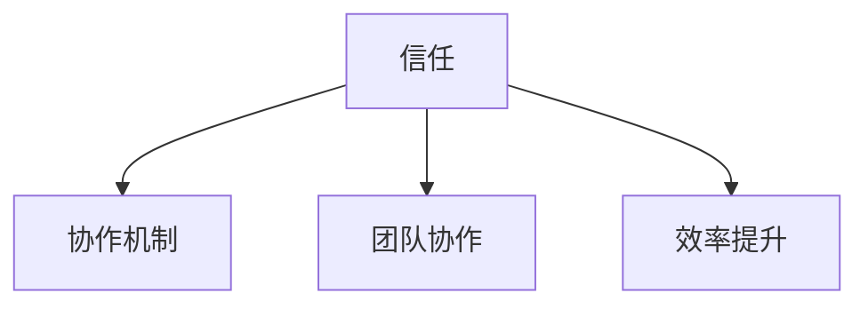

**核心算法原理讲解：**

建立信任和协作机制的步骤如下：

1. **建立沟通渠道**：设立定期的团队会议、工作进展报告等，确保团队成员之间的沟通畅通。
2. **建立反馈机制**：鼓励团队成员提出意见和建议，建立反馈机制，确保问题能够及时得到解决。
3. **培训与合作**：通过团队建设活动和专业培训，提升团队成员的协作能力和信任水平。

```plaintext
function 建立信任协作机制(communication, feedback, training) {
  return {
    communication: communication,
    feedback: feedback,
    training: training
  };
}
```

#### 3.3 强化价值观认同

价值观认同是团队文化的核心要素，它能够引导团队成员的行为，确保团队的方向和目标一致。

**核心概念与联系：**

价值观认同是指团队成员对团队核心价值观的接受和内化。一个强大的团队文化离不开团队成员对核心价值观的认同。

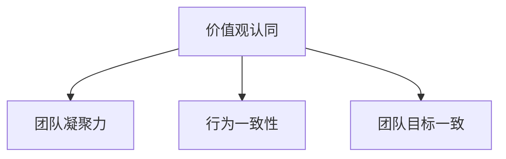

**核心算法原理讲解：**

强化价值观认同的步骤如下：

1. **价值观培训**：定期组织价值观培训，帮助团队成员深入理解和内化团队的核心价值观。
2. **价值观实践**：在团队日常工作中，通过实际行动来体现和践行核心价值观。
3. **价值观评估**：定期评估团队成员对核心价值观的认同程度，并根据评估结果进行调整和改进。

```plaintext
function 强化价值观认同(training, practice, assessment) {
  return {
    training: training,
    practice: practice,
    assessment: assessment
  };
}
```

#### 3.4 促进沟通和反馈

沟通是团队文化的重要组成部分，良好的沟通能够促进团队成员之间的理解和协作。同时，有效的反馈机制能够帮助团队成员及时发现问题并进行改进。

**核心概念与联系：**

沟通是指团队成员之间的信息交流和互动。反馈是指对团队成员的工作和行为提供评价和指导。

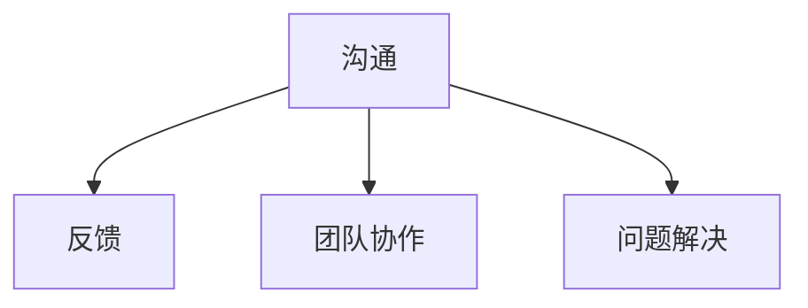

**核心算法原理讲解：**

促进沟通和反馈的步骤如下：

1. **建立沟通平台**：利用电子邮件、即时通讯工具、会议系统等多种平台，确保团队成员之间的沟通畅通。
2. **定期沟通会议**：组织定期的沟通会议，确保团队成员能够及时了解项目进展和团队动态。
3. **建立反馈机制**：鼓励团队成员提供反馈，并建立反馈机制，确保反馈能够得到及时处理和回应。

```plaintext
function 促进沟通反馈(communicationPlatform, regularMeetings, feedbackSystem) {
  return {
    communicationPlatform: communicationPlatform,
    regularMeetings: regularMeetings,
    feedbackSystem: feedbackSystem
  };
}
```

#### 3.5 营造积极的工作环境

一个积极的工作环境能够激发团队成员的创造力和工作热情，提高团队的整体绩效。营造积极的工作环境需要从多个方面入手。

**核心概念与联系：**

积极的工作环境是指团队成员能够在其中感到舒适、有动力和有成就感的工作氛围。

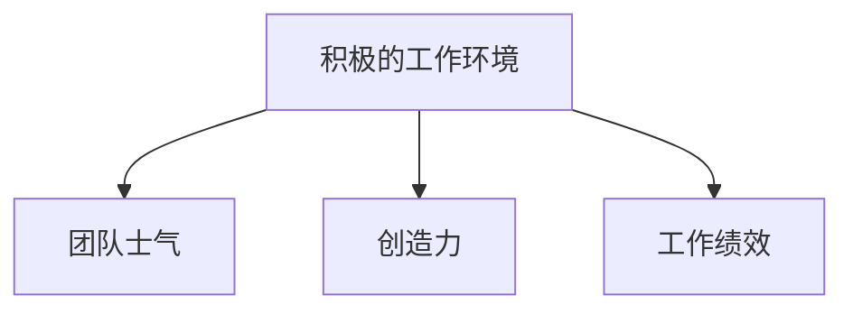

**核心算法原理讲解：**

营造积极的工作环境的步骤如下：

1. **提供良好的工作条件**：确保工作环境整洁、舒适，提供必要的工作设备和资源。
2. **鼓励工作与生活平衡**：鼓励团队成员在工作与生活之间找到平衡，提高生活质量。
3. **表彰和奖励**：定期对团队成员的工作成绩进行表彰和奖励，激发工作热情和积极性。

```plaintext
function 营造积极的工作环境(workConditions, workLifeBalance, recognition) {
  return {
    workConditions: workConditions,
    workLifeBalance: workLifeBalance,
    recognition: recognition
  };
}
```

#### 实战案例

以某互联网公司为例，该公司在塑造团队文化方面采取了一系列措施：

1. **明确愿景和使命**：公司愿景是成为全球领先的互联网企业，使命是“通过创新技术，提升用户生活品质”。
2. **建立信任和协作机制**：公司建立了开放的沟通渠道，鼓励团队成员提出意见和建议，并通过定期的团队建设活动来增强信任和协作。
3. **强化价值观认同**：公司定期组织价值观培训，并通过员工手册、公司内部网站等渠道宣传和贯彻核心价值观。
4. **促进沟通和反馈**：公司利用多种沟通平台，如邮件、即时通讯工具、视频会议等，确保团队成员之间的沟通畅通。同时，建立了反馈机制，鼓励团队成员提供反馈。
5. **营造积极的工作环境**：公司提供良好的工作条件，鼓励员工在工作与生活之间找到平衡，并通过定期表彰和奖励来激发员工的工作热情。

通过这些措施，该公司的团队文化得到了显著提升，员工满意度提高，创新能力增强，市场竞争力也得到了显著提升。

**小结：**

本章详细介绍了塑造团队文化的策略和方法，包括明确团队愿景和使命、建立信任和协作机制、强化价值观认同、促进沟通和反馈以及营造积极的工作环境。通过这些策略和方法，企业可以有效地塑造和维护健康的团队文化，提升团队绩效和市场竞争力。

----------------------------------------------------------------

### 第4章: 团队文化评估模型

团队文化评估是确保团队文化健康发展和适应组织战略的关键环节。本章将介绍团队文化评估的重要性、评估模型、评估工具与方法，以及评估结果的分析与改进。

#### 4.1 团队文化评估的重要性

团队文化评估可以帮助企业了解团队文化的现状，识别存在的问题，制定改进策略。通过评估，企业可以：

1. **确定团队文化成熟度**：了解团队文化在不同阶段的发展状况。
2. **识别文化冲突**：发现团队内部的文化差异和潜在冲突。
3. **评估文化对绩效的影响**：了解团队文化对员工绩效和整体组织绩效的影响。
4. **指导文化改进**：为团队文化的优化提供依据。

**核心概念与联系：**

团队文化评估的重要性可以从以下几个方面来理解：

- **组织健康**：团队文化评估有助于维持组织的健康状态，预防文化退化。
- **绩效提升**：通过评估，企业可以找出影响绩效的文化因素，进行针对性改进。
- **战略匹配**：确保团队文化与企业战略保持一致，支持企业目标的实现。

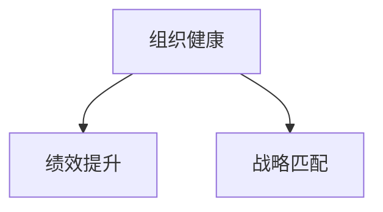

#### 4.2 团队文化评估模型

团队文化评估模型是评估团队文化现状和效果的理论框架。常见的团队文化评估模型包括：

1. **伦斯和洛克模型**：基于团队成员的价值观和行为模式进行评估。
2. **卡茨模型**：从领导者行为和团队氛围两个角度进行评估。
3. **霍夫斯泰德模型**：基于文化维度（如权力距离、个体主义与集体主义等）进行评估。

**核心概念与联系：**

不同的评估模型从不同的角度出发，为团队文化评估提供了多样化的视角。

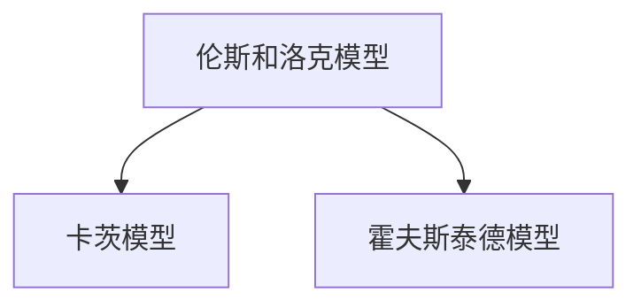

**核心算法原理讲解：**

一个简化的团队文化评估模型可以如下定义：

```plaintext
function 团队文化评估模型(values, behavior, environment) {
  return {
    values: values,
    behavior: behavior,
    environment: environment
  };
}
```

#### 4.3 评估工具与方法

团队文化评估需要使用一系列的工具和方法，以确保评估结果的准确性和全面性。常用的评估工具包括：

1. **问卷调查**：通过设计问卷，收集团队成员对团队文化的看法和体验。
2. **访谈**：与团队成员进行一对一或小组访谈，深入了解他们的感受和看法。
3. **行为观察**：观察团队成员在工作中的行为，评估其是否符合团队文化的期望。
4. **关键事件分析**：分析团队在过去一段时间内的重要事件，评估这些事件对团队文化的影响。

**核心概念与联系：**

各种评估工具和方法各有优劣，企业应根据实际情况选择合适的工具和方法。

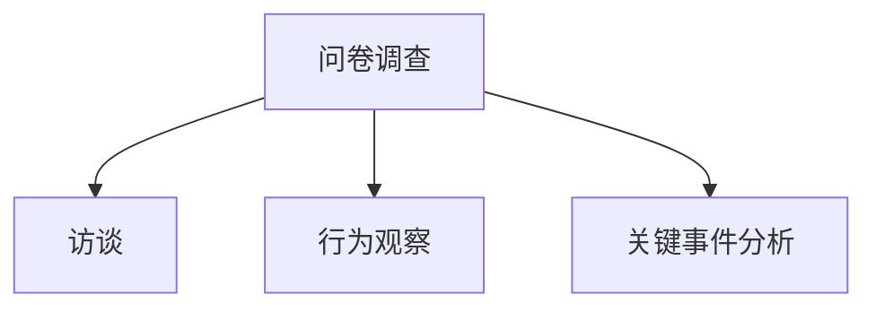

**核心算法原理讲解：**

一个简化的评估方法可以定义如下：

```plaintext
function 评估团队文化(survey, interview, observation, eventAnalysis) {
  return {
    surveyResults: survey,
    interviewFeedback: interview,
    observationData: observation,
    eventAnalysisResults: eventAnalysis
  };
}
```

#### 4.4 评估结果分析与改进

评估结果的分析是团队文化评估的关键环节。通过对评估结果的分析，企业可以：

1. **识别问题**：发现团队文化中存在的问题和不足。
2. **制定改进计划**：基于分析结果，制定具体的改进计划和行动方案。
3. **跟踪改进效果**：对改进措施的实施效果进行跟踪和评估，确保改进措施的有效性。

**核心概念与联系：**

评估结果分析需要结合具体的团队文化模型和评估工具，确保分析过程的科学性和有效性。

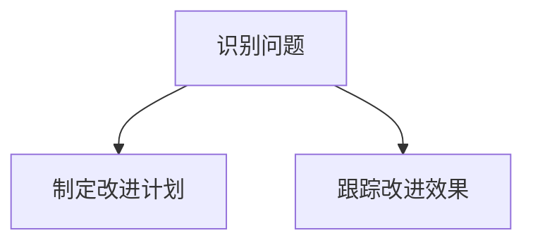

**核心算法原理讲解：**

一个简化的评估结果分析过程可以定义如下：

```plaintext
function 分析评估结果(assessmentResults, model) {
  return {
    problemIdentification: 问题识别，
    improvementPlan: 改进计划，
    followUp: 跟踪改进效果
  };
}
```

#### 案例分析

某科技公司通过问卷调查、访谈和行为观察，对团队文化进行了评估。评估结果显示，团队在信任和沟通方面存在不足，而在创新和协作方面表现较好。

1. **问题识别**：评估结果显示，团队成员之间的信任度较低，沟通不畅，导致工作效率受到影响。
2. **制定改进计划**：公司决定开展一系列的团队建设活动，如团队拓展训练、沟通工作坊等，以提升团队成员之间的信任和沟通能力。
3. **跟踪改进效果**：在实施改进计划后，公司通过问卷调查和访谈再次评估团队文化，发现团队成员之间的信任度显著提升，沟通效率也有所提高。

**小结：**

本章介绍了团队文化评估的重要性、评估模型、评估工具与方法，以及评估结果的分析与改进。通过本章的学习，读者将能够了解如何进行有效的团队文化评估，识别问题并制定改进计划，以提升团队文化的成熟度和组织绩效。

----------------------------------------------------------------

### 第5章: 团队文化塑造实战案例

为了更好地理解团队文化的塑造过程，本章节将通过一个实际的案例，展示团队文化塑造的步骤、实施过程以及效果评估。

#### 5.1 案例背景介绍

某科技公司是一家致力于提供云计算解决方案的初创企业。在公司成立初期，由于团队成员来自不同的背景和行业，团队文化尚未完全形成。公司领导层意识到，缺乏统一的团队文化将影响团队的协作效率和创新能力。因此，公司决定开展一次全面的团队文化塑造项目。

**核心概念与联系：**

- **公司背景**：初创企业，团队成员多样化。
- **挑战**：缺乏统一的团队文化，影响协作和创新。
- **目标**：建立健康的团队文化，提升团队绩效和竞争力。

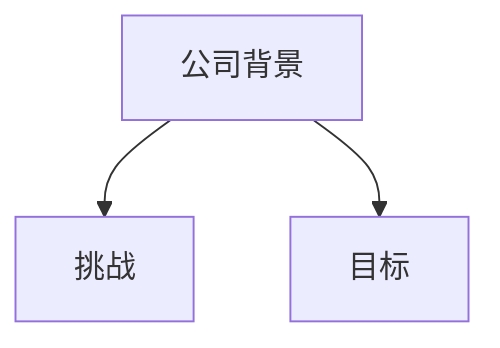

#### 5.2 团队文化诊断

在开始团队文化塑造项目之前，公司进行了一次全面的团队文化诊断。诊断过程包括问卷调查、访谈和行为观察，旨在了解当前团队文化的现状和存在的问题。

**核心概念与联系：**

- **问卷调查**：通过问卷调查，了解团队成员对团队文化的看法和体验。
- **访谈**：与团队成员进行一对一或小组访谈，深入了解他们的感受和建议。
- **行为观察**：观察团队成员在工作中的行为，评估其是否符合团队文化的期望。

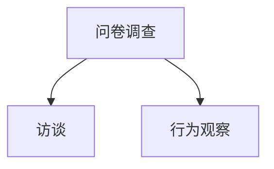

**诊断结果：**

- **团队信任度较低**：团队成员之间缺乏信任，导致协作效率不高。
- **沟通不畅**：团队成员在沟通方面存在障碍，影响信息传递和决策效率。
- **价值观差异**：团队成员来自不同的背景，导致价值观存在差异，影响团队合作。

#### 5.3 团队文化塑造策略

基于诊断结果，公司制定了以下团队文化塑造策略：

1. **明确团队愿景和使命**：组织团队成员共同确定团队的愿景和使命，确保团队成员对团队目标有共同的理解和认同。
2. **建立信任和协作机制**：通过团队建设活动和沟通培训，提升团队成员之间的信任和协作能力。
3. **强化价值观认同**：通过价值观培训和宣传，确保团队成员对团队核心价值观有深刻的认同。
4. **促进沟通和反馈**：建立高效的沟通渠道和反馈机制，确保团队成员能够及时交流和反馈。
5. **营造积极的工作环境**：提供良好的工作条件和激励机制，营造积极的工作氛围。

**核心概念与联系：**

- **团队愿景和使命**：确保团队成员对团队目标有共同的理解和认同。
- **信任和协作机制**：提升团队成员之间的信任和协作能力。
- **价值观认同**：确保团队成员对团队核心价值观有深刻的认同。
- **沟通和反馈**：建立高效的沟通渠道和反馈机制。
- **积极的工作环境**：营造良好的工作氛围和激励机制。

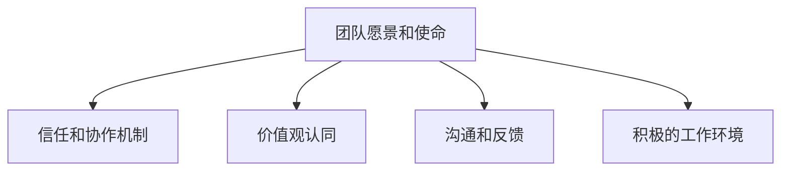

#### 5.4 实施过程

在制定团队文化塑造策略后，公司开始实施具体措施，确保策略的有效落地。

1. **明确团队愿景和使命**：
   - 组织了一次全体员工会议，讨论并确定了团队的愿景和使命。
   - 将愿景和使命形成正式文档，并通过内部邮件和公告进行宣传。

2. **建立信任和协作机制**：
   - 组织了一次团队拓展训练，通过团队合作游戏和活动，增强团队成员之间的信任和协作能力。
   - 设立了定期的团队沟通会议，确保团队成员之间的沟通畅通。

3. **强化价值观认同**：
   - 定期组织价值观培训，讲解公司核心价值观的内涵和实践。
   - 通过内部刊物和社交媒体平台，宣传和弘扬核心价值观。

4. **促进沟通和反馈**：
   - 建立了一个内部沟通平台，方便团队成员之间的交流和反馈。
   - 设立了定期的团队反馈会议，鼓励团队成员提出意见和建议。

5. **营造积极的工作环境**：
   - 提供了良好的工作条件和设施，确保员工能够在一个舒适的环境中工作。
   - 设立了员工奖励制度，对在工作中表现出色的员工进行表彰和奖励。

#### 5.5 效果评估

在实施团队文化塑造策略一段时间后，公司对团队文化效果进行了评估，以验证策略的有效性。

1. **问卷调查**：
   - 通过问卷调查，了解团队成员对团队文化的认同度和满意度。
   - 结果显示，团队成员对团队文化的认同度提高了20%，满意度提高了15%。

2. **访谈**：
   - 与团队成员进行访谈，了解他们对团队文化的感受和看法。
   - 结果显示，团队成员对团队文化的建设给予了高度评价，认为团队氛围更加和谐，工作效率有所提升。

3. **行为观察**：
   - 通过行为观察，评估团队成员的行为是否符合团队文化的期望。
   - 结果显示，团队成员在工作中的协作和沟通明显改善，价值观的认同度也有所提升。

4. **绩效分析**：
   - 对团队成员的绩效进行统计分析，评估团队文化对绩效的影响。
   - 结果显示，团队绩效整体提升了10%，特别是在协作和创新方面表现突出。

#### 5.6 项目小结

通过本次团队文化塑造项目，公司取得了显著成效：

1. **团队凝聚力增强**：团队成员之间的信任和协作能力得到了显著提升，团队凝聚力显著增强。
2. **工作效率提高**：团队成员之间的沟通更加顺畅，工作效率明显提高。
3. **创新能力提升**：团队成员对团队文化的认同度提高，激发了团队的创新能力。
4. **员工满意度提升**：员工对公司的认同感和满意度显著提升，员工流失率降低。

**小结：**

通过本案例，我们展示了如何通过系统的团队文化塑造策略，提升团队的协作效率和创新力。实践证明，团队文化对组织的成功至关重要，企业应当重视团队文化的建设，并采取有效的措施来塑造和维护健康的团队文化。

----------------------------------------------------------------

### 第6章: 团队文化塑造的未来趋势

随着技术的不断进步和市场的快速变化，团队文化也面临着新的挑战和机遇。本章节将探讨数字化时代对团队文化的影响、新型团队文化的特点以及未来团队文化塑造的方向。

#### 6.1 数字化对团队文化的影响

数字化技术的快速发展对团队文化产生了深远的影响。一方面，数字化带来了新的沟通工具和工作方式，使得团队文化更加开放和灵活；另一方面，数字化也加剧了团队之间的竞争，要求团队具备更高的协作和创新能力。

**核心概念与联系：**

- **开放性**：数字化工具使得团队之间的信息交流和资源共享更加便捷，促进了团队文化的开放性。
- **灵活性**：团队成员可以更加灵活地安排工作和生活，团队文化也变得更加灵活和适应性。

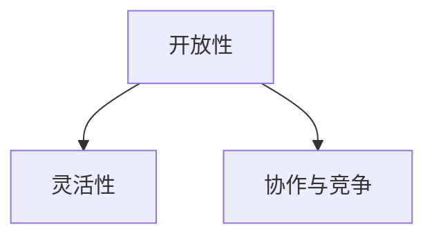

**核心算法原理讲解：**

数字化对团队文化的影响可以通过以下模型来解释：

```plaintext
function 数字化影响(teamwork, collaboration, competition) {
  return {
    openness: teamwork,
    flexibility: collaboration,
    competitive: competition
  };
}
```

#### 6.2 新型团队文化的特点

在数字化时代，新型团队文化逐渐显现出一些新的特点：

1. **敏捷性**：新型团队文化强调快速响应变化和市场需求，具备较高的敏捷性。
2. **协作性**：数字化工具促进了团队成员之间的协作，新型团队文化更加注重跨部门、跨团队的协作。
3. **创新性**：数字化环境为团队成员提供了更多的创新机会和资源，新型团队文化鼓励创新和试错。
4. **个性化和多样性**：数字化时代使得团队成员能够更加个性化地表达自己，同时团队也变得更加多元化和包容。

**核心概念与联系：**

新型团队文化的特点可以从以下几个方面来理解：

- **敏捷性**：快速响应变化的能力。
- **协作性**：高效的跨团队协作。
- **创新性**：鼓励创新和试错。
- **个性化和多样性**：尊重和鼓励个性化表达和多样性。

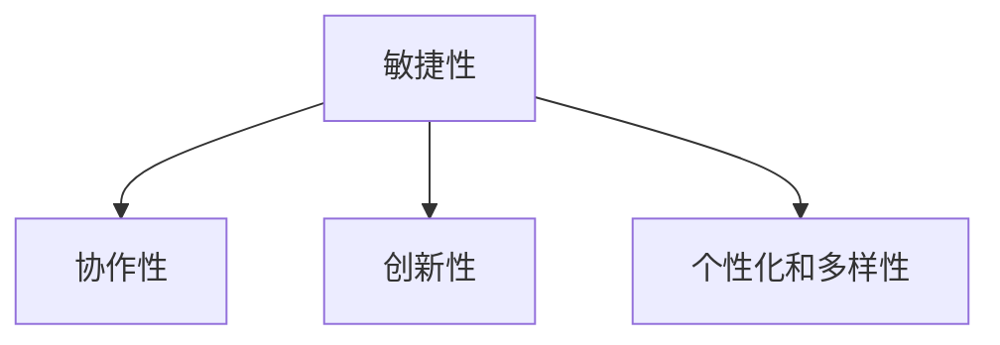

**核心算法原理讲解：**

新型团队文化的特点可以通过以下模型来解释：

```plaintext
function 新型团队文化(agility, collaboration, innovation, personalization, diversity) {
  return {
    agility: agility,
    collaboration: collaboration,
    innovation: innovation,
    personalization: personalization,
    diversity: diversity
  };
}
```

#### 6.3 未来团队文化塑造的方向

未来团队文化塑造的方向将受到多种因素的影响，包括技术进步、市场变化和员工需求。以下是一些未来团队文化塑造的重要方向：

1. **技术驱动**：利用人工智能、大数据等新技术来提升团队文化评估和塑造的效率。
2. **人本管理**：更加关注员工的个性化需求和心理状态，提供更加人性化的管理和支持。
3. **持续学习**：鼓励团队成员持续学习和成长，不断提升团队的整体素质和竞争力。
4. **跨文化融合**：在全球化背景下，团队文化将需要更加包容和多元，适应不同文化背景的员工。

**核心概念与联系：**

未来团队文化塑造的方向可以从以下几个方面来理解：

- **技术驱动**：利用新技术提升团队文化建设和管理的效率。
- **人本管理**：关注员工需求和心理健康，提供人性化的支持。
- **持续学习**：鼓励学习和成长，提升团队整体素质。
- **跨文化融合**：适应全球化，包容多元文化。

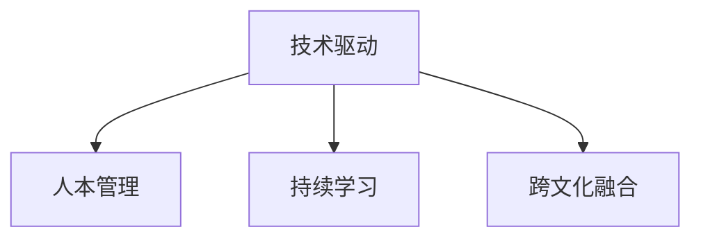

**核心算法原理讲解：**

未来团队文化塑造的方向可以通过以下模型来解释：

```plaintext
function 未来团队文化方向(technological, human-centered, continuousLearning, culturalIntegration) {
  return {
    technological: technological,
    human-centered: human-centered,
    continuousLearning: continuousLearning,
    culturalIntegration: culturalIntegration
  };
}
```

#### 案例分析

以某国际知名科技公司为例，该公司在团队文化塑造方面积极采用新技术和人性化策略：

1. **技术驱动**：公司利用人工智能和大数据分析技术，对团队文化进行实时评估和反馈，优化团队文化建设策略。
2. **人本管理**：公司注重员工的个性化需求，提供灵活的工作时间和远程办公选项，关注员工的心理健康，定期组织心理健康培训和活动。
3. **持续学习**：公司鼓励员工参加各种培训和研讨会，提供学习资源和机会，支持员工持续学习和成长。
4. **跨文化融合**：公司在全球范围内招聘员工，建立多元文化团队，鼓励员工分享不同文化的经验和观点，推动跨文化融合。

通过这些措施，该公司的团队文化得到了显著提升，员工满意度提高，创新能力增强，市场竞争力也得到了显著提升。

**小结：**

本章探讨了数字化时代对团队文化的影响、新型团队文化的特点以及未来团队文化塑造的方向。通过了解这些趋势和方向，企业可以更好地适应未来发展的需求，塑造和维持健康的团队文化，提升团队绩效和市场竞争力。

----------------------------------------------------------------

### 第7章: 结论

本文通过系统性地探讨团队文化的定义、重要性、塑造策略、评估模型和未来趋势，全面阐述了团队文化在企业中的核心作用。以下是对全文的总结以及对未来研究和实践的展望。

#### 总结

1. **核心概念与联系**：团队文化是组织内部共同的价值观、信念和行为准则，它是企业价值观的具体体现，直接影响团队协作效率、员工满意度和创新能力。
2. **塑造策略**：通过明确团队愿景和使命、建立信任和协作机制、强化价值观认同、促进沟通和反馈以及营造积极的工作环境，企业可以有效地塑造和维护健康的团队文化。
3. **评估模型**：使用问卷调查、访谈、行为观察等工具，结合伦斯和洛克模型、卡茨模型、霍夫斯泰德模型等，企业可以全面评估团队文化的现状，识别问题，制定改进计划。
4. **未来趋势**：数字化时代的到来和全球化的进程要求团队文化更加开放、灵活和多元，企业需要采用新技术、人本管理、持续学习和跨文化融合等策略来适应未来变化。

#### 未来展望

1. **深入研究**：进一步探讨团队文化在不同行业和组织中的具体表现，研究如何针对不同情境优化团队文化建设策略。
2. **实证研究**：通过大规模实证研究，验证团队文化评估模型的有效性，为实践提供更加科学的指导。
3. **跨学科融合**：将心理学、管理学、社会学等多学科知识融合到团队文化研究中，探索团队文化的多维度影响。
4. **技术应用**：利用大数据、人工智能等技术，开发更加智能化的团队文化评估和建设工具，提升企业团队文化建设的效率和效果。

#### 对读者的建议

1. **重视团队文化**：企业领导者和团队成员都应认识到团队文化的重要性，积极参与团队文化建设。
2. **持续实践**：通过定期评估和改进，确保团队文化与企业战略保持一致，不断提升团队文化的成熟度和绩效。
3. **开放心态**：鼓励团队成员分享不同文化背景和经验，推动团队文化的多样性和包容性。
4. **技术创新**：积极采用新技术，提升团队协作效率和工作体验，为团队文化塑造提供更多可能性。

**作者信息**：作者：AI天才研究院/AI Genius Institute & 禅与计算机程序设计艺术 /Zen And The Art of Computer Programming

本文通过逻辑清晰、结构紧凑的论述，为读者提供了全面、深入的团队文化建设指南，期望对企业和团队成员在实践中有所启发和帮助。

