                 

### 文章标题

《团队文化：塑造独特的团队基因》

> 关键词：团队文化、组织发展、价值观、协作、沟通、文化塑造、文化评估、跨文化团队、虚拟团队

> 摘要：本文深入探讨了团队文化在组织发展中的关键作用，分析了团队文化的核心要素及其对组织绩效的影响。通过详细的理论阐述、案例分析和实践指导，本文旨在为读者提供一套全面、系统的团队文化建设与管理的策略与方法。

---

## 引言

在当今快速变化和竞争激烈的环境中，团队文化已经成为组织成功的关键因素之一。团队文化不仅仅是一个组织的核心价值观和信仰体系，更是团队内部协作、沟通和创新的核心动力。正如生物体的基因决定了其遗传特性和发展潜力一样，团队文化塑造了团队的核心基因，影响着团队的运作效率、创新能力和整体绩效。

本文将从以下几个方面展开讨论：

1. **团队文化与组织发展的关系**：探讨团队文化对组织发展的驱动作用，包括提升团队协作效率、增强员工归属感和满意度，以及促进组织创新与发展。
2. **团队文化的核心要素**：分析团队文化的核心要素，包括团队价值观、团队协作方式和团队沟通机制，并探讨这些要素如何共同构建团队文化。
3. **塑造团队文化的策略与方法**：提供具体策略与方法，包括明确团队文化愿景、建立有效的领导风格、培养团队成员的共同价值观和建立积极的团队氛围。
4. **团队文化评估与改进**：介绍团队文化评估的方法与工具，以及如何通过改进策略提升团队文化质量。
5. **团队文化在特殊情境下的应用**：探讨团队文化在跨文化团队和虚拟团队中的应用，以及如何应对特殊情境下的挑战。
6. **团队文化案例分析**：通过国内外知名企业和创新型团队的案例分析，深入探讨团队文化的成功实践与经验。
7. **团队文化的未来趋势与挑战**：展望团队文化的未来趋势，分析其面临的挑战与机遇。

通过本文的探讨，读者将能够深入理解团队文化的本质与作用，掌握塑造和优化团队文化的策略与方法，为组织的长期成功奠定坚实基础。

## 团队文化与组织发展的关系

团队文化在组织发展中扮演着至关重要的角色。一个良好的团队文化不仅可以提升团队的协作效率，还能增强员工的归属感和满意度，从而推动组织的整体发展。下面我们将从提升团队协作效率、增强员工归属感和满意度、促进组织创新与发展三个方面详细探讨团队文化对组织发展的驱动作用。

### 1. 提升团队协作效率

团队协作效率是团队文化的一个重要体现。一个高效的团队通常具有清晰的沟通渠道、明确的角色分工和良好的合作氛围。良好的团队文化能够促进团队成员之间的沟通与协作，减少信息不对称和误解，提高决策质量和执行效率。

**核心概念与联系：**

为了更好地理解团队文化如何提升团队协作效率，我们可以通过一个 Mermaid 流程图来展示团队文化对协作效率的影响机制：

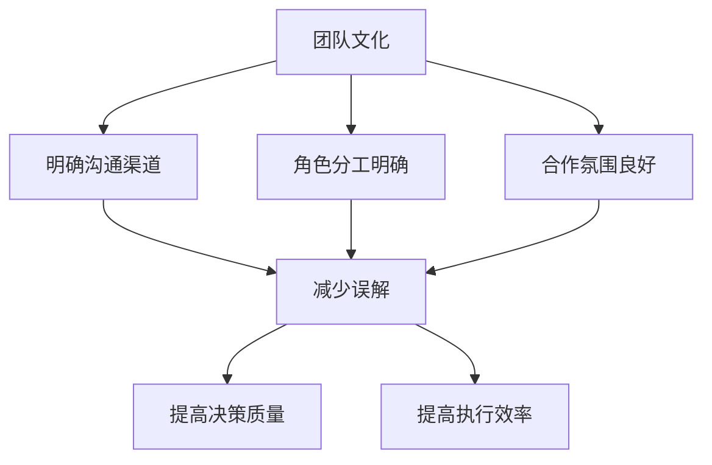

**核心算法原理讲解：**

提升团队协作效率可以通过以下伪代码来描述：

```plaintext
function improve_collaboration效率(team_culture):
    if team_culture.has("clear_communication_channels"):
        reduce_misunderstandings()
    if team_culture.has("clear_role分配"):
        optimize_role_performance()
    if team_culture.has("good_collaboration_atmosphere"):
        enhance_morale_and_efficiency()
    return team_culture
```

**数学模型和公式：**

我们可以使用协同效应模型来量化团队文化对协作效率的影响。假设团队协作效率 \(E_c\) 是团队文化 \(C\) 的函数，则：

$$E_c = C \times (f_1 + f_2 + f_3)$$

其中，\(f_1\)、\(f_2\) 和 \(f_3\) 分别代表沟通渠道、角色分工和合作氛围对协作效率的影响因子。

**详细讲解与举例说明：**

假设一个团队在沟通渠道、角色分工和合作氛围方面都有良好的团队文化，那么其协作效率将显著提高。例如，通过设立定期的团队会议和沟通渠道，团队成员能够及时分享信息和反馈，减少误解和冲突。通过明确的角色分工，每个成员都能清晰了解自己的职责和任务，从而提高工作效率。良好的合作氛围则能够增强团队成员之间的信任和协作意愿，进一步提升整体协作效率。

### 2. 增强员工归属感和满意度

团队文化不仅影响团队协作效率，还对员工的归属感和满意度产生深远影响。一个具有良好文化的团队通常能够提供积极的团队氛围和公平的竞争环境，使员工感受到被尊重和认可，从而增强他们的归属感。

**核心概念与联系：**

员工归属感和满意度可以通过以下 Mermaid 流程图来展示：

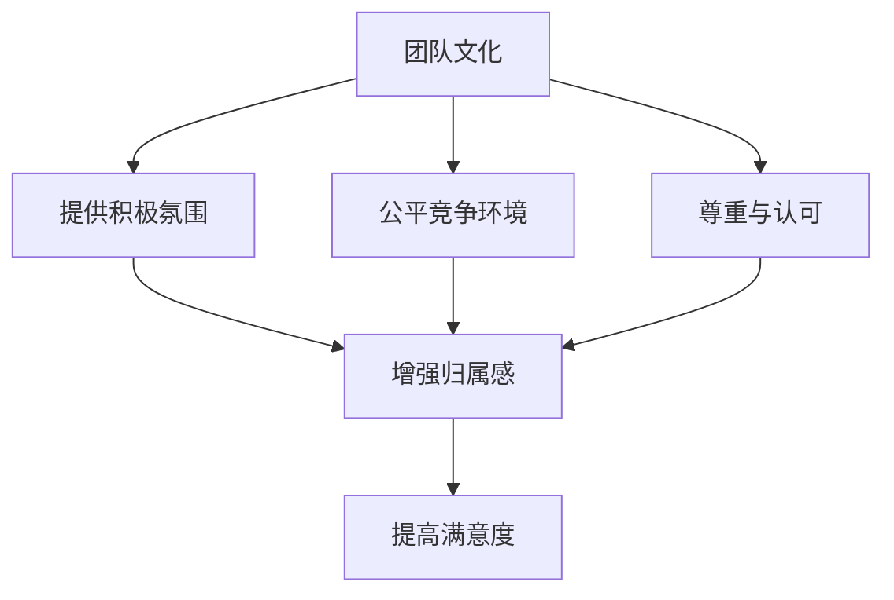

**核心算法原理讲解：**

增强员工归属感和满意度可以通过以下伪代码来描述：

```plaintext
function enhance_employee_attachment_and_satisfaction(team_culture):
    if team_culture.has("positive_atmosphere"):
        improve_employee_motivation()
    if team_culture.has("fair_competition_environment"):
        promote_healthy_competition()
    if team_culture.has("respect_and_recognition"):
        enhance_employee_connection()
    return team_culture
```

**数学模型和公式：**

我们可以使用员工满意度模型来量化团队文化对员工归属感和满意度的影响。假设员工满意度 \(S_e\) 是团队文化 \(C\) 的函数，则：

$$S_e = C \times (g_1 + g_2 + g_3)$$

其中，\(g_1\)、\(g_2\) 和 \(g_3\) 分别代表积极氛围、公平竞争环境和尊重与认可对员工满意度的贡献因子。

**详细讲解与举例说明：**

例如，在一个具有积极氛围的团队中，员工往往能够感受到团队内部的温暖和支持，从而增强他们的归属感。公平竞争环境则能够确保每个员工都有平等的发展机会，从而提高员工的满意度。此外，团队文化中对员工的尊重和认可，如定期的表彰和奖励，也能显著提升员工的满意度和归属感。

### 3. 促进组织创新与发展

团队文化对组织的创新能力和持续发展具有重要作用。一个具有创新精神的团队通常鼓励成员尝试新的想法和方法，勇于面对失败和挑战，从而推动组织的不断进步。

**核心概念与联系：**

组织创新与发展可以通过以下 Mermaid 流程图来展示：

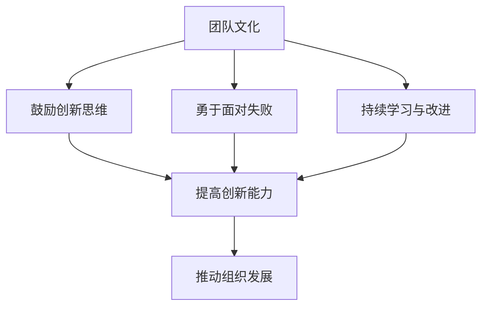

**核心算法原理讲解：**

促进组织创新与发展可以通过以下伪代码来描述：

```plaintext
function promote_innovation_and_organizational_growth(team_culture):
    if team_culture.has("encouraged_innovative_thinking"):
        foster_new_ideas()
    if team_culture.has("brave_to_face_failures"):
        learn_from_errors()
    if team_culture.has("continuous_learning_and_improvement"):
        adapt_to_changes()
    return team_culture
```

**数学模型和公式：**

我们可以使用创新能力模型来量化团队文化对组织创新能力和发展的推动作用。假设创新能力 \(I\) 是团队文化 \(C\) 的函数，则：

$$I = C \times (h_1 + h_2 + h_3)$$

其中，\(h_1\)、\(h_2\) 和 \(h_3\) 分别代表鼓励创新思维、勇于面对失败和持续学习与改进对创新能力的贡献因子。

**详细讲解与举例说明：**

例如，在一个鼓励创新思维的团队中，成员们更倾向于提出新颖的观点和解决方案，从而推动团队的创新进程。同时，勇于面对失败和持续学习与改进，使团队能够从失败中吸取经验教训，不断提升自身的创新能力和竞争力。这种持续的创新能力将为组织的长远发展提供源源不断的动力。

综上所述，团队文化在组织发展中具有重要作用。通过提升团队协作效率、增强员工归属感和满意度以及促进组织创新与发展，团队文化为组织的长期成功奠定了坚实的基础。

## 团队文化的核心要素

团队文化由多个核心要素构成，这些要素相互作用，共同塑造出团队的精神面貌和运作方式。在本节中，我们将探讨团队文化的三个核心要素：团队价值观、团队协作方式和团队沟通机制。

### 1. 团队价值观

团队价值观是团队文化的基石，它代表了团队所秉持的共同信念和行为准则。一个明确的团队价值观有助于统一团队成员的思想和行为，提高团队的凝聚力和执行力。

**核心概念与联系：**

团队价值观可以通过以下 Mermaid 流程图来展示：


**核心算法原理讲解：**

团队价值观的塑造可以通过以下伪代码来描述：

```plaintext
function establish_team_values(team):
    define_common_beliefs()
    communicate_values_to_members()
    integrate_values_into_practices()
    return team
```

**数学模型和公式：**

我们可以使用团队共识模型来量化团队价值观对团队绩效的影响。假设团队绩效 \(P_t\) 是团队价值观 \(V\) 的函数，则：

$$P_t = V \times (i_1 + i_2 + i_3)$$

其中，\(i_1\)、\(i_2\) 和 \(i_3\) 分别代表统一思想、提高凝聚力和增强执行力对团队绩效的贡献因子。

**详细讲解与举例说明：**

例如，在一个以“客户至上”为价值观的团队中，成员们会时刻关注客户需求，提供高质量的解决方案，从而提高客户满意度。这种价值观不仅统一了团队成员的思想，还增强了团队的凝聚力和执行力。另一个例子是，一个以“持续创新”为价值观的团队，成员们会不断探索新的技术和方法，推动团队的持续进步。

### 2. 团队协作方式

团队协作方式是团队内部成员之间如何共同完成任务的方法和技巧。有效的团队协作方式可以提高团队的工作效率和创新能力，促进团队的和谐发展。

**核心概念与联系：**

团队协作方式可以通过以下 Mermaid 流程图来展示：

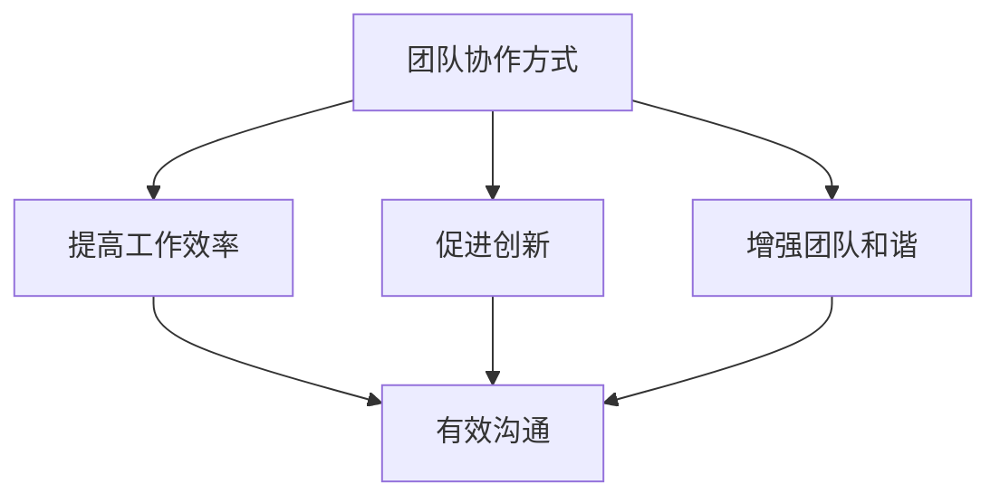

**核心算法原理讲解：**

团队协作方式的选择可以通过以下伪代码来描述：

```plaintext
function select_collaboration_patterns(team):
    analyze_team Needs()
    consider_individual_skills()
    balance_role_distribution()
    foster_a COLLABORATIVE_ATMOSPHERE()
    return collaboration_patterns
```

**数学模型和公式：**

我们可以使用协作效率模型来量化团队协作方式对团队绩效的影响。假设团队绩效 \(P_c\) 是团队协作方式 \(C\) 的函数，则：

$$P_c = C \times (j_1 + j_2 + j_3)$$

其中，\(j_1\)、\(j_2\) 和 \(j_3\) 分别代表提高工作效率、促进创新和增强团队和谐对团队绩效的贡献因子。

**详细讲解与举例说明：**

例如，在一个采用敏捷开发方法的团队中，成员们通过每日站会、迭代规划和回顾会议等方式，不断调整工作计划和改进流程，从而提高工作效率。同时，敏捷开发方法鼓励团队成员积极参与，提出创新的想法，促进团队的创新。此外，通过定期的团队活动和培训，增强团队成员之间的信任和理解，从而增强团队和谐。

### 3. 团队沟通机制

团队沟通机制是团队内部成员之间信息传递和交流的渠道和方法。有效的沟通机制可以确保团队内部信息的准确传递，减少误解和冲突，提高团队的协作效率。

**核心概念与联系：**

团队沟通机制可以通过以下 Mermaid 流程图来展示：

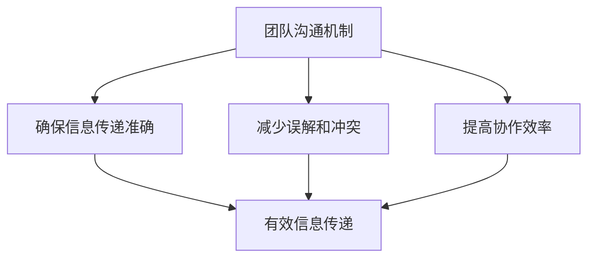

**核心算法原理讲解：**

团队沟通机制的建设可以通过以下伪代码来描述：

```plaintext
function establish_communication_mechanisms(team):
    define_communication_channels()
    establish_regular_meeting_schedules()
    implement_feedback_loops()
    train_members_in_effective_communication()
    return communication_mechanisms
```

**数学模型和公式：**

我们可以使用沟通效率模型来量化团队沟通机制对团队绩效的影响。假设团队绩效 \(P_c\) 是团队沟通机制 \(C_m\) 的函数，则：

$$P_c = C_m \times (k_1 + k_2 + k_3)$$

其中，\(k_1\)、\(k_2\) 和 \(k_3\) 分别代表确保信息传递准确、减少误解和冲突以及提高协作效率对团队绩效的贡献因子。

**详细讲解与举例说明：**

例如，在一个设有定期团队会议和反馈机制的团队中，成员们能够定期分享工作进展、讨论问题和提出建议，确保信息的准确传递和及时反馈。通过这种方式，团队成员可以及时了解到团队的整体状况，减少误解和冲突。此外，通过培训和研讨会，提高团队成员的沟通技巧，进一步提高团队的协作效率。

综上所述，团队价值观、团队协作方式和团队沟通机制是团队文化的三个核心要素。这些要素相互作用，共同构建了团队的精神面貌和运作方式，为团队的长期发展提供了坚实的基础。

### 塑造团队文化的策略与方法

要塑造一个独特的团队文化，组织需要采取一系列系统性和持续性的策略与方法。以下我们将从明确团队文化愿景、建立有效的领导风格、培养团队成员的共同价值观和建立积极的团队氛围四个方面详细探讨这些策略与方法。

#### 1. 明确团队文化愿景

明确团队文化愿景是塑造团队文化的重要第一步。团队文化愿景不仅为团队提供了共同的目标和方向，还为团队成员提供了行为的指导原则。一个清晰的愿景能够激发团队成员的积极性，增强团队凝聚力。

**核心概念与联系：**

团队文化愿景可以通过以下 Mermaid 流程图来展示：

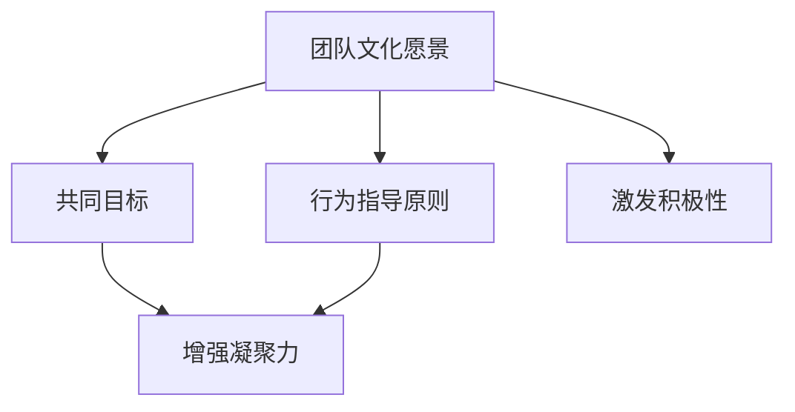

**核心算法原理讲解：**

制定团队文化愿景可以通过以下伪代码来描述：

```plaintext
function define_team_culture_vision(team):
    gather_input_from_members()
    prioritize_values_and_goals()
    formulate_a_clear_statement()
    communicate_the_vision_to_all_members()
    return vision
```

**数学模型和公式：**

我们可以使用团队凝聚力模型来量化团队文化愿景对团队凝聚力和积极性提升的影响。假设团队凝聚力 \(P_t\) 和积极性 \(M_e\) 是团队文化愿景 \(V\) 的函数，则：

$$P_t = V \times (l_1 + l_2 + l_3)$$
$$M_e = V \times (l_1 + l_2 + l_3)$$

其中，\(l_1\)、\(l_2\) 和 \(l_3\) 分别代表共同目标、行为指导原则和激发积极性对团队凝聚力和积极性的贡献因子。

**详细讲解与举例说明：**

例如，一个以“创新、协作、持续进步”为愿景的团队，其成员们会共同致力于推动技术创新和业务发展。这种愿景不仅为团队提供了明确的目标，还引导成员们在日常工作中保持积极的态度和行为。通过定期的团队会议和培训，团队成员能够不断了解和讨论愿景，从而增强团队的凝聚力和成员的积极性。

#### 2. 建立有效的领导风格

领导风格在塑造团队文化中起着关键作用。一个优秀的领导者不仅能够明确团队方向，还能通过其领导风格影响团队成员的行为和态度。不同的领导风格适用于不同的团队环境和需求，因此领导者需要根据实际情况灵活调整自己的领导风格。

**核心概念与联系：**

领导风格可以通过以下 Mermaid 流程图来展示：

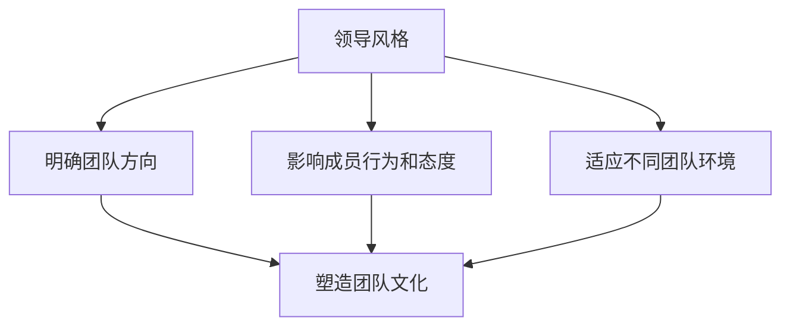

**核心算法原理讲解：**

建立有效领导风格可以通过以下伪代码来描述：

```plaintext
function establish_effective_leadership_style(team_leader):
    analyze_team_environment()
    select_appropriate_leadership_style()
    demonstrate_leadership_in_action()
    adapt_style_as_needed()
    return leadership_style
```

**数学模型和公式：**

我们可以使用领导风格影响模型来量化领导风格对团队文化和成员行为的影响。假设团队文化 \(C_t\) 和成员行为 \(B_m\) 是领导风格 \(L\) 的函数，则：

$$C_t = L \times (m_1 + m_2 + m_3)$$
$$B_m = L \times (m_1 + m_2 + m_3)$$

其中，\(m_1\)、\(m_2\) 和 \(m_3\) 分别代表明确团队方向、影响成员行为和态度以及适应不同团队环境对团队文化和成员行为的影响因子。

**详细讲解与举例说明：**

例如，在一个以“参与式领导”为风格的团队中，领导者鼓励团队成员积极参与决策和项目讨论。这种领导风格不仅提高了团队的协作效率，还增强了成员的参与感和责任感。另一个例子是，在一个以“教练型领导”为风格的团队中，领导者通过培训和指导帮助成员提升技能和职业发展，从而推动团队的持续进步。

#### 3. 培养团队成员的共同价值观

共同价值观是团队文化的核心要素，它能够统一团队成员的思想和行为，提高团队的凝聚力和执行力。培养团队成员的共同价值观需要从团队内部着手，通过一系列活动和机制，确保价值观在团队成员中扎根。

**核心概念与联系：**

共同价值观的培养可以通过以下 Mermaid 流程图来展示：

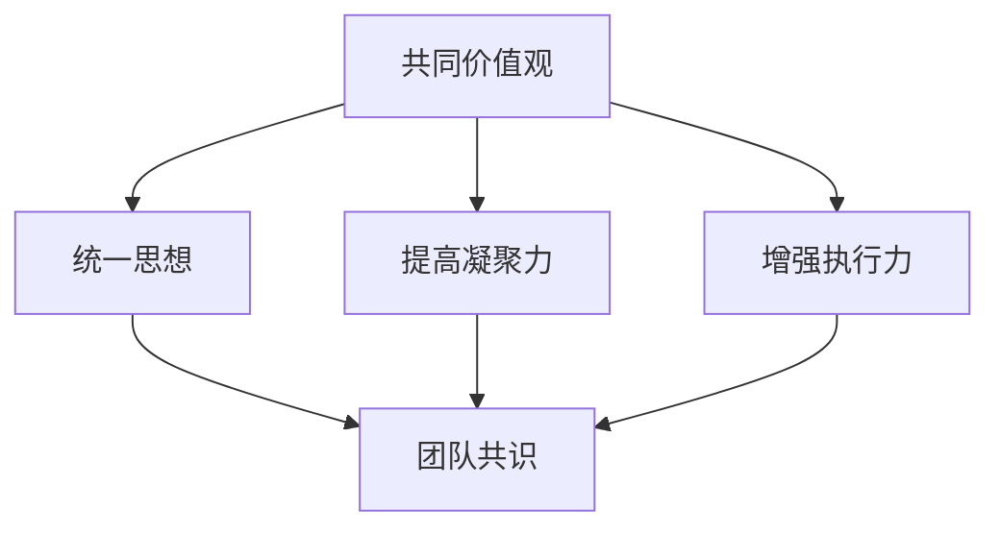

**核心算法原理讲解：**

培养团队成员的共同价值观可以通过以下伪代码来描述：

```plaintext
function cultivate_common_values(team):
    define_core_values()
    communicate_values_to_members()
    integrate_values_into_practices()
    monitor_value_adherence()
    provide_reinforcement()
    return team
```

**数学模型和公式：**

我们可以使用团队共识模型来量化共同价值观对团队绩效的影响。假设团队绩效 \(P_t\) 是共同价值观 \(V_c\) 的函数，则：

$$P_t = V_c \times (n_1 + n_2 + n_3)$$

其中，\(n_1\)、\(n_2\) 和 \(n_3\) 分别代表统一思想、提高凝聚力和增强执行力对团队绩效的贡献因子。

**详细讲解与举例说明：**

例如，一个以“客户至上”为共同价值观的团队，成员们在工作中会始终以客户需求为中心，提供优质的解决方案。这种价值观不仅统一了团队成员的思想，还增强了团队的凝聚力和执行力。为了培养这种价值观，团队可以通过定期的价值观讨论、培训和案例分享等方式，确保价值观在团队成员中得到充分理解和实践。

#### 4. 建立积极的团队氛围

积极的团队氛围能够激发团队成员的创造力和积极性，提高团队的整体绩效。建立积极的团队氛围需要从多个方面入手，包括激励措施、团队活动和心理健康支持等。

**核心概念与联系：**

积极的团队氛围可以通过以下 Mermaid 流程图来展示：

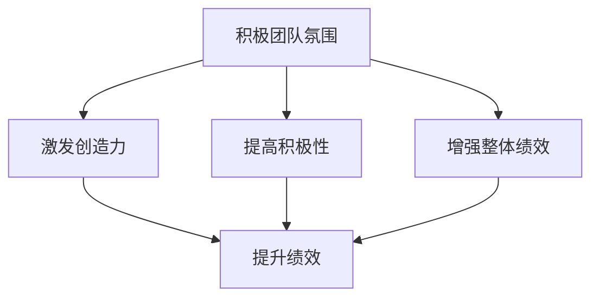

**核心算法原理讲解：**

建立积极团队氛围可以通过以下伪代码来描述：

```plaintext
function establish_positive_team_atmosphere(team):
    implement_incentive_programs()
    organize_team_activities()
    provide_mental_health_support()
    foster_a_positive_interpersonal_relationship()
    promote_open_communication()
    return positive_atmosphere
```

**数学模型和公式：**

我们可以使用整体绩效模型来量化积极团队氛围对团队整体绩效的影响。假设团队绩效 \(P_t\) 是积极团队氛围 \(A_p\) 的函数，则：

$$P_t = A_p \times (o_1 + o_2 + o_3)$$

其中，\(o_1\)、\(o_2\) 和 \(o_3\) 分别代表激发创造力、提高积极性和增强整体绩效对团队绩效的影响因子。

**详细讲解与举例说明：**

例如，一个通过实施激励机制、组织团队活动和提供心理健康支持的团队，能够营造一个积极的工作氛围。通过定期的团队建设活动，如户外拓展、团队晚宴和知识分享会，团队成员能够增进彼此的了解和信任，提高团队的整体绩效。此外，通过提供心理健康支持，团队成员能够更好地应对工作压力，保持积极的心态。

综上所述，明确团队文化愿景、建立有效的领导风格、培养团队成员的共同价值观和建立积极的团队氛围是塑造独特团队文化的四个关键策略与方法。通过这些策略，组织能够建立一个富有活力和创造力的团队，为组织的长期成功奠定坚实基础。

### 团队文化评估与改进

团队文化评估是确保团队文化质量的重要环节。通过评估，组织能够了解团队文化的现状，识别存在的问题，并制定相应的改进策略。以下将从评估方法、改进策略和案例分析三个方面详细探讨团队文化评估与改进。

#### 1. 团队文化评估的方法

团队文化评估需要采用科学的方法和工具，以获取准确和全面的信息。以下是一些常用的评估方法：

**问卷调查法**

问卷调查法是一种广泛使用的评估方法，通过设计问卷收集团队成员对团队文化的看法和反馈。问卷可以涵盖多个方面，如团队价值观、协作方式、沟通机制和员工满意度等。

**访谈法**

访谈法通过面对面或在线访谈的方式，深入了解团队成员对团队文化的感受和看法。这种方法能够获取更深入的见解，帮助识别文化中的潜在问题。

**行为观察法**

行为观察法通过观察团队成员在工作中的行为和互动，评估团队文化的影响。这种方法能够直接观察到文化如何影响团队的实际运作。

**360度评估法**

360度评估法通过收集来自团队成员、上级、同事和客户的反馈，全面了解团队文化的各个方面。这种方法能够提供多角度的评估结果，有助于更全面地了解团队文化。

**核心概念与联系：**

团队文化评估的方法可以通过以下 Mermaid 流程图来展示：

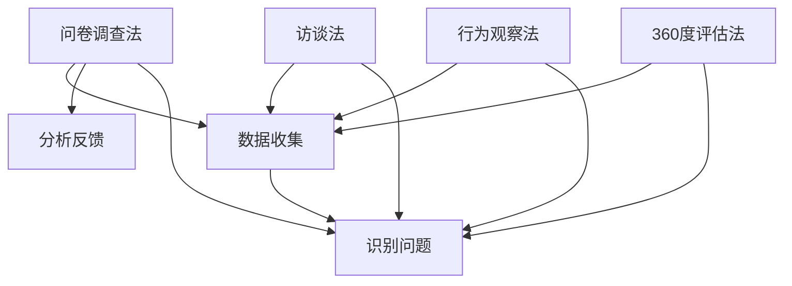

**核心算法原理讲解：**

团队文化评估的算法可以通过以下伪代码来描述：

```plaintext
function assess_team_culture(assessment_methods):
    collect_data()
    analyze_feedback()
    identify_issues()
    generate_report()
    return assessment_results
```

**数学模型和公式：**

我们可以使用团队文化健康度模型来量化评估结果。假设团队文化健康度 \(H_t\) 是评估结果 \(R\) 的函数，则：

$$H_t = R \times (p_1 + p_2 + p_3)$$

其中，\(p_1\)、\(p_2\) 和 \(p_3\) 分别代表数据收集、分析和报告对团队文化健康度的影响因子。

**详细讲解与举例说明：**

例如，在一个使用问卷调查法进行团队文化评估的团队中，通过设计多维度的问题，如团队合作、沟通效率、领导风格等，收集团队成员的反馈。然后，分析这些反馈，识别团队文化中存在的问题。通过行为观察法和访谈法，进一步验证和补充问卷调查的结果，确保评估的全面性和准确性。最终，生成详细的评估报告，为团队文化的改进提供依据。

#### 2. 团队文化改进的策略

在完成团队文化评估后，组织需要根据评估结果制定具体的改进策略，以提升团队文化质量和绩效。以下是一些常见的改进策略：

**策略一：加强沟通和协作**

通过改善团队沟通机制和协作方式，提高团队的整体协作效率。具体措施包括设立定期团队会议、建立信息共享平台、加强团队成员之间的培训等。

**策略二：强化价值观教育**

通过价值观培训和文化宣传活动，强化团队成员对共同价值观的理解和认同。例如，定期组织价值观讨论、分享成功案例和表彰活动等。

**策略三：调整领导风格**

根据评估结果，调整领导者的风格和方法，以更好地适应团队的需求。例如，从指令型领导转变为参与式领导，鼓励团队成员的参与和贡献。

**策略四：建立激励机制**

通过实施激励机制，鼓励团队成员积极投入工作，提高工作绩效。具体措施包括设立绩效奖金、晋升机会和员工认可计划等。

**核心概念与联系：**

团队文化改进的策略可以通过以下 Mermaid 流程图来展示：

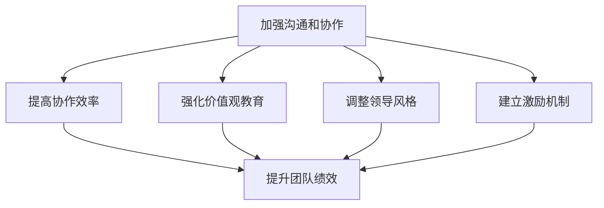

**核心算法原理讲解：**

团队文化改进的策略可以通过以下伪代码来描述：

```plaintext
function improve_team_culture(assessment_results):
    if assessment_results.indicate("poor_communication"):
        implement_communication_improvements()
    if assessment_results.indicate("lack_of_values"):
        strengthen_values_education()
    if assessment_results.indicate("ineffective_leadership"):
        adjust_leadership_styles()
    if assessment_results.indicate("low_motivation"):
        establish_incentive_programs()
    return improved_culture
```

**数学模型和公式：**

我们可以使用团队文化改进模型来量化改进策略对团队文化质量和绩效的影响。假设团队文化质量 \(C_i\) 和团队绩效 \(P_t\) 是改进策略 \(I\) 的函数，则：

$$C_i = I \times (q_1 + q_2 + q_3)$$
$$P_t = I \times (q_1 + q_2 + q_3)$$

其中，\(q_1\)、\(q_2\) 和 \(q_3\) 分别代表沟通和协作、价值观教育和领导风格调整以及激励机制对团队文化质量和绩效的影响因子。

**详细讲解与举例说明：**

例如，在一个评估结果显示沟通效率较低的团队中，通过建立定期的团队会议和信息共享平台，提高团队的沟通效率。同时，通过价值观培训和文化宣传活动，强化团队成员对共同价值观的理解和认同。此外，通过调整领导风格，鼓励团队成员的参与和贡献，以及实施激励机制，提高团队的整体绩效。

#### 3. 团队文化改进的案例分析

以下通过两个案例，探讨团队文化评估与改进的具体实践。

**案例一：某互联网公司的团队文化改进**

某互联网公司通过问卷调查法、访谈法和行为观察法，进行了团队文化评估。评估结果显示，团队在沟通和协作方面存在显著问题，团队成员之间的沟通不畅和协作效率低下。针对这些问题，公司采取了以下改进措施：

- **加强沟通和协作**：设立了每周一次的团队会议，确保团队成员能够及时分享信息和讨论问题。同时，建立了内部沟通平台，方便成员之间随时交流。
- **强化价值观教育**：定期组织价值观讨论和培训，通过分享成功案例和表彰活动，强化团队成员对共同价值观的理解和认同。
- **调整领导风格**：领导者从指令型转变为参与式领导，鼓励团队成员提出意见和建议，增强团队的参与感和责任感。
- **建立激励机制**：实施绩效奖金和晋升机会，激励团队成员积极投入工作，提高工作绩效。

通过这些改进措施，团队的沟通和协作效率显著提高，团队成员的积极性和满意度也得到提升。

**案例二：某制造企业的团队文化改进**

某制造企业通过360度评估法，全面了解团队文化的各个方面。评估结果显示，团队在价值观教育和领导风格方面存在明显不足。针对这些问题，企业采取了以下改进措施：

- **强化价值观教育**：定期组织价值观培训和分享会，确保团队成员对共同价值观有清晰的认识和理解。同时，通过表彰活动，强化价值观在团队实践中的落实。
- **调整领导风格**：领导者积极学习并采用教练型领导方法，通过培训和指导，帮助团队成员提升技能和职业发展。同时，鼓励团队成员参与决策，提高他们的参与感和责任感。
- **建立激励机制**：实施绩效奖金和员工认可计划，激励团队成员积极投入工作，提高工作绩效。

通过这些改进措施，企业的团队文化得到显著改善，员工的工作满意度和团队凝聚力显著提升。

综上所述，团队文化评估与改进是确保团队文化质量和绩效的重要环节。通过科学的方法和具体的改进策略，组织能够不断提升团队文化，为组织的长期成功奠定坚实基础。

### 团队文化在特殊情境下的应用

在全球化、虚拟化和多样化的工作环境中，团队文化面临着前所未有的挑战。不同情境下的团队文化应用需要特别的策略和方法，以确保团队能够在各种复杂环境中保持高效的运作。以下将探讨团队文化在跨文化团队和虚拟团队中的应用，以及应对特殊情境下的挑战。

#### 1. 团队文化在跨文化团队中的应用

跨文化团队由来自不同文化背景的成员组成，这些成员可能具有不同的价值观、行为习惯和工作方式。跨文化团队的成功很大程度上取决于团队文化能否融合不同的文化元素，实现共同的目标。

**核心概念与联系：**

跨文化团队文化可以通过以下 Mermaid 流程图来展示：

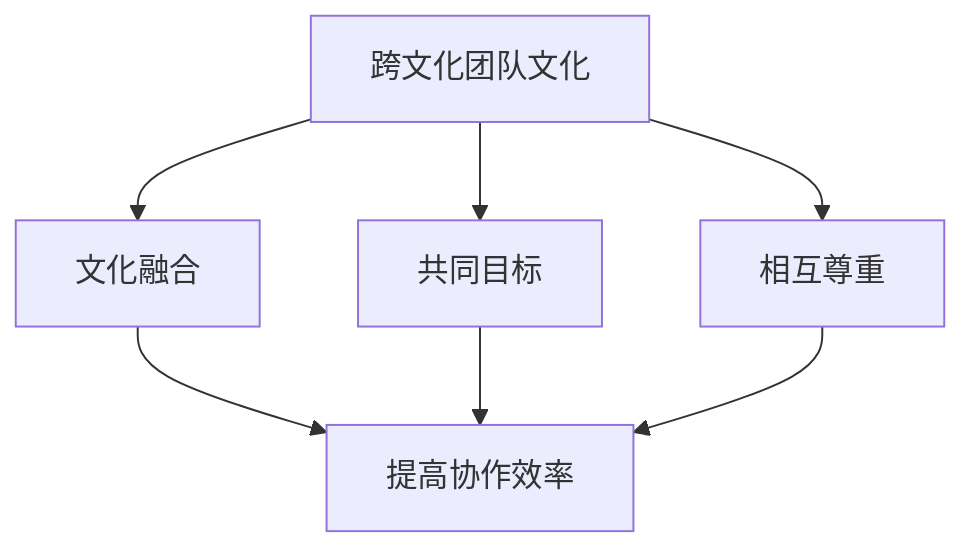

**核心算法原理讲解：**

跨文化团队文化的构建可以通过以下伪代码来描述：

```plaintext
function establish_cultural_integration(team):
    identify_cultural_differences()
    promote_intercultural_understanding()
    define_common_goals()
    foster_respect_and_acceptance()
    provide_cultural_training()
    return integrated_culture
```

**数学模型和公式：**

我们可以使用文化融合模型来量化跨文化团队文化对团队协作效率的影响。假设团队协作效率 \(E_i\) 是跨文化团队文化 \(C_i\) 的函数，则：

$$E_i = C_i \times (r_1 + r_2 + r_3)$$

其中，\(r_1\)、\(r_2\) 和 \(r_3\) 分别代表文化融合、共同目标和相互尊重对团队协作效率的影响因子。

**详细讲解与举例说明：**

例如，在一个跨国公司的研发团队中，团队成员来自不同的国家和地区，如中国、美国和印度。为了实现团队的协同合作，团队通过文化融合活动，如定期的文化讲座、团队建设活动和跨文化培训，提高团队成员对彼此文化的理解和尊重。同时，团队设定了共同的目标，如开发一款全球适用的产品，并定期评估和调整团队策略，确保文化融合与目标一致。

**挑战与应对策略：**

- **挑战一：文化冲突**：不同文化之间的价值观和行为方式可能产生冲突。应对策略包括加强文化教育和培训，建立共同的文化价值观和团队规范，以及通过领导者的有效沟通和调解，减少文化冲突。
- **挑战二：沟通障碍**：语言障碍和文化差异可能导致沟通不畅。应对策略包括提供跨文化沟通培训，使用统一的沟通工具和平台，以及设立跨文化沟通委员会，解决沟通中的问题。

#### 2. 团队文化在虚拟团队中的应用

虚拟团队由远程工作的成员组成，他们可能分布在不同的城市、国家甚至时区。虚拟团队的成功依赖于团队文化的塑造，包括信任、沟通和协作等关键要素。

**核心概念与联系：**

虚拟团队文化可以通过以下 Mermaid 流程图来展示：

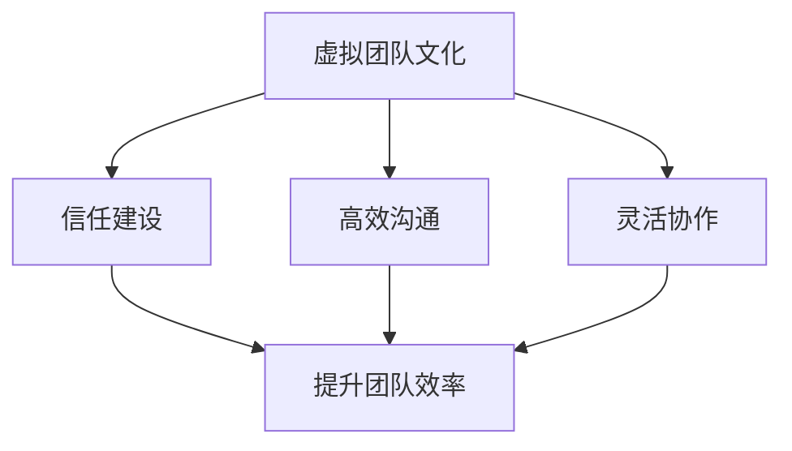

**核心算法原理讲解：**

虚拟团队文化的构建可以通过以下伪代码来描述：

```plaintext
function establish_virtual_team_culture(team):
    build_trust_among_members()
    implement_effective_communication_channels()
    create_flexible_collaboration_methods()
    provide_technological_support()
    maintain_regular_checks_and_balances()
    return virtual_culture
```

**数学模型和公式：**

我们可以使用虚拟团队效率模型来量化虚拟团队文化对团队效率的影响。假设团队效率 \(E_v\) 是虚拟团队文化 \(C_v\) 的函数，则：

$$E_v = C_v \times (s_1 + s_2 + s_3)$$

其中，\(s_1\)、\(s_2\) 和 \(s_3\) 分别代表信任建设、高效沟通和灵活协作对团队效率的影响因子。

**详细讲解与举例说明：**

例如，在一个跨国公司的虚拟产品开发团队中，团队成员分布在不同的城市和时区。为了提高团队效率，团队建立了定期的在线会议制度，使用协作工具如Slack和Trello，确保团队成员之间的沟通和信息共享。此外，团队通过定期的团队建设活动和远程培训，增强团队成员之间的信任和协作意愿。

**挑战与应对策略：**

- **挑战一：时间差异**：不同的时区可能导致沟通和协作上的障碍。应对策略包括使用时间管理工具，如Google Calendar和Trello，协调团队成员的工作时间，确保高效的协作。
- **挑战二：技术依赖**：虚拟团队高度依赖技术工具，技术故障可能导致团队协作中断。应对策略包括定期维护和更新技术设备，以及备选的技术方案，确保团队工作不受影响。

综上所述，团队文化在跨文化团队和虚拟团队中的应用需要特别的策略和方法。通过融合不同的文化元素、建立信任和高效的沟通机制，以及灵活应对特殊情境下的挑战，虚拟团队和跨文化团队能够实现高效的协作和持续的发展。

### 团队文化案例分析

团队文化是企业成功的关键因素之一，许多国内外知名企业通过有效的团队文化建设，实现了卓越的业绩和持久的竞争力。以下将分析两个典型案例，探讨这些企业如何塑造独特的团队文化，以及其成功实践与经验。

#### 1. 案例一：谷歌（Google）

谷歌作为全球领先的技术公司，以其独特的团队文化著称。谷歌的团队文化强调创新、开放和多样性，鼓励员工自由表达和尝试新的想法。

**核心要素：**

- **创新精神**：谷歌鼓励员工自由探索和尝试新项目，这种创新精神促进了谷歌在多个领域的突破。
- **开放沟通**：谷歌倡导开放沟通，员工可以自由分享想法和建议，同时领导层也会倾听和采纳员工的意见。
- **多样性**：谷歌重视员工背景的多样性，认为这种多样性能够激发创新和协作，从而推动公司的发展。

**成功实践与经验：**

- **谷歌大脑项目**：谷歌的团队文化激励了员工尝试新的技术路线，如深度学习和人工智能。谷歌大脑项目就是一个成功的案例，该项目在机器学习和人工智能领域取得了重大突破。
- **20% 时间政策**：谷歌实施了20% 时间政策，允许员工将部分工作时间用于自己感兴趣的项目。这一政策激发了员工的创造力，产生了许多创新产品，如AdSense和Gmail。

**经验教训：**

谷歌的团队文化强调创新和开放，为员工提供了广阔的发展空间。然而，过度自由和宽松的文化也可能导致管理上的困难。因此，谷歌需要平衡创新与管理的需求，确保团队在自由探索的同时，也能够保持高效的运作。

#### 2. 案例二：特斯拉（Tesla）

特斯拉作为电动汽车和能源技术的领先企业，以其高度专注和目标导向的团队文化闻名。特斯拉的团队文化强调执行力、持续改进和客户至上。

**核心要素：**

- **执行力**：特斯拉的团队文化强调高效执行，员工被激励追求卓越，迅速响应市场需求。
- **持续改进**：特斯拉不断推动技术革新和流程优化，通过持续改进来提高产品和服务质量。
- **客户至上**：特斯拉始终将客户需求放在首位，以提供卓越的客户体验为目标。

**成功实践与经验：**

- **Model 3 项目**：特斯拉通过高度专注和目标导向的团队文化，成功推出了Model 3，这是一款广受欢迎的电动汽车。该项目体现了特斯拉团队在执行力、持续改进和客户至上方面的优势。
- **能源解决方案**：特斯拉不仅专注于电动汽车，还通过其能源解决方案（如太阳能屋顶和储能系统）推动了可持续能源的发展。这种多元化的产品策略得益于特斯拉团队文化中对创新和持续改进的重视。

**经验教训：**

特斯拉的团队文化在执行力、持续改进和客户至上方面表现出色，但同时也存在一定的风险。高度专注和目标导向可能导致团队忽视了其他重要方面，如员工福祉和工作平衡。因此，特斯拉需要在保持高效执行的同时，关注员工的长期健康和幸福。

#### 总结

通过分析谷歌和特斯拉的团队文化案例，我们可以得出以下结论：

- **创新与执行力是团队文化的关键要素**：谷歌和特斯拉都强调了创新和执行力，这是驱动企业持续发展和市场竞争力的重要动力。
- **开放沟通与客户至上**：开放沟通和客户至上是团队文化的核心价值，这有助于提高团队协作效率和客户满意度。
- **持续改进与多元化**：持续改进和多元化是团队文化的重要组成部分，这能够推动企业的技术进步和市场竞争力。

总之，成功的团队文化案例为我们提供了宝贵的经验和启示，企业可以通过借鉴这些成功实践，优化自身的团队文化建设，实现长期的可持续发展。

### 团队文化的未来趋势与挑战

随着数字化转型的加速，团队文化正面临着一系列新的趋势与挑战。未来团队文化的发展方向将受到技术进步、组织变革和全球化的深远影响。以下将探讨团队文化的未来趋势、面临的挑战及其应对策略。

#### 1. 未来团队文化的趋势

**趋势一：数字化转型**

数字化转型正在重塑组织结构和运营模式，这也影响了团队文化的建设。未来的团队文化将更加依赖于数字化工具和平台，如人工智能、大数据和云计算等，以提高协作效率和创新能力。

- **技术应用**：利用人工智能和大数据分析，团队可以更好地理解成员的需求和行为，从而优化团队文化策略。
- **虚拟协作**：随着虚拟团队的普及，未来团队文化将更加注重线上沟通和协作，通过虚拟现实（VR）和增强现实（AR）技术，增强团队成员的沉浸感和互动性。

**趋势二：多样性、包容性和平等性**

未来团队文化将更加重视多样性、包容性和平等性。这种文化不仅能够吸引不同背景的员工，还能激发创新和创造力。

- **多元化团队**：通过建设多元化的团队，企业可以获取不同文化和视角，从而推动创新和适应市场变化。
- **包容性文化**：建立一个包容性的工作环境，能够减少歧视和偏见，提高员工的满意度和忠诚度。

**趋势三：自我管理和自主学习**

未来的工作环境将更加灵活和自主，员工将拥有更多的自主权来管理自己的工作。这要求团队文化能够支持员工的自我管理和自主学习。

- **自我管理**：通过提供自主的工作安排和项目选择，员工可以更好地发挥自己的优势，提高工作效率。
- **自主学习**：鼓励员工持续学习和成长，企业可以建立内部学习社区和培训计划，支持员工的职业发展。

#### 2. 未来团队文化面临的挑战

**挑战一：技术变革的适应**

随着技术不断进步，团队文化需要适应新的技术环境和工具。然而，技术变革可能带来不适应和挑战。

- **技能差距**：技术变革可能导致现有员工的技能不足，企业需要提供培训和支持，帮助员工适应新技术。
- **数字化依赖**：过度依赖数字化工具可能导致沟通效率下降，企业需要平衡技术工具的使用，确保有效的面对面沟通。

**挑战二：全球化的影响**

全球化带来了文化多样性和跨国团队，但同时也增加了文化冲突和管理难度。

- **文化差异**：不同文化背景的员工可能存在价值观和行为方式的差异，企业需要制定跨文化的沟通和管理策略。
- **管理复杂度**：跨国团队的管理更加复杂，企业需要建立高效的沟通渠道和协调机制。

**挑战三：员工福祉和工作平衡**

随着工作压力的增加，员工福祉和工作平衡成为团队文化的重要议题。

- **工作压力**：数字化转型和工作效率要求可能增加员工的工作压力，企业需要关注员工的身心健康。
- **工作与生活平衡**：灵活的工作安排和远程工作成为趋势，但如何确保员工在工作与生活之间保持平衡仍是一个挑战。

#### 3. 应对策略

**策略一：技术赋能和文化融合**

- **技术赋能**：利用数字化工具和平台，提高团队的协作效率和创新能力。通过技术赋能，员工可以更轻松地适应技术变革。
- **文化融合**：建立跨文化的团队文化，通过文化培训和管理，促进团队成员之间的相互理解和合作。

**策略二：关注员工福祉**

- **员工关怀**：关注员工的身心健康，提供健康检查、心理咨询和员工援助计划。
- **工作平衡**：鼓励员工合理安排工作时间，提供灵活的工作安排和远程工作机会，确保员工在工作与生活之间保持平衡。

**策略三：持续学习和职业发展**

- **持续学习**：建立内部学习社区和培训计划，支持员工的持续学习和职业发展。
- **职业发展**：提供明确的职业发展路径和晋升机会，鼓励员工在团队中成长和贡献。

**策略四：领导力和文化塑造**

- **领导力**：培养具备跨文化管理能力的领导者，通过有效的领导风格和管理策略，推动团队文化的建设和发展。
- **文化塑造**：通过价值观传递和实践活动，持续塑造和强化团队文化，确保团队文化的持续发展和适应变化。

综上所述，未来团队文化将面临技术变革、全球化和员工福祉等多方面的挑战。通过技术赋能、文化融合、关注员工福祉和持续学习，企业可以应对这些挑战，构建适应未来的团队文化，为组织的长期成功奠定坚实基础。

## 结论

团队文化作为组织发展的核心驱动力，对团队协作效率、员工满意度和创新能力等方面具有重要影响。通过本文的探讨，我们系统地分析了团队文化的定义与重要性、核心要素、塑造策略、评估与改进，以及特殊情境下的应用和未来趋势。以下为本文的核心观点和总结：

1. **团队文化的重要性**：团队文化不仅能够提升团队协作效率，增强员工归属感和满意度，还能促进组织的创新与发展。
2. **核心要素**：团队价值观、团队协作方式和团队沟通机制是构建团队文化的三大核心要素，它们相互作用，共同塑造团队的精神面貌和运作方式。
3. **塑造策略**：明确团队文化愿景、建立有效的领导风格、培养共同价值观和建立积极的团队氛围是塑造团队文化的关键策略。
4. **评估与改进**：通过科学的方法和工具对团队文化进行评估，并根据评估结果采取相应的改进策略，是提升团队文化质量的重要步骤。
5. **特殊情境下的应用**：跨文化团队和虚拟团队面临着特殊的挑战，需要特别的策略和方法来适应这些情境，确保团队的高效运作。
6. **未来趋势与挑战**：随着数字化转型的加速和全球化的深入，团队文化将面临新的趋势和挑战，企业需要通过技术赋能、文化融合、关注员工福祉和持续学习来应对这些变化。

总之，团队文化是组织成功的关键因素之一。通过深入理解和持续优化团队文化，组织能够建立一个富有活力和创造力的团队，为组织的长期成功奠定坚实基础。作者建议，企业应高度重视团队文化的建设与维护，通过系统的策略和方法，不断提升团队文化的质量和绩效，实现组织的卓越发展。

### 附录：拓展阅读

1. **《团队的五大障碍：行动指南》**（著：Patrick Lencioni）：详细介绍了团队面临的五大障碍，并提供实用的解决策略。
2. **《团队协作的艺术》**（著：Ethan Bernstein）：探讨了团队协作中的心理动态和沟通技巧，为团队管理者提供宝贵的指导。
3. **《跨界思维：如何打造多元化的团队》**（著：Howard J.�Engel）：介绍了如何在多元化的团队中实现高效的协作和创新。
4. **《领导力的五项修炼》**（著：Patrick Lencioni）：提供了关于领导力的深刻见解，帮助领导者提升团队文化。

作者：AI天才研究院/AI Genius Institute & 禅与计算机程序设计艺术 /Zen And The Art of Computer Programming

