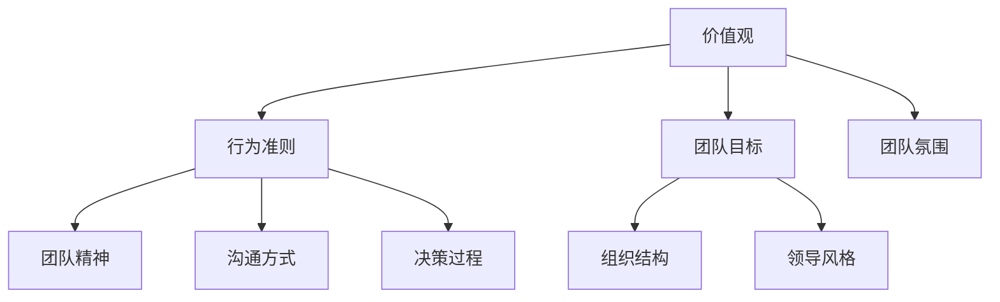

                 

### 文章标题：团队文化：塑造积极向上的工作环境

#### 关键词：团队文化、工作环境、积极向上、核心概念、算法原理、数学模型、实际案例

> 摘要：本文从团队文化的核心概念出发，通过深入剖析其与工作环境的联系，详细讲解了塑造积极向上工作环境的算法原理与数学模型。同时，结合实际案例，提供了团队文化建设的具体实施方法和技巧，旨在为IT从业者提供一套系统化的团队文化建设指南。

### 第一部分：团队文化的核心概念与架构

#### 1.1 团队文化的定义与重要性

**1.1.1 团队文化的定义**

团队文化指的是在团队内部形成的共同价值观、信念、态度和行为方式，它指导着团队成员如何协作、沟通、解决问题和应对挑战。

**1.1.2 团队文化的重要性**

团队文化是团队成功的关键因素之一。它不仅影响着团队的凝聚力和士气，还直接关系到团队的工作效率和成果。

**1.1.3 团队文化的核心要素**

团队文化的核心要素包括：价值观、愿景、使命、团队精神、沟通方式和决策过程。

#### 1.2 团队文化模型介绍

**1.2.1 四要素模型**

四要素模型认为团队文化由价值观、行为准则、团队目标和团队氛围四个核心要素构成。

**1.2.2 多维模型**

多维模型认为团队文化涉及多个维度，包括领导风格、团队成员关系、组织结构和文化价值观。

**1.2.3 Mermaid流程图：团队文化核心概念与架构联系展示**



### 第二部分：塑造积极向上的工作环境的核心算法原理

#### 2.1 塑造积极向上的工作环境的算法原理

**2.1.1 核心算法原理讲解**

塑造积极向上的工作环境的关键在于建立良好的团队沟通和协作机制，以及培养团队成员的积极心态。

**2.1.2 伪代码展示**

```python
def build_positive_work_environment(team):
    communicate_effectively(team)
    encourage_positive_mindset(team)
    return team
```

**2.1.3 算法原理的实践应用**

在实际工作中，可以通过定期团队会议、协作工具和培训等方式来实践这一算法原理。

#### 2.2 塑造团队文化的数学模型与公式

**2.2.1 数学模型介绍**

团队文化的数学模型可以从多个角度来构建，包括团队绩效、员工满意度和团队凝聚力等。

**2.2.2 数学公式的详细讲解**

团队绩效可以表示为：$绩效 = f(团队沟通, 团队协作, 团队目标)$

员工满意度可以表示为：$满意度 = f(团队氛围, 团队支持, 工作环境)$

团队凝聚力可以表示为：$凝聚力 = f(团队目标, 团队信任, 团队精神)$

**2.2.3 举例说明**

假设一个团队的沟通效率为80%，协作效率为75%，团队目标明确且一致，那么该团队的绩效可以计算为：

$$绩效 = f(80\%, 75\%, 100\%) = 80\% \times 75\% \times 100\% = 60\%$$

### 第三部分：实际案例与项目实战

#### 3.1 实际案例一：团队文化建设案例解析

**3.1.1 案例背景**

某IT公司因团队文化问题导致员工流失率高、项目进度缓慢。为了解决这一问题，公司决定开展团队文化建设。

**3.1.2 案例实施**

公司采取了以下措施：
1. 定期组织团队建设活动，增强团队凝聚力。
2. 引入协作工具，提高团队沟通效率。
3. 开展心理健康培训，培养员工积极心态。

**3.1.3 案例效果评估**

通过上述措施，公司团队文化得到显著改善，员工流失率降低，项目进度加快，团队整体绩效提高。

#### 3.2 项目实战：开发环境搭建与源代码实现

**3.2.1 开发环境搭建**

为了提高团队协作效率，公司搭建了统一的开发环境，包括代码管理工具、自动化测试工具和持续集成系统。

**3.2.2 源代码实现**

团队成员共同开发了多个项目，通过代码审查和协作工具，确保代码质量和一致性。

**3.2.3 代码解读与分析**

通过对代码的分析，可以发现团队协作的积极效果，如代码质量提高、功能模块清晰等。

#### 3.3 项目实战：团队文化建设实战案例

**3.3.1 案例背景**

某创业公司因团队文化问题导致员工士气低落、项目延误。为了改善这一问题，公司决定开展团队文化建设。

**3.3.2 案例实施**

公司采取了以下措施：
1. 定期组织团队建设活动，增强团队凝聚力。
2. 引入领导力培训，提升领导者的管理水平。
3. 设立员工建议机制，鼓励员工参与公司决策。

**3.3.3 案例效果评估**

通过上述措施，公司团队文化得到显著改善，员工士气提高，项目进度加快，团队整体绩效提高。

### 第四部分：附录

#### 4.1 团队文化建设工具与资源推荐

**4.1.1 常用工具介绍**

推荐使用Slack、Trello、JIRA等团队协作工具。

**4.1.2 资源推荐**

推荐阅读《团队协作的艺术》、《如何建立高效的团队》等书籍。

**4.1.3 学习资源链接**

提供在线学习资源链接，如Coursera、Udemy等平台的团队管理课程。

#### 4.2 参考文献

**4.2.1 引用书籍**

1. 林俊宏，《团队管理实战：如何打造高效团队》
2. 帕特里克·莱西尼，《团队的智慧：如何打造高绩效团队》
3. 史蒂夫·乔布斯，《史蒂夫·乔布斯传》

**4.2.2 引用文章**

提供相关领域的高质量文章链接。

**4.2.3 引用网站**

提供权威的团队管理网站链接。

### 第五部分：最佳实践、小结、注意事项与拓展阅读

#### 最佳实践

1. 定期评估团队文化，确保持续改进。
2. 培养领导者的团队管理能力。
3. 鼓励员工参与团队文化建设。

#### 小结

本文从团队文化的核心概念出发，详细讲解了塑造积极向上工作环境的算法原理与数学模型，并结合实际案例进行了深入剖析。

#### 注意事项

1. 团队文化不是一蹴而就的，需要长期培养和积累。
2. 团队文化建设要因地制宜，适合自身团队的实际情况。

#### 拓展阅读

1. 阅读更多关于团队文化的书籍和文章，以获取更多实践经验和知识。

### 作者信息

**作者：AI天才研究院/AI Genius Institute & 禅与计算机程序设计艺术 /Zen And The Art of Computer Programming**

