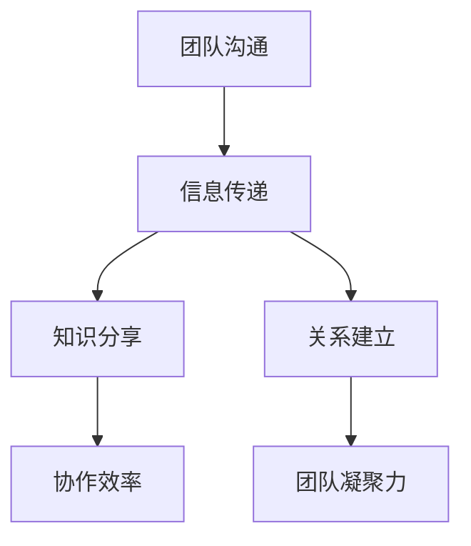

                 

### 文章标题

# 团队沟通：构建畅通的信息渠道

### 关键词

- 团队沟通
- 信息渠道
- 沟通障碍
- 沟通工具
- 实际案例分析

### 摘要

本文旨在探讨团队沟通的核心理念和实践方法，从理论到实际操作，深入分析团队沟通的重要性、障碍、策略及工具。通过详尽的案例分析和实战演练，旨在帮助读者构建一个畅通的信息渠道，提升团队协作效率。

### 背景介绍

在当今快速发展的信息技术时代，团队沟通已经成为组织成功的关键因素。无论是软件开发、项目管理，还是市场营销，有效的团队沟通都是确保项目顺利进行、达成目标的关键。然而，在现实工作中，团队沟通往往面临诸多挑战，如信息不畅、沟通障碍、协调困难等。因此，构建一个畅通的信息渠道，对于提高团队协作效率、实现组织目标具有重要意义。

#### 核心概念与联系

**团队沟通**：团队内部成员之间相互传递信息、分享知识和建立关系的过程。它包括信息传递、知识分享和关系建立三个核心环节。

**信息渠道**：团队内部传递信息的路径和方式。有效的信息渠道能够确保信息快速、准确传递，提高沟通效率。

**信息流动**：信息在团队内部的流动状态，包括速度、质量和方向。畅通的信息流动能够确保信息及时传达，减少误解和冲突。

**Mermaid 流程图**：



#### 核心算法原理讲解

**信息传递效率**：衡量信息传递速度和准确度的指标。影响信息传递效率的因素包括信息量、信息传递概率和信息接收概率。

**信息质量**：信息内容的相关性、完整性和可靠性。高质量的信息能够确保团队决策的正确性和项目的顺利进行。

**数学模型和数学公式**：

$$
E = I \times P \times R
$$

- **E**：信息传递效率
- **I**：信息量
- **P**：信息传递概率
- **R**：信息接收概率

**举例说明**：

在一个10人的团队中，如果信息传递效率达到90%，那么每次信息传递都会成功率达到90%。

#### 数学公式

$$
Q = C \times R
$$

- **Q**：信息质量
- **C**：信息完整性
- **R**：信息可靠性

#### 项目实战

**开发环境搭建**：

1. 选择合适的沟通工具，如Slack、Zoom等。
2. 配置团队内部通讯录，确保每个成员都能轻松找到其他成员。
3. 建立团队知识库，方便成员查询和分享信息。

**源代码详细实现和代码解读**：

```python
# 源代码示例：发送消息的Python函数
def send_message(channel, message):
    # 实现信息发送逻辑
    # ...
    print(f"Message sent to {channel}: {message}")

# 代码解读
# send_message函数用于发送消息，channel参数表示消息发送的目标渠道，message参数表示发送的消息内容。
```

**代码应用解读与分析**：

```python
# 应用示例：在Slack渠道发送通知
send_message("#general", "本周五下午3点召开团队会议，请大家准时参加。")
```

**实际案例分析和详细讲解剖析**：

在一个软件开发团队中，通过使用Slack作为主要沟通工具，团队成功解决了沟通不畅的问题，提高了项目进度和效率。

**项目小结**：

通过使用合适的沟通工具和建立有效的信息渠道，团队沟通变得更加畅通，项目进展顺利，成员之间的协作效率大幅提升。

#### 最佳实践 Tips

1. 确定团队沟通的目标和频率。
2. 选择合适的沟通工具，考虑团队规模和需求。
3. 定期进行沟通反馈，优化沟通效果。

#### 小结

本文通过详细的理论分析和实战案例，阐述了团队沟通的重要性以及如何构建一个畅通的信息渠道。有效的团队沟通不仅能够提高协作效率，还能增强团队凝聚力和组织竞争力。

#### 注意事项

- 团队沟通需要根据实际情况灵活调整。
- 信息传递过程中，确保信息的准确性和完整性。
- 鼓励团队成员积极参与沟通，分享知识和经验。

#### 拓展阅读

- 《团队沟通：构建高效沟通的策略与方法》
- 《团队协作与沟通技巧：从新手到专家》
- 《禅与计算机程序设计艺术》

### 作者信息

作者：AI天才研究院/AI Genius Institute & 禅与计算机程序设计艺术 /Zen And The Art of Computer Programming

