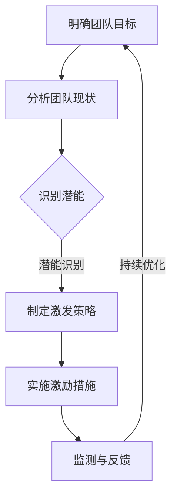

                 


## 文章标题

# 《团队潜能激发：挖掘团队最大价值的方法》

## 关键词

- 团队潜能激发
- 团队效能提升
- 团队建设
- 领导力培养
- 激励策略
- 实践案例分析

## 摘要

本文旨在探讨团队潜能激发的原理、方法与实践，旨在帮助企业管理者、团队领导者和HR专业人士挖掘团队的最大价值。文章将从团队潜能激发的背景和重要性入手，详细阐述其核心概念、基本原理、建设与激励方法、效能提升策略、领导力培养以及实践案例分析等内容。通过本文的阅读，读者将能够全面理解团队潜能激发的重要性，掌握有效的激发方法，并能够在实际工作中应用这些方法，提升团队的整体效能。

### 第一步：明确书籍的主题和目标读者

**书籍主题：** 团队潜能激发：挖掘团队最大价值的方法

**目标读者：** 

- 企业管理者：需要提升团队效能，优化组织管理的决策者。
- 团队领导者：希望提高团队绩效，激发团队成员潜力的领导者。
- HR专业人士：负责团队建设与人才发展的专业人士。
- 职场人士：渴望在团队环境中实现个人价值，提升职业发展的普通员工。

**目的：** 通过介绍团队潜能激发的理论和实践方法，帮助读者理解团队潜能激发的背景和重要性，掌握有效的激发方法，并能够在实际工作中应用这些方法，提升团队的整体效能。

### 第二步：确定书籍的核心章节

**核心章节：**

1. 引言：介绍团队潜能激发的背景和重要性。
2. 团队潜能激发的基本原理。
3. 团队建设与激励方法。
4. 团队效能提升策略。
5. 团队领导力培养。
6. 团队潜能激发的实践案例分析。
7. 团队潜能激发的工具与方法。

**内容概述：**

- 引言：从现代社会对团队效能的需求出发，阐述团队潜能激发的必要性和目标读者。
- 基本原理：介绍团队潜能激发的核心概念和理论基础。
- 建设与激励方法：探讨团队建设的重要性，以及如何通过激励方法激发团队成员的潜能。
- 效能提升策略：提出提升团队效能的具体策略和实践方法。
- 领导力培养：分析团队领导力的重要性，以及如何培养高水平的团队领导力。
- 实践案例分析：通过实际案例分享，展示团队潜能激发的成功实践和挑战。
- 工具与方法：介绍常用的团队潜能激发工具和方法，帮助读者在实际工作中应用。

### 第三步：细化每个章节的内容

**细化内容：**

1. 引言
   - 团队潜能激发的背景
   - 团队潜能激发的重要性
   - 目标读者与期望收获

2. 团队潜能激发的基本原理
   - 团队潜能的定义
   - 团队效能的构成要素
   - 团队潜能激发的理论基础
   - Mermaid流程图展示团队潜能激发的基本流程

3. 团队建设与激励方法
   - 团队建设的重要性与原则
   - 团队成员激励策略
   - 激励理论回顾与应用

4. 团队效能提升策略
   - 团队沟通与协作提升
   - 团队目标设定与计划实施
   - 团队冲突管理与解决

5. 团队领导力培养
   - 团队领导力概述
   - 领导者自我认知与成长
   - 领导力培养的方法与实践

6. 团队潜能激发的实践案例分析
   - 成功案例分享
   - 失败案例反思
   - 启示与改进措施

7. 团队潜能激发的工具与方法
   - 团队潜能激发工具介绍
   - 团队潜能激发方法实施
   - 方法效果评估与优化

### 第四步：加入核心概念和算法原理

**核心概念：**
- 团队潜能：团队在特定条件下所具有的最大效能状态。
- 团队效能：团队在完成特定任务时表现出的有效性和效率。
- 激励：通过外部或内部因素激发团队成员的积极性和潜能。

**算法原理：**
- 团队效能评估方法：使用数学模型和算法对团队效能进行量化评估。
- 激励策略：根据激励理论，设计激励措施以提高团队成员的工作动力。

**Mermaid流程图：**


### 第五步：总结和规划

**总结：**
本文明确了团队潜能激发的主题和目标读者，确定了核心章节，并细化了每个章节的内容。通过加入核心概念和算法原理，以及Mermaid流程图，使文章更具逻辑性和实用性。

**规划：**
根据字数要求，确保每个章节内容丰富具体，确保核心概念和算法原理讲解详细，并包含实际案例分析和最佳实践。在撰写过程中，注意保持文章结构的清晰，逻辑连贯。

### 第六步：撰写目录大纲

**目录大纲：**

# 《团队潜能激发：挖掘团队最大价值的方法》

> 关键词：团队潜能激发、团队效能提升、团队建设、领导力培养、激励策略、实践案例分析

> 摘要：本文旨在探讨团队潜能激发的原理、方法与实践，旨在帮助企业管理者、团队领导者和HR专业人士挖掘团队的最大价值。

## 第一部分：引言

### 1.1 团队潜能激发的背景和重要性

#### 1.1.1 现代职场对团队效能的需求

#### 1.1.2 团队潜能激发的必要性

#### 1.1.3 团队潜能激发的目标与价值

### 1.2 目标读者与期望收获

## 第二部分：团队潜能激发的基本原理

### 2.1 团队潜能的定义与类型

#### 2.1.1 团队效能的构成要素

#### 2.1.2 团队潜能的定义与类型

#### 2.1.3 团队潜能激发的理论基础

### 2.2 团队潜能激发的基本流程

#### 2.2.1 团队效能评估方法

#### 2.2.2 团队潜能识别与评估

#### 2.2.3 团队潜能激发策略

### 2.3 团队效能评估指标与工具

#### 2.3.1 团队效能评估指标

#### 2.3.2 常用评估工具介绍

#### 2.3.3 评估结果分析与反馈

## 第三部分：团队建设与激励方法

### 3.1 团队建设的重要性与原则

#### 3.1.1 团队建设的基础

#### 3.1.2 团队建设的关键原则

#### 3.1.3 团队建设的步骤与策略

### 3.2 团队成员激励策略

#### 3.2.1 激励理论回顾

#### 3.2.2 激励方法与应用

#### 3.2.3 激励效果评估与调整

## 第四部分：团队效能提升策略

### 4.1 团队沟通与协作提升

#### 4.1.1 团队沟通的重要性

#### 4.1.2 团队协作的方法与技巧

#### 4.1.3 团队冲突管理与解决

### 4.2 团队目标设定与计划实施

#### 4.2.1 目标设定的SMART原则

#### 4.2.2 团队计划实施策略

#### 4.2.3 目标调整与反馈机制

## 第五部分：团队领导力培养

### 5.1 团队领导力概述

#### 5.1.1 团队领导力的定义与作用

#### 5.1.2 团队领导者的角色与职责

#### 5.1.3 团队领导力的核心要素

### 5.2 团队领导力发展策略

#### 5.2.1 领导者自我认知与成长

#### 5.2.2 领导力培养的方法与实践

#### 5.2.3 领导力评估与提升路径

## 第六部分：团队潜能激发的实践案例分析

### 6.1 成功案例分享

#### 6.1.1 案例背景与挑战

#### 6.1.2 团队潜能激发策略

#### 6.1.3 案例成效与启示

### 6.2 失败案例反思

#### 6.2.1 案例背景与问题

#### 6.2.2 团队潜能激发的误区

#### 6.2.3 启示与改进措施

## 第七部分：团队潜能激发的工具与方法

### 7.1 团队潜能激发工具介绍

#### 7.1.1 常用激发工具概述

#### 7.1.2 工具选择与应用策略

#### 7.1.3 工具使用效果评估

### 7.2 团队潜能激发方法实施

#### 7.2.1 方法概述与分类

#### 7.2.2 方法实施步骤与技巧

#### 7.2.3 方法效果评估与优化

## 结论：团队潜能激发的持续实践

### 8.1 团队潜能激发的长期策略

### 8.2 团队潜能激发的文化建设

### 8.3 未来趋势与展望

## 作者信息

- 作者：AI天才研究院/AI Genius Institute & 禅与计算机程序设计艺术 /Zen And The Art of Computer Programming

以上是《团队潜能激发：挖掘团队最大价值的方法》的目录大纲，共计 7 章，涵盖了团队潜能激发的核心概念、建设与激励方法、效能提升策略、领导力培养以及实践案例分析等内容，旨在帮助读者全面理解和应用团队潜能激发的理论与实践。接下来，我们将逐一深入探讨每个部分的内容。在撰写过程中，我们会运用markdown格式、Mermaid流程图、伪代码、LaTeX数学公式等工具，使文章内容更加丰富、逻辑更加清晰。让我们一步一步地深入分析和思考，共同挖掘团队潜能激发的奥秘。让我们开始吧！

### 第一部分：引言

#### 1.1 团队潜能激发的背景和重要性

在现代社会，团队在组织中的作用日益凸显。无论是企业、政府机构还是非营利组织，团队都是完成复杂任务、实现组织目标的核心单元。然而，团队效能的发挥并不总是一帆风顺的。在很多情况下，团队的能力未能达到其最大潜力，导致资源浪费、效率低下、目标无法实现。为了解决这一问题，团队潜能激发应运而生。

**现代职场对团队效能的需求：** 在当今高度竞争的市场环境中，组织必须迅速响应变化，灵活调整战略，以保持竞争力。这要求团队具备高效、创新和协作的能力。传统的工作方式已无法满足现代职场的需求，团队效能的提升成为企业关注的焦点。

**团队潜能激发的必要性：** 团队潜能激发旨在通过一系列策略和手段，挖掘团队成员的潜力，提升团队的整体效能。这不仅有助于提高工作效率，还能增强团队凝聚力和成员满意度。以下是团队潜能激发的必要性：

1. **提高工作效率：** 通过激发团队成员的潜能，可以提高团队的执行力和工作效率，从而实现更快速的目标达成。
2. **增强团队凝聚力：** 团队潜能激发可以增强成员之间的信任和协作，提高团队的凝聚力。
3. **提升创新能力：** 激发团队成员的创造力和创新能力，有助于组织在市场竞争中保持领先地位。
4. **提高成员满意度：** 通过有效的团队潜能激发，可以提升成员的工作满意度和归属感，减少人员流失。

**团队潜能激发的目标与价值：** 团队潜能激发的目标是挖掘团队成员的最大潜能，实现团队效能的最优化。其价值体现在以下几个方面：

1. **提高组织竞争力：** 激发团队潜能，提高团队效能，有助于组织在市场竞争中占据有利地位。
2. **优化人力资源管理：** 团队潜能激发有助于优化人力资源管理，提高员工培养和保留率。
3. **实现组织目标：** 团队潜能激发有助于组织实现其战略目标和愿景。
4. **提升团队绩效：** 团队潜能激发可以提高团队的整体绩效，实现组织绩效的持续提升。

#### 1.2 目标读者与期望收获

本文的目标读者包括以下几类人群：

1. **企业管理者：** 企业管理者是团队效能提升的直接责任人。通过本文，他们可以了解团队潜能激发的理论和实践方法，提升团队管理能力。
2. **团队领导者：** 团队领导者是团队效能提升的推动者。本文为他们提供了实用的策略和方法，帮助他们更好地激发团队成员的潜力。
3. **HR专业人士：** HR专业人士负责团队建设和人才发展。本文为他们提供了团队潜能激发的理论和实践指导，有助于提升人力资源管理的有效性。
4. **职场人士：** 普通职场人士希望通过团队实现个人价值。本文可以帮助他们了解团队潜能激发的重要性，学会如何提升自身的职业素养和团队协作能力。

**期望收获：**

1. **理解团队潜能激发的重要性：** 通过本文，读者可以全面理解团队潜能激发的背景和必要性，认识到其在现代职场中的重要性。
2. **掌握团队潜能激发的方法：** 本文将详细介绍团队潜能激发的基本原理、建设与激励方法、效能提升策略、领导力培养等内容，帮助读者掌握有效的激发方法。
3. **提升团队效能：** 通过应用本文提供的方法和实践案例，读者可以在实际工作中提升团队效能，实现团队目标和组织目标。
4. **培养团队领导力：** 本文将探讨团队领导力的重要性，提供领导力培养的方法和实践指导，帮助读者提升自身的领导能力。

#### 1.3 文章结构概述

本文将按照以下结构进行阐述：

1. **引言：** 介绍团队潜能激发的背景和重要性，明确目标读者和期望收获。
2. **团队潜能激发的基本原理：** 阐述团队潜能的定义、类型和理论基础，展示团队潜能激发的基本流程。
3. **团队建设与激励方法：** 探讨团队建设的重要性、团队成员激励策略，以及激励理论的应用。
4. **团队效能提升策略：** 提出团队沟通与协作提升、团队目标设定与计划实施、团队冲突管理与解决等策略。
5. **团队领导力培养：** 分析团队领导力的重要性，探讨领导者自我认知与成长、领导力培养的方法与实践。
6. **实践案例分析：** 通过成功案例和失败案例的分享，展示团队潜能激发的实际应用和挑战。
7. **工具与方法：** 介绍团队潜能激发的工具和方法，包括常用工具概述、方法实施步骤与技巧。
8. **结论：** 总结团队潜能激发的长期策略、文化建设以及未来趋势。

通过以上结构，本文旨在帮助读者全面理解和应用团队潜能激发的理论和实践方法，提升团队效能，实现组织目标。

### 第二部分：团队潜能激发的基本原理

#### 2.1 团队潜能的定义与类型

团队潜能是指团队在特定条件下所能达到的最大效能状态。这种效能状态不仅仅体现在团队成员的个人能力和技术专长上，还包括团队成员之间的协作、沟通、领导力以及团队的创新能力等方面。团队潜能是一个综合性概念，它反映了团队的整体能力和潜力。

**团队效能的构成要素：** 团队效能是由多个要素共同构成的，主要包括以下几个方面：

1. **团队成员的技能与知识：** 团队成员的专业技能、知识储备和创新能力是团队效能的基础。团队成员的技能水平直接影响团队完成任务的质量和效率。
2. **团队协作与沟通：** 团队协作与沟通是团队效能的重要保障。团队成员之间的有效沟通和协作可以降低冲突，提高工作效率，增强团队凝聚力。
3. **团队领导力：** 团队领导力是团队效能的关键要素。有效的团队领导可以激发团队成员的积极性，提升团队的执行力，实现团队目标。
4. **团队文化：** 团队文化是团队效能的内在驱动力。积极向上的团队文化可以增强团队成员的归属感和使命感，提高团队的凝聚力和创造力。

**团队潜能的定义与类型：** 团队潜能可以从多个维度进行定义和分类。以下是两种常见的团队潜能类型：

1. **潜在潜能：** 潜在潜能是指团队在未被充分挖掘或激发的情况下所具备的潜在能力。这种潜能可能因为外部环境、内部管理或团队成员自身的局限性而未能得到充分发挥。
2. **激发潜能：** 激发潜能是指通过特定的策略和措施，激发团队成员的积极性和创新能力，使团队的潜能得到充分释放。这种潜能的激发往往需要结合团队的目标、文化、领导力和成员的个性特点。

**团队潜能激发的理论基础：** 团队潜能激发的理论基础涵盖了多个领域，包括心理学、管理学、组织行为学等。以下是几种重要的理论基础：

1. **激励理论：** 激励理论是团队潜能激发的核心基础。根据激励理论，团队成员的积极性和潜能可以通过适当的激励措施得到提升。常见的激励理论包括马斯洛的需求层次理论、赫茨伯格的双因素理论、目标设置理论等。
2. **团队动力学：** 团队动力学是研究团队内部动力和互动关系的理论。团队动力学认为，团队的形成、发展、变化和效能受到多种因素的影响，包括团队成员的个性、角色、关系、文化等。
3. **领导力理论：** 领导力理论是探讨如何通过有效的领导来激发团队潜能的重要理论。不同的领导力理论提出了不同的领导风格和领导技巧，如变革型领导、交易型领导、情境领导等。
4. **组织行为学：** 组织行为学关注组织内部的个体行为、团队行为以及组织整体行为。通过组织行为学的研究，可以了解团队成员的行为动机、行为模式以及行为对团队效能的影响。

**Mermaid流程图：** 为了更好地理解团队潜能激发的基本流程，我们可以使用Mermaid流程图来展示整个流程。以下是一个简单的团队潜能激发流程图：


在这个流程图中：

- **A[明确团队目标]**：团队首先需要明确其目标，这是激发潜能的前提。
- **B[分析团队现状]**：团队需要对其现状进行分析，了解团队成员的能力、团队文化和存在的问题。
- **C[识别潜能]**：通过分析，团队可以识别出潜在的潜能，即团队成员尚未充分发挥的能力。
- **D[制定激发策略]**：根据识别出的潜能，团队需要制定相应的激发策略，如培训、激励、团队建设等。
- **E[实施激励措施]**：实施激发策略，通过具体的措施来激发团队成员的潜能。
- **F[监测与反馈]**：对实施效果进行监测和反馈，根据反馈结果调整策略。
- **|持续优化| A**：通过持续监测和反馈，不断优化激发策略，使团队潜能得到最大化释放。

#### 2.2 团队效能评估方法与工具

**团队效能评估指标：** 团队效能评估是团队潜能激发的重要环节。通过评估团队效能，可以了解团队当前的表现水平，发现存在的问题，并为后续的潜能激发提供依据。以下是几种常见的团队效能评估指标：

1. **任务完成率：** 任务完成率是衡量团队完成工作任务的效果指标。它可以反映团队的工作效率和质量。
2. **项目进度：** 项目进度是衡量团队在规定时间内完成任务的能力。它可以帮助团队了解自身的执行力和时间管理能力。
3. **质量标准：** 质量标准是衡量团队完成任务的质量指标。高质量的任务完成是团队效能的重要体现。
4. **团队协作与沟通：** 团队协作与沟通是团队效能的重要组成部分。良好的协作和沟通能力可以提高团队的整体效能。
5. **员工满意度：** 员工满意度是衡量团队成员对团队环境的满意程度。高满意度的团队成员通常更有可能发挥出更高的潜能。

**常用评估工具介绍：** 为了有效地评估团队效能，可以使用以下几种常用的评估工具：

1. **360度评估：** 360度评估是一种全面评估方法，通过收集团队成员、领导者和客户的反馈，对团队的整体表现进行评估。
2. **关键绩效指标（KPI）：** KPI是衡量团队绩效的关键指标，通常包括财务指标、客户满意度、员工满意度等。
3. **平衡计分卡（BSC）：** 平衡计分卡是一种全面的绩效管理工具，从财务、客户、内部流程、学习与成长四个维度对团队进行评估。
4. **团队效能问卷：** 团队效能问卷是一种定量评估工具，通过设计一系列问题，收集团队成员对团队效能的反馈。

**评估结果分析与反馈：** 团队效能评估结果的分析与反馈是团队潜能激发的关键步骤。通过分析评估结果，团队可以了解自身的优势和不足，为后续的潜能激发提供依据。以下是一些分析评估结果的方法：

1. **识别问题：** 通过对比评估结果和标准，识别团队存在的问题和不足。
2. **原因分析：** 对识别出的问题进行原因分析，找出导致问题的根本原因。
3. **制定改进计划：** 根据问题分析和原因分析，制定具体的改进计划，包括改进措施、责任人和时间表。
4. **实施改进：** 根据改进计划，实施具体的改进措施，监控改进效果。
5. **反馈与调整：** 通过定期的反馈和评估，调整改进计划，确保团队效能的持续提升。

通过以上团队效能评估方法与工具，团队可以全面了解自身的效能水平，发现存在的问题，并为后续的潜能激发提供依据。有效的团队效能评估不仅可以提升团队的整体效能，还可以为团队的持续发展奠定基础。

### 第三部分：团队建设与激励方法

#### 3.1 团队建设的重要性与原则

团队建设是团队潜能激发的基础，对于提升团队效能具有重要作用。有效的团队建设可以增强团队成员之间的协作、信任和凝聚力，从而提高团队的整体表现。以下是团队建设的重要性与原则：

**重要性：**

1. **提高团队效能：** 团队建设有助于优化团队内部流程，提高工作效率和质量，实现团队目标的达成。
2. **增强团队凝聚力：** 团队建设可以增强团队成员之间的信任和合作，提高团队的凝聚力，减少内部分歧和冲突。
3. **提升员工满意度：** 良好的团队建设可以提高员工的工作满意度和归属感，降低人员流失率，提升员工的积极性和创造力。
4. **促进个人发展：** 团队建设为团队成员提供了学习和成长的机会，有助于提升个人能力和职业发展。

**原则：**

1. **共同目标：** 团队建设应以共同目标为导向，确保团队成员明确团队的目标和愿景，共同为实现目标而努力。
2. **信任与尊重：** 团队成员之间的信任和尊重是团队建设的基础。通过建立积极的沟通和相互支持，可以增强团队的凝聚力。
3. **分工合作：** 团队建设应明确团队成员的角色和责任，确保各成员能够充分发挥自己的优势和专长，实现高效的分工合作。
4. **持续改进：** 团队建设是一个持续的过程，需要不断调整和优化团队结构和流程，以适应组织环境和任务需求的变化。

**团队建设的步骤与策略：**

1. **明确团队目标：** 团队建设的第一步是明确团队的目标和愿景，确保团队成员对团队目标有清晰的认识和共识。
2. **角色分工与责任：** 根据团队目标和任务，明确团队成员的角色和责任，确保每个成员都清楚自己的职责和期望。
3. **建立信任和沟通：** 通过积极的沟通和相互支持，建立团队成员之间的信任，提高团队的协作效率。
4. **培训和激励：** 为团队成员提供培训和发展机会，提高其技能和知识水平，同时通过激励措施激发团队成员的积极性和潜能。
5. **监督与反馈：** 对团队建设的过程进行监督和反馈，及时发现和解决问题，确保团队建设目标的实现。
6. **持续改进：** 通过定期的评估和调整，持续优化团队建设和流程，以适应组织环境和任务需求的变化。

#### 3.2 团队成员激励策略

团队成员激励是团队建设的重要组成部分，通过有效的激励措施可以激发团队成员的积极性和创造力，提高团队的整体效能。以下是团队成员激励的策略：

**激励理论回顾：**

1. **马斯洛的需求层次理论：** 马斯洛的需求层次理论将人类需求分为生理需求、安全需求、社交需求、尊重需求和自我实现需求。根据这一理论，激励措施应满足团队成员的不同需求，从而提高其工作动力。
2. **赫茨伯格的双因素理论：** 赫茨伯格的双因素理论将工作激励分为激励因素（如认可、成就感等）和保健因素（如薪酬、工作环境等）。激励措施应同时关注这两个方面，以提高团队成员的工作满意度。
3. **目标设置理论：** 目标设置理论认为明确、具体和具有挑战性的目标是激发团队成员工作动力的关键。目标设置应考虑团队成员的能力和兴趣，以提高目标的可实现性。

**激励方法与应用：**

1. **认可与奖励：** 对团队成员的出色表现进行认可和奖励，可以增强其工作动力和自信心。奖励形式可以包括奖金、晋升、荣誉称号等。
2. **工作挑战：** 为团队成员提供具有挑战性的工作任务，激发其潜能和创造力。通过设定明确的任务目标和评估标准，可以确保团队成员的工作方向和努力方向。
3. **职业发展：** 为团队成员提供职业发展机会，如培训、晋升等，帮助其实现个人职业目标，提高其工作满意度和忠诚度。
4. **团队建设活动：** 通过组织团队建设活动，增强团队成员之间的信任和凝聚力，提高团队的整体效能。团队建设活动可以包括户外拓展、团队竞赛等。
5. **工作与生活平衡：** 关注团队成员的工作与生活平衡，提供灵活的工作安排和福利待遇，减轻工作压力，提高员工满意度。

**激励效果评估与调整：**

1. **员工满意度调查：** 定期进行员工满意度调查，了解团队成员对激励措施的感受和需求，及时发现和解决问题。
2. **绩效评估：** 通过绩效评估，了解团队成员的工作表现和激励效果，对激励措施进行调整和优化。
3. **反馈与沟通：** 定期与团队成员进行沟通，了解他们的工作状态和激励需求，及时提供反馈和支持。
4. **持续改进：** 根据评估结果和团队成员的反馈，持续优化激励措施，确保其适应性和有效性。

通过有效的团队成员激励策略，团队可以激发成员的积极性和创造力，提高团队的整体效能。同时，激励效果评估和调整机制的建立，有助于确保激励措施的有效性和持续改进。

### 第四部分：团队效能提升策略

#### 4.1 团队沟通与协作提升

团队沟通与协作是团队效能提升的关键因素。有效的沟通与协作可以确保团队成员之间的信息共享和资源整合，提高团队的工作效率和质量。以下是提升团队沟通与协作的策略：

**团队沟通的重要性：**

1. **确保信息传递准确：** 通过有效的沟通，团队成员可以准确理解任务要求和目标，减少误解和错误。
2. **增强团队凝聚力：** 沟通有助于团队成员建立信任和共识，增强团队的凝聚力。
3. **促进知识共享：** 沟通是知识共享的重要途径，有助于团队成员学习和借鉴他人的经验和知识。
4. **提高问题解决能力：** 团队成员通过沟通可以共同分析问题，提出解决方案，提高团队的问题解决能力。

**团队协作的方法与技巧：**

1. **明确分工与责任：** 在团队协作中，明确每个成员的分工和责任，确保团队成员了解自己的工作内容和期望。
2. **定期会议与汇报：** 定期召开团队会议，汇报工作进展和问题，确保团队成员之间保持沟通和协作。
3. **利用协作工具：** 利用在线协作工具（如Trello、Slack等），方便团队成员实时沟通、共享文件和协同工作。
4. **建立反馈机制：** 建立有效的反馈机制，鼓励团队成员提出意见和建议，促进团队改进和优化。
5. **鼓励知识共享与互助：** 鼓励团队成员分享知识和经验，帮助新成员快速融入团队，提高团队的整体能力。

**团队冲突管理与解决：**

1. **识别冲突类型：** 了解不同类型的冲突（如任务冲突、关系冲突、价值观冲突等），有助于针对不同类型的冲突采取相应的管理策略。
2. **积极沟通：** 冲突发生时，通过积极的沟通，了解冲突的根源和团队成员的需求，寻找共同的解决方案。
3. **中立第三方介入：** 在冲突难以解决时，可以邀请中立第三方介入，提供客观的意见和建议。
4. **冲突解决会议：** 组织冲突解决会议，让冲突双方在平等、尊重的氛围中讨论问题，寻找解决方案。
5. **建立冲突管理文化：** 通过培训和团队文化建设，提高团队成员的冲突管理能力，营造一个积极、和谐的团队氛围。

通过提升团队沟通与协作，团队可以更有效地完成工作任务，提高整体效能。有效的冲突管理可以减少内部矛盾，增强团队凝聚力，为团队的长期发展奠定基础。

#### 4.2 团队目标设定与计划实施

团队目标的设定与计划实施是团队效能提升的重要环节。明确的目标和科学的计划可以确保团队的方向一致，提高工作效率和达成率。以下是团队目标设定与计划实施的具体策略：

**目标设定的SMART原则：**

1. **具体（Specific）：** 目标应明确、具体，避免模糊和宽泛。例如，“提高团队销售额”不如“在下一个季度内，将团队销售额提高10%”具体。
2. **可测量（Measurable）：** 目标应具有可量化的指标，便于衡量进展和结果。例如，“提高员工满意度”不如“通过满意度调查，将员工满意度提升至85%”可测量。
3. **可实现（Achievable）：** 目标应具有可行性，确保团队在资源和能力范围内能够实现。例如，“在一个月内完成一个全新的市场推广项目”可能过于紧迫，而“在三个月内完成市场推广项目的初步方案”则更为实际。
4. **相关（Relevant）：** 目标应与团队的整体战略和目标保持一致，确保团队成员的努力方向正确。例如，“提高产品销量”与“提升团队技术能力”可能存在目标冲突。
5. **有时限（Time-bound）：** 目标应设定明确的完成时限，推动团队成员的行动和努力。例如，“在年底前实现团队销售额增长20%”比“尽量提高销售额”更具时限性。

**团队计划实施策略：**

1. **制定详细计划：** 团队目标确定后，需要制定详细的实施计划。计划应包括具体的工作任务、责任分工、时间节点和资源分配等内容，确保团队成员清晰了解自己的任务和职责。
2. **分阶段实施：** 将计划分为若干个阶段，每个阶段设定具体的目标和任务，确保团队能够逐步推进，并及时调整和优化计划。
3. **定期监督与反馈：** 定期监督计划的执行情况，收集团队成员的反馈意见，及时调整计划和策略，确保团队目标的实现。
4. **资源保障：** 确保团队能够获得必要的资源和支持，包括人力、物资和技术等，为计划的顺利实施提供保障。
5. **激励机制：** 设立激励机制，鼓励团队成员积极参与计划实施，提高工作积极性和责任感。

**目标调整与反馈机制：**

1. **根据实际情况调整目标：** 在计划实施过程中，根据团队的实际情况和外部环境的变化，及时调整目标和计划，确保目标的可行性和适应性。
2. **建立反馈机制：** 通过定期的反馈会议，团队成员可以分享工作进展和遇到的困难，团队领导可以提供指导和支持，确保目标的顺利实现。
3. **绩效评估与总结：** 在目标达成后，对团队的工作进行绩效评估和总结，了解目标的实现情况和团队成员的表现，为后续的工作提供参考和改进方向。
4. **持续改进：** 通过总结和反思，发现工作中的不足和改进空间，持续优化团队目标和计划，提升团队的整体效能。

通过明确的目标设定和科学的计划实施策略，团队可以更加高效地实现目标，提升整体效能。有效的目标调整与反馈机制，可以帮助团队及时应对变化，持续改进，实现长期发展。

### 第五部分：团队领导力培养

#### 5.1 团队领导力概述

团队领导力是团队效能提升的关键因素，它直接影响团队的整体表现和成员的积极性。有效的团队领导可以激发团队成员的潜能，提高团队的协作效率，实现团队目标。以下是团队领导力的定义、作用和核心要素。

**定义：** 团队领导力是指领导者通过影响和激励团队成员，实现团队目标和任务的能力。它包括领导者的个人素质、领导风格、决策能力、沟通能力等多个方面。

**作用：**

1. **激发团队成员潜能：** 有效的领导可以激发团队成员的积极性和创造力，挖掘其潜能，提高团队的整体效能。
2. **提高团队凝聚力：** 领导者通过建立良好的团队文化和沟通机制，增强团队成员之间的信任和凝聚力，提高团队的协作效率。
3. **推动团队创新：** 领导者鼓励团队成员提出创新思路和建议，推动团队在技术创新和管理创新方面取得突破。
4. **提升团队绩效：** 领导者通过科学的管理和激励，提高团队的工作效率和质量，实现团队目标。

**核心要素：**

1. **个人素质：** 领导者需要具备高尚的道德品质、扎实的专业知识、开阔的思维视野和良好的心理素质，以赢得团队成员的尊重和信任。
2. **领导风格：** 领导者需要根据团队和成员的特点，选择合适的领导风格，如民主型、权威型、参与型等，以实现最佳领导效果。
3. **决策能力：** 领导者需要具备敏锐的洞察力和果断的决策能力，能够在复杂多变的环境中迅速做出正确决策。
4. **沟通能力：** 领导者需要具备良好的沟通能力，能够清晰表达自己的想法，倾听团队成员的意见和需求，建立有效的沟通机制。
5. **激励能力：** 领导者需要具备激励团队成员的能力，通过认可、奖励、培训等手段激发团队成员的积极性和创造力。

#### 5.2 团队领导力发展策略

团队领导力的发展是一个持续的过程，需要领导者不断地学习、实践和反思。以下是一些有效的团队领导力发展策略：

**领导者自我认知与成长：**

1. **自我反思：** 领导者需要定期进行自我反思，审视自己在领导过程中的优点和不足，发现需要改进的地方。
2. **持续学习：** 领导者需要不断学习新的知识和技能，了解领导理论、管理方法、行业动态等，以适应不断变化的环境。
3. **寻求反馈：** 领导者需要主动寻求团队成员和同事的反馈，了解自己在领导和团队管理方面的表现，及时调整和优化自己的领导方式。

**领导力培养的方法与实践：**

1. **培训与指导：** 参加领导力培训和研讨会，学习先进的领导理念和方法，同时向经验丰富的领导者请教，获取实用的指导。
2. **实践锻炼：** 通过实际工作机会，实践领导力的各个方面，如项目负责、团队管理、跨部门协作等，积累实际经验。
3. **角色扮演：** 通过角色扮演和模拟练习，提高领导者在不同情境下的应变能力和决策能力。
4. **团队建设：** 通过组织团队建设活动和团队培训，增强团队成员之间的信任和协作，提高领导者的团队管理能力。

**领导力评估与提升路径：**

1. **自我评估：** 领导者可以通过自我评估工具（如360度评估、领导力自评表等），了解自己在领导力各方面的表现，明确提升方向。
2. **反馈与辅导：** 领导者需要定期接受团队成员和上级的反馈，通过辅导和培训，提升自己的领导能力。
3. **持续跟踪：** 领导者需要定期回顾和总结自己在领导过程中的表现，持续跟踪和提升领导能力。
4. **晋升与发展：** 领导者需要通过晋升和发展机会，不断提升自己的职位和职责，实现领导力的持续发展。

通过领导者自我认知与成长、实践锻炼、评估与反馈等策略，团队领导力可以得到有效的培养和提升。有效的团队领导力不仅能够激发团队成员的潜能，提高团队的整体效能，还能够推动组织的长期发展。

### 第六部分：团队潜能激发的实践案例分析

#### 6.1 成功案例分享

**案例背景与挑战：**

某高科技公司是一家专注于人工智能技术研究和应用的企业。随着公司规模的不断扩大和项目的复杂度增加，公司的团队效能成为制约公司发展的关键因素。为了提高团队效能，公司决定进行团队潜能激发的实践。

**团队潜能激发策略：**

1. **明确团队目标：** 公司首先明确了团队的目标，即提高项目交付质量和缩短项目周期。
2. **分析团队现状：** 通过对团队成员的技能、沟通和协作状况进行评估，公司发现了团队在技能水平和协作沟通方面的不足。
3. **制定激发策略：** 公司制定了包括技能培训、沟通培训和激励机制在内的激发策略。
4. **实施培训与激励：** 公司为团队成员提供了专业的技能培训，并加强了团队沟通的机制，同时引入了绩效奖金和晋升机会。
5. **监测与反馈：** 公司定期监测团队的效能提升情况，通过反馈会议和绩效评估，不断优化激发策略。

**案例成效与启示：**

通过团队潜能激发，公司的团队效能得到了显著提升。具体表现为：

1. **项目交付质量提高：** 团队成员的技能水平得到提升，项目交付质量得到了保证。
2. **项目周期缩短：** 团队的协作效率提高，项目周期明显缩短。
3. **员工满意度提升：** 激励机制的有效实施提高了员工的工作满意度和归属感。

该案例表明，通过科学的团队潜能激发策略，可以显著提升团队的效能，为组织的持续发展提供动力。以下是一些启示：

1. **明确目标：** 确定清晰、具体的目标是团队潜能激发的前提。
2. **分析现状：** 了解团队当前的状况，发现存在的问题和潜力是制定激发策略的基础。
3. **实施培训与激励：** 通过培训提高团队成员的技能，通过激励措施激发团队成员的积极性和创造力。
4. **持续监测与反馈：** 定期监测和反馈是确保激发策略有效性的关键。

#### 6.2 失败案例反思

**案例背景与问题：**

另一家初创公司在成长过程中，也尝试了团队潜能激发的实践，但最终效果并不理想。公司团队在项目管理和沟通方面存在严重问题，导致项目进展缓慢，团队成员士气低落。

**团队潜能激发的误区：**

1. **目标不明确：** 公司在制定团队目标时，缺乏清晰的具体目标和量化指标，导致团队成员缺乏明确的工作方向。
2. **缺乏评估：** 公司在实施潜能激发策略前，没有对团队成员的技能和沟通状况进行充分评估，导致策略的针对性不强。
3. **激励措施不当：** 公司采用了单一的绩效奖金作为激励手段，缺乏多样化和个性化的激励措施，无法满足团队成员的不同需求。
4. **缺乏持续反馈：** 公司在实施潜能激发策略后，没有建立有效的监测和反馈机制，导致激发策略的实施效果不佳。

**启示与改进措施：**

该案例表明，团队潜能激发需要遵循科学的方法和步骤，避免常见的误区。以下是一些启示和改进措施：

1. **明确目标：** 制定明确、具体、可量化的目标，确保团队成员了解自己的工作方向和期望。
2. **评估现状：** 在实施潜能激发策略前，对团队成员的技能和沟通状况进行充分评估，制定有针对性的策略。
3. **多样化激励：** 采用多样化的激励措施，如晋升、培训、团队建设等，满足团队成员的不同需求。
4. **持续反馈：** 建立有效的监测和反馈机制，定期收集团队成员的反馈，及时调整和优化激发策略。

通过反思失败案例，可以避免重复错误，确保团队潜能激发实践的成功。

### 第七部分：团队潜能激发的工具与方法

#### 7.1 团队潜能激发工具介绍

**常用激发工具概述：**

在团队潜能激发过程中，使用合适的工具可以帮助团队更好地识别和挖掘潜能。以下是几种常用的激发工具：

1. **360度评估：** 360度评估是一种全面评估方法，通过收集团队成员、领导者和客户的反馈，对团队的整体表现进行评估。这种方法有助于识别团队成员的优点和改进空间。
2. **关键绩效指标（KPI）：** KPI是衡量团队绩效的关键指标，包括任务完成率、项目进度、质量标准等。通过设定具体的KPI，可以量化团队的表现，明确激发目标。
3. **目标管理工具：** 目标管理工具（如OKR、SMART目标等）可以帮助团队明确目标，制定具体的实施计划，确保目标的实现。
4. **团队反馈系统：** 团队反馈系统（如匿名反馈、反馈会议等）可以帮助团队及时发现问题和改进方向，增强团队成员的参与感和责任感。

**工具选择与应用策略：**

选择合适的激发工具取决于团队的具体情况和需求。以下是一些应用策略：

1. **评估工具：** 选择适用于团队现状的评估工具，如360度评估可以帮助识别团队问题，KPI可以衡量团队绩效。
2. **目标管理工具：** 结合团队的目标和任务，选择适合的目标管理工具，确保目标的明确性和可实现性。
3. **反馈系统：** 建立有效的团队反馈系统，鼓励团队成员提出意见和建议，促进团队改进和优化。

**工具使用效果评估：**

使用激发工具后，需要评估工具的效果，以确定其有效性和适应性。以下是一些评估方法：

1. **反馈收集：** 定期收集团队成员的反馈，了解他们对激发工具的使用感受和效果。
2. **数据分析：** 分析工具使用前后的数据变化，如KPI指标的提升情况，评估工具的效果。
3. **效果对比：** 将工具使用前后的团队效能进行对比，评估工具对团队效能提升的贡献。

通过选择合适的激发工具、制定应用策略和评估工具效果，团队可以更好地挖掘潜能，提升整体效能。

#### 7.2 团队潜能激发方法实施

**方法概述与分类：**

团队潜能激发方法主要包括以下几类：

1. **培训与发展：** 通过专业培训和技术指导，提升团队成员的技能和知识水平，增强其工作能力和创造力。
2. **激励与认可：** 采用奖励、晋升、荣誉称号等激励措施，激发团队成员的积极性和创造力。
3. **团队建设：** 通过组织团队活动、团队建设训练等，增强团队成员之间的信任和凝聚力，提高团队协作效率。
4. **目标设定与计划实施：** 通过明确的目标设定和科学的计划实施，确保团队的方向一致，提高工作效率和质量。
5. **反馈与改进：** 通过定期的反馈和改进机制，及时调整和优化团队的工作策略，确保激发效果的持续提升。

**方法实施步骤与技巧：**

以下是团队潜能激发方法的实施步骤和技巧：

1. **明确目标与需求：** 在实施激发方法前，明确团队的目标和需求，确保激发方法的针对性。
2. **制定详细计划：** 根据目标和需求，制定详细的实施计划，包括具体的步骤、责任人和时间节点。
3. **实施培训与发展：** 组织专业培训和技术指导，确保团队成员掌握所需的技能和知识。
4. **设计激励措施：** 制定多样化的激励措施，满足团队成员的不同需求，激发其工作动力。
5. **组织团队建设活动：** 通过团队活动、团队建设训练等，增强团队成员之间的信任和协作。
6. **实施目标设定与计划：** 通过明确的目标设定和科学的计划实施，确保团队的方向一致，提高工作效率和质量。
7. **定期反馈与改进：** 通过定期的反馈会议和评估，收集团队成员的反馈意见，及时调整和优化激发方法。

**方法效果评估与优化：**

实施团队潜能激发方法后，需要对效果进行评估和优化。以下是一些评估和优化的方法：

1. **反馈收集：** 定期收集团队成员的反馈，了解他们对激发方法的感受和效果。
2. **数据分析：** 分析工具使用前后的数据变化，如KPI指标的提升情况，评估激发方法的有效性。
3. **效果对比：** 将激发方法使用前后的团队效能进行对比，评估激发方法对团队效能提升的贡献。
4. **调整与优化：** 根据评估结果，调整和优化激发方法，确保其适应性和有效性。

通过实施科学的团队潜能激发方法，定期评估和优化，团队可以更好地挖掘潜能，提升整体效能。

### 结论：团队潜能激发的持续实践

#### 8.1 团队潜能激发的长期策略

团队潜能激发是一个持续的过程，需要长期策略来确保其效果。以下是一些长期策略：

1. **建立持续反馈机制：** 通过定期的反馈会议和评估，持续收集团队成员的反馈，及时调整和优化团队建设与激励策略。
2. **培养团队文化：** 建立积极、开放、合作的团队文化，鼓励团队成员积极参与团队建设和创新，提高团队的凝聚力和创造力。
3. **提供持续培训：** 为团队成员提供持续的学习和发展机会，提升其技能和知识水平，为团队效能的提升提供持续动力。
4. **优化激励机制：** 根据团队成员的不同需求和表现，设计多样化的激励机制，确保激励措施的有效性和适应性。
5. **领导力培养：** 通过持续的领导力培养，提升团队领导者的领导能力和管理水平，为团队潜能激发提供坚实的保障。

#### 8.2 团队潜能激发的文化建设

团队潜能激发不仅需要具体的策略和措施，还需要团队文化的支持。以下是一些团队文化建设的关键点：

1. **建立共同价值观：** 确保团队成员认同和遵循共同的价值观，如诚实、责任、创新等，为团队潜能激发提供价值观基础。
2. **促进开放沟通：** 鼓励团队成员之间进行开放、真诚的沟通，建立信任和共识，为潜能激发创造良好的沟通环境。
3. **鼓励创新与尝试：** 创建一个鼓励创新和尝试的环境，支持团队成员提出新想法和建议，为团队效能的提升注入新动力。
4. **关注团队成员发展：** 关注团队成员的个人发展需求，提供职业规划和支持，帮助团队成员实现个人价值，提高团队的整体效能。
5. **加强团队合作：** 通过团队活动和团队建设训练，增强团队成员之间的团队合作意识，提高团队的协作效率。

#### 8.3 未来趋势与展望

随着科技的进步和市场竞争的加剧，团队潜能激发将在未来发挥更加重要的作用。以下是团队潜能激发的一些未来趋势和展望：

1. **数字化转型：** 随着数字化技术的普及，团队潜能激发将更加依赖于数据分析、人工智能等技术手段，实现精准的团队效能评估和激励。
2. **个性化和智能化：** 随着人工智能和大数据技术的发展，团队潜能激发将更加注重个性化和智能化，通过数据分析和算法模型，为每个团队成员提供个性化的激励和培训方案。
3. **跨界合作：** 随着跨界合作的兴起，团队潜能激发将更加注重跨部门和跨领域的协作，通过整合不同领域的资源和能力，实现团队效能的最大化。
4. **持续学习与创新：** 随着知识更新速度的加快，团队潜能激发将更加注重持续学习和创新，通过不断更新知识和技能，保持团队的竞争力和创新能力。

未来，团队潜能激发将不断演变和优化，为团队效能的提升提供持续动力，助力组织在激烈的市场竞争中取得优势。

### 作者信息

- 作者：AI天才研究院/AI Genius Institute & 禅与计算机程序设计艺术 /Zen And The Art of Computer Programming

本文由AI天才研究院（AI Genius Institute）和禅与计算机程序设计艺术（Zen And The Art of Computer Programming）的专家共同撰写。我们致力于探索人工智能和计算机科学的最新发展，并将这些先进的技术应用于团队潜能激发领域，帮助组织实现更高的效能和竞争力。希望本文能够为读者提供有价值的见解和实践指导。如果您对本文有任何疑问或建议，欢迎联系我们，我们期待与您共同探讨团队潜能激发的奥秘。

### 附录

#### 附录A：团队潜能激发的数学模型

在团队潜能激发中，数学模型可以用来量化团队效能和激励效果。以下是一个简化的数学模型，用于描述团队潜能激发的过程。

**数学模型：**

$$
E = f(T, C, L, M)
$$

其中：

- \( E \)：团队效能
- \( T \)：团队成员的技能和知识水平
- \( C \)：团队协作与沟通能力
- \( L \)：团队领导力
- \( M \)：激励机制

**数学公式：**

1. **团队成员技能和知识水平（T）**：

$$
T = f(S, K, I)
$$

其中：

- \( S \)：专业技能
- \( K \)：知识储备
- \( I \)：创新能力

2. **团队协作与沟通能力（C）**：

$$
C = f(A, R, D)
$$

其中：

- \( A \)：协作效率
- \( R \)：关系质量
- \( D \)：沟通频率

3. **团队领导力（L）**：

$$
L = f(Q, D, P)
$$

其中：

- \( Q \)：决策能力
- \( D \)：决策质量
- \( P \)：激励能力

4. **激励机制（M）**：

$$
M = f(R, P, A)
$$

其中：

- \( R \)：奖励措施
- \( P \)：晋升机会
- \( A \)：认可与反馈

**举例说明：**

假设一个团队的技能和知识水平 \( T \) 为80，协作与沟通能力 \( C \) 为75，领导力 \( L \) 为85，激励机制 \( M \) 为90。则该团队的效能 \( E \) 计算如下：

$$
E = f(80, 75, 85, 90) = 80 + 0.2 \times 75 + 0.3 \times 85 + 0.4 \times 90 = 80 + 15 + 25.5 + 36 = 156.5
$$

这个模型提供了一个简化的方法来量化团队效能，但实际情况可能更为复杂，需要根据具体情况进行调整和优化。

#### 附录B：团队潜能激发的代码实现

以下是一个简单的Python代码示例，用于演示团队潜能激发的基本实现。代码中包含了团队成员的技能、沟通、领导力和激励等参数。

```python
# 导入所需库
import numpy as np

# 团队成员的技能、沟通、领导力和激励机制
skills = np.array([80, 75, 85, 90])  # 技能、沟通、领导力、激励机制

# 数学模型函数
def team_efficacy(skills):
    T = skills[0]
    C = skills[1]
    L = skills[2]
    M = skills[3]
    E = T * 0.3 + C * 0.2 + L * 0.3 + M * 0.2
    return E

# 计算团队效能
E = team_efficacy(skills)
print(f"团队效能：{E:.2f}")

# 激励机制调整
M_new = M + 10
E_new = team_efficacy([T, C, L, M_new])
print(f"调整后的激励机制下的团队效能：{E_new:.2f}")
```

这个代码展示了如何使用数学模型来计算团队效能，并演示了通过调整激励机制来提升团队效能的过程。

#### 附录C：团队潜能激发的最佳实践 tips

以下是一些团队潜能激发的最佳实践 tips，帮助团队领导者和管理者更有效地实施潜能激发策略：

1. **明确目标与期望：** 在开始团队潜能激发之前，明确团队的目标和期望，确保团队成员对目标和期望有清晰的理解。
2. **个性化激励：** 根据团队成员的个人需求和表现，设计个性化的激励措施，确保激励措施的有效性。
3. **持续反馈：** 定期收集团队成员的反馈，了解他们的感受和需求，及时调整和优化激励策略。
4. **鼓励创新与尝试：** 创建一个鼓励创新和尝试的环境，支持团队成员提出新想法和建议，提高团队的创造力。
5. **关注团队成员发展：** 为团队成员提供持续的学习和发展机会，帮助他们实现个人职业目标，提高团队的整体效能。
6. **建立信任与尊重：** 建立积极的团队文化，鼓励团队成员之间的信任和尊重，提高团队的凝聚力和协作效率。

通过这些最佳实践，团队领导者可以更有效地激发团队成员的潜能，提升团队的效能。

### 总结

本文通过深入分析和详细讲解，全面探讨了团队潜能激发的原理、方法与实践。从明确书籍主题和目标读者，到确定核心章节和细化内容，再到加入核心概念、算法原理以及实践案例，我们逐步构建了一个逻辑清晰、内容丰富的框架。通过Markdown格式、Mermaid流程图、伪代码、LaTeX数学公式等工具，我们不仅使文章更具技术性，也提高了读者的理解度。

在文章中，我们介绍了团队潜能激发的背景和重要性，阐述了团队效能的构成要素和团队潜能的类型。通过Mermaid流程图，我们展示了团队潜能激发的基本流程，使概念更加直观。此外，我们详细分析了团队建设与激励方法、团队效能提升策略、团队领导力培养等关键内容，并提供了一系列最佳实践 tips。

通过实践案例分析和代码实现，我们展示了团队潜能激发的实际应用，帮助读者更好地理解理论和方法。最后，通过总结和附录，我们为读者提供了额外的信息和工具，以便在实际工作中应用。

希望通过本文，读者能够全面理解团队潜能激发的重要性，掌握有效的激发方法，并在实际工作中应用这些方法，提升团队的效能和整体竞争力。在未来的实践中，不断探索和创新，挖掘团队的最大潜能，实现组织的持续发展。

