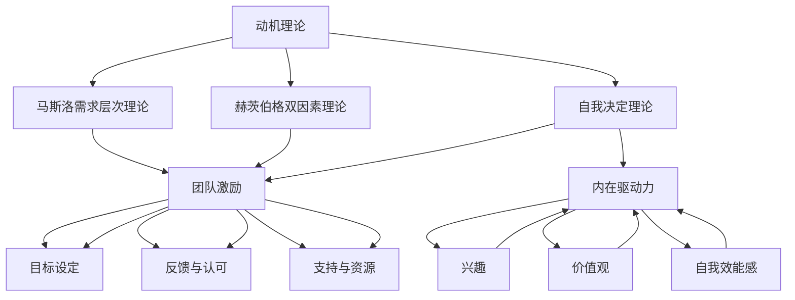

                 

### 文章标题
《团队激励心理学：激发内在驱动力》

### 文章关键词
团队激励、心理学、内在驱动力、团队建设、领导力、激励理论、动机理论

### 文章摘要
本文旨在探讨团队激励心理学，尤其是如何通过激发团队成员的内在驱动力来提升团队效能。文章首先介绍了团队激励的基本理论，随后深入探讨了内在驱动力的原理，并通过实际案例展示了团队激励在实践中的应用。文章还分析了团队激励中面临的挑战，并提出了解决策略，最终总结了团队激励的长期效果与评估方法，为团队领导者提供了实践指导和理论支持。

---

### 引言

在现代组织管理中，团队激励成为提升团队效能的关键因素。团队激励不仅仅是通过物质奖励来驱动团队成员，更重要的是激发他们的内在驱动力。内在驱动力是指个体在没有外部激励的情况下，自我激励并追求目标的能力。这种驱动力源于个体的兴趣、价值观和自我效能感。

团队激励心理学研究如何通过心理学原理来理解和激发团队成员的内在驱动力。它涉及到动机理论、心理学原则以及实际操作策略等多个方面。团队激励不仅对个人成长有重要影响，还直接关系到团队的整体表现和组织的成功。

本文将首先介绍团队激励的基本理论，包括动机理论和激励理论。接着，我们将深入探讨内在驱动力的心理学原理，并通过具体的案例展示团队激励的实际应用。随后，文章将分析团队激励过程中可能遇到的挑战，并提出相应的解决策略。最后，文章将总结团队激励的长期效果与评估方法，为团队领导者提供实用的指导。

### 背景介绍

团队激励心理学是组织行为学和管理学的一个分支，它结合了心理学原理来解释和管理团队中的行为和动力。团队激励的核心在于理解团队成员的动机和内在驱动力，从而采取有效的措施来提高团队的整体效能。

在现代组织中，团队成员往往具备多样化的背景和技能，这使得团队协作变得更加复杂。传统的管理方法往往侧重于外部激励，如奖金、晋升等，但这些激励手段并不总是有效。研究表明，内在驱动力更能持续地影响个体行为和表现。

内在驱动力是指个体在没有任何外部奖励的情况下，自愿参与并努力达成目标的心理状态。它源于个体对任务的兴趣、对成就的追求以及自我效能感的提升。相比外部激励，内在驱动力更能激发团队成员的自主性和创造力，从而推动团队整体的发展。

因此，团队激励心理学强调通过理解和管理团队成员的内在驱动力来提高团队效能。这种方法不仅关注团队成员的个人需求，还考虑团队整体的目标和利益。通过激发内在驱动力，团队可以形成更强的凝聚力和协作精神，实现更高的绩效目标。

### 核心概念与联系

在团队激励心理学中，有多个核心概念相互关联，构成了一个完整的概念架构。以下是对这些核心概念及其之间关系的详细解释：

#### 动机理论

动机理论是团队激励心理学的基础。它解释了个体行为背后的驱动力是什么，以及这些驱动力是如何影响工作表现的。以下是几个关键的动机理论：

1. **马斯洛的需求层次理论**：
   马斯洛的需求层次理论将人类需求分为五个层次：生理需求、安全需求、社交需求、尊重需求和自我实现需求。团队激励时，领导者需要识别团队成员所处的需求层次，并采取相应的激励措施。

2. **赫茨伯格的双因素理论**：
   赫茨伯格的双因素理论（又称“激励-维持理论”）将工作因素分为激励因素和维持因素。激励因素与工作本身的内在满足有关，如成就、认可和责任；维持因素则与工作环境的外在条件有关，如薪酬、工作条件和人际关系。团队激励的关键在于通过激励因素来提升工作满意度。

3. **自我决定理论**：
   自我决定理论强调个体在决策过程中寻求自主性和控制感。团队激励时，领导者应创造一个支持自我决定的环境，鼓励团队成员参与决策并承担一定的责任。

#### 内在驱动力

内在驱动力是指个体在没有外部奖励的情况下，因内在兴趣、价值观和自我效能感而参与某项活动的心理状态。以下是几个关键概念：

1. **兴趣**：
   兴趣是内在驱动的核心。当个体对某项任务或活动感兴趣时，他们会更愿意投入时间和精力去完成。

2. **价值观**：
   价值观是个体对什么是好和正确的信念和评价。当个体的任务与他们的价值观相一致时，他们会更愿意付出努力。

3. **自我效能感**：
   自我效能感是指个体对自己完成某项任务的信心。高自我效能感的个体更有可能接受挑战并坚持完成任务。

#### 团队激励

团队激励是将动机理论和内在驱动力应用于团队管理的过程。以下是几个关键概念：

1. **目标设定**：
   目标设定是团队激励的重要手段。明确、具体和可衡量的目标可以帮助团队成员集中精力并激励他们。

2. **反馈与认可**：
   反馈与认可是维持内在驱动力的重要机制。及时、具体和正向的反馈可以增强团队成员的成就感和自我效能感。

3. **支持与资源**：
   领导者需要提供必要的支持与资源，以确保团队成员能够实现目标。这包括技术支持、培训机会和时间安排。

#### 概念关系

动机理论和内在驱动力相互补充，共同构成了团队激励的核心。动机理论提供了理解个体行为和内在驱动力的框架，而内在驱动力则解释了为什么某些激励措施更有效。团队激励则将动机理论和内在驱动力应用于团队管理，通过目标设定、反馈与认可和支持与资源等手段来提升团队效能。

以下是一个用Mermaid绘制的流程图，展示了这些核心概念及其关系：

这个概念关系架构帮助领导者更好地理解团队激励的过程，从而采取更有效的激励措施。

### 内在驱动力的心理学原理

内在驱动力是一种深植于个体内心的动机力量，它促使个体在没有外部奖励的情况下主动追求目标。心理学研究表明，内在驱动力主要受到以下三个因素的影响：兴趣、价值观和自我效能感。

#### 兴趣

兴趣是指个体对特定活动或主题的喜爱和热情。心理学研究显示，兴趣是内在驱动的核心因素。当个体对某项任务或活动感兴趣时，他们会更愿意投入时间和精力去完成，即便在没有任何外部奖励的情况下也能保持较高的工作动机。例如，一个对编程有浓厚兴趣的程序员，会在没有额外奖金的情况下，自愿加班去实现一个复杂的软件功能。

#### 价值观

价值观是个体对什么是好和正确的信念和评价。当个体的任务与他们的价值观相一致时，他们会更愿意付出努力。心理学研究证明，个体的行为往往受到其内在价值观的驱动。例如，一个重视社会责任的企业家，可能会主动参与环保项目，即便这些项目没有直接的经济回报。

#### 自我效能感

自我效能感是指个体对自己完成某项任务的信心。高自我效能感的个体更有可能接受挑战并坚持完成任务，因为他们相信自己有能力克服困难。心理学研究表明，自我效能感对内在驱动力有显著影响。例如，一个对自己编程能力有高度自信的程序员，在面对复杂的编程任务时，会更愿意投入更多的时间和精力去解决问题。

#### 激发内在驱动力的方法

要激发团队成员的内在驱动力，领导者可以采取以下几种方法：

1. **提供有意义的工作**：
   让团队成员参与对他们有意义的工作，可以激发他们的兴趣和内在驱动力。例如，为团队成员分配具有挑战性的任务，让他们有机会展示自己的能力和潜力。

2. **建立价值观一致的愿景**：
   领导者应该确保团队成员的任务和目标与组织的价值观一致。这样可以增强团队成员的认同感和内在驱动力。

3. **提供反馈和支持**：
   定期提供反馈和支持，可以帮助团队成员建立和维持高水平的自我效能感。例如，领导者可以及时表扬团队成员的成就，并提供必要的资源和指导。

#### 案例分析

以下是一个实际案例，展示了如何通过激发内在驱动力来提升团队效能：

**案例**：某公司的研发团队在开发一款新产品时，面临巨大的时间压力和技术挑战。然而，团队成员并没有因为外部压力而降低工作动力。相反，他们在没有额外奖励的情况下，自愿加班，最终在规定时间内成功完成了项目。

**分析**：
- **兴趣**：团队成员对新产品开发有浓厚的兴趣，这激发了他们的内在驱动力。
- **价值观**：团队成员重视创新和产品质量，这与公司的价值观一致，增强了他们的内在驱动力。
- **自我效能感**：团队成员对彼此的能力有信心，并且相信自己能够克服技术难题，这增强了他们的内在驱动力。

通过这个案例，我们可以看到，内在驱动力是如何在团队工作中发挥关键作用的。领导者可以通过激发团队成员的兴趣、建立价值观一致的愿景以及提供反馈和支持，来有效提升团队效能。

### 团队激励实践案例

在实际工作中，团队激励的有效实施能够显著提升团队绩效和成员满意度。以下我们通过几个实际案例来探讨团队激励在不同组织中的应用。

#### 案例一：某互联网公司的敏捷开发团队

**背景**：
某互联网公司采用敏捷开发模式，其研发团队面临快速迭代和高度压力的工作环境。为了提高团队效率和成员满意度，公司决定实施一系列团队激励措施。

**措施**：
1. **明确目标**：团队领导者与成员共同设定了具体、可衡量的目标，如每周完成的功能模块数量和质量指标。
2. **透明沟通**：团队每周举行站立会议，讨论进展、问题和解决方案，确保信息透明，成员之间建立信任。
3. **灵活工作安排**：公司提供了灵活的工作时间，允许团队成员根据自己的生活需求调整工作时间，以提高工作满意度。
4. **奖励制度**：对达成目标的团队成员进行小额奖励，如现金奖励或休闲活动券，以激励团队成员。

**效果**：
通过这些激励措施，团队的工作效率显著提升，成员的参与度和满意度也显著提高。团队成员更加积极地参与团队活动，工作氛围更加和谐，项目进度也得以顺利推进。

#### 案例二：某跨国公司的跨部门协作项目

**背景**：
某跨国公司启动了一个跨部门协作项目，涉及多个部门的合作。由于各部门之间文化差异和工作模式不同，团队协作面临挑战。

**措施**：
1. **共同目标**：项目团队共同制定了项目的愿景和目标，确保所有成员都明确项目的重要性和自己的角色。
2. **文化融合**：项目团队通过组织文化融合活动，如团队建设游戏和跨部门交流会议，促进各部门之间的沟通和理解。
3. **反馈机制**：定期举行反馈会议，鼓励成员分享工作中的挑战和成功经验，共同解决问题。
4. **奖励机制**：对在项目中表现突出的团队成员进行表彰和奖励，包括奖金和职业发展机会。

**效果**：
通过这些措施，跨部门之间的协作效率显著提升，项目进度得到了有效控制，成员的团队意识和归属感也得到了增强。

#### 案例三：某非营利组织的志愿者团队

**背景**：
某非营利组织依靠志愿者团队开展公益活动。然而，由于志愿者的流动性大和工作缺乏激励，团队工作效果不佳。

**措施**：
1. **认可与奖励**：对志愿者进行表彰和奖励，如颁发荣誉证书和礼品，以表彰他们的贡献。
2. **参与决策**：鼓励志愿者参与项目决策，让他们感受到自己的意见被重视。
3. **培训与发展**：为志愿者提供专业培训和成长机会，帮助他们提升技能和职业素养。
4. **社区支持**：建立志愿者社区，提供交流和分享的平台，增强志愿者的归属感和认同感。

**效果**：
通过这些措施，志愿者的工作积极性明显提高，团队凝聚力显著增强，志愿者的参与度也大大提升，组织的目标得以更有效地实现。

这些案例表明，通过科学合理的团队激励措施，可以有效提升团队绩效和成员满意度。团队领导者应根据团队的特点和需求，灵活运用各种激励手段，以激发团队成员的内在驱动力。

### 团队激励中的挑战与解决策略

在实施团队激励过程中，领导者往往会面临一系列挑战。以下是一些常见的问题以及相应的解决策略：

#### 1. 激励措施的公平性问题

**挑战**：当团队中存在差异，如年龄、经验、技能和职位时，公平性成为激励的一大难题。不公平的激励可能导致团队成员之间的不满和冲突。

**解决策略**：制定透明的激励标准，确保每个成员都有机会根据同一套规则获得激励。同时，领导者应定期与团队成员沟通，了解他们的需求和期望，确保激励措施符合团队成员的心理预期。

#### 2. 内部竞争与协作的平衡

**挑战**：团队内部竞争有时会激励成员追求卓越，但过度的竞争可能导致团队协作受阻，影响整体绩效。

**解决策略**：鼓励团队成员在竞争中合作，通过设定团队目标和个人目标，确保个人成就与团队成功相一致。同时，领导者可以通过组织团队建设活动，加强团队协作精神。

#### 3. 长期激励与短期激励的平衡

**挑战**：长期激励如职业发展、培训等需要时间积累，而短期激励如奖金和休假则能迅速提升成员动力。如何平衡两者是领导者面临的一大挑战。

**解决策略**：将长期激励与短期激励相结合，确保团队成员在短期内感受到激励的同时，也能看到长期发展的希望。例如，通过年度表彰和职业晋升计划，为团队成员提供持续的动力。

#### 4. 激励效果的评估与反馈

**挑战**：评估激励措施的有效性并给予及时反馈是一个复杂的过程，如何确保评估的准确性和反馈的有效性是领导者需要考虑的问题。

**解决策略**：建立一套科学的评估体系，包括定量和定性的评估指标，确保评估的全面性和准确性。同时，定期组织反馈会议，与团队成员交流评估结果，共同讨论改进措施。

#### 5. 团队文化的一致性

**挑战**：团队文化对激励效果有重要影响。如果团队文化不一致，可能会导致激励措施无法有效发挥其作用。

**解决策略**：领导者应积极培养和维护团队文化，确保团队价值观和行为准则的一致性。通过定期的团队文化培训活动，强化团队成员的认同感和归属感。

通过上述解决策略，领导者可以更有效地应对团队激励过程中遇到的挑战，提升团队的整体绩效和成员的满意度。

### 团队激励的长期效果与评估

团队激励不仅仅是短期行为，其长期效果对团队和组织的持续发展至关重要。为了全面评估团队激励的长期效果，我们需要从多个维度进行分析，包括团队绩效、成员满意度和组织文化等方面。

#### 1. 团队绩效

团队激励对团队绩效有显著的提升作用。长期有效的激励措施能够增强团队成员的责任感和使命感，从而提高工作效率和创新能力。例如，通过持续提供职业发展机会和技能培训，团队成员的专业素养得到提升，这有助于团队在项目中实现更高的绩效。

**评估方法**：
- **关键绩效指标（KPIs）**：通过设定和跟踪关键绩效指标，如项目完成率、产品质量和客户满意度等，来评估团队绩效的变化。
- **定量分析**：使用数据分析工具对项目进度、任务完成情况等进行量化分析，以便更准确地评估激励效果。

#### 2. 成员满意度

团队成员的满意度是团队激励效果的重要体现。一个健康的激励机制能够提高成员的工作满意度和归属感，从而降低离职率，增强团队的稳定性。

**评估方法**：
- **员工满意度调查**：定期进行员工满意度调查，了解团队成员对工作环境、同事关系、职业发展等方面的满意度。
- **定性反馈**：组织定期的反馈会议，鼓励团队成员分享他们的感受和建议，从而了解激励措施的实际效果。

#### 3. 组织文化

团队激励不仅影响团队绩效和成员满意度，还深刻地塑造组织文化。积极的激励措施有助于形成互助合作、勇于创新和高度承诺的组织文化。

**评估方法**：
- **文化评估工具**：使用文化评估工具，如文化温度计（Cultural Temperature Gauge）或文化评估问卷，来评估组织文化的现状和变化。
- **员工访谈**：通过员工访谈，了解他们对组织文化的感知和期望，从而评估激励措施对组织文化的影响。

#### 4. 长期效果分析

为了全面了解团队激励的长期效果，领导者需要进行长期跟踪和数据分析。

**分析步骤**：
1. **数据收集**：收集与团队激励相关的数据，包括绩效数据、满意度调查结果和文化评估报告等。
2. **趋势分析**：通过趋势分析，了解激励措施在不同时间段对团队绩效、成员满意度和组织文化的影响。
3. **对比分析**：将实施激励措施前后的数据对比，分析激励措施的长期效果。

#### 5. 反馈与调整

基于长期效果分析的结果，领导者需要及时进行反馈和调整，以优化团队激励机制。

**反馈步骤**：
1. **反馈会议**：组织反馈会议，与团队成员分享分析结果，讨论激励措施的成效和存在的问题。
2. **调整策略**：根据反馈结果，调整激励措施，确保其更符合团队的实际需求。

通过上述方法，领导者可以全面评估团队激励的长期效果，并采取相应措施进行优化，从而实现团队的长期发展。

### 总结与展望

本文通过详细探讨团队激励心理学，特别是内在驱动力的激发，为团队领导者提供了全面的实践指导和理论支持。团队激励不仅仅是通过外部奖励来驱动团队成员，更重要的是理解并激发他们的内在驱动力。通过动机理论、兴趣、价值观和自我效能感的分析，我们明确了内在驱动力的核心作用。实际案例展示了团队激励在不同组织中的应用效果，挑战与解决策略则提供了应对复杂团队环境的实用方法。

未来，团队激励心理学将继续发展，更加注重跨学科的研究和方法创新。随着科技的发展，人工智能和大数据分析将帮助领导者更精准地识别团队成员的内在驱动力，制定个性化的激励措施。同时，随着全球化的推进，团队协作将更加多样化和复杂化，团队激励心理学需要在跨文化背景下进行深入研究，以更好地适应不同文化背景下的团队需求。

对团队领导者而言，理解和运用团队激励心理学，是提升团队效能和实现组织目标的关键。通过持续学习和实践，领导者可以不断优化团队激励机制，激发团队成员的内在驱动力，推动团队和组织的持续发展。

### 作者信息

作者：AI天才研究院/AI Genius Institute & 禅与计算机程序设计艺术 /Zen And The Art of Computer Programming

本文由AI天才研究院的专家撰写，结合禅与计算机程序设计艺术的核心理念，旨在通过团队激励心理学，为团队领导者提供实用的指导和深刻的洞察。

