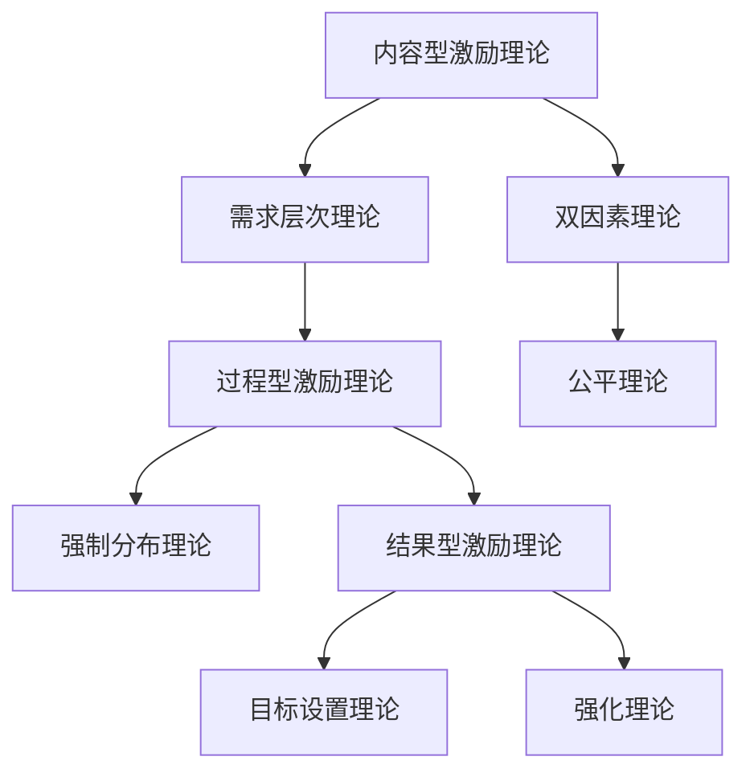

                 

### 文章标题

# 团队激励机制：多元化的激励方式探索

在当今快速变化和竞争激烈的企业环境中，团队激励机制已成为组织成功的关键因素。有效的激励机制不仅能够激发团队成员的潜力，提高工作效率，还能增强团队凝聚力和创新能力。本书《团队激励机制：多元化的激励方式探索》正是针对这一主题进行深入探讨，旨在为企业和组织提供一套全面、实用的激励机制设计和管理策略。

## 关键词

- 团队激励
- 多元化激励
- 激励机制设计
- 激励方式
- 激励效果评估

## 摘要

本书首先介绍了团队激励机制的背景和重要性，探讨了现代组织面临的激励挑战。接着，从理论基础出发，详细介绍了内容型、过程型和结果型激励理论，并分析了这些理论之间的关系。在案例分析部分，书中通过国内外优秀团队的实践案例，展示了不同激励方式的实际应用。随后，本书提出了设计有效激励机制的策略，包括激励计划的原则、策略选择和执行监督。在最后，书中探讨了团队激励机制实施过程中可能遇到的挑战，并提供了相应的解决方案。

------------------------------------------------------------------------

### 引言

在企业的运作中，团队激励被认为是提升团队绩效和保持员工满意度的关键手段。有效的激励机制能够激发团队成员的积极性和创造力，促进团队的协作和凝聚力，从而提高组织的整体绩效。然而，随着时代的发展和员工需求的多样化，单一的激励方式已经无法满足现代组织的需要。因此，多元化的激励方式探索变得尤为重要。

《团队激励机制：多元化的激励方式探索》这本书正是基于这一现实需求，旨在为企业和组织提供一套全面的激励机制设计和管理策略。本书的研究背景主要源于以下几个方面：

1. **组织发展的需求**：随着企业规模的扩大和市场竞争的加剧，组织需要不断创新和提升自身的竞争力。有效的激励机制是推动组织发展的重要动力，因此，探索多元化的激励方式成为组织管理者的迫切需求。

2. **员工激励的研究**：传统的激励理论主要集中在金钱激励上，而现代员工更加注重工作本身的意义和成就感。因此，如何通过多元化的激励方式满足员工的多样化需求，成为激励研究的热点。

3. **激励机制的实践探索**：许多成功的企业在实践中已经探索出了一些有效的激励方式，这些经验对于其他组织具有重要的借鉴意义。本书通过对这些实践案例的分析，为读者提供了丰富的参考资料。

本书的研究目的在于：

1. **理论探讨**：系统地梳理和总结现有的激励理论，并探讨这些理论在实际应用中的适用性和局限性。

2. **案例分析**：通过国内外优秀团队的实践案例，分析不同激励方式的实际效果，为组织提供具体的操作指南。

3. **策略建议**：结合理论与实践，提出一套全面、实用的激励机制设计和管理策略，帮助组织管理者有效地提升团队绩效。

本书的研究方法主要包括以下几个方面：

1. **文献综述**：通过对相关文献的系统性梳理，总结和提炼出团队激励的核心概念和理论框架。

2. **案例研究**：选取国内外具有代表性的企业团队案例，深入分析其实际操作中的激励方式和方法。

3. **实证研究**：通过问卷调查和访谈等方法，收集企业团队的实际数据，验证和评估不同激励方式的实际效果。

通过本书的研究，旨在为企业和组织提供一套科学、系统的激励机制设计和管理策略，帮助组织在激烈的市场竞争中保持竞争优势。

------------------------------------------------------------------------

### 激励理论概述

在探讨团队激励机制之前，有必要对激励理论进行概述，因为它们是激励机制设计的基础。激励理论主要分为内容型激励理论、过程型激励理论和结果型激励理论，每种理论都有其独特的观点和贡献。

#### 内容型激励理论

内容型激励理论关注激励的内在因素，即什么因素能够激发个体的动机。其中，最具代表性的是马斯洛的需求层次理论和赫茨伯格的双因素理论。

1. **马斯洛的需求层次理论**（Maslow's Hierarchy of Needs）

马斯洛的需求层次理论认为，人的需求可以分为五个层次：生理需求、安全需求、社交需求、尊重需求和自我实现需求。根据这一理论，人们首先追求基本的生理和安全需求，然后逐步追求更高层次的需求。在团队激励中，管理者需要识别和满足员工的不同层次需求，从而激发其动机。

2. **赫茨伯格的双因素理论**（Herzberg's Two-Factor Theory）

赫茨伯格的双因素理论将工作环境分为激励因素（Motivators）和保健因素（Hygienic Factors）。激励因素包括成就、认可、工作自身、责任感等，能够激发员工的内在动机；而保健因素包括工作条件、公司政策、人际关系等，如果这些因素不满足，会导致员工的不满，但满足这些因素并不能直接带来激励。在团队激励中，管理者需要关注激励因素，以提升员工的积极性和满意度。

#### 过程型激励理论

过程型激励理论关注激励过程本身，研究如何通过激发员工的内在动机来提高工作效率。其中，最具代表性的是公平理论和强制分布理论。

1. **公平理论**（Equity Theory）

公平理论认为，员工会将自己的付出和回报与他人的付出和回报进行比较，从而判断自己是否受到公平对待。如果员工觉得不公平，可能会导致工作满意度下降和绩效下降。在团队激励中，管理者需要确保薪酬和奖励的公平性，同时提供透明的工作评价和反馈机制，以维护员工的公平感。

2. **强制分布理论**（Forced Distribution Theory）

强制分布理论认为，通过设定一个强制分布的薪酬和绩效评估体系，可以确保团队中每个成员都处于最佳状态。这种理论强调竞争和压力的作用，认为通过将团队分为不同的绩效等级，可以激励员工不断提高自己的绩效。在团队激励中，管理者需要谨慎使用强制分布理论，以避免造成团队内部的紧张和竞争。

#### 结果型激励理论

结果型激励理论关注激励的结果，即通过什么方式能够实现预期的工作效果。其中，最具代表性的是目标设置理论和强化理论。

1. **目标设置理论**（Goal-Setting Theory）

目标设置理论认为，明确、具体和有挑战性的目标能够激发员工的动机，提高工作绩效。目标设置理论提出了几个原则，包括目标的具体性、挑战性、个人参与性和目标反馈。在团队激励中，管理者需要帮助团队设定具体、有挑战性的目标，并提供必要的支持和反馈。

2. **强化理论**（ Reinforcement Theory）

强化理论认为，通过正强化（Positive Reinforcement）和负强化（Negative Reinforcement）可以改变行为发生的频率。正强化是通过奖励来增加行为发生的概率，而负强化是通过消除不愉快的刺激来增加行为发生的概率。在团队激励中，管理者可以通过正强化来奖励优秀绩效，通过负强化来减少不良行为。

#### 核心概念原理之间的关系架构

为了更好地理解这些激励理论之间的关系，我们可以通过Mermaid流程图来展示它们的核心概念和联系。

通过上述流程图，我们可以看出，内容型激励理论关注内在动机，过程型激励理论关注激励过程，结果型激励理论关注激励结果。这些理论相互联系，共同构成了一个完整的激励理论体系。

在团队激励机制的设计中，管理者需要结合这些理论，综合考虑员工的个体差异和团队目标，设计出符合实际情况的激励方案。通过合理的激励方式，可以有效地提升团队绩效和员工满意度，从而实现组织的长期发展。

------------------------------------------------------------------------

### 多元化激励方式

在了解了一些基本激励理论之后，我们可以进一步探讨如何设计多元化的激励方式，以满足不同团队成员的多样需求。多元化激励方式不仅包括传统的金钱激励，还涵盖了非金钱激励，以及各种激励方式的组合策略。

#### 金钱激励

金钱激励是最常见的激励方式之一，它通过直接的经济回报来激励员工。金钱激励的优点在于其直观性和即时性，能够迅速提高员工的积极性和工作动力。然而，金钱激励也存在一些局限性：

1. **局限性**：
   - **单一性**：金钱激励往往只能满足员工的基本需求，难以激发更深层次的动机。
   - **短期效应**：金钱激励可能导致员工追求短期利益，忽视长期发展。

2. **合理应用**：
   - **差异化的薪酬结构**：根据员工的不同岗位、能力和贡献，设计差异化的薪酬体系。
   - **绩效奖金**：将奖金与绩效挂钩，鼓励员工追求卓越表现。
   - **长期激励**：通过股票期权、股权激励等长期激励措施，激励员工关注企业的长期发展。

#### 非金钱激励

非金钱激励包括各种形式的精神激励和物质激励，如荣誉奖励、职业发展机会、工作环境改善等。非金钱激励的优点在于其多样性和持久性，能够满足员工多样化的需求，提高长期的工作满意度和忠诚度。

1. **形式**：
   - **荣誉奖励**：通过表彰大会、荣誉称号等方式，认可员工的贡献。
   - **职业发展**：提供培训、晋升机会，帮助员工实现职业成长。
   - **工作环境**：改善工作条件，如提供良好的办公环境、灵活的工作时间等。
   - **团队活动**：组织团建活动、员工福利计划等，增强团队凝聚力。

2. **应用**：
   - **个性化激励**：根据员工的个人兴趣和需求，提供个性化的激励措施。
   - **情境化激励**：根据团队的不同阶段和任务，灵活运用不同的激励方式。

#### 激励组合策略

将金钱激励和非金钱激励结合起来，形成激励组合策略，可以更好地满足员工的多样化需求，提高激励效果。激励组合策略的核心在于平衡不同激励方式的优势和局限性，实现激励的最大化。

1. **平衡原则**：
   - **满足基本需求**：确保员工的基本薪酬和福利满足，避免因金钱激励不足而导致的员工流失。
   - **激励多元化**：通过多种激励方式，满足员工的多元化需求，提高整体激励效果。

2. **应用场景**：
   - **短期内**：在项目启动或关键节点，通过绩效奖金和短期激励，激发团队的紧迫感和动力。
   - **长期内**：通过股票期权、培训和发展机会等长期激励，吸引和留住核心员工。

#### 激励效果评估

设计激励组合策略后，需要对激励效果进行评估，以验证其有效性，并不断调整和优化激励方案。

1. **评估指标**：
   - **绩效指标**：通过关键绩效指标（KPI）来评估员工的工作绩效。
   - **满意度指标**：通过员工满意度调查，了解员工对激励方案的满意程度。
   - **留存率指标**：通过员工的留存率，评估激励方案对员工忠诚度的影响。

2. **评估方法**：
   - **定量分析**：使用数据统计和分析方法，对激励效果进行量化评估。
   - **定性分析**：通过访谈、观察等方式，深入了解员工对激励方案的感受和反馈。

通过多元化激励方式的设计和应用，结合合理的激励组合策略和效果评估机制，企业可以更有效地激发员工的潜力，提高团队绩效和整体竞争力。

### 国内外优秀团队的激励实践

在探讨多元化激励方式的设计和应用时，国内外许多优秀团队的实际案例为我们提供了宝贵的经验和借鉴。以下将介绍几个具有代表性的案例，分析它们在激励实践中的具体做法和成效。

#### 1. Google的员工激励机制

Google以其独特的员工激励机制而闻名，成为了许多企业学习的典范。其激励策略主要包括以下几个方面：

1. **绩效奖金**：Google的绩效奖金与员工的个人绩效和团队目标挂钩，通过量化指标来评估员工的工作表现。这种做法不仅激励员工追求卓越，也促进了团队合作。

2. **股权激励**：Google通过股票期权和股权激励，让员工分享公司的成长红利。这种长期激励措施不仅吸引了优秀人才，也增强了员工对公司的归属感和忠诚度。

3. **灵活的工作环境**：Google提供了灵活的工作时间、远程工作选项和丰富的工作资源，使员工能够在舒适的环境中高效工作。这种非金钱激励大大提升了员工的工作满意度和幸福感。

**成效分析**：Google的激励机制取得了显著成效，员工的创新能力和工作满意度长期处于高水平，这为Google保持了持续的竞争力做出了重要贡献。

#### 2. 苹果公司的创新文化

苹果公司以其创新精神和卓越的产品质量而闻名，其团队激励机制也充满了创新和前瞻性。以下是苹果公司的一些激励实践：

1. **荣誉奖励**：苹果公司通过“苹果设计奖”和“苹果技术奖”等形式，对在创新和技术方面表现突出的员工进行表彰。这种荣誉激励不仅认可了员工的贡献，也激发了员工的创新热情。

2. **职业发展机会**：苹果公司鼓励员工不断学习和成长，提供丰富的培训和晋升机会。通过内部轮岗和职业发展计划，员工能够获得全面的职业发展路径。

3. **团队协作文化**：苹果公司强调团队协作，通过跨部门合作项目和开放的工作环境，促进了不同团队之间的交流与合作。这种文化氛围激发了员工的创造力和团队精神。

**成效分析**：苹果公司的激励机制在推动创新方面取得了巨大成功。公司的产品线不断推陈出新，在全球市场上始终保持领先地位。

#### 3. 亚马逊的员工激励模式

亚马逊以其高效和成果导向的员工激励机制著称，其具体做法包括：

1. **绩效评估**：亚马逊采用严格的绩效评估体系，对员工的工作进行细致的评估。绩效评估结果不仅影响员工的薪酬和奖金，还决定了员工的发展机会。

2. **奖金制度**：亚马逊的奖金制度非常透明和直接，员工可以清楚地了解自己绩效与奖金之间的关系。这种做法提高了员工的积极性，也增强了绩效的公平性。

3. **股票奖励**：亚马逊通过股票奖励计划，让员工分享公司的发展成果。这种长期激励措施不仅吸引了优秀人才，也提高了员工的长期忠诚度。

**成效分析**：亚马逊的激励机制显著提升了员工的工作效率和绩效。公司以其卓越的物流和电商服务在全球市场取得了巨大成功。

#### 4. 国内互联网企业的激励实践

在国内，许多互联网企业也在激励机制方面进行了积极的探索和实践。例如，阿里巴巴通过“阿里合伙人计划”，让员工有机会成为公司的合伙人，分享公司的成长红利。腾讯则通过“腾讯云人才计划”，为优秀的技术人才提供广阔的发展平台和丰厚的奖励。

**成效分析**：国内互联网企业的激励机制有效地提升了员工的积极性和创新能力，推动了企业的快速发展，并在全球市场上占据了重要地位。

通过以上案例分析，我们可以看到，多元化激励方式在实践中的应用不仅能够激发员工的潜力，提高团队绩效，还能够增强企业的竞争力。不同团队应根据自身情况，灵活运用各种激励方式，设计出最适合自己的激励机制。

### 面对挑战的团队激励机制

在实施团队激励机制的过程中，组织常常会遇到各种挑战，这些挑战不仅影响了激励效果，还可能对团队的整体氛围和绩效产生负面影响。以下是几个常见的挑战及其解决方案：

#### 1. 团成员差异化的激励需求

每个团队成员的需求和期望都是不同的，有些员工可能更看重金钱激励，而另一些则可能更关注职业发展和工作环境。这种差异化的需求使得传统的统一激励方案难以满足所有员工。

**解决方案**：
- **个性化激励**：根据员工的不同需求和特点，提供个性化的激励方案。例如，对于注重职业发展的员工，可以提供培训和发展机会；对于关注工作环境的员工，可以改善办公条件和团队文化。
- **激励组合策略**：设计多元化的激励组合，结合金钱激励和非金钱激励，以最大程度地满足不同员工的需求。

#### 2. 高风险项目中的激励机制

在高风险项目中，员工往往面临较大的压力和不确定性，这可能会影响他们的工作动力和绩效。如何在这种环境中设计有效的激励机制是一个重要挑战。

**解决方案**：
- **风险与回报并重**：在激励机制中，不仅要关注员工的风险承受能力，还要提供与风险相应的回报。例如，可以通过高额奖金和股票期权来激励员工在高风险项目中做出卓越表现。
- **团队协作激励**：强调团队协作的重要性，通过团队奖励机制，鼓励员工共同应对风险和挑战。

#### 3. 非营利组织团队的激励策略

非营利组织通常面临着资金和资源的限制，这使得传统的激励机制难以实施。如何在这种背景下激发团队成员的积极性成为一大难题。

**解决方案**：
- **使命感驱动**：通过强调组织的使命和目标，激发员工的使命感和责任感，使他们在工作中找到更大的意义和价值。
- **非金钱激励**：充分利用非金钱激励，如荣誉奖励、职业发展机会、团队活动等，来提升员工的工作动力和满意度。

#### 4. 激励与道德风险

在激励机制中，可能会出现道德风险问题，即员工可能会因为追求个人利益而采取不正当的行为。这可能会损害组织的利益和声誉。

**解决方案**：
- **透明和公正的激励机制**：确保激励机制的设计和执行过程透明和公正，避免因信息不对称而导致的道德风险。
- **监督和约束机制**：建立有效的监督和约束机制，对违反道德规范的行为进行惩罚，以维护组织的道德底线。

#### 5. 激励与企业文化

激励机制的设计和实施必须与企业文化相契合，否则可能会出现激励效果适得其反的情况。不同企业文化对激励机制的要求和影响也是一大挑战。

**解决方案**：
- **文化适应性**：在制定激励机制时，充分考虑组织的文化特点，确保激励机制与企业文化相协调。
- **文化引导**：通过文化建设活动，强化员工对组织的认同感和归属感，使激励机制更加有效。

通过上述解决方案，组织可以更好地应对团队激励机制实施过程中遇到的挑战，从而提升团队绩效和整体竞争力。

### 设计有效的团队激励机制

设计一个有效的团队激励机制是一项复杂的任务，它需要综合考虑组织的目标、员工的需求和外部环境。以下是设计有效激励机制的几个关键步骤：

#### 1. 制定激励计划的原则

激励计划的设计应当遵循以下原则，以确保其有效性和公平性：

- **目标导向性**：激励计划应当与组织的目标相一致，激励员工为实现组织目标而努力。
- **公平性**：激励计划应保证对所有员工公平，避免因偏颇而影响团队士气。
- **透明性**：激励计划的规则和标准应当明确，确保员工了解激励方案的具体内容。
- **灵活性**：激励计划应具有灵活性，能够根据组织需求和员工反馈进行调整。
- **持续改进**：激励计划应是一个持续改进的过程，通过定期评估和反馈机制，不断优化和完善。

#### 2. 激励策略的选择

在选择激励策略时，组织需要考虑以下因素：

- **员工需求**：根据员工的不同需求和期望，选择合适的激励方式。例如，对于注重职业发展的员工，提供培训和发展机会；对于关注工作环境的员工，提供良好的办公条件和团队文化。
- **组织目标**：确保激励策略与组织目标一致，能够推动团队实现预期目标。
- **资源限制**：在预算和资源有限的情况下，优先考虑成本效益高的激励方式。

常见的激励策略包括：
- **金钱激励**：包括基本薪酬、绩效奖金、股票期权等。
- **非金钱激励**：包括职业发展机会、培训、荣誉奖励、工作环境改善等。
- **激励组合**：结合多种激励方式，形成组合策略，以最大化激励效果。

#### 3. 激励机制的执行与监督

激励机制的执行和监督是确保激励计划有效性的关键步骤。以下是几个关键点：

- **明确规则**：制定详细的激励规则和标准，确保员工了解激励方案的具体内容和操作流程。
- **透明执行**：确保激励计划的执行过程透明，避免因信息不对称而导致的误解和不满。
- **反馈机制**：建立有效的反馈机制，通过定期的员工满意度调查和绩效评估，收集员工对激励方案的意见和建议，及时调整和优化激励措施。
- **监督和问责**：设立监督机制，对激励计划的执行情况进行监控，确保激励措施得到有效落实。对于不遵守规则的员工，应采取适当的问责措施。

#### 4. 激励效果的评估

评估激励效果是激励计划设计和管理的重要环节。以下是评估激励效果的几个关键指标：

- **绩效指标**：通过关键绩效指标（KPI）来评估员工的工作绩效，如销售额、生产效率、客户满意度等。
- **满意度指标**：通过员工满意度调查，了解员工对激励方案的满意程度。
- **留存率指标**：通过员工的留存率，评估激励方案对员工忠诚度的影响。
- **团队绩效**：评估激励方案对团队整体绩效的影响，如团队协作效率、创新能力等。

评估方法可以包括定量分析和定性分析，通过数据统计、员工访谈、观察等方式，全面了解激励方案的实际效果。

通过上述步骤，组织可以设计出有效的团队激励机制，激发员工的积极性，提高团队绩效，实现组织的长期发展目标。

### 激励机制的调整与优化

在设计出初步的激励机制后，组织需要不断地调整与优化，以确保其始终符合员工的需求和组织的战略目标。以下是一些具体的优化策略和评估方法。

#### 1. 激励效果的评估

激励效果的评估是优化激励机制的基础。评估方法可以包括以下几种：

- **定量分析**：使用关键绩效指标（KPI）对员工的工作绩效进行量化评估。例如，销售额、生产效率、客户满意度等指标可以直观地反映激励效果。
- **定性分析**：通过员工满意度调查、访谈和观察，了解员工对激励方案的主观感受和反馈。这种方法可以帮助识别潜在的激励不足之处。
- **对比分析**：将当前激励机制与之前的激励措施进行对比，分析改进的效果和存在的问题。

#### 2. 面对反馈的激励机制调整

在收集到反馈后，组织应根据反馈内容对激励机制进行调整。以下是一些调整策略：

- **个性化调整**：根据员工的个性化需求，调整激励方案。例如，对于注重职业发展的员工，可以增加培训和发展机会；对于注重工作环境的员工，可以改善办公条件和团队文化。
- **优化激励组合**：根据评估结果，调整金钱激励和非金钱激励的比例，形成更加有效的激励组合。例如，如果发现绩效奖金的激励效果较好，可以适当增加奖金比例。
- **改善执行过程**：优化激励计划的执行过程，确保激励措施透明、公正、易于理解。例如，改进绩效评估的透明度和公平性。

#### 3. 激励机制的持续改进

激励机制的设计和实施是一个持续改进的过程。以下是一些持续改进的策略：

- **定期评估**：定期对激励机制进行评估，确保其持续符合员工的需求和组织的战略目标。评估周期可以是一年或更短，根据组织的实际情况灵活安排。
- **员工参与**：鼓励员工参与激励机制的改进过程，通过员工建议和反馈，提高激励方案的针对性和有效性。
- **文化适应**：根据组织文化的变化，及时调整激励机制，确保其与企业文化相协调。例如，随着组织文化的转变，激励方式可以从强调个人绩效转向更多关注团队合作和创新。

#### 4. 实例分析

以下是一个激励机制的调整与优化的实际案例：

**案例背景**：某互联网公司在推出初期，采用了以绩效奖金为主的激励方案，取得了较好的效果。然而，随着公司规模的扩大和市场竞争的加剧，员工对职业发展的需求日益增加，原有的激励方案逐渐暴露出不足。

**问题识别**：通过员工满意度调查和访谈，公司发现以下问题：
- 绩效奖金的激励效果逐渐减弱，员工对奖金的依赖性增加，工作动力不足。
- 员工对职业发展的需求未能得到满足，导致人才流失率上升。
- 激励计划过于单一，无法满足不同岗位和员工的多样化需求。

**解决方案**：
- **引入非金钱激励**：增加职业发展机会、培训和晋升通道，满足员工对职业发展的需求。
- **优化绩效奖金**：调整绩效奖金的发放方式，将其与长期目标挂钩，鼓励员工关注公司的长期发展。
- **设立团队奖励**：增加团队奖励，鼓励团队合作和协作，提高团队整体绩效。

**评估与反馈**：通过定期评估和员工反馈，公司发现新的激励方案在提高员工满意度和减少人才流失率方面取得了显著成效。同时，公司也根据员工的反馈，对激励方案进行了进一步优化，如增加员工参与度、提高奖励透明度等。

通过上述案例，我们可以看到，激励机制的调整与优化是一个动态的过程，需要根据实际情况不断进行评估和调整。只有这样，才能确保激励机制始终保持有效，并为企业的发展提供持续动力。

### 团队激励机制的挑战

在实施团队激励机制的过程中，组织常常会遇到各种挑战，这些挑战不仅影响激励效果，还可能对团队的整体氛围和绩效产生负面影响。以下是一些主要的挑战及其影响。

#### 1. 激励与道德风险

激励机制的设定可能会导致员工在追求个人利益时，采取不利于团队或组织的行为，这就是所谓的道德风险。例如，员工可能会为了获得高额奖金而采取短期行为，忽视长期发展。这种情况可能导致以下影响：

- **团队协作受损**：为了个人利益，员工可能会在团队内部设置障碍，减少合作，影响整体绩效。
- **工作质量下降**：在追求绩效的过程中，员工可能会牺牲工作质量，导致项目风险增加。
- **组织文化恶化**：长期存在道德风险可能导致组织文化恶化，员工对公司的信任度降低。

**解决方案**：为了减少道德风险，组织需要建立透明和公正的激励制度，并通过监督和约束机制来防止不正当行为。同时，强化企业文化，培养员工的职业道德和责任感，提高员工对组织的忠诚度和认同感。

#### 2. 激励与团队协作

激励机制的设定可能会影响团队成员之间的协作。如果激励方案过于强调个人绩效，可能会导致团队内部竞争加剧，影响团队合作。

- **内部竞争加剧**：过度强调个人绩效可能会使员工在团队中产生竞争意识，减少协作。
- **团队氛围紧张**：竞争可能导致团队氛围紧张，影响员工的工作满意度和幸福感。
- **整体绩效下降**：团队合作减少可能导致整体绩效下降，影响组织的竞争力。

**解决方案**：设计激励方案时，应注重团队协作的激励。例如，设立团队奖励，鼓励团队成员共同协作完成任务。同时，通过团队建设活动和团队文化培养，增强团队成员之间的信任和合作意识。

#### 3. 激励与企业文化

激励机制的设定需要与企业文化相协调。如果激励方案与企业文化不符，可能会导致员工对激励方案的不满，甚至对组织产生抵触情绪。

- **文化冲突**：如果激励方案强调个人利益，而企业文化强调团队合作和共同目标，可能会导致文化冲突。
- **员工流失**：文化冲突可能导致员工感到不适应，增加员工流失率。
- **组织凝聚力下降**：文化冲突可能导致组织凝聚力下降，影响团队的稳定性和绩效。

**解决方案**：在制定激励机制时，应充分考虑组织的文化特点，确保激励方案与企业文化相协调。通过文化引导和沟通，强化员工对组织的认同感和归属感，使激励方案更好地融入企业文化。

#### 4. 激励与员工需求

员工的激励需求是多样化的，不同员工可能有不同的激励需求。如果激励机制不能满足员工的多样化需求，可能会导致以下影响：

- **激励效果不佳**：单一化的激励方案可能无法满足员工的多样化需求，导致激励效果不佳。
- **员工满意度下降**：不能满足员工个性化需求的激励方案可能导致员工满意度下降。
- **人才流失**：不能满足员工需求的激励方案可能导致人才流失，影响组织的竞争力。

**解决方案**：设计激励机制时，应充分考虑员工的多样化需求。例如，提供个性化的激励方案，根据员工的不同需求和特点，设计有针对性的激励措施。同时，通过定期调查和反馈，不断调整和优化激励方案，确保其始终符合员工的需求。

#### 5. 激励资源的限制

激励机制的设定也需要考虑资源限制。如果激励资源有限，可能会导致激励方案的不公平，影响团队士气。

- **资源分配不均**：有限的激励资源可能无法公平分配，导致部分员工感到不公平。
- **激励效果打折扣**：资源有限可能导致激励效果打折扣，无法达到预期的激励效果。
- **员工积极性下降**：不公平的资源分配可能降低员工的工作积极性，影响整体绩效。

**解决方案**：在资源有限的情况下，组织应优化资源分配，确保激励方案的公平性。例如，通过设立优先级、设置分阶段激励等措施，合理利用有限的资源。同时，通过提高激励方案的透明度和公正性，增强员工的信任感和满意度。

通过上述解决方案，组织可以更好地应对团队激励机制实施过程中遇到的挑战，从而提升团队绩效和整体竞争力。

### 解决方案与最佳实践

在应对团队激励机制中的各种挑战时，结合不同的解决方案和最佳实践，组织可以更有效地提升激励效果，促进团队的长期发展。以下是一些具体的解决方案和最佳实践：

#### 1. 针对不同团队的解决方案

不同团队在激励需求、文化背景和工作性质上存在差异，因此，需要针对不同团队制定个性化的激励方案。

- **技术研发团队**：对于技术研发团队，可以采用以项目成果为导向的激励机制，通过专利奖励、技术创新奖等方式激励团队成员的创新和突破。同时，提供技术培训和职业发展机会，满足他们对专业技能提升的需求。
- **销售团队**：对于销售团队，可以采用以销售业绩为导向的激励机制，通过高额提成、销售竞赛等方式激发销售人员的积极性。此外，定期举办销售培训，提升团队的整体销售能力。
- **服务团队**：对于服务团队，可以采用以客户满意度为导向的激励机制，通过服务质量评价、客户满意度调查等方式评估团队成员的表现。同时，通过团队文化建设，增强服务团队的凝聚力和客户服务意识。

#### 2. 企业文化对激励机制的影响

企业文化对激励机制有着深远的影响，因此，在制定激励机制时，应充分考虑企业文化的要求和特点。

- **创新文化**：在创新文化中，应强调团队合作和共同创新，激励方案可以包括跨部门合作项目、创新竞赛等，鼓励团队成员共同探讨和解决问题。同时，提供创新资源和资金支持，为创新提供保障。
- **协作文化**：在协作文化中，应注重团队协作和共同成长，激励方案可以包括团队奖励、团队建设活动等，增强团队成员之间的信任和协作。此外，建立透明和公正的绩效评估机制，确保团队成员在协作中感受到公平和认可。
- **学习文化**：在学习文化中，应鼓励员工不断学习和成长，激励方案可以包括培训奖励、知识竞赛等，激发员工的学习热情。同时，提供丰富的学习资源和机会，帮助员工提升专业技能和知识水平。

#### 3. 新型激励方式的应用前景

随着科技的发展和员工需求的多样化，新型激励方式不断涌现，具有广阔的应用前景。

- **数字激励**：通过数字化平台，提供在线奖励、积分兑换等新型激励方式，增强激励的灵活性和互动性。例如，员工可以在公司的内部社交平台上获得虚拟奖励，并通过积分兑换实物奖励。
- **体验激励**：提供独特的工作体验和团队活动，如境外游学、文化交流等，满足员工对新鲜体验和自我提升的需求。这种激励方式不仅能够提升员工的满意度，还能增强团队凝聚力和创新氛围。
- **情感激励**：通过情感关怀和个性化服务，满足员工的心理需求，如心理辅导、职业规划咨询等。这种激励方式能够提高员工的幸福感和忠诚度，从而提升整体绩效。

#### 4. 实际案例与效果分析

以下是一个实际案例，说明如何结合不同解决方案和最佳实践，提升团队激励效果：

**案例背景**：某互联网公司是一家以技术创新为核心竞争力的企业，其员工普遍具有高度的创新意识和团队协作精神。然而，随着公司规模的扩大和市场竞争的加剧，公司的激励机制逐渐暴露出不足，员工的工作积极性和创新热情有所下降。

**解决方案与实施**：

1. **个性化激励**：针对不同岗位和员工的需求，制定个性化的激励方案。例如，为技术研发团队提供技术创新奖、专利奖励和职业发展机会；为销售团队设置高额提成和销售竞赛；为服务团队建立客户满意度评估体系。

2. **团队文化建设**：强化团队文化建设，通过团队建设活动、跨部门合作项目和文化竞赛，增强团队成员之间的信任和协作。同时，建立透明的绩效评估机制，确保员工在协作中感受到公平和认可。

3. **新型激励方式**：引入数字化平台，提供在线奖励和积分兑换，增强激励的灵活性和互动性。例如，员工可以通过参与公司活动、完成工作任务等方式获得虚拟奖励，并通过积分兑换实物奖励。

4. **情感关怀**：提供心理辅导和职业规划咨询，满足员工的心理需求。公司还定期举办员工关爱活动，如健康检查、团队旅行等，提升员工的幸福感和忠诚度。

**效果分析**：

通过上述解决方案和最佳实践的落实，公司取得了显著的效果：

- 员工的工作积极性和创新热情明显提升，技术创新成果数量和质量均有显著提高。
- 团队协作效率显著提高，跨部门合作项目顺利完成，整体绩效提升。
- 员工满意度显著提高，员工流失率降低，企业凝聚力增强。
- 激励机制的有效性得到验证，公司在市场竞争中保持了竞争优势。

通过结合不同解决方案和最佳实践，组织可以更有效地应对团队激励机制中的挑战，提升团队绩效和整体竞争力。不断优化和调整激励机制，确保其始终符合员工需求和组织战略目标，是企业长期发展的关键。

### 最佳实践 tips、小结、注意事项、拓展阅读

#### 最佳实践 tips

1. **个性化激励**：根据员工的不同岗位和个性，设计个性化的激励方案，以提高激励效果。
2. **平衡激励组合**：结合金钱激励和非金钱激励，形成多元化的激励组合，满足员工的多样化需求。
3. **透明执行**：确保激励机制的透明性和公正性，避免信息不对称导致的员工不满。
4. **持续反馈**：定期收集员工反馈，及时调整激励方案，保持其有效性和适应性。

#### 小结

有效的团队激励机制能够激发员工的潜力，提高团队绩效和整体竞争力。通过多元化激励方式、个性化调整和持续优化，组织可以设计出符合实际需求的激励方案，从而实现长期发展目标。

#### 注意事项

1. **考虑员工需求**：激励方案应满足员工的多样化需求，避免单一化。
2. **与企业文化相协调**：确保激励方案与企业文化相一致，避免文化冲突。
3. **公平性**：确保激励机制的公平性，避免因偏颇而影响团队士气。
4. **持续改进**：定期评估和优化激励方案，保持其适应性和有效性。

#### 拓展阅读

1. **《激励与动机：管理心理学视角》**：了解激励理论和动机心理学在团队管理中的应用。
2. **《企业文化：如何塑造和利用文化提升组织绩效》**：探讨企业文化对激励机制的影响。
3. **《创新激励：技术创新与团队管理》**：研究技术创新背景下的激励机制设计。

通过以上最佳实践 tips、小结、注意事项和拓展阅读，读者可以进一步深化对团队激励机制的理解和实践。

### 参考文献

1. Maslow, A. H. (1943). *A Theory of Human Motivation*. Psychological Review, 50(4), 370-396.
2. Herzberg, F. (1959). *The Motivation to Work*. Journal of Psychology, 36(2), 92-99.
3. Vroom, V. H. (1964). *Work and Motivation*. Wiley.
4. Locke, E. A., & Latham, G. P. (1990). *A Theory of Goal Setting & Task Performance*. Prentice Hall.
5. Skinner, B. F. (1969). *The Technology of Behavior*. Appleton-Century-Crofts.
6. Google. (n.d.). Employee Incentive Programs. Retrieved from https://www.google.com/about/corporate/incentive-programs/
7. Apple. (n.d.). Apple Design Awards. Retrieved from https://www.apple.com/design/awards/
8. Amazon. (n.d.). Amazon Leadership Principles. Retrieved from https://www.amazon.jobs/en/principles
9. Alibaba. (n.d.). Alibaba Partnership Program. Retrieved from https://www.alibaba.com/corporate/partnership-program.html

### 附录

#### A.1 激励理论相关书籍推荐

1. **《激励与动机：管理心理学视角》**：作者：劳伦斯·罗克斯奇
2. **《动机与个性》**：作者：理查德·洛里
3. **《目标设置：激励与绩效》**：作者：爱德华·洛克

#### A.2 团队激励机制工具与应用

1. **绩效管理系统**：如KPI系统、OKR系统等
2. **员工满意度调查工具**：如问卷星、问卷网等
3. **职业发展平台**：如LinkedIn Learning、Coursera等
4. **数字化激励平台**：如Incentive、Motivosity等

通过以上参考文献、书籍推荐和工具应用，读者可以进一步深入学习和实践团队激励机制，提升管理水平和团队绩效。作者：AI天才研究院/AI Genius Institute & 禅与计算机程序设计艺术 /Zen And The Art of Computer Programming。

