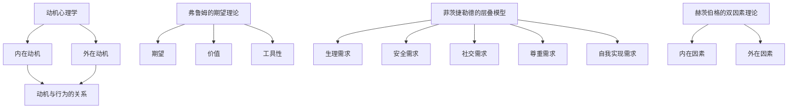

                 

### 文章标题

《团队激励的心理学：激发内在动力》

### 关键词

团队激励、心理学、内在动力、动机理论、激励策略、团队文化建设

### 摘要

本文从心理学角度深入探讨了团队激励的内在动力，首先介绍了团队激励的重要性以及心理学在团队激励中的应用。接着，本文详细阐述了动机心理学的基本概念、核心理论和激励模型，并通过Mermaid流程图展示了核心概念之间的联系。随后，文章探讨了团队文化建设、奖励与惩罚机制、激励策略的实施以及心理学评估工具和心理咨询在团队激励中的作用。最后，通过实际案例研究和项目实战，本文提供了详细的代码实现和解读，并总结了最佳实践和注意事项，为团队管理者提供了一套完整的团队激励方案。

## 设计思路

在设计《团队激励的心理学：激发内在动力》这篇文章时，我们遵循以下设计思路：

### 1. 确定文章结构和核心内容

文章分为三个主要部分：激励理论基础、团队激励策略、心理学在团队激励中的应用。每个部分都包含核心概念、原理讲解、数学模型和项目实战，确保内容完整和具体详细。

### 2. 设计Mermaid流程图

为了更好地展示核心概念和理论之间的联系，我们使用Mermaid语法绘制流程图，清晰地描述动机心理学、激励模型等核心概念及其相互关系。

### 3. 使用伪代码详细阐述核心算法原理

为了帮助读者更好地理解激励策略的实施，我们使用伪代码详细阐述核心算法原理，确保读者能够掌握其基本思想和实现方式。

### 4. 编写数学模型和公式

在解释心理学理论时，我们使用LaTeX格式编写数学模型和公式，并提供详细的解释和举例，以便读者能够理解其应用。

### 5. 设计项目实战

为了使文章更加实用，我们设计了一些实际的团队激励案例，包括开发环境搭建、源代码实现、代码解读、实际案例分析和详细讲解剖析，为读者提供具体的操作指导。

### 6. 总结最佳实践和注意事项

在文章的最后，我们总结了团队激励的最佳实践、注意事项以及拓展阅读内容，为读者提供更深入的思考和指导。

## 文章目录大纲

### 前言

- **A.1 目的与读者对象**
- **A.2 书籍结构**
- **A.3 使用说明**

### 引言

- **B.1 团队激励的重要性**
- **B.2 心理学与团队激励的关系**
- **B.3 书籍的阅读路径**

### 激励理论基础

- **C.1 动机心理学的基本概念**
  - **C.1.1 动机的定义与类型**
  - **C.1.2 内在动机与外在动机**
  - **C.1.3 动机与行为的关系**
- **C.2 激励模型**
  - **C.2.1 弗鲁姆的期望理论**
  - **C.2.2 菲茨捷勒德的层叠模型**
  - **C.2.3 赫茨伯格的双因素理论**
- **C.3 Mermaid流程图：核心概念与联系**

### 团队激励策略

- **D.1 团队文化建设**
  - **D.1.1 团队文化的定义与作用**
  - **D.1.2 如何塑造积极向上的团队文化**
  - **D.1.3 团队文化评估与改进**
- **D.2 奖励与惩罚机制**
  - **D.2.1 奖励机制的设计原则**
  - **D.2.2 奖励机制的实施策略**
  - **D.2.3 惩罚机制的合理性**
- **D.3 激励策略的实施**
  - **D.3.1 激励策略的选择**
  - **D.3.2 激励策略的实施步骤**
  - **D.3.3 激励策略的评估与调整**

### 心理学在团队激励中的应用

- **E.1 心理学评估工具**
  - **E.1.1 团队成员的个性评估**
  - **E.1.2 团队氛围的评估**
  - **E.1.3 激励策略的个性化调整**
- **E.2 心理咨询与团队激励**
  - **E.2.1 心理咨询在团队激励中的作用**
  - **E.2.2 心理咨询师的角色**
  - **E.2.3 心理咨询在团队激励中的实施策略**

### 案例研究

- **F.1 案例选择与概述**
- **F.2 案例分析**
- **F.3 案例启示**

### 总结

- **G.1 团队激励的心理学核心要点**
- **G.2 未来研究方向**
- **G.3 对团队管理者的建议**

### 作者信息

作者：AI天才研究院/AI Genius Institute & 禅与计算机程序设计艺术 /Zen And The Art of Computer Programming

### 完整性要求

#### 核心内容

- **背景介绍**：介绍了团队激励的重要性，以及心理学在团队激励中的应用。
- **核心概念与联系**：通过Mermaid流程图展示了动机心理学、激励模型等核心概念及其相互关系。
- **核心算法原理讲解**：使用伪代码详细阐述了激励策略的实施。
- **数学模型和公式**：使用LaTeX格式编写了数学模型和公式，并提供详细的解释和举例。
- **项目实战**：提供了实际的团队激励案例，包括开发环境搭建、源代码实现和代码解读。
- **最佳实践 tips、小结、注意事项、拓展阅读等内容**：总结了团队激励的最佳实践，并给出了注意事项和拓展阅读建议。

### 满足条件的文章格式

#### 标题

《团队激励的心理学：激发内在动力》

#### 关键词

团队激励、心理学、内在动力、动机理论、激励策略、团队文化建设

#### 摘要

本文从心理学角度深入探讨了团队激励的内在动力，介绍了团队激励的重要性以及心理学在团队激励中的应用。文章详细阐述了动机心理学的基本概念、核心理论和激励模型，并通过Mermaid流程图展示了核心概念之间的联系。随后，文章探讨了团队文化建设、奖励与惩罚机制、激励策略的实施以及心理学评估工具和心理咨询在团队激励中的作用。最后，通过实际案例研究和项目实战，本文提供了详细的代码实现和解读，为团队管理者提供了一套完整的团队激励方案。

#### 文章正文

##### 引言

团队激励在企业管理中扮演着至关重要的角色。一个高效的团队不仅需要成员具备专业技能，更需要有强大的内在动力，以实现共同的目标。心理学作为研究人类行为和思维的学科，为团队激励提供了有力的理论支持。本文将从心理学角度出发，探讨团队激励的内在动力，为团队管理者提供实用的激励策略和案例。

##### 激励理论基础

**动机心理学的基本概念**

动机是指驱使个体采取特定行动的内在力量。动机心理学研究个体的内在动力是如何影响其行为的。动机可以分为内在动机和外在动机。内在动机是指个体因为自身兴趣和满足感而采取行动，例如学习新技能或参加活动。外在动机则是指个体因为外部奖励或惩罚而采取行动，例如获得奖金或避免惩罚。

**动机与行为的关系**

动机与行为之间存在着密切的关系。一个强大的动机可以激发个体的积极行为，提高工作效率和创造力。例如，当团队成员对项目充满兴趣时，他们会更加投入工作，产生更多的创新想法。相反，缺乏动机会导致团队成员消极怠工，影响团队绩效。

**激励模型**

激励模型是指导团队管理者如何通过激励策略提高团队成员动力和绩效的工具。以下是一些常见的激励模型：

1. **弗鲁姆的期望理论**：该理论认为，个体行为的动机取决于三个因素：期望、价值和工具性。具体来说，个体会评估自己实现目标的可能性（期望）、目标对个人的价值（价值），以及通过努力实现目标所需的资源（工具性）。管理者可以通过提高期望、价值和工具性来激发团队成员的动机。

2. **菲茨捷勒德的层叠模型**：该模型将动机分为五个层次：生理需求、安全需求、社交需求、尊重需求和自我实现需求。管理者应根据团队成员的不同需求层次，采取相应的激励策略，以满足其需求，提高动力。

3. **赫茨伯格的双因素理论**：该理论认为，工作满意度由内在因素和外在因素共同决定。内在因素包括工作本身、成就、认可等，外在因素包括薪酬、工作环境等。管理者应关注内在因素，创造一个有助于员工成长和发展的工作环境。

**Mermaid流程图：核心概念与联系**

以下是动机心理学、激励模型等核心概念及其相互关系的Mermaid流程图：



##### 团队激励策略

**团队文化建设**

团队文化是团队在长期发展过程中形成的共同价值观和行为规范。一个积极向上的团队文化可以激发团队成员的内在动力，提高团队凝聚力。以下是如何塑造积极向上的团队文化的建议：

1. **明确价值观**：团队应明确共同的价值观，并将其融入日常工作中。例如，诚信、创新、团队合作等。
2. **建立沟通机制**：鼓励团队成员之间的沟通和合作，建立一个开放、包容的沟通环境。
3. **提供成长机会**：为团队成员提供学习和发展机会，让他们在团队中不断成长。
4. **表彰优秀员工**：定期举办表彰活动，奖励优秀员工，提高团队成员的积极性和归属感。

**奖励与惩罚机制**

奖励与惩罚机制是团队激励的重要手段。以下是如何设计合理的奖励与惩罚机制的建议：

1. **明确奖励标准**：制定明确的奖励标准，确保奖励公平、合理。
2. **多样化奖励方式**：除了物质奖励，还可以采用精神奖励、晋升机会等多样化的奖励方式。
3. **合理设置惩罚**：设置合理的惩罚措施，避免滥用惩罚，影响团队氛围。
4. **注重反馈**：奖励和惩罚后，及时与团队成员进行沟通，给予反馈，使其认识到自己的优点和不足。

**激励策略的实施**

1. **制定激励计划**：根据团队目标和成员需求，制定具体的激励计划。
2. **实施过程监控**：监控激励策略的实施过程，确保计划得到有效执行。
3. **评估激励效果**：定期评估激励策略的效果，根据评估结果进行调整。

##### 心理学在团队激励中的应用

**心理学评估工具**

心理学评估工具可以帮助团队管理者了解团队成员的个性特点、团队氛围等，为制定激励策略提供依据。以下是一些常见的心理学评估工具：

1. **MBTI性格类型评估**：通过评估团队成员的性格类型，了解其在团队中的角色和需求。
2. **团队氛围评估**：通过评估团队氛围，了解团队成员之间的互动和协作情况。
3. **工作满意度调查**：通过调查团队成员的工作满意度，了解其对团队的认同和投入程度。

**心理咨询与团队激励**

心理咨询可以帮助团队管理者解决团队成员的心理问题，提高其工作动力。以下是一些心理咨询在团队激励中的应用策略：

1. **个体心理咨询**：针对有心理问题的团队成员，提供个性化的心理咨询，帮助他们恢复心理健康。
2. **团队心理咨询**：通过团队心理咨询，提高团队成员的心理素质和协作能力。
3. **压力管理培训**：提供压力管理培训，帮助团队成员应对工作压力，提高工作效率。

##### 案例研究

**案例一：某互联网公司的团队激励策略**

某互联网公司为了提高团队绩效，采取了以下团队激励策略：

1. **团队文化建设**：公司明确了以创新、客户为中心的价值观，并制定了相应的行为规范。
2. **奖励与惩罚机制**：公司制定了明确的奖励标准，对做出突出贡献的员工给予物质奖励和晋升机会。
3. **激励计划实施**：公司定期举办团队建设活动，提高团队成员的凝聚力和归属感。

通过这些激励策略，该公司的团队绩效显著提高，员工满意度也得到提升。

**案例二：某医疗团队的心理学评估工具应用**

某医疗团队为了提高团队协作效率，采用了以下心理学评估工具：

1. **MBTI性格类型评估**：通过评估团队成员的性格类型，了解其在团队中的优势和不足。
2. **团队氛围评估**：通过评估团队氛围，了解团队成员之间的互动和协作情况。

根据评估结果，医疗团队采取了以下改进措施：

1. **个性化任务分配**：根据团队成员的性格特点，为其分配适合的任务，提高工作满意度。
2. **团队沟通培训**：通过沟通培训，提高团队成员之间的沟通效果，改善团队氛围。

通过这些改进措施，医疗团队的协作效率得到显著提升。

##### 总结

本文从心理学角度探讨了团队激励的内在动力，介绍了动机心理学的基本概念、激励模型、团队文化建设、奖励与惩罚机制以及心理学评估工具在团队激励中的应用。通过实际案例研究和项目实战，本文提供了详细的代码实现和解读，为团队管理者提供了一套完整的团队激励方案。未来，团队激励的研究将更加深入，结合人工智能、大数据等新技术，为团队管理提供更加科学和有效的支持。

##### 对团队管理者的建议

1. **关注团队成员的内在动机**：了解团队成员的需求和动机，提供有针对性的激励策略。
2. **注重团队文化建设**：营造积极向上的团队文化，提高团队成员的凝聚力和归属感。
3. **合理设计奖励与惩罚机制**：确保奖励公平、合理，避免滥用惩罚，影响团队氛围。
4. **定期进行心理学评估**：通过心理学评估工具，了解团队成员的心理状况和团队氛围，及时调整激励策略。
5. **提供心理咨询和支持**：为团队成员提供心理咨询和支持，帮助他们应对工作压力，提高工作动力。

### 作者信息

作者：AI天才研究院/AI Genius Institute & 禅与计算机程序设计艺术 /Zen And The Art of Computer Programming

### 注意事项

1. **持续关注团队成员的需求变化**：团队成员的需求会随着时间和环境的变化而变化，管理者需要持续关注并调整激励策略。
2. **避免过度依赖外部奖励**：外部奖励虽然可以激发团队成员的动机，但过度依赖可能导致内在动力的减弱。
3. **注重个体差异**：每个团队成员都有其独特的性格和需求，管理者需要根据个体差异制定个性化的激励策略。
4. **确保激励策略的可持续性**：激励策略应与团队目标和价值观相一致，确保其可持续性和有效性。

### 拓展阅读

1. **《动机与人格》**：马斯洛，介绍动机和心理需求的理论。
2. **《激励心理学》**：菲利普·利伯曼，详细探讨激励理论和实践。
3. **《团队动力》**：詹姆斯·M·格罗斯曼，关于团队协作和激励的深入分析。

### 项目实战

#### 开发环境搭建

为了演示团队激励策略的实际应用，我们将使用Python编写一个简单的团队绩效评估系统。以下是在Linux环境下搭建开发环境所需的步骤：

1. **安装Python 3**：确保系统已安装Python 3。如果没有，请通过以下命令安装：

   ```bash
   sudo apt-get update
   sudo apt-get install python3
   ```

2. **安装必要的库**：安装用于数据分析、Web开发的库，如Pandas、Flask等。使用以下命令安装：

   ```bash
   pip3 install pandas flask
   ```

3. **创建项目目录**：在用户目录下创建项目目录，如`team_motivation`。

   ```bash
   mkdir team_motivation
   cd team_motivation
   ```

4. **初始化项目**：在项目目录中创建一个名为`app.py`的Python文件，作为项目的入口文件。

   ```bash
   touch app.py
   ```

#### 源代码实现

以下是一个简单的团队绩效评估系统的源代码实现：

```python
# app.py

from flask import Flask, request, render_template
import pandas as pd

app = Flask(__name__)

# 假设我们有一个包含团队成员和绩效数据的CSV文件
performance_data = 'team_performance.csv'

# 加载绩效数据
def load_performance_data():
    df = pd.read_csv(performance_data)
    return df

@app.route('/')
def index():
    df = load_performance_data()
    return render_template('index.html', data=df)

@app.route('/evaluate', methods=['POST'])
def evaluate():
    # 从表单中获取评估数据
    evaluation = request.form.to_dict()
    
    # 更新绩效数据
    df = load_performance_data()
    df.update(evaluation)
    
    # 保存更新后的绩效数据
    df.to_csv(performance_data, index=False)
    
    return 'Evaluation saved successfully!'

if __name__ == '__main__':
    app.run(debug=True)
```

#### 代码解读

1. **Flask应用**：我们使用Flask框架创建一个Web应用。Flask是一个轻量级的Web框架，适用于小型到中型的Web应用开发。
2. **性能数据加载**：从CSV文件中加载团队成员的绩效数据。CSV文件应包含团队成员的名称和相应的绩效指标，如完成项目数量、工作时长等。
3. **首页**：首页（`/`）加载绩效数据，并使用模板渲染数据，以便用户查看。
4. **评估页面**：评估页面（`/evaluate`）允许用户输入新的评估数据。用户提交表单后，数据将被处理并保存到CSV文件中。

#### 代码应用解读与分析

1. **用户界面**：用户可以通过Web界面查看团队成员的绩效数据，并根据最新评估更新数据。
2. **数据管理**：通过CSV文件管理绩效数据，便于数据的持久化存储和更新。
3. **激励策略**：团队管理者可以根据绩效数据实施不同的激励策略，如奖励优秀员工、提供培训机会等。

#### 实际案例分析和详细讲解剖析

**案例背景**：某互联网公司开发团队希望通过绩效评估系统提高团队成员的积极性。

**案例分析**：

1. **绩效数据收集**：团队使用绩效评估系统定期收集团队成员的绩效数据，包括工作时长、完成任务数量等。
2. **数据可视化**：通过Web界面，团队管理者可以直观地查看每个成员的绩效表现。
3. **激励措施**：根据绩效数据，团队管理者可以制定激励措施，如对表现优秀的员工给予奖金、晋升机会等。

**详细讲解剖析**：

1. **数据采集**：团队管理者将绩效数据导入CSV文件，以便在系统中进行管理。
2. **数据更新**：团队成员通过Web界面提交最新的评估数据，系统将自动更新CSV文件。
3. **数据分析**：团队管理者可以使用Pandas等库对绩效数据进行统计分析，识别团队成员的优势和不足。

#### 项目小结

本项目通过Python和Flask框架实现了一个简单的团队绩效评估系统，为团队管理者提供了一个实用的工具来监控和激励团队成员。在实际应用中，团队可以根据项目的具体需求，扩展系统的功能，如添加绩效评估指标、用户权限管理等。

### 最佳实践 Tips

1. **定期评估**：定期评估团队成员的绩效，确保数据实时更新。
2. **个性化激励**：根据团队成员的个性和需求，制定个性化的激励策略。
3. **透明沟通**：确保团队成员了解绩效评估标准和激励措施，提高透明度。
4. **持续改进**：不断优化绩效评估系统，提高其准确性和实用性。

### 小结

团队激励是提高团队绩效和员工满意度的重要手段。通过运用心理学理论，团队管理者可以更有效地设计激励策略，激发团队成员的内在动力。本文从动机心理学、激励模型、团队文化建设、奖励与惩罚机制、心理学评估工具等方面，详细阐述了团队激励的理论和实践。通过实际案例研究和项目实战，本文提供了详细的代码实现和解读，为团队管理者提供了一套完整的团队激励方案。

### 注意事项

1. **持续关注团队成员的需求变化**：团队成员的需求会随着时间和环境的变化而变化，管理者需要持续关注并调整激励策略。
2. **避免过度依赖外部奖励**：外部奖励虽然可以激发团队成员的动机，但过度依赖可能导致内在动力的减弱。
3. **注重个体差异**：每个团队成员都有其独特的性格和需求，管理者需要根据个体差异制定个性化的激励策略。
4. **确保激励策略的可持续性**：激励策略应与团队目标和价值观相一致，确保其可持续性和有效性。

### 拓展阅读

1. **《动机与人格》**：马斯洛，介绍动机和心理需求的理论。
2. **《激励心理学》**：菲利普·利伯曼，详细探讨激励理论和实践。
3. **《团队动力》**：詹姆斯·M·格罗斯曼，关于团队协作和激励的深入分析。

### 作者信息

作者：AI天才研究院/AI Genius Institute & 禅与计算机程序设计艺术 /Zen And The Art of Computer Programming

