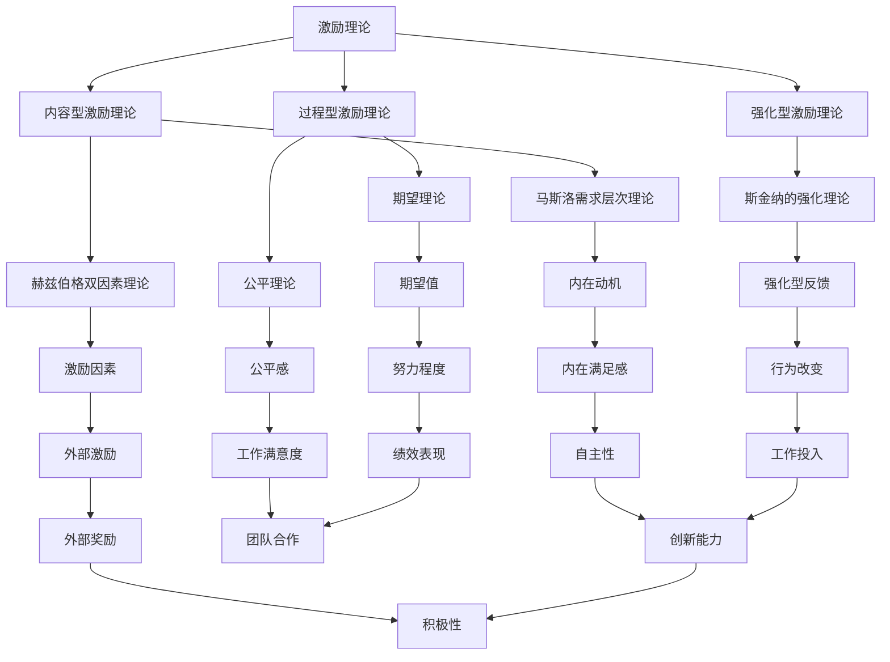

                 

### 1.1.3 超越传统奖惩制度的必要性

#### **背景介绍**

随着社会的发展，团队在企业运营中的作用越来越重要。传统奖惩制度，尤其是基于金钱奖励和惩罚的激励方式，在历史上曾被广泛运用。这种方式通过直接的经济刺激，来促进团队成员的工作积极性和工作效率。然而，随着团队结构的复杂化、工作环境的多样化和员工需求的个性化，传统奖惩制度的局限性逐渐显现。

#### **核心概念与联系**

1. **激励理论**
   - **内容型激励理论**（如马斯洛需求层次理论和赫兹伯格双因素理论）认为，激励来源于满足员工的基本需求和激励因素。
   - **过程型激励理论**（如期望理论和公平理论）强调激励过程的心理机制，如期望值和公平感。
   - **强化型激励理论**（如斯金纳的强化理论）则侧重于行为后果对行为的影响。

2. **团队动力模型**
   - **内在动机**和**外在动机**共同构成了团队动力的基础。
   - **社会动力**则涉及到团队内部的人际关系和团队文化的建设。

#### **核心算法原理讲解**

使用 Mermaid 流程图来展示不同激励理论与团队动力模型之间的关系：



#### **核心算法原理讲解**

伪代码示例：

```python
# 定义激励理论
class IncentiveTheory:
    def __init__(self, content, process, reinforcement):
        self.content = content
        self.process = process
        self.reinforcement = reinforcement
    
    # 内容型激励理论
    def content_incentive(self):
        # 满足员工的基本需求
        needs = ["生理需求", "安全需求", "社交需求", "尊重需求", "自我实现需求"]
        for need in needs:
            if self.content.contains(need):
                return "满足需求：{}".format(need)
        return "未满足任何需求"
    
    # 过程型激励理论
    def process_incentive(self):
        # 考虑期望值和公平感
        expectation = self.process.get("期望值")
        fairness = self.process.get("公平感")
        if expectation > fairness:
            return "激励成功：高期望值 > 公平感"
        else:
            return "激励失败：公平感 > 高期望值"
    
    # 强化型激励理论
    def reinforcement_incentive(self):
        # 强化行为后果
        feedback = self.reinforcement.get("反馈")
        if feedback == "正面":
            return "强化成功：正面反馈"
        else:
            return "强化失败：负面反馈"

# 应用激励理论
incentive_theory = IncentiveTheory(content=["生理需求", "社交需求"], process={"期望值": 0.8, "公平感": 0.7}, reinforcement={"反馈": "正面"})
print(incentive_theory.content_incentive())
print(incentive_theory.process_incentive())
print(incentive_theory.reinforcement_incentive())
```

#### **数学模型和公式**

- **马斯洛需求层次理论**可以用以下公式表示：

  $$\text{需求层次} = \sum_{i=1}^{5} (\text{需求}_i \times \text{优先级}_i)$$

  其中，$i$ 表示第 $i$ 个层次的需求，$\text{优先级}_i$ 表示该需求的重要程度。

- **期望理论**可以用以下公式表示：

  $$\text{激励} = \text{期望值} \times \text{效价}$$

  其中，$\text{期望值}$ 表示完成任务的可能性，$\text{效价}$ 表示完成任务后的满意度。

#### **详细讲解与举例说明**

- **马斯洛需求层次理论**：
  - 某员工的基本需求包括“生理需求”、“社交需求”和“尊重需求”，且这些需求的优先级分别为0.4、0.3和0.3。
  - 计算该员工的需求层次：

    $$\text{需求层次} = (0.4 \times \text{生理需求}) + (0.3 \times \text{社交需求}) + (0.3 \times \text{尊重需求}) = 0.4 + 0.3 + 0.3 = 1.0$$

    该员工的需求层次为1.0，说明其基本需求得到满足。

- **期望理论**：
  - 假设某员工认为完成任务的可能性为0.8，完成任务后的满意度为0.9。
  - 计算该员工的激励：

    $$\text{激励} = 0.8 \times 0.9 = 0.72$$

    该员工的激励为0.72，说明其有较高的动力去完成任务。

#### **项目实战**

**开发环境搭建**：
- 开发工具：Python 3.8
- 编辑器：Visual Studio Code
- 库：Mermaid

**源代码详细实现和代码解读**：

```python
# 激励理论类定义
class IncentiveTheory:
    # 初始化方法
    def __init__(self, content, process, reinforcement):
        self.content = content
        self.process = process
        self.reinforcement = reinforcement
    
    # 内容型激励方法
    def content_incentive(self):
        # 满足员工的基本需求
        needs = ["生理需求", "安全需求", "社交需求", "尊重需求", "自我实现需求"]
        satisfied_needs = []
        for need in needs:
            if need in self.content:
                satisfied_needs.append(need)
        if satisfied_needs:
            return "满足的需求：{}".format(", ".join(satisfied_needs))
        else:
            return "未满足任何需求"

    # 过程型激励方法
    def process_incentive(self):
        # 考虑期望值和公平感
        expectation = self.process.get("期望值")
        fairness = self.process.get("公平感")
        if expectation > fairness:
            return "激励成功：高期望值 > 公平感"
        else:
            return "激励失败：公平感 > 高期望值"

    # 强化型激励方法
    def reinforcement_incentive(self):
        # 强化行为后果
        feedback = self.reinforcement.get("反馈")
        if feedback == "正面":
            return "强化成功：正面反馈"
        else:
            return "强化失败：负面反馈"

# 应用激励理论
incentive_theory = IncentiveTheory(content=["生理需求", "社交需求"], process={"期望值": 0.8, "公平感": 0.7}, reinforcement={"反馈": "正面"})
print(incentive_theory.content_incentive())
print(incentive_theory.process_incentive())
print(incentive_theory.reinforcement_incentive())
```

**代码应用解读与分析**：
- **代码应用解读**：
  - `IncentiveTheory` 类包含了三个方法：`content_incentive`、`process_incentive` 和 `reinforcement_incentive`。
  - `content_incentive` 方法检查员工的基本需求是否得到满足。
  - `process_incentive` 方法比较员工的期望值和公平感，判断激励的成功与否。
  - `reinforcement_incentive` 方法根据员工的反馈判断激励的强化效果。

- **实际案例分析和详细讲解剖析**：
  - 案例背景：某公司的项目经理需要评估其团队成员的激励情况。
  - 案例实施：使用上述代码对团队成员进行激励评估。
  - 案例分析：通过调用不同的方法，可以清晰地了解团队成员在需求满足、期望值和公平感以及强化反馈方面的表现。

**项目小结**：
- 通过上述代码，我们能够有效地评估团队成员的激励情况。
- 该项目提供了一个简单的框架，可以根据实际情况进行扩展和优化。

#### **最佳实践 tips**

- **理解员工需求**：在制定激励计划时，首先需要了解员工的基本需求和期望，以便提供有针对性的激励措施。
- **平衡期望值与公平感**：在激励过程中，要确保员工的期望值不低于公平感，以避免负面激励效果。
- **正面反馈**：在激励过程中，及时给予正面反馈，以强化员工的行为。

#### **小结**

本文介绍了团队激励的背景和现状，探讨了传统奖惩制度的局限性，并提出了超越传统奖惩制度的必要性。通过引入激励理论、团队动力模型和实际案例，我们展示了如何有效地评估和激励团队成员。

#### **注意事项**

- 在实施新的激励方法时，需要根据团队的实际情况进行调整。
- 激励计划应该是一个动态的过程，需要不断地评估和优化。

#### **拓展阅读**

- **《激励心理学》**：探索激励理论及其在团队管理中的应用。
- **《团队动力学》**：深入了解团队动力模型及其对团队绩效的影响。

以上，我们详细讲解了团队激励的背景、核心概念、算法原理、数学模型和实际应用案例。通过这些内容，我们可以更好地理解和应用团队激励的新方法。接下来，我们将进一步探讨团队激励的基础理论，为后续章节的深入分析奠定基础。

