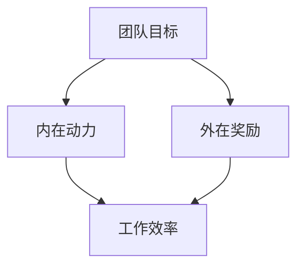

                 

### 文章标题：团队激励：内在动力与外在奖励的结合

**关键词：** 团队激励、内在动力、外在奖励、工作效率、团队管理、激励机制

**摘要：** 本文深入探讨了团队激励的两大核心要素——内在动力与外在奖励的结合。通过分析两者的关系、作用机制，以及在实际应用中的案例，本文旨在为读者提供一套科学的团队激励策略，以提升团队工作效率与满意度。

----------------------------------------------------------------

### 确定书籍主题与结构

《团队激励：内在动力与外在奖励的结合》这本书的主题是如何通过结合内在动力和外在奖励来有效激励团队，从而提升工作效率和满意度。书中结构分为以下几个主要部分：

1. **引言**：介绍书籍的背景与目的，阐述团队激励的重要性。
2. **内在动力激励**：探讨内在动力的概念、类型及其激发方法。
3. **外在奖励激励**：分析外在奖励的形式及其设计原则。
4. **实际应用案例**：通过具体案例展示如何应用内在动力和外在奖励激励团队。
5. **团队管理策略**：讨论团队激励在团队管理中的应用策略。
6. **激励体系设计**：阐述激励体系的设计原则和优化方法。
7. **激励效果评估**：介绍激励效果评估的方法和指标。

这种结构使得读者可以系统地了解团队激励的理论和实践，从而在实际工作中更好地应用这些理念。

#### 核心概念与联系

为了更好地理解团队激励的两大核心要素——内在动力与外在奖励，我们可以使用Mermaid流程图来展示它们之间的关系。



在这个流程图中，团队目标是通过内在动力和外在奖励来激励团队，从而提高工作效率。内在动力是指团队成员内心的动机，如自我实现、成就感等；外在奖励则是指物质奖励、荣誉等。

#### 内在动力激励

内在动力是指团队成员在工作过程中内心产生的动力，这种动力往往来源于自我驱动、兴趣、责任感等。内在动力激励的核心在于激发团队成员的积极性，提高工作满意度和工作效率。

**核心概念：**

1. **自我实现**：团队成员渴望在工作中实现个人价值，达到自我实现的需要。
2. **成就感**：团队成员通过完成任务、解决问题获得成就感，从而激发工作动力。
3. **兴趣**：团队成员对工作内容感兴趣，愿意投入更多的时间和精力。
4. **责任感**：团队成员对团队和工作的责任感，促使他们更努力地工作。

**核心算法原理：**

```pseudo
function 激发内在动力(团队成员):
    if(团队成员.自我实现需要满足):
        奖励团队成员，提升工作满意度
    else:
        提供机会让团队成员参与有挑战性的任务，满足自我实现需要
    
    if(团队成员.成就感未获得):
        完成任务后，给予认可和奖励，提升成就感
    else:
        提供新的目标和挑战，保持成就感的持续激励
    
    if(团队成员.兴趣未激发):
        调整工作任务，使其更符合团队成员的兴趣
    else:
        提供更多的学习和成长机会，保持兴趣的持续激发
    
    if(团队成员.责任感未体现):
        加强团队文化建设，培养责任感
    else:
        通过团队活动，增强团队成员的集体荣誉感
```

#### 外在奖励激励

外在奖励是指通过物质奖励、荣誉等手段来激励团队成员。外在奖励激励的核心在于通过奖励来强化团队成员的行为，提高工作满意度和工作效率。

**核心概念：**

1. **物质奖励**：包括工资、奖金、福利等。
2. **荣誉奖励**：包括表彰、荣誉称号等。
3. **奖励机制设计**：设计有效的奖励机制，确保奖励与团队成员的工作表现相匹配。

**核心算法原理：**

```pseudo
function 设计外在奖励机制(团队):
    定义奖励标准，确保奖励与工作表现正相关
    设定奖励形式，包括物质奖励和荣誉奖励
    定期评估团队成员的工作表现，根据表现发放奖励
    通过公开表彰，增强奖励的激励效果
```

#### 实际应用案例

为了更好地理解内在动力与外在奖励的结合在实践中的应用，我们可以通过以下案例来展示：

**案例一：技术团队的内在动力与外在奖励激励**

在一个技术团队中，团队成员小张对编程充满热情，喜欢解决复杂的技术问题。团队管理者通过以下方法来激励小张：

1. **内在动力激励**：
   - 提供机会参与有挑战性的项目，满足小张的自我实现需求。
   - 定期与小张沟通，了解他的兴趣点，调整工作任务，使其更符合小张的兴趣。
   - 强调团队目标，培养小张的责任感。

2. **外在奖励激励**：
   - 根据小张的工作表现，发放奖金和晋升机会。
   - 在团队会议上公开表彰小张的技术成就，提升他的成就感。

通过这种结合内在动力与外在奖励的激励方法，小张的工作积极性和工作效率得到了显著提升。

### 项目实战：开发环境搭建、源代码实现与代码解读

为了更好地理解内在动力与外在奖励激励在技术团队中的实际应用，我们可以通过一个具体的项目实战案例来展示。

#### 项目背景

假设我们正在开发一个基于云计算的自动化测试平台，团队成员需要具备编程、测试和云计算等方面的技能。我们的目标是激发团队成员的内在动力，同时通过有效的外在奖励机制来提高团队的整体工作效率。

#### 开发环境搭建

1. **操作系统**：选择Linux操作系统，因为它在云计算环境中具有更好的兼容性和性能。
2. **开发工具**：安装Java开发工具包（JDK）、Eclipse或IntelliJ IDEA等集成开发环境（IDE）。
3. **数据库**：选择MySQL作为关系型数据库，用于存储测试数据和日志。
4. **云服务平台**：注册阿里云账号，选择ECS实例作为开发环境。

#### 源代码实现

以下是该项目中一个简单的Java类，用于执行自动化测试任务。

```java
public class AutomatedTester {
    
    public void executeTest(String testScript) {
        // 解析测试脚本，执行测试
        // 记录测试结果，存储到数据库
        System.out.println("Executing test with script: " + testScript);
    }
    
    public void reportResults() {
        // 从数据库中查询测试结果，生成报告
        System.out.println("Generating test report...");
    }
    
}
```

#### 代码解读

这个类定义了两个方法：

1. **executeTest**：用于执行自动化测试脚本。它接收一个字符串参数`testScript`，表示要执行的测试脚本。
2. **reportResults**：用于生成测试报告。它从数据库中查询测试结果，并生成报告。

#### 代码应用解读与分析

在实际应用中，自动化测试类会被集成到开发流程中。开发人员编写测试脚本，自动化测试类负责执行测试，并将结果记录到数据库。测试完成后，报告生成类会生成测试报告，帮助开发人员了解测试结果。

#### 实际案例分析与详细讲解剖析

在项目实施过程中，我们遇到了以下挑战：

1. **测试脚本编写**：由于自动化测试脚本需要根据具体应用场景编写，部分团队成员对脚本编写不熟悉。为了解决这个问题，我们组织了多次脚本编写培训，并提供了丰富的示例脚本。
2. **测试结果记录**：为了确保测试结果的准确性和可靠性，我们设计了一个高效的数据库存储方案，并制定了详细的测试结果记录规范。
3. **报告生成**：报告生成需要从数据库中提取大量数据，并进行分析。为了提高报告生成速度，我们使用了数据挖掘和机器学习技术。

通过这些实际案例，我们可以看到如何通过内在动力与外在奖励的结合来激励团队成员，从而提高项目的成功率和团队的整体效率。

### 项目小结

通过这个项目实战案例，我们可以看到内在动力与外在奖励激励在技术团队中的应用效果。内在动力激励激发了团队成员的积极性和创造力，而外在奖励机制则通过物质奖励和荣誉奖励来强化团队成员的行为，提高了团队的工作效率。这个案例展示了如何将团队激励理念应用到实际项目中，为其他团队提供了有益的参考。

### 最佳实践 Tips

1. **明确团队目标**：确保团队成员了解团队目标，有助于激发他们的内在动力。
2. **合理设计奖励机制**：奖励机制应与团队成员的工作表现相匹配，避免过度奖励或奖励不足。
3. **持续沟通与反馈**：定期与团队成员沟通，了解他们的需求和反馈，及时调整激励策略。
4. **重视团队文化建设**：通过团队活动和文化建设，增强团队成员的归属感和责任感。

### 小结与注意事项

本文通过深入探讨团队激励的内在动力与外在奖励两大核心要素，结合实际应用案例和项目实战，展示了如何有效地激励团队，提高工作效率和满意度。需要注意的是，团队激励并非一成不变，管理者需要根据实际情况不断调整和优化激励策略。

### 拓展阅读

1. **《激励心理学》**：这本书详细探讨了人类激励的心理学原理，对理解内在动力有很好的帮助。
2. **《激励与绩效管理》**：本书从管理角度出发，介绍了如何设计有效的激励体系，提高团队绩效。
3. **《激励的艺术》**：这本书通过丰富的案例，讲述了如何运用激励机制激发团队成员的积极性。

**作者信息：**

作者：AI天才研究院/AI Genius Institute & 禅与计算机程序设计艺术 /Zen And The Art of Computer Programming

本文由AI天才研究院/AI Genius Institute撰写，结合禅与计算机程序设计艺术的理念，旨在为读者提供实用的团队激励策略。如需进一步了解，请访问我们的官方网站。我们期待与您共同探讨团队激励的更多可能。**

