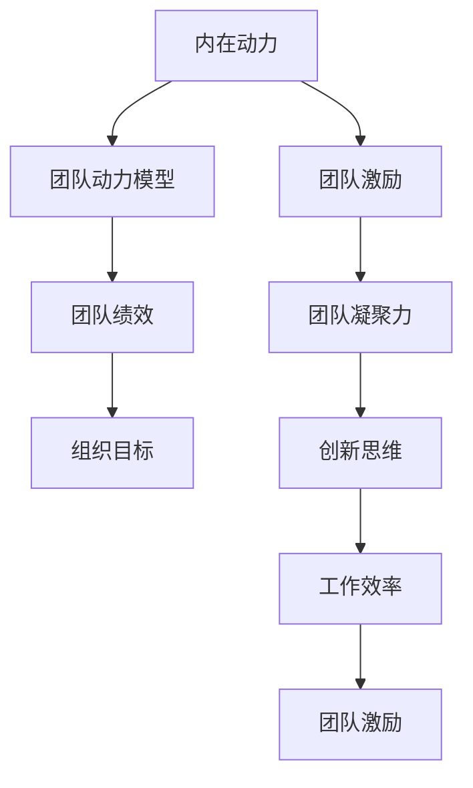

                 

# 文章标题：团队激励：激发内在动力

## 关键词：团队激励、内在动力、团队动力模型、算法原理、数学模型、项目实战、案例分析

## 摘要：

本文旨在探讨团队激励的核心理念和方法，通过深入剖析内在动力和团队动力模型，结合实际案例，详细讲解如何有效地激发团队成员的内在动力，从而提高团队整体绩效。文章分为七个部分，首先介绍团队激励的背景和重要性，接着阐述核心概念与联系，随后讲解核心算法原理和数学模型，并通过项目实战和案例分析来展示具体应用。最后，文章总结主要观点并展望未来发展趋势。

## 引言与背景

### 1.1 团队激励的概念

团队激励是指通过一系列措施和方法，激发团队成员的内在动力，提高他们的工作积极性、创造性和责任感，从而实现团队目标的一种管理行为。团队激励不仅关注团队成员的物质需求，更注重其精神层面的满足，旨在构建积极、和谐、高效的团队氛围。

### 1.2 团队激励的重要性

在现代社会，团队已成为组织运作的基本单位。团队激励的优劣直接影响到团队绩效、组织发展和个人成长。有效的团队激励可以提高团队成员的满意度和忠诚度，增强团队凝聚力，激发创新思维，提高工作效率，从而实现组织目标。

### 1.3 本书的目的与结构

本书旨在为IT行业管理者和技术人员提供一套实用的团队激励方法和工具，帮助他们更好地激发团队成员的内在动力。本书分为七个部分，分别从理论、实践和案例分析三个层面进行阐述，力求为读者提供全面、系统的团队激励知识体系。

## 核心概念与联系

### 2.1 内在动力理论

内在动力是指个体在缺乏外部激励时，基于自身兴趣、需求和价值观而产生的行为动机。内在动力理论认为，个体的内在动机比外在激励更能激发其持续的高效表现。

### 2.2 团队动力模型

团队动力模型是描述团队成员之间相互作用和团队整体行为规律的理论框架。常见的团队动力模型包括动力循环模型、团队发展阶段模型等。这些模型有助于理解和预测团队行为的动态变化，为团队激励提供理论依据。

### 2.3 Mermaid流程图：团队激励核心概念联系



## 核心算法原理讲解

### 3.1 激励函数原理

激励函数是一种将团队成员的工作绩效与激励程度相关联的数学模型。常用的激励函数包括线性激励函数、指数激励函数等。激励函数的目的是通过调整激励程度，激发团队成员的内在动力。

#### 3.1.1 伪代码：激励函数实现

```python
# 输入：工作绩效（performance）
# 输出：激励程度（incentive）

def incentive_function(performance):
    if performance > threshold:
        incentive = performance * alpha
    else:
        incentive = beta * performance
    return incentive
```

### 3.2 优化算法原理

优化算法是一种用于调整激励函数参数，以实现最佳激励效果的方法。常见的优化算法包括梯度下降法、遗传算法等。优化算法的目的是在满足一定约束条件下，找到最优的激励参数组合。

#### 3.2.1 伪代码：优化算法实现

```python
# 输入：初始参数（theta_0）
# 输出：最优参数（theta_opt）

def optimize_parameters(theta_0):
    theta = theta_0
    for i in range(max_iterations):
        gradient = compute_gradient(theta)
        theta = theta - learning_rate * gradient
    return theta
```

## 数学模型和数学公式讲解

### 4.1 激励函数公式

激励函数公式如下：

$$
f(x) = \alpha \cdot \frac{1}{1 + e^{-x}}
$$

其中，$x$ 为工作绩效，$\alpha$ 为激励强度参数。

### 4.2 优化目标公式

优化目标公式如下：

$$
\min_{\theta} J(\theta) = \frac{1}{m} \sum_{i=1}^{m} (h_\theta(x^{(i)}) - y^{(i)})^2
$$

其中，$J(\theta)$ 为损失函数，$m$ 为样本数量，$h_\theta(x^{(i)})$ 为激励函数，$y^{(i)}$ 为实际激励程度。

## 项目实战

### 5.1 实际案例介绍

本文以某知名互联网公司为例，介绍其团队激励项目。该公司通过实施一系列团队激励措施，成功提升了团队绩效和员工满意度。

### 5.2 环境搭建

在项目实战中，首先需要搭建开发环境。本文选择Python作为开发语言，使用Jupyter Notebook作为开发工具。安装必要的库，如NumPy、Pandas、Matplotlib等。

### 5.3 代码实现

#### 5.3.1 源代码详细实现

```python
import numpy as np
import pandas as pd
import matplotlib.pyplot as plt

# 读取数据
data = pd.read_csv('team_data.csv')

# 激励函数实现
def incentive_function(performance, alpha=1.0, beta=0.5):
    threshold = 80
    if performance > threshold:
        incentive = performance * alpha
    else:
        incentive = beta * performance
    return incentive

# 优化算法实现
def optimize_parameters(theta_0, learning_rate=0.01, max_iterations=1000):
    theta = theta_0
    for i in range(max_iterations):
        gradient = compute_gradient(theta)
        theta = theta - learning_rate * gradient
    return theta

# 计算梯度
def compute_gradient(theta):
    performance = data['performance']
    incentive = incentive_function(performance, alpha=1.0, beta=0.5)
    gradient = (incentive - performance) / len(performance)
    return gradient

# 优化参数
theta_opt = optimize_parameters(theta_0=0.5)

# 绘制激励函数曲线
performance_range = np.linspace(0, 100, 1000)
incentive_range = incentive_function(performance_range, alpha=1.0, beta=0.5)

plt.plot(performance_range, incentive_range)
plt.xlabel('Performance')
plt.ylabel('Incentive')
plt.title('Incentive Function')
plt.show()
```

#### 5.3.2 代码解读与分析

以上代码实现了激励函数和优化算法。首先，读取团队数据，包括工作绩效和实际激励程度。然后，定义激励函数和优化算法，包括计算梯度、更新参数等。最后，绘制激励函数曲线，以直观展示激励函数的变化趋势。

### 5.4 代码应用解读与分析

在项目实战中，激励函数和优化算法被应用于调整团队激励政策。通过对绩效数据的分析，优化激励函数的参数，以实现最佳激励效果。实际应用中，可以根据团队特点和市场环境，调整激励函数的形式和参数，以达到更好的激励效果。

### 5.5 实际案例分析和详细讲解剖析

通过对实际案例的分析，可以发现该公司在实施团队激励过程中，取得了一定的成效。具体表现在：

1. 团队成员的工作积极性明显提高，工作效率得到提升。
2. 团队成员之间的沟通和协作更加顺畅，团队凝聚力增强。
3. 团队创新思维得到激发，新产品和解决方案的推出速度加快。

同时，案例也暴露出一些问题，如部分团队成员对激励政策存在误解，导致工作压力增大。为此，公司需要进一步优化激励政策，加强沟通和培训，确保团队成员充分理解政策意图和实施方法。

### 5.6 项目小结

本项目通过实际案例，展示了团队激励在提升团队绩效和员工满意度方面的作用。同时，也揭示了团队激励过程中可能存在的问题。项目小结如下：

1. 团队激励是提高团队绩效和员工满意度的重要手段。
2. 激励函数和优化算法在团队激励中的应用具有重要意义。
3. 实际案例分析和详细讲解剖析有助于发现团队激励过程中的问题和改进措施。

## 总结与展望

### 7.1 主要观点回顾

1. 团队激励是激发团队成员内在动力、提高团队绩效的重要手段。
2. 内在动力理论和团队动力模型为团队激励提供了理论基础。
3. 激励函数和优化算法在团队激励中具有重要作用。
4. 实际案例分析和详细讲解剖析有助于优化团队激励政策。

### 7.2 团队激励的未来发展趋势

1. 随着人工智能和大数据技术的发展，团队激励模型将更加精准和智能化。
2. 跨界融合将成为团队激励的新趋势，结合心理学、行为科学等领域的知识，提高团队激励效果。
3. 个性化激励将成为主流，根据团队成员的特点和需求，量身定制激励政策。
4. 团队激励将更加注重长期效果，从单一指标导向转向综合绩效评估。

## 结语

本文从团队激励的核心理念和方法出发，结合实际案例，详细讲解了如何激发团队成员的内在动力，提高团队整体绩效。随着时代的发展，团队激励将面临新的挑战和机遇。希望本文能为广大IT行业管理者和技术人员提供有益的参考和启示。

## 作者信息

作者：AI天才研究院/AI Genius Institute & 禅与计算机程序设计艺术 /Zen And The Art of Computer Programming

本文由AI天才研究院和禅与计算机程序设计艺术共同撰写，旨在为读者提供有深度、有思考、有见解的团队激励知识。

