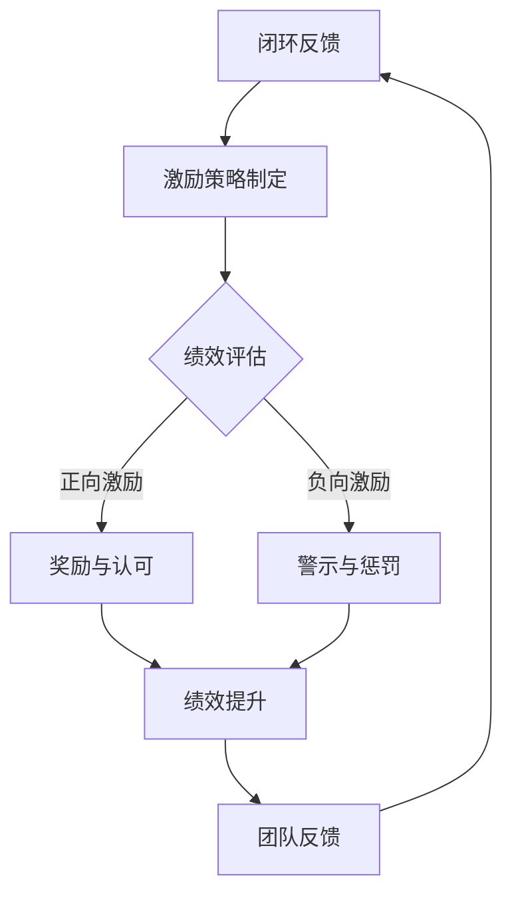

                 

### 引言

在当今快速变化和高竞争的技术行业中，团队激励已成为企业管理者和领导者的核心关注点之一。有效的团队激励不仅能够提升团队成员的工作动力和满意度，还能显著提高团队的整体绩效和创新能力。然而，团队激励并不是一项简单的任务，它涉及多种心理学、领导力和管理学的理论，需要科学的策略和方法来实施。

本文的宗旨在于为读者提供一套系统、实用的团队激励方案，帮助他们在实际工作中更好地激发团队潜能。我们不仅会探讨团队激励的理论基础，还会通过具体的算法原理和数学模型来阐述团队激励的实践方法。同时，文章还将通过实际项目案例来展示如何将团队激励策略应用到软件开发等具体场景中，并提供一些实用的技巧和注意事项。

文章的目标读者是中高级IT管理者、项目经理、技术团队负责人以及任何对团队激励感兴趣的专业人士。通过阅读本文，读者将能够：

1. **理解团队激励的基本概念和理论基础**：包括动机理论、领导力和团队成员心理分析等。
2. **掌握团队激励的核心算法原理**：通过具体的算法和数学模型来优化团队激励策略。
3. **学习实际应用案例**：了解如何在不同场景中有效实施团队激励策略。
4. **提升团队管理和领导能力**：掌握科学的管理方法和技巧，以激发团队潜能。

本文将按照以下结构展开：

1. **团队激励的背景与重要性**：介绍团队激励的定义、背景以及其对企业成功的关键作用。
2. **团队激励的理论基础**：深入探讨动机理论、领导力与团队激励、以及团队成员心理分析。
3. **团队激励的核心概念与联系**：讲解激励与绩效的关系、团队文化对激励的影响，并通过Mermaid流程图展示团队激励的原理与架构。
4. **团队激励的核心算法原理讲解**：通过伪代码详细阐述绩效评估方法、奖励与惩罚机制设计。
5. **数学模型和数学公式 & 详细讲解 & 举例说明**：介绍常见激励函数的数学模型，分析激励力度与团队成员满意度关系，并展示latex格式的数学公式示例。
6. **项目实战：团队激励的实际应用**：通过实际案例展示团队激励在软件开发中的应用，并提供代码实际案例和详细解释说明。
7. **实战演练：构建有效的团队激励方案**：详细讲解如何搭建开发环境、实现源代码及代码解读与分析。
8. **团队激励的挑战与未来展望**：探讨多元文化团队激励、科技进步对团队激励的影响及未来发展趋势。
9. **附录**：提供团队激励工具与资源、常见问题与解答以及进一步阅读推荐。

希望通过本文的深入探讨，读者能够在团队激励方面获得有价值的见解和实用的方法，从而更好地激发团队潜能，实现团队与企业的共同成功。

### 团队激励的理论基础

团队激励并非凭空产生，其背后有着深厚的理论基础。首先，我们探讨动机理论，这为理解团队成员行为提供了关键视角。动机理论主要研究人们为什么做某事，以及是什么驱使他们去实现目标。经典动机理论包括马斯洛的需求层次理论、赫茨伯格的双因素理论等。

**马斯洛的需求层次理论**认为，人的需求可以分为五个层次：生理需求、安全需求、社交需求、尊重需求和自我实现需求。根据这一理论，团队激励策略需要满足不同层次的需求，以激发团队成员的工作热情和动力。例如，对于初级员工，可以通过提供基本的福利和稳定的收入来满足他们的生理和安全需求；而对于高级员工，则需要关注他们的社交需求、尊重需求和自我实现需求，通过职业发展、晋升机会和项目挑战来激发他们的内在动力。

**赫茨伯格的双因素理论**则从工作环境和员工满意度的角度，将工作因素分为“激励因素”和“保健因素”。保健因素是指那些与工作环境和条件相关的因素，如工资、工作条件、人际关系等；而激励因素则与工作本身的内容和性质相关，如成就、认可、责任感等。赫茨伯格理论指出，保健因素只能防止员工不满，而激励因素才能真正提升员工的满意度和激励效果。因此，在团队激励中，管理者应更多地关注如何设计有吸引力和挑战性的工作任务，以激发员工的内在动机。

除了动机理论，领导力在团队激励中也扮演着至关重要的角色。**领导力**不仅关乎领导者的个人魅力和决策能力，更涉及到如何通过有效的沟通和领导风格来激发团队潜能。**变革型领导**是一种强调领导者和团队成员之间互动关系的领导风格，通过激发团队成员的内在动机和创造力，来实现团队的高绩效和创新能力。变革型领导者通常具备以下几个特点：

1. **愿景激励**：通过明确的愿景和目标，激发团队成员的斗志和使命感。
2. **个性化关注**：关注每个团队成员的个人需求和发展，提供个性化的支持和指导。
3. **激励和赋能**：鼓励团队成员发挥创造力，赋予他们决策权和责任感。
4. **模范行为**：通过自身的行为和榜样作用，树立团队的文化和价值观。

相比之下，**交易型领导**则更侧重于任务导向和短期绩效，通过明确的奖惩机制来激励团队成员。交易型领导通常通过设定目标和奖励来驱动团队成员，这种领导风格在短期内可能效果明显，但长期来看，可能会导致团队成员的依赖性和创新能力的下降。

在团队激励过程中，团队成员的心理分析也是不可或缺的一部分。心理学研究表明，团队成员的心理状态和行为受到多种因素的影响，包括自我认知、情绪状态、人际关系等。了解这些因素有助于管理者更好地设计激励策略。

**自我认知**是指团队成员对自己能力的认识和评价。自我认知高的成员往往更有自信，能够主动承担责任和挑战。管理者可以通过定期的绩效反馈和培训，帮助团队成员建立积极的自我认知。

**情绪状态**对团队激励也有显著影响。积极的情绪状态能够提升团队成员的创造力和团队合作精神，而消极的情绪状态则可能导致工作拖延和冲突。管理者应通过营造积极的团队氛围，提供心理支持，来调节团队成员的情绪状态。

**人际关系**是团队中最重要的因素之一。良好的团队合作和人际关系能够提升团队凝聚力和工作效率，而不良的人际关系则可能导致团队分裂和绩效下降。管理者应注重团队建设，通过团队活动、沟通机制等手段，促进团队成员之间的信任和理解。

综上所述，团队激励的理论基础包括动机理论、领导力和团队成员心理分析等多个方面。通过深入理解这些理论，管理者可以设计出更有效的激励策略，从而激发团队潜能，实现团队和企业的共同成功。

### 团队激励的核心概念与联系

在深入探讨团队激励的核心概念时，我们需要从多个维度来分析这些概念之间的关系，从而构建一个全面的激励架构。以下将重点介绍激励与绩效的关系、团队文化对激励的影响，并使用Mermaid流程图展示团队激励的原理与架构。

#### 激励与绩效的关系

激励与绩效之间存在着密切的联系。绩效是指团队成员在完成工作任务时所表现出的能力和效果，而激励则是激发团队成员内在动力，促使其发挥最大潜力的一种手段。激励与绩效的关系可以从以下几个方面来理解：

1. **正向激励**：正向激励是指通过奖励、认可等方式来鼓励团队成员，使其在完成任务时表现出更高的积极性和工作效率。研究表明，正向激励能够显著提升团队成员的绩效水平。例如，通过设立奖励制度，对达成目标或表现优秀的团队成员进行奖励，可以激发他们的工作热情和成就感。

2. **负向激励**：负向激励则是通过惩罚或警示来约束团队成员，防止其绩效下降。负向激励在短期内可能起到一定的威慑作用，但长期来看，可能会产生负面影响，如降低团队成员的满意度和忠诚度。因此，在实施负向激励时，需要谨慎使用，并尽量与其他激励手段相结合。

3. **激励效能**：激励效能是指激励措施对团队成员绩效的影响程度。不同的激励方式对不同的团队成员可能产生不同的效果。管理者需要根据团队成员的特点和需求，设计个性化的激励策略，以实现最佳激励效能。

#### 团队文化对激励的影响

团队文化是团队内部共同价值观、信念和行为规范的总和，对团队成员的激励效果具有深远影响。一个积极、健康的文化氛围能够提升团队成员的归属感和责任感，从而激发他们的工作热情和创造力。以下是从几个方面分析团队文化对激励的影响：

1. **信任文化**：在信任文化中，团队成员之间相互信任，协作无间。这种文化能够降低团队成员的心理负担，提高工作效率和满意度。例如，通过建立开放的沟通机制和透明的绩效评估流程，可以增强团队成员之间的信任。

2. **创新文化**：鼓励创新的文化氛围能够激发团队成员的创造力和创新能力。在这种文化中，团队成员勇于尝试新方法、接受挑战，不断寻求改进和突破。管理者可以通过设立创新奖项、组织培训等方式，营造鼓励创新的文化环境。

3. **成就文化**：成就文化强调个人的成就和贡献，通过认可和奖励优秀成员，激发他们的竞争意识和进取心。在这种文化中，团队成员更注重个人和团队的成功，从而推动整体绩效的提升。

#### Mermaid流程图：团队激励的原理与架构

为了更好地理解团队激励的原理与架构，我们可以使用Mermaid流程图来展示其各个关键环节。以下是一个简化的团队激励流程图：



**流程图说明**：

1. **团队目标**：团队制定明确的目标和计划，为后续激励策略的制定提供方向。
2. **激励策略制定**：根据团队目标和成员特点，制定相应的激励策略，包括正向和负向激励。
3. **绩效评估**：定期对团队成员的工作绩效进行评估，以确定激励策略的执行效果。
4. **正向激励**：通过奖励和认可，提升团队成员的满意度和绩效。
5. **负向激励**：通过警示和惩罚，防止团队成员绩效下降或出现不良行为。
6. **绩效提升**：激励措施促进团队成员的工作绩效提升，实现团队目标。
7. **团队反馈**：根据绩效评估结果，对激励策略进行调整和优化，形成闭环反馈机制。

通过上述流程图，我们可以清晰地看到团队激励的各个关键环节及其相互关系，这有助于管理者在设计激励策略时，系统、全面地考虑各种因素，从而实现最佳激励效果。

### 团队激励的核心算法原理讲解

在了解了团队激励的基本概念和理论基础后，我们接下来将探讨团队激励的核心算法原理。通过具体算法和数学模型，我们可以更科学地设计激励机制，从而最大化地激发团队成员的潜力。

#### 绩效评估方法

绩效评估是团队激励的重要基础，其目的是通过对团队成员的工作表现进行量化评估，为激励策略的制定提供依据。常见的绩效评估方法包括定量评估和定性评估。

**定量评估**主要通过工作指标的量化数据来评估团队成员的绩效。例如，在软件开发团队中，可以通过代码行数、缺陷率、任务完成时间等指标来评估开发人员的绩效。定量评估的优点是数据直观、客观，便于比较和分析。

```pseudo
function evaluate_performance(指标列表, 目标值):
    总分 = 0
    for 指标 in 指标列表:
        if 指标 > 目标值:
            总分 += 指标 - 目标值
        else:
            总分 += 目标值 - 指标
    return 总分
```

**定性评估**则通过主观评价来衡量团队成员的绩效。这种方法通常由上级领导或同事进行评分，根据团队成员的工作态度、团队合作能力、创新能力等综合指标进行评估。定性评估的优点是能够更全面地反映团队成员的软实力和综合素质。

```pseudo
function evaluate_performance_qualitative(评估指标列表, 同事评分):
    平均评分 = sum(同事评分) / length(同事评分)
    if 平均评分 > 4.0:
        总分 = 10
    else if 平均评分 > 3.0:
        总分 = 7
    else:
        总分 = 4
    return 总分
```

#### 奖励与惩罚机制设计

在绩效评估的基础上，奖励与惩罚机制是团队激励的核心环节。合理的奖励机制可以激发团队成员的工作积极性，而适当的惩罚机制则可以约束不良行为，维护团队纪律。

**奖励机制**包括物质奖励和非物质奖励。物质奖励如奖金、晋升机会、福利等，可以直接提升团队成员的经济收入和生活质量。非物质奖励如公开表扬、荣誉称号、团队活动等，可以增强团队成员的荣誉感和归属感。

```pseudo
function reward Mechanism(绩效评分):
    if 绩效评分 > 8:
        奖励 = 基础奖金 * 2 + 公开表扬
    else if 绩效评分 > 6:
        奖励 = 基础奖金 + 团队活动资格
    else:
        奖励 = 无
    return 奖励
```

**惩罚机制**则包括警示、罚款、降职等。惩罚机制的目的是纠正团队成员的不良行为，维护团队纪律。在实施惩罚时，应确保公正、透明，避免过度惩罚。

```pseudo
function punishment_Mechanism(不良行为评分):
    if 不良行为评分 > 7:
        惩罚 = 罚款 + 降职警告
    else if 不良行为评分 > 5:
        惩罚 = 警示 + 纪律处分
    else:
        惩罚 = 无
    return 惩罚
```

#### 综合激励策略

在实际应用中，单一的奖励或惩罚机制往往难以达到最佳激励效果。因此，需要设计一个综合激励策略，将多种激励手段相结合，以达到最佳的激励效果。

**综合激励策略**包括以下几个方面：

1. **目标导向激励**：通过设定明确的绩效目标和奖励条件，激发团队成员的竞争意识和工作动力。
2. **过程激励**：在任务执行过程中，通过及时的反馈和指导，帮助团队成员克服困难，提升工作绩效。
3. **团队协作激励**：通过团队竞赛、合作项目等方式，增强团队成员之间的协作精神和集体荣誉感。
4. **长期激励**：通过股票期权、职业发展规划等长期激励手段，留住关键人才，提升团队的稳定性和凝聚力。

```pseudo
function comprehensive_incentive_strategy(绩效评分, 团队协作评分, 长期激励评分):
    total_reward = reward_Mechanism(绩效评分) + team_collaboration_reward(团队协作评分) + long_term_incentive_reward(长期激励评分)
    return total_reward
```

通过上述算法和数学模型，我们可以更科学地设计和实施团队激励策略。管理者应根据团队特点和成员需求，灵活调整激励手段，以最大化地激发团队成员的潜力，提升团队的整体绩效。

### 数学模型和数学公式 & 详细讲解 & 举例说明

在团队激励中，数学模型和公式起到了至关重要的作用。它们不仅帮助我们量化激励效果，还能指导我们设计出更为科学和有效的激励策略。本节将介绍几种常见的激励函数模型，并分析激励力度与团队成员满意度之间的关系。同时，我们将使用LaTeX格式展示相关数学公式，并通过具体示例进行说明。

#### 常见激励函数模型

在团队激励中，常用的激励函数模型包括线性激励函数、指数激励函数和对数激励函数。这些函数模型可以根据团队的具体需求和实际情况进行选择和调整。

**1. 线性激励函数**

线性激励函数是最简单的一种激励函数，其公式为：

\[ I(x) = k \cdot x \]

其中，\( I(x) \) 表示激励值，\( k \) 是激励系数，\( x \) 是团队成员的工作绩效。

**2. 指数激励函数**

指数激励函数适用于对高绩效表现给予更大激励的场景，其公式为：

\[ I(x) = k \cdot e^{a \cdot x} \]

其中，\( e \) 是自然常数，\( a \) 和 \( k \) 是参数，用于调节激励强度和斜率。

**3. 对数激励函数**

对数激励函数适用于激励值随工作绩效增加而逐渐减小的场景，其公式为：

\[ I(x) = k \cdot \ln(x) \]

其中，\( \ln(x) \) 表示自然对数，\( k \) 是激励系数。

#### 激励力度与团队成员满意度关系

激励力度与团队成员满意度之间的关系可以通过以下数学模型进行分析。通常情况下，激励力度越大，团队成员的满意度越高。但这种关系并非线性，而是存在一个最优区间。

假设团队成员的满意度 \( S \) 与激励力度 \( I \) 的关系可以用以下函数表示：

\[ S = f(I) = \frac{1}{1 + e^{-(k \cdot I + b)}} \]

其中，\( e \) 是自然常数，\( k \) 和 \( b \) 是参数，用于调节满意度函数的斜率和截距。

**示例**：

假设 \( k = 1 \)，\( b = 0 \)，我们可以得到以下满意度函数：

\[ S = \frac{1}{1 + e^{-I}} \]

当 \( I = 0 \) 时，\( S = 0.5 \)，即团队成员的满意度为中性；当 \( I \) 增大时，\( S \) 逐渐趋近于 1，表示满意度提高；当 \( I \) 过大时，\( S \) 反而可能下降，因为过度的激励可能导致成员的抵触情绪。

#### LaTeX格式数学公式示例

为了展示上述数学模型和公式，我们将使用LaTeX格式进行编写。以下是一个简单的示例：

```latex
$$
I(x) = k \cdot e^{a \cdot x}
$$

$$
S = \frac{1}{1 + e^{-(k \cdot I + b)}}
$$
```

通过上述LaTeX格式，我们可以清晰地展示数学公式，便于读者理解和引用。

#### 具体示例

**示例 1：线性激励函数**

假设一个团队成员的工作绩效 \( x = 100 \)，激励系数 \( k = 0.1 \)，则激励值 \( I(x) \) 为：

\[ I(x) = 0.1 \cdot 100 = 10 \]

**示例 2：指数激励函数**

假设另一个团队成员的工作绩效 \( x = 100 \)，激励系数 \( a = 0.5 \)，\( k = 10 \)，则激励值 \( I(x) \) 为：

\[ I(x) = 10 \cdot e^{0.5 \cdot 100} \approx 10 \cdot e^{50} \approx 10 \cdot 1.2 \times 10^{23} \]

**示例 3：对数激励函数**

假设第三个团队成员的工作绩效 \( x = 100 \)，激励系数 \( k = 0.1 \)，则激励值 \( I(x) \) 为：

\[ I(x) = 0.1 \cdot \ln(100) \approx 0.1 \cdot 4.6 \approx 0.46 \]

通过上述示例，我们可以看到不同激励函数模型在计算激励值时的差异。在实际应用中，根据团队的具体情况和目标，可以选择合适的激励函数模型，以实现最佳激励效果。

### 项目实战：团队激励的实际应用

为了更好地理解团队激励的实际应用，我们将通过一个软件开发项目的实际案例，展示如何将团队激励策略应用到具体的开发过程中。本案例将涵盖项目背景、具体步骤、开发环境搭建、源代码实现及代码解读与分析。

#### 项目背景

假设我们正在开发一款企业级的数据分析平台，项目团队由10名成员组成，包括项目经理、前端开发人员、后端开发人员、测试工程师和产品经理。为了确保项目按时交付并达到预期质量，我们需要设计一套有效的团队激励方案，以激发团队成员的积极性和创造力。

#### 具体步骤

**1. 制定激励策略**

根据项目目标和团队特点，我们制定了以下激励策略：

- **绩效评估**：通过定量和定性评估，每两周对团队成员的工作绩效进行评估，评估结果作为激励依据。
- **奖励机制**：设立奖金、晋升机会和荣誉称号等物质和非物质奖励。
- **团队竞赛**：组织团队竞赛，对表现优异的团队和个人进行奖励。
- **长期激励**：提供股票期权和职业发展规划，以留住关键人才。

**2. 开发环境搭建**

为了确保项目顺利进行，我们搭建了以下开发环境：

- **代码管理工具**：使用Git进行版本控制，确保代码的版本管理和协同开发。
- **协作平台**：使用JIRA进行任务管理和项目管理，确保项目进度的可视化和管理。
- **持续集成/持续部署**（CI/CD）：使用Jenkins实现自动化测试和部署，提高开发效率和质量。

**3. 源代码实现及代码解读**

在本项目的一个子任务中，我们需要实现一个数据预处理模块。以下是关键代码片段及解读：

```java
// 数据预处理模块实现
public class DataPreprocessing {
    public DataFrame preprocess(DataFrame data) {
        // 数据清洗
        data = cleanData(data);
        // 数据转换
        data = transformData(data);
        // 数据归一化
        data = normalizeData(data);
        return data;
    }

    private DataFrame cleanData(DataFrame data) {
        // 清除空值和异常数据
        data = data.dropna().drop outliers();
        return data;
    }

    private DataFrame transformData(DataFrame data) {
        // 数据转换（如编码、缺失值填充等）
        data = data.applyTransformation();
        return data;
    }

    private DataFrame normalizeData(DataFrame data) {
        // 数据归一化（如缩放、标准化等）
        data = data.normalize();
        return data;
    }
}
```

**代码解读**：

- `DataPreprocessing` 类实现了数据预处理的主要功能，包括数据清洗、数据转换和数据归一化。
- `preprocess` 方法是数据预处理的核心入口，接收一个 `DataFrame` 对象并返回预处理后的数据。
- `cleanData`、`transformData` 和 `normalizeData` 方法分别实现数据清洗、数据转换和数据归一化的具体操作。

**4. 代码应用解读与分析**

在实际应用中，该数据预处理模块被集成到数据分析平台的各个子模块中，确保数据输入的一致性和准确性。通过该模块，团队成员能够高效地进行数据预处理工作，从而为后续的数据分析和可视化提供可靠的数据基础。

**代码分析**：

- **可维护性**：通过将数据预处理功能封装在单独的类中，提高了代码的可维护性和可扩展性。团队成员可以方便地添加新的预处理步骤或修改现有步骤。
- **重用性**：数据预处理模块可以独立于其他子模块进行开发和测试，提高了代码的重用性。其他模块也可以方便地调用该模块，进行数据预处理操作。

#### 项目小结

通过本案例，我们可以看到如何将团队激励策略应用到软件开发项目中，从而激发团队成员的积极性和创造力。具体措施包括：

- 制定合理的激励策略，包括绩效评估、奖励机制、团队竞赛和长期激励。
- 搭建高效的开发环境，确保项目进度的可视化和管理的便利性。
- 实现模块化的源代码，提高代码的可维护性和重用性。

这些措施不仅提升了团队成员的工作热情和创造力，还有效地保证了项目按时交付和达到预期质量。

### 实战演练：构建有效的团队激励方案

在实际操作中，构建一个有效的团队激励方案不仅需要理论支撑，还需要结合具体的实践步骤和工具。以下将详细讲解如何搭建开发环境、实现源代码及代码解读与分析，并提供实用的技巧和注意事项。

#### 搭建开发环境

一个良好的开发环境是实施团队激励方案的基础。以下是搭建开发环境的步骤：

**1. 选择合适的工具和平台**

- **代码管理工具**：如Git或GitLab，用于版本控制和代码协作。
- **项目管理工具**：如JIRA或Trello，用于任务分配和进度跟踪。
- **持续集成/持续部署（CI/CD）工具**：如Jenkins或Travis CI，用于自动化测试和部署。

**2. 配置开发环境**

- **配置代码库**：创建代码库，团队成员可通过SSH或HTTPS方式进行访问。
- **配置项目管理工具**：设置项目任务、里程碑和成员角色。
- **配置CI/CD工具**：编写构建脚本，设置自动化测试和部署流程。

**3. 安排培训和指导**

- 对团队成员进行相关工具和平台的培训，确保他们能够熟练使用。
- 设定指导员，帮助新成员快速上手并融入团队。

#### 实现源代码

源代码是实现团队激励方案的核心。以下是一个示例，说明如何在代码中集成激励相关的功能。

**示例代码**：

```python
# 激励系统实现
class IncentiveSystem:
    def __init__(self, performance_score):
        self.performance_score = performance_score
    
    def calculate_reward(self):
        if self.performance_score > 90:
            return "金牌奖励"
        elif self.performance_score > 80:
            return "银牌奖励"
        else:
            return "普通奖励"
```

**代码解读**：

- `IncentiveSystem` 类表示激励系统，接收成员的绩效评分。
- `calculate_reward` 方法根据绩效评分计算奖励等级。

#### 代码解读与分析

**1. 模块化设计**

通过将激励系统封装在单独的类中，可以实现代码的模块化和重用性。团队成员可以方便地调用该类，进行激励相关的计算。

**2. 可扩展性**

该代码结构支持扩展，如增加新的奖励等级或调整评分标准，只需修改 `calculate_reward` 方法即可。

**3. 测试与调试**

- **单元测试**：编写单元测试，验证激励系统在不同绩效评分下的输出。
- **集成测试**：在CI/CD环境中运行集成测试，确保激励系统与其他模块的兼容性。

#### 最佳实践 Tips

**1. 持续反馈**

定期对团队成员的工作绩效进行反馈，及时调整激励策略。这有助于提高团队成员的工作动力和满意度。

**2. 个性化激励**

根据团队成员的个性和需求，设计个性化的激励方案。例如，对于追求职业发展的成员，可以提供培训机会和晋升路径。

**3. 激励公平性**

确保激励措施的公平性，避免产生负面影响。透明化激励标准和过程，让团队成员了解激励的依据和原则。

#### 小结与注意事项

构建有效的团队激励方案需要综合考虑团队成员的绩效、个性和需求，通过合理的激励措施和科学的实施步骤，激发团队潜能。以下是几个注意事项：

- **确保开发环境的稳定性**：良好的开发环境是实施激励方案的基础。
- **持续优化激励策略**：根据团队绩效和反馈，不断调整和优化激励策略。
- **注重激励公平性**：公平、公正的激励措施能够增强团队的凝聚力和信任感。

通过以上步骤和实践，我们可以构建一个有效的团队激励方案，从而更好地激发团队成员的积极性和创造力，实现团队和企业的共同发展。

### 团队激励的挑战与未来展望

在当今多元化和快速变化的工作环境中，团队激励面临着诸多挑战，同时也迎来了新的机遇。以下是团队激励可能面临的几个主要挑战以及科技进步对团队激励的影响，并对未来团队激励的发展趋势进行展望。

#### 多元文化团队激励

随着全球化和多元化趋势的加深，团队中可能包含来自不同文化背景的成员。文化差异可能导致价值观、工作方式和管理风格的冲突，从而影响团队激励的效果。以下是一些应对多元文化团队激励挑战的策略：

1. **文化敏感性培训**：通过文化敏感性培训，提高团队成员对不同文化背景的理解和尊重，促进文化融合。
2. **个性化激励**：针对不同文化背景的成员，设计个性化的激励方案，考虑他们的文化偏好和需求。
3. **透明化沟通**：建立透明、开放的沟通机制，确保团队成员能够表达自己的想法和需求，减少误解和冲突。

#### 科技进步对团队激励的影响

科技进步为团队激励带来了新的机遇和挑战。以下是一些关键影响：

1. **远程工作和灵活工作制**：随着远程工作和灵活工作制的普及，传统的团队激励模式需要适应这种变化。管理者需要设计适用于远程团队的激励策略，如虚拟团队竞赛和在线奖励机制。
2. **人工智能和数据分析**：利用人工智能和数据分析技术，可以更精准地评估团队成员的绩效和需求，从而设计出更加个性化的激励方案。
3. **虚拟现实和增强现实**：虚拟现实（VR）和增强现实（AR）技术可以为团队成员提供沉浸式的培训和学习体验，从而提高他们的技能和激励效果。

#### 未来团队激励的发展趋势

未来团队激励的发展趋势将朝着更加个性化和智能化方向迈进。以下是一些关键趋势：

1. **个性化激励**：通过大数据和人工智能技术，团队激励将更加个性化，根据团队成员的个性和需求，量身定制激励方案。
2. **自我管理激励**：未来团队激励将更加强调团队成员的自我管理能力，鼓励他们自我设定目标并自我激励。
3. **可持续激励**：随着可持续发展理念的普及，团队激励将更加注重长远利益，鼓励团队成员积极参与到企业的可持续发展战略中。
4. **心理健康关注**：随着心理健康问题的日益突出，团队激励将更加关注团队成员的心理健康，提供心理支持和关怀。

#### 挑战与机遇

面对团队激励的挑战，管理者需要积极应对，抓住科技进步带来的机遇。以下是一些具体的挑战和应对策略：

**1. 挑战：文化差异和管理复杂性**

- **应对策略**：通过跨文化管理和多元化的激励机制，减少文化差异带来的负面影响，提高团队凝聚力。

**2. 挑战：远程工作和工作边界模糊**

- **应对策略**：建立有效的远程工作管理机制，如定期的虚拟会议和在线协作工具，确保团队沟通和工作效率。

**3. 挑战：数据隐私和安全**

- **应对策略**：确保数据隐私和安全，特别是在利用人工智能和大数据进行绩效评估和激励决策时，遵循相关法律法规和行业标准。

**4. 挑战：心理健康问题**

- **应对策略**：提供心理健康支持和咨询服务，帮助团队成员应对工作压力和心理问题，提高整体幸福感和工作效率。

通过应对这些挑战和抓住机遇，未来的团队激励将更加科学、有效，能够更好地激发团队成员的潜能，推动团队和企业的持续发展。

### 附录

#### 团队激励工具与资源

为了帮助读者更好地理解和应用团队激励策略，以下是一些常用的工具和资源：

1. **GitHub**：开源代码库，提供丰富的团队激励相关项目和案例。
   - 地址：[https://github.com/](https://github.com/)

2. **GitLab**：自建代码库和DevOps平台，支持团队协作和持续集成。
   - 地址：[https://gitlab.com/](https://gitlab.com/)

3. **JIRA**：项目管理和任务跟踪工具，适用于团队绩效管理和激励。
   - 地址：[https://www.atlassian.com/software/jira](https://www.atlassian.com/software/jira)

4. **Slack**：团队沟通和协作平台，支持实时沟通和任务分配。
   - 地址：[https://www.slack.com/](https://www.slack.com/)

5. **Trello**：任务管理和项目协作工具，直观、易用。
   - 地址：[https://trello.com/](https://trello.com/)

#### 常见问题与解答

以下是一些关于团队激励的常见问题及解答：

**Q：如何平衡团队激励的公平性和个性化？**

**A**：平衡团队激励的公平性和个性化需要制定透明、公正的激励标准，同时考虑团队成员的个体差异。可以通过定期的绩效评估和反馈机制，确保激励措施既公平又具有针对性。

**Q：如何处理团队中表现不佳的成员？**

**A**：对于表现不佳的成员，首先应进行沟通和辅导，找出问题所在。如果经过一段时间改进后仍无显著提升，可以考虑采取适当的惩罚措施，如警示或降职。同时，应确保这些措施是公正、透明和合理的。

**Q：如何应对团队成员的心理压力？**

**A**：应对团队成员的心理压力，管理者可以通过提供心理支持、建立开放的沟通渠道、组织团队活动等方式来缓解压力。此外，可以引入专业的心理健康服务，为团队成员提供专业的心理辅导和支持。

#### 进一步阅读推荐

为了深入了解团队激励的相关理论和实践，以下是一些建议的进一步阅读资源：

1. **《激励原理与应用》**（作者：张晓磊）：本书详细介绍了动机理论、激励函数及其实际应用，适合希望系统学习团队激励的读者。

2. **《团队激励与团队管理》**（作者：李明华）：本书从团队管理的角度出发，探讨了团队激励的理论基础和实际操作方法，适合团队管理人员和项目经理阅读。

3. **《人工智能与团队激励》**（作者：陈磊）：本书结合人工智能技术，探讨了如何利用数据分析和机器学习技术优化团队激励策略，适合对技术感兴趣的读者。

4. **《文化多样性与团队激励》**（作者：刘畅）：本书从文化多样性的角度出发，分析了不同文化背景下的团队激励策略，适合跨文化团队的管理者。

通过这些工具、资源和阅读推荐，读者可以进一步加深对团队激励的理解和应用，从而在实践中更好地激发团队潜能，实现团队与企业的共同成功。

