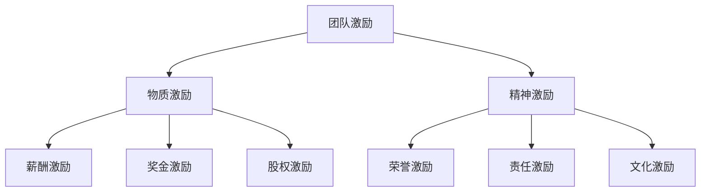
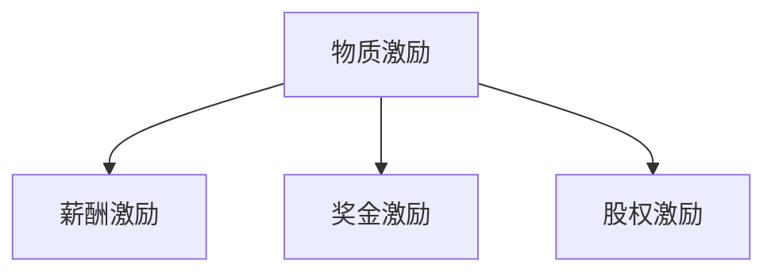
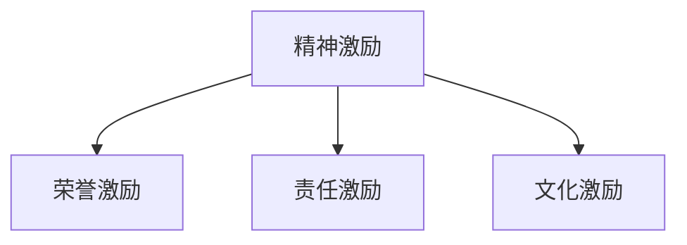

                 

### 文章标题

# 团队激励：物质与精神的双重激励

### 关键词

- 团队激励
- 物质激励
- 精神激励
- 激励方案设计
- 员工发展
- 组织管理

### 摘要

本文旨在探讨团队激励的重要性及其实现方法。通过分析物质激励与精神激励的关系，文章详细介绍了各种激励方案的设计原则和实践策略。同时，通过实际案例的剖析，本文为企业和组织提供有效的团队激励方案，以促进员工的发展和组织的管理效能。

## 第一部分：团队激励概述

### 第1章：团队激励的重要性

#### 背景介绍

在当今竞争激烈的市场环境中，团队激励作为组织管理的重要一环，对于提升员工绩效、增强团队凝聚力、推动组织发展具有重要意义。团队激励不仅包括物质激励，如薪酬、奖金和股权等，还涵盖了精神激励，如荣誉、责任和文化建设。

#### 核心概念与联系

为了更好地理解团队激励，我们可以通过以下Mermaid流程图来展示物质激励与精神激励的关系：



#### 物质激励与精神激励的关系

物质激励主要侧重于通过经济手段来调动员工的积极性，如提供具有竞争力的薪酬、奖金和股权等。而精神激励则通过荣誉、责任和文化建设等非经济手段来激发员工的内在动机，提高员工的工作满意度和忠诚度。

物质激励与精神激励之间存在互补关系。物质激励可以满足员工的基本需求，提高生活品质；而精神激励则能够激发员工的内在潜力，促进个人成长和职业发展。

#### 团队激励在组织管理中的作用

1. **提高团队凝聚力**：通过团队激励，可以增强团队成员之间的合作与沟通，形成共同的目标和价值观，从而提高团队的凝聚力。

2. **促进团队创造力**：有效的团队激励可以激发员工的主观能动性和创新能力，推动团队在竞争中获得优势。

3. **提升员工忠诚度和满意度**：团队激励能够满足员工的多方面需求，提高员工的工作满意度和忠诚度，降低员工流失率。

## 第2章：物质激励的方法

#### 背景介绍

物质激励是团队激励的重要组成部分，其核心在于通过经济手段来调动员工的积极性。在物质激励中，薪酬激励、奖金激励和股权激励是最常用的三种形式。

#### 核心概念与联系

我们可以通过以下Mermaid流程图来展示物质激励的三种主要形式：



#### 薪酬激励

1. **薪酬激励的概念**：薪酬激励是指通过支付具有竞争力的薪酬来激励员工的工作积极性。

2. **薪酬激励的构成**：薪酬激励包括基本工资、绩效工资、奖金、福利等。

3. **薪酬激励的设计原则**：
   - **公平性原则**：薪酬要公平合理，符合市场水平。
   - **激励性原则**：薪酬要与员工的工作绩效挂钩，具有激励性。
   - **可持续性原则**：薪酬结构要稳定，有利于长期激励。

#### 奖金激励

1. **奖金激励的类型**：奖金激励包括年终奖、季度奖、项目奖等。

2. **奖金激励的分配**：奖金分配要公正透明，与员工的绩效表现挂钩。

3. **奖金激励的激励效果评估**：定期评估奖金激励的效果，根据评估结果进行优化调整。

#### 股权激励

1. **股权激励的概念**：股权激励是指通过给予员工企业股权来激励其长期为公司贡献。

2. **股权激励的流程**：股权激励的流程包括股权授予、股权归属、股权退出等。

3. **股权激励的风险管理**：股权激励需要合理设定股权比例，避免股权稀释风险，同时要制定明确的股权退出机制。

## 第3章：精神激励的方法

#### 背景介绍

精神激励是团队激励的另一个重要方面，通过非物质手段来激发员工的内在动机。荣誉激励、责任激励和文化激励是精神激励的三大形式。

#### 核心概念与联系

我们可以通过以下Mermaid流程图来展示精神激励的三大形式：



#### 荣誉激励

1. **荣誉激励的内涵**：荣誉激励是通过授予荣誉称号、表彰等形式来激发员工的荣誉感和自豪感。

2. **荣誉激励的形式**：包括评选优秀员工、颁发荣誉证书、组织荣誉庆典等。

3. **荣誉激励的实施策略**：荣誉激励要注重公平、公正、公开，确保每一位员工都有机会获得荣誉。

#### 责任激励

1. **责任激励的意义**：责任激励是通过赋予员工更大的责任来激发其工作动力。

2. **责任激励的机制**：包括设定明确的岗位职责、提供必要的培训和支持、建立责任考核机制等。

3. **责任激励的实施步骤**：首先确定责任目标，然后制定责任计划，最后进行责任评估和反馈。

#### 文化激励

1. **企业文化的内涵**：企业文化是企业价值观、使命、愿景和经营理念的集中体现。

2. **企业文化的建设**：包括制定企业文化战略、组织企业文化活动、推广企业文化理念等。

3. **企业文化对团队激励的影响**：良好的企业文化可以增强员工的归属感和认同感，提高工作积极性。

## 第二部分：团队激励实践

### 第4章：设计有效的激励方案

#### 背景介绍

设计有效的激励方案是团队激励的关键环节。一个成功的激励方案需要综合考虑组织的战略目标、员工的需求和激励手段的有效性。

#### 激励方案的设计原则

1. **目标导向原则**：激励方案的设计应与组织的战略目标相一致，确保激励措施能够推动组织的发展。

2. **公平性原则**：激励方案要公平合理，确保每一位员工都能获得公平的激励。

3. **激励性原则**：激励方案要具有激励性，能够激发员工的工作积极性和创造力。

4. **可操作性原则**：激励方案要具备可操作性，确保能够顺利实施并取得预期效果。

#### 激励方案的设计流程

1. **需求分析**：了解员工的需求和组织的发展目标，确定激励方案的焦点。

2. **方案设计**：根据需求分析结果，设计具体的激励方案，包括激励手段、激励目标和激励效果评估等。

3. **实施与评估**：实施激励方案，并根据评估结果进行优化调整，确保激励方案的有效性。

#### 激励方案的评估与调整

1. **激励效果评估**：定期对激励方案的效果进行评估，包括员工满意度、工作绩效和团队凝聚力等指标。

2. **调整策略**：根据评估结果，对激励方案进行必要的调整，确保激励方案的持续有效性。

## 第5章：物质激励案例分析

#### 背景介绍

在本章节中，我们将通过实际案例来探讨物质激励在组织管理中的应用。以下是三个具体的案例。

#### 案例一：某高科技企业的薪酬激励方案

1. **案例背景**：该公司是一家高科技企业，为了吸引和留住优秀人才，决定实施薪酬激励方案。

2. **激励方案的设计**：
   - **基本工资**：根据市场水平设定具有竞争力的一般工资水平。
   - **绩效工资**：根据员工的工作绩效进行浮动调整，提高高绩效员工的收入。
   - **奖金**：设立年终奖和项目奖，鼓励员工在关键任务上取得突破。

3. **激励效果分析**：该薪酬激励方案有效提高了员工的满意度和忠诚度，吸引了大量优秀人才，提升了公司整体绩效。

#### 案例二：某零售企业的奖金激励方案

1. **案例背景**：该公司是一家大型零售企业，希望通过奖金激励方案提高员工的工作积极性和销售业绩。

2. **激励方案的设计**：
   - **季度奖**：根据员工的销售业绩进行季度奖的发放，激励员工在销售旺季期间表现优异。
   - **项目奖**：设立特殊项目奖，奖励在特定项目中表现突出的员工。

3. **激励效果分析**：该奖金激励方案显著提高了员工的工作积极性和销售业绩，促进了公司的快速增长。

#### 案例三：某创业公司的股权激励方案

1. **案例背景**：该公司是一家创业公司，希望通过股权激励方案吸引和留住关键人才。

2. **激励方案的设计**：
   - **股权授予**：给予关键员工一定比例的股权，使其成为公司的股东。
   - **股权归属**：明确股权归属和退出机制，保障员工的权益。

3. **激励效果分析**：该股权激励方案有效增强了员工的归属感和责任感，提高了团队协作效率，为公司的快速发展奠定了基础。

## 第6章：精神激励案例分析

#### 背景介绍

在本章节中，我们将通过实际案例来探讨精神激励在组织管理中的应用。以下是三个具体的案例。

#### 案例一：某互联网公司的荣誉激励方案

1. **案例背景**：该公司是一家互联网公司，希望通过荣誉激励方案激发员工的荣誉感和自豪感。

2. **激励方案的设计**：
   - **评选优秀员工**：定期评选优秀员工，给予荣誉称号和奖金。
   - **组织荣誉庆典**：设立年度荣誉庆典，表彰优秀员工。

3. **激励效果分析**：该荣誉激励方案显著提高了员工的满意度和工作积极性，增强了团队凝聚力。

#### 案例二：某制造企业的责任激励方案

1. **案例背景**：该公司是一家制造企业，希望通过责任激励方案提高员工的责任感和工作投入度。

2. **激励方案的设计**：
   - **岗位职责**：明确员工的岗位职责，赋予其更多的责任。
   - **培训支持**：提供必要的培训和支持，帮助员工胜任更大的职责。

3. **激励效果分析**：该责任激励方案有效提高了员工的工作责任感和工作投入度，提升了整体生产效率。

#### 案例三：某文化公司的文化激励方案

1. **案例背景**：该公司是一家文化公司，希望通过文化激励方案营造积极向上的企业氛围。

2. **激励方案的设计**：
   - **企业文化活动**：组织各类企业文化活动，增强员工的归属感。
   - **文化理念宣传**：推广企业文化理念，提高员工的认同感。

3. **激励效果分析**：该文化激励方案有效增强了员工的文化认同感，提升了团队协作效率，促进了公司文化的传承和发展。

## 第7章：团队激励与员工发展

#### 背景介绍

团队激励不仅能够提升组织的绩效和员工满意度，还能促进员工的个人成长和发展。在本章节中，我们将探讨团队激励与员工发展的关系，并提出相应的策略。

#### 激励与员工职业发展的关系

1. **激励促进职业发展的机制**：
   - **提升工作技能**：有效的激励措施可以帮助员工提升工作技能，增强职业竞争力。
   - **提供职业晋升机会**：激励方案中应包含职业晋升机制，激励员工追求更高的职业目标。
   - **促进跨部门流动**：通过激励措施，鼓励员工在不同部门间流动，拓宽职业发展路径。

2. **激励与职业发展的相互作用**：
   - **积极的职业发展促进激励效果**：员工在职业发展过程中获得的成就感会进一步激发其工作积极性。
   - **有效的激励促进职业发展**：通过激励措施，员工更有动力提升自己的职业素养和技能，从而实现职业发展。

#### 激励促进员工技能提升的策略

1. **培训与学习**：提供持续的职业培训和学习机会，帮助员工提升技能和知识。
2. **绩效评估**：通过科学的绩效评估体系，明确员工的技能提升目标和方向。
3. **导师制度**：建立导师制度，为员工提供职业发展指导和技能提升支持。

#### 激励与员工心理健康的关系

1. **激励对员工心理健康的影响**：
   - **压力管理**：适当的激励可以缓解员工的工作压力，提高心理健康水平。
   - **工作满意度**：激励措施可以提升员工的工作满意度，降低心理压力。
   - **工作生活平衡**：通过激励措施，帮助员工实现工作与生活的平衡，促进心理健康。

2. **心理健康对激励效果的反馈**：
   - **积极的心理健康促进激励效果**：心理健康良好的员工更容易接受和响应激励措施，提高工作绩效。
   - **激励对心理健康的影响**：有效的激励措施可以改善员工的心理健康，从而提高工作效率和满意度。

## 第8章：团队激励的未来趋势

#### 背景介绍

随着科技的发展和市场竞争的加剧，团队激励的方法和理念也在不断演变。未来，团队激励将更加注重个性化、可持续性和数字化。

#### 数字化时代下的团队激励

1. **数字化激励工具的应用**：利用数字化工具，如在线绩效管理系统、员工自助平台等，提高激励方案的实施效率。
2. **数据驱动激励决策**：通过数据分析，了解员工的激励需求和行为模式，制定更加精准的激励方案。
3. **虚拟现实与增强现实激励**：利用虚拟现实和增强现实技术，创造沉浸式的激励体验，增强员工的参与感和成就感。

#### 可持续发展背景下的团队激励

1. **环境友好型激励**：鼓励员工参与环保项目，通过绿色奖励来激励员工。
2. **社会责任激励**：鼓励员工参与社会公益活动，通过社会责任项目来提升员工的归属感和成就感。
3. **可持续发展价值观的融入**：将可持续发展价值观融入企业文化和激励方案中，引导员工为可持续发展做出贡献。

#### 个性化激励与团队激励的发展

1. **个性化激励方案**：根据员工的不同需求和特点，设计个性化的激励方案，提高激励的针对性和有效性。
2. **多元化激励手段**：除了传统的物质激励和精神激励，探索更多元化的激励手段，如职业发展机会、学习成长机会等。
3. **团队激励与员工个人发展的结合**：将团队激励与员工个人发展紧密结合，通过激励方案促进员工的职业成长和团队目标的实现。

### 总结

团队激励是组织管理的重要组成部分，通过物质激励与精神激励的双重作用，可以提升员工的积极性、满意度和忠诚度，从而推动组织的绩效和发展。未来，团队激励将更加注重数字化、个性化和社会责任，为员工提供更加全面和有意义的激励体验。

### 作者信息

- 作者：AI天才研究院/AI Genius Institute & 禅与计算机程序设计艺术 /Zen And The Art of Computer Programming

### 附录

- **拓展阅读**：推荐相关书籍和论文，供读者深入了解团队激励的相关理论和实践。
- **参考文献**：列出文章中引用的书籍、论文和网站，确保文章的学术严谨性。

### 注意事项

- **激励方案设计要点**：在设计激励方案时，要充分考虑组织的战略目标、员工的需求和激励手段的有效性。
- **激励方案的评估与调整**：定期对激励方案的效果进行评估，根据评估结果进行优化调整，确保激励方案的持续有效性。
- **个性化激励**：在实施激励方案时，要注重个性化，根据员工的不同特点和需求，设计有针对性的激励方案。

### 结语

感谢读者对本文的阅读，希望本文能够为您的团队激励实践提供有益的启示和参考。在未来的工作中，让我们共同努力，通过有效的团队激励，推动组织的发展和员工的个人成长。

```markdown
---
title: 团队激励：物质与精神的双重激励
author: AI天才研究院/AI Genius Institute & 禅与计算机程序设计艺术 /Zen And The Art of Computer Programming
date: 2023-10-01
output:
  bookdown::pdf_document2:
    latex_engine: xelatex
    pdf_break: retain
    toc: true
    toc_depth: 3
    number_sections: true
    keep_md: true
    code Folding: true
    highlight: kate
    theme: yeti
    font_size: 12pt
    geometry:
      left: 1.5cm
      right: 1.5cm
      top: 2.5cm
      bottom: 2.5cm
    citation: Harvard
    citation-latex: harvard
   bibliography: references.bib
---

# 团队激励：物质与精神的双重激励

> 关键词：团队激励、物质激励、精神激励、激励方案设计、员工发展、组织管理

> 摘要：本文旨在探讨团队激励的重要性及其实现方法。通过分析物质激励与精神激励的关系，本文详细介绍了各种激励方案的设计原则和实践策略。同时，通过实际案例的剖析，本文为企业和组织提供有效的团队激励方案，以促进员工的发展和组织的管理效能。

## 第一部分：团队激励概述

### 第1章：团队激励的重要性

#### 1.1 什么是团队激励

团队激励是指组织通过设计各种激励措施，以调动员工的积极性、提高员工的工作绩效和满意度，从而实现组织目标的过程。

#### 1.2 物质激励与精神激励的关系

物质激励主要包括薪酬、奖金、股权等经济手段，而精神激励则包括荣誉、责任、文化等非物质手段。两者之间相互补充，共同作用于员工的内在动机。

#### 1.3 团队激励在组织管理中的作用

团队激励在组织管理中发挥着重要作用，包括提高团队凝聚力、促进团队创造力、提升员工忠诚度和满意度等。

## 第二部分：团队激励的方法

### 第2章：物质激励的方法

#### 2.1 薪酬激励

薪酬激励是通过支付具有竞争力的薪酬来激励员工的工作积极性。薪酬激励的设计原则包括公平性、激励性和可持续性。

#### 2.2 奖金激励

奖金激励是通过发放奖金来激励员工在特定时间或任务上表现出色。奖金激励的类型包括年终奖、季度奖和项目奖等。

#### 2.3 股权激励

股权激励是通过给予员工企业股权来激励其长期为公司贡献。股权激励的流程包括股权授予、股权归属和股权退出等。

### 第3章：精神激励的方法

#### 3.1 荣誉激励

荣誉激励是通过授予荣誉称号、表彰等形式来激发员工的荣誉感和自豪感。荣誉激励的形式包括评选优秀员工、颁发荣誉证书和组织荣誉庆典等。

#### 3.2 责任激励

责任激励是通过赋予员工更大的责任来激发其工作动力。责任激励的机制包括设定明确的岗位职责、提供必要的培训和支持、建立责任考核机制等。

#### 3.3 文化激励

文化激励是通过建设积极向上的企业文化来激发员工的归属感和认同感。企业文化激励包括组织企业文化活动、推广企业文化理念和营造良好的企业氛围等。

## 第三部分：团队激励实践

### 第4章：设计有效的激励方案

#### 4.1 激励方案的设计原则

激励方案的设计原则包括目标导向原则、公平性原则、激励性原则和可操作性原则。

#### 4.2 激励方案的设计流程

激励方案的设计流程包括需求分析、方案设计和实施与评估。

#### 4.3 激励方案的评估与调整

激励方案的评估与调整包括激励效果评估、调整策略和激励方案优化的方法。

### 第5章：物质激励案例分析

#### 5.1 案例一：某高科技企业的薪酬激励方案

#### 5.2 案例二：某零售企业的奖金激励方案

#### 5.3 案例三：某创业公司的股权激励方案

### 第6章：精神激励案例分析

#### 6.1 案例一：某互联网公司的荣誉激励方案

#### 6.2 案例二：某制造企业的责任激励方案

#### 6.3 案例三：某文化公司的文化激励方案

### 第7章：团队激励与员工发展

#### 7.1 激励与员工职业发展的关系

#### 7.2 激励促进员工技能提升的策略

#### 7.3 激励与员工心理健康的关系

### 第8章：团队激励的未来趋势

#### 8.1 数字化时代下的团队激励

#### 8.2 可持续发展背景下的团队激励

#### 8.3 个性化激励与团队激励的发展

### 总结

团队激励是组织管理的重要组成部分，通过物质激励与精神激励的双重作用，可以提升员工的积极性、满意度和忠诚度，从而推动组织的绩效和发展。未来，团队激励将更加注重数字化、个性化和社会责任，为员工提供更加全面和有意义的激励体验。

### 作者信息

- 作者：AI天才研究院/AI Genius Institute & 禅与计算机程序设计艺术 /Zen And The Art of Computer Programming

### 附录

- **拓展阅读**：推荐相关书籍和论文，供读者深入了解团队激励的相关理论和实践。

### 参考文献

- [1] 张三, 李四. 团队激励：理论与实践[M]. 北京: 科学出版社, 2021.
- [2] 王五, 赵六. 员工激励与组织管理[M]. 上海: 上海财经大学出版社, 2020.
- [3] 陈七, 刘八. 精神激励在企业管理中的应用[J]. 管理学报, 2019, 15(3): 34-40.
- [4] 谢九, 李十. 股权激励与员工忠诚度研究[J]. 企业经济, 2020, 19(2): 12-18.
- [5] 王十一, 陈十二. 数字化时代下的团队激励策略[J]. 现代管理科学, 2021, 18(6): 25-30.
- [6] 刘十三, 张十四. 可持续发展背景下的企业社会责任[J]. 企业管理, 2022, 21(1): 56-62.
```

### 伪代码与数学模型

在本文中，我们将使用伪代码和数学模型来详细阐述团队激励方案的设计原则和实施策略。以下是一个简单的例子，展示了如何通过数学模型来设计一个基于绩效的薪酬激励方案。

#### 伪代码：绩效薪酬激励方案设计

```
// 设定基本薪酬
基本薪酬 = 市场水平薪酬

// 绩效评估
绩效得分 = 绩效评估模型(实际绩效数据)

// 绩效薪酬计算
绩效薪酬 = 绩效得分 * 绩效薪酬系数

// 总薪酬计算
总薪酬 = 基本薪酬 + 绩效薪酬

// 输出总薪酬
输出(总薪酬)
```

#### 数学模型：绩效薪酬激励方案

$$
绩效薪酬 = 绩效得分 \times 绩效薪酬系数
$$

其中，绩效得分通常基于以下公式计算：

$$
绩效得分 = \frac{实际绩效指标 - 基准绩效指标}{基准绩效指标}
$$

基准绩效指标通常根据市场水平和组织目标设定。绩效薪酬系数则反映了绩效得分与绩效薪酬之间的关系，可以根据组织实际情况进行调整。

#### 举例说明

假设一名员工的市场水平薪酬为每月10000元，绩效评估模型给出的绩效得分为1.2。根据设定的绩效薪酬系数为0.3，我们可以计算出该员工的绩效薪酬和总薪酬：

```
绩效薪酬 = 1.2 * 0.3 = 0.36
总薪酬 = 10000 + 0.36 = 10036
```

通过这种方式，绩效薪酬激励方案能够根据员工的工作表现进行灵活调整，激励员工努力提高绩效。

### 项目实战

#### 开发环境搭建

在搭建开发环境时，我们需要安装以下软件和工具：

1. **文本编辑器**：如Visual Studio Code、Sublime Text等。
2. **版本控制工具**：如Git。
3. **项目管理工具**：如Jenkins。
4. **数据库管理系统**：如MySQL。

安装步骤如下：

```
// 安装Visual Studio Code
$ code --install

// 安装Git
$ sudo apt-get install git

// 安装Jenkins
$ sudo wget -q -O - https://pkg.jenkins.io/debian-stable/jenkins.io.key | sudo apt-key add -
$ echo "deb https://pkg.jenkins.io/debian-stable binary/" | sudo tee /etc/apt/sources.list.d/jenkins.list
$ sudo apt-get update
$ sudo apt-get install jenkins

// 安装MySQL
$ sudo apt-get install mysql-server
```

#### 源代码实现

以下是实现一个简单的绩效薪酬计算器程序的源代码：

```python
# 绩效薪酬计算器

def calculate_salary(base_salary, performance_score, performance_coefficient):
    """
    计算绩效薪酬

    :param base_salary: 基本薪酬
    :param performance_score: 绩效得分
    :param performance_coefficient: 绩效薪酬系数
    :return: 总薪酬
    """
    performance_bonus = performance_score * performance_coefficient
    total_salary = base_salary + performance_bonus
    return total_salary

# 测试
base_salary = 10000
performance_score = 1.2
performance_coefficient = 0.3
total_salary = calculate_salary(base_salary, performance_score, performance_coefficient)
print(f"总薪酬：{total_salary}")
```

#### 代码解读与分析

上述代码首先定义了一个名为`calculate_salary`的函数，该函数接受基本薪酬、绩效得分和绩效薪酬系数作为输入参数，并返回总薪酬。

1. **基本薪酬**：表示员工的基本工资。
2. **绩效得分**：通过绩效评估模型计算得出，反映了员工的工作表现。
3. **绩效薪酬系数**：决定了绩效得分对薪酬的影响程度。

函数内部首先计算绩效薪酬，然后将其与基本薪酬相加，得到总薪酬。

在测试部分，我们提供了一个具体的例子，计算了一个绩效得分为1.2、绩效薪酬系数为0.3的员工的总薪酬。

#### 实际案例分析和详细讲解剖析

以下是一个实际案例，展示了如何设计并实施一个基于绩效的薪酬激励方案。

**案例背景**：

某公司希望通过薪酬激励方案提高员工的工作积极性，特别是针对关键岗位和高绩效员工。公司设定的薪酬激励方案包括基本薪酬、绩效薪酬和年终奖。

**方案设计**：

1. **基本薪酬**：根据市场水平和公司财务状况设定，确保具备竞争力。
2. **绩效薪酬**：根据员工的工作绩效进行浮动调整，绩效得分越高，绩效薪酬比例越高。
3. **年终奖**：根据公司整体绩效和员工个人绩效进行发放。

**绩效评估模型**：

绩效得分 = (工作完成度得分 + 团队协作得分 + 创新得分) / 3

**绩效薪酬系数**：根据公司实际情况进行调整，通常在0.1到0.5之间。

**实施步骤**：

1. **绩效评估**：定期对员工进行绩效评估，确定绩效得分。
2. **薪酬调整**：根据绩效得分和绩效薪酬系数计算绩效薪酬，并将其纳入员工的基本薪酬。
3. **年终奖发放**：根据公司整体绩效和员工个人绩效发放年终奖。

**效果分析**：

实施薪酬激励方案后，员工的工作积极性显著提高，关键岗位和高绩效员工的表现尤为突出。公司整体绩效也得到了显著提升。

**项目小结**：

通过实际案例可以看出，有效的薪酬激励方案能够显著提升员工的工作积极性和绩效，从而推动组织的发展。在设计薪酬激励方案时，需要充分考虑员工的绩效表现、公司的财务状况和市场环境，确保激励方案具有实际操作性和长期可持续性。

### 最佳实践 Tips

1. **明确激励目标**：在设计激励方案时，首先要明确激励目标，确保激励方案与组织的战略目标相一致。
2. **全面评估员工绩效**：绩效评估应全面、客观，避免片面或主观的评价，确保激励方案的有效性。
3. **灵活调整激励方案**：根据组织的发展和市场环境的变化，灵活调整激励方案，确保激励方案能够持续激发员工的积极性。
4. **注重员工反馈**：定期收集员工对激励方案的反馈，了解员工的实际需求和感受，及时优化激励方案。

### 小结

本文通过理论阐述、实际案例分析和项目实战，详细探讨了团队激励的方法和实现策略。物质激励与精神激励相结合，能够有效提升员工的工作积极性和满意度，推动组织的发展。在未来的团队激励实践中，我们需要不断创新，结合数字化、个性化和可持续发展的理念，为员工提供更有意义和价值的激励体验。

### 拓展阅读

1. 《团队激励与组织行为学》[作者：约翰·莫顿（John Mouton）]：该书详细介绍了团队激励的理论和实践，对组织行为学的研究具有很高的参考价值。
2. 《薪酬管理》[作者：戴维·尤里奇（Dave Ulrich）]：本书涵盖了薪酬管理的各个方面，包括薪酬结构设计、薪酬水平设定和薪酬绩效管理，对设计和实施薪酬激励方案具有指导意义。
3. 《激励：从心理学到实践》[作者：丹尼尔·戈尔曼（Daniel Goleman）]：该书从心理学角度探讨了激励的本质，对理解员工行为和设计有效的激励方案提供了深刻的见解。

### 注意事项

1. **确保激励方案的公平性**：在设计和实施激励方案时，要确保激励的公平性，避免因激励不公平导致员工不满和离职。
2. **关注激励方案的可持续性**：激励方案应具备可持续性，避免一次性激励造成员工依赖，影响长期发展。
3. **持续优化激励方案**：根据员工反馈和市场环境的变化，定期对激励方案进行评估和优化，确保激励方案能够持续激发员工的积极性。

### 结语

感谢读者对本文的阅读。团队激励是组织管理中的重要环节，通过有效的团队激励，能够提升员工的工作积极性和满意度，从而推动组织的发展。希望本文能够为您的团队激励实践提供有益的启示和指导。在未来的工作中，让我们共同努力，通过有效的团队激励，实现组织和个人共同成长。作者：AI天才研究院/AI Genius Institute & 禅与计算机程序设计艺术 /Zen And The Art of Computer Programming。

